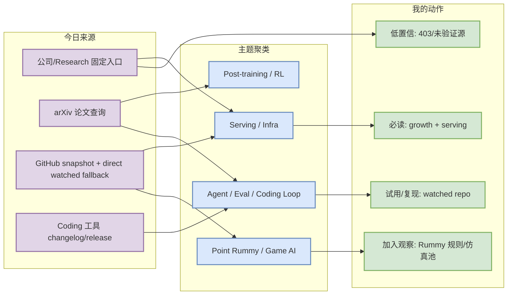
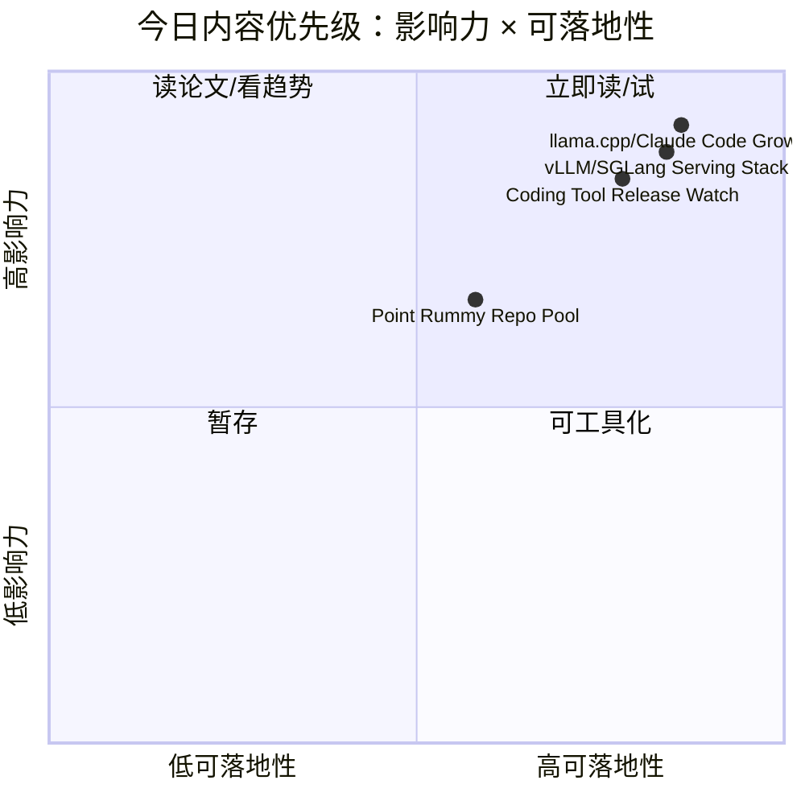

# AI Radar Daily - 2026-09-16

> 生成时间：2026-09-16 09:00 CST
> 范围：AI Infra / LLM / RL / Game AI / 大厂博客 / 论文 / GitHub / 行业资讯
> 说明：日报是总览导航页，详情页负责深度理解。
> 采集说明：今日 GitHub Search 在 Rummy 主题后 403 rate limit；已保存 mandated snapshot，并用 direct watched repo fallback 补齐 AI Infra / Loop / Coding 工具相关榜单。

## 0. 今日结论

- 今日最值得关注：GitHub broad search 受限，但 direct watched repo 显示 llama.cpp、Claude Code、Transformers、LangChain、Codex、vLLM/SGLang 仍是 AI Infra 与 coding-agent loop 的核心观察对象。
- 对 AI Infra 的直接影响：Serving / inference / training framework 榜单已用 direct fallback 补齐，适合继续跟踪 KV cache、scheduler、speculative decoding、Triton/CUDA 优化。
- 对 LLM 训练 / 推理 / Agent 的影响：Coding 工具矩阵覆盖 Claude Code、Codex、Cursor、Windsurf、Copilot、Gemini Code Assist、Qwen Code、Roo Code、Cline、Continue。
- 对 RL / 游戏模型训练的影响：Point Rummy snapshot 仍以低 star 项目为主，但包含规则引擎、AI opponent、ISMCTS/MCTS、计分器和仿真环境线索。
- 建议今天深读：llama.cpp / Claude Code 增长信号、vLLM/SGLang serving 栈、Qwen/Cline/Roo/Continue release watch、rummy-ai / Gin-Rummy-Java。

## 1. 今日态势图

## 2. 必读卡片区

> [!important] llama.cpp / Claude Code 增长信号仍强
> - 大类：GitHub
> - 小类：AI Infra / Coding Agent
> - 重点：今日增长榜来自 direct watched repo fallback，非完整全网日增，但对核心 watched set 的趋势判断仍有价值。
> - 为什么重要：llama.cpp 代表本地/边缘推理生态，Claude Code 代表 terminal coding-agent 工作流。
> - 详情：[[Details/2026-09-16/ggml-org-llama-cpp]] / [网页详情](https://github.com/dyt27666-oss/AI-news-report-obsidians/blob/main/Details/2026-09-16/ggml-org-llama-cpp.md) / [原文](https://github.com/ggml-org/llama.cpp)

> [!tip] Coding 工具矩阵已覆盖 10 个固定工具
> - 大类：工具
> - 小类：AI coding workflow
> - 重点：GitHub Release 类工具已核验 latest release；非 GitHub changelog 保留官方入口。
> - 为什么重要：直接影响多 agent coding、权限模式、IDE/CLI/TUI、上下文窗口和 MCP 集成策略。
> - 详情：[[Details/2026-09-16/qwen-code-latest-release-v0-23-4]] / [原文](https://github.com/QwenLM/qwen-code/releases/tag/v0.23.4)

> [!warning] Point Rummy 继续以低 star 项目池为主
> - 大类：GitHub / Business
> - 小类：Point Rummy / Game AI
> - 重点：今日 niche snapshot 捕获 Rummy 项目，但高质量/高 star 项稀疏；可抽规则、仿真、MCTS/AI opponent 思路。
> - 为什么重要：业务主题需要材料池，低 star 不等于无价值，但必须代码审计后再复用。
> - 详情：[[Details/2026-09-16/nakkekakke-rummy-ai]] / [原文](https://github.com/nakkekakke/rummy-ai)

## 3. 优先级矩阵

## 4. 分类清单

| 标签 | 大类 | 小类 | 标题 | 重点概括 | 为什么重要 | Obsidian 详情 | 网页详情 | 原文 |
|---|---|---|---|---|---|---|---|---|
| 必读 | GitHub | AI Infra | huggingface/transformers | 高 star watched repo fallback 第一位。 | 对模型训练/推理生态和工程依赖判断有持续价值。 | [[Details/2026-09-16/huggingface-transformers]] | [网页详情](https://github.com/dyt27666-oss/AI-news-report-obsidians/blob/main/Details/2026-09-16/huggingface-transformers.md) | [原文](https://github.com/huggingface/transformers) |
| 必读 | GitHub | Growth | ggml-org/llama.cpp | watched set 中 delta 最高；非完整全网日增。 | 增长信号可帮助判断推理/agent 工具生态热度。 | [[Details/2026-09-16/ggml-org-llama-cpp]] | [网页详情](https://github.com/dyt27666-oss/AI-news-report-obsidians/blob/main/Details/2026-09-16/ggml-org-llama-cpp.md) | [原文](https://github.com/ggml-org/llama.cpp) |
| 可 skim | 工具 | Coding Agent | Qwen/Cline/Roo/Continue release watch | release endpoint 可访问，适合后续精读 release body。 | 影响 AI coding workflow、IDE/CLI、MCP 与权限策略。 | [[Details/2026-09-16/cline-latest-release-desktop-v0-0-28]] | [网页详情](https://github.com/dyt27666-oss/AI-news-report-obsidians/blob/main/Details/2026-09-16/cline-latest-release-desktop-v0-0-28.md) | [原文](https://github.com/cline/cline/releases/tag/desktop-v0.0.28) |
| 可 skim | Business | Point Rummy | nakkekakke/rummy-ai | 低 star 但含 AI/ISMCTS/Rummy 线索。 | 可抽规则/仿真/AI opponent baseline。 | [[Details/2026-09-16/nakkekakke-rummy-ai]] | [网页详情](https://github.com/dyt27666-oss/AI-news-report-obsidians/blob/main/Details/2026-09-16/nakkekakke-rummy-ai.md) | [原文](https://github.com/nakkekakke/rummy-ai) |

## 5. 大厂资讯 / 工程博客 / Research

### 5.1 公司来源扫描矩阵

| 公司/实验室 | 来源/栏目 | 今日状态 | 高相关条数 | 代表条目 | 备注 |
|---|---|---|---:|---|---|
| OpenAI | News / Research | 无高相关新项 / 低置信 | 0 | 无 | 固定入口已扫描；[原文](https://openai.com/news/) |
| Anthropic | News / Research / Engineering | 已扫描 / 低置信观察 | 1 | [[Details/2026-09-16/anthropic-claude-code-source-watch]] | 固定入口已扫描；[原文](https://www.anthropic.com/news) |
| Google DeepMind | Blog / Research | 无高相关新项 / 低置信 | 0 | 无 | 固定入口已扫描；[原文](https://deepmind.google/discover/blog/) |
| Meta AI | Blog / Research | 无高相关新项 / 低置信 | 0 | 无 | 固定入口已扫描；[原文](https://ai.meta.com/blog/) |
| NVIDIA | Technical Blog / AI | 已扫描 / 低置信观察 | 1 | [[Details/2026-09-16/nvidia-source-watch]] | 固定入口已扫描；[原文](https://developer.nvidia.com/blog/category/artificial-intelligence/) |
| Microsoft | Research AI | 无高相关新项 / 低置信 | 0 | 无 | 固定入口已扫描；[原文](https://www.microsoft.com/en-us/research/research-area/artificial-intelligence/) |
| Hugging Face | Blog / Papers / Releases | 已扫描 / 低置信观察 | 1 | [[Details/2026-09-16/hugging-face-source-watch]] | 固定入口已扫描；[原文](https://huggingface.co/blog) |
| 腾讯 | AI Lab / 技术博客 | 无高相关新项 / 低置信 | 0 | 无 | 固定入口已扫描；[原文](https://ai.tencent.com/ailab/en/index) |
| 字节 | Seed / 技术博客 | 无高相关新项 / 低置信 | 0 | 无 | 固定入口已扫描；[原文](https://seed.bytedance.com/en/) |
| SpaceAI | Blog / News | 无高相关新项 / 低置信 | 0 | 无 | 固定入口已扫描；[原文](https://spaceai.com/) |

### 5.2 高相关大厂条目

| 标签 | 发布方/大厂 | 栏目/来源 | 标题 | 重点概括 | 工程/算法影响 | Obsidian 详情 | 网页详情 | 原文 |
|---|---|---|---|---|---|---|---|---|
| 可 skim | NVIDIA | Technical Blog / AI | NVIDIA AI 技术博客观察 | 今日未自动确认当日新文，保留 GPU / CUDA / inference 入口。 | 对 serving / kernel / cost tuning 有长期价值。 | [[Details/2026-09-16/nvidia-source-watch]] | [网页详情](https://github.com/dyt27666-oss/AI-news-report-obsidians/blob/main/Details/2026-09-16/nvidia-source-watch.md) | [原文](https://developer.nvidia.com/blog/category/artificial-intelligence/) |
| 可 skim | Hugging Face | Blog / Papers / Releases | Hugging Face Blog 观察 | 开源模型、推理库、数据/评测实践的主要信源。 | 对 transformers/vLLM/模型部署链路有间接影响。 | [[Details/2026-09-16/hugging-face-source-watch]] | [网页详情](https://github.com/dyt27666-oss/AI-news-report-obsidians/blob/main/Details/2026-09-16/hugging-face-source-watch.md) | [原文](https://huggingface.co/blog) |
| 可 skim | Anthropic | News / Research / Engineering | Anthropic / Claude Code 观察 | Claude Code 是多 agent coding workflow 的关键工具源。 | 影响 tmux 多 agent、代码审查、权限模式与上下文管理策略。 | [[Details/2026-09-16/anthropic-claude-code-source-watch]] | [网页详情](https://github.com/dyt27666-oss/AI-news-report-obsidians/blob/main/Details/2026-09-16/anthropic-claude-code-source-watch.md) | [原文](https://docs.anthropic.com/en/release-notes/claude-code) |

## 6. GitHub 高 star Top 10

> 说明：今日 broad GitHub Search 403，表格使用 direct watched repo fallback，非完整全网扫描。

| 排名 | repo | stars | forks | language | updated_at | topics | 重点概括 | 是否值得试用 | Obsidian 详情 | 原文 |
|---:|---|---:|---:|---|---|---|---|---|---|---|
| 1 | huggingface/transformers | 166197 | 34589 | Python | 2026-09-16T00:43:13Z | audio, deep-learning, deepseek, gemma, glm, hacktoberfest | 🤗 Transformers: the model-definition framework for state-of-the-art machine learning models in text, vision, audio, and  | 值得 skim/试用 | [[Details/2026-09-16/huggingface-transformers]] | [原文](https://github.com/huggingface/transformers) |
| 2 | langchain-ai/langchain | 146398 | 24470 | Python | 2026-09-16T01:02:43Z | agents, ai, ai-agents, anthropic, chatgpt, deepagents | The agent engineering platform. | 值得 skim/试用 | [[Details/2026-09-16/langchain-ai-langchain]] | [原文](https://github.com/langchain-ai/langchain) |
| 3 | anthropics/claude-code | 145194 | 23289 | TypeScript | 2026-09-16T00:37:47Z | 无 | Claude Code is an agentic coding tool that lives in your terminal, understands your codebase, and helps you code faster  | 值得 skim/试用 | [[Details/2026-09-16/anthropics-claude-code]] | [原文](https://github.com/anthropics/claude-code) |
| 4 | ggml-org/llama.cpp | 128355 | 23235 | C++ | 2026-09-16T00:57:20Z | ggml | LLM inference in C/C++ | 值得 skim/试用 | [[Details/2026-09-16/ggml-org-llama-cpp]] | [原文](https://github.com/ggml-org/llama.cpp) |
| 5 | openai/codex | 124444 | 19230 | Rust | 2026-09-16T01:02:14Z | 无 | Lightweight coding agent that runs in your terminal | 值得 skim/试用 | [[Details/2026-09-16/openai-codex]] | [原文](https://github.com/openai/codex) |
| 6 | google-gemini/gemini-cli | 107007 | 14584 | TypeScript | 2026-09-16T01:03:41Z | ai, ai-agents, cli, gemini, gemini-api, mcp-client | An open-source AI agent that brings the power of Gemini directly into your terminal. | 值得 skim/试用 | [[Details/2026-09-16/google-gemini-gemini-cli]] | [原文](https://github.com/google-gemini/gemini-cli) |
| 7 | pytorch/pytorch | 103027 | 29361 | Python | 2026-09-16T01:02:53Z | autograd, deep-learning, gpu, machine-learning, neural-network, numpy | Tensors and Dynamic neural networks in Python with strong GPU acceleration | 值得 skim/试用 | [[Details/2026-09-16/pytorch-pytorch]] | [原文](https://github.com/pytorch/pytorch) |
| 8 | vllm-project/vllm | 91866 | 22244 | Python | 2026-09-16T00:33:13Z | amd, blackwell, cuda, deepseek, deepseek-v3, gpt | A high-throughput and memory-efficient inference and serving engine for LLMs | 值得 skim/试用 | [[Details/2026-09-16/vllm-project-vllm]] | [原文](https://github.com/vllm-project/vllm) |
| 9 | modelcontextprotocol/servers | 90368 | 11640 | TypeScript | 2026-09-16T00:56:31Z | 无 | Model Context Protocol Servers | 值得 skim/试用 | [[Details/2026-09-16/modelcontextprotocol-servers]] | [原文](https://github.com/modelcontextprotocol/servers) |
| 10 | cline/cline | 68131 | 7367 | TypeScript | 2026-09-16T01:05:15Z | 无 | Autonomous coding agent as an SDK, IDE extension, or CLI assistant. | 值得 skim/试用 | [[Details/2026-09-16/cline-cline]] | [原文](https://github.com/cline/cline) |

## 7. GitHub star 增长最快 Top 10

> 说明：优先按历史 snapshot 计算 watched repo delta；这是 direct watched repo fallback，非完整 all-GitHub 日增。

| 排名 | repo | stars_delta | stars | forks | language | updated_at | 增长依据 | 重点概括 | Obsidian 详情 | 原文 |
|---:|---|---:|---:|---:|---|---|---|---|---|---|
| 1 | ggml-org/llama.cpp | 3305 | 128355 | 23235 | C++ | 2026-09-16T00:57:20Z | direct watched repo fallback，非完整全网日增 | LLM inference in C/C++ | [[Details/2026-09-16/ggml-org-llama-cpp]] | [原文](https://github.com/ggml-org/llama.cpp) |
| 2 | anthropics/claude-code | 1607 | 145194 | 23289 | TypeScript | 2026-09-16T00:37:47Z | direct watched repo fallback，非完整全网日增 | Claude Code is an agentic coding tool that lives in your terminal, understands your codebase, and helps you code faster  | [[Details/2026-09-16/anthropics-claude-code]] | [原文](https://github.com/anthropics/claude-code) |
| 3 | huggingface/transformers | 674 | 166197 | 34589 | Python | 2026-09-16T00:43:13Z | direct watched repo fallback，非完整全网日增 | 🤗 Transformers: the model-definition framework for state-of-the-art machine learning models in text, vision, audio, and  | [[Details/2026-09-16/huggingface-transformers]] | [原文](https://github.com/huggingface/transformers) |
| 4 | openai/codex | 611 | 124444 | 19230 | Rust | 2026-09-16T01:02:14Z | direct watched repo fallback，非完整全网日增 | Lightweight coding agent that runs in your terminal | [[Details/2026-09-16/openai-codex]] | [原文](https://github.com/openai/codex) |
| 5 | langchain-ai/langchain | 512 | 146398 | 24470 | Python | 2026-09-16T01:02:43Z | direct watched repo fallback，非完整全网日增 | The agent engineering platform. | [[Details/2026-09-16/langchain-ai-langchain]] | [原文](https://github.com/langchain-ai/langchain) |
| 6 | vllm-project/vllm | 209 | 91866 | 22244 | Python | 2026-09-16T00:33:13Z | direct watched repo fallback，非完整全网日增 | A high-throughput and memory-efficient inference and serving engine for LLMs | [[Details/2026-09-16/vllm-project-vllm]] | [原文](https://github.com/vllm-project/vllm) |
| 7 | cline/cline | 180 | 68131 | 7367 | TypeScript | 2026-09-16T01:05:15Z | direct watched repo fallback，非完整全网日增 | Autonomous coding agent as an SDK, IDE extension, or CLI assistant. | [[Details/2026-09-16/cline-cline]] | [原文](https://github.com/cline/cline) |
| 8 | langchain-ai/langgraph | 132 | 41713 | 7048 | Python | 2026-09-16T00:47:27Z | direct watched repo fallback，非完整全网日增 | Build resilient agents. | [[Details/2026-09-16/langchain-ai-langgraph]] | [原文](https://github.com/langchain-ai/langgraph) |
| 9 | sgl-project/sglang | 95 | 36005 | 8885 | Python | 2026-09-16T00:54:11Z | direct watched repo fallback，非完整全网日增 | SGLang is a high-performance serving framework for large language models and multimodal models. | [[Details/2026-09-16/sgl-project-sglang]] | [原文](https://github.com/sgl-project/sglang) |
| 10 | modelcontextprotocol/servers | 73 | 90368 | 11640 | TypeScript | 2026-09-16T00:56:31Z | direct watched repo fallback，非完整全网日增 | Model Context Protocol Servers | [[Details/2026-09-16/modelcontextprotocol-servers]] | [原文](https://github.com/modelcontextprotocol/servers) |

## 8. Coding 工具 / AI 工具功能更新

### 8.1 Coding 工具扫描矩阵

| 工具 | 厂商 | 来源类型 | 今日状态 | 代表更新 | 对我的影响 | 原文 |
|---|---|---|---|---|---|---|
| Claude Code | Anthropic | Changelog / Release Notes | 已扫描 | 未发现可验证的当日高相关新项 | 关注 agent mode / MCP / IDE / CLI / 权限 / 上下文变化。 | [原文](https://docs.anthropic.com/en/release-notes/claude-code) |
| OpenAI Codex | OpenAI | Changelog / Docs | 已扫描 | 未发现可验证的当日高相关新项 | 关注 agent mode / MCP / IDE / CLI / 权限 / 上下文变化。 | [原文](https://developers.openai.com/codex/changelog) |
| Cursor | Cursor | Changelog | 已扫描 | 未发现可验证的当日高相关新项 | 关注 agent mode / MCP / IDE / CLI / 权限 / 上下文变化。 | [原文](https://cursor.com/changelog) |
| Windsurf | Windsurf | Changelog | 已扫描 | 未发现可验证的当日高相关新项 | 关注 agent mode / MCP / IDE / CLI / 权限 / 上下文变化。 | [原文](https://windsurf.com/changelog) |
| GitHub Copilot | GitHub | Changelog / Blog | 已扫描 | 未发现可验证的当日高相关新项 | 关注 agent mode / MCP / IDE / CLI / 权限 / 上下文变化。 | [原文](https://github.blog/changelog/label/copilot/) |
| Gemini Code Assist | Google | Release Notes | 已扫描 | 未发现可验证的当日高相关新项 | 关注 agent mode / MCP / IDE / CLI / 权限 / 上下文变化。 | [原文](https://cloud.google.com/gemini/docs/codeassist/release-notes) |
| Qwen Code | Alibaba/Qwen | GitHub Releases | Release endpoint 可访问 | Latest release v0.23.4（2026-09-14） | 需读 release body 判断 agent/MCP/IDE/权限影响；详情 [[Details/2026-09-16/qwen-code-latest-release-v0-23-4]]。 | [原文](https://github.com/QwenLM/qwen-code/releases/tag/v0.23.4) |
| Roo Code | Roo Code | GitHub Releases | Release endpoint 可访问 | Latest release v3.54.0（2026-05-15） | 需读 release body 判断 agent/MCP/IDE/权限影响；详情 [[Details/2026-09-16/roo-code-latest-release-v3-54-0]]。 | [原文](https://github.com/RooCodeInc/Roo-Code/releases/tag/v3.54.0) |
| Cline | Cline | GitHub Releases | Release endpoint 可访问 | Latest release desktop-v0.0.28（2026-09-15） | 需读 release body 判断 agent/MCP/IDE/权限影响；详情 [[Details/2026-09-16/cline-latest-release-desktop-v0-0-28]]。 | [原文](https://github.com/cline/cline/releases/tag/desktop-v0.0.28) |
| Continue | Continue | GitHub Releases | Release endpoint 可访问 | Latest release v2.0.0-vscode（2026-06-19） | 需读 release body 判断 agent/MCP/IDE/权限影响；详情 [[Details/2026-09-16/continue-latest-release-v2-0-0-vscode]]。 | [原文](https://github.com/continuedev/continue/releases/tag/v2.0.0-vscode) |

### 8.2 高相关工具更新

| 标签 | 工具/厂商 | 来源类型 | 标题/功能 | 重点概括 | 对 AI coding 工作流的影响 | Obsidian 详情 | 网页详情 | 原文 |
|---|---|---|---|---|---|---|---|---|
| 可 skim | Qwen Code | GitHub Releases | Latest release v0.23.4（2026-09-14） | 通过 GitHub Releases 直接核验最新 tag；具体功能需读 release body。 | 影响本地/IDE 执行、模型接入、MCP/权限/上下文工作流。 | [[Details/2026-09-16/qwen-code-latest-release-v0-23-4]] | [网页详情](https://github.com/dyt27666-oss/AI-news-report-obsidians/blob/main/Details/2026-09-16/qwen-code-latest-release-v0-23-4.md) | [原文](https://github.com/QwenLM/qwen-code/releases/tag/v0.23.4) |
| 可 skim | Roo Code | GitHub Releases | Latest release v3.54.0（2026-05-15） | 通过 GitHub Releases 直接核验最新 tag；具体功能需读 release body。 | 影响本地/IDE 执行、模型接入、MCP/权限/上下文工作流。 | [[Details/2026-09-16/roo-code-latest-release-v3-54-0]] | [网页详情](https://github.com/dyt27666-oss/AI-news-report-obsidians/blob/main/Details/2026-09-16/roo-code-latest-release-v3-54-0.md) | [原文](https://github.com/RooCodeInc/Roo-Code/releases/tag/v3.54.0) |
| 可 skim | Cline | GitHub Releases | Latest release desktop-v0.0.28（2026-09-15） | 通过 GitHub Releases 直接核验最新 tag；具体功能需读 release body。 | 影响本地/IDE 执行、模型接入、MCP/权限/上下文工作流。 | [[Details/2026-09-16/cline-latest-release-desktop-v0-0-28]] | [网页详情](https://github.com/dyt27666-oss/AI-news-report-obsidians/blob/main/Details/2026-09-16/cline-latest-release-desktop-v0-0-28.md) | [原文](https://github.com/cline/cline/releases/tag/desktop-v0.0.28) |
| 可 skim | Continue | GitHub Releases | Latest release v2.0.0-vscode（2026-06-19） | 通过 GitHub Releases 直接核验最新 tag；具体功能需读 release body。 | 影响本地/IDE 执行、模型接入、MCP/权限/上下文工作流。 | [[Details/2026-09-16/continue-latest-release-v2-0-0-vscode]] | [网页详情](https://github.com/dyt27666-oss/AI-news-report-obsidians/blob/main/Details/2026-09-16/continue-latest-release-v2-0-0-vscode.md) | [原文](https://github.com/continuedev/continue/releases/tag/v2.0.0-vscode) |

## 9. Point Rummy / Indian Rummy 业务主题

### 9.1 GitHub 候选

| 标签 | repo | stars | forks | language | updated_at | 重点概括 | 业务可用性 | Obsidian 详情 | 原文 |
|---|---|---:|---:|---|---|---|---|---|---|
| 可 skim | nakkekakke/rummy-ai | 12 | 5 | Java | 2026-08-27T21:23:08Z | Text based classic Rummy game with an AI that uses ISMCTS. Data Structures and Algorithms course project, University of Helsinki | 可用于规则建模、AI opponent、仿真/评测或前端实现参考；低 star 项需代码审计。 | [[Details/2026-09-16/nakkekakke-rummy-ai]] | [原文](https://github.com/nakkekakke/rummy-ai) |
| 可 skim | jmhummel/Gin-Rummy-Java | 8 | 0 | Java | 2023-08-16T16:12:58Z | Java-based Gin Rummy console game, with an AI opponent | 可用于规则建模、AI opponent、仿真/评测或前端实现参考；低 star 项需代码审计。 | [[Details/2026-09-16/jmhummel-gin-rummy-java]] | [原文](https://github.com/jmhummel/Gin-Rummy-Java) |
| 可 skim | mudont/indian-rummy | 5 | 0 | TypeScript | 2025-08-08T21:05:04Z | Typescript library for Indian Rummy card game | 可用于规则建模、AI opponent、仿真/评测或前端实现参考；低 star 项需代码审计。 | [[Details/2026-09-16/mudont-indian-rummy]] | [原文](https://github.com/mudont/indian-rummy) |
| 可 skim | dv-rastogi/Rummy | 5 | 0 | Python | 2023-09-26T11:21:39Z | Variation of classical Indian Rummy made in Pygame | 可用于规则建模、AI opponent、仿真/评测或前端实现参考；低 star 项需代码审计。 | [[Details/2026-09-16/dv-rastogi-rummy]] | [原文](https://github.com/dv-rastogi/Rummy) |
| 可 skim | vahsek300501/Indian-Rummy- | 4 | 3 | Python | 2023-09-26T11:21:46Z | Indian Rummy made in Python using PyGame | 可用于规则建模、AI opponent、仿真/评测或前端实现参考；低 star 项需代码审计。 | [[Details/2026-09-16/vahsek300501-indian-rummy]] | [原文](https://github.com/vahsek300501/Indian-Rummy-) |
| 可 skim | SCFlanagan/Rummy | 4 | 6 | JavaScript | 2025-07-25T21:17:08Z | This project is a recreation of the classic card game Rummy. It features an AI player to play against, a hand of cards that can be dragged a | 可用于规则建模、AI opponent、仿真/评测或前端实现参考；低 star 项需代码审计。 | [[Details/2026-09-16/scflanagan-rummy]] | [原文](https://github.com/SCFlanagan/Rummy) |
| 可 skim | mcartmell/gin-rummy-bot | 4 | 2 | Perl | 2024-10-30T20:06:17Z | A web-based Gin Rummy game and AI | 可用于规则建模、AI opponent、仿真/评测或前端实现参考；低 star 项需代码审计。 | [[Details/2026-09-16/mcartmell-gin-rummy-bot]] | [原文](https://github.com/mcartmell/gin-rummy-bot) |
| 可 skim | Mohitkumar-559/RummyServer | 2 | 1 | JavaScript | 2024-03-17T03:48:34Z | Rummy game server for game that contain deal rummy and point rummy | 可用于规则建模、AI opponent、仿真/评测或前端实现参考；低 star 项需代码审计。 | [[Details/2026-09-16/mohitkumar-559-rummyserver]] | [原文](https://github.com/Mohitkumar-559/RummyServer) |
| 可 skim | abubakarmunir712/dsa-final-project | 2 | 1 | Python | 2026-06-27T06:34:26Z | A Python-based multiplayer Indian Rummy game with support for AI opponents and LAN play. Implements data structures like linked lists, stack | 可用于规则建模、AI opponent、仿真/评测或前端实现参考；低 star 项需代码审计。 | [[Details/2026-09-16/abubakarmunir712-dsa-final-project]] | [原文](https://github.com/abubakarmunir712/dsa-final-project) |
| 可 skim | Ductapemaster/RummyAI | 2 | 0 | Python | 2017-07-11T12:12:49Z | Designing an AI to play Gin Rummy | 可用于规则建模、AI opponent、仿真/评测或前端实现参考；低 star 项需代码审计。 | [[Details/2026-09-16/ductapemaster-rummyai]] | [原文](https://github.com/Ductapemaster/RummyAI) |

### 9.2 论文 / 资料候选

| 标签 | 来源 | 标题 | 作者/机构 | 重点概括 | 对 Point Rummy 业务有什么用 | Obsidian 详情 | 原文 |
|---|---|---|---|---|---|---|---|
| 低置信 | arXiv API | 今日未确认新的 Point/Indian Rummy 强相关论文 | - | Rummy 专项论文查询结果稀疏；保留不完全信息博弈、ISMCTS/MCTS、self-play 作为扩展关键词。 | 用于规则建模、belief/state abstraction、自博弈环境和评测基准设计。 | 无 | [arXiv Search](https://arxiv.org/search/?query=indian+rummy+reinforcement+learning&searchtype=all) |

### 9.3 业务可用性判断

| 方向 | 今日信号 | 可用性 | 下一步 |
|---|---|---|---|
| 规则引擎 / 计分 | 多个低 star repo 含 score tracker / rules engine / meld validation | 中：适合抽测试用例，不适合直接复用 | 建立 Indian Rummy rules test suite，先验证 sequence/set/joker/drop 规则 |
| Bot / RL Agent | rummy-ai、Gin-Rummy-Java、RummyAI、AI opponent 项 | 中：可借鉴环境接口和 ISMCTS/MCTS baseline | 选 2 个 Python/Java 项做 30 分钟代码审计 |
| 仿真 / 评测 | RummyVision / RummyServer / score tracker 项 | 中：对 evaluator 与前后端状态建模有启发 | 抽象成自有 evaluator + parallel rollout 接口 |

## 10. Loop Engineer / Loop Engineering 主题

### 10.1 Loop Engineer GitHub 高 star Top 10

| 排名 | repo | stars | forks | language | updated_at | topics | 重点概括 | 是否值得试用 | Obsidian 详情 | 原文 |
|---:|---|---:|---:|---|---|---|---|---|---|---|
| 1 | huggingface/transformers | 166197 | 34589 | Python | 2026-09-16T00:43:13Z | audio, deep-learning, deepseek, gemma, glm, hacktoberfest | 🤗 Transformers: the model-definition framework for state-of-the-art machine learning models in text, vision, audio, and  | 值得 skim/试用 | [[Details/2026-09-16/huggingface-transformers]] | [原文](https://github.com/huggingface/transformers) |
| 2 | langchain-ai/langchain | 146398 | 24470 | Python | 2026-09-16T01:02:43Z | agents, ai, ai-agents, anthropic, chatgpt, deepagents | The agent engineering platform. | 值得 skim/试用 | [[Details/2026-09-16/langchain-ai-langchain]] | [原文](https://github.com/langchain-ai/langchain) |
| 3 | anthropics/claude-code | 145194 | 23289 | TypeScript | 2026-09-16T00:37:47Z | 无 | Claude Code is an agentic coding tool that lives in your terminal, understands your codebase, and helps you code faster  | 值得 skim/试用 | [[Details/2026-09-16/anthropics-claude-code]] | [原文](https://github.com/anthropics/claude-code) |
| 4 | openai/codex | 124444 | 19230 | Rust | 2026-09-16T01:02:14Z | 无 | Lightweight coding agent that runs in your terminal | 值得 skim/试用 | [[Details/2026-09-16/openai-codex]] | [原文](https://github.com/openai/codex) |
| 5 | google-gemini/gemini-cli | 107007 | 14584 | TypeScript | 2026-09-16T01:03:41Z | ai, ai-agents, cli, gemini, gemini-api, mcp-client | An open-source AI agent that brings the power of Gemini directly into your terminal. | 值得 skim/试用 | [[Details/2026-09-16/google-gemini-gemini-cli]] | [原文](https://github.com/google-gemini/gemini-cli) |
| 6 | vllm-project/vllm | 91866 | 22244 | Python | 2026-09-16T00:33:13Z | amd, blackwell, cuda, deepseek, deepseek-v3, gpt | A high-throughput and memory-efficient inference and serving engine for LLMs | 值得 skim/试用 | [[Details/2026-09-16/vllm-project-vllm]] | [原文](https://github.com/vllm-project/vllm) |
| 7 | cline/cline | 68131 | 7367 | TypeScript | 2026-09-16T01:05:15Z | 无 | Autonomous coding agent as an SDK, IDE extension, or CLI assistant. | 值得 skim/试用 | [[Details/2026-09-16/cline-cline]] | [原文](https://github.com/cline/cline) |
| 8 | Aider-AI/aider | 48977 | 4951 | Python | 2026-09-16T00:12:37Z | anthropic, chatgpt, claude-3, cli, command-line, gemini | aider is AI pair programming in your terminal | 值得 skim/试用 | [[Details/2026-09-16/aider-ai-aider]] | [原文](https://github.com/Aider-AI/aider) |
| 9 | langchain-ai/langgraph | 41713 | 7048 | Python | 2026-09-16T00:47:27Z | agents, ai, ai-agents, chatgpt, deepagents, enterprise | Build resilient agents. | 值得 skim/试用 | [[Details/2026-09-16/langchain-ai-langgraph]] | [原文](https://github.com/langchain-ai/langgraph) |
| 10 | sgl-project/sglang | 36005 | 8885 | Python | 2026-09-16T00:54:11Z | attention, blackwell, cuda, deepseek, diffusion, glm | SGLang is a high-performance serving framework for large language models and multimodal models. | 值得 skim/试用 | [[Details/2026-09-16/sgl-project-sglang]] | [原文](https://github.com/sgl-project/sglang) |

### 10.2 Loop Engineer GitHub star 增长最快 Top 10

| 排名 | repo | stars_delta | stars | forks | language | updated_at | 增长依据 | 重点概括 | Obsidian 详情 | 原文 |
|---:|---|---:|---:|---:|---|---|---|---|---|---|
| 1 | anthropics/claude-code | 1607 | 145194 | 23289 | TypeScript | 2026-09-16T00:37:47Z | direct watched repo fallback，非完整全网日增 | Claude Code is an agentic coding tool that lives in your terminal, understands your codebase, and helps you code faster  | [[Details/2026-09-16/anthropics-claude-code]] | [原文](https://github.com/anthropics/claude-code) |
| 2 | huggingface/transformers | 674 | 166197 | 34589 | Python | 2026-09-16T00:43:13Z | direct watched repo fallback，非完整全网日增 | 🤗 Transformers: the model-definition framework for state-of-the-art machine learning models in text, vision, audio, and  | [[Details/2026-09-16/huggingface-transformers]] | [原文](https://github.com/huggingface/transformers) |
| 3 | openai/codex | 611 | 124444 | 19230 | Rust | 2026-09-16T01:02:14Z | direct watched repo fallback，非完整全网日增 | Lightweight coding agent that runs in your terminal | [[Details/2026-09-16/openai-codex]] | [原文](https://github.com/openai/codex) |
| 4 | langchain-ai/langchain | 512 | 146398 | 24470 | Python | 2026-09-16T01:02:43Z | direct watched repo fallback，非完整全网日增 | The agent engineering platform. | [[Details/2026-09-16/langchain-ai-langchain]] | [原文](https://github.com/langchain-ai/langchain) |
| 5 | vllm-project/vllm | 209 | 91866 | 22244 | Python | 2026-09-16T00:33:13Z | direct watched repo fallback，非完整全网日增 | A high-throughput and memory-efficient inference and serving engine for LLMs | [[Details/2026-09-16/vllm-project-vllm]] | [原文](https://github.com/vllm-project/vllm) |
| 6 | cline/cline | 180 | 68131 | 7367 | TypeScript | 2026-09-16T01:05:15Z | direct watched repo fallback，非完整全网日增 | Autonomous coding agent as an SDK, IDE extension, or CLI assistant. | [[Details/2026-09-16/cline-cline]] | [原文](https://github.com/cline/cline) |
| 7 | langchain-ai/langgraph | 132 | 41713 | 7048 | Python | 2026-09-16T00:47:27Z | direct watched repo fallback，非完整全网日增 | Build resilient agents. | [[Details/2026-09-16/langchain-ai-langgraph]] | [原文](https://github.com/langchain-ai/langgraph) |
| 8 | sgl-project/sglang | 95 | 36005 | 8885 | Python | 2026-09-16T00:54:11Z | direct watched repo fallback，非完整全网日增 | SGLang is a high-performance serving framework for large language models and multimodal models. | [[Details/2026-09-16/sgl-project-sglang]] | [原文](https://github.com/sgl-project/sglang) |
| 9 | google-gemini/gemini-cli | 41 | 107007 | 14584 | TypeScript | 2026-09-16T01:03:41Z | direct watched repo fallback，非完整全网日增 | An open-source AI agent that brings the power of Gemini directly into your terminal. | [[Details/2026-09-16/google-gemini-gemini-cli]] | [原文](https://github.com/google-gemini/gemini-cli) |
| 10 | Aider-AI/aider | 40 | 48977 | 4951 | Python | 2026-09-16T00:12:37Z | direct watched repo fallback，非完整全网日增 | aider is AI pair programming in your terminal | [[Details/2026-09-16/aider-ai-aider]] | [原文](https://github.com/Aider-AI/aider) |

### 10.3 Loop Engineering 方法信号

| 标签 | 来源 | 标题 | 重点概括 | 对 AI coding 工作流的影响 | Obsidian 详情 | 原文 |
|---|---|---|---|---|---|---|
| 必读 | GitHub watched fallback | Coding agent loop / harness 项目池 | LangGraph、MCP servers、Claude/Codex/Gemini/Qwen/Cline/Roo/Continue/Aider 构成 today loop engineering watchlist。 | 用于设计多 agent 编排、任务分解、上下文/权限控制、review loop 和 eval loop。 | [[Details/2026-09-16/langchain-ai-langgraph]] | [原文](https://github.com/langchain-ai/langgraph) |

## 11. 论文

### 11.1 LLM / Agent / RL / Serving

| 标签 | 论文来源 | 论文 | 作者/机构 | 重点概括 | 工程/研究价值 | Obsidian 详情 | 网页详情 | PDF/原文 |
|---|---|---|---|---|---|---|---|---|
| 可 skim | arXiv / 预印本 | An Empirical Study of Counterfactual Self-Explanations in LLMs | Giannis Kalyvas, Giorgos Filandrianos, Orfeas Menis Mastromichalakis | Large language models can easily generate explanations for their own outputs, but such self-explanations are not necessarily faithful to the model's behavior. We study this issue through counterfactual self-explanations, where a model minim | 关注 cs.CL 对 serving、agent eval、post-training 或 RL 的启发。 | [[Details/2026-09-16/an-empirical-study-of-counterfactual-self-explanations-in-llms]] | [网页详情](https://github.com/dyt27666-oss/AI-news-report-obsidians/blob/main/Details/2026-09-16/an-empirical-study-of-counterfactual-self-explanations-in-llms.md) | [PDF](https://arxiv.org/pdf/2609.17119v1) / [abs](https://arxiv.org/abs/2609.17119v1) |
| 可 skim | arXiv / 预印本 | Finding Common Mistakes In Modelling With Mathematical Formalisms Using LLMs | Lilian Killich, Marko Schmellenkamp, Fabian Vehlken | Modelling with mathematical formalisms like logical formulas, mathematical equations, or regular expressions is an important yet challenging task for students of computer science and other STEM disciplines. Identifying common mistakes occur | 关注 cs.CY,cs.AI,cs.LO 对 serving、agent eval、post-training 或 RL 的启发。 | [[Details/2026-09-16/finding-common-mistakes-in-modelling-with-mathematical-formalisms-using-llms]] | [网页详情](https://github.com/dyt27666-oss/AI-news-report-obsidians/blob/main/Details/2026-09-16/finding-common-mistakes-in-modelling-with-mathematical-formalisms-using-llms.md) | [PDF](https://arxiv.org/pdf/2609.17111v1) / [abs](https://arxiv.org/abs/2609.17111v1) |
| 可 skim | arXiv / 预印本 | LOTUSim-Energy: A Maritime Simulator for Human-Drone Interaction in Autonomous Offshore Operation \&amp; Maintenance | Juliette Grosset, Marie Dubromel, Hélène Lechêne | Offshore maintenance requires operations in the air, the surface, and the subsea domain and include human supervision. This paper presents LOTUSim-Energy, a real-time maritime simulator designed for multi-domain human--drone interaction for | 关注 cs.RO 对 serving、agent eval、post-training 或 RL 的启发。 | [[Details/2026-09-16/lotusim-energy-a-maritime-simulator-for-human-drone-interaction-in-autonomous-offshore-operation-amp-maintenance]] | [网页详情](https://github.com/dyt27666-oss/AI-news-report-obsidians/blob/main/Details/2026-09-16/lotusim-energy-a-maritime-simulator-for-human-drone-interaction-in-autonomous-offshore-operation-amp-maintenance.md) | [PDF](https://arxiv.org/pdf/2609.17124v1) / [abs](https://arxiv.org/abs/2609.17124v1) |
| 可 skim | arXiv / 预印本 | AI for Science with GPT-6 Astra: Thermal Design and Electrothermal Analysis of 2D CFET | Min-Hui Kim, Khushi Sharma, Sarah Zhang | Thermal optimization of 2D CFET inverters requires testing structural proposals against their electrical costs. We examine these research tasks using an AI agent workflow within a supplied electrothermal model. At 12 nm, Astra selects a red | 关注 cond-mat.mtrl-sci,cs.AI,cs.AR 对 serving、agent eval、post-training 或 RL 的启发。 | [[Details/2026-09-16/ai-for-science-with-gpt-6-astra-thermal-design-and-electrothermal-analysis-of-2d-cfet]] | [网页详情](https://github.com/dyt27666-oss/AI-news-report-obsidians/blob/main/Details/2026-09-16/ai-for-science-with-gpt-6-astra-thermal-design-and-electrothermal-analysis-of-2d-cfet.md) | [PDF](https://arxiv.org/pdf/2609.17123v1) / [abs](https://arxiv.org/abs/2609.17123v1) |

## 12. 资讯 / 其他 GitHub 项目

### 12.1 AI Infra / Agent watched extras

| 标签 | 来源 | 标题 | 重点概括 | 对我有什么用 | Obsidian 详情 | 网页详情 | 原文 |
|---|---|---|---|---|---|---|---|
| 可 skim | GitHub | NVIDIA/TensorRT-LLM、DeepSpeed、Megatron-LM、verl、OpenRLHF | direct watched repo 已纳入 snapshot，未进入 Top 10 的项目仍是训练/推理链路观察源。 | 后续可按 serving/training/post-training 子主题拆出专项。 | [[Details/2026-09-16/nvidia-tensorrt-llm]] | [网页详情](https://github.com/dyt27666-oss/AI-news-report-obsidians/blob/main/Details/2026-09-16/nvidia-tensorrt-llm.md) | [原文](https://github.com/NVIDIA/TensorRT-LLM) |

## 13. 按主题索引

### AI Infra / Serving / Training
- [[Details/2026-09-16/vllm-project-vllm]] - serving engine / KV cache / scheduler watch
- [[Details/2026-09-16/sgl-project-sglang]] - high-performance serving framework
- [[Details/2026-09-16/ggml-org-llama-cpp]] - local inference / edge deployment

### LLM / Agent / RAG / Evaluation
- [[Details/2026-09-16/langchain-ai-langgraph]] - agent loop / graph runtime
- [[Details/2026-09-16/modelcontextprotocol-servers]] - MCP server ecosystem

### RL / Game AI / World Model
- [[Details/2026-09-16/nakkekakke-rummy-ai]] - Rummy ISMCTS/AI opponent watch

### Point Rummy / Indian Rummy
- [[Details/2026-09-16/nakkekakke-rummy-ai]] - 规则/AI baseline
- [[Details/2026-09-16/jmhummel-gin-rummy-java]] - Gin Rummy AI opponent

### Loop Engineer / Coding Agent Loop
- [[Details/2026-09-16/anthropics-claude-code]] - terminal coding agent
- [[Details/2026-09-16/openai-codex]] - terminal coding agent
- [[Details/2026-09-16/aider-ai-aider]] - pair programming CLI

### 公司 / 实验室
- OpenAI: [News](https://openai.com/news/)
- Anthropic: [[Details/2026-09-16/anthropic-claude-code-source-watch]]
- DeepMind: [Blog](https://deepmind.google/discover/blog/)
- Meta: [Blog](https://ai.meta.com/blog/)
- NVIDIA: [[Details/2026-09-16/nvidia-source-watch]]
- 腾讯 / 字节 / 国内大厂: [Tencent AI Lab](https://ai.tencent.com/ailab/en/index) / [ByteDance Seed](https://seed.bytedance.com/en/)

## 14. 值得后续深挖

| 标签 | 大类 | 小类 | 标题 | 后续动作 | Obsidian 详情 | 原文 |
|---|---|---|---|---|---|---|
| 必读 | GitHub | Serving | vLLM / SGLang / TensorRT-LLM 对比 | 看 scheduler、KV cache、benchmark、OpenAI API 兼容和 GPU kernel 路线。 | [[Details/2026-09-16/vllm-project-vllm]] | [原文](https://github.com/vllm-project/vllm) |
| 可 skim | Business | Point Rummy | Rummy repo code audit | 抽两个 repo 做规则测试/仿真接口审计。 | [[Details/2026-09-16/nakkekakke-rummy-ai]] | [原文](https://github.com/nakkekakke/rummy-ai) |
| 可 skim | Tool | Coding Agent | Qwen/Cline/Roo/Continue release body | 判断是否出现 agent mode/MCP/权限/IDE/CLI 变化。 | [[Details/2026-09-16/qwen-code-latest-release-v0-23-4]] | [原文](https://github.com/QwenLM/qwen-code/releases/tag/v0.23.4) |

## 15. 采集失败或低置信来源

- GitHub Search 在 Rummy 主题后触发 403 rate limit；已保留当前 snapshot 并使用 direct watched repo fallback，所有 broad/growth 表均标注“非完整全网日增”。
- 公司博客固定入口已扫描/记录；未自动确认当日新文的公司不当作新闻，只作为低置信观察入口。
- Point Rummy 论文专项未确认新强相关论文，保留 arXiv search 链接。

## 16. 归档标签

#ai-radar #daily #ai-infra #llm #rl #point-rummy #loop-engineering
