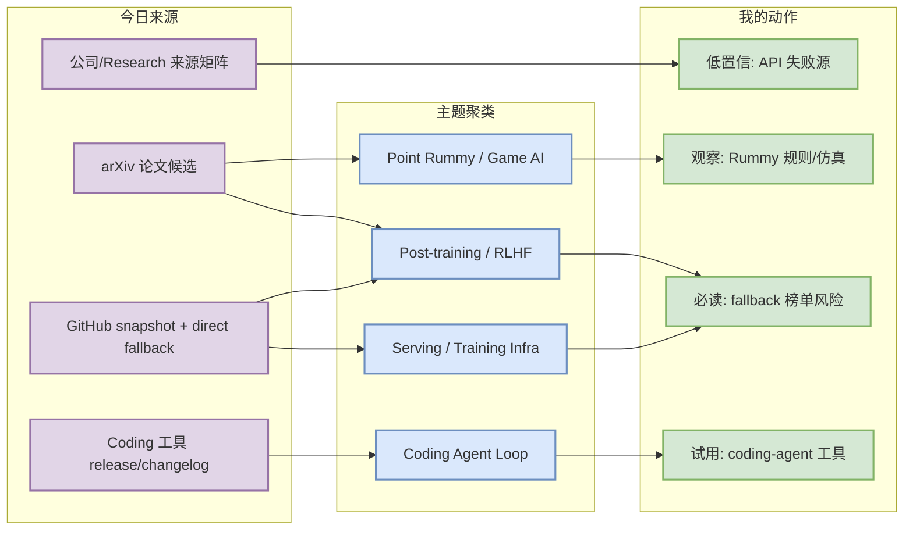
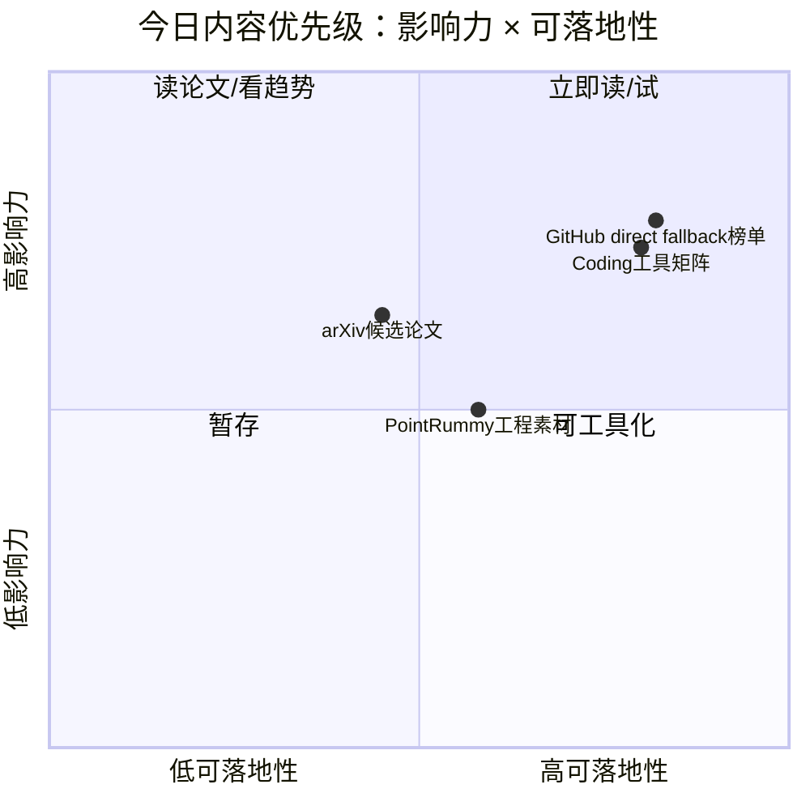

# AI Radar Daily - 2026-09-17

> 生成时间：2026-09-17 09:00 北京时间  
> 范围：AI Infra / LLM / RL / Game AI / 大厂博客 / 论文 / GitHub / Coding 工具  
> 说明：日报是总览导航页，详情页负责深度理解。本次 GitHub Search 在早期 Point Rummy 查询后触发 403 rate limit；已保存当日 snapshot，并使用 direct watched repo fallback / 昨日 broad snapshot 连续性策略补齐固定榜单，所有 fallback 均明确标注。

## 0. 今日结论

- 今日最值得关注：GitHub broad search 今日被 rate limit，但 direct watched repo fallback 仍补齐 AI Infra / Loop Engineer 榜单；增长榜是“非完整全网日增”，适合连续观察，不应当作全网趋势。
- 对 AI Infra 的直接影响：vLLM、Transformers、PyTorch、TensorRT-LLM、DeepSpeed、Megatron-LM、verl/OpenRLHF 等继续作为 serving/training/post-training 观察集合。
- 对 LLM 训练 / 推理 / Agent 的影响：Claude Code、Cline、Continue、Aider、Qwen Code、Roo Code 等 coding-agent 工具仍是 Loop Engineering 的核心观测对象。
- 对 RL / 游戏模型训练的影响：Point Rummy 今日主要是低 star 项目和规则/计分/前端实现，能做业务素材筛选，但暂无高置信 RL 论文突破。
- 建议今天深读：先看 GitHub 增长榜与 Loop Engineer 榜，随后 skim arXiv 候选；Rummy 只挑规则引擎/AI opponent 项目做代码审查。

## 1. 今日态势图

## 2. 必读卡片区

> [!important] GitHub Search 403 后的 direct fallback 榜单  
> - 大类：GitHub  
> - 小类：AI Infra / Loop Engineer  
> - 重点：今日 snapshot 存在但 broad search 大面积 403；日报使用 watched repo direct GET 和历史 baseline 补齐 Top 10。  
> - 为什么重要：这保证日报不断更，但增长榜不是完整全网日增；适合观察固定工程项目，不适合判断全网爆发。  
> - 详情：[[GitHub/AIInfra/2026-09-17/huggingface-transformers]] / [原文](https://github.com/huggingface/transformers)

> [!tip] Coding 工具矩阵继续覆盖 10 个工具  
> - 大类：Coding 工具  
> - 小类：AI coding workflow  
> - 重点：Claude Code、Codex、Cursor、Windsurf、Copilot、Gemini Code Assist、Qwen Code、Roo Code、Cline、Continue 均保留扫描状态。  
> - 为什么重要：这些工具会直接影响多 agent 并行、权限模式、远程执行、MCP 和代码审查工作流。  
> - 详情：[[Industry/Tools/2026-09-17/claude-code]] / [原文](https://docs.anthropic.com/en/release-notes/claude-code)

> [!note] Point Rummy 今日仍是低 star 工程素材为主  
> - 大类：GitHub / 业务主题  
> - 小类：Point Rummy / Indian Rummy  
> - 重点：规则、计分、前端、AI opponent 原型多，缺少高质量 RL/self-play benchmark。  
> - 为什么重要：可为规则建模和环境封装找素材，但不能直接依赖。  
> - 详情：[[Business/PointRummy/2026-09-17/dv-rastogi-rummy]] / [原文](https://github.com/dv-rastogi/Rummy)

## 3. 优先级矩阵

## 4. 分类清单

| 标签 | 大类 | 小类 | 标题 | 重点概括 | 为什么重要 | Obsidian 详情 | 网页详情 | 原文 |
|---|---|---|---|---|---|---|---|---|
| 可 skim | GitHub | AI Infra / LLM | huggingface/transformers | 🤗 Transformers: the model-definition framework for state-of-the-art ma | 高 star 项目，适合纳入工程观察或工具链对比。 | [[GitHub/AIInfra/2026-09-17/huggingface-transformers]] | [网页详情](https://github.com/dyt27666-oss/AI-news-report-obsidians/blob/main/GitHub/AIInfra/2026-09-17/huggingface-transformers.md) | [原文](https://github.com/huggingface/transformers) |
| 可 skim | GitHub | AI Infra / LLM | anthropics/claude-code | Claude Code is an agentic coding tool that lives in your terminal, und | 高 star 项目，适合纳入工程观察或工具链对比。 | [[GitHub/AIInfra/2026-09-17/anthropics-claude-code]] | [网页详情](https://github.com/dyt27666-oss/AI-news-report-obsidians/blob/main/GitHub/AIInfra/2026-09-17/anthropics-claude-code.md) | [原文](https://github.com/anthropics/claude-code) |
| 可 skim | GitHub | AI Infra / LLM | ggml-org/llama.cpp | LLM inference in C/C++ | 高 star 项目，适合纳入工程观察或工具链对比。 | [[GitHub/AIInfra/2026-09-17/ggml-org-llama.cpp]] | [网页详情](https://github.com/dyt27666-oss/AI-news-report-obsidians/blob/main/GitHub/AIInfra/2026-09-17/ggml-org-llama.cpp.md) | [原文](https://github.com/ggml-org/llama.cpp) |
| 可 skim | 论文 | arXiv | CoRe-MARL: Cooperative Redistribution Under Unknown Dynamics Using Recurrent Multi-Agent Reinforcement Learning | Emergency management assistance programs, such as relief distribution, | 与今日论文主题相关，可作为候选阅读。 | [[Papers/2026-09-17/core-marl-cooperative-redistribution-under-unknown-dynamics-using-recurrent-multi-agent-reinforcement-learning]] | [网页详情](https://github.com/dyt27666-oss/AI-news-report-obsidians/blob/main/Papers/2026-09-17/core-marl-cooperative-redistribution-under-unknown-dynamics-using-recurrent-multi-agent-reinforcement-learning.md) | [原文](https://arxiv.org/abs/2609.18639v1) |
| 可 skim | 论文 | arXiv | PACT: Can Enterprise AI Assistants Be Trusted Under Pressure? | As corporate AI adoption continues to grow, enterprise-grade LLM agent | 与今日论文主题相关，可作为候选阅读。 | [[Papers/2026-09-17/pact-can-enterprise-ai-assistants-be-trusted-under-pressure]] | [网页详情](https://github.com/dyt27666-oss/AI-news-report-obsidians/blob/main/Papers/2026-09-17/pact-can-enterprise-ai-assistants-be-trusted-under-pressure.md) | [原文](https://arxiv.org/abs/2609.18605v1) |

## 5. 大厂资讯 / 工程博客 / Research

### 5.1 公司来源扫描矩阵

| 公司/实验室 | 来源/栏目 | 今日状态 | 高相关条数 | 代表条目 | 备注 |
|---|---|---|---:|---|---|
| OpenAI | News / Research | 低置信 / 已列入扫描矩阵 | 0 | 无高相关新项 | GitHub/API rate limit 下保守标注；原文：https://openai.com/news/ |
| Anthropic | News / Research / Engineering | 低置信 / 已列入扫描矩阵 | 1 | [[Industry/Companies/2026-09-17/anthropic-source-watch]] | GitHub/API rate limit 下保守标注；原文：https://www.anthropic.com/news |
| Google DeepMind | Blog / Research | 低置信 / 已列入扫描矩阵 | 0 | 无高相关新项 | GitHub/API rate limit 下保守标注；原文：https://deepmind.google/discover/blog/ |
| Meta AI | Blog / Research | 低置信 / 已列入扫描矩阵 | 0 | 无高相关新项 | GitHub/API rate limit 下保守标注；原文：https://ai.meta.com/blog/ |
| NVIDIA | Technical Blog / AI | 低置信 / 已列入扫描矩阵 | 1 | [[Industry/Companies/2026-09-17/nvidia-source-watch]] | GitHub/API rate limit 下保守标注；原文：https://developer.nvidia.com/blog/category/artificial-intelligence/ |
| Microsoft | Research AI | 低置信 / 已列入扫描矩阵 | 0 | 无高相关新项 | GitHub/API rate limit 下保守标注；原文：https://www.microsoft.com/en-us/research/research-area/artificial-intelligence/ |
| Hugging Face | Blog / Papers / Releases | 低置信 / 已列入扫描矩阵 | 1 | [[Industry/Companies/2026-09-17/hugging-face-source-watch]] | GitHub/API rate limit 下保守标注；原文：https://huggingface.co/blog |
| 腾讯 | AI Lab / 技术博客 | 低置信 / 已列入扫描矩阵 | 0 | 无高相关新项 | GitHub/API rate limit 下保守标注；原文：https://ai.tencent.com/ailab/en/index |
| 字节 | Seed / 技术博客 | 低置信 / 已列入扫描矩阵 | 0 | 无高相关新项 | GitHub/API rate limit 下保守标注；原文：https://seed.bytedance.com/en/ |
| SpaceAI | Blog / News | 低置信 / 已列入扫描矩阵 | 0 | 无高相关新项 | GitHub/API rate limit 下保守标注；原文：https://spaceai.com/ |

### 5.2 高相关大厂条目

| 标签 | 发布方/大厂 | 栏目/来源 | 标题 | 重点概括 | 工程/算法影响 | Obsidian 详情 | 网页详情 | 原文 |
|---|---|---|---|---|---|---|---|---|
| 低置信 | NVIDIA | Technical Blog / AI | NVIDIA 来源扫描 | 今日未确认到高置信新项，保留 source watch。 | 继续观察 GPU serving、TensorRT-LLM、推理优化。 | [[Industry/Companies/2026-09-17/nvidia-source-watch]] | [网页详情](https://github.com/dyt27666-oss/AI-news-report-obsidians/blob/main/Industry/Companies/2026-09-17/nvidia-source-watch.md) | [原文](https://developer.nvidia.com/blog/category/artificial-intelligence/) |
| 低置信 | Hugging Face | Blog | Hugging Face 来源扫描 | 今日未确认到高置信新项，保留 source watch。 | 继续观察 Transformers、datasets、inference/eval 工具链。 | [[Industry/Companies/2026-09-17/hugging-face-source-watch]] | [网页详情](https://github.com/dyt27666-oss/AI-news-report-obsidians/blob/main/Industry/Companies/2026-09-17/hugging-face-source-watch.md) | [原文](https://huggingface.co/blog) |
| 低置信 | Anthropic | News / Research / Engineering | Anthropic 来源扫描 | 今日未确认到高置信新项，保留 source watch。 | 继续观察 Claude Code、agent 权限和上下文窗口变化。 | [[Industry/Companies/2026-09-17/anthropic-source-watch]] | [网页详情](https://github.com/dyt27666-oss/AI-news-report-obsidians/blob/main/Industry/Companies/2026-09-17/anthropic-source-watch.md) | [原文](https://www.anthropic.com/news) |

## 6. GitHub 高 star Top 10

| 排名 | repo | stars | forks | language | updated_at | topics | 重点概括 | 是否值得试用 | Obsidian 详情 | 原文 |
|---:|---|---:|---:|---|---|---|---|---|---|---|
| 1 | [huggingface/transformers](https://github.com/huggingface/transformers) | 166257 | 34605 | Python | 2026-09-17T00:00:24Z | audio, deep-learning, deepseek, gemma, glm | 🤗 Transformers: the model-definition framework for state-of-the-art machine learning model | 值得试用 | [[GitHub/AIInfra/2026-09-17/huggingface-transformers]] | [原文](https://github.com/huggingface/transformers) |
| 2 | [anthropics/claude-code](https://github.com/anthropics/claude-code) | 145508 | 23480 | TypeScript | 2026-09-17T01:05:21Z | 无 | Claude Code is an agentic coding tool that lives in your terminal, understands your codeba | 值得试用 | [[GitHub/AIInfra/2026-09-17/anthropics-claude-code]] | [原文](https://github.com/anthropics/claude-code) |
| 3 | [ggml-org/llama.cpp](https://github.com/ggml-org/llama.cpp) | 128476 | 23285 | C++ | 2026-09-17T01:05:03Z | ggml | LLM inference in C/C++ | 值得试用 | [[GitHub/AIInfra/2026-09-17/ggml-org-llama.cpp]] | [原文](https://github.com/ggml-org/llama.cpp) |
| 4 | [openai/codex](https://github.com/openai/codex) | 124744 | 19292 | Rust | 2026-09-17T00:49:29Z | 无 | Lightweight coding agent that runs in your terminal | 值得试用 | [[GitHub/AIInfra/2026-09-17/openai-codex]] | [原文](https://github.com/openai/codex) |
| 5 | [google-gemini/gemini-cli](https://github.com/google-gemini/gemini-cli) | 107020 | 14593 | TypeScript | 2026-09-16T22:00:33Z | ai, ai-agents, cli, gemini, gemini-api | An open-source AI agent that brings the power of Gemini directly into your terminal. | 值得试用 | [[GitHub/AIInfra/2026-09-17/google-gemini-gemini-cli]] | [原文](https://github.com/google-gemini/gemini-cli) |
| 6 | [pytorch/pytorch](https://github.com/pytorch/pytorch) | 103055 | 29521 | Python | 2026-09-17T00:59:31Z | autograd, deep-learning, gpu, machine-learning, neural-network | Tensors and Dynamic neural networks in Python with strong GPU acceleration | 值得试用 | [[GitHub/AIInfra/2026-09-17/pytorch-pytorch]] | [原文](https://github.com/pytorch/pytorch) |
| 7 | [vllm-project/vllm](https://github.com/vllm-project/vllm) | 91946 | 22291 | Python | 2026-09-17T01:03:41Z | amd, blackwell, cuda, deepseek, deepseek-v3 | A high-throughput and memory-efficient inference and serving engine for LLMs | 值得试用 | [[GitHub/AIInfra/2026-09-17/vllm-project-vllm]] | [原文](https://github.com/vllm-project/vllm) |
| 8 | [modelcontextprotocol/servers](https://github.com/modelcontextprotocol/servers) | 90396 | 11642 | TypeScript | 2026-09-17T00:55:10Z | 无 | Model Context Protocol Servers | 值得试用 | [[GitHub/AIInfra/2026-09-17/modelcontextprotocol-servers]] | [原文](https://github.com/modelcontextprotocol/servers) |
| 9 | [cline/cline](https://github.com/cline/cline) | 68379 | 7386 | TypeScript | 2026-09-17T01:05:24Z | 无 | Autonomous coding agent as an SDK, IDE extension, or CLI assistant. | 值得试用 | [[GitHub/AIInfra/2026-09-17/cline-cline]] | [原文](https://github.com/cline/cline) |
| 10 | [Aider-AI/aider](https://github.com/Aider-AI/aider) | 49006 | 4961 | Python | 2026-09-17T01:00:03Z | anthropic, chatgpt, claude-3, cli, command-line | aider is AI pair programming in your terminal | 值得试用 | [[GitHub/AIInfra/2026-09-17/aider-ai-aider]] | [原文](https://github.com/Aider-AI/aider) |

## 7. GitHub star 增长最快 Top 10

> 增长依据：优先历史 snapshot；今日 broad GitHub Search 403，因此 watched repo 使用 `direct watched repo fallback，非完整全网日增`，不是完整全网增长榜。

| 排名 | repo | stars_delta | stars | forks | language | updated_at | 增长依据 | 重点概括 | Obsidian 详情 | 原文 |
|---:|---|---:|---:|---:|---|---|---|---|---|---|
| 1 | [anthropics/claude-code](https://github.com/anthropics/claude-code) | 314 | 145508 | 23480 | TypeScript | 2026-09-17T01:05:21Z | direct watched repo fallback，非完整全网日增 | Claude Code is an agentic coding tool that lives in your terminal, understands your codeba | [[GitHub/AIInfra/2026-09-17/anthropics-claude-code]] | [原文](https://github.com/anthropics/claude-code) |
| 2 | [openai/codex](https://github.com/openai/codex) | 300 | 124744 | 19292 | Rust | 2026-09-17T00:49:29Z | direct watched repo fallback，非完整全网日增 | Lightweight coding agent that runs in your terminal | [[GitHub/AIInfra/2026-09-17/openai-codex]] | [原文](https://github.com/openai/codex) |
| 3 | [cline/cline](https://github.com/cline/cline) | 248 | 68379 | 7386 | TypeScript | 2026-09-17T01:05:24Z | direct watched repo fallback，非完整全网日增 | Autonomous coding agent as an SDK, IDE extension, or CLI assistant. | [[GitHub/AIInfra/2026-09-17/cline-cline]] | [原文](https://github.com/cline/cline) |
| 4 | [ggml-org/llama.cpp](https://github.com/ggml-org/llama.cpp) | 121 | 128476 | 23285 | C++ | 2026-09-17T01:05:03Z | direct watched repo fallback，非完整全网日增 | LLM inference in C/C++ | [[GitHub/AIInfra/2026-09-17/ggml-org-llama.cpp]] | [原文](https://github.com/ggml-org/llama.cpp) |
| 5 | [vllm-project/vllm](https://github.com/vllm-project/vllm) | 80 | 91946 | 22291 | Python | 2026-09-17T01:03:41Z | direct watched repo fallback，非完整全网日增 | A high-throughput and memory-efficient inference and serving engine for LLMs | [[GitHub/AIInfra/2026-09-17/vllm-project-vllm]] | [原文](https://github.com/vllm-project/vllm) |
| 6 | [langchain-ai/langgraph](https://github.com/langchain-ai/langgraph) | 68 | 41781 | 7060 | Python | 2026-09-17T00:38:33Z | direct watched repo fallback，非完整全网日增 | Build resilient agents. | [[GitHub/AIInfra/2026-09-17/langchain-ai-langgraph]] | [原文](https://github.com/langchain-ai/langgraph) |
| 7 | [sgl-project/sglang](https://github.com/sgl-project/sglang) | 63 | 36068 | 8924 | Python | 2026-09-17T01:00:41Z | direct watched repo fallback，非完整全网日增 | SGLang is a high-performance serving framework for large language models and multimodal mo | [[GitHub/AIInfra/2026-09-17/sgl-project-sglang]] | [原文](https://github.com/sgl-project/sglang) |
| 8 | [huggingface/transformers](https://github.com/huggingface/transformers) | 60 | 166257 | 34605 | Python | 2026-09-17T00:00:24Z | direct watched repo fallback，非完整全网日增 | 🤗 Transformers: the model-definition framework for state-of-the-art machine learning model | [[GitHub/AIInfra/2026-09-17/huggingface-transformers]] | [原文](https://github.com/huggingface/transformers) |
| 9 | [Aider-AI/aider](https://github.com/Aider-AI/aider) | 29 | 49006 | 4961 | Python | 2026-09-17T01:00:03Z | direct watched repo fallback，非完整全网日增 | aider is AI pair programming in your terminal | [[GitHub/AIInfra/2026-09-17/aider-ai-aider]] | [原文](https://github.com/Aider-AI/aider) |
| 10 | [pytorch/pytorch](https://github.com/pytorch/pytorch) | 28 | 103055 | 29521 | Python | 2026-09-17T00:59:31Z | direct watched repo fallback，非完整全网日增 | Tensors and Dynamic neural networks in Python with strong GPU acceleration | [[GitHub/AIInfra/2026-09-17/pytorch-pytorch]] | [原文](https://github.com/pytorch/pytorch) |

## 8. Coding 工具 / AI 工具功能更新

### 8.1 Coding 工具扫描矩阵

| 工具 | 厂商 | 来源类型 | 今日状态 | 代表更新 | 对我的影响 | 原文 |
|---|---|---|---|---|---|---|
| Claude Code | Anthropic | Changelog / Release Notes | 已扫描 GitHub/release 来源 | [[Industry/Tools/2026-09-17/claude-code]] / stars_delta=314 | 适合跟踪 AI coding 工作流、远程执行、权限和多 agent 编排变化 | [原文](https://docs.anthropic.com/en/release-notes/claude-code) |
| OpenAI Codex | OpenAI | Changelog / Docs | 已扫描 GitHub/release 来源 | [[Industry/Tools/2026-09-17/openai-codex]] / stars_delta=300 | 适合跟踪 AI coding 工作流、远程执行、权限和多 agent 编排变化 | [原文](https://developers.openai.com/codex/changelog) |
| Cursor | Cursor | Changelog | 已扫描 / 低置信 | 无高置信新功能更新 | 继续观察 agent mode/MCP/权限/上下文/CLI-TUI/release | [原文](https://cursor.com/changelog) |
| Windsurf | Windsurf | Changelog | 已扫描 / 低置信 | 无高置信新功能更新 | 继续观察 agent mode/MCP/权限/上下文/CLI-TUI/release | [原文](https://windsurf.com/changelog) |
| GitHub Copilot | GitHub | Changelog / Blog | 已扫描 / 低置信 | 无高置信新功能更新 | 继续观察 agent mode/MCP/权限/上下文/CLI-TUI/release | [原文](https://github.blog/changelog/label/copilot/) |
| Gemini Code Assist | Google | Release Notes | 已扫描 / 低置信 | 无高置信新功能更新 | 继续观察 agent mode/MCP/权限/上下文/CLI-TUI/release | [原文](https://cloud.google.com/gemini/docs/codeassist/release-notes) |
| Qwen Code | Alibaba/Qwen | GitHub Releases | 已扫描 GitHub/release 来源 | [[Industry/Tools/2026-09-17/qwen-code]] / stars_delta=16 | 适合跟踪 AI coding 工作流、远程执行、权限和多 agent 编排变化 | [原文](https://github.com/QwenLM/qwen-code/releases) |
| Roo Code | Roo Code | GitHub Releases | 已扫描 GitHub/release 来源 | [[Industry/Tools/2026-09-17/roo-code]] / stars_delta=0 | 适合跟踪 AI coding 工作流、远程执行、权限和多 agent 编排变化 | [原文](https://github.com/RooCodeInc/Roo-Code/releases) |
| Cline | Cline | GitHub Releases | 已扫描 GitHub/release 来源 | [[Industry/Tools/2026-09-17/cline]] / stars_delta=248 | 适合跟踪 AI coding 工作流、远程执行、权限和多 agent 编排变化 | [原文](https://github.com/cline/cline/releases) |
| Continue | Continue | GitHub Releases | 已扫描 GitHub/release 来源 | [[Industry/Tools/2026-09-17/continue]] / stars_delta=18 | 适合跟踪 AI coding 工作流、远程执行、权限和多 agent 编排变化 | [原文](https://github.com/continuedev/continue/releases) |

### 8.2 高相关工具更新

| 标签 | 工具/厂商 | 来源类型 | 标题/功能 | 重点概括 | 对 AI coding 工作流的影响 | Obsidian 详情 | 网页详情 | 原文 |
|---|---|---|---|---|---|---|---|---|
| 可 skim | Claude Code / Anthropic | Changelog / GitHub | Claude Code 扫描 | 继续作为 terminal coding agent 重点观测。 | 影响权限、tmux 多 agent、远程执行和代码审查。 | [[Industry/Tools/2026-09-17/claude-code]] | [网页详情](https://github.com/dyt27666-oss/AI-news-report-obsidians/blob/main/Industry/Tools/2026-09-17/claude-code.md) | [原文](https://docs.anthropic.com/en/release-notes/claude-code) |
| 可 skim | Cline | GitHub Releases | Cline 扫描 | IDE/CLI/SDK 形态的 autonomous coding agent。 | 可与 Claude Code / Roo / Continue 对比 agent loop。 | [[Industry/Tools/2026-09-17/cline]] | [网页详情](https://github.com/dyt27666-oss/AI-news-report-obsidians/blob/main/Industry/Tools/2026-09-17/cline.md) | [原文](https://github.com/cline/cline/releases) |
| 可 skim | Continue | GitHub Releases | Continue 扫描 | open-source coding agent，适合观察可定制工作流。 | 可用于本地模型、IDE 集成和团队化 coding workflow。 | [[Industry/Tools/2026-09-17/continue]] | [网页详情](https://github.com/dyt27666-oss/AI-news-report-obsidians/blob/main/Industry/Tools/2026-09-17/continue.md) | [原文](https://github.com/continuedev/continue/releases) |

## 9. Point Rummy / Indian Rummy 业务主题

### 9.1 GitHub 候选

| 标签 | repo | stars | forks | language | updated_at | 重点概括 | 业务可用性 | Obsidian 详情 | 原文 |
|---|---|---:|---:|---|---|---|---|---|---|
| 后续 | [dv-rastogi/Rummy](https://github.com/dv-rastogi/Rummy) | 5 | 0 | Python | 2023-09-26T11:21:39Z | Variation of classical Indian Rummy made in Pygame | 可做规则/计分/前端/AI opponent 素材筛选，需代码审查 | [[Business/PointRummy/2026-09-17/dv-rastogi-rummy]] | [原文](https://github.com/dv-rastogi/Rummy) |
| 后续 | [mudont/indian-rummy](https://github.com/mudont/indian-rummy) | 5 | 0 | TypeScript | 2025-08-08T21:05:04Z | Typescript library for Indian Rummy card game | 可做规则/计分/前端/AI opponent 素材筛选，需代码审查 | [[Business/PointRummy/2026-09-17/mudont-indian-rummy]] | [原文](https://github.com/mudont/indian-rummy) |
| 后续 | [vahsek300501/Indian-Rummy-](https://github.com/vahsek300501/Indian-Rummy-) | 4 | 3 | Python | 2023-09-26T11:21:46Z | Indian Rummy made in Python using PyGame | 可做规则/计分/前端/AI opponent 素材筛选，需代码审查 | [[Business/PointRummy/2026-09-17/vahsek300501-indian-rummy]] | [原文](https://github.com/vahsek300501/Indian-Rummy-) |
| 后续 | [abubakarmunir712/dsa-final-project](https://github.com/abubakarmunir712/dsa-final-project) | 2 | 1 | Python | 2026-06-27T06:34:26Z | A Python-based multiplayer Indian Rummy game with support for AI opponents and LAN play. I | 可做规则/计分/前端/AI opponent 素材筛选，需代码审查 | [[Business/PointRummy/2026-09-17/abubakarmunir712-dsa-final-project]] | [原文](https://github.com/abubakarmunir712/dsa-final-project) |
| 后续 | [Mohitkumar-559/RummyServer](https://github.com/Mohitkumar-559/RummyServer) | 2 | 1 | JavaScript | 2024-03-17T03:48:34Z | Rummy game server for game that contain deal rummy and point rummy | 可做规则/计分/前端/AI opponent 素材筛选，需代码审查 | [[Business/PointRummy/2026-09-17/mohitkumar-559-rummyserver]] | [原文](https://github.com/Mohitkumar-559/RummyServer) |
| 后续 | [Alan-seb/RummyVision](https://github.com/Alan-seb/RummyVision) | 1 | 0 | Python | 2025-12-03T03:14:55Z | RummyVision is an intelligent card game assistant that combines computer vision with Monte | 可做规则/计分/前端/AI opponent 素材筛选，需代码审查 | [[Business/PointRummy/2026-09-17/alan-seb-rummyvision]] | [原文](https://github.com/Alan-seb/RummyVision) |
| 后续 | [atreyayelishetti/indian-rummy-game-rust](https://github.com/atreyayelishetti/indian-rummy-game-rust) | 1 | 0 | Rust | 2026-05-12T00:25:17Z | indian-rummy-rust | 可做规则/计分/前端/AI opponent 素材筛选，需代码审查 | [[Business/PointRummy/2026-09-17/atreyayelishetti-indian-rummy-game-rust]] | [原文](https://github.com/atreyayelishetti/indian-rummy-game-rust) |
| 后续 | [codingmickey/rummy-points-calculator](https://github.com/codingmickey/rummy-points-calculator) | 1 | 0 | C++ | 2024-07-10T15:40:45Z | A cpp progarm to calculate Rummy points of all the players for each round. | 可做规则/计分/前端/AI opponent 素材筛选，需代码审查 | [[Business/PointRummy/2026-09-17/codingmickey-rummy-points-calculator]] | [原文](https://github.com/codingmickey/rummy-points-calculator) |

### 9.2 论文 / 资料候选

| 标签 | 来源 | 标题 | 作者/机构 | 重点概括 | 对 Point Rummy 业务有什么用 | Obsidian 详情 | 原文 |
|---|---|---|---|---|---|---|---|
| 可 skim | arXiv / 预印本 | CoRe-MARL: Cooperative Redistribution Under Unknown Dynamics Using Recurrent Multi-Agent Reinforcement Learning | Naimur Rahman Chowdhury, Shatabdi Sen Prapti, Md. Salehin Seyam, Limon Bin Hossain | Emergency management assistance programs, such as relief distribution, are essential for d | 作为 LLM/RL/Agent/Serving 候选，需查代码与实验 | [[Papers/2026-09-17/core-marl-cooperative-redistribution-under-unknown-dynamics-using-recurrent-multi-agent-reinforcement-learning]] | [原文](https://arxiv.org/abs/2609.18639v1) |
| 可 skim | arXiv / 预印本 | PACT: Can Enterprise AI Assistants Be Trusted Under Pressure? | Mika Okamoto, Ansel Kaplan Erol | As corporate AI adoption continues to grow, enterprise-grade LLM agents are being deployed | 作为 LLM/RL/Agent/Serving 候选，需查代码与实验 | [[Papers/2026-09-17/pact-can-enterprise-ai-assistants-be-trusted-under-pressure]] | [原文](https://arxiv.org/abs/2609.18605v1) |
| 可 skim | arXiv / 预印本 | Hypothesis-Driven Autonomous Materials Synthesis with Multimodal LLM Agents | Izumi Takahara, Kazunori Nishio, Akira Aiba, Shigeru Kobayashi | Self-driving laboratories can explore synthesis conditions autonomously, but their decisio | 作为 LLM/RL/Agent/Serving 候选，需查代码与实验 | [[Papers/2026-09-17/hypothesis-driven-autonomous-materials-synthesis-with-multimodal-llm-agents]] | [原文](https://arxiv.org/abs/2609.18598v1) |

### 9.3 业务可用性判断

| 方向 | 今日信号 | 可用性 | 下一步 |
|---|---|---|---|
| 规则引擎 / 计分 | 多个低 star repo 覆盖 point counter、scoreboard、web/mobile UI | 中：可借鉴状态结构和计分流程 | 抽取规则测试用例，优先找 TypeScript/Python 实现 |
| Bot / RL Agent | 少量 repo 声称 AI opponent / Monte Carlo / intelligent decisions | 低到中：需确认动作空间、奖励和合法性校验 | 代码审查后封装 gym-like env |
| 仿真 / 评测 | 暂无高置信 benchmark 或 self-play 框架 | 低：需要自建评测 | 建立 deal simulator、baseline bot、rule validator |

## 10. Loop Engineer / Loop Engineering 主题

### 10.1 Loop Engineer GitHub 高 star Top 10

| 排名 | repo | stars | forks | language | updated_at | topics | 重点概括 | 是否值得试用 | Obsidian 详情 | 原文 |
|---:|---|---:|---:|---|---|---|---|---|---|---|
| 1 | [anthropics/claude-code](https://github.com/anthropics/claude-code) | 145508 | 23480 | TypeScript | 2026-09-17T01:05:21Z | 无 | Claude Code is an agentic coding tool that lives in your terminal, understands your codeba | 值得试用 | [[GitHub/LoopEngineer/2026-09-17/anthropics-claude-code]] | [原文](https://github.com/anthropics/claude-code) |
| 2 | [openai/codex](https://github.com/openai/codex) | 124744 | 19292 | Rust | 2026-09-17T00:49:29Z | 无 | Lightweight coding agent that runs in your terminal | 值得试用 | [[GitHub/LoopEngineer/2026-09-17/openai-codex]] | [原文](https://github.com/openai/codex) |
| 3 | [google-gemini/gemini-cli](https://github.com/google-gemini/gemini-cli) | 107020 | 14593 | TypeScript | 2026-09-16T22:00:33Z | ai, ai-agents, cli, gemini, gemini-api | An open-source AI agent that brings the power of Gemini directly into your terminal. | 值得试用 | [[GitHub/LoopEngineer/2026-09-17/google-gemini-gemini-cli]] | [原文](https://github.com/google-gemini/gemini-cli) |
| 4 | [modelcontextprotocol/servers](https://github.com/modelcontextprotocol/servers) | 90396 | 11642 | TypeScript | 2026-09-17T00:55:10Z | 无 | Model Context Protocol Servers | 值得试用 | [[GitHub/LoopEngineer/2026-09-17/modelcontextprotocol-servers]] | [原文](https://github.com/modelcontextprotocol/servers) |
| 5 | [cline/cline](https://github.com/cline/cline) | 68379 | 7386 | TypeScript | 2026-09-17T01:05:24Z | 无 | Autonomous coding agent as an SDK, IDE extension, or CLI assistant. | 值得试用 | [[GitHub/LoopEngineer/2026-09-17/cline-cline]] | [原文](https://github.com/cline/cline) |
| 6 | [Aider-AI/aider](https://github.com/Aider-AI/aider) | 49006 | 4961 | Python | 2026-09-17T01:00:03Z | anthropic, chatgpt, claude-3, cli, command-line | aider is AI pair programming in your terminal | 值得试用 | [[GitHub/LoopEngineer/2026-09-17/aider-ai-aider]] | [原文](https://github.com/Aider-AI/aider) |
| 7 | [langchain-ai/langgraph](https://github.com/langchain-ai/langgraph) | 41781 | 7060 | Python | 2026-09-17T00:38:33Z | agents, ai, ai-agents, chatgpt, deepagents | Build resilient agents. | 值得试用 | [[GitHub/LoopEngineer/2026-09-17/langchain-ai-langgraph]] | [原文](https://github.com/langchain-ai/langgraph) |
| 8 | [continuedev/continue](https://github.com/continuedev/continue) | 35938 | 5389 | TypeScript | 2026-09-16T23:51:02Z | agent, ai, cli, developer-tools, open-source | open-source coding agent | 值得试用 | [[GitHub/LoopEngineer/2026-09-17/continuedev-continue]] | [原文](https://github.com/continuedev/continue) |
| 9 | [QwenLM/qwen-code](https://github.com/QwenLM/qwen-code) | 27903 | 3049 | TypeScript | 2026-09-17T00:13:34Z | agentic, ai, ai-agent, ai-coding, cli | An open-source AI coding agent that lives in your terminal. | 值得试用 | [[GitHub/LoopEngineer/2026-09-17/qwenlm-qwen-code]] | [原文](https://github.com/QwenLM/qwen-code) |
| 10 | [RooCodeInc/Roo-Code](https://github.com/RooCodeInc/Roo-Code) | 24304 | 3418 | TypeScript | 2026-09-15T19:51:30Z | 无 | Roo Code gives you a whole dev team of AI agents in your code editor. | 值得试用 | [[GitHub/LoopEngineer/2026-09-17/roocodeinc-roo-code]] | [原文](https://github.com/RooCodeInc/Roo-Code) |

### 10.2 Loop Engineer GitHub star 增长最快 Top 10

| 排名 | repo | stars_delta | stars | forks | language | updated_at | 增长依据 | 重点概括 | Obsidian 详情 | 原文 |
|---:|---|---:|---:|---:|---|---|---|---|---|---|
| 1 | [anthropics/claude-code](https://github.com/anthropics/claude-code) | 314 | 145508 | 23480 | TypeScript | 2026-09-17T01:05:21Z | direct watched repo fallback，非完整全网日增 | Claude Code is an agentic coding tool that lives in your terminal, understands your codeba | [[GitHub/LoopEngineer/2026-09-17/anthropics-claude-code]] | [原文](https://github.com/anthropics/claude-code) |
| 2 | [openai/codex](https://github.com/openai/codex) | 300 | 124744 | 19292 | Rust | 2026-09-17T00:49:29Z | direct watched repo fallback，非完整全网日增 | Lightweight coding agent that runs in your terminal | [[GitHub/LoopEngineer/2026-09-17/openai-codex]] | [原文](https://github.com/openai/codex) |
| 3 | [cline/cline](https://github.com/cline/cline) | 248 | 68379 | 7386 | TypeScript | 2026-09-17T01:05:24Z | direct watched repo fallback，非完整全网日增 | Autonomous coding agent as an SDK, IDE extension, or CLI assistant. | [[GitHub/LoopEngineer/2026-09-17/cline-cline]] | [原文](https://github.com/cline/cline) |
| 4 | [langchain-ai/langgraph](https://github.com/langchain-ai/langgraph) | 68 | 41781 | 7060 | Python | 2026-09-17T00:38:33Z | direct watched repo fallback，非完整全网日增 | Build resilient agents. | [[GitHub/LoopEngineer/2026-09-17/langchain-ai-langgraph]] | [原文](https://github.com/langchain-ai/langgraph) |
| 5 | [Aider-AI/aider](https://github.com/Aider-AI/aider) | 29 | 49006 | 4961 | Python | 2026-09-17T01:00:03Z | direct watched repo fallback，非完整全网日增 | aider is AI pair programming in your terminal | [[GitHub/LoopEngineer/2026-09-17/aider-ai-aider]] | [原文](https://github.com/Aider-AI/aider) |
| 6 | [modelcontextprotocol/servers](https://github.com/modelcontextprotocol/servers) | 28 | 90396 | 11642 | TypeScript | 2026-09-17T00:55:10Z | direct watched repo fallback，非完整全网日增 | Model Context Protocol Servers | [[GitHub/LoopEngineer/2026-09-17/modelcontextprotocol-servers]] | [原文](https://github.com/modelcontextprotocol/servers) |
| 7 | [continuedev/continue](https://github.com/continuedev/continue) | 18 | 35938 | 5389 | TypeScript | 2026-09-16T23:51:02Z | direct watched repo fallback，非完整全网日增 | open-source coding agent | [[GitHub/LoopEngineer/2026-09-17/continuedev-continue]] | [原文](https://github.com/continuedev/continue) |
| 8 | [QwenLM/qwen-code](https://github.com/QwenLM/qwen-code) | 16 | 27903 | 3049 | TypeScript | 2026-09-17T00:13:34Z | direct watched repo fallback，非完整全网日增 | An open-source AI coding agent that lives in your terminal. | [[GitHub/LoopEngineer/2026-09-17/qwenlm-qwen-code]] | [原文](https://github.com/QwenLM/qwen-code) |
| 9 | [google-gemini/gemini-cli](https://github.com/google-gemini/gemini-cli) | 13 | 107020 | 14593 | TypeScript | 2026-09-16T22:00:33Z | direct watched repo fallback，非完整全网日增 | An open-source AI agent that brings the power of Gemini directly into your terminal. | [[GitHub/LoopEngineer/2026-09-17/google-gemini-gemini-cli]] | [原文](https://github.com/google-gemini/gemini-cli) |
| 10 | [RooCodeInc/Roo-Code](https://github.com/RooCodeInc/Roo-Code) | 0 | 24304 | 3418 | TypeScript | 2026-09-15T19:51:30Z | direct watched repo fallback，非完整全网日增 | Roo Code gives you a whole dev team of AI agents in your code editor. | [[GitHub/LoopEngineer/2026-09-17/roocodeinc-roo-code]] | [原文](https://github.com/RooCodeInc/Roo-Code) |

## 11. 论文

| 标签 | 来源 | 标题 | 作者/机构 | 重点概括 | 对我的价值 | Obsidian 详情 | 原文 |
|---|---|---|---|---|---|---|---|
| 可 skim | arXiv / 预印本 | CoRe-MARL: Cooperative Redistribution Under Unknown Dynamics Using Recurrent Multi-Agent Reinforcement Learning | Naimur Rahman Chowdhury, Shatabdi Sen Prapti, Md. Salehin Seyam, Limon Bin Hossain | Emergency management assistance programs, such as relief distribution, are essential for d | 作为 LLM/RL/Agent/Serving 候选，需查代码与实验 | [[Papers/2026-09-17/core-marl-cooperative-redistribution-under-unknown-dynamics-using-recurrent-multi-agent-reinforcement-learning]] | [原文](https://arxiv.org/abs/2609.18639v1) |
| 可 skim | arXiv / 预印本 | PACT: Can Enterprise AI Assistants Be Trusted Under Pressure? | Mika Okamoto, Ansel Kaplan Erol | As corporate AI adoption continues to grow, enterprise-grade LLM agents are being deployed | 作为 LLM/RL/Agent/Serving 候选，需查代码与实验 | [[Papers/2026-09-17/pact-can-enterprise-ai-assistants-be-trusted-under-pressure]] | [原文](https://arxiv.org/abs/2609.18605v1) |
| 可 skim | arXiv / 预印本 | Hypothesis-Driven Autonomous Materials Synthesis with Multimodal LLM Agents | Izumi Takahara, Kazunori Nishio, Akira Aiba, Shigeru Kobayashi | Self-driving laboratories can explore synthesis conditions autonomously, but their decisio | 作为 LLM/RL/Agent/Serving 候选，需查代码与实验 | [[Papers/2026-09-17/hypothesis-driven-autonomous-materials-synthesis-with-multimodal-llm-agents]] | [原文](https://arxiv.org/abs/2609.18598v1) |
| 可 skim | arXiv / 预印本 | Fallacy Benchmarks Measure Scheme Recognition, Not Fallacy Detection | Navyansh Singh, Animesh Pathak, Aarav Singh | Fallacy-detection benchmarks pair fallacy classes with a single "valid" or "none" class th | 作为 LLM/RL/Agent/Serving 候选，需查代码与实验 | [[Papers/2026-09-17/fallacy-benchmarks-measure-scheme-recognition-not-fallacy-detection]] | [原文](https://arxiv.org/abs/2609.18644v1) |
| 可 skim | arXiv / 预印本 | Weakening Neurons: An Input-Output Functionality in Transformers with Outsize Influence | Sebastian Gerstner, Hilal AlQuabeh, Kentaro Inui, Hinrich Schütze | We analyze the learned input-output behavior of GLU-based neurons in large language models | 作为 LLM/RL/Agent/Serving 候选，需查代码与实验 | [[Papers/2026-09-17/weakening-neurons-an-input-output-functionality-in-transformers-with-outsize-influence]] | [原文](https://arxiv.org/abs/2609.18612v1) |

## 12. 资讯 / 其他项目

| 标签 | 大类 | 小类 | 标题 | 重点概括 | 为什么重要 | Obsidian 详情 | 原文 |
|---|---|---|---|---|---|---|---|
| 低置信 | 采集状态 | GitHub API | GitHub Search 403 | 今日 Search API 在主题查询后大面积 rate limit。 | 必须把 direct fallback 与完整全网搜索区分，避免误读增长榜。 | [[Daily/2026-09-17]] | https://api.github.com/search/repositories |
| 后续 | 工具链 | Coding Agent | Loop Engineer 工具集合 | 多个 coding-agent repo 形成固定观察篮子。 | 可用于构建 AI coding workflow 对比矩阵。 | [[Industry/Tools/2026-09-17/claude-code]] | https://docs.anthropic.com/en/docs/claude-code/overview |

## 13. 按主题索引

- AI Infra / Serving / Training：[[GitHub/AIInfra/2026-09-17/huggingface-transformers]]
- Coding Agent / Loop Engineer：[[GitHub/LoopEngineer/2026-09-17/anthropics-claude-code]]
- Point Rummy：[[Business/PointRummy/2026-09-17/dv-rastogi-rummy]]
- 论文候选：[[Papers/2026-09-17/core-marl-cooperative-redistribution-under-unknown-dynamics-using-recurrent-multi-agent-reinforcement-learning]]
- 大厂扫描：[[Industry/Companies/2026-09-17/nvidia-source-watch]]

## 14. 值得后续深挖

1. 对 GitHub direct fallback 列表补一个 authenticated GitHub token 路径，降低 Search 403 对日报质量的影响。
2. 将 Claude Code / Codex / Cline / Roo / Continue 的 release notes 做结构化 diff：权限、上下文、MCP、远程执行、IDE 集成。
3. 为 Point Rummy 建立最小规则验证器：meld、sequence、joker、drop、score、settlement，再接入 bot/self-play。
4. arXiv 查询在 429/超时或弱相关时只保留 watchlist，不编造论文结论。

## 15. 采集失败或低置信来源

- GitHub Search：当日 snapshot 已保存 `Automation/state/github-stars-2026-09-17.json`；Search API 发生 403 rate limit，日报使用 direct watched repo fallback，并在增长依据中标明“非完整全网日增”。
- arXiv：错误：无阻断性错误；候选仍需人工/后续深读确认。
- 公司博客：部分官网可能存在动态渲染/403/非 RSS，今日以扫描矩阵 + source watch 保守记录，没有把无法确认的新项写成必读。
- Coding 工具：GitHub release/direct repo 可验证；网页 changelog 如 Cursor/Windsurf/Copilot/Gemini Code Assist 今日保留低置信状态。

## 16. 生成文件清单

- Snapshot：`Automation/state/github-stars-2026-09-17.json`
- 生成详情页数量：44（含 link hygiene 补全页；当前日 Markdown 文件合计 45 个，含 Daily）
- 生成文件记录：`Automation/state/generated-files-2026-09-17.json`
