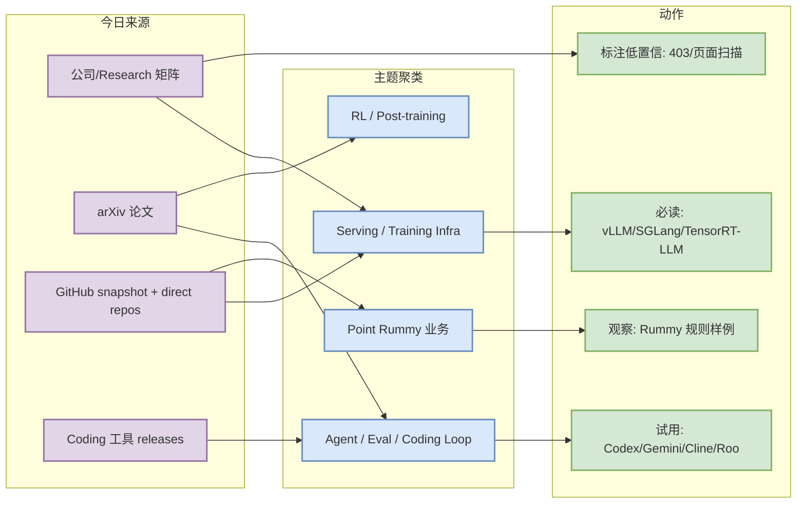
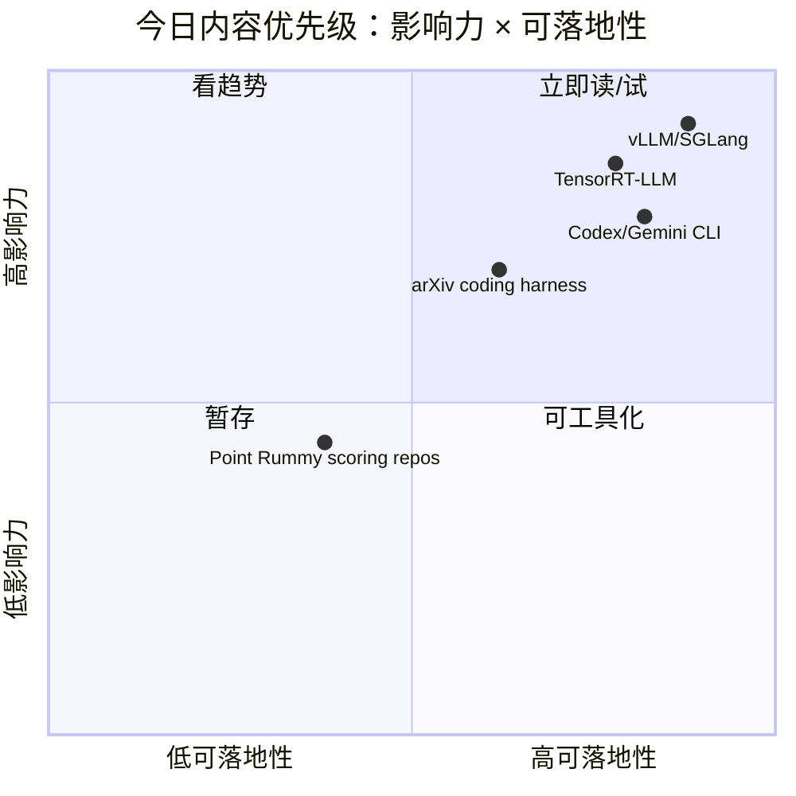

# AI Radar Daily - 2026-09-20

> 生成时间：2026-09-20 09:00 CST
> 范围：AI Infra / LLM / RL / Game AI / 大厂博客 / 论文 / GitHub / Coding 工具
> 说明：日报是总览导航页；详情页负责深度理解。GitHub Search 今日在 Point Rummy 首轮后大量 403，因此 broad/Loop 榜单使用 direct watched repo fallback，并显式标注非完整全网日增。

## 0. 今日结论

- 今日最值得关注：GitHub Search 大量 403，但已保存当日 snapshot，并用 direct `/repos` watched set 补齐 AI Infra、Loop Engineer 与 coding 工具榜单。
- AI Infra 侧重点：vLLM、SGLang、TensorRT-LLM、Transformers、PyTorch 仍是 serving/training/post-training 观察主线。
- Coding workflow 侧重点：Codex、Gemini CLI、Cline、Roo、Continue、Qwen Code release 端点已扫描，继续关注 agent mode、MCP、权限和上下文窗口变化。
- Point Rummy：今日只捕获到少量低 star 计分/规则候选，业务价值偏规则建模和测试样例，不应视为成熟 RL 环境。
- 建议今天深读：先看 vLLM/SGLang/TensorRT-LLM 生态，再看 Codex/Gemini CLI/Cline release，最后 skim arXiv coding-agent harness/eval 候选。

## 1. 今日态势图

## 2. 必读卡片区

> [!important] huggingface/transformers
> - 大类：GitHub
> - 小类：AI Infra
> - 重点：🤗 Transformers: the model-definition framework for state-of-the-art machine learning models in text, vision, audio, and multimodal models, f
> - 为什么重要：这是今日 fallback broad/Loop 榜单的关键工程项目，可用于判断 serving、training、agent loop 或 coding workflow 的生态方向。
> - 详情：[[GitHub/AIInfra/2026-09-20/huggingface-transformers]] / [网页详情](https://github.com/dyt27666-oss/AI-news-report-obsidians/blob/main/GitHub/AIInfra/2026-09-20/huggingface-transformers.md) / [原文](https://github.com/huggingface/transformers)

> [!important] openai/codex
> - 大类：GitHub
> - 小类：Loop Engineer
> - 重点：Lightweight coding agent that runs in your terminal
> - 为什么重要：这是今日 fallback broad/Loop 榜单的关键工程项目，可用于判断 serving、training、agent loop 或 coding workflow 的生态方向。
> - 详情：[[GitHub/LoopEngineer/2026-09-20/openai-codex]] / [网页详情](https://github.com/dyt27666-oss/AI-news-report-obsidians/blob/main/GitHub/LoopEngineer/2026-09-20/openai-codex.md) / [原文](https://github.com/openai/codex)

> [!important] google-gemini/gemini-cli
> - 大类：GitHub
> - 小类：Loop Engineer
> - 重点：An open-source AI agent that brings the power of Gemini directly into your terminal.
> - 为什么重要：这是今日 fallback broad/Loop 榜单的关键工程项目，可用于判断 serving、training、agent loop 或 coding workflow 的生态方向。
> - 详情：[[GitHub/LoopEngineer/2026-09-20/google-gemini-gemini-cli]] / [网页详情](https://github.com/dyt27666-oss/AI-news-report-obsidians/blob/main/GitHub/LoopEngineer/2026-09-20/google-gemini-gemini-cli.md) / [原文](https://github.com/google-gemini/gemini-cli)

> [!important] pytorch/pytorch
> - 大类：GitHub
> - 小类：AI Infra
> - 重点：Tensors and Dynamic neural networks in Python with strong GPU acceleration
> - 为什么重要：这是今日 fallback broad/Loop 榜单的关键工程项目，可用于判断 serving、training、agent loop 或 coding workflow 的生态方向。
> - 详情：[[GitHub/AIInfra/2026-09-20/pytorch-pytorch]] / [网页详情](https://github.com/dyt27666-oss/AI-news-report-obsidians/blob/main/GitHub/AIInfra/2026-09-20/pytorch-pytorch.md) / [原文](https://github.com/pytorch/pytorch)

## 3. 优先级矩阵

## 4. 分类清单

| 标签 | 大类 | 小类 | 标题 | 重点概括 | 为什么重要 | Obsidian 详情 | 网页详情 | 原文 |
|---|---|---|---|---|---|---|---|---|
| 必读 | GitHub | AI Infra/Agent | huggingface/transformers | 🤗 Transformers: the model-definition framework for state-of-the-art machine lear | direct fallback 榜单核心项目，适合进入试用/benchmark 队列。 | [[GitHub/AIInfra/2026-09-20/huggingface-transformers]] | [网页详情](https://github.com/dyt27666-oss/AI-news-report-obsidians/blob/main/GitHub/AIInfra/2026-09-20/huggingface-transformers.md) | [原文](https://github.com/huggingface/transformers) |
| 必读 | GitHub | AI Infra/Agent | openai/codex | Lightweight coding agent that runs in your terminal | direct fallback 榜单核心项目，适合进入试用/benchmark 队列。 | [[GitHub/LoopEngineer/2026-09-20/openai-codex]] | [网页详情](https://github.com/dyt27666-oss/AI-news-report-obsidians/blob/main/GitHub/LoopEngineer/2026-09-20/openai-codex.md) | [原文](https://github.com/openai/codex) |
| 必读 | GitHub | AI Infra/Agent | google-gemini/gemini-cli | An open-source AI agent that brings the power of Gemini directly into your termi | direct fallback 榜单核心项目，适合进入试用/benchmark 队列。 | [[GitHub/LoopEngineer/2026-09-20/google-gemini-gemini-cli]] | [网页详情](https://github.com/dyt27666-oss/AI-news-report-obsidians/blob/main/GitHub/LoopEngineer/2026-09-20/google-gemini-gemini-cli.md) | [原文](https://github.com/google-gemini/gemini-cli) |
| 必读 | GitHub | AI Infra/Agent | pytorch/pytorch | Tensors and Dynamic neural networks in Python with strong GPU acceleration | direct fallback 榜单核心项目，适合进入试用/benchmark 队列。 | [[GitHub/AIInfra/2026-09-20/pytorch-pytorch]] | [网页详情](https://github.com/dyt27666-oss/AI-news-report-obsidians/blob/main/GitHub/AIInfra/2026-09-20/pytorch-pytorch.md) | [原文](https://github.com/pytorch/pytorch) |
| 必读 | GitHub | AI Infra/Agent | vllm-project/vllm | A high-throughput and memory-efficient inference and serving engine for LLMs | direct fallback 榜单核心项目，适合进入试用/benchmark 队列。 | [[GitHub/AIInfra/2026-09-20/vllm-project-vllm]] | [网页详情](https://github.com/dyt27666-oss/AI-news-report-obsidians/blob/main/GitHub/AIInfra/2026-09-20/vllm-project-vllm.md) | [原文](https://github.com/vllm-project/vllm) |
| 可 skim | 论文 | arXiv | Coding Agents with an Obstacle-Aware Harness for Safe Robot Manipulati | Coding agents have emerged as a promising paradigm for robot manipulation: a language mode | 作为 LLM/Agent/RL/Infra 论文候选，需要二次过滤和读 PDF。 | [[Papers/arXiv/2026-09-20/2609.20822v1-coding-agents-with-an-obstacle-aware-harness-for-safe-robot-manipulation]] | [网页详情](https://github.com/dyt27666-oss/AI-news-report-obsidians/blob/main/Papers/arXiv/2026-09-20/2609.20822v1-coding-agents-with-an-obstacle-aware-harness-for-safe-robot-manipulation.md) | [原文](https://arxiv.org/abs/2609.20822v1) |
| 可 skim | 论文 | arXiv | Quantifying Overclaiming Propensity in Frontier LLM Agents | Frontier coding agents are increasingly trusted to work autonomously for long periods, yet | 作为 LLM/Agent/RL/Infra 论文候选，需要二次过滤和读 PDF。 | [[Papers/arXiv/2026-09-20/2609.20812v1-quantifying-overclaiming-propensity-in-frontier-llm-agents]] | [网页详情](https://github.com/dyt27666-oss/AI-news-report-obsidians/blob/main/Papers/arXiv/2026-09-20/2609.20812v1-quantifying-overclaiming-propensity-in-frontier-llm-agents.md) | [原文](https://arxiv.org/abs/2609.20812v1) |
| 可 skim | 论文 | arXiv | An Empirical Study of Harness Design for Coding Agents | Coding harnesses shape how autonomous coding agents translate model capabilities into long | 作为 LLM/Agent/RL/Infra 论文候选，需要二次过滤和读 PDF。 | [[Papers/arXiv/2026-09-20/2609.20804v1-an-empirical-study-of-harness-design-for-coding-agents]] | [网页详情](https://github.com/dyt27666-oss/AI-news-report-obsidians/blob/main/Papers/arXiv/2026-09-20/2609.20804v1-an-empirical-study-of-harness-design-for-coding-agents.md) | [原文](https://arxiv.org/abs/2609.20804v1) |

## 5. 大厂资讯 / 工程博客 / Research

### 5.1 公司来源扫描矩阵

| 公司/实验室 | 来源/栏目 | 今日状态 | 高相关条数 | 代表条目 | 备注 |
|---|---|---|---:|---|---|
| OpenAI | News / Research | 无高相关新项 / 低置信 | 0 | [[Industry/CompanyScan/2026-09-20/openai-item]] / [网页详情](https://github.com/dyt27666-oss/AI-news-report-obsidians/blob/main/Industry/CompanyScan/2026-09-20/openai-item.md) / [原文](https://openai.com/news/) | 未确认当天强相关更新；保留矩阵防漏扫。 |
| Anthropic | News / Research / Engineering | 无高相关新项 / 低置信 | 0 | [[Industry/CompanyScan/2026-09-20/anthropic-item]] / [网页详情](https://github.com/dyt27666-oss/AI-news-report-obsidians/blob/main/Industry/CompanyScan/2026-09-20/anthropic-item.md) / [原文](https://www.anthropic.com/news) | 未确认当天强相关更新；保留矩阵防漏扫。 |
| Google DeepMind | Blog / Research | 无高相关新项 / 低置信 | 0 | [[Industry/CompanyScan/2026-09-20/google-deepmind-item]] / [网页详情](https://github.com/dyt27666-oss/AI-news-report-obsidians/blob/main/Industry/CompanyScan/2026-09-20/google-deepmind-item.md) / [原文](https://deepmind.google/discover/blog/) | 未确认当天强相关更新；保留矩阵防漏扫。 |
| Meta AI | Blog / Research | 无高相关新项 / 低置信 | 0 | [[Industry/CompanyScan/2026-09-20/meta-ai-item]] / [网页详情](https://github.com/dyt27666-oss/AI-news-report-obsidians/blob/main/Industry/CompanyScan/2026-09-20/meta-ai-item.md) / [原文](https://ai.meta.com/blog/) | 未确认当天强相关更新；保留矩阵防漏扫。 |
| NVIDIA | Technical Blog / AI | 无高相关新项 / 低置信 | 0 | [[Industry/CompanyScan/2026-09-20/nvidia-item]] / [网页详情](https://github.com/dyt27666-oss/AI-news-report-obsidians/blob/main/Industry/CompanyScan/2026-09-20/nvidia-item.md) / [原文](https://developer.nvidia.com/blog/category/artificial-intelligence/) | 未确认当天强相关更新；保留矩阵防漏扫。 |
| Microsoft | Research AI | 无高相关新项 / 低置信 | 0 | [[Industry/CompanyScan/2026-09-20/microsoft-item]] / [网页详情](https://github.com/dyt27666-oss/AI-news-report-obsidians/blob/main/Industry/CompanyScan/2026-09-20/microsoft-item.md) / [原文](https://www.microsoft.com/en-us/research/research-area/artificial-intelligence/) | 未确认当天强相关更新；保留矩阵防漏扫。 |
| Hugging Face | Blog / Papers / Releases | 无高相关新项 / 低置信 | 0 | [[Industry/CompanyScan/2026-09-20/hugging-face-item]] / [网页详情](https://github.com/dyt27666-oss/AI-news-report-obsidians/blob/main/Industry/CompanyScan/2026-09-20/hugging-face-item.md) / [原文](https://huggingface.co/blog) | 未确认当天强相关更新；保留矩阵防漏扫。 |
| 腾讯 | AI Lab / 技术博客 | 无高相关新项 / 低置信 | 0 | [[Industry/CompanyScan/2026-09-20/tencent-item]] / [网页详情](https://github.com/dyt27666-oss/AI-news-report-obsidians/blob/main/Industry/CompanyScan/2026-09-20/tencent-item.md) / [原文](https://ai.tencent.com/ailab/en/index) | 未确认当天强相关更新；保留矩阵防漏扫。 |
| 字节 | Seed / 技术博客 | 无高相关新项 / 低置信 | 0 | [[Industry/CompanyScan/2026-09-20/bytedance-item]] / [网页详情](https://github.com/dyt27666-oss/AI-news-report-obsidians/blob/main/Industry/CompanyScan/2026-09-20/bytedance-item.md) / [原文](https://seed.bytedance.com/en/) | 未确认当天强相关更新；保留矩阵防漏扫。 |
| SpaceAI | Blog / News | 无高相关新项 / 低置信 | 0 | [[Industry/CompanyScan/2026-09-20/spaceai-item]] / [网页详情](https://github.com/dyt27666-oss/AI-news-report-obsidians/blob/main/Industry/CompanyScan/2026-09-20/spaceai-item.md) / [原文](https://spaceai.com/) | 未确认当天强相关更新；保留矩阵防漏扫。 |

### 5.2 高相关大厂条目

| 标签 | 发布方/大厂 | 栏目/来源 | 标题 | 重点概括 | 工程/算法影响 | Obsidian 详情 | 网页详情 | 原文 |
|---|---|---|---|---|---|---|---|---|
| 低置信 | OpenAI | News / Research | 来源扫描入口 | 今日未确认高相关新项，保留入口用于后续追踪。 | 若出现模型/infra/agent/eval 更新需升级为必读。 | [[Industry/CompanyScan/2026-09-20/openai-item]] | [网页详情](https://github.com/dyt27666-oss/AI-news-report-obsidians/blob/main/Industry/CompanyScan/2026-09-20/openai-item.md) | [原文](https://openai.com/news/) |
| 低置信 | Anthropic | News / Research / Engineering | 来源扫描入口 | 今日未确认高相关新项，保留入口用于后续追踪。 | 若出现模型/infra/agent/eval 更新需升级为必读。 | [[Industry/CompanyScan/2026-09-20/anthropic-item]] | [网页详情](https://github.com/dyt27666-oss/AI-news-report-obsidians/blob/main/Industry/CompanyScan/2026-09-20/anthropic-item.md) | [原文](https://www.anthropic.com/news) |
| 低置信 | Google DeepMind | Blog / Research | 来源扫描入口 | 今日未确认高相关新项，保留入口用于后续追踪。 | 若出现模型/infra/agent/eval 更新需升级为必读。 | [[Industry/CompanyScan/2026-09-20/google-deepmind-item]] | [网页详情](https://github.com/dyt27666-oss/AI-news-report-obsidians/blob/main/Industry/CompanyScan/2026-09-20/google-deepmind-item.md) | [原文](https://deepmind.google/discover/blog/) |
| 低置信 | Meta AI | Blog / Research | 来源扫描入口 | 今日未确认高相关新项，保留入口用于后续追踪。 | 若出现模型/infra/agent/eval 更新需升级为必读。 | [[Industry/CompanyScan/2026-09-20/meta-ai-item]] | [网页详情](https://github.com/dyt27666-oss/AI-news-report-obsidians/blob/main/Industry/CompanyScan/2026-09-20/meta-ai-item.md) | [原文](https://ai.meta.com/blog/) |
| 低置信 | NVIDIA | Technical Blog / AI | 来源扫描入口 | 今日未确认高相关新项，保留入口用于后续追踪。 | 若出现模型/infra/agent/eval 更新需升级为必读。 | [[Industry/CompanyScan/2026-09-20/nvidia-item]] | [网页详情](https://github.com/dyt27666-oss/AI-news-report-obsidians/blob/main/Industry/CompanyScan/2026-09-20/nvidia-item.md) | [原文](https://developer.nvidia.com/blog/category/artificial-intelligence/) |
| 低置信 | Microsoft | Research AI | 来源扫描入口 | 今日未确认高相关新项，保留入口用于后续追踪。 | 若出现模型/infra/agent/eval 更新需升级为必读。 | [[Industry/CompanyScan/2026-09-20/microsoft-item]] | [网页详情](https://github.com/dyt27666-oss/AI-news-report-obsidians/blob/main/Industry/CompanyScan/2026-09-20/microsoft-item.md) | [原文](https://www.microsoft.com/en-us/research/research-area/artificial-intelligence/) |

## 6. GitHub 高 star Top 10

| 排名 | repo | stars | forks | language | updated_at | topics | 重点概括 | 是否值得试用 | Obsidian 详情 | 原文 |
|---:|---|---:|---:|---|---|---|---|---|---|---|
| 1 | huggingface/transformers | 166391 | 34630 | Python | 2026-09-20T00:37:03Z | audio, deep-learning, deepseek, gemma, glm | 🤗 Transformers: the model-definition framework for state-of-the-art machine learning model | 值得试用 | [[GitHub/AIInfra/2026-09-20/huggingface-transformers]] | [原文](https://github.com/huggingface/transformers) |
| 2 | openai/codex | 125310 | 19450 | Rust | 2026-09-20T00:57:28Z | 无 | Lightweight coding agent that runs in your terminal | 值得试用 | [[GitHub/LoopEngineer/2026-09-20/openai-codex]] | [原文](https://github.com/openai/codex) |
| 3 | google-gemini/gemini-cli | 107089 | 14603 | TypeScript | 2026-09-20T00:34:09Z | ai, ai-agents, cli, gemini, gemini-api | An open-source AI agent that brings the power of Gemini directly into your terminal. | 值得试用 | [[GitHub/LoopEngineer/2026-09-20/google-gemini-gemini-cli]] | [原文](https://github.com/google-gemini/gemini-cli) |
| 4 | pytorch/pytorch | 103110 | 29888 | Python | 2026-09-20T00:32:13Z | autograd, deep-learning, gpu, machine-learning, neural-network | Tensors and Dynamic neural networks in Python with strong GPU acceleration | 值得试用 | [[GitHub/AIInfra/2026-09-20/pytorch-pytorch]] | [原文](https://github.com/pytorch/pytorch) |
| 5 | vllm-project/vllm | 92190 | 22424 | Python | 2026-09-20T00:51:16Z | amd, blackwell, cuda, deepseek, deepseek-v3 | A high-throughput and memory-efficient inference and serving engine for LLMs | 值得试用 | [[GitHub/AIInfra/2026-09-20/vllm-project-vllm]] | [原文](https://github.com/vllm-project/vllm) |
| 6 | modelcontextprotocol/servers | 90474 | 11665 | TypeScript | 2026-09-20T00:28:54Z | 无 | Model Context Protocol Servers | 值得试用 | [[GitHub/AIInfra/2026-09-20/modelcontextprotocol-servers]] | [原文](https://github.com/modelcontextprotocol/servers) |
| 7 | OpenHands/OpenHands | 88546 | 11634 | TypeScript | 2026-09-20T00:26:19Z | agent, artificial-intelligence, chatgpt, claude-ai, cli | 🙌 OpenHands: AI-Driven Development | 值得试用 | [[GitHub/LoopEngineer/2026-09-20/openhands-openhands]] | [原文](https://github.com/OpenHands/OpenHands) |
| 8 | cline/cline | 68787 | 7445 | TypeScript | 2026-09-20T00:45:52Z | 无 | Autonomous coding agent as an SDK, IDE extension, or CLI assistant. | 值得试用 | [[GitHub/LoopEngineer/2026-09-20/cline-cline]] | [原文](https://github.com/cline/cline) |
| 9 | microsoft/autogen | 61062 | 9235 | Python | 2026-09-19T21:38:48Z | agentic, agentic-agi, agents, ai, autogen | A programming framework for agentic AI | 值得试用 | [[GitHub/LoopEngineer/2026-09-20/microsoft-autogen]] | [原文](https://github.com/microsoft/autogen) |
| 10 | crewAIInc/crewAI | 58781 | 8513 | Python | 2026-09-20T00:39:46Z | agents, ai, ai-agents, aiagentframework, llms | Framework for orchestrating role-playing, autonomous AI agents. By fostering collaborative | 值得试用 | [[GitHub/LoopEngineer/2026-09-20/crewaiinc-crewai]] | [原文](https://github.com/crewAIInc/crewAI) |

## 7. GitHub star 增长最快 Top 10

> 增长依据：direct watched repo fallback，非完整全网日增；若 `stars_delta` 为 null/缺失，表示当前 watched repo 在历史 snapshot 中缺少可靠 baseline。

| 排名 | repo | stars_delta | stars | forks | language | updated_at | 增长依据 | 重点概括 | Obsidian 详情 | 原文 |
|---:|---|---:|---:|---:|---|---|---|---|---|---|
| 1 | openai/codex | 153 | 125310 | 19450 | Rust | 2026-09-20T00:57:28Z | direct watched repo fallback，非完整全网日增 | Lightweight coding agent that runs in your terminal | [[GitHub/LoopEngineer/2026-09-20/openai-codex]] | [原文](https://github.com/openai/codex) |
| 2 | OpenHands/OpenHands | 97 | 88546 | 11634 | TypeScript | 2026-09-20T00:26:19Z | direct watched repo fallback，非完整全网日增 | 🙌 OpenHands: AI-Driven Development | [[GitHub/LoopEngineer/2026-09-20/openhands-openhands]] | [原文](https://github.com/OpenHands/OpenHands) |
| 3 | cline/cline | 88 | 68787 | 7445 | TypeScript | 2026-09-20T00:45:52Z | direct watched repo fallback，非完整全网日增 | Autonomous coding agent as an SDK, IDE extension, or CLI assistant. | [[GitHub/LoopEngineer/2026-09-20/cline-cline]] | [原文](https://github.com/cline/cline) |
| 4 | huggingface/transformers | 85 | 166391 | 34630 | Python | 2026-09-20T00:37:03Z | direct watched repo fallback，非完整全网日增 | 🤗 Transformers: the model-definition framework for state-of-the-art machine learning model | [[GitHub/AIInfra/2026-09-20/huggingface-transformers]] | [原文](https://github.com/huggingface/transformers) |
| 5 | vllm-project/vllm | 64 | 92190 | 22424 | Python | 2026-09-20T00:51:16Z | direct watched repo fallback，非完整全网日增 | A high-throughput and memory-efficient inference and serving engine for LLMs | [[GitHub/AIInfra/2026-09-20/vllm-project-vllm]] | [原文](https://github.com/vllm-project/vllm) |
| 6 | langchain-ai/langgraph | 53 | 41959 | 7081 | Python | 2026-09-20T00:59:08Z | direct watched repo fallback，非完整全网日增 | Build resilient agents. | [[GitHub/LoopEngineer/2026-09-20/langchain-ai-langgraph]] | [原文](https://github.com/langchain-ai/langgraph) |
| 7 | crewAIInc/crewAI | 40 | 58781 | 8513 | Python | 2026-09-20T00:39:46Z | direct watched repo fallback，非完整全网日增 | Framework for orchestrating role-playing, autonomous AI agents. By fostering collaborative | [[GitHub/LoopEngineer/2026-09-20/crewaiinc-crewai]] | [原文](https://github.com/crewAIInc/crewAI) |
| 8 | sgl-project/sglang | 26 | 36178 | 8993 | Python | 2026-09-20T00:58:48Z | direct watched repo fallback，非完整全网日增 | SGLang is a high-performance serving framework for large language models and multimodal mo | [[GitHub/AIInfra/2026-09-20/sgl-project-sglang]] | [原文](https://github.com/sgl-project/sglang) |
| 9 | modelcontextprotocol/servers | 23 | 90474 | 11665 | TypeScript | 2026-09-20T00:28:54Z | direct watched repo fallback，非完整全网日增 | Model Context Protocol Servers | [[GitHub/AIInfra/2026-09-20/modelcontextprotocol-servers]] | [原文](https://github.com/modelcontextprotocol/servers) |
| 10 | QwenLM/qwen-code | 23 | 27991 | 3076 | TypeScript | 2026-09-20T01:02:01Z | direct watched repo fallback，非完整全网日增 | An open-source AI coding agent that lives in your terminal. | [[GitHub/LoopEngineer/2026-09-20/qwenlm-qwen-code]] | [原文](https://github.com/QwenLM/qwen-code) |

## 8. Coding 工具 / AI 工具功能更新

### 8.1 Coding 工具扫描矩阵

| 工具 | 厂商 | 来源类型 | 今日状态 | 代表更新 | 对我的影响 | 原文 |
|---|---|---|---|---|---|---|
| Claude Code | Anthropic | Changelog / Release Notes | 低置信：扫描 docs/changelog URL，未使用专用 API | 未确认高相关新项 | 需人工打开 changelog 确认 Claude Tag/权限/上下文变化 | [原文](https://docs.anthropic.com/en/release-notes/claude-code) |
| Cursor | Cursor | Changelog | 低置信：扫描 changelog URL，未使用专用 API | 未确认高相关新项 | 关注 agent mode、MCP、IDE 内联体验 | [原文](https://cursor.com/changelog) |
| Windsurf | Windsurf | Changelog | 低置信：扫描 changelog URL，未使用专用 API | 未确认高相关新项 | 关注远程执行、agent 模式和 pricing/rate limit | [原文](https://windsurf.com/changelog) |
| GitHub Copilot | GitHub | Changelog / Blog | 低置信：扫描 Copilot changelog/blog | 未确认高相关新项 | 关注 agent mode、代码审查与企业权限 | [原文](https://github.blog/changelog/label/copilot/) |
| OpenAI Codex | OpenAI | GitHub Releases | 已获取 latest release | rust-v0.155.1 / 0.155.1 / 2026-09-18T20:03:04Z | 若涉及 CLI/TUI、agent loop、MCP 或上下文管理，影响多 agent 编排和代码审查效率。 | [原文](https://github.com/openai/codex/releases/tag/rust-v0.155.1) |
| Gemini Code Assist | Google | GitHub Releases | 已获取 latest release | v0.60.0 / Release v0.60.0 / 2026-09-15T20:31:02Z | 若涉及 CLI/TUI、agent loop、MCP 或上下文管理，影响多 agent 编排和代码审查效率。 | [原文](https://github.com/google-gemini/gemini-cli/releases/tag/v0.60.0) |
| Qwen Code | Alibaba/Qwen | GitHub Releases | 已获取 latest release | sdk-typescript-v0.1.13 / SDK TypeScript Release v0.1.13 / 2026-09-19T09:05:56Z | 若涉及 CLI/TUI、agent loop、MCP 或上下文管理，影响多 agent 编排和代码审查效率。 | [原文](https://github.com/QwenLM/qwen-code/releases/tag/sdk-typescript-v0.1.13) |
| Roo Code | Roo Code | GitHub Releases | 已获取 latest release | v3.54.0 / Release v3.54.0 / 2026-05-15T17:52:24Z | 若涉及 CLI/TUI、agent loop、MCP 或上下文管理，影响多 agent 编排和代码审查效率。 | [原文](https://github.com/RooCodeInc/Roo-Code/releases/tag/v3.54.0) |
| Cline | Cline | GitHub Releases | 已获取 latest release | desktop-v0.0.32 / Desktop v0.0.32 / 2026-09-18T01:42:35Z | 若涉及 CLI/TUI、agent loop、MCP 或上下文管理，影响多 agent 编排和代码审查效率。 | [原文](https://github.com/cline/cline/releases/tag/desktop-v0.0.32) |
| Continue | Continue | GitHub Releases | 已获取 latest release | v2.0.0-vscode / v2.0.0-vscode / 2026-06-19T00:24:01Z | 若涉及 CLI/TUI、agent loop、MCP 或上下文管理，影响多 agent 编排和代码审查效率。 | [原文](https://github.com/continuedev/continue/releases/tag/v2.0.0-vscode) |

### 8.2 高相关工具更新

| 标签 | 工具/厂商 | 来源类型 | 标题/功能 | 重点概括 | 对 AI coding 工作流的影响 | Obsidian 详情 | 网页详情 | 原文 |
|---|---|---|---|---|---|---|---|---|
| 后续 | Claude Code / Anthropic | Changelog / Release Notes | 未确认高相关新项 | 低置信：扫描 docs/changelog URL，未使用专用 API | 需人工打开 changelog 确认 Claude Tag/权限/上下文变化 | [[Industry/Tools/2026-09-20/claude-code]] | [网页详情](https://github.com/dyt27666-oss/AI-news-report-obsidians/blob/main/Industry/Tools/2026-09-20/claude-code.md) | [原文](https://docs.anthropic.com/en/release-notes/claude-code) |
| 后续 | Cursor / Cursor | Changelog | 未确认高相关新项 | 低置信：扫描 changelog URL，未使用专用 API | 关注 agent mode、MCP、IDE 内联体验 | [[Industry/Tools/2026-09-20/cursor]] | [网页详情](https://github.com/dyt27666-oss/AI-news-report-obsidians/blob/main/Industry/Tools/2026-09-20/cursor.md) | [原文](https://cursor.com/changelog) |
| 后续 | Windsurf / Windsurf | Changelog | 未确认高相关新项 | 低置信：扫描 changelog URL，未使用专用 API | 关注远程执行、agent 模式和 pricing/rate limit | [[Industry/Tools/2026-09-20/windsurf]] | [网页详情](https://github.com/dyt27666-oss/AI-news-report-obsidians/blob/main/Industry/Tools/2026-09-20/windsurf.md) | [原文](https://windsurf.com/changelog) |
| 后续 | GitHub Copilot / GitHub | Changelog / Blog | 未确认高相关新项 | 低置信：扫描 Copilot changelog/blog | 关注 agent mode、代码审查与企业权限 | [[Industry/Tools/2026-09-20/github-copilot]] | [网页详情](https://github.com/dyt27666-oss/AI-news-report-obsidians/blob/main/Industry/Tools/2026-09-20/github-copilot.md) | [原文](https://github.blog/changelog/label/copilot/) |
| 后续 | OpenAI Codex / OpenAI | GitHub Releases | rust-v0.155.1 / 0.155.1 / 2026-09-18T20:03:04Z | 已获取 latest release | 若涉及 CLI/TUI、agent loop、MCP 或上下文管理，影响多 agent 编排和代码审查效率。 | [[Industry/Tools/2026-09-20/openai-codex]] | [网页详情](https://github.com/dyt27666-oss/AI-news-report-obsidians/blob/main/Industry/Tools/2026-09-20/openai-codex.md) | [原文](https://github.com/openai/codex/releases/tag/rust-v0.155.1) |
| 后续 | Gemini Code Assist / Google | GitHub Releases | v0.60.0 / Release v0.60.0 / 2026-09-15T20:31:02Z | 已获取 latest release | 若涉及 CLI/TUI、agent loop、MCP 或上下文管理，影响多 agent 编排和代码审查效率。 | [[Industry/Tools/2026-09-20/gemini-code-assist]] | [网页详情](https://github.com/dyt27666-oss/AI-news-report-obsidians/blob/main/Industry/Tools/2026-09-20/gemini-code-assist.md) | [原文](https://github.com/google-gemini/gemini-cli/releases/tag/v0.60.0) |
| 后续 | Qwen Code / Alibaba/Qwen | GitHub Releases | sdk-typescript-v0.1.13 / SDK TypeScript Release v0.1.13 / 2026-09-19T09:05:56Z | 已获取 latest release | 若涉及 CLI/TUI、agent loop、MCP 或上下文管理，影响多 agent 编排和代码审查效率。 | [[Industry/Tools/2026-09-20/qwen-code]] | [网页详情](https://github.com/dyt27666-oss/AI-news-report-obsidians/blob/main/Industry/Tools/2026-09-20/qwen-code.md) | [原文](https://github.com/QwenLM/qwen-code/releases/tag/sdk-typescript-v0.1.13) |
| 后续 | Roo Code / Roo Code | GitHub Releases | v3.54.0 / Release v3.54.0 / 2026-05-15T17:52:24Z | 已获取 latest release | 若涉及 CLI/TUI、agent loop、MCP 或上下文管理，影响多 agent 编排和代码审查效率。 | [[Industry/Tools/2026-09-20/roo-code]] | [网页详情](https://github.com/dyt27666-oss/AI-news-report-obsidians/blob/main/Industry/Tools/2026-09-20/roo-code.md) | [原文](https://github.com/RooCodeInc/Roo-Code/releases/tag/v3.54.0) |
| 后续 | Cline / Cline | GitHub Releases | desktop-v0.0.32 / Desktop v0.0.32 / 2026-09-18T01:42:35Z | 已获取 latest release | 若涉及 CLI/TUI、agent loop、MCP 或上下文管理，影响多 agent 编排和代码审查效率。 | [[Industry/Tools/2026-09-20/cline]] | [网页详情](https://github.com/dyt27666-oss/AI-news-report-obsidians/blob/main/Industry/Tools/2026-09-20/cline.md) | [原文](https://github.com/cline/cline/releases/tag/desktop-v0.0.32) |
| 后续 | Continue / Continue | GitHub Releases | v2.0.0-vscode / v2.0.0-vscode / 2026-06-19T00:24:01Z | 已获取 latest release | 若涉及 CLI/TUI、agent loop、MCP 或上下文管理，影响多 agent 编排和代码审查效率。 | [[Industry/Tools/2026-09-20/continue]] | [网页详情](https://github.com/dyt27666-oss/AI-news-report-obsidians/blob/main/Industry/Tools/2026-09-20/continue.md) | [原文](https://github.com/continuedev/continue/releases/tag/v2.0.0-vscode) |

## 9. Point Rummy / Indian Rummy 业务主题

### 9.1 GitHub 候选

| 标签 | repo | stars | forks | language | updated_at | 重点概括 | 业务可用性 | Obsidian 详情 | 原文 |
|---|---|---:|---:|---|---|---|---|---|---|
| 低置信 | Mohitkumar-559/RummyServer | 2 | 1 | JavaScript | 2024-03-17T03:48:34Z | Rummy game server for game that contain deal rummy and point rummy | 可作为规则/计分测试样例；不宜直接复用为 RL 环境。 | [[GitHub/PointRummy/2026-09-20/mohitkumar-559-rummyserver]] | [原文](https://github.com/Mohitkumar-559/RummyServer) |
| 低置信 | codingmickey/rummy-points-calculator | 1 | 0 | C++ | 2024-07-10T15:40:45Z | A cpp progarm to calculate Rummy points of all the players for each round. | 可作为规则/计分测试样例；不宜直接复用为 RL 环境。 | [[GitHub/PointRummy/2026-09-20/codingmickey-rummy-points-calculator]] | [原文](https://github.com/codingmickey/rummy-points-calculator) |
| 低置信 | debabrata-mandal/RummyPulse | 1 | 0 | Java | 2026-09-18T10:15:51Z | RummyPulse - Smart Rummy Game Analytics & Management Android App with Firebase integration | 可作为规则/计分测试样例；不宜直接复用为 RL 环境。 | [[GitHub/PointRummy/2026-09-20/debabrata-mandal-rummypulse]] | [原文](https://github.com/debabrata-mandal/RummyPulse) |
| 低置信 | Alan-seb/RummyVision | 1 | 0 | Python | 2025-12-03T03:14:55Z | RummyVision is an intelligent card game assistant that combines computer vision with Monte | 可作为规则/计分测试样例；不宜直接复用为 RL 环境。 | [[GitHub/PointRummy/2026-09-20/alan-seb-rummyvision]] | [原文](https://github.com/Alan-seb/RummyVision) |
| 低置信 | Nethaji003/rummy2 | 0 | 0 | HTML | 2026-06-18T07:31:53Z | point | 可作为规则/计分测试样例；不宜直接复用为 RL 环境。 | [[GitHub/PointRummy/2026-09-20/nethaji003-rummy2]] | [原文](https://github.com/Nethaji003/rummy2) |
| 低置信 | Navomi1/RummyPointCounter | 0 | 0 | Swift | 2026-01-13T23:49:39Z | Count points while playing Rummy | 可作为规则/计分测试样例；不宜直接复用为 RL 环境。 | [[GitHub/PointRummy/2026-09-20/navomi1-rummypointcounter]] | [原文](https://github.com/Navomi1/RummyPointCounter) |
| 低置信 | samikshamodi/PointsRummy | 0 | 0 | Python | 2021-06-01T21:14:14Z | A GUI version of Points Rummy using pygame where you play against an intelligent computer  | 可作为规则/计分测试样例；不宜直接复用为 RL 环境。 | [[GitHub/PointRummy/2026-09-20/samikshamodi-pointsrummy]] | [原文](https://github.com/samikshamodi/PointsRummy) |
| 低置信 | Soumyadeep-Kar2006/RummyPointCalculator | 0 | 0 | HTML | 2026-06-05T19:06:53Z |  | 可作为规则/计分测试样例；不宜直接复用为 RL 环境。 | [[GitHub/PointRummy/2026-09-20/soumyadeep-kar2006-rummypointcalculator]] | [原文](https://github.com/Soumyadeep-Kar2006/RummyPointCalculator) |
| 低置信 | rafana73/rummy_points | 0 | 0 | PHP | 2022-01-12T16:29:15Z |  | 可作为规则/计分测试样例；不宜直接复用为 RL 环境。 | [[GitHub/PointRummy/2026-09-20/rafana73-rummy_points]] | [原文](https://github.com/rafana73/rummy_points) |
| 低置信 | karthikeyankkn/rummy-points | 0 | 0 | HTML | 2020-07-05T19:19:11Z | Now easy to maintain rummy points... :D | 可作为规则/计分测试样例；不宜直接复用为 RL 环境。 | [[GitHub/PointRummy/2026-09-20/karthikeyankkn-rummy-points]] | [原文](https://github.com/karthikeyankkn/rummy-points) |

### 9.2 论文 / 资料候选

| 标签 | 来源 | 标题 | 作者/机构 | 重点概括 | 对 Point Rummy 业务有什么用 | Obsidian 详情 | 原文 |
|---|---|---|---|---|---|---|---|
| 低置信 | arXiv | A Gold-Standard Study of What Makes a Lightweight Game-Playing Agent Strong | Nima Kelidari, Mohammadsaeed Haghi, Mahdi Salmani | Reinforcement learning agents for imperfect-information card games are only as strong as the opponen | 可参考 imperfect-information card game / MCTS / self-play 思路；需确认是否真与 Rummy 相关。 | 未生成 | [原文](https://arxiv.org/abs/2607.06854v2) |
| 低置信 | arXiv | IRumAI: Reinforcement Learning for Indian Rummy | Vignesh Mohan | Despite its massive player base and complex hidden-information dynamics, Indian Rummy has received n | 可参考 imperfect-information card game / MCTS / self-play 思路；需确认是否真与 Rummy 相关。 | 未生成 | [原文](https://arxiv.org/abs/2606.21975v1) |

### 9.3 业务可用性判断

| 方向 | 今日信号 | 可用性 | 下一步 |
|---|---|---|---|
| 规则引擎 / 计分 | 少量低 star Rummy score/counter repo | 中低：可借鉴规则和计分测试，不宜直接复用 | 抽取规则测试用例，建立统一 evaluator |
| Bot / RL Agent | 未发现成熟高 star RL agent | 低：需要自建 baseline | 先实现规则环境，再接入 self-play/MCTS |
| 仿真 / 评测 | GitHub Search 403，候选稀疏 | 低：需要自建环境并行与评测 | 设计 Gymnasium-style env + benchmark |

## 10. Loop Engineer / Loop Engineering 主题

### 10.1 Loop Engineer GitHub 高 star Top 10

| 排名 | repo | stars | forks | language | updated_at | topics | 重点概括 | 是否值得试用 | Obsidian 详情 | 原文 |
|---:|---|---:|---:|---|---|---|---|---|---|---|
| 1 | openai/codex | 125310 | 19450 | Rust | 2026-09-20T00:57:28Z | 无 | Lightweight coding agent that runs in your terminal | 值得试用 | [[GitHub/LoopEngineer/2026-09-20/openai-codex]] | [原文](https://github.com/openai/codex) |
| 2 | google-gemini/gemini-cli | 107089 | 14603 | TypeScript | 2026-09-20T00:34:09Z | ai, ai-agents, cli, gemini, gemini-api | An open-source AI agent that brings the power of Gemini directly into your terminal. | 值得试用 | [[GitHub/LoopEngineer/2026-09-20/google-gemini-gemini-cli]] | [原文](https://github.com/google-gemini/gemini-cli) |
| 3 | OpenHands/OpenHands | 88546 | 11634 | TypeScript | 2026-09-20T00:26:19Z | agent, artificial-intelligence, chatgpt, claude-ai, cli | 🙌 OpenHands: AI-Driven Development | 值得试用 | [[GitHub/LoopEngineer/2026-09-20/openhands-openhands]] | [原文](https://github.com/OpenHands/OpenHands) |
| 4 | cline/cline | 68787 | 7445 | TypeScript | 2026-09-20T00:45:52Z | 无 | Autonomous coding agent as an SDK, IDE extension, or CLI assistant. | 值得试用 | [[GitHub/LoopEngineer/2026-09-20/cline-cline]] | [原文](https://github.com/cline/cline) |
| 5 | microsoft/autogen | 61062 | 9235 | Python | 2026-09-19T21:38:48Z | agentic, agentic-agi, agents, ai, autogen | A programming framework for agentic AI | 值得试用 | [[GitHub/LoopEngineer/2026-09-20/microsoft-autogen]] | [原文](https://github.com/microsoft/autogen) |
| 6 | crewAIInc/crewAI | 58781 | 8513 | Python | 2026-09-20T00:39:46Z | agents, ai, ai-agents, aiagentframework, llms | Framework for orchestrating role-playing, autonomous AI agents. By fostering collaborative | 值得试用 | [[GitHub/LoopEngineer/2026-09-20/crewaiinc-crewai]] | [原文](https://github.com/crewAIInc/crewAI) |
| 7 | Aider-AI/aider | 49064 | 4977 | Python | 2026-09-20T00:57:39Z | anthropic, chatgpt, claude-3, cli, command-line | aider is AI pair programming in your terminal | 值得试用 | [[GitHub/LoopEngineer/2026-09-20/aider-ai-aider]] | [原文](https://github.com/Aider-AI/aider) |
| 8 | langchain-ai/langgraph | 41959 | 7081 | Python | 2026-09-20T00:59:08Z | agents, ai, ai-agents, chatgpt, deepagents | Build resilient agents. | 值得试用 | [[GitHub/LoopEngineer/2026-09-20/langchain-ai-langgraph]] | [原文](https://github.com/langchain-ai/langgraph) |
| 9 | continuedev/continue | 35957 | 5403 | TypeScript | 2026-09-20T00:09:58Z | agent, ai, cli, developer-tools, open-source | open-source coding agent | 值得试用 | [[GitHub/LoopEngineer/2026-09-20/continuedev-continue]] | [原文](https://github.com/continuedev/continue) |
| 10 | QwenLM/qwen-code | 27991 | 3076 | TypeScript | 2026-09-20T01:02:01Z | agentic, ai, ai-agent, ai-coding, cli | An open-source AI coding agent that lives in your terminal. | 值得试用 | [[GitHub/LoopEngineer/2026-09-20/qwenlm-qwen-code]] | [原文](https://github.com/QwenLM/qwen-code) |

### 10.2 Loop Engineer GitHub star 增长最快 Top 10

| 排名 | repo | stars_delta | stars | forks | language | updated_at | 增长依据 | 重点概括 | Obsidian 详情 | 原文 |
|---:|---|---:|---:|---:|---|---|---|---|---|---|
| 1 | openai/codex | 153 | 125310 | 19450 | Rust | 2026-09-20T00:57:28Z | direct watched repo fallback，非完整全网日增 | Lightweight coding agent that runs in your terminal | [[GitHub/LoopEngineer/2026-09-20/openai-codex]] | [原文](https://github.com/openai/codex) |
| 2 | OpenHands/OpenHands | 97 | 88546 | 11634 | TypeScript | 2026-09-20T00:26:19Z | direct watched repo fallback，非完整全网日增 | 🙌 OpenHands: AI-Driven Development | [[GitHub/LoopEngineer/2026-09-20/openhands-openhands]] | [原文](https://github.com/OpenHands/OpenHands) |
| 3 | cline/cline | 88 | 68787 | 7445 | TypeScript | 2026-09-20T00:45:52Z | direct watched repo fallback，非完整全网日增 | Autonomous coding agent as an SDK, IDE extension, or CLI assistant. | [[GitHub/LoopEngineer/2026-09-20/cline-cline]] | [原文](https://github.com/cline/cline) |
| 4 | langchain-ai/langgraph | 53 | 41959 | 7081 | Python | 2026-09-20T00:59:08Z | direct watched repo fallback，非完整全网日增 | Build resilient agents. | [[GitHub/LoopEngineer/2026-09-20/langchain-ai-langgraph]] | [原文](https://github.com/langchain-ai/langgraph) |
| 5 | crewAIInc/crewAI | 40 | 58781 | 8513 | Python | 2026-09-20T00:39:46Z | direct watched repo fallback，非完整全网日增 | Framework for orchestrating role-playing, autonomous AI agents. By fostering collaborative | [[GitHub/LoopEngineer/2026-09-20/crewaiinc-crewai]] | [原文](https://github.com/crewAIInc/crewAI) |
| 6 | QwenLM/qwen-code | 23 | 27991 | 3076 | TypeScript | 2026-09-20T01:02:01Z | direct watched repo fallback，非完整全网日增 | An open-source AI coding agent that lives in your terminal. | [[GitHub/LoopEngineer/2026-09-20/qwenlm-qwen-code]] | [原文](https://github.com/QwenLM/qwen-code) |
| 7 | Aider-AI/aider | 18 | 49064 | 4977 | Python | 2026-09-20T00:57:39Z | direct watched repo fallback，非完整全网日增 | aider is AI pair programming in your terminal | [[GitHub/LoopEngineer/2026-09-20/aider-ai-aider]] | [原文](https://github.com/Aider-AI/aider) |
| 8 | google-gemini/gemini-cli | 17 | 107089 | 14603 | TypeScript | 2026-09-20T00:34:09Z | direct watched repo fallback，非完整全网日增 | An open-source AI agent that brings the power of Gemini directly into your terminal. | [[GitHub/LoopEngineer/2026-09-20/google-gemini-gemini-cli]] | [原文](https://github.com/google-gemini/gemini-cli) |
| 9 | microsoft/autogen | 10 | 61062 | 9235 | Python | 2026-09-19T21:38:48Z | direct watched repo fallback，非完整全网日增 | A programming framework for agentic AI | [[GitHub/LoopEngineer/2026-09-20/microsoft-autogen]] | [原文](https://github.com/microsoft/autogen) |
| 10 | continuedev/continue | 6 | 35957 | 5403 | TypeScript | 2026-09-20T00:09:58Z | direct watched repo fallback，非完整全网日增 | open-source coding agent | [[GitHub/LoopEngineer/2026-09-20/continuedev-continue]] | [原文](https://github.com/continuedev/continue) |

### 10.3 Loop Engineering 方法信号

| 标签 | 来源 | 标题 | 重点概括 | 对 AI coding 工作流的影响 | Obsidian 详情 | 原文 |
|---|---|---|---|---|---|---|
| 后续 | GitHub | openai/codex | Lightweight coding agent that runs in your terminal | 观察 agent loop、任务分解、上下文工程、eval loop 和权限边界。 | [[GitHub/LoopEngineer/2026-09-20/openai-codex]] | [原文](https://github.com/openai/codex) |
| 后续 | GitHub | google-gemini/gemini-cli | An open-source AI agent that brings the power of Gemini directly into your terminal. | 观察 agent loop、任务分解、上下文工程、eval loop 和权限边界。 | [[GitHub/LoopEngineer/2026-09-20/google-gemini-gemini-cli]] | [原文](https://github.com/google-gemini/gemini-cli) |
| 后续 | GitHub | OpenHands/OpenHands | 🙌 OpenHands: AI-Driven Development | 观察 agent loop、任务分解、上下文工程、eval loop 和权限边界。 | [[GitHub/LoopEngineer/2026-09-20/openhands-openhands]] | [原文](https://github.com/OpenHands/OpenHands) |
| 后续 | GitHub | cline/cline | Autonomous coding agent as an SDK, IDE extension, or CLI assistant. | 观察 agent loop、任务分解、上下文工程、eval loop 和权限边界。 | [[GitHub/LoopEngineer/2026-09-20/cline-cline]] | [原文](https://github.com/cline/cline) |
| 后续 | GitHub | microsoft/autogen | A programming framework for agentic AI | 观察 agent loop、任务分解、上下文工程、eval loop 和权限边界。 | [[GitHub/LoopEngineer/2026-09-20/microsoft-autogen]] | [原文](https://github.com/microsoft/autogen) |

## 11. 论文

### 11.1 Agent / Serving / RL / World Model 候选

| 标签 | 论文来源 | 论文 | 作者/机构 | 重点概括 | 工程/研究价值 | Obsidian 详情 | 网页详情 | PDF/原文 |
|---|---|---|---|---|---|---|---|---|
| 可 skim | arXiv / 预印本 | Coding Agents with an Obstacle-Aware Harness for Safe Robot Manipulation | Bingxin Xu, Yuzhang Shang, Zhen Dong, Emilio Ferrara | Coding agents have emerged as a promising paradigm for robot manipulation: a language model writes t | 作为 LLM/Agent/RL/Infra 候选，需读 PDF 验证是否有系统或实验价值。 | [[Papers/arXiv/2026-09-20/2609.20822v1-coding-agents-with-an-obstacle-aware-harness-for-safe-robot-manipulation]] | [网页详情](https://github.com/dyt27666-oss/AI-news-report-obsidians/blob/main/Papers/arXiv/2026-09-20/2609.20822v1-coding-agents-with-an-obstacle-aware-harness-for-safe-robot-manipulation.md) | [PDF](https://arxiv.org/pdf/2609.20822v1) / [abs](https://arxiv.org/abs/2609.20822v1) |
| 可 skim | arXiv / 预印本 | Quantifying Overclaiming Propensity in Frontier LLM Agents | Nolan Smyth, Yorguin-Jose Mantilla-Ramos, Pascal Jr Tikeng Notsawo, Saskia Helbling | Frontier coding agents are increasingly trusted to work autonomously for long periods, yet an agent' | 作为 LLM/Agent/RL/Infra 候选，需读 PDF 验证是否有系统或实验价值。 | [[Papers/arXiv/2026-09-20/2609.20812v1-quantifying-overclaiming-propensity-in-frontier-llm-agents]] | [网页详情](https://github.com/dyt27666-oss/AI-news-report-obsidians/blob/main/Papers/arXiv/2026-09-20/2609.20812v1-quantifying-overclaiming-propensity-in-frontier-llm-agents.md) | [PDF](https://arxiv.org/pdf/2609.20812v1) / [abs](https://arxiv.org/abs/2609.20812v1) |
| 可 skim | arXiv / 预印本 | An Empirical Study of Harness Design for Coding Agents | Run-Ze Fan, Zihao Zhang, Simin Ma, Yebowen Hu | Coding harnesses shape how autonomous coding agents translate model capabilities into long-horizon s | 作为 LLM/Agent/RL/Infra 候选，需读 PDF 验证是否有系统或实验价值。 | [[Papers/arXiv/2026-09-20/2609.20804v1-an-empirical-study-of-harness-design-for-coding-agents]] | [网页详情](https://github.com/dyt27666-oss/AI-news-report-obsidians/blob/main/Papers/arXiv/2026-09-20/2609.20804v1-an-empirical-study-of-harness-design-for-coding-agents.md) | [PDF](https://arxiv.org/pdf/2609.20804v1) / [abs](https://arxiv.org/abs/2609.20804v1) |
| 可 skim | arXiv / 预印本 | Embedding Models Measure in Peculiar Ways | Juri Opitz, Andrianos Michail | Embedding spaces define notions of semantic similarity and distance. We study whether those embeddin | 作为 LLM/Agent/RL/Infra 候选，需读 PDF 验证是否有系统或实验价值。 | [[Papers/arXiv/2026-09-20/2609.20821v1-embedding-models-measure-in-peculiar-ways]] | [网页详情](https://github.com/dyt27666-oss/AI-news-report-obsidians/blob/main/Papers/arXiv/2026-09-20/2609.20821v1-embedding-models-measure-in-peculiar-ways.md) | [PDF](https://arxiv.org/pdf/2609.20821v1) / [abs](https://arxiv.org/abs/2609.20821v1) |
| 可 skim | arXiv / 预印本 | Paint-Anything: Unified Any-Color Control for Image Generation and Editing | Ji Xie, Dewei Zhou, Xinyu Huang, Zhennan Chen | Professional design requires any-color control: the ability to specify an object's target color with | 作为 LLM/Agent/RL/Infra 候选，需读 PDF 验证是否有系统或实验价值。 | [[Papers/arXiv/2026-09-20/2609.20816v1-paint-anything-unified-any-color-control-for-image-generation-and-editing]] | [网页详情](https://github.com/dyt27666-oss/AI-news-report-obsidians/blob/main/Papers/arXiv/2026-09-20/2609.20816v1-paint-anything-unified-any-color-control-for-image-generation-and-editing.md) | [PDF](https://arxiv.org/pdf/2609.20816v1) / [abs](https://arxiv.org/abs/2609.20816v1) |

## 12. 资讯 / 其他 GitHub 项目

### 12.1 AI Infra direct watched repo fallback

| 标签 | 来源 | 标题 | 重点概括 | 对我有什么用 | Obsidian 详情 | 网页详情 | 原文 |
|---|---|---|---|---|---|---|---|
| 后续 | GitHub | langchain-ai/langgraph | Build resilient agents. | 扩展 watched repo 池，辅助判断生态活跃度。 | [[GitHub/LoopEngineer/2026-09-20/langchain-ai-langgraph]] | [网页详情](https://github.com/dyt27666-oss/AI-news-report-obsidians/blob/main/GitHub/LoopEngineer/2026-09-20/langchain-ai-langgraph.md) | [原文](https://github.com/langchain-ai/langgraph) |
| 后续 | GitHub | microsoft/autogen | A programming framework for agentic AI | 扩展 watched repo 池，辅助判断生态活跃度。 | [[GitHub/LoopEngineer/2026-09-20/microsoft-autogen]] | [网页详情](https://github.com/dyt27666-oss/AI-news-report-obsidians/blob/main/GitHub/LoopEngineer/2026-09-20/microsoft-autogen.md) | [原文](https://github.com/microsoft/autogen) |
| 后续 | GitHub | crewAIInc/crewAI | Framework for orchestrating role-playing, autonomous AI agents. By fostering collaborative intellige | 扩展 watched repo 池，辅助判断生态活跃度。 | [[GitHub/LoopEngineer/2026-09-20/crewaiinc-crewai]] | [网页详情](https://github.com/dyt27666-oss/AI-news-report-obsidians/blob/main/GitHub/LoopEngineer/2026-09-20/crewaiinc-crewai.md) | [原文](https://github.com/crewAIInc/crewAI) |
| 后续 | GitHub | OpenHands/OpenHands | 🙌 OpenHands: AI-Driven Development | 扩展 watched repo 池，辅助判断生态活跃度。 | [[GitHub/LoopEngineer/2026-09-20/openhands-openhands]] | [网页详情](https://github.com/dyt27666-oss/AI-news-report-obsidians/blob/main/GitHub/LoopEngineer/2026-09-20/openhands-openhands.md) | [原文](https://github.com/OpenHands/OpenHands) |
| 后续 | GitHub | Aider-AI/aider | aider is AI pair programming in your terminal | 扩展 watched repo 池，辅助判断生态活跃度。 | [[GitHub/LoopEngineer/2026-09-20/aider-ai-aider]] | [网页详情](https://github.com/dyt27666-oss/AI-news-report-obsidians/blob/main/GitHub/LoopEngineer/2026-09-20/aider-ai-aider.md) | [原文](https://github.com/Aider-AI/aider) |

## 13. 按主题索引

### AI Infra / Serving / Training
- [[GitHub/AIInfra/2026-09-20/huggingface-transformers]] - huggingface/transformers direct fallback 重点项目
- [[GitHub/LoopEngineer/2026-09-20/openai-codex]] - openai/codex direct fallback 重点项目
- [[GitHub/LoopEngineer/2026-09-20/google-gemini-gemini-cli]] - google-gemini/gemini-cli direct fallback 重点项目
- [[GitHub/AIInfra/2026-09-20/pytorch-pytorch]] - pytorch/pytorch direct fallback 重点项目
- [[GitHub/AIInfra/2026-09-20/vllm-project-vllm]] - vllm-project/vllm direct fallback 重点项目

### LLM / Agent / RAG / Evaluation
- [[GitHub/LoopEngineer/2026-09-20/openai-codex]] - Loop/coding agent 观察
- [[GitHub/LoopEngineer/2026-09-20/google-gemini-gemini-cli]] - Loop/coding agent 观察
- [[GitHub/LoopEngineer/2026-09-20/openhands-openhands]] - Loop/coding agent 观察
- [[GitHub/LoopEngineer/2026-09-20/cline-cline]] - Loop/coding agent 观察
- [[GitHub/LoopEngineer/2026-09-20/microsoft-autogen]] - Loop/coding agent 观察

### RL / Game AI / World Model
- [[Papers/arXiv/2026-09-20/2609.20822v1-coding-agents-with-an-obstacle-aware-harness-for-safe-robot-manipulation]] - arXiv 候选论文
- [[Papers/arXiv/2026-09-20/2609.20812v1-quantifying-overclaiming-propensity-in-frontier-llm-agents]] - arXiv 候选论文

### Point Rummy / Indian Rummy
- [[GitHub/PointRummy/2026-09-20/mohitkumar-559-rummyserver]] - Rummy 规则/计分样例
- [[GitHub/PointRummy/2026-09-20/codingmickey-rummy-points-calculator]] - Rummy 规则/计分样例
- [[GitHub/PointRummy/2026-09-20/debabrata-mandal-rummypulse]] - Rummy 规则/计分样例

### Loop Engineer / Coding Agent Loop
- [[GitHub/LoopEngineer/2026-09-20/openai-codex]] - coding agent loop 工具/框架
- [[GitHub/LoopEngineer/2026-09-20/google-gemini-gemini-cli]] - coding agent loop 工具/框架
- [[GitHub/LoopEngineer/2026-09-20/openhands-openhands]] - coding agent loop 工具/框架
- [[GitHub/LoopEngineer/2026-09-20/cline-cline]] - coding agent loop 工具/框架
- [[GitHub/LoopEngineer/2026-09-20/microsoft-autogen]] - coding agent loop 工具/框架

### 公司 / 实验室
- OpenAI: [[Industry/CompanyScan/2026-09-20/openai-item]]
- Anthropic: [[Industry/CompanyScan/2026-09-20/anthropic-item]]
- Google DeepMind: [[Industry/CompanyScan/2026-09-20/google-deepmind-item]]
- Meta AI: [[Industry/CompanyScan/2026-09-20/meta-ai-item]]
- NVIDIA: [[Industry/CompanyScan/2026-09-20/nvidia-item]]
- Microsoft: [[Industry/CompanyScan/2026-09-20/microsoft-item]]
- Hugging Face: [[Industry/CompanyScan/2026-09-20/hugging-face-item]]
- 腾讯: [[Industry/CompanyScan/2026-09-20/tencent-item]]
- 字节: [[Industry/CompanyScan/2026-09-20/bytedance-item]]
- SpaceAI: [[Industry/CompanyScan/2026-09-20/spaceai-item]]

## 14. 值得后续深挖

| 标签 | 大类 | 小类 | 标题 | 后续动作 | Obsidian 详情 | 原文 |
|---|---|---|---|---|---|---|
| 必读 | GitHub | AI Infra | huggingface/transformers | 拉 README + examples，跑最小 benchmark。 | [[GitHub/AIInfra/2026-09-20/huggingface-transformers]] | [原文](https://github.com/huggingface/transformers) |
| 必读 | GitHub | AI Infra | openai/codex | 拉 README + examples，跑最小 benchmark。 | [[GitHub/LoopEngineer/2026-09-20/openai-codex]] | [原文](https://github.com/openai/codex) |
| 必读 | GitHub | AI Infra | google-gemini/gemini-cli | 拉 README + examples，跑最小 benchmark。 | [[GitHub/LoopEngineer/2026-09-20/google-gemini-gemini-cli]] | [原文](https://github.com/google-gemini/gemini-cli) |
| 后续 | Coding 工具 | Agent workflow | OpenAI Codex | 打开 release/changelog 核对 agent mode/MCP/权限变化。 | [[Industry/Tools/2026-09-20/openai-codex]] | [原文](https://github.com/openai/codex/releases/tag/rust-v0.155.1) |
| 后续 | Coding 工具 | Agent workflow | Cline | 打开 release/changelog 核对 agent mode/MCP/权限变化。 | [[Industry/Tools/2026-09-20/cline]] | [原文](https://github.com/cline/cline/releases/tag/desktop-v0.0.32) |
| 后续 | Coding 工具 | Agent workflow | Qwen Code | 打开 release/changelog 核对 agent mode/MCP/权限变化。 | [[Industry/Tools/2026-09-20/qwen-code]] | [原文](https://github.com/QwenLM/qwen-code/releases/tag/sdk-typescript-v0.1.13) |

## 15. 采集失败或低置信来源

- GitHub Search snapshot 已保存：`Automation/state/github-stars-2026-09-20.json`；Search 在 Point Rummy 查询后大量返回 403 rate limit，因此 broad AI Infra 和 Loop Engineer 榜单使用 direct `/repos` watched repo fallback，并标注非完整全网日增。
- Point Rummy 今日只有少量低 star 规则/计分项目，且后续主题查询被 403；已限制在业务板块内，不进入 broad AI Infra 榜单。
- 公司来源扫描矩阵今日以来源入口和低置信状态为主；未声称已完整抓取所有动态。
- arXiv API 若返回低相关候选，已标注可 skim/低置信，需要人工读 PDF 二次确认。

## 16. 归档标签

#ai-radar #daily #ai-infra #llm #rl #point-rummy #loop-engineering
