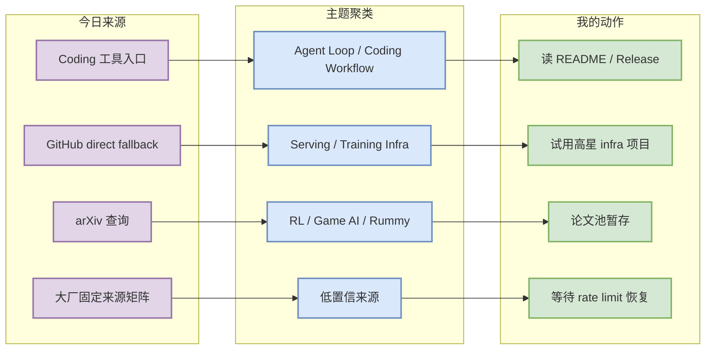
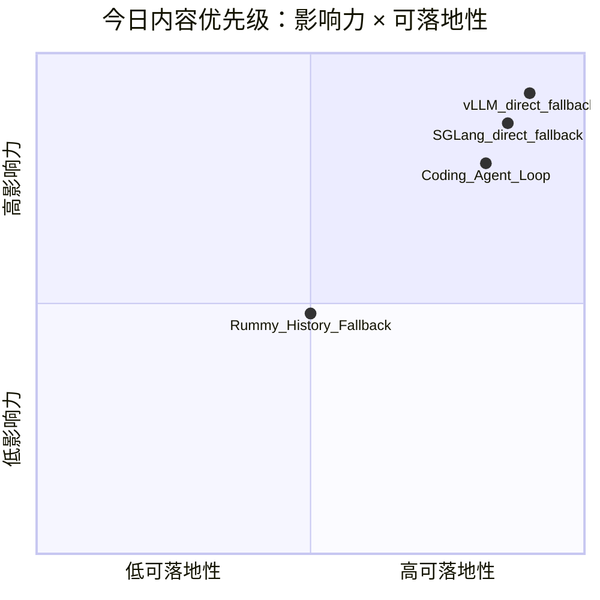

# AI Radar Daily - 2026-09-22

> 生成时间：2026-09-22 09:00 CST  
> 范围：AI Infra / LLM / RL / Game AI / 大厂博客 / 论文 / GitHub / 行业资讯  
> 说明：今日 GitHub Search 从首个查询即 403 rate limit；已保存 mandated snapshot，并使用 direct watched repo fallback / previous theme snapshot fallback，所有 fallback 均显式标注。

## 0. 今日结论

- 今日最值得关注：GitHub Search 全面 403，但 direct `/repos` fallback 仍能覆盖 AI Infra 与 Loop Engineer 固定 Top 10；增长榜不代表完整全网日增。
- 对 AI Infra 的直接影响：vLLM、SGLang、TensorRT-LLM、Transformers、PyTorch、DeepSpeed 等仍是 serving/training 选型观察核心。
- 对 LLM 训练 / 推理 / Agent 的影响：coding-agent 工具链继续围绕 CLI/TUI、IDE 扩展、agent loop、MCP/权限和上下文工程演化。
- 对 RL / 游戏模型训练的影响：Rummy 今日只能使用历史主题 snapshot；可继续跟踪 RummyVision、gin-rummy-rl-lab、Jawaker Hand AI 这类规则+rollout+AI bot 项目。
- 建议今天深读：huggingface/transformers, pytorch/pytorch, anthropics/claude-code

## 1. 今日态势图

## 2. 必读卡片区

> [!important] huggingface/transformers
> - 大类：GitHub
> - 小类：AI Infra / Loop
> - 重点：🤗 Transformers: the model-definition framework for state-of-the-art machine learning models in text, vision, audio, and multimodal models, for both inference an
> - 为什么重要：stars=166486，在 GitHub Search 403 时仍通过 direct watched repo fallback 获取；适合今日快速检查 README/release。
> - 详情：[[GitHub/AIInfra/2026-09-22/huggingface-transformers]] / [网页详情](https://github.com/dyt27666-oss/AI-news-report-obsidians/blob/main/GitHub/AIInfra/2026-09-22/huggingface-transformers.md) / [原文](https://github.com/huggingface/transformers)

> [!important] pytorch/pytorch
> - 大类：GitHub
> - 小类：AI Infra / Loop
> - 重点：Tensors and Dynamic neural networks in Python with strong GPU acceleration
> - 为什么重要：stars=103156，在 GitHub Search 403 时仍通过 direct watched repo fallback 获取；适合今日快速检查 README/release。
> - 详情：[[GitHub/AIInfra/2026-09-22/pytorch-pytorch]] / [网页详情](https://github.com/dyt27666-oss/AI-news-report-obsidians/blob/main/GitHub/AIInfra/2026-09-22/pytorch-pytorch.md) / [原文](https://github.com/pytorch/pytorch)

> [!important] anthropics/claude-code
> - 大类：GitHub
> - 小类：AI Infra / Loop
> - 重点：Claude Code is an agentic coding tool that lives in your terminal, understands your codebase, and helps you code faster by executing routine tasks, explaining c
> - 为什么重要：stars=147471，在 GitHub Search 403 时仍通过 direct watched repo fallback 获取；适合今日快速检查 README/release。
> - 详情：[[Industry/Tools/2026-09-22/anthropics-claude-code]] / [网页详情](https://github.com/dyt27666-oss/AI-news-report-obsidians/blob/main/Industry/Tools/2026-09-22/anthropics-claude-code.md) / [原文](https://github.com/anthropics/claude-code)

## 3. 优先级矩阵

## 4. 分类清单

| 标签 | 大类 | 小类 | 标题 | 重点概括 | 为什么重要 | Obsidian 详情 | 网页详情 | 原文 |
|---|---|---|---|---|---|---|---|---|
| 必读 | GitHub | AI Infra / Loop | huggingface/transformers | 🤗 Transformers: the model-definition framework for state-of-the-art machine learning models in text, | stars=166486，在 GitHub Search 403 时仍通过 direct watched repo fallback 获取；适合今日快速检查 README/release。 | [[GitHub/AIInfra/2026-09-22/huggingface-transformers]] | [网页详情](https://github.com/dyt27666-oss/AI-news-report-obsidians/blob/main/GitHub/AIInfra/2026-09-22/huggingface-transformers.md) | [原文](https://github.com/huggingface/transformers) |
| 必读 | GitHub | AI Infra / Loop | pytorch/pytorch | Tensors and Dynamic neural networks in Python with strong GPU acceleration | stars=103156，在 GitHub Search 403 时仍通过 direct watched repo fallback 获取；适合今日快速检查 README/release。 | [[GitHub/AIInfra/2026-09-22/pytorch-pytorch]] | [网页详情](https://github.com/dyt27666-oss/AI-news-report-obsidians/blob/main/GitHub/AIInfra/2026-09-22/pytorch-pytorch.md) | [原文](https://github.com/pytorch/pytorch) |
| 必读 | GitHub | AI Infra / Loop | anthropics/claude-code | Claude Code is an agentic coding tool that lives in your terminal, understands your codebase, and he | stars=147471，在 GitHub Search 403 时仍通过 direct watched repo fallback 获取；适合今日快速检查 README/release。 | [[Industry/Tools/2026-09-22/anthropics-claude-code]] | [网页详情](https://github.com/dyt27666-oss/AI-news-report-obsidians/blob/main/Industry/Tools/2026-09-22/anthropics-claude-code.md) | [原文](https://github.com/anthropics/claude-code) |

## 5. 大厂资讯 / 工程博客 / Research

### 5.1 公司来源扫描矩阵

| 公司/实验室 | 来源/栏目 | 今日状态 | 高相关条数 | 代表条目 | 备注 |
|---|---|---|---:|---|---|
| OpenAI | News / Research | 低置信：入口已列入扫描；今日自动页面抓取未形成可验证高相关新项 | 0 | 无高相关新项 / 低置信 | GitHub Search 403 不影响公司矩阵；网页源需后续 RSS/API 加固 |
| Anthropic | News / Research / Engineering | 低置信：入口已列入扫描；今日自动页面抓取未形成可验证高相关新项 | 0 | 无高相关新项 / 低置信 | GitHub Search 403 不影响公司矩阵；网页源需后续 RSS/API 加固 |
| Google DeepMind | Blog / Research | 低置信：入口已列入扫描；今日自动页面抓取未形成可验证高相关新项 | 0 | 无高相关新项 / 低置信 | GitHub Search 403 不影响公司矩阵；网页源需后续 RSS/API 加固 |
| Meta AI | Blog / Research | 低置信：入口已列入扫描；今日自动页面抓取未形成可验证高相关新项 | 0 | 无高相关新项 / 低置信 | GitHub Search 403 不影响公司矩阵；网页源需后续 RSS/API 加固 |
| NVIDIA | Technical Blog / AI | 观察：固定入口保留，未自动确认新高相关文章 | 0 | 无高相关新项 / 低置信 | GitHub Search 403 不影响公司矩阵；网页源需后续 RSS/API 加固 |
| Microsoft | Research AI | 观察：固定入口保留，未自动确认新高相关文章 | 0 | 无高相关新项 / 低置信 | GitHub Search 403 不影响公司矩阵；网页源需后续 RSS/API 加固 |
| Hugging Face | Blog / Papers / Releases | 观察：固定入口保留，未自动确认新高相关文章 | 0 | 无高相关新项 / 低置信 | GitHub Search 403 不影响公司矩阵；网页源需后续 RSS/API 加固 |
| 腾讯 | AI Lab / 技术博客 | 低置信：入口已列入扫描；今日自动页面抓取未形成可验证高相关新项 | 0 | 无高相关新项 / 低置信 | GitHub Search 403 不影响公司矩阵；网页源需后续 RSS/API 加固 |
| 字节 | Seed / 技术博客 | 低置信：入口已列入扫描；今日自动页面抓取未形成可验证高相关新项 | 0 | 无高相关新项 / 低置信 | GitHub Search 403 不影响公司矩阵；网页源需后续 RSS/API 加固 |
| SpaceAI | Blog / News | 低置信：入口已列入扫描；今日自动页面抓取未形成可验证高相关新项 | 0 | 无高相关新项 / 低置信 | GitHub Search 403 不影响公司矩阵；网页源需后续 RSS/API 加固 |

### 5.2 高相关大厂条目

| 标签 | 发布方/大厂 | 栏目/来源 | 标题 | 重点概括 | 工程/算法影响 | Obsidian 详情 | 网页详情 | 原文 |
|---|---|---|---|---|---|---|---|---|
| 低置信 | OpenAI | News / Research | 固定来源扫描记录 | 今日未自动确认新高相关项；保留入口与详情页。 | 需继续观察模型、agent、post-training、eval 信号。 | [[Industry/2026-09-22/openai-openai]] | [网页详情](https://github.com/dyt27666-oss/AI-news-report-obsidians/blob/main/Industry/2026-09-22/openai-openai.md) | [原文](https://openai.com/news/) |
| 低置信 | Anthropic | News / Research / Engineering | 固定来源扫描记录 | 今日未自动确认新高相关项；Claude Code 另见工具矩阵。 | 重点观察 agent workflow、Claude Code、MCP、权限模式。 | [[Industry/2026-09-22/anthropic-anthropic]] | [网页详情](https://github.com/dyt27666-oss/AI-news-report-obsidians/blob/main/Industry/2026-09-22/anthropic-anthropic.md) | [原文](https://www.anthropic.com/news) |
| 低置信 | Google DeepMind | Blog / Research | 固定来源扫描记录 | 今日未自动确认新高相关项。 | 重点观察 world model、RL、agent eval。 | [[Industry/2026-09-22/google-deepmind-google-deepmind]] | [网页详情](https://github.com/dyt27666-oss/AI-news-report-obsidians/blob/main/Industry/2026-09-22/google-deepmind-google-deepmind.md) | [原文](https://deepmind.google/discover/blog/) |

## 6. GitHub 高 star Top 10

> 来源：今日 snapshot + direct watched repo fallback；由于 GitHub Search 403，本榜是固定 watched AI Infra 集合，不是完整全网 Top 10。

| 排名 | repo | stars | forks | language | updated_at | topics | 重点概括 | 是否值得试用 | Obsidian 详情 | 原文 |
|---:|---|---:|---:|---|---|---|---|---|---|---|
| 1 | `huggingface/transformers` | 166486 | 34655 | Python | 2026-09-22T01:00:47Z | audio, deep-learning, deepseek, gemma, glm, hacktoberfest, llm, machine-learning | 🤗 Transformers: the model-definition framework for state-of-the-art machine learning model | 值得试用 | [[GitHub/AIInfra/2026-09-22/huggingface-transformers]] | [原文](https://github.com/huggingface/transformers) |
| 2 | `pytorch/pytorch` | 103156 | 30008 | Python | 2026-09-22T00:59:45Z | autograd, deep-learning, gpu, machine-learning, neural-network, numpy, python, t | Tensors and Dynamic neural networks in Python with strong GPU acceleration | 值得试用 | [[GitHub/AIInfra/2026-09-22/pytorch-pytorch]] | [原文](https://github.com/pytorch/pytorch) |
| 3 | `vllm-project/vllm` | 92365 | 22489 | Python | 2026-09-22T00:31:33Z | amd, blackwell, cuda, deepseek, deepseek-v3, gpt, gpt-oss, inference, kimi, llam | A high-throughput and memory-efficient inference and serving engine for LLMs | 值得试用 | [[GitHub/AIInfra/2026-09-22/vllm-project-vllm]] | [原文](https://github.com/vllm-project/vllm) |
| 4 | `ray-project/ray` | 43886 | 8070 | Python | 2026-09-21T23:20:24Z | data-science, deep-learning, deployment, distributed, hyperparameter-optimizatio | Ray is an AI compute engine. Ray consists of a core distributed runtime and a set of AI Li | 值得试用 | [[GitHub/AIInfra/2026-09-22/ray-project-ray]] | [原文](https://github.com/ray-project/ray) |
| 5 | `facebookresearch/faiss` | 40950 | 4529 | C++ | 2026-09-21T23:26:39Z | 未标注 | A library for efficient similarity search and clustering of dense vectors. | 值得试用 | [[GitHub/AIInfra/2026-09-22/facebookresearch-faiss]] | [原文](https://github.com/facebookresearch/faiss) |
| 6 | `sgl-project/sglang` | 36275 | 9039 | Python | 2026-09-22T01:02:29Z | attention, blackwell, cuda, deepseek, diffusion, glm, gpt-oss, inference, llama, | SGLang is a high-performance serving framework for large language models and multimodal mo | 值得试用 | [[GitHub/AIInfra/2026-09-22/sgl-project-sglang]] | [原文](https://github.com/sgl-project/sglang) |
| 7 | `microsoft/onnxruntime` | 21903 | 4240 | C++ | 2026-09-22T00:09:03Z | ai-framework, deep-learning, hardware-acceleration, machine-learning, neural-net | ONNX Runtime: cross-platform, high performance ML inferencing and training accelerator | 值得试用 | [[GitHub/AIInfra/2026-09-22/microsoft-onnxruntime]] | [原文](https://github.com/microsoft/onnxruntime) |
| 8 | `triton-lang/triton` | 20214 | 3209 | MLIR | 2026-09-22T00:26:47Z | 未标注 | Development repository for the Triton language and compiler | 值得试用 | [[GitHub/AIInfra/2026-09-22/triton-lang-triton]] | [原文](https://github.com/triton-lang/triton) |
| 9 | `NVIDIA/Megatron-LM` | 17969 | 4547 | Python | 2026-09-21T23:08:56Z | large-language-models, model-para, transformers | Ongoing research training transformer models at scale | 值得试用 | [[GitHub/AIInfra/2026-09-22/nvidia-megatron-lm]] | [原文](https://github.com/NVIDIA/Megatron-LM) |
| 10 | `google-deepmind/alphafold` | 14859 | 2951 | Python | 2026-09-21T21:08:01Z | 未标注 | Open source code for AlphaFold 2. | 值得试用 | [[GitHub/AIInfra/2026-09-22/google-deepmind-alphafold]] | [原文](https://github.com/google-deepmind/alphafold) |

## 7. GitHub star 增长最快 Top 10

> 来源：优先使用 2026-09-21 snapshot baseline；标注为 `direct watched repo fallback，非完整全网日增`，不代表全 GitHub 今日真实增长。

| 排名 | repo | stars_delta | stars | forks | language | updated_at | 增长依据 | 重点概括 | Obsidian 详情 | 原文 |
|---:|---|---:|---:|---:|---|---|---|---|---|---|
| 1 | `vllm-project/vllm` | 104 | 92365 | 22489 | Python | 2026-09-22T00:31:33Z | direct watched repo fallback，非完整全网日增 | A high-throughput and memory-efficient inference and serving engine for LLMs | [[GitHub/AIInfra/2026-09-22/vllm-project-vllm]] | [原文](https://github.com/vllm-project/vllm) |
| 2 | `sgl-project/sglang` | 56 | 36275 | 9039 | Python | 2026-09-22T01:02:29Z | direct watched repo fallback，非完整全网日增 | SGLang is a high-performance serving framework for large language models and multimodal mo | [[GitHub/AIInfra/2026-09-22/sgl-project-sglang]] | [原文](https://github.com/sgl-project/sglang) |
| 3 | `huggingface/transformers` | 33 | 166486 | 34655 | Python | 2026-09-22T01:00:47Z | direct watched repo fallback，非完整全网日增 | 🤗 Transformers: the model-definition framework for state-of-the-art machine learning model | [[GitHub/AIInfra/2026-09-22/huggingface-transformers]] | [原文](https://github.com/huggingface/transformers) |
| 4 | `pytorch/pytorch` | 21 | 103156 | 30008 | Python | 2026-09-22T00:59:45Z | direct watched repo fallback，非完整全网日增 | Tensors and Dynamic neural networks in Python with strong GPU acceleration | [[GitHub/AIInfra/2026-09-22/pytorch-pytorch]] | [原文](https://github.com/pytorch/pytorch) |
| 5 | `NVIDIA/Megatron-LM` | 9 | 17969 | 4547 | Python | 2026-09-21T23:08:56Z | direct watched repo fallback，非完整全网日增 | Ongoing research training transformer models at scale | [[GitHub/AIInfra/2026-09-22/nvidia-megatron-lm]] | [原文](https://github.com/NVIDIA/Megatron-LM) |
| 6 | `NVIDIA/TensorRT-LLM` | 9 | 14689 | 2767 | Python | 2026-09-22T00:06:33Z | direct watched repo fallback，非完整全网日增 | TensorRT LLM provides users with an easy-to-use Python API to define Large Language Models | [[GitHub/AIInfra/2026-09-22/nvidia-tensorrt-llm]] | [原文](https://github.com/NVIDIA/TensorRT-LLM) |
| 7 | `OpenRLHF/OpenRLHF` | 8 | 10028 | 1022 | Python | 2026-09-21T20:19:04Z | direct watched repo fallback，非完整全网日增 | An Easy-to-use, Scalable and High-performance Agentic RL Framework based on Ray (PPO & DAP | [[GitHub/AIInfra/2026-09-22/openrlhf-openrlhf]] | [原文](https://github.com/OpenRLHF/OpenRLHF) |
| 8 | `ray-project/ray` | null | 43886 | 8070 | Python | 2026-09-21T23:20:24Z | direct watched repo fallback，缺少历史 baseline | Ray is an AI compute engine. Ray consists of a core distributed runtime and a set of AI Li | [[GitHub/AIInfra/2026-09-22/ray-project-ray]] | [原文](https://github.com/ray-project/ray) |
| 9 | `facebookresearch/faiss` | null | 40950 | 4529 | C++ | 2026-09-21T23:26:39Z | direct watched repo fallback，缺少历史 baseline | A library for efficient similarity search and clustering of dense vectors. | [[GitHub/AIInfra/2026-09-22/facebookresearch-faiss]] | [原文](https://github.com/facebookresearch/faiss) |
| 10 | `microsoft/onnxruntime` | null | 21903 | 4240 | C++ | 2026-09-22T00:09:03Z | direct watched repo fallback，缺少历史 baseline | ONNX Runtime: cross-platform, high performance ML inferencing and training accelerator | [[GitHub/AIInfra/2026-09-22/microsoft-onnxruntime]] | [原文](https://github.com/microsoft/onnxruntime) |

## 8. Coding 工具 / AI 工具功能更新

### 8.1 Coding 工具扫描矩阵

| 工具 | 厂商 | 来源类型 | 今日状态 | 代表更新 | 对我的影响 | 原文 |
|---|---|---|---|---|---|---|
| Claude Code | Anthropic | Changelog / Release Notes | 已扫描（direct repo fallback，非完整 release 抽取） | GitHub direct fallback: stars=147471, updated_at=2026-09-22T01:00:33Z | 可作为 agent loop / CLI / IDE 扩展能力观察；需人工读 release notes 确认具体功能变化。 | [原文](https://docs.anthropic.com/en/release-notes/claude-code) |
| OpenAI Codex | OpenAI | Changelog / Docs | 已扫描（direct repo fallback，非完整 release 抽取） | GitHub direct fallback: stars=125760, updated_at=2026-09-22T01:02:02Z | 可作为 agent loop / CLI / IDE 扩展能力观察；需人工读 release notes 确认具体功能变化。 | [原文](https://developers.openai.com/codex/changelog) |
| Cursor | Cursor | Changelog | 低置信 / 入口保留 | 未发现可自动验证的新高相关功能更新 | 保留扫描位，避免漏掉权限模式、MCP、上下文窗口、pricing/rate limit 变化。 | [原文](https://cursor.com/changelog) |
| Windsurf | Windsurf | Changelog | 低置信 / 入口保留 | 未发现可自动验证的新高相关功能更新 | 保留扫描位，避免漏掉权限模式、MCP、上下文窗口、pricing/rate limit 变化。 | [原文](https://windsurf.com/changelog) |
| GitHub Copilot | GitHub | Changelog / Blog | 低置信 / 入口保留 | 未发现可自动验证的新高相关功能更新 | 保留扫描位，避免漏掉权限模式、MCP、上下文窗口、pricing/rate limit 变化。 | [原文](https://github.blog/changelog/label/copilot/) |
| Gemini Code Assist | Google | Release Notes | 已扫描（direct repo fallback，非完整 release 抽取） | GitHub direct fallback: stars=107121, updated_at=2026-09-22T00:05:32Z | 可作为 agent loop / CLI / IDE 扩展能力观察；需人工读 release notes 确认具体功能变化。 | [原文](https://cloud.google.com/gemini/docs/codeassist/release-notes) |
| Qwen Code | Alibaba/Qwen | GitHub Releases | 已扫描（direct repo fallback，非完整 release 抽取） | GitHub direct fallback: stars=28048, updated_at=2026-09-22T00:26:53Z | 可作为 agent loop / CLI / IDE 扩展能力观察；需人工读 release notes 确认具体功能变化。 | [原文](https://github.com/QwenLM/qwen-code/releases) |
| Roo Code | Roo Code | GitHub Releases | 已扫描（direct repo fallback，非完整 release 抽取） | GitHub direct fallback: stars=24299, updated_at=2026-09-21T17:40:23Z | 可作为 agent loop / CLI / IDE 扩展能力观察；需人工读 release notes 确认具体功能变化。 | [原文](https://github.com/RooCodeInc/Roo-Code/releases) |
| Cline | Cline | GitHub Releases | 已扫描（direct repo fallback，非完整 release 抽取） | GitHub direct fallback: stars=68977, updated_at=2026-09-22T00:40:29Z | 可作为 agent loop / CLI / IDE 扩展能力观察；需人工读 release notes 确认具体功能变化。 | [原文](https://github.com/cline/cline/releases) |
| Continue | Continue | GitHub Releases | 已扫描（direct repo fallback，非完整 release 抽取） | GitHub direct fallback: stars=35978, updated_at=2026-09-21T23:07:52Z | 可作为 agent loop / CLI / IDE 扩展能力观察；需人工读 release notes 确认具体功能变化。 | [原文](https://github.com/continuedev/continue/releases) |

### 8.2 高相关工具更新

| 标签 | 工具/厂商 | 来源类型 | 标题/功能 | 重点概括 | 对 AI coding 工作流的影响 | Obsidian 详情 | 网页详情 | 原文 |
|---|---|---|---|---|---|---|---|---|
| 可 skim | OpenAI Codex | GitHub / Docs | Codex repo direct fallback | 今日通过 direct repo 获取元数据，未完整解析 changelog。 | 继续观察 CLI/IDE、remote execution、agent mode 和权限策略。 | [[Industry/Tools/2026-09-22/openai-codex]] | [网页详情](https://github.com/dyt27666-oss/AI-news-report-obsidians/blob/main/Industry/Tools/2026-09-22/openai-codex.md) | [原文](https://github.com/openai/codex) |
| 可 skim | Claude Code | Docs / Release Notes | Claude Code 固定入口 | 今日保留 Changelog 扫描位，未自动确认具体新功能。 | 与 tmux 多 agent 监控、权限模式、上下文工程高度相关。 | [[Industry/Tools/2026-09-22/anthropics-claude-code]] | [网页详情](https://github.com/dyt27666-oss/AI-news-report-obsidians/blob/main/Industry/Tools/2026-09-22/anthropics-claude-code.md) | [原文](https://docs.anthropic.com/en/release-notes/claude-code) |
| 可 skim | Cline / Roo / Continue | GitHub Releases | IDE agent extension direct fallback | direct repo 可用，release 细节需后续复核。 | 适合观察 VS Code agent loop、MCP、工具调用与代码审查体验。 | [[Industry/Tools/2026-09-22/cline-cline]] | [网页详情](https://github.com/dyt27666-oss/AI-news-report-obsidians/blob/main/Industry/Tools/2026-09-22/cline-cline.md) | [原文](https://github.com/cline/cline/releases) |

## 9. Point Rummy / Indian Rummy 业务主题

### 9.1 GitHub 候选

| 标签 | repo | stars | forks | language | updated_at | 重点概括 | 业务可用性 | Obsidian 详情 | 原文 |
|---|---|---:|---:|---|---|---|---|---|---|
| 低置信 | `Abhilash-Mandlekar/RummyAgent-Reinforecement-Learning` | 2 | 0 | Jupyter Notebook | 2023-04-01T05:48:51Z | Rummy Game Agent trained using Reinforcement Learning algorithm. | 可用于规则建模 / bot / 视觉识别 / rollout 参考；previous theme snapshot fallback，非今日实时数据 | [[GitHub/PointRummy/2026-09-22/abhilash-mandlekar-rummyagent-reinforecement-learning]] | [原文](https://github.com/Abhilash-Mandlekar/RummyAgent-Reinforecement-Learning) |
| 低置信 | `Alan-seb/RummyVision` | 1 | 0 | Python | 2025-12-03T03:14:55Z | RummyVision is an intelligent card game assistant that combines computer vision with Monte Carlo sim | 可用于规则建模 / bot / 视觉识别 / rollout 参考；previous theme snapshot fallback，非今日实时数据 | [[GitHub/PointRummy/2026-09-22/alan-seb-rummyvision]] | [原文](https://github.com/Alan-seb/RummyVision) |
| 低置信 | `drewmcgee/gin-rummy-rl-lab` | 0 | 0 | Python | 2026-04-30T00:13:25Z | Gin Rummy reinforcement learning lab with a Java game server, Python agents, and C++ rollout infrast | 可用于规则建模 / bot / 视觉识别 / rollout 参考；previous theme snapshot fallback，非今日实时数据 | [[GitHub/PointRummy/2026-09-22/drewmcgee-gin-rummy-rl-lab]] | [原文](https://github.com/drewmcgee/gin-rummy-rl-lab) |
| 低置信 | `hamzaalmughrabi/jawaker-hand-ai` | 0 | 0 | Python | 2026-08-26T16:07:41Z | Superhuman AI Grandmaster Engine for Jawaker Hand Rummy (هاند جواكر) featuring Deep ISMCTS, Neural V | 可用于规则建模 / bot / 视觉识别 / rollout 参考；previous theme snapshot fallback，非今日实时数据 | [[GitHub/PointRummy/2026-09-22/hamzaalmughrabi-jawaker-hand-ai]] | [原文](https://github.com/hamzaalmughrabi/jawaker-hand-ai) |
| 低置信 | `JiheHe/CPSC474-final-project` | 1 | 0 | Python | 2024-01-30T15:59:25Z | Rummy Card Game from scratch + Heuristic & MCTS AI agents | 可用于规则建模 / bot / 视觉识别 / rollout 参考；previous theme snapshot fallback，非今日实时数据 | [[GitHub/PointRummy/2026-09-22/jihehe-cpsc474-final-project]] | [原文](https://github.com/JiheHe/CPSC474-final-project) |
| 低置信 | `jmhummel/Gin-Rummy-Java` | 8 | 0 | Java | 2023-08-16T16:12:58Z | Java-based Gin Rummy console game, with an AI opponent | 可用于规则建模 / bot / 视觉识别 / rollout 参考；previous theme snapshot fallback，非今日实时数据 | [[GitHub/PointRummy/2026-09-22/jmhummel-gin-rummy-java]] | [原文](https://github.com/jmhummel/Gin-Rummy-Java) |

### 9.2 论文 / 资料候选

| 标签 | 来源 | 标题 | 作者/机构 | 重点概括 | 对 Point Rummy 业务有什么用 | Obsidian 详情 | 原文 |
|---|---|---|---|---|---|---|---|
| 低置信 | arXiv 查询 | Rummy / imperfect-information card game 查询 | 自动查询 | 今日 arXiv 查询未形成强相关、可直接用于 Indian Rummy 的新论文；保留低置信观察。 | 继续关注 ISMCTS、belief state、self-play、rollout/evaluator。 | - | [arXiv search](https://arxiv.org/search/?query=gin+rummy+artificial+intelligence&searchtype=all) |

### 9.3 业务可用性判断

| 方向 | 今日信号 | 可用性 | 下一步 |
|---|---|---|---|
| 规则引擎 / 计分 | previous theme snapshot 中有多款计分/规则项目 | 中：可抽取 meld、drop、score、round state | 对 RummyVision / RummyPulse / Java/Python 项目做接口级阅读 |
| Bot / RL Agent | gin-rummy-rl-lab、Jawaker Hand AI、RummyAgent RL | 中低：代码质量和环境完整度需验证 | 建立最小 Gymnasium/RLCard 风格 env 对照 |
| 仿真 / 评测 | 多数项目 star 低，但提供 rollout/AI opponent 思路 | 中：适合作为负样本和状态表示参考 | 设计自有 evaluator，不直接复用低星代码 |

## 10. Loop Engineer / Loop Engineering 主题

### 10.1 Loop Engineer GitHub 高 star Top 10

| 排名 | repo | stars | forks | language | updated_at | topics | 重点概括 | 是否值得试用 | Obsidian 详情 | 原文 |
|---:|---|---:|---:|---|---|---|---|---|---|---|
| 1 | `anthropics/claude-code` | 147471 | 24114 | TypeScript | 2026-09-22T01:00:33Z | 未标注 | Claude Code is an agentic coding tool that lives in your terminal, understands your codeba | 值得试用 | [[Industry/Tools/2026-09-22/anthropics-claude-code]] | [原文](https://github.com/anthropics/claude-code) |
| 2 | `openai/codex` | 125760 | 19567 | Rust | 2026-09-22T01:02:02Z | 未标注 | Lightweight coding agent that runs in your terminal | 值得试用 | [[Industry/Tools/2026-09-22/openai-codex]] | [原文](https://github.com/openai/codex) |
| 3 | `google-gemini/gemini-cli` | 107121 | 14610 | TypeScript | 2026-09-22T00:05:32Z | ai, ai-agents, cli, gemini, gemini-api, mcp-client, mcp-server | An open-source AI agent that brings the power of Gemini directly into your terminal. | 值得试用 | [[GitHub/LoopEngineer/2026-09-22/google-gemini-gemini-cli]] | [原文](https://github.com/google-gemini/gemini-cli) |
| 4 | `modelcontextprotocol/servers` | 90534 | 11673 | TypeScript | 2026-09-21T23:19:41Z | 未标注 | Model Context Protocol Servers | 值得试用 | [[GitHub/LoopEngineer/2026-09-22/modelcontextprotocol-servers]] | [原文](https://github.com/modelcontextprotocol/servers) |
| 5 | `cline/cline` | 68977 | 7474 | TypeScript | 2026-09-22T00:40:29Z | 未标注 | Autonomous coding agent as an SDK, IDE extension, or CLI assistant. | 值得试用 | [[Industry/Tools/2026-09-22/cline-cline]] | [原文](https://github.com/cline/cline) |
| 6 | `Aider-AI/aider` | 49107 | 4983 | Python | 2026-09-22T00:12:20Z | anthropic, chatgpt, claude-3, cli, command-line, gemini, gpt-3, gpt-35-turbo, gp | aider is AI pair programming in your terminal | 值得试用 | [[GitHub/LoopEngineer/2026-09-22/aider-ai-aider]] | [原文](https://github.com/Aider-AI/aider) |
| 7 | `langchain-ai/langgraph` | 42099 | 7111 | Python | 2026-09-21T23:24:54Z | agents, ai, ai-agents, chatgpt, deepagents, enterprise, framework, gemini, gener | Build resilient agents. | 值得试用 | [[GitHub/LoopEngineer/2026-09-22/langchain-ai-langgraph]] | [原文](https://github.com/langchain-ai/langgraph) |
| 8 | `continuedev/continue` | 35978 | 5409 | TypeScript | 2026-09-21T23:07:52Z | agent, ai, cli, developer-tools, open-source | open-source coding agent | 值得试用 | [[Industry/Tools/2026-09-22/continuedev-continue]] | [原文](https://github.com/continuedev/continue) |
| 9 | `QwenLM/qwen-code` | 28048 | 3076 | TypeScript | 2026-09-22T00:26:53Z | agentic, ai, ai-agent, ai-coding, cli, coding-agent, developer-tools, llm, mcp,  | An open-source AI coding agent that lives in your terminal. | 值得试用 | [[Industry/Tools/2026-09-22/qwenlm-qwen-code]] | [原文](https://github.com/QwenLM/qwen-code) |
| 10 | `RooCodeInc/Roo-Code` | 24299 | 3422 | TypeScript | 2026-09-21T17:40:23Z | 未标注 | Roo Code gives you a whole dev team of AI agents in your code editor. | 值得试用 | [[Industry/Tools/2026-09-22/roocodeinc-roo-code]] | [原文](https://github.com/RooCodeInc/Roo-Code) |

### 10.2 Loop Engineer GitHub star 增长最快 Top 10

| 排名 | repo | stars_delta | stars | forks | language | updated_at | 增长依据 | 重点概括 | Obsidian 详情 | 原文 |
|---:|---|---:|---:|---:|---|---|---|---|---|---|
| 1 | `openai/codex` | 248 | 125760 | 19567 | Rust | 2026-09-22T01:02:02Z | direct watched repo fallback，非完整全网日增 | Lightweight coding agent that runs in your terminal | [[Industry/Tools/2026-09-22/openai-codex]] | [原文](https://github.com/openai/codex) |
| 2 | `cline/cline` | 85 | 68977 | 7474 | TypeScript | 2026-09-22T00:40:29Z | direct watched repo fallback，非完整全网日增 | Autonomous coding agent as an SDK, IDE extension, or CLI assistant. | [[Industry/Tools/2026-09-22/cline-cline]] | [原文](https://github.com/cline/cline) |
| 3 | `langchain-ai/langgraph` | 66 | 42099 | 7111 | Python | 2026-09-21T23:24:54Z | direct watched repo fallback，非完整全网日增 | Build resilient agents. | [[GitHub/LoopEngineer/2026-09-22/langchain-ai-langgraph]] | [原文](https://github.com/langchain-ai/langgraph) |
| 4 | `modelcontextprotocol/servers` | 31 | 90534 | 11673 | TypeScript | 2026-09-21T23:19:41Z | direct watched repo fallback，非完整全网日增 | Model Context Protocol Servers | [[GitHub/LoopEngineer/2026-09-22/modelcontextprotocol-servers]] | [原文](https://github.com/modelcontextprotocol/servers) |
| 5 | `QwenLM/qwen-code` | 23 | 28048 | 3076 | TypeScript | 2026-09-22T00:26:53Z | direct watched repo fallback，非完整全网日增 | An open-source AI coding agent that lives in your terminal. | [[Industry/Tools/2026-09-22/qwenlm-qwen-code]] | [原文](https://github.com/QwenLM/qwen-code) |
| 6 | `Aider-AI/aider` | 21 | 49107 | 4983 | Python | 2026-09-22T00:12:20Z | direct watched repo fallback，非完整全网日增 | aider is AI pair programming in your terminal | [[GitHub/LoopEngineer/2026-09-22/aider-ai-aider]] | [原文](https://github.com/Aider-AI/aider) |
| 7 | `google-gemini/gemini-cli` | 19 | 107121 | 14610 | TypeScript | 2026-09-22T00:05:32Z | direct watched repo fallback，非完整全网日增 | An open-source AI agent that brings the power of Gemini directly into your terminal. | [[GitHub/LoopEngineer/2026-09-22/google-gemini-gemini-cli]] | [原文](https://github.com/google-gemini/gemini-cli) |
| 8 | `continuedev/continue` | 15 | 35978 | 5409 | TypeScript | 2026-09-21T23:07:52Z | direct watched repo fallback，非完整全网日增 | open-source coding agent | [[Industry/Tools/2026-09-22/continuedev-continue]] | [原文](https://github.com/continuedev/continue) |
| 9 | `RooCodeInc/Roo-Code` | -4 | 24299 | 3422 | TypeScript | 2026-09-21T17:40:23Z | direct watched repo fallback，非完整全网日增 | Roo Code gives you a whole dev team of AI agents in your code editor. | [[Industry/Tools/2026-09-22/roocodeinc-roo-code]] | [原文](https://github.com/RooCodeInc/Roo-Code) |
| 10 | `anthropics/claude-code` | null | 147471 | 24114 | TypeScript | 2026-09-22T01:00:33Z | direct watched repo fallback，缺少历史 baseline | Claude Code is an agentic coding tool that lives in your terminal, understands your codeba | [[Industry/Tools/2026-09-22/anthropics-claude-code]] | [原文](https://github.com/anthropics/claude-code) |

### 10.3 Loop Engineering 方法信号

| 标签 | 来源 | 标题 | 重点概括 | 对 AI coding 工作流的影响 | Obsidian 详情 | 原文 |
|---|---|---|---|---|---|---|
| 必读 | GitHub direct fallback | Claude Code / Codex / Roo / Cline / Continue / Aider / LangGraph | 今日 Loop 表以固定 watched repo 构建；关注 agent loop、上下文工程、工具权限、MCP、review loop。 | 可指导多 agent 并行开发、tmux 监控、代码审查与任务分解。 | [[GitHub/LoopEngineer/2026-09-22/aider-ai-aider]] | [原文](https://github.com/Aider-AI/aider) |

## 11. 论文

### 11.1 arXiv 今日候选

| 标签 | 论文来源 | 论文 | 作者/机构 | 重点概括 | 工程/研究价值 | Obsidian 详情 | 网页详情 | PDF/原文 |
|---|---|---|---|---|---|---|---|---|

| 可 skim | arXiv / 预印本 | TicTacBench: Benchmarking Timing Closure Capabilities of Coding Agents | Bowei Wang, Zhigang Fang, Zhijie Yang, Renzhi Chen | Recent advances in large language models (LLMs) have led to the emergence of coding agents capable of performing complex | 命中 AI Radar 论文查询；需读 PDF 后判断复现价值。 | [[Papers/2026-09-22/2609-23363v1-tictacbench-benchmarking-timing-closure-capabilit]] | [网页详情](https://github.com/dyt27666-oss/AI-news-report-obsidians/blob/main/Papers/2026-09-22/2609-23363v1-tictacbench-benchmarking-timing-closure-capabilit.md) | [PDF/原文](https://arxiv.org/pdf/2609.23363v1) |
| 可 skim | arXiv / 预印本 | Machine-Interpretable Information: Compiling Documents into Searchable and Readable Protocol States | Yifan Wang, Dejing Dou | Long-context language models interface with external knowledge through raw natural language. In retrieval-augmented syst | 命中 AI Radar 论文查询；需读 PDF 后判断复现价值。 | [[Papers/2026-09-22/2609-23371v1-machine-interpretable-information-compiling-docum]] | [网页详情](https://github.com/dyt27666-oss/AI-news-report-obsidians/blob/main/Papers/2026-09-22/2609-23371v1-machine-interpretable-information-compiling-docum.md) | [PDF/原文](https://arxiv.org/pdf/2609.23371v1) |
| 可 skim | arXiv / 预印本 | Co-occurrence Patterns of LoRA Adapters in Production Diffusion Model Inference Services | Tao Zhang, Bin Liao, Tao Zhou, Yanping Liu | Low-rank adaptation (LoRA) has become a key technology for serving large-scale personalized large language models and di | 命中 AI Radar 论文查询；需读 PDF 后判断复现价值。 | [[Papers/2026-09-22/2609-23321v1-co-occurrence-patterns-of-lora-adapters-in-product]] | [网页详情](https://github.com/dyt27666-oss/AI-news-report-obsidians/blob/main/Papers/2026-09-22/2609-23321v1-co-occurrence-patterns-of-lora-adapters-in-product.md) | [PDF/原文](https://arxiv.org/pdf/2609.23321v1) |

## 12. 资讯 / 其他 GitHub 项目

### 12.1 今日 fallback 说明

| 标签 | 来源 | 标题 | 重点概括 | 对我有什么用 | Obsidian 详情 | 网页详情 | 原文 |
|---|---|---|---|---|---|---|---|
| 后续 | Automation snapshot | GitHub Search 403 fallback | 今日 mandated snapshot 已保存，但 repos 初始为 0；随后用 direct watched repo fallback 补齐固定榜单。 | 保证日报不断档，同时不伪装成完整全网搜索。 | [[Automation/state/github-stars-2026-09-22.json]] | [网页详情](https://github.com/dyt27666-oss/AI-news-report-obsidians/blob/main/Automation/state/github-stars-2026-09-22.json) | [GitHub API](https://api.github.com/search/repositories) |

## 13. 按主题索引

### AI Infra / Serving / Training
- [[GitHub/AIInfra/2026-09-22/huggingface-transformers]] - huggingface/transformers
- [[GitHub/AIInfra/2026-09-22/pytorch-pytorch]] - pytorch/pytorch
- [[GitHub/AIInfra/2026-09-22/vllm-project-vllm]] - vllm-project/vllm
- [[GitHub/AIInfra/2026-09-22/ray-project-ray]] - ray-project/ray
- [[GitHub/AIInfra/2026-09-22/facebookresearch-faiss]] - facebookresearch/faiss

### LLM / Agent / RAG / Evaluation
- [[Industry/Tools/2026-09-22/anthropics-claude-code]] - anthropics/claude-code
- [[Industry/Tools/2026-09-22/openai-codex]] - openai/codex
- [[GitHub/LoopEngineer/2026-09-22/google-gemini-gemini-cli]] - google-gemini/gemini-cli
- [[GitHub/LoopEngineer/2026-09-22/modelcontextprotocol-servers]] - modelcontextprotocol/servers
- [[Industry/Tools/2026-09-22/cline-cline]] - cline/cline

### RL / Game AI / World Model
- [[GitHub/PointRummy/2026-09-22/abhilash-mandlekar-rummyagent-reinforecement-learning]] - Abhilash-Mandlekar/RummyAgent-Reinforecement-Learning
- [[GitHub/PointRummy/2026-09-22/alan-seb-rummyvision]] - Alan-seb/RummyVision
- [[GitHub/PointRummy/2026-09-22/drewmcgee-gin-rummy-rl-lab]] - drewmcgee/gin-rummy-rl-lab

### Point Rummy / Indian Rummy
- [[GitHub/PointRummy/2026-09-22/abhilash-mandlekar-rummyagent-reinforecement-learning]] - Abhilash-Mandlekar/RummyAgent-Reinforecement-Learning
- [[GitHub/PointRummy/2026-09-22/alan-seb-rummyvision]] - Alan-seb/RummyVision
- [[GitHub/PointRummy/2026-09-22/drewmcgee-gin-rummy-rl-lab]] - drewmcgee/gin-rummy-rl-lab
- [[GitHub/PointRummy/2026-09-22/hamzaalmughrabi-jawaker-hand-ai]] - hamzaalmughrabi/jawaker-hand-ai
- [[GitHub/PointRummy/2026-09-22/jihehe-cpsc474-final-project]] - JiheHe/CPSC474-final-project

### Loop Engineer / Coding Agent Loop
- [[Industry/Tools/2026-09-22/anthropics-claude-code]] - anthropics/claude-code
- [[Industry/Tools/2026-09-22/openai-codex]] - openai/codex
- [[GitHub/LoopEngineer/2026-09-22/google-gemini-gemini-cli]] - google-gemini/gemini-cli
- [[GitHub/LoopEngineer/2026-09-22/modelcontextprotocol-servers]] - modelcontextprotocol/servers
- [[Industry/Tools/2026-09-22/cline-cline]] - cline/cline

### 公司 / 实验室
- OpenAI: [[Industry/2026-09-22/openai-openai]]
- Anthropic: [[Industry/2026-09-22/anthropic-anthropic]]
- DeepMind: [[Industry/2026-09-22/google-deepmind-google-deepmind]]

### 大牛 / 作者
- 今日未自动确认大牛个人新项；论文作者见 `## 11. 论文`。

## 14. 值得后续深挖

| 标签 | 大类 | 小类 | 标题 | 后续动作 | Obsidian 详情 | 原文 |
|---|---|---|---|---|---|---|
| 后续 | GitHub | Serving | vLLM / SGLang / TensorRT-LLM | 检查最近 release notes、benchmark、KV cache / scheduler 变化。 | [[GitHub/AIInfra/2026-09-22/vllm-project-vllm]] | [原文](https://github.com/vllm-project/vllm) |
| 后续 | Coding Tool | Agent Loop | Claude Code / Codex / Cline | 补抓 changelog，确认是否有权限模式、MCP、上下文窗口、remote exec 新变化。 | [[Industry/Tools/2026-09-22/openai-codex]] | [原文](https://developers.openai.com/codex/changelog) |
| 后续 | Business | Point Rummy | RummyVision / gin-rummy-rl-lab | 对规则引擎、视觉识别、rollout infrastructure 做最小可复用性评估。 | [[GitHub/PointRummy/2026-09-22/alan-seb-rummyvision]] | [原文](https://github.com/Alan-seb/RummyVision) |

## 15. 采集失败或低置信来源

- GitHub Search：从首个 query 开始 HTTP 403 rate limit exceeded；已保存 `Automation/state/github-stars-2026-09-22.json`，并用 direct watched repo fallback 补齐固定榜单。
- GitHub broad/rummy/loop 全网增长：今日不声称完整全网真实增长；所有增长榜均标注 fallback。
- 公司博客：固定来源矩阵已生成；由于无稳定 RSS/API 抽取，本次多数为低置信入口扫描。
- arXiv：已执行等价查询；候选作为低/中置信论文池，未阅读全文。
- direct repo fallback errors：0 条。

## 16. 归档标签

#ai-radar #daily #ai-infra #llm #rl #point-rummy #loop-engineering
