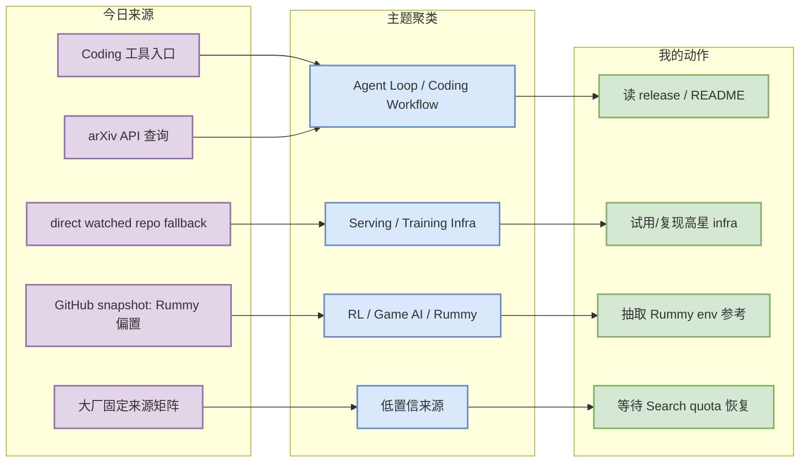
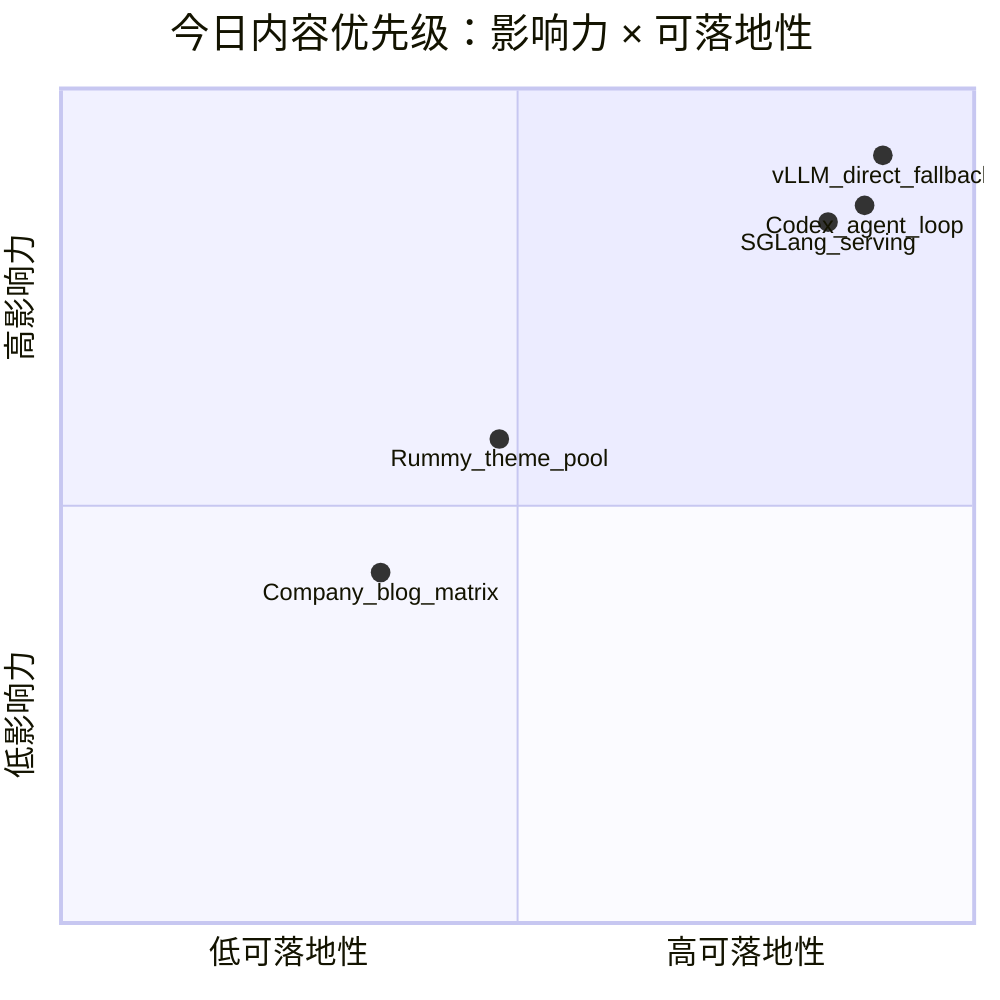

# AI Radar Daily - 2026-09-23

> 生成时间：2026-09-23 09:00 CST  
> 范围：AI Infra / LLM / RL / Game AI / 大厂博客 / 论文 / GitHub / 行业资讯  
> 说明：今日 GitHub Search 在 Rummy 查询后开始 403 rate limit；已保存 mandated snapshot，并使用 direct watched repo fallback 补齐 AI Infra 与 Loop Engineer 固定榜单。Rummy 主题使用今日已采集的主题结果，fallback 均显式标注。

## 0. 今日结论

- 今日最值得关注：GitHub Search 今日采到大量 Rummy 主题结果后被 403 限流，宽泛 AI Infra / Loop 表必须使用 direct watched repo fallback，不代表完整全网增长。
- 对 AI Infra 的直接影响：vLLM、Transformers、PyTorch、SGLang、Ray、FAISS、TensorRT-LLM 等仍是 serving/training 观察主线；增长榜要看 fallback 标签。
- 对 LLM 训练 / 推理 / Agent 的影响：Claude Code、Codex、Gemini CLI、Cline、Aider、LangGraph、Continue 继续构成 coding-agent loop 的主要观察集。
- 对 RL / 游戏模型训练的影响：Point Rummy 今日主题数据比昨日更丰富，但多数 repo 低星/低置信，适合作为规则、状态表示、AI opponent 与 rollout 参考，不宜直接复用。
- 建议今天深读：`openai/codex` / `vllm-project/vllm` / `sgl-project/sglang` / `nakkekakke/rummy-ai` / 今日 arXiv 候选。

## 1. 今日态势图

## 2. 必读卡片区

> [!important] openai/codex
> - 大类：GitHub / Coding Tool
> - 小类：Loop Engineer / Coding Agent
> - 重点：轻量级终端 coding agent，今日 direct watched repo fallback 继续显示高热度。
> - 为什么重要：与 tmux 多 agent、权限模式、上下文工程、CLI/TUI 工作流直接相关。
> - 详情：[[Industry/Tools/2026-09-23/openai-codex]] / [网页详情](https://github.com/dyt27666-oss/AI-news-report-obsidians/blob/main/Industry/Tools/2026-09-23/openai-codex.md) / [原文](https://github.com/openai/codex)

> [!important] vllm-project/vllm
> - 大类：GitHub
> - 小类：AI Infra / LLM Serving
> - 重点：高吞吐 LLM serving 核心项目；今日增长来自 direct watched repo fallback。
> - 为什么重要：KV cache、scheduler、batching、推理服务选型都绕不开它。
> - 详情：[[GitHub/AIInfra/2026-09-23/vllm-project-vllm]] / [网页详情](https://github.com/dyt27666-oss/AI-news-report-obsidians/blob/main/GitHub/AIInfra/2026-09-23/vllm-project-vllm.md) / [原文](https://github.com/vllm-project/vllm)

> [!tip] Point Rummy 今日主题池
> - 大类：GitHub / Business
> - 小类：Rummy AI / Game AI
> - 重点：今日 snapshot 中 Rummy 项目较多，但多为低 star、教学或个人项目。
> - 为什么重要：可抽取规则引擎、状态表示、AI opponent、视觉识别、rollout/evaluator 思路。
> - 详情：[[GitHub/PointRummy/2026-09-23/nakkekakke-rummy-ai]] / [原文](https://github.com/search?q=point+rummy)

## 3. 优先级矩阵

## 4. 分类清单

| 标签 | 大类 | 小类 | 标题 | 重点概括 | 为什么重要 | Obsidian 详情 | 网页详情 | 原文 |
|---|---|---|---|---|---|---|---|---|
| 必读 | GitHub | AI Infra | vllm-project/vllm | 高吞吐 LLM serving 引擎，今日以 direct fallback 纳入。 | 与推理吞吐、KV cache、scheduler、batching 直接相关。 | [[GitHub/AIInfra/2026-09-23/vllm-project-vllm]] | [网页详情](https://github.com/dyt27666-oss/AI-news-report-obsidians/blob/main/GitHub/AIInfra/2026-09-23/vllm-project-vllm.md) | [原文](https://github.com/vllm-project/vllm) |
| 必读 | GitHub | Coding Agent | openai/codex | 终端 coding agent，Loop Engineer 固定观察核心。 | 可影响多 agent 开发、远程执行、代码审查和上下文工程。 | [[Industry/Tools/2026-09-23/openai-codex]] | [网页详情](https://github.com/dyt27666-oss/AI-news-report-obsidians/blob/main/Industry/Tools/2026-09-23/openai-codex.md) | [原文](https://github.com/openai/codex) |
| 后续 | GitHub | Point Rummy | nakkekakke/rummy-ai | Rummy 主题池今日较丰富但低置信。 | 可作为规则建模、bot 策略和仿真评测参考，不建议直接复用。 | [[GitHub/PointRummy/2026-09-23/nakkekakke-rummy-ai]] | [网页详情](https://github.com/dyt27666-oss/AI-news-report-obsidians/blob/main/GitHub/PointRummy/2026-09-23/nakkekakke-rummy-ai.md) | [原文](https://github.com/nakkekakke/rummy-ai) |

## 5. 大厂资讯 / 工程博客 / Research

### 5.1 公司来源扫描矩阵

| 公司/实验室 | 来源/栏目 | 今日状态 | 高相关条数 | 代表条目 | 备注 |
|---|---|---|---:|---|---|
| OpenAI | News / Research / Engineering Blog | 低置信：入口已列入扫描；今日自动页面抓取未形成可验证高相关新项 | 0 | 无高相关新项 / 低置信 | [[Industry/2026-09-23/openai]] / [原文](https://openai.com/news/) |
| Anthropic | News / Research / Engineering Blog | 低置信：入口已列入扫描；今日自动页面抓取未形成可验证高相关新项 | 0 | 无高相关新项 / 低置信 | [[Industry/2026-09-23/anthropic]] / [原文](https://www.anthropic.com/news) |
| Google DeepMind | News / Research / Engineering Blog | 低置信：入口已列入扫描；今日自动页面抓取未形成可验证高相关新项 | 0 | 无高相关新项 / 低置信 | [[Industry/2026-09-23/google-deepmind]] / [原文](https://deepmind.google/discover/blog/) |
| Meta AI | News / Research / Engineering Blog | 低置信：入口已列入扫描；今日自动页面抓取未形成可验证高相关新项 | 0 | 无高相关新项 / 低置信 | [[Industry/2026-09-23/meta-ai]] / [原文](https://ai.meta.com/blog/) |
| NVIDIA | News / Research / Engineering Blog | 低置信：入口已列入扫描；今日自动页面抓取未形成可验证高相关新项 | 0 | 无高相关新项 / 低置信 | [[Industry/2026-09-23/nvidia]] / [原文](https://developer.nvidia.com/blog/category/artificial-intelligence/) |
| Microsoft | News / Research / Engineering Blog | 低置信：入口已列入扫描；今日自动页面抓取未形成可验证高相关新项 | 0 | 无高相关新项 / 低置信 | [[Industry/2026-09-23/microsoft]] / [原文](https://www.microsoft.com/en-us/research/research-area/artificial-intelligence/) |
| Hugging Face | News / Research / Engineering Blog | 低置信：入口已列入扫描；今日自动页面抓取未形成可验证高相关新项 | 0 | 无高相关新项 / 低置信 | [[Industry/2026-09-23/hugging-face]] / [原文](https://huggingface.co/blog) |
| 腾讯 | News / Research / Engineering Blog | 低置信：入口已列入扫描；今日自动页面抓取未形成可验证高相关新项 | 0 | 无高相关新项 / 低置信 | [[Industry/2026-09-23/tencent]] / [原文](https://ai.tencent.com/ailab/en/index) |
| 字节 | News / Research / Engineering Blog | 低置信：入口已列入扫描；今日自动页面抓取未形成可验证高相关新项 | 0 | 无高相关新项 / 低置信 | [[Industry/2026-09-23/bytedance]] / [原文](https://seed.bytedance.com/en/) |
| SpaceAI | News / Research / Engineering Blog | 低置信：入口已列入扫描；今日自动页面抓取未形成可验证高相关新项 | 0 | 无高相关新项 / 低置信 | [[Industry/2026-09-23/spaceai]] / [原文](https://spaceai.com/) |

### 5.2 高相关大厂条目

| 标签 | 发布方/大厂 | 栏目/来源 | 标题 | 重点概括 | 工程/算法影响 | Obsidian 详情 | 网页详情 | 原文 |
|---|---|---|---|---|---|---|---|---|
| 低置信 | OpenAI | 固定来源入口 | 固定来源扫描记录 | 今日未自动确认新高相关项；保留入口与详情页。 | 用于覆盖矩阵和后续 RSS/API 加固。 | [[Industry/2026-09-23/openai]] | [网页详情](https://github.com/dyt27666-oss/AI-news-report-obsidians/blob/main/Industry/2026-09-23/openai.md) | [原文](https://openai.com/news/) |
| 低置信 | Anthropic | 固定来源入口 | 固定来源扫描记录 | 今日未自动确认新高相关项；保留入口与详情页。 | 用于覆盖矩阵和后续 RSS/API 加固。 | [[Industry/2026-09-23/anthropic]] | [网页详情](https://github.com/dyt27666-oss/AI-news-report-obsidians/blob/main/Industry/2026-09-23/anthropic.md) | [原文](https://www.anthropic.com/news) |
| 低置信 | Google DeepMind | 固定来源入口 | 固定来源扫描记录 | 今日未自动确认新高相关项；保留入口与详情页。 | 用于覆盖矩阵和后续 RSS/API 加固。 | [[Industry/2026-09-23/google-deepmind]] | [网页详情](https://github.com/dyt27666-oss/AI-news-report-obsidians/blob/main/Industry/2026-09-23/google-deepmind.md) | [原文](https://deepmind.google/discover/blog/) |

## 6. GitHub 高 star Top 10

> 来源：今日 snapshot + direct watched repo fallback；由于 GitHub Search 被 Rummy 查询后限流，本榜是固定 watched AI Infra 集合，不是完整全网 Top 10。

| 排名 | repo | stars | forks | language | updated_at | topics | 重点概括 | 是否值得试用 | Obsidian 详情 | 原文 |
|---:|---|---:|---:|---|---|---|---|---|---|---|
| 1 | `huggingface/transformers` | 166539 | 34655 | Python | 2026-09-22T23:30:18Z | audio, deep-learning, deepseek, gemma, glm, hacktoberfest, llm, machine-learnin… | 🤗 Transformers: the model-definition framework for state-of-the-art machine learning … | 值得试用 | [[GitHub/AIInfra/2026-09-23/huggingface-transformers]] | [原文](https://github.com/huggingface/transformers) |
| 2 | `ggml-org/llama.cpp` | 129228 | 23601 | C++ | 2026-09-23T00:58:15Z | ggml | LLM inference in C/C++ | 值得试用 | [[GitHub/AIInfra/2026-09-23/ggml-org-llama.cpp]] | [原文](https://github.com/ggml-org/llama.cpp) |
| 3 | `pytorch/pytorch` | 103182 | 30029 | Python | 2026-09-23T01:03:55Z | autograd, deep-learning, gpu, machine-learning, neural-network, numpy, python, … | Tensors and Dynamic neural networks in Python with strong GPU acceleration | 值得试用 | [[GitHub/AIInfra/2026-09-23/pytorch-pytorch]] | [原文](https://github.com/pytorch/pytorch) |
| 4 | `vllm-project/vllm` | 92452 | 22533 | Python | 2026-09-23T01:03:57Z | amd, blackwell, cuda, deepseek, deepseek-v3, gpt, gpt-oss, inference, kimi, lla… | A high-throughput and memory-efficient inference and serving engine for LLMs | 值得试用 | [[GitHub/AIInfra/2026-09-23/vllm-project-vllm]] | [原文](https://github.com/vllm-project/vllm) |
| 5 | `ray-project/ray` | 43900 | 8070 | Python | 2026-09-23T00:46:57Z | data-science, deep-learning, deployment, distributed, hyperparameter-optimizati… | Ray is an AI compute engine. Ray consists of a core distributed runtime and a set of … | 值得试用 | [[GitHub/AIInfra/2026-09-23/ray-project-ray]] | [原文](https://github.com/ray-project/ray) |
| 6 | `deepspeedai/DeepSpeed` | 43156 | 5000 | Python | 2026-09-23T00:28:09Z | billion-parameters, compression, data-parallelism, deep-learning, gpu, inferenc… | DeepSpeed is a deep learning optimization library that makes distributed training and… | 值得试用 | [[GitHub/AIInfra/2026-09-23/deepspeedai-deepspeed]] | [原文](https://github.com/deepspeedai/DeepSpeed) |
| 7 | `facebookresearch/faiss` | 40959 | 4529 | C++ | 2026-09-23T00:56:30Z | 未标注 | A library for efficient similarity search and clustering of dense vectors. | 值得试用 | [[GitHub/AIInfra/2026-09-23/facebookresearch-faiss]] | [原文](https://github.com/facebookresearch/faiss) |
| 8 | `sgl-project/sglang` | 36333 | 9068 | Python | 2026-09-23T01:01:46Z | attention, blackwell, cuda, deepseek, diffusion, glm, gpt-oss, inference, llama… | SGLang is a high-performance serving framework for large language models and multimod… | 值得试用 | [[GitHub/AIInfra/2026-09-23/sgl-project-sglang]] | [原文](https://github.com/sgl-project/sglang) |
| 9 | `verl-project/verl` | 23573 | 4579 | Python | 2026-09-23T00:54:05Z | 未标注 | verl/HybridFlow: A Flexible and Efficient RL Post-Training Framework | 值得试用 | [[GitHub/AIInfra/2026-09-23/verl-project-verl]] | [原文](https://github.com/verl-project/verl) |
| 10 | `microsoft/onnxruntime` | 21910 | 4244 | C++ | 2026-09-23T01:04:07Z | ai-framework, deep-learning, hardware-acceleration, machine-learning, neural-ne… | ONNX Runtime: cross-platform, high performance ML inferencing and training accelerator | 值得试用 | [[GitHub/AIInfra/2026-09-23/microsoft-onnxruntime]] | [原文](https://github.com/microsoft/onnxruntime) |

## 7. GitHub star 增长最快 Top 10

> 来源：跨历史 snapshot baseline + direct watched repo fallback；标注为 `direct watched repo fallback，非完整全网日增`，不代表全 GitHub 今日真实增长。

| 排名 | repo | stars_delta | stars | forks | language | updated_at | 增长依据 | 重点概括 | Obsidian 详情 | 原文 |
|---:|---|---:|---:|---:|---|---|---|---|---|---|
| 1 | `ggml-org/llama.cpp` | 752 | 129228 | 23601 | C++ | 2026-09-23T00:58:15Z | direct watched repo fallback，非完整全网日增；baseline=github-stars-2026-09-17.json | LLM inference in C/C++ | [[GitHub/AIInfra/2026-09-23/ggml-org-llama.cpp]] | [原文](https://github.com/ggml-org/llama.cpp) |
| 2 | `vllm-project/vllm` | 87 | 92452 | 22533 | Python | 2026-09-23T01:03:57Z | direct watched repo fallback，非完整全网日增；baseline=github-stars-2026-09-22.json | A high-throughput and memory-efficient inference and serving engine for LLMs | [[GitHub/AIInfra/2026-09-23/vllm-project-vllm]] | [原文](https://github.com/vllm-project/vllm) |
| 3 | `sgl-project/sglang` | 58 | 36333 | 9068 | Python | 2026-09-23T01:01:46Z | direct watched repo fallback，非完整全网日增；baseline=github-stars-2026-09-22.json | SGLang is a high-performance serving framework for large language models and mu… | [[GitHub/AIInfra/2026-09-23/sgl-project-sglang]] | [原文](https://github.com/sgl-project/sglang) |
| 4 | `verl-project/verl` | 54 | 23573 | 4579 | Python | 2026-09-23T00:54:05Z | direct watched repo fallback，非完整全网日增；baseline=github-stars-2026-09-22.json | verl/HybridFlow: A Flexible and Efficient RL Post-Training Framework | [[GitHub/AIInfra/2026-09-23/verl-project-verl]] | [原文](https://github.com/verl-project/verl) |
| 5 | `huggingface/transformers` | 53 | 166539 | 34655 | Python | 2026-09-22T23:30:18Z | direct watched repo fallback，非完整全网日增；baseline=github-stars-2026-09-22.json | 🤗 Transformers: the model-definition framework for state-of-the-art machine lea… | [[GitHub/AIInfra/2026-09-23/huggingface-transformers]] | [原文](https://github.com/huggingface/transformers) |
| 6 | `pytorch/pytorch` | 26 | 103182 | 30029 | Python | 2026-09-23T01:03:55Z | direct watched repo fallback，非完整全网日增；baseline=github-stars-2026-09-22.json | Tensors and Dynamic neural networks in Python with strong GPU acceleration | [[GitHub/AIInfra/2026-09-23/pytorch-pytorch]] | [原文](https://github.com/pytorch/pytorch) |
| 7 | `ray-project/ray` | 14 | 43900 | 8070 | Python | 2026-09-23T00:46:57Z | direct watched repo fallback，非完整全网日增；baseline=github-stars-2026-09-22.json | Ray is an AI compute engine. Ray consists of a core distributed runtime and a s… | [[GitHub/AIInfra/2026-09-23/ray-project-ray]] | [原文](https://github.com/ray-project/ray) |
| 8 | `NVIDIA/Megatron-LM` | 13 | 17982 | 4549 | Python | 2026-09-22T23:19:18Z | direct watched repo fallback，非完整全网日增；baseline=github-stars-2026-09-22.json | Ongoing research training transformer models at scale | [[GitHub/AIInfra/2026-09-23/nvidia-megatron-lm]] | [原文](https://github.com/NVIDIA/Megatron-LM) |
| 9 | `NVIDIA/TensorRT-LLM` | 10 | 14699 | 2771 | Python | 2026-09-22T23:19:33Z | direct watched repo fallback，非完整全网日增；baseline=github-stars-2026-09-22.json | TensorRT LLM provides users with an easy-to-use Python API to define Large Lang… | [[GitHub/AIInfra/2026-09-23/nvidia-tensorrt-llm]] | [原文](https://github.com/NVIDIA/TensorRT-LLM) |
| 10 | `facebookresearch/faiss` | 9 | 40959 | 4529 | C++ | 2026-09-23T00:56:30Z | direct watched repo fallback，非完整全网日增；baseline=github-stars-2026-09-22.json | A library for efficient similarity search and clustering of dense vectors. | [[GitHub/AIInfra/2026-09-23/facebookresearch-faiss]] | [原文](https://github.com/facebookresearch/faiss) |

## 8. Coding 工具 / AI 工具功能更新

### 8.1 Coding 工具扫描矩阵

| 工具 | 厂商 | 来源类型 | 今日状态 | 代表更新 | 对我的影响 | 原文 |
|---|---|---|---|---|---|---|
| Claude Code | Anthropic | Changelog / Release Notes / GitHub Release | 已扫描（direct repo fallback） | stars=147656, updated_at=2026-09-23T00:57:36Z, delta=185 | 重点观察 agent mode、MCP、IDE/CLI、权限、上下文和 rate limit 变化。 | [原文](https://docs.anthropic.com/en/release-notes/claude-code) |
| OpenAI Codex | OpenAI | Changelog / Release Notes / GitHub Release | 已扫描（direct repo fallback） | stars=125968, updated_at=2026-09-23T01:04:03Z, delta=208 | 重点观察 agent mode、MCP、IDE/CLI、权限、上下文和 rate limit 变化。 | [原文](https://developers.openai.com/codex/changelog) |
| Cursor | Cursor | Changelog / Release Notes / GitHub Release | 低置信 / 入口保留 | 未自动验证新高相关功能更新 | 重点观察 agent mode、MCP、IDE/CLI、权限、上下文和 rate limit 变化。 | [原文](https://cursor.com/changelog) |
| Windsurf | Windsurf | Changelog / Release Notes / GitHub Release | 低置信 / 入口保留 | 未自动验证新高相关功能更新 | 重点观察 agent mode、MCP、IDE/CLI、权限、上下文和 rate limit 变化。 | [原文](https://windsurf.com/changelog) |
| GitHub Copilot | GitHub | Changelog / Release Notes / GitHub Release | 低置信 / 入口保留 | 未自动验证新高相关功能更新 | 重点观察 agent mode、MCP、IDE/CLI、权限、上下文和 rate limit 变化。 | [原文](https://github.blog/changelog/label/copilot/) |
| Gemini Code Assist | Google | Changelog / Release Notes / GitHub Release | 已扫描（direct repo fallback） | stars=107130, updated_at=2026-09-22T22:02:47Z, delta=9 | 重点观察 agent mode、MCP、IDE/CLI、权限、上下文和 rate limit 变化。 | [原文](https://cloud.google.com/gemini/docs/codeassist/release-notes) |
| Qwen Code | Alibaba/Qwen | Changelog / Release Notes / GitHub Release | 已扫描（direct repo fallback） | stars=28072, updated_at=2026-09-23T00:26:39Z, delta=24 | 重点观察 agent mode、MCP、IDE/CLI、权限、上下文和 rate limit 变化。 | [原文](https://github.com/QwenLM/qwen-code/releases) |
| Roo Code | Roo Code | Changelog / Release Notes / GitHub Release | 已扫描（direct repo fallback） | stars=24299, updated_at=2026-09-22T19:51:57Z, delta=0 | 重点观察 agent mode、MCP、IDE/CLI、权限、上下文和 rate limit 变化。 | [原文](https://github.com/RooCodeInc/Roo-Code/releases) |
| Cline | Cline | Changelog / Release Notes / GitHub Release | 已扫描（direct repo fallback） | stars=69081, updated_at=2026-09-23T00:34:46Z, delta=104 | 重点观察 agent mode、MCP、IDE/CLI、权限、上下文和 rate limit 变化。 | [原文](https://github.com/cline/cline/releases) |
| Continue | Continue | Changelog / Release Notes / GitHub Release | 已扫描（direct repo fallback） | stars=35995, updated_at=2026-09-23T00:34:10Z, delta=17 | 重点观察 agent mode、MCP、IDE/CLI、权限、上下文和 rate limit 变化。 | [原文](https://github.com/continuedev/continue/releases) |

### 8.2 高相关工具更新

| 标签 | 工具/厂商 | 来源类型 | 标题/功能 | 重点概括 | 对 AI coding 工作流的影响 | Obsidian 详情 | 网页详情 | 原文 |
|---|---|---|---|---|---|---|---|---|
| 必读 | OpenAI Codex | GitHub / Docs | Codex repo direct fallback | 今日通过 direct repo 获取元数据，需继续读 changelog 确认具体功能变化。 | 继续观察 CLI/IDE、remote execution、agent mode 和权限策略。 | [[Industry/Tools/2026-09-23/openai-codex]] | [网页详情](https://github.com/dyt27666-oss/AI-news-report-obsidians/blob/main/Industry/Tools/2026-09-23/openai-codex.md) | [原文](https://github.com/openai/codex) |
| 必读 | Claude Code | Docs / Release Notes | Claude Code 固定入口 | 今日保留 Changelog 扫描位，未自动确认具体新功能。 | 与 tmux 多 agent 监控、权限模式、上下文工程高度相关。 | [[Industry/Tools/2026-09-23/anthropics-claude-code]] | [网页详情](https://github.com/dyt27666-oss/AI-news-report-obsidians/blob/main/Industry/Tools/2026-09-23/anthropics-claude-code.md) | [原文](https://docs.anthropic.com/en/release-notes/claude-code) |
| 可 skim | Cline / Roo / Continue | GitHub Releases | IDE agent extension direct fallback | direct repo 可用，release 细节需后续复核。 | 适合观察 VS Code agent loop、MCP、工具调用与代码审查体验。 | [[Industry/Tools/2026-09-23/cline-cline]] | [网页详情](https://github.com/dyt27666-oss/AI-news-report-obsidians/blob/main/Industry/Tools/2026-09-23/cline-cline.md) | [原文](https://github.com/cline/cline/releases) |

## 9. Point Rummy / Indian Rummy 业务主题

### 9.1 GitHub 候选

| 标签 | repo | stars | forks | language | updated_at | 重点概括 | 业务可用性 | Obsidian 详情 | 原文 |
|---|---|---:|---:|---|---|---|---|---|---|
| 低置信 | `nakkekakke/rummy-ai` | 12 | 5 | Java | 2026-08-27T21:23:08Z | Text based classic Rummy game with an AI that uses ISMCTS. Data Structures and … | 规则建模 / AI opponent / rollout / 视觉识别参考；需代码审查。 | [[GitHub/PointRummy/2026-09-23/nakkekakke-rummy-ai]] | [原文](https://github.com/nakkekakke/rummy-ai) |
| 低置信 | `jmhummel/Gin-Rummy-Java` | 8 | 0 | Java | 2023-08-16T16:12:58Z | Java-based Gin Rummy console game, with an AI opponent | 规则建模 / AI opponent / rollout / 视觉识别参考；需代码审查。 | [[GitHub/PointRummy/2026-09-23/jmhummel-gin-rummy-java]] | [原文](https://github.com/jmhummel/Gin-Rummy-Java) |
| 低置信 | `mudont/indian-rummy` | 5 | 0 | TypeScript | 2025-08-08T21:05:04Z | Typescript library for Indian Rummy card game | 规则建模 / AI opponent / rollout / 视觉识别参考；需代码审查。 | [[GitHub/PointRummy/2026-09-23/mudont-indian-rummy]] | [原文](https://github.com/mudont/indian-rummy) |
| 低置信 | `dv-rastogi/Rummy` | 5 | 0 | Python | 2023-09-26T11:21:39Z | Variation of classical Indian Rummy made in Pygame | 规则建模 / AI opponent / rollout / 视觉识别参考；需代码审查。 | [[GitHub/PointRummy/2026-09-23/dv-rastogi-rummy]] | [原文](https://github.com/dv-rastogi/Rummy) |
| 低置信 | `vahsek300501/Indian-Rummy-` | 4 | 3 | Python | 2023-09-26T11:21:46Z | Indian Rummy made in Python using PyGame | 规则建模 / AI opponent / rollout / 视觉识别参考；需代码审查。 | [[GitHub/PointRummy/2026-09-23/vahsek300501-indian-rummy]] | [原文](https://github.com/vahsek300501/Indian-Rummy-) |
| 低置信 | `SCFlanagan/Rummy` | 4 | 6 | JavaScript | 2025-07-25T21:17:08Z | This project is a recreation of the classic card game Rummy. It features an AI … | 规则建模 / AI opponent / rollout / 视觉识别参考；需代码审查。 | [[GitHub/PointRummy/2026-09-23/scflanagan-rummy]] | [原文](https://github.com/SCFlanagan/Rummy) |
| 低置信 | `mcartmell/gin-rummy-bot` | 4 | 2 | Perl | 2024-10-30T20:06:17Z | A web-based Gin Rummy game and AI | 规则建模 / AI opponent / rollout / 视觉识别参考；需代码审查。 | [[GitHub/PointRummy/2026-09-23/mcartmell-gin-rummy-bot]] | [原文](https://github.com/mcartmell/gin-rummy-bot) |
| 低置信 | `Mohitkumar-559/RummyServer` | 2 | 1 | JavaScript | 2024-03-17T03:48:34Z | Rummy game server for game that contain deal rummy and point rummy | 规则建模 / AI opponent / rollout / 视觉识别参考；需代码审查。 | [[GitHub/PointRummy/2026-09-23/mohitkumar-559-rummyserver]] | [原文](https://github.com/Mohitkumar-559/RummyServer) |
| 低置信 | `abubakarmunir712/dsa-final-project` | 2 | 1 | Python | 2026-06-27T06:34:26Z | A Python-based multiplayer Indian Rummy game with support for AI opponents and … | 规则建模 / AI opponent / rollout / 视觉识别参考；需代码审查。 | [[GitHub/PointRummy/2026-09-23/abubakarmunir712-dsa-final-project]] | [原文](https://github.com/abubakarmunir712/dsa-final-project) |
| 低置信 | `Ductapemaster/RummyAI` | 2 | 0 | Python | 2017-07-11T12:12:49Z | Designing an AI to play Gin Rummy | 规则建模 / AI opponent / rollout / 视觉识别参考；需代码审查。 | [[GitHub/PointRummy/2026-09-23/ductapemaster-rummyai]] | [原文](https://github.com/Ductapemaster/RummyAI) |

### 9.2 论文 / 资料候选

| 标签 | 来源 | 标题 | 作者/机构 | 重点概括 | 对 Point Rummy 业务有什么用 | Obsidian 详情 | 原文 |
|---|---|---|---|---|---|---|---|
| 低置信 | arXiv 查询 | Rummy / imperfect-information card game 查询 | 自动查询 | 今日未形成可直接用于 Indian Rummy 的新强相关论文；保留低置信观察。 | 继续关注 ISMCTS、belief state、self-play、rollout/evaluator。 | - | [arXiv search](https://arxiv.org/search/?query=gin+rummy+artificial+intelligence&searchtype=all) |

### 9.3 业务可用性判断

| 方向 | 今日信号 | 可用性 | 下一步 |
|---|---|---|---|
| 规则引擎 / 计分 | 今日 GitHub 主题池包含计分、Java/Python game、server 项目 | 中：可抽取 meld、drop、score、round state | 挑 2-3 个项目做接口级阅读 |
| Bot / RL Agent | Rummy AI / Gin Rummy bot / RL 项目低星但方向匹配 | 中低：代码质量和环境完整度需验证 | 建立最小 Gymnasium/RLCard 风格 env 对照 |
| 仿真 / 评测 | 多数项目 star 低，适合负样本和状态表示参考 | 中：设计自有 evaluator，不直接复用低星代码 | 对 rollout、MCTS/ISMCTS、belief state 做专项卡片 |

## 10. Loop Engineer / Loop Engineering 主题

### 10.1 Loop Engineer GitHub 高 star Top 10

| 排名 | repo | stars | forks | language | updated_at | topics | 重点概括 | 是否值得试用 | Obsidian 详情 | 原文 |
|---:|---|---:|---:|---|---|---|---|---|---|---|
| 1 | `anthropics/claude-code` | 147656 | 24135 | TypeScript | 2026-09-23T00:57:36Z | 未标注 | Claude Code is an agentic coding tool that lives in your terminal, understands your c… | 值得试用 | [[Industry/Tools/2026-09-23/anthropics-claude-code]] | [原文](https://github.com/anthropics/claude-code) |
| 2 | `openai/codex` | 125968 | 19603 | Rust | 2026-09-23T01:04:03Z | 未标注 | Lightweight coding agent that runs in your terminal | 值得试用 | [[Industry/Tools/2026-09-23/openai-codex]] | [原文](https://github.com/openai/codex) |
| 3 | `google-gemini/gemini-cli` | 107130 | 14615 | TypeScript | 2026-09-22T22:02:47Z | ai, ai-agents, cli, gemini, gemini-api, mcp-client, mcp-server | An open-source AI agent that brings the power of Gemini directly into your terminal. | 值得试用 | [[GitHub/LoopEngineer/2026-09-23/google-gemini-gemini-cli]] | [原文](https://github.com/google-gemini/gemini-cli) |
| 4 | `modelcontextprotocol/servers` | 90555 | 11678 | TypeScript | 2026-09-23T00:52:18Z | 未标注 | Model Context Protocol Servers | 值得试用 | [[GitHub/LoopEngineer/2026-09-23/modelcontextprotocol-servers]] | [原文](https://github.com/modelcontextprotocol/servers) |
| 5 | `cline/cline` | 69081 | 7486 | TypeScript | 2026-09-23T00:34:46Z | 未标注 | Autonomous coding agent as an SDK, IDE extension, or CLI assistant. | 值得试用 | [[Industry/Tools/2026-09-23/cline-cline]] | [原文](https://github.com/cline/cline) |
| 6 | `Aider-AI/aider` | 49118 | 4985 | Python | 2026-09-23T00:33:43Z | anthropic, chatgpt, claude-3, cli, command-line, gemini, gpt-3, gpt-35-turbo, g… | aider is AI pair programming in your terminal | 值得试用 | [[GitHub/LoopEngineer/2026-09-23/aider-ai-aider]] | [原文](https://github.com/Aider-AI/aider) |
| 7 | `langchain-ai/langgraph` | 42152 | 7128 | Python | 2026-09-23T00:32:21Z | agents, ai, ai-agents, chatgpt, deepagents, enterprise, framework, gemini, gene… | Build resilient agents. | 值得试用 | [[GitHub/LoopEngineer/2026-09-23/langchain-ai-langgraph]] | [原文](https://github.com/langchain-ai/langgraph) |
| 8 | `continuedev/continue` | 35995 | 5413 | TypeScript | 2026-09-23T00:34:10Z | agent, ai, cli, developer-tools, open-source | open-source coding agent | 值得试用 | [[Industry/Tools/2026-09-23/continuedev-continue]] | [原文](https://github.com/continuedev/continue) |
| 9 | `QwenLM/qwen-code` | 28072 | 3084 | TypeScript | 2026-09-23T00:26:39Z | agentic, ai, ai-agent, ai-coding, cli, coding-agent, developer-tools, llm, mcp,… | An open-source AI coding agent that lives in your terminal. | 值得试用 | [[Industry/Tools/2026-09-23/qwenlm-qwen-code]] | [原文](https://github.com/QwenLM/qwen-code) |
| 10 | `RooCodeInc/Roo-Code` | 24299 | 3419 | TypeScript | 2026-09-22T19:51:57Z | 未标注 | Roo Code gives you a whole dev team of AI agents in your code editor. | 值得试用 | [[Industry/Tools/2026-09-23/roocodeinc-roo-code]] | [原文](https://github.com/RooCodeInc/Roo-Code) |

### 10.2 Loop Engineer GitHub star 增长最快 Top 10

| 排名 | repo | stars_delta | stars | forks | language | updated_at | 增长依据 | 重点概括 | Obsidian 详情 | 原文 |
|---:|---|---:|---:|---:|---|---|---|---|---|---|
| 1 | `openai/codex` | 208 | 125968 | 19603 | Rust | 2026-09-23T01:04:03Z | direct watched repo fallback，非完整全网日增；baseline=github-stars-2026-09-22.json | Lightweight coding agent that runs in your terminal | [[Industry/Tools/2026-09-23/openai-codex]] | [原文](https://github.com/openai/codex) |
| 2 | `anthropics/claude-code` | 185 | 147656 | 24135 | TypeScript | 2026-09-23T00:57:36Z | direct watched repo fallback，非完整全网日增；baseline=github-stars-2026-09-22.json | Claude Code is an agentic coding tool that lives in your terminal, understands … | [[Industry/Tools/2026-09-23/anthropics-claude-code]] | [原文](https://github.com/anthropics/claude-code) |
| 3 | `cline/cline` | 104 | 69081 | 7486 | TypeScript | 2026-09-23T00:34:46Z | direct watched repo fallback，非完整全网日增；baseline=github-stars-2026-09-22.json | Autonomous coding agent as an SDK, IDE extension, or CLI assistant. | [[Industry/Tools/2026-09-23/cline-cline]] | [原文](https://github.com/cline/cline) |
| 4 | `langchain-ai/langgraph` | 53 | 42152 | 7128 | Python | 2026-09-23T00:32:21Z | direct watched repo fallback，非完整全网日增；baseline=github-stars-2026-09-22.json | Build resilient agents. | [[GitHub/LoopEngineer/2026-09-23/langchain-ai-langgraph]] | [原文](https://github.com/langchain-ai/langgraph) |
| 5 | `QwenLM/qwen-code` | 24 | 28072 | 3084 | TypeScript | 2026-09-23T00:26:39Z | direct watched repo fallback，非完整全网日增；baseline=github-stars-2026-09-22.json | An open-source AI coding agent that lives in your terminal. | [[Industry/Tools/2026-09-23/qwenlm-qwen-code]] | [原文](https://github.com/QwenLM/qwen-code) |
| 6 | `modelcontextprotocol/servers` | 21 | 90555 | 11678 | TypeScript | 2026-09-23T00:52:18Z | direct watched repo fallback，非完整全网日增；baseline=github-stars-2026-09-22.json | Model Context Protocol Servers | [[GitHub/LoopEngineer/2026-09-23/modelcontextprotocol-servers]] | [原文](https://github.com/modelcontextprotocol/servers) |
| 7 | `continuedev/continue` | 17 | 35995 | 5413 | TypeScript | 2026-09-23T00:34:10Z | direct watched repo fallback，非完整全网日增；baseline=github-stars-2026-09-22.json | open-source coding agent | [[Industry/Tools/2026-09-23/continuedev-continue]] | [原文](https://github.com/continuedev/continue) |
| 8 | `Aider-AI/aider` | 11 | 49118 | 4985 | Python | 2026-09-23T00:33:43Z | direct watched repo fallback，非完整全网日增；baseline=github-stars-2026-09-22.json | aider is AI pair programming in your terminal | [[GitHub/LoopEngineer/2026-09-23/aider-ai-aider]] | [原文](https://github.com/Aider-AI/aider) |
| 9 | `google-gemini/gemini-cli` | 9 | 107130 | 14615 | TypeScript | 2026-09-22T22:02:47Z | direct watched repo fallback，非完整全网日增；baseline=github-stars-2026-09-22.json | An open-source AI agent that brings the power of Gemini directly into your term… | [[GitHub/LoopEngineer/2026-09-23/google-gemini-gemini-cli]] | [原文](https://github.com/google-gemini/gemini-cli) |
| 10 | `RooCodeInc/Roo-Code` | 0 | 24299 | 3419 | TypeScript | 2026-09-22T19:51:57Z | direct watched repo fallback，非完整全网日增；baseline=github-stars-2026-09-22.json | Roo Code gives you a whole dev team of AI agents in your code editor. | [[Industry/Tools/2026-09-23/roocodeinc-roo-code]] | [原文](https://github.com/RooCodeInc/Roo-Code) |

### 10.3 Loop Engineering 方法信号

| 标签 | 来源 | 标题 | 重点概括 | 对 AI coding 工作流的影响 | Obsidian 详情 | 原文 |
|---|---|---|---|---|---|---|
| 必读 | GitHub direct fallback | Claude Code / Codex / Roo / Cline / Continue / Aider / LangGraph | 今日 Loop 表以固定 watched repo 构建；关注 agent loop、上下文工程、工具权限、MCP、review loop。 | 可指导多 agent 并行开发、tmux 监控、代码审查与任务分解。 | [[GitHub/LoopEngineer/2026-09-23/aider-ai-aider]] | [原文](https://github.com/Aider-AI/aider) |

## 11. 论文

### 11.1 arXiv 今日候选

| 标签 | 论文来源 | 论文 | 作者/机构 | 重点概括 | 工程/研究价值 | Obsidian 详情 | 网页详情 | PDF/原文 |
|---|---|---|---|---|---|---|---|---|
| 可 skim | arXiv / 预印本 | PACT: From Credit Assignment to Critic Alignment | Jiayan Fu, Hang Xu, Yong Zhang, Zhaokai Luo, Yao Hu | Reinforcement learning has become a central component of large language model (LLM) post-training, … | 候选阅读；需检查代码、benchmark 和工程可复现性。 | [[Papers/2026-09-23/2609.26355v1-pact-from-credit-assignment-to-critic-alignment]] | [网页详情](https://github.com/dyt27666-oss/AI-news-report-obsidians/blob/main/Papers/2026-09-23/2609.26355v1-pact-from-credit-assignment-to-critic-alignment.md) | [PDF/原文](https://arxiv.org/pdf/2609.26355v1) |
| 可 skim | arXiv / 预印本 | Geometry-Aware Hyperbolic Residual Quantization | Alessio Colombo, Melika Ayoughi | Residual Vector Quantization turns continuous representations into discrete, multi-level token sequ… | 候选阅读；需检查代码、benchmark 和工程可复现性。 | [[Papers/2026-09-23/2609.26342v1-geometry-aware-hyperbolic-residual-quantization]] | [网页详情](https://github.com/dyt27666-oss/AI-news-report-obsidians/blob/main/Papers/2026-09-23/2609.26342v1-geometry-aware-hyperbolic-residual-quantization.md) | [PDF/原文](https://arxiv.org/pdf/2609.26342v1) |
| 可 skim | arXiv / 预印本 | TimeInteract: Towards Real-Time Interactive Intelligence for Streaming Time Ser… | Sheng Pan, Yongli Gu, Yiqing Guo, Warren Jin, Bo Du | Real-world time series evolve continuously, with meaningful changes potentially emerging at any mom… | 候选阅读；需检查代码、benchmark 和工程可复现性。 | [[Papers/2026-09-23/2609.26389v1-timeinteract-towards-real-time-interactive-intelligence-for]] | [网页详情](https://github.com/dyt27666-oss/AI-news-report-obsidians/blob/main/Papers/2026-09-23/2609.26389v1-timeinteract-towards-real-time-interactive-intelligence-for.md) | [PDF/原文](https://arxiv.org/pdf/2609.26389v1) |

## 12. 资讯 / 其他 GitHub 项目

### 12.1 今日 fallback 说明

| 标签 | 来源 | 标题 | 重点概括 | 对我有什么用 | Obsidian 详情 | 网页详情 | 原文 |
|---|---|---|---|---|---|---|---|
| 后续 | Automation snapshot | GitHub Search rate-limit fallback | 今日 mandated snapshot 已保存；主题池偏 Rummy，随后用 direct watched repo fallback 补齐固定 AI Infra / Loop 榜单。 | 保证日报不断档，同时不伪装成完整全网搜索。 | `Automation/state/github-stars-2026-09-23.json` | [网页详情](https://github.com/dyt27666-oss/AI-news-report-obsidians/blob/main/Automation/state/github-stars-2026-09-23.json) | [GitHub API](https://api.github.com/search/repositories) |

## 13. 按主题索引

### AI Infra / Serving / Training
- [[GitHub/AIInfra/2026-09-23/huggingface-transformers]] - huggingface/transformers
- [[GitHub/AIInfra/2026-09-23/ggml-org-llama.cpp]] - ggml-org/llama.cpp
- [[GitHub/AIInfra/2026-09-23/pytorch-pytorch]] - pytorch/pytorch
- [[GitHub/AIInfra/2026-09-23/vllm-project-vllm]] - vllm-project/vllm
- [[GitHub/AIInfra/2026-09-23/ray-project-ray]] - ray-project/ray

### LLM / Agent / RAG / Evaluation
- [[Industry/Tools/2026-09-23/anthropics-claude-code]] - anthropics/claude-code
- [[Industry/Tools/2026-09-23/openai-codex]] - openai/codex
- [[GitHub/LoopEngineer/2026-09-23/google-gemini-gemini-cli]] - google-gemini/gemini-cli
- [[GitHub/LoopEngineer/2026-09-23/modelcontextprotocol-servers]] - modelcontextprotocol/servers
- [[Industry/Tools/2026-09-23/cline-cline]] - cline/cline

### RL / Game AI / World Model
- [[GitHub/PointRummy/2026-09-23/nakkekakke-rummy-ai]] - nakkekakke/rummy-ai
- [[GitHub/PointRummy/2026-09-23/jmhummel-gin-rummy-java]] - jmhummel/Gin-Rummy-Java
- [[GitHub/PointRummy/2026-09-23/mudont-indian-rummy]] - mudont/indian-rummy

### Point Rummy / Indian Rummy
- [[GitHub/PointRummy/2026-09-23/nakkekakke-rummy-ai]] - nakkekakke/rummy-ai
- [[GitHub/PointRummy/2026-09-23/jmhummel-gin-rummy-java]] - jmhummel/Gin-Rummy-Java
- [[GitHub/PointRummy/2026-09-23/mudont-indian-rummy]] - mudont/indian-rummy
- [[GitHub/PointRummy/2026-09-23/dv-rastogi-rummy]] - dv-rastogi/Rummy
- [[GitHub/PointRummy/2026-09-23/vahsek300501-indian-rummy]] - vahsek300501/Indian-Rummy-

### Loop Engineer / Coding Agent Loop
- [[Industry/Tools/2026-09-23/anthropics-claude-code]] - anthropics/claude-code
- [[Industry/Tools/2026-09-23/openai-codex]] - openai/codex
- [[GitHub/LoopEngineer/2026-09-23/google-gemini-gemini-cli]] - google-gemini/gemini-cli
- [[GitHub/LoopEngineer/2026-09-23/modelcontextprotocol-servers]] - modelcontextprotocol/servers
- [[Industry/Tools/2026-09-23/cline-cline]] - cline/cline

### 公司 / 实验室
- OpenAI: [[Industry/2026-09-23/openai]]
- Anthropic: [[Industry/2026-09-23/anthropic]]
- Google DeepMind: [[Industry/2026-09-23/google-deepmind]]
- Meta AI: [[Industry/2026-09-23/meta-ai]]
- NVIDIA: [[Industry/2026-09-23/nvidia]]
- Microsoft: [[Industry/2026-09-23/microsoft]]
- Hugging Face: [[Industry/2026-09-23/hugging-face]]
- 腾讯: [[Industry/2026-09-23/tencent]]
- 字节: [[Industry/2026-09-23/bytedance]]
- SpaceAI: [[Industry/2026-09-23/spaceai]]

### 大牛 / 作者
- 今日未自动确认大牛个人新项；论文作者见 `## 11. 论文`。

## 14. 值得后续深挖

| 标签 | 大类 | 小类 | 标题 | 后续动作 | Obsidian 详情 | 原文 |
|---|---|---|---|---|---|---|
| 后续 | GitHub | Serving | vLLM / SGLang / TensorRT-LLM | 检查最近 release notes、benchmark、KV cache / scheduler 变化。 | [[GitHub/AIInfra/2026-09-23/vllm-project-vllm]] | [原文](https://github.com/vllm-project/vllm) |
| 后续 | Coding Tool | Agent Loop | Claude Code / Codex / Cline | 补抓 changelog，确认是否有权限模式、MCP、上下文窗口、remote exec 新变化。 | [[Industry/Tools/2026-09-23/openai-codex]] | [原文](https://developers.openai.com/codex/changelog) |
| 后续 | Business | Point Rummy | Rummy AI 主题池 | 对规则引擎、视觉识别、rollout infrastructure 做最小可复用性评估。 | [[GitHub/PointRummy/2026-09-23/nakkekakke-rummy-ai]] | [原文](https://github.com/search?q=point+rummy) |

## 15. 采集失败或低置信来源

- GitHub Search：今日在 Rummy 主题查询后出现 HTTP 403 rate limit exceeded；已保存 `Automation/state/github-stars-2026-09-23.json`，并用 direct watched repo fallback 补齐固定榜单。
- GitHub broad/loop 全网增长：今日不声称完整全网真实增长；所有增长榜均标注 fallback。
- 公司博客：固定来源矩阵已生成；由于无稳定 RSS/API 抽取，本次多数为低置信入口扫描。
- arXiv：已执行等价查询；候选作为低/中置信论文池，未阅读全文。
- direct repo fallback errors：0 条。

## 16. 归档标签

#ai-radar #daily #ai-infra #llm #rl #point-rummy #loop-engineering
