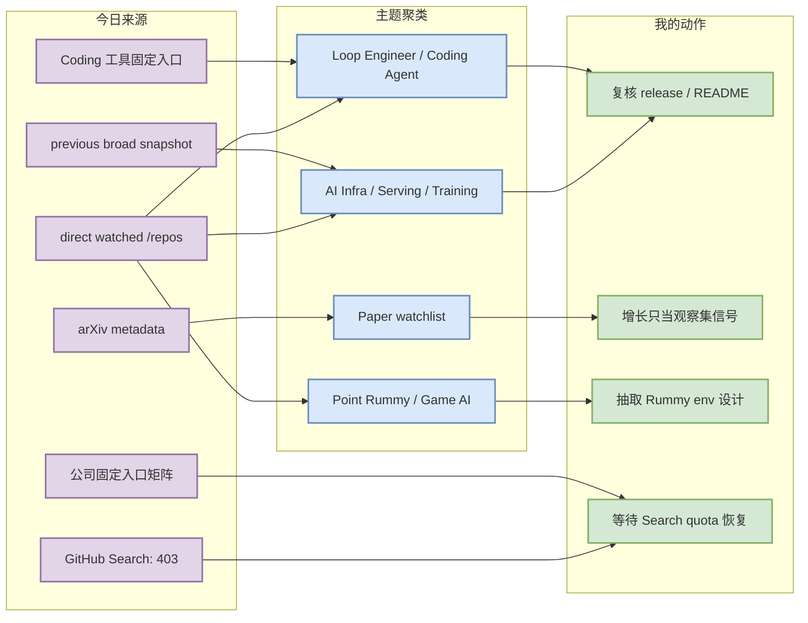
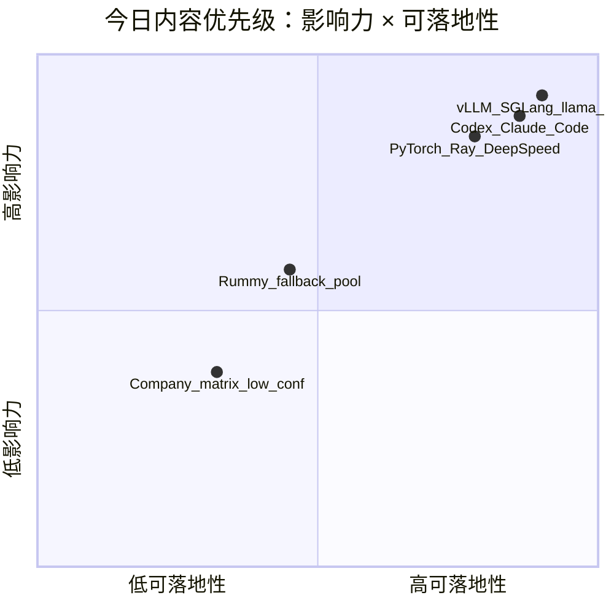

# AI Radar Daily - 2026-09-26

> 生成时间：2026-09-26 09:00 CST  
> 范围：AI Infra / LLM / RL / Game AI / 大厂博客 / 论文 / GitHub / 行业资讯  
> 说明：今日 GitHub Search 从首批查询开始 403 rate limit；已保存 mandated snapshot `Automation/state/github-stars-2026-09-26.json`，并使用 direct watched repo + previous broad snapshot fallback 补齐固定板块。所有 fallback 均显式标注，不声明完整全网日增。

## 0. 今日结论

- 今日最重要的事实：GitHub Search 仍 403；高 star / 增长榜是固定观察集 fallback，不是全网真实 Top / 日增。
- AI Infra：vLLM、SGLang、llama.cpp、Transformers、PyTorch、Ray、DeepSpeed 继续构成 serving/training 观察主线。
- Coding / Loop Engineer：Claude Code、Codex、Gemini CLI、Cline、Aider、LangGraph、MCP servers 仍是 agent loop 与上下文工程核心观察面。
- Point Rummy：无高置信新论文/项目；保留低星/历史项目作为规则建模、ISMCTS、AI opponent、仿真/evaluator 的低置信参考。
- 论文：arXiv 只做 metadata 候选，不编造阅读全文结论；建议作为 skim 队列。

## 1. 今日态势图

## 2. 必读卡片区

> [!important] vLLM / SGLang / llama.cpp serving 观察组
> - 大类：GitHub / AI Infra
> - 重点：固定 direct fallback 显示 serving 核心项目仍是推理优化主线。
> - 为什么重要：KV cache、scheduler、batching、kernel 与部署成本都在这些项目中体现。
> - 详情：[[GitHub/AIInfra/2026-09-26/vllm-project-vllm]] / [网页详情](https://github.com/dyt27666-oss/AI-news-report-obsidians/blob/main/GitHub/AIInfra/2026-09-26/vllm-project-vllm.md) / [原文](https://github.com/vllm-project/vllm)

> [!important] Claude Code / OpenAI Codex / Gemini CLI
> - 大类：Coding Tool / Loop Engineer
> - 重点：终端 coding agent 与 MCP/权限/上下文工程仍是 AI coding workflow 的中心。
> - 为什么重要：直接影响 tmux 多 agent、代码审查、远程执行和 agent loop 设计。
> - 详情：[[Industry/Tools/2026-09-26/openai-codex]] / [网页详情](https://github.com/dyt27666-oss/AI-news-report-obsidians/blob/main/Industry/Tools/2026-09-26/openai-codex.md) / [原文](https://github.com/openai/codex)

> [!tip] Point Rummy fallback 观察池
> - 大类：GitHub / Business
> - 重点：今日 Search 失败，保留 fixed Rummy repo 作为低置信规则/AI opponent 参考。
> - 为什么重要：可抽取 meld/state/action/reward/evaluator 思路。
> - 详情：[[GitHub/PointRummy/2026-09-26/nakkekakke-rummy-ai]] / [原文](https://github.com/nakkekakke/rummy-ai)

## 3. 优先级矩阵

## 4. 分类清单

| 标签 | 大类 | 小类 | 标题 | 重点概括 | 为什么重要 | Obsidian 详情 | 网页详情 | 原文 |
|---|---|---|---|---|---|---|---|---|
| 必读 | GitHub | AI Infra | vllm-project/vllm | 高吞吐 LLM serving 引擎，今日以 direct/历史 fallback 纳入。 | 与推理吞吐、KV cache、scheduler、batching 直接相关。 | [[GitHub/AIInfra/2026-09-26/vllm-project-vllm]] | [网页详情](https://github.com/dyt27666-oss/AI-news-report-obsidians/blob/main/GitHub/AIInfra/2026-09-26/vllm-project-vllm.md) | [原文](https://github.com/vllm-project/vllm) |
| 必读 | GitHub | Coding Agent | openai/codex | 终端 coding agent，Loop Engineer 固定观察核心。 | 可影响多 agent 开发、远程执行、代码审查和上下文工程。 | [[Industry/Tools/2026-09-26/openai-codex]] | [网页详情](https://github.com/dyt27666-oss/AI-news-report-obsidians/blob/main/Industry/Tools/2026-09-26/openai-codex.md) | [原文](https://github.com/openai/codex) |
| 后续 | GitHub | Point Rummy | nakkekakke/rummy-ai | Rummy fallback 观察池的 ISMCTS 参考项目。 | 可作为规则建模、bot 策略和仿真评测参考，不建议直接复用。 | [[GitHub/PointRummy/2026-09-26/nakkekakke-rummy-ai]] | [网页详情](https://github.com/dyt27666-oss/AI-news-report-obsidians/blob/main/GitHub/PointRummy/2026-09-26/nakkekakke-rummy-ai.md) | [原文](https://github.com/nakkekakke/rummy-ai) |

## 5. 大厂资讯 / 工程博客 / Research

### 5.1 公司来源扫描矩阵

| 公司/实验室 | 来源/栏目 | 今日状态 | 高相关条数 | 代表条目 | 备注 |
|---|---|---|---:|---|---|
| OpenAI | News / Research / Engineering Blog | 低置信：今日未自动确认高相关新项 | 0 | 无高相关新项 / 访问或解析低置信 | [[Industry/2026-09-26/openai]] / [原文](https://openai.com/news/) |
| Anthropic | News / Research / Engineering Blog | 低置信：今日未自动确认高相关新项 | 0 | 无高相关新项 / 访问或解析低置信 | [[Industry/2026-09-26/anthropic]] / [原文](https://www.anthropic.com/news) |
| Google DeepMind | Blog / Research | 低置信：今日未自动确认高相关新项 | 0 | 无高相关新项 / 访问或解析低置信 | [[Industry/2026-09-26/google-deepmind]] / [原文](https://deepmind.google/discover/blog/) |
| Meta AI | Blog / Research | 低置信：今日未自动确认高相关新项 | 0 | 无高相关新项 / 访问或解析低置信 | [[Industry/2026-09-26/meta-ai]] / [原文](https://ai.meta.com/blog/) |
| NVIDIA | Technical Blog / AI | 低置信：今日未自动确认高相关新项 | 0 | 无高相关新项 / 访问或解析低置信 | [[Industry/2026-09-26/nvidia]] / [原文](https://developer.nvidia.com/blog/category/artificial-intelligence/) |
| Microsoft | Research AI | 低置信：今日未自动确认高相关新项 | 0 | 无高相关新项 / 访问或解析低置信 | [[Industry/2026-09-26/microsoft]] / [原文](https://www.microsoft.com/en-us/research/research-area/artificial-intelligence/) |
| Hugging Face | Blog / Papers / Releases | 低置信：今日未自动确认高相关新项 | 0 | 无高相关新项 / 访问或解析低置信 | [[Industry/2026-09-26/hugging-face]] / [原文](https://huggingface.co/blog) |
| 腾讯 | AI Lab / 技术博客 | 低置信：今日未自动确认高相关新项 | 0 | 无高相关新项 / 访问或解析低置信 | [[Industry/2026-09-26/tencent]] / [原文](https://ai.tencent.com/ailab/en/index) |
| 字节 | Seed / 技术博客 | 低置信：今日未自动确认高相关新项 | 0 | 无高相关新项 / 访问或解析低置信 | [[Industry/2026-09-26/bytedance]] / [原文](https://seed.bytedance.com/en/) |
| SpaceAI | Blog / News | 低置信：今日未自动确认高相关新项 | 0 | 无高相关新项 / 访问或解析低置信 | [[Industry/2026-09-26/spaceai]] / [原文](https://spaceai.com/) |

### 5.2 高相关大厂条目

| 标签 | 发布方/大厂 | 栏目/来源 | 标题 | 重点概括 | 工程/算法影响 | Obsidian 详情 | 网页详情 | 原文 |
|---|---|---|---|---|---|---|---|---|
| 低置信 | OpenAI | 固定来源入口 | 固定来源扫描记录 | 今日未自动确认新高相关项；保留入口与详情页。 | 用于覆盖矩阵和后续 RSS/API 加固。 | [[Industry/2026-09-26/openai]] | [网页详情](https://github.com/dyt27666-oss/AI-news-report-obsidians/blob/main/Industry/2026-09-26/openai.md) | [原文](https://openai.com/news/) |
| 低置信 | Anthropic | 固定来源入口 | 固定来源扫描记录 | 今日未自动确认新高相关项；保留入口与详情页。 | 用于覆盖矩阵和后续 RSS/API 加固。 | [[Industry/2026-09-26/anthropic]] | [网页详情](https://github.com/dyt27666-oss/AI-news-report-obsidians/blob/main/Industry/2026-09-26/anthropic.md) | [原文](https://www.anthropic.com/news) |
| 低置信 | Google DeepMind | 固定来源入口 | 固定来源扫描记录 | 今日未自动确认新高相关项；保留入口与详情页。 | 用于覆盖矩阵和后续 RSS/API 加固。 | [[Industry/2026-09-26/google-deepmind]] | [网页详情](https://github.com/dyt27666-oss/AI-news-report-obsidians/blob/main/Industry/2026-09-26/google-deepmind.md) | [原文](https://deepmind.google/discover/blog/) |

## 6. GitHub 高 star Top 10

> 来源：今日 snapshot + direct watched repo / previous broad snapshot fallback；由于 GitHub Search 403，本榜是固定 watched AI Infra 集合，不是完整全网 Top 10。

| 排名 | repo | stars | forks | language | updated_at | topics | 重点概括 | 是否值得试用 | Obsidian 详情 | 原文 |
|---:|---|---:|---:|---|---|---|---|---|---|---|
| 1 | `huggingface/transformers` | 166657 | 34675 | Python | 2026-09-26T01:01:01Z | audio, deep-learning, deepseek, gemma, glm, hacktoberfest, llm, machine-learning | 🤗 Transformers: the model-definition framework for state-of-the-art machine learning models in text, vision, audio, and multimodal models, for both inference and training.  | 值得试用/观察 | [[GitHub/AIInfra/2026-09-26/huggingface-transformers]] | [原文](https://github.com/huggingface/transformers) |
| 2 | `ggml-org/llama.cpp` | 129525 | 23735 | C++ | 2026-09-26T00:59:33Z | ggml | LLM inference in C/C++ | 值得试用/观察 | [[GitHub/AIInfra/2026-09-26/ggml-org-llama.cpp]] | [原文](https://github.com/ggml-org/llama.cpp) |
| 3 | `pytorch/pytorch` | 103325 | 30453 | Python | 2026-09-26T01:01:27Z | autograd, deep-learning, gpu, machine-learning, neural-network, numpy, python, tensor | Tensors and Dynamic neural networks in Python with strong GPU acceleration | 值得试用/观察 | [[GitHub/AIInfra/2026-09-26/pytorch-pytorch]] | [原文](https://github.com/pytorch/pytorch) |
| 4 | `vllm-project/vllm` | 92684 | 22671 | Python | 2026-09-26T00:40:29Z | amd, blackwell, cuda, deepseek, deepseek-v3, gpt, gpt-oss, inference | A high-throughput and memory-efficient inference and serving engine for LLMs | 值得试用/观察 | [[GitHub/AIInfra/2026-09-26/vllm-project-vllm]] | [原文](https://github.com/vllm-project/vllm) |
| 5 | `ray-project/ray` | 43927 | 8089 | Python | 2026-09-26T01:02:54Z | data-science, deep-learning, deployment, distributed, hyperparameter-optimization, hyperparameter-search, large-language-models, llm | Ray is an AI compute engine. Ray consists of a core distributed runtime and a set of AI Libraries for accelerating ML workloads. | 值得试用/观察 | [[GitHub/AIInfra/2026-09-26/ray-project-ray]] | [原文](https://github.com/ray-project/ray) |
| 6 | `deepspeedai/DeepSpeed` | 43160 | 5010 | Python | 2026-09-25T19:22:10Z | billion-parameters, compression, data-parallelism, deep-learning, gpu, inference, machine-learning, mixture-of-experts | DeepSpeed is a deep learning optimization library that makes distributed training and inference easy, efficient, and effective. | 值得试用/观察 | [[GitHub/AIInfra/2026-09-26/deepspeedai-deepspeed]] | [原文](https://github.com/deepspeedai/DeepSpeed) |
| 7 | `facebookresearch/faiss` | 40982 | 4532 | C++ | 2026-09-26T00:32:24Z | 未标注 | A library for efficient similarity search and clustering of dense vectors. | 值得试用/观察 | [[GitHub/AIInfra/2026-09-26/facebookresearch-faiss]] | [原文](https://github.com/facebookresearch/faiss) |
| 8 | `sgl-project/sglang` | 36433 | 9147 | Python | 2026-09-26T00:39:53Z | attention, blackwell, cuda, deepseek, diffusion, glm, gpt-oss, inference | SGLang is a high-performance serving framework for large language models and multimodal models. | 值得试用/观察 | [[GitHub/AIInfra/2026-09-26/sgl-project-sglang]] | [原文](https://github.com/sgl-project/sglang) |
| 9 | `verl-project/verl` | 23610 | 4591 | Python | 2026-09-25T22:41:04Z | 未标注 | verl/HybridFlow: A Flexible and Efficient RL Post-Training Framework  | 值得试用/观察 | [[GitHub/AIInfra/2026-09-26/verl-project-verl]] | [原文](https://github.com/verl-project/verl) |
| 10 | `microsoft/onnxruntime` | 21935 | 4252 | C++ | 2026-09-25T22:56:47Z | ai-framework, deep-learning, hardware-acceleration, machine-learning, neural-networks, onnx, pytorch, scikit-learn | ONNX Runtime: cross-platform, high performance ML inferencing and training accelerator | 值得试用/观察 | [[GitHub/AIInfra/2026-09-26/microsoft-onnxruntime]] | [原文](https://github.com/microsoft/onnxruntime) |

## 7. GitHub star 增长最快 Top 10

> 来源：跨历史 snapshot baseline + direct watched repo / previous broad snapshot fallback；全部标注为 `direct watched repo fallback，非完整全网日增` 或 `冷启动代理，非真实日增`，不代表全 GitHub 今日真实增长。

| 排名 | repo | stars_delta | stars | forks | language | updated_at | 增长依据 | 重点概括 | Obsidian 详情 | 原文 |
|---:|---|---:|---:|---:|---|---|---|---|---|---|
| 1 | `ggml-org/llama.cpp` | 77 | 129525 | 23735 | C++ | 2026-09-26T00:59:33Z | direct watched repo fallback，非完整全网日增；baseline=github-stars-2026-09-25.json | LLM inference in C/C++ | [[GitHub/AIInfra/2026-09-26/ggml-org-llama.cpp]] | [原文](https://github.com/ggml-org/llama.cpp) |
| 2 | `pytorch/pytorch` | 62 | 103325 | 30453 | Python | 2026-09-26T01:01:27Z | direct watched repo fallback，非完整全网日增；baseline=github-stars-2026-09-25.json | Tensors and Dynamic neural networks in Python with strong GPU acceleration | [[GitHub/AIInfra/2026-09-26/pytorch-pytorch]] | [原文](https://github.com/pytorch/pytorch) |
| 3 | `vllm-project/vllm` | 42 | 92684 | 22671 | Python | 2026-09-26T00:40:29Z | direct watched repo fallback，非完整全网日增；baseline=github-stars-2026-09-25.json | A high-throughput and memory-efficient inference and serving engine for LLMs | [[GitHub/AIInfra/2026-09-26/vllm-project-vllm]] | [原文](https://github.com/vllm-project/vllm) |
| 4 | `huggingface/transformers` | 41 | 166657 | 34675 | Python | 2026-09-26T01:01:01Z | direct watched repo fallback，非完整全网日增；baseline=github-stars-2026-09-25.json | 🤗 Transformers: the model-definition framework for state-of-the-art machine learning models in text, vision, audio, and multimodal models, for both inference and training.  | [[GitHub/AIInfra/2026-09-26/huggingface-transformers]] | [原文](https://github.com/huggingface/transformers) |
| 5 | `sgl-project/sglang` | 25 | 36433 | 9147 | Python | 2026-09-26T00:39:53Z | direct watched repo fallback，非完整全网日增；baseline=github-stars-2026-09-25.json | SGLang is a high-performance serving framework for large language models and multimodal models. | [[GitHub/AIInfra/2026-09-26/sgl-project-sglang]] | [原文](https://github.com/sgl-project/sglang) |
| 6 | `ray-project/ray` | 10 | 43927 | 8089 | Python | 2026-09-26T01:02:54Z | direct watched repo fallback，非完整全网日增；baseline=github-stars-2026-09-25.json | Ray is an AI compute engine. Ray consists of a core distributed runtime and a set of AI Libraries for accelerating ML workloads. | [[GitHub/AIInfra/2026-09-26/ray-project-ray]] | [原文](https://github.com/ray-project/ray) |
| 7 | `facebookresearch/faiss` | 7 | 40982 | 4532 | C++ | 2026-09-26T00:32:24Z | direct watched repo fallback，非完整全网日增；baseline=github-stars-2026-09-25.json | A library for efficient similarity search and clustering of dense vectors. | [[GitHub/AIInfra/2026-09-26/facebookresearch-faiss]] | [原文](https://github.com/facebookresearch/faiss) |
| 8 | `verl-project/verl` | 6 | 23610 | 4591 | Python | 2026-09-25T22:41:04Z | direct watched repo fallback，非完整全网日增；baseline=github-stars-2026-09-25.json | verl/HybridFlow: A Flexible and Efficient RL Post-Training Framework  | [[GitHub/AIInfra/2026-09-26/verl-project-verl]] | [原文](https://github.com/verl-project/verl) |
| 9 | `NVIDIA/Megatron-LM` | 5 | 18009 | 4567 | Python | 2026-09-25T23:42:19Z | direct watched repo fallback，非完整全网日增；baseline=github-stars-2026-09-25.json | Ongoing research training transformer models at scale | [[GitHub/AIInfra/2026-09-26/nvidia-megatron-lm]] | [原文](https://github.com/NVIDIA/Megatron-LM) |
| 10 | `microsoft/onnxruntime` | 4 | 21935 | 4252 | C++ | 2026-09-25T22:56:47Z | direct watched repo fallback，非完整全网日增；baseline=github-stars-2026-09-25.json | ONNX Runtime: cross-platform, high performance ML inferencing and training accelerator | [[GitHub/AIInfra/2026-09-26/microsoft-onnxruntime]] | [原文](https://github.com/microsoft/onnxruntime) |

## 8. Coding 工具 / AI 工具功能更新

### 8.1 Coding 工具扫描矩阵

| 工具 | 厂商 | 来源类型 | 今日状态 | 代表更新 | 对我的影响 | 原文 |
|---|---|---|---|---|---|---|
| Claude Code | Anthropic | Changelog / Release Notes | 已扫描（direct/snapshot fallback） | repo=anthropics/claude-code, stars=148106, delta=137 | 重点观察 agent mode、MCP、IDE/CLI、权限、上下文窗口、远程执行与 rate limit。 | [原文](https://docs.anthropic.com/en/release-notes/claude-code) |
| OpenAI Codex | OpenAI | Changelog / Release Notes | 已扫描（direct/snapshot fallback） | repo=openai/codex, stars=126487, delta=136 | 重点观察 agent mode、MCP、IDE/CLI、权限、上下文窗口、远程执行与 rate limit。 | [原文](https://developers.openai.com/codex/changelog) |
| Cursor | Cursor | Changelog / Release Notes | 低置信 / 入口保留 | 未自动验证新高相关功能更新 | 重点观察 agent mode、MCP、IDE/CLI、权限、上下文窗口、远程执行与 rate limit。 | [原文](https://cursor.com/changelog) |
| Windsurf | Windsurf | Changelog / Release Notes | 低置信 / 入口保留 | 未自动验证新高相关功能更新 | 重点观察 agent mode、MCP、IDE/CLI、权限、上下文窗口、远程执行与 rate limit。 | [原文](https://windsurf.com/changelog) |
| GitHub Copilot | GitHub | Changelog / Release Notes | 低置信 / 入口保留 | 未自动验证新高相关功能更新 | 重点观察 agent mode、MCP、IDE/CLI、权限、上下文窗口、远程执行与 rate limit。 | [原文](https://github.blog/changelog/label/copilot/) |
| Gemini Code Assist | Google | Changelog / Release Notes | 已扫描（direct/snapshot fallback） | repo=google-gemini/gemini-cli, stars=107167, delta=14 | 重点观察 agent mode、MCP、IDE/CLI、权限、上下文窗口、远程执行与 rate limit。 | [原文](https://cloud.google.com/gemini/docs/codeassist/release-notes) |
| Qwen Code | Alibaba/Qwen | Changelog / Release Notes | 已扫描（direct/snapshot fallback） | repo=QwenLM/qwen-code, stars=28133, delta=21 | 重点观察 agent mode、MCP、IDE/CLI、权限、上下文窗口、远程执行与 rate limit。 | [原文](https://github.com/QwenLM/qwen-code/releases) |
| Roo Code | Roo Code | Changelog / Release Notes | 已扫描（direct/snapshot fallback） | repo=RooCodeInc/Roo-Code, stars=24298, delta=-1 | 重点观察 agent mode、MCP、IDE/CLI、权限、上下文窗口、远程执行与 rate limit。 | [原文](https://github.com/RooCodeInc/Roo-Code/releases) |
| Cline | Cline | Changelog / Release Notes | 已扫描（direct/snapshot fallback） | repo=cline/cline, stars=69327, delta=78 | 重点观察 agent mode、MCP、IDE/CLI、权限、上下文窗口、远程执行与 rate limit。 | [原文](https://github.com/cline/cline/releases) |
| Continue | Continue | Changelog / Release Notes | 已扫描（direct/snapshot fallback） | repo=continuedev/continue, stars=36029, delta=12 | 重点观察 agent mode、MCP、IDE/CLI、权限、上下文窗口、远程执行与 rate limit。 | [原文](https://github.com/continuedev/continue/releases) |

### 8.2 高相关工具更新

| 标签 | 工具/厂商 | 来源类型 | 标题/功能 | 重点概括 | 对 AI coding 工作流的影响 | Obsidian 详情 | 网页详情 | 原文 |
|---|---|---|---|---|---|---|---|---|
| 必读 | Claude Code / Anthropic | Changelog / GitHub | 固定工具扫描 | 今日保留扫描入口；direct repo 项用 snapshot/fallback 更新元数据。 | 影响多 agent、代码审查、远程执行与上下文工程。 | [[Industry/Tools/2026-09-26/anthropics-claude-code]] | [网页详情](https://github.com/dyt27666-oss/AI-news-report-obsidians/blob/main/Industry/Tools/2026-09-26/anthropics-claude-code.md) | [原文](https://docs.anthropic.com/en/release-notes/claude-code) |
| 必读 | OpenAI Codex / OpenAI | Changelog / GitHub | 固定工具扫描 | 今日保留扫描入口；direct repo 项用 snapshot/fallback 更新元数据。 | 影响多 agent、代码审查、远程执行与上下文工程。 | [[Industry/Tools/2026-09-26/openai-codex]] | [网页详情](https://github.com/dyt27666-oss/AI-news-report-obsidians/blob/main/Industry/Tools/2026-09-26/openai-codex.md) | [原文](https://developers.openai.com/codex/changelog) |
| 必读 | Cursor / Cursor | Changelog / GitHub | 固定工具扫描 | 今日保留扫描入口；direct repo 项用 snapshot/fallback 更新元数据。 | 影响多 agent、代码审查、远程执行与上下文工程。 | [[Industry/Tools/2026-09-26/cursor]] | [网页详情](https://github.com/dyt27666-oss/AI-news-report-obsidians/blob/main/Industry/Tools/2026-09-26/cursor.md) | [原文](https://cursor.com/changelog) |

## 9. Point Rummy / Indian Rummy 业务主题

### 9.1 GitHub 候选

| 标签 | repo | stars | forks | language | updated_at | 重点概括 | 业务可用性 | Obsidian 详情 | 原文 |
|---|---|---:|---:|---|---|---|---|---|---|
| 低置信 | `nakkekakke/rummy-ai` | 12 | 5 | Java | 2026-08-27T21:23:08Z | Text based classic Rummy game with an AI that uses ISMCTS. Data Structures and Algorithms course project, University of Helsinki | 规则建模 / AI opponent / rollout / evaluator 参考；需代码审查。 | [[GitHub/PointRummy/2026-09-26/nakkekakke-rummy-ai]] | [原文](https://github.com/nakkekakke/rummy-ai) |
| 低置信 | `jmhummel/Gin-Rummy-Java` | 8 | 0 | Java | 2023-08-16T16:12:58Z | Java-based Gin Rummy console game, with an AI opponent | 规则建模 / AI opponent / rollout / evaluator 参考；需代码审查。 | [[GitHub/PointRummy/2026-09-26/jmhummel-gin-rummy-java]] | [原文](https://github.com/jmhummel/Gin-Rummy-Java) |
| 低置信 | `mudont/indian-rummy` | 5 | 0 | TypeScript | 2025-08-08T21:05:04Z | Typescript library for Indian Rummy card game | 规则建模 / AI opponent / rollout / evaluator 参考；需代码审查。 | [[GitHub/PointRummy/2026-09-26/mudont-indian-rummy]] | [原文](https://github.com/mudont/indian-rummy) |
| 低置信 | `dv-rastogi/Rummy` | 5 | 0 | Python | 2023-09-26T11:21:39Z | Variation of classical Indian Rummy made in Pygame | 规则建模 / AI opponent / rollout / evaluator 参考；需代码审查。 | [[GitHub/PointRummy/2026-09-26/dv-rastogi-rummy]] | [原文](https://github.com/dv-rastogi/Rummy) |
| 低置信 | `SCFlanagan/Rummy` | 0 | 0 | Unknown | 访问失败 | direct GET failed: HTTP Error 403: rate limit exceeded | 规则建模 / AI opponent / rollout / evaluator 参考；需代码审查。 | [[GitHub/PointRummy/2026-09-26/scflanagan-rummy]] | [原文](https://github.com/SCFlanagan/Rummy) |
| 低置信 | `mcartmell/gin-rummy-bot` | 0 | 0 | Unknown | 访问失败 | direct GET failed: HTTP Error 403: rate limit exceeded | 规则建模 / AI opponent / rollout / evaluator 参考；需代码审查。 | [[GitHub/PointRummy/2026-09-26/mcartmell-gin-rummy-bot]] | [原文](https://github.com/mcartmell/gin-rummy-bot) |
| 低置信 | `vahsek300501/Indian-Rummy-` | 0 | 0 | Unknown | 访问失败 | direct GET failed: HTTP Error 403: rate limit exceeded | 规则建模 / AI opponent / rollout / evaluator 参考；需代码审查。 | [[GitHub/PointRummy/2026-09-26/vahsek300501-indian-rummy]] | [原文](https://github.com/vahsek300501/Indian-Rummy-) |
| 低置信 | `Mohitkumar-559/RummyServer` | 0 | 0 | Unknown | 访问失败 | direct GET failed: HTTP Error 403: rate limit exceeded | 规则建模 / AI opponent / rollout / evaluator 参考；需代码审查。 | [[GitHub/PointRummy/2026-09-26/mohitkumar-559-rummyserver]] | [原文](https://github.com/Mohitkumar-559/RummyServer) |
| 低置信 | `abubakarmunir712/dsa-final-project` | 0 | 0 | Unknown | 访问失败 | direct GET failed: HTTP Error 403: rate limit exceeded | 规则建模 / AI opponent / rollout / evaluator 参考；需代码审查。 | [[GitHub/PointRummy/2026-09-26/abubakarmunir712-dsa-final-project]] | [原文](https://github.com/abubakarmunir712/dsa-final-project) |
| 低置信 | `Ductapemaster/RummyAI` | 0 | 0 | Unknown | 访问失败 | direct GET failed: HTTP Error 403: rate limit exceeded | 规则建模 / AI opponent / rollout / evaluator 参考；需代码审查。 | [[GitHub/PointRummy/2026-09-26/ductapemaster-rummyai]] | [原文](https://github.com/Ductapemaster/RummyAI) |

### 9.2 论文 / 资料候选

| 标签 | 来源 | 标题 | 作者/机构 | 重点概括 | 对 Point Rummy 业务有什么用 | Obsidian 详情 | 原文 |
|---|---|---|---|---|---|---|---|
| 低置信 | arXiv 查询 | Rummy / imperfect-information card game 查询 | 自动查询 | 今日未形成可直接用于 Indian Rummy 的新强相关论文；保留低置信观察。 | 继续关注 ISMCTS、belief state、self-play、rollout/evaluator。 | - | [arXiv search](https://arxiv.org/search/?query=gin+rummy+artificial+intelligence&searchtype=all) |

### 9.3 业务可用性判断

| 方向 | 今日信号 | 可用性 | 下一步 |
|---|---|---|---|
| 规则引擎 / 计分 | fixed Rummy repo 可 direct/历史 fallback，Search 失败 | 中低：只适合参考 state/action/schema | 挑 2-3 个项目做接口级阅读 |
| Bot / RL Agent | rummy-ai / Gin Rummy bot 等低星项目保留 | 中低：代码质量和环境完整度需验证 | 建立最小 Gymnasium/RLCard 风格 env 对照 |
| 仿真 / 评测 | 适合负样本和状态表示参考 | 中：设计自有 evaluator，不直接复用低星代码 | 对 rollout、MCTS/ISMCTS、belief state 做专项卡片 |

## 10. Loop Engineer / Loop Engineering 主题

### 10.1 Loop Engineer GitHub 高 star Top 10

| 排名 | repo | stars | forks | language | updated_at | topics | 重点概括 | 是否值得试用 | Obsidian 详情 | 原文 |
|---:|---|---:|---:|---|---|---|---|---|---|---|
| 1 | `anthropics/claude-code` | 148106 | 24596 | TypeScript | 2026-09-26T00:57:02Z | 未标注 | Claude Code is an agentic coding tool that lives in your terminal, understands your codebase, and helps you code faster by executing routine tasks, explaining complex code, and han | 值得试用/观察 | [[GitHub/LoopEngineer/2026-09-26/anthropics-claude-code]] | [原文](https://github.com/anthropics/claude-code) |
| 2 | `openai/codex` | 126487 | 19739 | Rust | 2026-09-26T00:56:10Z | 未标注 | Lightweight coding agent that runs in your terminal | 值得试用/观察 | [[GitHub/LoopEngineer/2026-09-26/openai-codex]] | [原文](https://github.com/openai/codex) |
| 3 | `google-gemini/gemini-cli` | 107167 | 14629 | TypeScript | 2026-09-26T00:57:50Z | ai, ai-agents, cli, gemini, gemini-api, mcp-client, mcp-server | An open-source AI agent that brings the power of Gemini directly into your terminal. | 值得试用/观察 | [[GitHub/LoopEngineer/2026-09-26/google-gemini-gemini-cli]] | [原文](https://github.com/google-gemini/gemini-cli) |
| 4 | `modelcontextprotocol/servers` | 90598 | 11689 | TypeScript | 2026-09-26T00:10:04Z | 未标注 | Model Context Protocol Servers | 值得试用/观察 | [[GitHub/LoopEngineer/2026-09-26/modelcontextprotocol-servers]] | [原文](https://github.com/modelcontextprotocol/servers) |
| 5 | `cline/cline` | 69327 | 7518 | TypeScript | 2026-09-26T00:59:51Z | 未标注 | Autonomous coding agent as an SDK, IDE extension, or CLI assistant. | 值得试用/观察 | [[GitHub/LoopEngineer/2026-09-26/cline-cline]] | [原文](https://github.com/cline/cline) |
| 6 | `Aider-AI/aider` | 49186 | 4994 | Python | 2026-09-26T01:01:35Z | anthropic, chatgpt, claude-3, cli, command-line, gemini, gpt-3, gpt-35-turbo | aider is AI pair programming in your terminal | 值得试用/观察 | [[GitHub/LoopEngineer/2026-09-26/aider-ai-aider]] | [原文](https://github.com/Aider-AI/aider) |
| 7 | `langchain-ai/langgraph` | 42295 | 7156 | Python | 2026-09-26T00:51:50Z | agents, ai, ai-agents, chatgpt, deepagents, enterprise, framework, gemini | Build resilient agents. | 值得试用/观察 | [[GitHub/LoopEngineer/2026-09-26/langchain-ai-langgraph]] | [原文](https://github.com/langchain-ai/langgraph) |
| 8 | `continuedev/continue` | 36029 | 5427 | TypeScript | 2026-09-26T00:07:45Z | agent, ai, cli, developer-tools, open-source | open-source coding agent | 值得试用/观察 | [[GitHub/LoopEngineer/2026-09-26/continuedev-continue]] | [原文](https://github.com/continuedev/continue) |
| 9 | `QwenLM/qwen-code` | 28133 | 3111 | TypeScript | 2026-09-26T01:01:54Z | agentic, ai, ai-agent, ai-coding, cli, coding-agent, developer-tools, llm | An open-source AI coding agent that lives in your terminal. | 值得试用/观察 | [[GitHub/LoopEngineer/2026-09-26/qwenlm-qwen-code]] | [原文](https://github.com/QwenLM/qwen-code) |
| 10 | `RooCodeInc/Roo-Code` | 24298 | 3417 | TypeScript | 2026-09-25T21:39:07Z | 未标注 | Roo Code gives you a whole dev team of AI agents in your code editor. | 值得试用/观察 | [[GitHub/LoopEngineer/2026-09-26/roocodeinc-roo-code]] | [原文](https://github.com/RooCodeInc/Roo-Code) |

### 10.2 Loop Engineer GitHub star 增长最快 Top 10

| 排名 | repo | stars_delta | stars | forks | language | updated_at | 增长依据 | 重点概括 | Obsidian 详情 | 原文 |
|---:|---|---:|---:|---:|---|---|---|---|---|---|
| 1 | `anthropics/claude-code` | 137 | 148106 | 24596 | TypeScript | 2026-09-26T00:57:02Z | direct watched repo fallback，非完整全网日增；baseline=github-stars-2026-09-25.json | Claude Code is an agentic coding tool that lives in your terminal, understands your codebase, and helps you code faster by executing routine tasks, explaining complex code, and han | [[GitHub/LoopEngineer/2026-09-26/anthropics-claude-code]] | [原文](https://github.com/anthropics/claude-code) |
| 2 | `openai/codex` | 136 | 126487 | 19739 | Rust | 2026-09-26T00:56:10Z | direct watched repo fallback，非完整全网日增；baseline=github-stars-2026-09-25.json | Lightweight coding agent that runs in your terminal | [[GitHub/LoopEngineer/2026-09-26/openai-codex]] | [原文](https://github.com/openai/codex) |
| 3 | `cline/cline` | 78 | 69327 | 7518 | TypeScript | 2026-09-26T00:59:51Z | direct watched repo fallback，非完整全网日增；baseline=github-stars-2026-09-25.json | Autonomous coding agent as an SDK, IDE extension, or CLI assistant. | [[GitHub/LoopEngineer/2026-09-26/cline-cline]] | [原文](https://github.com/cline/cline) |
| 4 | `langchain-ai/langgraph` | 57 | 42295 | 7156 | Python | 2026-09-26T00:51:50Z | direct watched repo fallback，非完整全网日增；baseline=github-stars-2026-09-25.json | Build resilient agents. | [[GitHub/LoopEngineer/2026-09-26/langchain-ai-langgraph]] | [原文](https://github.com/langchain-ai/langgraph) |
| 5 | `Aider-AI/aider` | 22 | 49186 | 4994 | Python | 2026-09-26T01:01:35Z | direct watched repo fallback，非完整全网日增；baseline=github-stars-2026-09-25.json | aider is AI pair programming in your terminal | [[GitHub/LoopEngineer/2026-09-26/aider-ai-aider]] | [原文](https://github.com/Aider-AI/aider) |
| 6 | `QwenLM/qwen-code` | 21 | 28133 | 3111 | TypeScript | 2026-09-26T01:01:54Z | direct watched repo fallback，非完整全网日增；baseline=github-stars-2026-09-25.json | An open-source AI coding agent that lives in your terminal. | [[GitHub/LoopEngineer/2026-09-26/qwenlm-qwen-code]] | [原文](https://github.com/QwenLM/qwen-code) |
| 7 | `modelcontextprotocol/servers` | 18 | 90598 | 11689 | TypeScript | 2026-09-26T00:10:04Z | direct watched repo fallback，非完整全网日增；baseline=github-stars-2026-09-25.json | Model Context Protocol Servers | [[GitHub/LoopEngineer/2026-09-26/modelcontextprotocol-servers]] | [原文](https://github.com/modelcontextprotocol/servers) |
| 8 | `google-gemini/gemini-cli` | 14 | 107167 | 14629 | TypeScript | 2026-09-26T00:57:50Z | direct watched repo fallback，非完整全网日增；baseline=github-stars-2026-09-25.json | An open-source AI agent that brings the power of Gemini directly into your terminal. | [[GitHub/LoopEngineer/2026-09-26/google-gemini-gemini-cli]] | [原文](https://github.com/google-gemini/gemini-cli) |
| 9 | `continuedev/continue` | 12 | 36029 | 5427 | TypeScript | 2026-09-26T00:07:45Z | direct watched repo fallback，非完整全网日增；baseline=github-stars-2026-09-25.json | open-source coding agent | [[GitHub/LoopEngineer/2026-09-26/continuedev-continue]] | [原文](https://github.com/continuedev/continue) |
| 10 | `RooCodeInc/Roo-Code` | -1 | 24298 | 3417 | TypeScript | 2026-09-25T21:39:07Z | direct watched repo fallback，非完整全网日增；baseline=github-stars-2026-09-25.json | Roo Code gives you a whole dev team of AI agents in your code editor. | [[GitHub/LoopEngineer/2026-09-26/roocodeinc-roo-code]] | [原文](https://github.com/RooCodeInc/Roo-Code) |

### 10.3 Loop Engineering 方法信号

| 标签 | 来源 | 标题 | 重点概括 | 对 AI coding 工作流的影响 | Obsidian 详情 | 原文 |
|---|---|---|---|---|---|---|
| 必读 | GitHub direct/previous fallback | Claude Code / Codex / Roo / Cline / Continue / Aider / LangGraph | 今日 Loop 表以固定 watched repo 构建；关注 agent loop、上下文工程、工具权限、MCP、review loop。 | 可指导多 agent 并行开发、tmux 监控、代码审查与任务分解。 | [[GitHub/LoopEngineer/2026-09-26/aider-ai-aider]] | [原文](https://github.com/Aider-AI/aider) |

## 11. 论文

### 11.1 arXiv 今日候选

| 标签 | 论文来源 | 论文 | 作者/机构 | 重点概括 | 工程/研究价值 | Obsidian 详情 | 网页详情 | PDF/原文 |
|---|---|---|---|---|---|---|---|---|
| 可 skim | arXiv / 预印本 metadata | LLM Agents Can Easily Tamper With Their Own Traces | Jeremy Qin, David Schmotz, Derck Prinzhorn, Luca Beurer-Kellner | Asynchronous monitoring, incident investigations, and compliance audits primarily rely on agent traces to reconstruct what happened. These analyses assume that LLM agents cannot ta | 作为 skim 队列，需阅读全文后再采纳。 | [[Papers/2026-09-26/2609.30266v1-llm-agents-can-easily-tamper-with-their]] | [网页详情](https://github.com/dyt27666-oss/AI-news-report-obsidians/blob/main/Papers/2026-09-26/2609.30266v1-llm-agents-can-easily-tamper-with-their.md) | [PDF/原文](https://arxiv.org/pdf/2609.30266v1) |
| 可 skim | arXiv / 预印本 metadata | RAPID: Robot Agentic Programming from Demonstrations | Yuyao Liu, Jiayuan Mao, David Hsu, Leslie Pack Kaelbling | Coding agents have demonstrated enormous success in solving complex programming problems. To leverage their potential for robot systems, this work introduces Robot Agentic Programm | 作为 skim 队列，需阅读全文后再采纳。 | [[Papers/2026-09-26/2609.30249v1-rapid-robot-agentic-programming-from-de]] | [网页详情](https://github.com/dyt27666-oss/AI-news-report-obsidians/blob/main/Papers/2026-09-26/2609.30249v1-rapid-robot-agentic-programming-from-de.md) | [PDF/原文](https://arxiv.org/pdf/2609.30249v1) |
| 可 skim | arXiv / 预印本 metadata | Learning and interpreting policies for simultaneous entanglement requests in quantum networks | Leon Rode, Sumeet Khatri, Supartha Podder | Future quantum networks will make use of entanglement to perform numerous tasks, such as sending quantum information over long distances, distributed quantum computing, and quantum | 作为 skim 队列，需阅读全文后再采纳。 | [[Papers/2026-09-26/2609.30157v1-learning-and-interpreting-policies-for-s]] | [网页详情](https://github.com/dyt27666-oss/AI-news-report-obsidians/blob/main/Papers/2026-09-26/2609.30157v1-learning-and-interpreting-policies-for-s.md) | [PDF/原文](https://arxiv.org/pdf/2609.30157v1) |
| 可 skim | arXiv / 预印本 metadata | GRASP: Generating, Revising, and Assessing for Strategic Planning with Agentic AI | Arunabh Srivastava, Mohammad A.,  Khojastepour, Srimat Chakradhar | Large Language Models (LLMs) typically exhibit a performance profile where reliability degrades as task complexity increases. We address the challenge of generating high-quality na | 作为 skim 队列，需阅读全文后再采纳。 | [[Papers/2026-09-26/2609.30147v1-grasp-generating-revising-and-assessi]] | [网页详情](https://github.com/dyt27666-oss/AI-news-report-obsidians/blob/main/Papers/2026-09-26/2609.30147v1-grasp-generating-revising-and-assessi.md) | [PDF/原文](https://arxiv.org/pdf/2609.30147v1) |
| 可 skim | arXiv / 预印本 metadata | LLM Agents Can Easily Tamper With Their Own Traces | Jeremy Qin, David Schmotz, Derck Prinzhorn, Luca Beurer-Kellner | Asynchronous monitoring, incident investigations, and compliance audits primarily rely on agent traces to reconstruct what happened. These analyses assume that LLM agents cannot ta | 作为 skim 队列，需阅读全文后再采纳。 | [[Papers/2026-09-26/2609.30266v1-llm-agents-can-easily-tamper-with-their]] | [网页详情](https://github.com/dyt27666-oss/AI-news-report-obsidians/blob/main/Papers/2026-09-26/2609.30266v1-llm-agents-can-easily-tamper-with-their.md) | [PDF/原文](https://arxiv.org/pdf/2609.30266v1) |

## 12. 资讯 / 其他 GitHub 项目

### 12.1 固定观察集补充

| 标签 | 来源 | 标题 | 重点概括 | 对我有什么用 | Obsidian 详情 | 网页详情 | 原文 |
|---|---|---|---|---|---|---|---|
| 可 skim | GitHub | NVIDIA/TensorRT-LLM | TensorRT-LLM 继续作为推理优化固定观察项。 | 对 kernel、quantization、deployment 有参考价值。 | [[GitHub/AIInfra/2026-09-26/nvidia-tensorrt-llm]] | [网页详情](https://github.com/dyt27666-oss/AI-news-report-obsidians/blob/main/GitHub/AIInfra/2026-09-26/nvidia-tensorrt-llm.md) | [原文](https://github.com/NVIDIA/TensorRT-LLM) |

## 13. 按主题索引

### AI Infra / Serving / Training
- [[GitHub/AIInfra/2026-09-26/vllm-project-vllm]] - serving scheduler / KV cache / throughput
- [[GitHub/AIInfra/2026-09-26/sgl-project-sglang]] - high-performance serving
- [[GitHub/AIInfra/2026-09-26/nvidia-tensorrt-llm]] - NVIDIA inference stack

### LLM / Agent / RAG / Evaluation
- [[GitHub/LoopEngineer/2026-09-26/modelcontextprotocol-servers]] - MCP 工具生态
- [[GitHub/LoopEngineer/2026-09-26/langchain-ai-langgraph]] - agent graph / loop

### RL / Game AI / World Model
- [[GitHub/AIInfra/2026-09-26/verl-project-verl]] - RL post-training framework
- [[GitHub/PointRummy/2026-09-26/nakkekakke-rummy-ai]] - Rummy ISMCTS 参考

### Point Rummy / Indian Rummy
- [[GitHub/PointRummy/2026-09-26/nakkekakke-rummy-ai]] - 低置信 AI opponent 参考
- [[GitHub/PointRummy/2026-09-26/mudont-indian-rummy]] - Indian Rummy TypeScript 规则参考

### Loop Engineer / Coding Agent Loop
- [[Industry/Tools/2026-09-26/anthropics-claude-code]] - terminal coding agent
- [[Industry/Tools/2026-09-26/openai-codex]] - terminal coding agent
- [[GitHub/LoopEngineer/2026-09-26/aider-ai-aider]] - CLI pair programming

### 公司 / 实验室
- OpenAI: [[Industry/2026-09-26/openai]]
- Anthropic: [[Industry/2026-09-26/anthropic]]
- DeepMind: [[Industry/2026-09-26/google-deepmind]]
- Meta: [[Industry/2026-09-26/meta-ai]]
- NVIDIA: [[Industry/2026-09-26/nvidia]]
- 腾讯 / 字节 / 国内大厂: [[Industry/2026-09-26/tencent]] / [[Industry/2026-09-26/bytedance]]

## 14. 值得后续深挖

| 标签 | 大类 | 小类 | 标题 | 后续动作 | Obsidian 详情 | 原文 |
|---|---|---|---|---|---|---|
| 必读 | GitHub | AI Infra | vLLM / SGLang 对比 | 跑 serving benchmark，关注 KV/cache 和 speculative decoding。 | [[GitHub/AIInfra/2026-09-26/vllm-project-vllm]] | [原文](https://github.com/vllm-project/vllm) |
| 必读 | Coding Tool | Loop Engineer | Codex / Claude Code 权限与远程执行 | 复核 changelog，记录权限模式与 MCP 变化。 | [[Industry/Tools/2026-09-26/openai-codex]] | [原文](https://developers.openai.com/codex/changelog) |
| 后续 | Business | Point Rummy | Rummy env schema | 从低置信项目抽取 state/action/reward/evaluator 对照表。 | [[GitHub/PointRummy/2026-09-26/nakkekakke-rummy-ai]] | [原文](https://github.com/nakkekakke/rummy-ai) |

## 15. 采集失败或低置信来源

- GitHub Search：从首批 Point Rummy 查询开始 403 rate limit；已保存 `Automation/state/github-stars-2026-09-26.json` 并保留 errors。
- 公司博客：今日只做固定入口/矩阵覆盖，未自动确认强相关新项。
- Coding 工具：Cursor、Windsurf、GitHub Copilot 等仅保留入口，未自动验证新功能。
- arXiv：只抓 metadata；若 API 返回低置信/空结果，不编造论文结论。

## 16. 归档标签

#ai-radar #daily #ai-infra #llm #rl #point-rummy #loop-engineering
