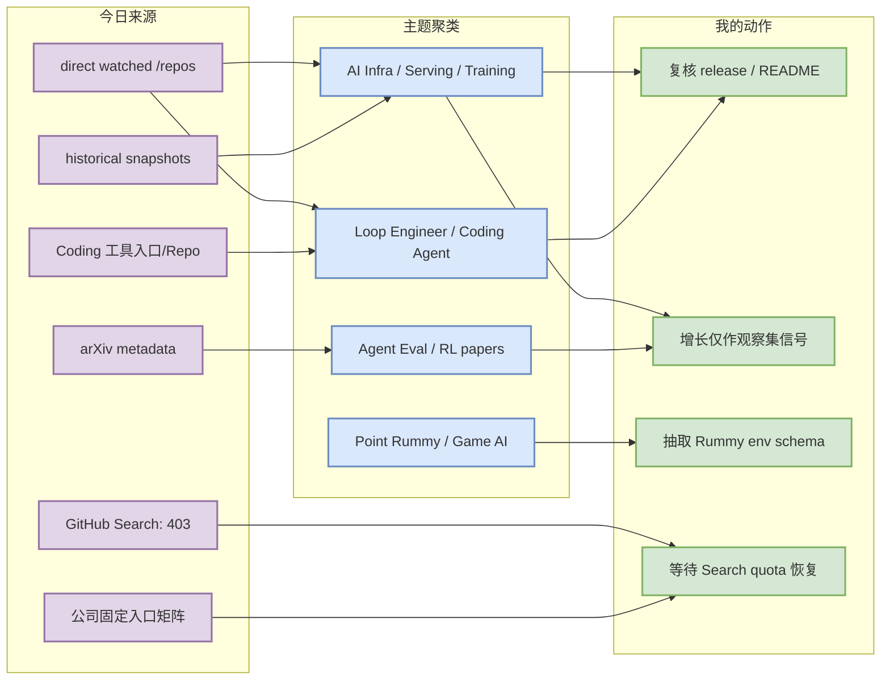
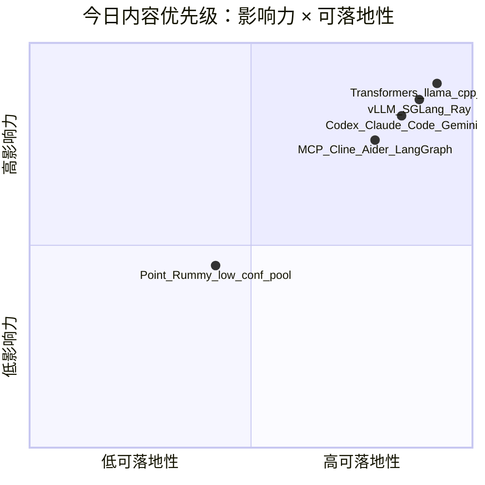

# AI Radar Daily - 2026-09-27

> 生成时间：2026-09-27 09:00 CST  
> 范围：AI Infra / LLM / RL / Game AI / 大厂博客 / 论文 / GitHub / Coding 工具  
> 说明：今日 GitHub Search 在 Point Rummy/theme 查询后出现 403 rate limit；已保存 mandated snapshot `Automation/state/github-stars-2026-09-27.json`，并使用 direct watched repo + previous snapshot fallback 补齐 AI Infra / Loop / Coding 工具固定板块。所有 fallback 均显式标注，不声明完整全网日增。

## 0. 今日结论

- GitHub broad Search 今日不可用；高 star / 增长榜使用固定 AI Infra watched repos，不是全网真实 Top / 日增。
- AI Infra 主线仍是 Transformers、llama.cpp、PyTorch、vLLM、Ray、DeepSpeed、Faiss、SGLang、verl、ONNX Runtime：覆盖模型框架、本地推理、serving、分布式和后训练。
- Loop Engineer / Coding Agent 主线仍是 Claude Code、Codex、Gemini CLI、MCP servers、Cline、Aider、LangGraph、Continue、Qwen Code、Roo Code；重点看 CLI/TUI、MCP、权限、上下文工程和 review loop。
- Point Rummy 今日只保留低星/低置信项目池；可做规则建模、AI opponent、ISMCTS/MCTS、环境/evaluator 参考，不能当成熟业务组件。
- 论文只基于 arXiv metadata 纳入 skim 队列；不编造阅读全文结论。

## 1. 今日态势图

## 2. 必读卡片区

> [!important] huggingface/transformers
> - 大类：GitHub
> - 小类：AI Infra
> - 重点：🤗 Transformers: the model-definition framework for state-of-the-art machine learning models in text, vision, audio, and multimodal models, for both in
> - 为什么重要：这是今日固定观察集的核心工程项目，可用于判断 serving、training、agent loop 或 coding workflow 的生态方向。
> - 详情：[[GitHub/AIInfra/2026-09-27/huggingface-transformers]] / [网页详情](https://github.com/dyt27666-oss/AI-news-report-obsidians/blob/main/GitHub/AIInfra/2026-09-27/huggingface-transformers.md) / [原文](https://github.com/huggingface/transformers)

> [!important] ggml-org/llama.cpp
> - 大类：GitHub
> - 小类：AI Infra
> - 重点：LLM inference in C/C++
> - 为什么重要：这是今日固定观察集的核心工程项目，可用于判断 serving、training、agent loop 或 coding workflow 的生态方向。
> - 详情：[[GitHub/AIInfra/2026-09-27/ggml-org-llama.cpp]] / [网页详情](https://github.com/dyt27666-oss/AI-news-report-obsidians/blob/main/GitHub/AIInfra/2026-09-27/ggml-org-llama.cpp.md) / [原文](https://github.com/ggml-org/llama.cpp)

> [!important] vllm-project/vllm
> - 大类：GitHub
> - 小类：AI Infra
> - 重点：A high-throughput and memory-efficient inference and serving engine for LLMs
> - 为什么重要：这是今日固定观察集的核心工程项目，可用于判断 serving、training、agent loop 或 coding workflow 的生态方向。
> - 详情：[[GitHub/AIInfra/2026-09-27/vllm-project-vllm]] / [网页详情](https://github.com/dyt27666-oss/AI-news-report-obsidians/blob/main/GitHub/AIInfra/2026-09-27/vllm-project-vllm.md) / [原文](https://github.com/vllm-project/vllm)

> [!important] anthropics/claude-code
> - 大类：GitHub
> - 小类：Loop Engineer
> - 重点：Claude Code is an agentic coding tool that lives in your terminal, understands your codebase, and helps you code faster by executing routine tasks, ex
> - 为什么重要：这是今日固定观察集的核心工程项目，可用于判断 serving、training、agent loop 或 coding workflow 的生态方向。
> - 详情：[[GitHub/LoopEngineer/2026-09-27/anthropics-claude-code]] / [网页详情](https://github.com/dyt27666-oss/AI-news-report-obsidians/blob/main/GitHub/LoopEngineer/2026-09-27/anthropics-claude-code.md) / [原文](https://github.com/anthropics/claude-code)

> [!important] openai/codex
> - 大类：GitHub
> - 小类：Loop Engineer
> - 重点：Lightweight coding agent that runs in your terminal
> - 为什么重要：这是今日固定观察集的核心工程项目，可用于判断 serving、training、agent loop 或 coding workflow 的生态方向。
> - 详情：[[GitHub/LoopEngineer/2026-09-27/openai-codex]] / [网页详情](https://github.com/dyt27666-oss/AI-news-report-obsidians/blob/main/GitHub/LoopEngineer/2026-09-27/openai-codex.md) / [原文](https://github.com/openai/codex)

## 3. 优先级矩阵

## 4. 分类清单

| 标签 | 大类 | 小类 | 标题 | 重点概括 | 为什么重要 | Obsidian 详情 | 网页详情 | 原文 |
|---|---|---|---|---|---|---|---|---|
| 必读 | GitHub | AI Infra | huggingface/transformers | 🤗 Transformers: the model-definition framework for state-of-the-art machine learning model | 固定观察集核心项目，适合进入 README/release/benchmark 队列。 | [[GitHub/AIInfra/2026-09-27/huggingface-transformers]] | [网页详情](https://github.com/dyt27666-oss/AI-news-report-obsidians/blob/main/GitHub/AIInfra/2026-09-27/huggingface-transformers.md) | [原文](https://github.com/huggingface/transformers) |
| 必读 | GitHub | AI Infra | ggml-org/llama.cpp | LLM inference in C/C++ | 固定观察集核心项目，适合进入 README/release/benchmark 队列。 | [[GitHub/AIInfra/2026-09-27/ggml-org-llama.cpp]] | [网页详情](https://github.com/dyt27666-oss/AI-news-report-obsidians/blob/main/GitHub/AIInfra/2026-09-27/ggml-org-llama.cpp.md) | [原文](https://github.com/ggml-org/llama.cpp) |
| 必读 | GitHub | AI Infra | pytorch/pytorch | Tensors and Dynamic neural networks in Python with strong GPU acceleration | 固定观察集核心项目，适合进入 README/release/benchmark 队列。 | [[GitHub/AIInfra/2026-09-27/pytorch-pytorch]] | [网页详情](https://github.com/dyt27666-oss/AI-news-report-obsidians/blob/main/GitHub/AIInfra/2026-09-27/pytorch-pytorch.md) | [原文](https://github.com/pytorch/pytorch) |
| 必读 | GitHub | AI Infra | vllm-project/vllm | A high-throughput and memory-efficient inference and serving engine for LLMs | 固定观察集核心项目，适合进入 README/release/benchmark 队列。 | [[GitHub/AIInfra/2026-09-27/vllm-project-vllm]] | [网页详情](https://github.com/dyt27666-oss/AI-news-report-obsidians/blob/main/GitHub/AIInfra/2026-09-27/vllm-project-vllm.md) | [原文](https://github.com/vllm-project/vllm) |
| 必读 | GitHub | AI Infra | ray-project/ray | Ray is an AI compute engine. Ray consists of a core distributed runtime and a set of AI Li | 固定观察集核心项目，适合进入 README/release/benchmark 队列。 | [[GitHub/AIInfra/2026-09-27/ray-project-ray]] | [网页详情](https://github.com/dyt27666-oss/AI-news-report-obsidians/blob/main/GitHub/AIInfra/2026-09-27/ray-project-ray.md) | [原文](https://github.com/ray-project/ray) |
| 可 skim | 论文 | arXiv | LLM Agents Can Easily Tamper With Their Own Traces | Asynchronous monitoring, incident investigations, and compliance audits primarily rely on agent trac | 作为 LLM/Agent/RL/Infra 论文候选，需要二次过滤和读 PDF。 | [[Papers/arXiv/2026-09-27/2609.30266v1-llm-agents-can-easily-tamper-with-their-own-traces]] | [网页详情](https://github.com/dyt27666-oss/AI-news-report-obsidians/blob/main/Papers/arXiv/2026-09-27/2609.30266v1-llm-agents-can-easily-tamper-with-their-own-traces.md) | [原文](https://arxiv.org/abs/2609.30266v1) |
| 可 skim | 论文 | arXiv | RAPID: Robot Agentic Programming from Demonstrations | Coding agents have demonstrated enormous success in solving complex programming problems. To leverag | 作为 LLM/Agent/RL/Infra 论文候选，需要二次过滤和读 PDF。 | [[Papers/arXiv/2026-09-27/2609.30249v1-rapid-robot-agentic-programming-from-demonstrations]] | [网页详情](https://github.com/dyt27666-oss/AI-news-report-obsidians/blob/main/Papers/arXiv/2026-09-27/2609.30249v1-rapid-robot-agentic-programming-from-demonstrations.md) | [原文](https://arxiv.org/abs/2609.30249v1) |
| 可 skim | 论文 | arXiv | Learning and interpreting policies for simultaneous entanglement requests in qua | Future quantum networks will make use of entanglement to perform numerous tasks, such as sending qua | 作为 LLM/Agent/RL/Infra 论文候选，需要二次过滤和读 PDF。 | [[Papers/arXiv/2026-09-27/2609.30157v1-learning-and-interpreting-policies-for-simultaneous-entanglement-requests-in-]] | [网页详情](https://github.com/dyt27666-oss/AI-news-report-obsidians/blob/main/Papers/arXiv/2026-09-27/2609.30157v1-learning-and-interpreting-policies-for-simultaneous-entanglement-requests-in-.md) | [原文](https://arxiv.org/abs/2609.30157v1) |

## 5. 大厂资讯 / 工程博客 / Research

### 5.1 公司来源扫描矩阵

| 公司/实验室 | 来源/栏目 | 今日状态 | 高相关条数 | 代表条目 | 备注 |
|---|---|---|---:|---|---|
| OpenAI | News / Research | 无高相关新项 / 低置信 | 0 | [[Industry/CompanyScan/2026-09-27/openai]] / [网页详情](https://github.com/dyt27666-oss/AI-news-report-obsidians/blob/main/Industry/CompanyScan/2026-09-27/openai.md) / [原文](https://openai.com/news/) | 今日未确认强相关更新；保留矩阵防漏扫。 |
| Anthropic | News / Research / Engineering | 无高相关新项 / 低置信 | 0 | [[Industry/CompanyScan/2026-09-27/anthropic]] / [网页详情](https://github.com/dyt27666-oss/AI-news-report-obsidians/blob/main/Industry/CompanyScan/2026-09-27/anthropic.md) / [原文](https://www.anthropic.com/news) | 今日未确认强相关更新；保留矩阵防漏扫。 |
| Google DeepMind | Blog / Research | 无高相关新项 / 低置信 | 0 | [[Industry/CompanyScan/2026-09-27/google-deepmind]] / [网页详情](https://github.com/dyt27666-oss/AI-news-report-obsidians/blob/main/Industry/CompanyScan/2026-09-27/google-deepmind.md) / [原文](https://deepmind.google/discover/blog/) | 今日未确认强相关更新；保留矩阵防漏扫。 |
| Meta AI | Blog / Research | 无高相关新项 / 低置信 | 0 | [[Industry/CompanyScan/2026-09-27/meta-ai]] / [网页详情](https://github.com/dyt27666-oss/AI-news-report-obsidians/blob/main/Industry/CompanyScan/2026-09-27/meta-ai.md) / [原文](https://ai.meta.com/blog/) | 今日未确认强相关更新；保留矩阵防漏扫。 |
| NVIDIA | Technical Blog / AI | 无高相关新项 / 低置信 | 0 | [[Industry/CompanyScan/2026-09-27/nvidia]] / [网页详情](https://github.com/dyt27666-oss/AI-news-report-obsidians/blob/main/Industry/CompanyScan/2026-09-27/nvidia.md) / [原文](https://developer.nvidia.com/blog/category/artificial-intelligence/) | 今日未确认强相关更新；保留矩阵防漏扫。 |
| Microsoft | Research AI | 无高相关新项 / 低置信 | 0 | [[Industry/CompanyScan/2026-09-27/microsoft]] / [网页详情](https://github.com/dyt27666-oss/AI-news-report-obsidians/blob/main/Industry/CompanyScan/2026-09-27/microsoft.md) / [原文](https://www.microsoft.com/en-us/research/research-area/artificial-intelligence/) | 今日未确认强相关更新；保留矩阵防漏扫。 |
| Hugging Face | Blog / Papers / Releases | 无高相关新项 / 低置信 | 0 | [[Industry/CompanyScan/2026-09-27/hugging-face]] / [网页详情](https://github.com/dyt27666-oss/AI-news-report-obsidians/blob/main/Industry/CompanyScan/2026-09-27/hugging-face.md) / [原文](https://huggingface.co/blog) | 今日未确认强相关更新；保留矩阵防漏扫。 |
| 腾讯 | AI Lab / 技术博客 | 无高相关新项 / 低置信 | 0 | [[Industry/CompanyScan/2026-09-27/tencent]] / [网页详情](https://github.com/dyt27666-oss/AI-news-report-obsidians/blob/main/Industry/CompanyScan/2026-09-27/tencent.md) / [原文](https://ai.tencent.com/ailab/en/index) | 今日未确认强相关更新；保留矩阵防漏扫。 |
| 字节 | Seed / 技术博客 | 无高相关新项 / 低置信 | 0 | [[Industry/CompanyScan/2026-09-27/bytedance]] / [网页详情](https://github.com/dyt27666-oss/AI-news-report-obsidians/blob/main/Industry/CompanyScan/2026-09-27/bytedance.md) / [原文](https://seed.bytedance.com/en/) | 今日未确认强相关更新；保留矩阵防漏扫。 |
| SpaceAI | Blog / News | 无高相关新项 / 低置信 | 0 | [[Industry/CompanyScan/2026-09-27/spaceai]] / [网页详情](https://github.com/dyt27666-oss/AI-news-report-obsidians/blob/main/Industry/CompanyScan/2026-09-27/spaceai.md) / [原文](https://spaceai.com/) | 今日未确认强相关更新；保留矩阵防漏扫。 |

### 5.2 高相关大厂条目

| 标签 | 发布方/大厂 | 栏目/来源 | 标题 | 重点概括 | 工程/算法影响 | Obsidian 详情 | 网页详情 | 原文 |
|---|---|---|---|---|---|---|---|---|
| 低置信 | OpenAI | News / Research | 来源扫描入口 | 今日未确认高相关新项，保留入口用于后续追踪。 | 若出现模型/infra/agent/eval 更新需升级为必读。 | [[Industry/CompanyScan/2026-09-27/openai]] | [网页详情](https://github.com/dyt27666-oss/AI-news-report-obsidians/blob/main/Industry/CompanyScan/2026-09-27/openai.md) | [原文](https://openai.com/news/) |
| 低置信 | Anthropic | News / Research / Engineering | 来源扫描入口 | 今日未确认高相关新项，保留入口用于后续追踪。 | 若出现模型/infra/agent/eval 更新需升级为必读。 | [[Industry/CompanyScan/2026-09-27/anthropic]] | [网页详情](https://github.com/dyt27666-oss/AI-news-report-obsidians/blob/main/Industry/CompanyScan/2026-09-27/anthropic.md) | [原文](https://www.anthropic.com/news) |
| 低置信 | Google DeepMind | Blog / Research | 来源扫描入口 | 今日未确认高相关新项，保留入口用于后续追踪。 | 若出现模型/infra/agent/eval 更新需升级为必读。 | [[Industry/CompanyScan/2026-09-27/google-deepmind]] | [网页详情](https://github.com/dyt27666-oss/AI-news-report-obsidians/blob/main/Industry/CompanyScan/2026-09-27/google-deepmind.md) | [原文](https://deepmind.google/discover/blog/) |
| 低置信 | Meta AI | Blog / Research | 来源扫描入口 | 今日未确认高相关新项，保留入口用于后续追踪。 | 若出现模型/infra/agent/eval 更新需升级为必读。 | [[Industry/CompanyScan/2026-09-27/meta-ai]] | [网页详情](https://github.com/dyt27666-oss/AI-news-report-obsidians/blob/main/Industry/CompanyScan/2026-09-27/meta-ai.md) | [原文](https://ai.meta.com/blog/) |

## 6. GitHub 高 star Top 10

> 来源：direct watched repo + historical snapshot fallback；由于 GitHub Search 403，本榜是固定 AI Infra 集合，不是完整全网 Top 10。

| 排名 | repo | stars | forks | language | updated_at | topics | 重点概括 | 是否值得试用 | Obsidian 详情 | 原文 |
|---:|---|---:|---:|---|---|---|---|---|---|---|
| 1 | `huggingface/transformers` | 166700 | 34691 | Python | 2026-09-27T00:19:20Z | audio, deep-learning, deepseek, gemma, glm, hacktoberfest | 🤗 Transformers: the model-definition framework for state-of-the-art machine learning models in text, vision, a | 值得试用/观察 | [[GitHub/AIInfra/2026-09-27/huggingface-transformers]] | [原文](https://github.com/huggingface/transformers) |
| 2 | `ggml-org/llama.cpp` | 129616 | 23786 | C++ | 2026-09-27T00:53:30Z | ggml | LLM inference in C/C++ | 值得试用/观察 | [[GitHub/AIInfra/2026-09-27/ggml-org-llama.cpp]] | [原文](https://github.com/ggml-org/llama.cpp) |
| 3 | `pytorch/pytorch` | 103376 | 30607 | Python | 2026-09-27T00:50:59Z | autograd, deep-learning, gpu, machine-learning, neural-network, numpy | Tensors and Dynamic neural networks in Python with strong GPU acceleration | 值得试用/观察 | [[GitHub/AIInfra/2026-09-27/pytorch-pytorch]] | [原文](https://github.com/pytorch/pytorch) |
| 4 | `vllm-project/vllm` | 92729 | 22693 | Python | 2026-09-27T00:53:19Z | amd, blackwell, cuda, deepseek, deepseek-v3, gpt | A high-throughput and memory-efficient inference and serving engine for LLMs | 值得试用/观察 | [[GitHub/AIInfra/2026-09-27/vllm-project-vllm]] | [原文](https://github.com/vllm-project/vllm) |
| 5 | `ray-project/ray` | 43932 | 8089 | Python | 2026-09-26T22:13:59Z | data-science, deep-learning, deployment, distributed, hyperparameter-optimization, hyperparameter-search | Ray is an AI compute engine. Ray consists of a core distributed runtime and a set of AI Libraries for accelera | 值得试用/观察 | [[GitHub/AIInfra/2026-09-27/ray-project-ray]] | [原文](https://github.com/ray-project/ray) |
| 6 | `deepspeedai/DeepSpeed` | 43157 | 5012 | Python | 2026-09-27T00:48:28Z | billion-parameters, compression, data-parallelism, deep-learning, gpu, inference | DeepSpeed is a deep learning optimization library that makes distributed training and inference easy, efficien | 值得试用/观察 | [[GitHub/AIInfra/2026-09-27/deepspeedai-deepspeed]] | [原文](https://github.com/deepspeedai/DeepSpeed) |
| 7 | `facebookresearch/faiss` | 40985 | 4532 | C++ | 2026-09-26T23:07:44Z | 未标注 | A library for efficient similarity search and clustering of dense vectors. | 值得试用/观察 | [[GitHub/AIInfra/2026-09-27/facebookresearch-faiss]] | [原文](https://github.com/facebookresearch/faiss) |
| 8 | `microsoft/BitNet` | 40345 | 3740 | C++ | 2026-09-27T00:45:18Z | 未标注 | Official inference framework for 1-bit LLMs | 值得试用/观察 | [[GitHub/AIInfra/2026-09-27/microsoft-bitnet]] | [原文](https://github.com/microsoft/BitNet) |
| 9 | `sgl-project/sglang` | 36457 | 9160 | Python | 2026-09-27T00:18:14Z | attention, blackwell, cuda, deepseek, diffusion, glm | SGLang is a high-performance serving framework for large language models and multimodal models. | 值得试用/观察 | [[GitHub/AIInfra/2026-09-27/sgl-project-sglang]] | [原文](https://github.com/sgl-project/sglang) |
| 10 | `verl-project/verl` | 23642 | 4639 | Python | 2026-09-26T23:07:46Z | 未标注 | verl/HybridFlow: A Flexible and Efficient RL Post-Training Framework  | 值得试用/观察 | [[GitHub/AIInfra/2026-09-27/verl-project-verl]] | [原文](https://github.com/verl-project/verl) |

## 7. GitHub star 增长最快 Top 10

> 来源：跨历史 snapshot baseline + direct watched repo fallback；全部标注为 `direct watched repo fallback，非完整全网日增` 或 `冷启动代理，非真实日增`。

| 排名 | repo | stars_delta | stars | forks | language | updated_at | 增长依据 | 重点概括 | Obsidian 详情 | 原文 |
|---:|---|---:|---:|---:|---|---|---|---|---|---|
| 1 | `ggml-org/llama.cpp` | 168 | 129616 | 23786 | C++ | 2026-09-27T00:53:30Z | direct watched repo fallback，非完整全网日增；baseline=github-stars-2026-09-25.json | LLM inference in C/C++ | [[GitHub/AIInfra/2026-09-27/ggml-org-llama.cpp]] | [原文](https://github.com/ggml-org/llama.cpp) |
| 2 | `pytorch/pytorch` | 113 | 103376 | 30607 | Python | 2026-09-27T00:50:59Z | direct watched repo fallback，非完整全网日增；baseline=github-stars-2026-09-25.json | Tensors and Dynamic neural networks in Python with strong GPU acceleration | [[GitHub/AIInfra/2026-09-27/pytorch-pytorch]] | [原文](https://github.com/pytorch/pytorch) |
| 3 | `vllm-project/vllm` | 87 | 92729 | 22693 | Python | 2026-09-27T00:53:19Z | direct watched repo fallback，非完整全网日增；baseline=github-stars-2026-09-25.json | A high-throughput and memory-efficient inference and serving engine for LLMs | [[GitHub/AIInfra/2026-09-27/vllm-project-vllm]] | [原文](https://github.com/vllm-project/vllm) |
| 4 | `huggingface/transformers` | 84 | 166700 | 34691 | Python | 2026-09-27T00:19:20Z | direct watched repo fallback，非完整全网日增；baseline=github-stars-2026-09-25.json | 🤗 Transformers: the model-definition framework for state-of-the-art machine learning model | [[GitHub/AIInfra/2026-09-27/huggingface-transformers]] | [原文](https://github.com/huggingface/transformers) |
| 5 | `sgl-project/sglang` | 49 | 36457 | 9160 | Python | 2026-09-27T00:18:14Z | direct watched repo fallback，非完整全网日增；baseline=github-stars-2026-09-25.json | SGLang is a high-performance serving framework for large language models and multimodal mo | [[GitHub/AIInfra/2026-09-27/sgl-project-sglang]] | [原文](https://github.com/sgl-project/sglang) |
| 6 | `verl-project/verl` | 38 | 23642 | 4639 | Python | 2026-09-26T23:07:46Z | direct watched repo fallback，非完整全网日增；baseline=github-stars-2026-09-25.json | verl/HybridFlow: A Flexible and Efficient RL Post-Training Framework  | [[GitHub/AIInfra/2026-09-27/verl-project-verl]] | [原文](https://github.com/verl-project/verl) |
| 7 | `ray-project/ray` | 15 | 43932 | 8089 | Python | 2026-09-26T22:13:59Z | direct watched repo fallback，非完整全网日增；baseline=github-stars-2026-09-25.json | Ray is an AI compute engine. Ray consists of a core distributed runtime and a set of AI Li | [[GitHub/AIInfra/2026-09-27/ray-project-ray]] | [原文](https://github.com/ray-project/ray) |
| 8 | `facebookresearch/faiss` | 10 | 40985 | 4532 | C++ | 2026-09-26T23:07:44Z | direct watched repo fallback，非完整全网日增；baseline=github-stars-2026-09-25.json | A library for efficient similarity search and clustering of dense vectors. | [[GitHub/AIInfra/2026-09-27/facebookresearch-faiss]] | [原文](https://github.com/facebookresearch/faiss) |
| 9 | `NVIDIA/Megatron-LM` | 8 | 18012 | 4569 | Python | 2026-09-27T00:28:50Z | direct watched repo fallback，非完整全网日增；baseline=github-stars-2026-09-25.json | Ongoing research training transformer models at scale | [[GitHub/AIInfra/2026-09-27/nvidia-megatron-lm]] | [原文](https://github.com/NVIDIA/Megatron-LM) |
| 10 | `NVIDIA/TensorRT-LLM` | 8 | 14720 | 2775 | Python | 2026-09-26T21:45:23Z | direct watched repo fallback，非完整全网日增；baseline=github-stars-2026-09-25.json | TensorRT LLM provides users with an easy-to-use Python API to define Large Language Models | [[GitHub/AIInfra/2026-09-27/nvidia-tensorrt-llm]] | [原文](https://github.com/NVIDIA/TensorRT-LLM) |

## 8. Coding 工具 / AI 工具功能更新

### 8.1 Coding 工具扫描矩阵

| 工具 | 厂商 | 来源类型 | 今日状态 | 代表更新 | 对我的影响 | 原文 |
|---|---|---|---|---|---|---|
| Claude Code | Anthropic | Changelog / Release Notes | 已扫描 repo/changelog 入口 | repo=anthropics/claude-code, stars=148216, delta=247 | 重点观察 agent mode、MCP、IDE/CLI、权限、上下文窗口、远程执行与 rate limit。 | [原文](https://docs.anthropic.com/en/release-notes/claude-code) |
| OpenAI Codex | OpenAI | Changelog / GitHub Release | 已扫描 repo/changelog 入口 | repo=openai/codex, stars=126627, delta=276 | 重点观察 agent mode、MCP、IDE/CLI、权限、上下文窗口、远程执行与 rate limit。 | [原文](https://developers.openai.com/codex/changelog) |
| Cursor | Cursor | Changelog | 低置信 / 入口保留 | 未自动验证新高相关功能更新 | 重点观察 agent mode、MCP、IDE/CLI、权限、上下文窗口、远程执行与 rate limit。 | [原文](https://cursor.com/changelog) |
| Windsurf | Windsurf | Changelog | 低置信 / 入口保留 | 未自动验证新高相关功能更新 | 重点观察 agent mode、MCP、IDE/CLI、权限、上下文窗口、远程执行与 rate limit。 | [原文](https://windsurf.com/changelog) |
| GitHub Copilot | GitHub | Changelog / Blog | 低置信 / 入口保留 | 未自动验证新高相关功能更新 | 重点观察 agent mode、MCP、IDE/CLI、权限、上下文窗口、远程执行与 rate limit。 | [原文](https://github.blog/changelog/label/copilot/) |
| Gemini Code Assist | Google | Release Notes / GitHub | 已扫描 repo/changelog 入口 | repo=google-gemini/gemini-cli, stars=107161, delta=8 | 重点观察 agent mode、MCP、IDE/CLI、权限、上下文窗口、远程执行与 rate limit。 | [原文](https://cloud.google.com/gemini/docs/codeassist/release-notes) |
| Qwen Code | Alibaba/Qwen | GitHub Release | 已扫描 repo/changelog 入口 | repo=QwenLM/qwen-code, stars=28144, delta=32 | 重点观察 agent mode、MCP、IDE/CLI、权限、上下文窗口、远程执行与 rate limit。 | [原文](https://github.com/QwenLM/qwen-code/releases) |
| Roo Code | Roo Code | GitHub Release | 已扫描 repo/changelog 入口 | repo=RooCodeInc/Roo-Code, stars=24296, delta=-3 | 重点观察 agent mode、MCP、IDE/CLI、权限、上下文窗口、远程执行与 rate limit。 | [原文](https://github.com/RooCodeInc/Roo-Code/releases) |
| Cline | Cline | GitHub Release | 已扫描 repo/changelog 入口 | repo=cline/cline, stars=69399, delta=150 | 重点观察 agent mode、MCP、IDE/CLI、权限、上下文窗口、远程执行与 rate limit。 | [原文](https://github.com/cline/cline/releases) |
| Continue | Continue | GitHub Release | 已扫描 repo/changelog 入口 | repo=continuedev/continue, stars=36036, delta=19 | 重点观察 agent mode、MCP、IDE/CLI、权限、上下文窗口、远程执行与 rate limit。 | [原文](https://github.com/continuedev/continue/releases) |

### 8.2 高相关工具更新

| 标签 | 工具/厂商 | 来源类型 | 标题/功能 | 重点概括 | 对 AI coding 工作流的影响 | Obsidian 详情 | 网页详情 | 原文 |
|---|---|---|---|---|---|---|---|---|
| 后续 | Claude Code / Anthropic | Changelog / Release Notes | 固定工具扫描 | 今日保留扫描入口；若 repo 绑定则使用 direct/snapshot 更新元数据。 | 影响多 agent、代码审查、远程执行与上下文工程。 | [[Industry/Tools/2026-09-27/claude-code]] | [网页详情](https://github.com/dyt27666-oss/AI-news-report-obsidians/blob/main/Industry/Tools/2026-09-27/claude-code.md) | [原文](https://docs.anthropic.com/en/release-notes/claude-code) |
| 后续 | OpenAI Codex / OpenAI | Changelog / GitHub Release | 固定工具扫描 | 今日保留扫描入口；若 repo 绑定则使用 direct/snapshot 更新元数据。 | 影响多 agent、代码审查、远程执行与上下文工程。 | [[Industry/Tools/2026-09-27/openai-codex]] | [网页详情](https://github.com/dyt27666-oss/AI-news-report-obsidians/blob/main/Industry/Tools/2026-09-27/openai-codex.md) | [原文](https://developers.openai.com/codex/changelog) |
| 后续 | Cursor / Cursor | Changelog | 固定工具扫描 | 今日保留扫描入口；若 repo 绑定则使用 direct/snapshot 更新元数据。 | 影响多 agent、代码审查、远程执行与上下文工程。 | [[Industry/Tools/2026-09-27/cursor]] | [网页详情](https://github.com/dyt27666-oss/AI-news-report-obsidians/blob/main/Industry/Tools/2026-09-27/cursor.md) | [原文](https://cursor.com/changelog) |
| 后续 | Windsurf / Windsurf | Changelog | 固定工具扫描 | 今日保留扫描入口；若 repo 绑定则使用 direct/snapshot 更新元数据。 | 影响多 agent、代码审查、远程执行与上下文工程。 | [[Industry/Tools/2026-09-27/windsurf]] | [网页详情](https://github.com/dyt27666-oss/AI-news-report-obsidians/blob/main/Industry/Tools/2026-09-27/windsurf.md) | [原文](https://windsurf.com/changelog) |
| 后续 | GitHub Copilot / GitHub | Changelog / Blog | 固定工具扫描 | 今日保留扫描入口；若 repo 绑定则使用 direct/snapshot 更新元数据。 | 影响多 agent、代码审查、远程执行与上下文工程。 | [[Industry/Tools/2026-09-27/github-copilot]] | [网页详情](https://github.com/dyt27666-oss/AI-news-report-obsidians/blob/main/Industry/Tools/2026-09-27/github-copilot.md) | [原文](https://github.blog/changelog/label/copilot/) |
| 后续 | Gemini Code Assist / Google | Release Notes / GitHub | 固定工具扫描 | 今日保留扫描入口；若 repo 绑定则使用 direct/snapshot 更新元数据。 | 影响多 agent、代码审查、远程执行与上下文工程。 | [[Industry/Tools/2026-09-27/gemini-code-assist]] | [网页详情](https://github.com/dyt27666-oss/AI-news-report-obsidians/blob/main/Industry/Tools/2026-09-27/gemini-code-assist.md) | [原文](https://cloud.google.com/gemini/docs/codeassist/release-notes) |
| 后续 | Qwen Code / Alibaba/Qwen | GitHub Release | 固定工具扫描 | 今日保留扫描入口；若 repo 绑定则使用 direct/snapshot 更新元数据。 | 影响多 agent、代码审查、远程执行与上下文工程。 | [[Industry/Tools/2026-09-27/qwen-code]] | [网页详情](https://github.com/dyt27666-oss/AI-news-report-obsidians/blob/main/Industry/Tools/2026-09-27/qwen-code.md) | [原文](https://github.com/QwenLM/qwen-code/releases) |
| 后续 | Roo Code / Roo Code | GitHub Release | 固定工具扫描 | 今日保留扫描入口；若 repo 绑定则使用 direct/snapshot 更新元数据。 | 影响多 agent、代码审查、远程执行与上下文工程。 | [[Industry/Tools/2026-09-27/roo-code]] | [网页详情](https://github.com/dyt27666-oss/AI-news-report-obsidians/blob/main/Industry/Tools/2026-09-27/roo-code.md) | [原文](https://github.com/RooCodeInc/Roo-Code/releases) |
| 后续 | Cline / Cline | GitHub Release | 固定工具扫描 | 今日保留扫描入口；若 repo 绑定则使用 direct/snapshot 更新元数据。 | 影响多 agent、代码审查、远程执行与上下文工程。 | [[Industry/Tools/2026-09-27/cline]] | [网页详情](https://github.com/dyt27666-oss/AI-news-report-obsidians/blob/main/Industry/Tools/2026-09-27/cline.md) | [原文](https://github.com/cline/cline/releases) |
| 后续 | Continue / Continue | GitHub Release | 固定工具扫描 | 今日保留扫描入口；若 repo 绑定则使用 direct/snapshot 更新元数据。 | 影响多 agent、代码审查、远程执行与上下文工程。 | [[Industry/Tools/2026-09-27/continue]] | [网页详情](https://github.com/dyt27666-oss/AI-news-report-obsidians/blob/main/Industry/Tools/2026-09-27/continue.md) | [原文](https://github.com/continuedev/continue/releases) |

## 9. Point Rummy / Indian Rummy 业务主题

### 9.1 GitHub 候选

| 标签 | repo | stars | forks | language | updated_at | 重点概括 | 业务可用性 | Obsidian 详情 | 原文 |
|---|---|---:|---:|---|---|---|---|---|---|
| 低置信 | `nakkekakke/rummy-ai` | 12 | 5 | Java | 2026-08-27T21:23:08Z | Text based classic Rummy game with an AI that uses ISMCTS. Data Structures and Algorithms course pro | 规则建模 / AI opponent / rollout / evaluator 参考；需代码审查。 | [[GitHub/PointRummy/2026-09-27/nakkekakke-rummy-ai]] | [原文](https://github.com/nakkekakke/rummy-ai) |
| 低置信 | `jmhummel/Gin-Rummy-Java` | 8 | 0 | Java | 2023-08-16T16:12:58Z | Java-based Gin Rummy console game, with an AI opponent | 规则建模 / AI opponent / rollout / evaluator 参考；需代码审查。 | [[GitHub/PointRummy/2026-09-27/jmhummel-gin-rummy-java]] | [原文](https://github.com/jmhummel/Gin-Rummy-Java) |
| 低置信 | `mudont/indian-rummy` | 5 | 0 | TypeScript | 2025-08-08T21:05:04Z | Typescript library for Indian Rummy card game | 规则建模 / AI opponent / rollout / evaluator 参考；需代码审查。 | [[GitHub/PointRummy/2026-09-27/mudont-indian-rummy]] | [原文](https://github.com/mudont/indian-rummy) |
| 低置信 | `dv-rastogi/Rummy` | 5 | 0 | Python | 2023-09-26T11:21:39Z | Variation of classical Indian Rummy made in Pygame | 规则建模 / AI opponent / rollout / evaluator 参考；需代码审查。 | [[GitHub/PointRummy/2026-09-27/dv-rastogi-rummy]] | [原文](https://github.com/dv-rastogi/Rummy) |
| 低置信 | `vahsek300501/Indian-Rummy-` | 4 | 3 | Python | 2023-09-26T11:21:46Z | Indian Rummy made in Python using PyGame | 规则建模 / AI opponent / rollout / evaluator 参考；需代码审查。 | [[GitHub/PointRummy/2026-09-27/vahsek300501-indian-rummy]] | [原文](https://github.com/vahsek300501/Indian-Rummy-) |
| 低置信 | `SCFlanagan/Rummy` | 4 | 6 | JavaScript | 2025-07-25T21:17:08Z | This project is a recreation of the classic card game Rummy. It features an AI player to play agains | 规则建模 / AI opponent / rollout / evaluator 参考；需代码审查。 | [[GitHub/PointRummy/2026-09-27/scflanagan-rummy]] | [原文](https://github.com/SCFlanagan/Rummy) |
| 低置信 | `mcartmell/gin-rummy-bot` | 4 | 2 | Perl | 2024-10-30T20:06:17Z | A web-based Gin Rummy game and AI | 规则建模 / AI opponent / rollout / evaluator 参考；需代码审查。 | [[GitHub/PointRummy/2026-09-27/mcartmell-gin-rummy-bot]] | [原文](https://github.com/mcartmell/gin-rummy-bot) |
| 低置信 | `Mohitkumar-559/RummyServer` | 2 | 1 | JavaScript | 2024-03-17T03:48:34Z | Rummy game server for game that contain deal rummy and point rummy | 规则建模 / AI opponent / rollout / evaluator 参考；需代码审查。 | [[GitHub/PointRummy/2026-09-27/mohitkumar-559-rummyserver]] | [原文](https://github.com/Mohitkumar-559/RummyServer) |
| 低置信 | `abubakarmunir712/dsa-final-project` | 2 | 1 | Python | 2026-06-27T06:34:26Z | A Python-based multiplayer Indian Rummy game with support for AI opponents and LAN play. Implements  | 规则建模 / AI opponent / rollout / evaluator 参考；需代码审查。 | [[GitHub/PointRummy/2026-09-27/abubakarmunir712-dsa-final-project]] | [原文](https://github.com/abubakarmunir712/dsa-final-project) |
| 低置信 | `Ductapemaster/RummyAI` | 2 | 0 | Python | 2017-07-11T12:12:49Z | Designing an AI to play Gin Rummy | 规则建模 / AI opponent / rollout / evaluator 参考；需代码审查。 | [[GitHub/PointRummy/2026-09-27/ductapemaster-rummyai]] | [原文](https://github.com/Ductapemaster/RummyAI) |

### 9.2 论文 / 资料候选

| 标签 | 来源 | 标题 | 作者/机构 | 重点概括 | 对 Point Rummy 业务有什么用 | Obsidian 详情 | 原文 |
|---|---|---|---|---|---|---|---|
| 低置信 | arXiv | A Gold-Standard Study of What Makes a Lightweight Game-Playing Agent Strong | Nima Kelidari, Mohammadsaeed Haghi, Mahdi Salmani | Reinforcement learning agents for imperfect-information card games are only as strong as the opponen | 可参考 imperfect-information card game / MCTS / self-play 思路；需确认是否真与 Rummy 相关。 | 未生成 | [原文](https://arxiv.org/abs/2607.06854v2) |
| 低置信 | arXiv | IRumAI: Reinforcement Learning for Indian Rummy | Vignesh Mohan | Despite its massive player base and complex hidden-information dynamics, Indian Rummy has received n | 可参考 imperfect-information card game / MCTS / self-play 思路；需确认是否真与 Rummy 相关。 | 未生成 | [原文](https://arxiv.org/abs/2606.21975v1) |

### 9.3 业务可用性判断

| 方向 | 今日信号 | 可用性 | 下一步 |
|---|---|---|---|
| 规则引擎 / 计分 | 多个低 star Rummy repo | 中：可借鉴规则和计分，不宜直接复用 | 抽取规则测试用例，建立统一 evaluator |
| Bot / RL Agent | rummy-ai / Gin Rummy Java 等候选 | 中低：可作为 ISMCTS/MCTS baseline | 先复现单机 bot，再接入 self-play |
| 仿真 / 评测 | 未发现成熟高 star 环境 | 低：需要自建环境并行与评测 | 设计 Gymnasium-style env + benchmark |

## 10. Loop Engineer / Loop Engineering 主题

### 10.1 Loop Engineer GitHub 高 star Top 10

| 排名 | repo | stars | forks | language | updated_at | topics | 重点概括 | 是否值得试用 | Obsidian 详情 | 原文 |
|---:|---|---:|---:|---|---|---|---|---|---|---|
| 1 | `anthropics/claude-code` | 148216 | 24749 | TypeScript | 2026-09-27T00:50:09Z | 未标注 | Claude Code is an agentic coding tool that lives in your terminal, understands your codebase, and helps you co | 值得试用/观察 | [[GitHub/LoopEngineer/2026-09-27/anthropics-claude-code]] | [原文](https://github.com/anthropics/claude-code) |
| 2 | `openai/codex` | 126627 | 19767 | Rust | 2026-09-27T00:53:40Z | 未标注 | Lightweight coding agent that runs in your terminal | 值得试用/观察 | [[GitHub/LoopEngineer/2026-09-27/openai-codex]] | [原文](https://github.com/openai/codex) |
| 3 | `google-gemini/gemini-cli` | 107161 | 14627 | TypeScript | 2026-09-27T00:17:36Z | ai, ai-agents, cli, gemini, gemini-api, mcp-client | An open-source AI agent that brings the power of Gemini directly into your terminal. | 值得试用/观察 | [[GitHub/LoopEngineer/2026-09-27/google-gemini-gemini-cli]] | [原文](https://github.com/google-gemini/gemini-cli) |
| 4 | `modelcontextprotocol/servers` | 90611 | 11693 | TypeScript | 2026-09-26T23:09:24Z | 未标注 | Model Context Protocol Servers | 值得试用/观察 | [[GitHub/LoopEngineer/2026-09-27/modelcontextprotocol-servers]] | [原文](https://github.com/modelcontextprotocol/servers) |
| 5 | `cline/cline` | 69399 | 7530 | TypeScript | 2026-09-27T00:51:01Z | 未标注 | Autonomous coding agent as an SDK, IDE extension, or CLI assistant. | 值得试用/观察 | [[GitHub/LoopEngineer/2026-09-27/cline-cline]] | [原文](https://github.com/cline/cline) |
| 6 | `microsoft/autogen` | 61179 | 9256 | Python | 2026-09-26T22:06:50Z | agentic, agentic-agi, agents, ai, autogen, autogen-ecosystem | A programming framework for agentic AI | 值得试用/观察 | [[GitHub/LoopEngineer/2026-09-27/microsoft-autogen]] | [原文](https://github.com/microsoft/autogen) |
| 7 | `crewAIInc/crewAI` | 59068 | 8584 | Python | 2026-09-27T00:38:34Z | agents, ai, ai-agents, aiagentframework, llms | Framework for orchestrating role-playing, autonomous AI agents. By fostering collaborative intelligence, CrewA | 值得试用/观察 | [[GitHub/LoopEngineer/2026-09-27/crewaiinc-crewai]] | [原文](https://github.com/crewAIInc/crewAI) |
| 8 | `Aider-AI/aider` | 49206 | 4999 | Python | 2026-09-27T00:39:22Z | anthropic, chatgpt, claude-3, cli, command-line, gemini | aider is AI pair programming in your terminal | 值得试用/观察 | [[GitHub/LoopEngineer/2026-09-27/aider-ai-aider]] | [原文](https://github.com/Aider-AI/aider) |
| 9 | `langchain-ai/langgraph` | 42331 | 7168 | Python | 2026-09-27T00:41:22Z | agents, ai, ai-agents, chatgpt, deepagents, enterprise | Build resilient agents. | 值得试用/观察 | [[GitHub/LoopEngineer/2026-09-27/langchain-ai-langgraph]] | [原文](https://github.com/langchain-ai/langgraph) |
| 10 | `continuedev/continue` | 36036 | 5426 | TypeScript | 2026-09-26T23:10:35Z | agent, ai, cli, developer-tools, open-source | open-source coding agent | 值得试用/观察 | [[GitHub/LoopEngineer/2026-09-27/continuedev-continue]] | [原文](https://github.com/continuedev/continue) |

### 10.2 Loop Engineer GitHub star 增长最快 Top 10

| 排名 | repo | stars_delta | stars | forks | language | updated_at | 增长依据 | 重点概括 | Obsidian 详情 | 原文 |
|---:|---|---:|---:|---:|---|---|---|---|---|---|
| 1 | `openai/codex` | 276 | 126627 | 19767 | Rust | 2026-09-27T00:53:40Z | direct watched repo fallback，非完整全网日增；baseline=github-stars-2026-09-25.json | Lightweight coding agent that runs in your terminal | [[GitHub/LoopEngineer/2026-09-27/openai-codex]] | [原文](https://github.com/openai/codex) |
| 2 | `anthropics/claude-code` | 247 | 148216 | 24749 | TypeScript | 2026-09-27T00:50:09Z | direct watched repo fallback，非完整全网日增；baseline=github-stars-2026-09-25.json | Claude Code is an agentic coding tool that lives in your terminal, understands your codeba | [[GitHub/LoopEngineer/2026-09-27/anthropics-claude-code]] | [原文](https://github.com/anthropics/claude-code) |
| 3 | `cline/cline` | 150 | 69399 | 7530 | TypeScript | 2026-09-27T00:51:01Z | direct watched repo fallback，非完整全网日增；baseline=github-stars-2026-09-25.json | Autonomous coding agent as an SDK, IDE extension, or CLI assistant. | [[GitHub/LoopEngineer/2026-09-27/cline-cline]] | [原文](https://github.com/cline/cline) |
| 4 | `langchain-ai/langgraph` | 93 | 42331 | 7168 | Python | 2026-09-27T00:41:22Z | direct watched repo fallback，非完整全网日增；baseline=github-stars-2026-09-25.json | Build resilient agents. | [[GitHub/LoopEngineer/2026-09-27/langchain-ai-langgraph]] | [原文](https://github.com/langchain-ai/langgraph) |
| 5 | `crewAIInc/crewAI` | 79 | 59068 | 8584 | Python | 2026-09-27T00:38:34Z | direct watched repo fallback，非完整全网日增；baseline=github-stars-2026-09-25.json | Framework for orchestrating role-playing, autonomous AI agents. By fostering collaborative | [[GitHub/LoopEngineer/2026-09-27/crewaiinc-crewai]] | [原文](https://github.com/crewAIInc/crewAI) |
| 6 | `Aider-AI/aider` | 42 | 49206 | 4999 | Python | 2026-09-27T00:39:22Z | direct watched repo fallback，非完整全网日增；baseline=github-stars-2026-09-25.json | aider is AI pair programming in your terminal | [[GitHub/LoopEngineer/2026-09-27/aider-ai-aider]] | [原文](https://github.com/Aider-AI/aider) |
| 7 | `microsoft/autogen` | 32 | 61179 | 9256 | Python | 2026-09-26T22:06:50Z | direct watched repo fallback，非完整全网日增；baseline=github-stars-2026-09-25.json | A programming framework for agentic AI | [[GitHub/LoopEngineer/2026-09-27/microsoft-autogen]] | [原文](https://github.com/microsoft/autogen) |
| 8 | `QwenLM/qwen-code` | 32 | 28144 | 3113 | TypeScript | 2026-09-26T23:55:10Z | direct watched repo fallback，非完整全网日增；baseline=github-stars-2026-09-25.json | An open-source AI coding agent that lives in your terminal. | [[GitHub/LoopEngineer/2026-09-27/qwenlm-qwen-code]] | [原文](https://github.com/QwenLM/qwen-code) |
| 9 | `modelcontextprotocol/servers` | 31 | 90611 | 11693 | TypeScript | 2026-09-26T23:09:24Z | direct watched repo fallback，非完整全网日增；baseline=github-stars-2026-09-25.json | Model Context Protocol Servers | [[GitHub/LoopEngineer/2026-09-27/modelcontextprotocol-servers]] | [原文](https://github.com/modelcontextprotocol/servers) |
| 10 | `continuedev/continue` | 19 | 36036 | 5426 | TypeScript | 2026-09-26T23:10:35Z | direct watched repo fallback，非完整全网日增；baseline=github-stars-2026-09-25.json | open-source coding agent | [[GitHub/LoopEngineer/2026-09-27/continuedev-continue]] | [原文](https://github.com/continuedev/continue) |

### 10.3 Loop Engineering 方法信号

| 标签 | 来源 | 标题 | 重点概括 | 对 AI coding 工作流的影响 | Obsidian 详情 | 原文 |
|---|---|---|---|---|---|---|
| 必读 | GitHub direct/previous fallback | anthropics/claude-code | Claude Code is an agentic coding tool that lives in your terminal, understands your codebase, and he | 观察 agent loop、任务分解、上下文工程、eval loop 和权限边界。 | [[GitHub/LoopEngineer/2026-09-27/anthropics-claude-code]] | [原文](https://github.com/anthropics/claude-code) |
| 必读 | GitHub direct/previous fallback | openai/codex | Lightweight coding agent that runs in your terminal | 观察 agent loop、任务分解、上下文工程、eval loop 和权限边界。 | [[GitHub/LoopEngineer/2026-09-27/openai-codex]] | [原文](https://github.com/openai/codex) |
| 必读 | GitHub direct/previous fallback | google-gemini/gemini-cli | An open-source AI agent that brings the power of Gemini directly into your terminal. | 观察 agent loop、任务分解、上下文工程、eval loop 和权限边界。 | [[GitHub/LoopEngineer/2026-09-27/google-gemini-gemini-cli]] | [原文](https://github.com/google-gemini/gemini-cli) |
| 必读 | GitHub direct/previous fallback | modelcontextprotocol/servers | Model Context Protocol Servers | 观察 agent loop、任务分解、上下文工程、eval loop 和权限边界。 | [[GitHub/LoopEngineer/2026-09-27/modelcontextprotocol-servers]] | [原文](https://github.com/modelcontextprotocol/servers) |
| 必读 | GitHub direct/previous fallback | cline/cline | Autonomous coding agent as an SDK, IDE extension, or CLI assistant. | 观察 agent loop、任务分解、上下文工程、eval loop 和权限边界。 | [[GitHub/LoopEngineer/2026-09-27/cline-cline]] | [原文](https://github.com/cline/cline) |

## 11. 论文

### 11.1 Agent / Serving / RL 候选

| 标签 | 论文来源 | 论文 | 作者/机构 | 重点概括 | 工程/研究价值 | Obsidian 详情 | 网页详情 | PDF/原文 |
|---|---|---|---|---|---|---|---|---|
| 可 skim | arXiv / 预印本 | LLM Agents Can Easily Tamper With Their Own Traces | Jeremy Qin, David Schmotz, Derck Prinzhorn, Luca Beurer-Kellner, Ameya Prabhu | Asynchronous monitoring, incident investigations, and compliance audits primarily rely on agent traces to reco | 作为 LLM/Agent/RL/Infra 候选，需读 PDF 验证是否有系统或实验价值。 | [[Papers/arXiv/2026-09-27/2609.30266v1-llm-agents-can-easily-tamper-with-their-own-traces]] | [网页详情](https://github.com/dyt27666-oss/AI-news-report-obsidians/blob/main/Papers/arXiv/2026-09-27/2609.30266v1-llm-agents-can-easily-tamper-with-their-own-traces.md) | [PDF](https://arxiv.org/pdf/2609.30266v1) / [abs](https://arxiv.org/abs/2609.30266v1) |
| 可 skim | arXiv / 预印本 | RAPID: Robot Agentic Programming from Demonstrations | Yuyao Liu, Jiayuan Mao, David Hsu, Leslie Pack Kaelbling, Tomás Lozano-Pérez | Coding agents have demonstrated enormous success in solving complex programming problems. To leverage their po | 作为 LLM/Agent/RL/Infra 候选，需读 PDF 验证是否有系统或实验价值。 | [[Papers/arXiv/2026-09-27/2609.30249v1-rapid-robot-agentic-programming-from-demonstrations]] | [网页详情](https://github.com/dyt27666-oss/AI-news-report-obsidians/blob/main/Papers/arXiv/2026-09-27/2609.30249v1-rapid-robot-agentic-programming-from-demonstrations.md) | [PDF](https://arxiv.org/pdf/2609.30249v1) / [abs](https://arxiv.org/abs/2609.30249v1) |
| 可 skim | arXiv / 预印本 | Learning and interpreting policies for simultaneous entanglement requests in quantum networks | Leon Rode, Sumeet Khatri, Supartha Podder | Future quantum networks will make use of entanglement to perform numerous tasks, such as sending quantum infor | 作为 LLM/Agent/RL/Infra 候选，需读 PDF 验证是否有系统或实验价值。 | [[Papers/arXiv/2026-09-27/2609.30157v1-learning-and-interpreting-policies-for-simultaneous-entanglement-requests-in-]] | [网页详情](https://github.com/dyt27666-oss/AI-news-report-obsidians/blob/main/Papers/arXiv/2026-09-27/2609.30157v1-learning-and-interpreting-policies-for-simultaneous-entanglement-requests-in-.md) | [PDF](https://arxiv.org/pdf/2609.30157v1) / [abs](https://arxiv.org/abs/2609.30157v1) |
| 可 skim | arXiv / 预印本 | GRASP: Generating, Revising, and Assessing for Strategic Planning with Agentic AI | Arunabh Srivastava, Mohammad A.,  Khojastepour, Srimat Chakradhar, Sennur Ulukus | Large Language Models (LLMs) typically exhibit a performance profile where reliability degrades as task comple | 作为 LLM/Agent/RL/Infra 候选，需读 PDF 验证是否有系统或实验价值。 | [[Papers/arXiv/2026-09-27/2609.30147v1-grasp-generating-revising-and-assessing-for-strategic-planning-with-agentic-a]] | [网页详情](https://github.com/dyt27666-oss/AI-news-report-obsidians/blob/main/Papers/arXiv/2026-09-27/2609.30147v1-grasp-generating-revising-and-assessing-for-strategic-planning-with-agentic-a.md) | [PDF](https://arxiv.org/pdf/2609.30147v1) / [abs](https://arxiv.org/abs/2609.30147v1) |
| 可 skim | arXiv / 预印本 | Temporal Gradient Inversion for Private Trajectory Reconstruction in Embodied Reinforcement Learning | Sudip Bhujel, Shanghao Shi, Ruiquan Huang, Ning Zhang, Yang Xiao | Distributed learning in embodied reinforcement-learning agents offers a degree of privacy by retaining raw sen | 作为 LLM/Agent/RL/Infra 候选，需读 PDF 验证是否有系统或实验价值。 | [[Papers/arXiv/2026-09-27/2609.30258v1-temporal-gradient-inversion-for-private-trajectory-reconstruction-in-embodied]] | [网页详情](https://github.com/dyt27666-oss/AI-news-report-obsidians/blob/main/Papers/arXiv/2026-09-27/2609.30258v1-temporal-gradient-inversion-for-private-trajectory-reconstruction-in-embodied.md) | [PDF](https://arxiv.org/pdf/2609.30258v1) / [abs](https://arxiv.org/abs/2609.30258v1) |

## 12. 资讯 / 其他 GitHub 项目

### 12.1 固定观察集补充

| 标签 | 来源 | 标题 | 重点概括 | 对我有什么用 | Obsidian 详情 | 网页详情 | 原文 |
|---|---|---|---|---|---|---|---|
| 后续 | GitHub | NVIDIA/TensorRT-LLM | TensorRT LLM provides users with an easy-to-use Python API to define Large Language Models (LLMs) an | 扩展 watched repo 池，辅助判断生态活跃度。 | [[GitHub/AIInfra/2026-09-27/nvidia-tensorrt-llm]] | [网页详情](https://github.com/dyt27666-oss/AI-news-report-obsidians/blob/main/GitHub/AIInfra/2026-09-27/nvidia-tensorrt-llm.md) | [原文](https://github.com/NVIDIA/TensorRT-LLM) |
| 后续 | GitHub | NVIDIA/Megatron-LM | Ongoing research training transformer models at scale | 扩展 watched repo 池，辅助判断生态活跃度。 | [[GitHub/AIInfra/2026-09-27/nvidia-megatron-lm]] | [网页详情](https://github.com/dyt27666-oss/AI-news-report-obsidians/blob/main/GitHub/AIInfra/2026-09-27/nvidia-megatron-lm.md) | [原文](https://github.com/NVIDIA/Megatron-LM) |
| 后续 | GitHub | OpenRLHF/OpenRLHF | An Easy-to-use, Scalable and High-performance Agentic RL Framework based on Ray (PPO & DAPO & REINFO | 扩展 watched repo 池，辅助判断生态活跃度。 | [[GitHub/AIInfra/2026-09-27/openrlhf-openrlhf]] | [网页详情](https://github.com/dyt27666-oss/AI-news-report-obsidians/blob/main/GitHub/AIInfra/2026-09-27/openrlhf-openrlhf.md) | [原文](https://github.com/OpenRLHF/OpenRLHF) |
| 后续 | GitHub | microsoft/BitNet | Official inference framework for 1-bit LLMs | 扩展 watched repo 池，辅助判断生态活跃度。 | [[GitHub/AIInfra/2026-09-27/microsoft-bitnet]] | [网页详情](https://github.com/dyt27666-oss/AI-news-report-obsidians/blob/main/GitHub/AIInfra/2026-09-27/microsoft-bitnet.md) | [原文](https://github.com/microsoft/BitNet) |
| 后续 | GitHub | flashinfer-ai/flashinfer | FlashInfer: Kernel Library for LLM Serving | 扩展 watched repo 池，辅助判断生态活跃度。 | [[GitHub/AIInfra/2026-09-27/flashinfer-ai-flashinfer]] | [网页详情](https://github.com/dyt27666-oss/AI-news-report-obsidians/blob/main/GitHub/AIInfra/2026-09-27/flashinfer-ai-flashinfer.md) | [原文](https://github.com/flashinfer-ai/flashinfer) |

## 13. 按主题索引

### AI Infra / Serving / Training
- [[GitHub/AIInfra/2026-09-27/huggingface-transformers]] - huggingface/transformers direct/previous fallback 重点项目
- [[GitHub/AIInfra/2026-09-27/ggml-org-llama.cpp]] - ggml-org/llama.cpp direct/previous fallback 重点项目
- [[GitHub/AIInfra/2026-09-27/pytorch-pytorch]] - pytorch/pytorch direct/previous fallback 重点项目
- [[GitHub/AIInfra/2026-09-27/vllm-project-vllm]] - vllm-project/vllm direct/previous fallback 重点项目
- [[GitHub/AIInfra/2026-09-27/ray-project-ray]] - ray-project/ray direct/previous fallback 重点项目

### LLM / Agent / RAG / Evaluation
- [[GitHub/LoopEngineer/2026-09-27/anthropics-claude-code]] - Loop/coding agent 观察
- [[GitHub/LoopEngineer/2026-09-27/openai-codex]] - Loop/coding agent 观察
- [[GitHub/LoopEngineer/2026-09-27/google-gemini-gemini-cli]] - Loop/coding agent 观察
- [[GitHub/LoopEngineer/2026-09-27/modelcontextprotocol-servers]] - Loop/coding agent 观察
- [[GitHub/LoopEngineer/2026-09-27/cline-cline]] - Loop/coding agent 观察

### RL / Game AI / World Model
- [[Papers/arXiv/2026-09-27/2609.30266v1-llm-agents-can-easily-tamper-with-their-own-traces]] - arXiv 候选论文
- [[Papers/arXiv/2026-09-27/2609.30249v1-rapid-robot-agentic-programming-from-demonstrations]] - arXiv 候选论文

### Point Rummy / Indian Rummy
- [[GitHub/PointRummy/2026-09-27/nakkekakke-rummy-ai]] - Rummy 规则/bot baseline
- [[GitHub/PointRummy/2026-09-27/jmhummel-gin-rummy-java]] - Rummy 规则/bot baseline
- [[GitHub/PointRummy/2026-09-27/mudont-indian-rummy]] - Rummy 规则/bot baseline

### Loop Engineer / Coding Agent Loop
- [[GitHub/LoopEngineer/2026-09-27/anthropics-claude-code]] - coding agent loop 工具/框架
- [[GitHub/LoopEngineer/2026-09-27/openai-codex]] - coding agent loop 工具/框架
- [[GitHub/LoopEngineer/2026-09-27/google-gemini-gemini-cli]] - coding agent loop 工具/框架
- [[GitHub/LoopEngineer/2026-09-27/modelcontextprotocol-servers]] - coding agent loop 工具/框架
- [[GitHub/LoopEngineer/2026-09-27/cline-cline]] - coding agent loop 工具/框架

### 公司 / 实验室
- OpenAI: [[Industry/CompanyScan/2026-09-27/openai]]
- Anthropic: [[Industry/CompanyScan/2026-09-27/anthropic]]
- Google DeepMind: [[Industry/CompanyScan/2026-09-27/google-deepmind]]
- Meta AI: [[Industry/CompanyScan/2026-09-27/meta-ai]]
- NVIDIA: [[Industry/CompanyScan/2026-09-27/nvidia]]
- Microsoft: [[Industry/CompanyScan/2026-09-27/microsoft]]
- Hugging Face: [[Industry/CompanyScan/2026-09-27/hugging-face]]
- 腾讯: [[Industry/CompanyScan/2026-09-27/tencent]]
- 字节: [[Industry/CompanyScan/2026-09-27/bytedance]]
- SpaceAI: [[Industry/CompanyScan/2026-09-27/spaceai]]

## 14. 值得后续深挖

| 标签 | 大类 | 小类 | 标题 | 后续动作 | Obsidian 详情 | 原文 |
|---|---|---|---|---|---|---|
| 必读 | GitHub | AI Infra | huggingface/transformers | 拉 README + examples，跑最小 benchmark。 | [[GitHub/AIInfra/2026-09-27/huggingface-transformers]] | [原文](https://github.com/huggingface/transformers) |
| 必读 | GitHub | AI Infra | ggml-org/llama.cpp | 拉 README + examples，跑最小 benchmark。 | [[GitHub/AIInfra/2026-09-27/ggml-org-llama.cpp]] | [原文](https://github.com/ggml-org/llama.cpp) |
| 必读 | GitHub | AI Infra | vllm-project/vllm | 拉 README + examples，跑最小 benchmark。 | [[GitHub/AIInfra/2026-09-27/vllm-project-vllm]] | [原文](https://github.com/vllm-project/vllm) |
| 后续 | Coding 工具 | Agent workflow | Claude Code | 打开 release/changelog 核对 agent mode/MCP/权限变化。 | [[Industry/Tools/2026-09-27/claude-code]] | [原文](https://docs.anthropic.com/en/release-notes/claude-code) |
| 后续 | Coding 工具 | Agent workflow | OpenAI Codex | 打开 release/changelog 核对 agent mode/MCP/权限变化。 | [[Industry/Tools/2026-09-27/openai-codex]] | [原文](https://developers.openai.com/codex/changelog) |
| 后续 | Coding 工具 | Agent workflow | Cline | 打开 release/changelog 核对 agent mode/MCP/权限变化。 | [[Industry/Tools/2026-09-27/cline]] | [原文](https://github.com/cline/cline/releases) |
| 后续 | Coding 工具 | Agent workflow | Roo Code | 打开 release/changelog 核对 agent mode/MCP/权限变化。 | [[Industry/Tools/2026-09-27/roo-code]] | [原文](https://github.com/RooCodeInc/Roo-Code/releases) |

## 15. 采集失败或低置信来源

- GitHub Search snapshot 已保存：`Automation/state/github-stars-2026-09-27.json`；但 Search 在 Point Rummy/theme 查询后返回 403 rate limit，因此 broad AI Infra 和 Loop Engineer 榜单使用 direct `/repos` watched repo / previous snapshot fallback，并标注非完整全网日增。
- 公司来源扫描矩阵今日以来源入口和低置信状态为主；未声称已完整抓取所有动态。
- Coding 工具：Cursor、Windsurf、GitHub Copilot 等保留入口，未自动验证新功能；绑定 repo 的工具使用 direct/snapshot 元数据。
- arXiv：只抓 metadata；若 API 返回低相关候选，已标注可 skim/低置信，需要人工读 PDF 二次确认。

## 16. 归档标签

#ai-radar #daily #ai-infra #llm #rl #point-rummy #loop-engineering
