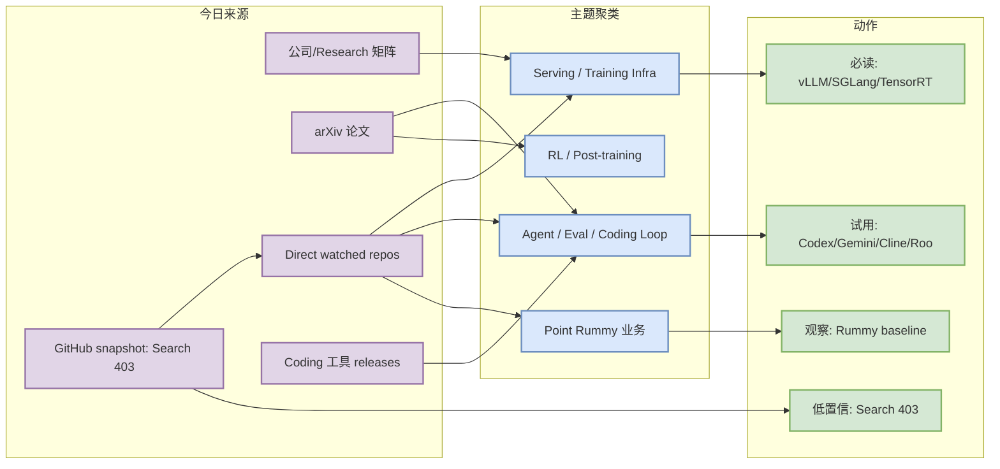
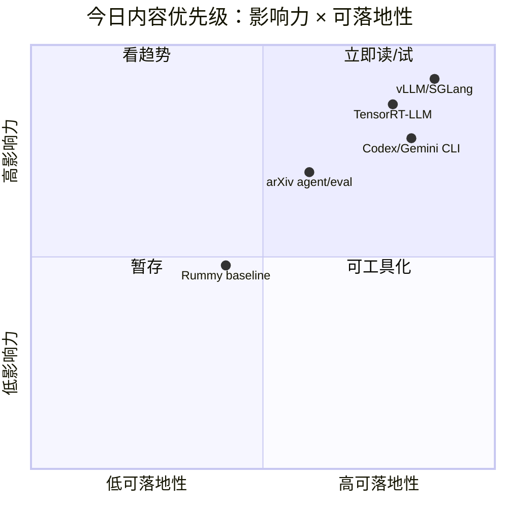

# AI Radar Daily - 2026-09-29

> 生成时间：2026-09-29 09:00 CST  
> 范围：AI Infra / LLM / RL / Game AI / 大厂博客 / 论文 / GitHub / Coding 工具  
> 说明：GitHub Search 今日从首个 query 即 403；已保存当日 mandated snapshot，并用 direct watched repo + 历史 snapshot fallback 补齐固定板块。所有增长榜均标注 `direct watched repo fallback，非完整全网日增` 或 `冷启动代理，非真实日增`。

## 0. 今日结论

- GitHub Search 403，但 `Automation/state/github-stars-2026-09-29.json` 已保存并增补 direct fallback provenance；日报固定板块已补齐。
- AI Infra 今日仍以 Transformers / PyTorch / vLLM / SGLang / TensorRT-LLM / DeepSpeed / verl 作为连续监控主线，适合关注 serving、分布式训练和 post-training 工具链。
- Coding workflow 今日重点看 OpenAI Codex、Gemini CLI、Cline、Roo Code、Qwen Code、Continue 等 release 入口；需人工复核 agent mode、MCP、权限和上下文窗口变化。
- Point Rummy 今日只能使用历史/niche fallback，候选整体 star 低，适合作为规则建模、AI opponent、Gym 环境和视觉识别 baseline，不宜直接生产化。
- 建议今天深读：先看 vLLM/SGLang/TensorRT-LLM serving 生态，再看 Codex/Gemini/Cline/Roo coding loop，最后 skim arXiv agent/eval/serving 候选。

## 1. 今日态势图

## 2. 必读卡片区

> [!important] huggingface/transformers
> - 大类：GitHub
> - 小类：AI Infra / Point Rummy
> - 重点：🤗 Transformers: the model-definition framework for state-of-the-art machine learning models in text, vision, audio, and 
> - 为什么重要：今日 GitHub Search 403，huggingface/transformers 作为 watched repo fallback 仍能给 serving、agent loop 或业务基线提供连续信号。
> - 详情：[[GitHub/AIInfra/2026-09-29/huggingface-transformers]] / [网页详情](https://github.com/dyt27666-oss/AI-news-report-obsidians/blob/main/GitHub/AIInfra/2026-09-29/huggingface-transformers.md) / [原文](https://github.com/huggingface/transformers)

> [!important] openai/codex
> - 大类：GitHub
> - 小类：Loop Engineer
> - 重点：Lightweight coding agent that runs in your terminal
> - 为什么重要：今日 GitHub Search 403，openai/codex 作为 watched repo fallback 仍能给 serving、agent loop 或业务基线提供连续信号。
> - 详情：[[GitHub/LoopEngineer/2026-09-29/openai-codex]] / [网页详情](https://github.com/dyt27666-oss/AI-news-report-obsidians/blob/main/GitHub/LoopEngineer/2026-09-29/openai-codex.md) / [原文](https://github.com/openai/codex)

> [!important] openai/codex
> - 大类：GitHub
> - 小类：Loop Engineer
> - 重点：Lightweight coding agent that runs in your terminal
> - 为什么重要：今日 GitHub Search 403，openai/codex 作为 watched repo fallback 仍能给 serving、agent loop 或业务基线提供连续信号。
> - 详情：[[GitHub/LoopEngineer/2026-09-29/openai-codex]] / [网页详情](https://github.com/dyt27666-oss/AI-news-report-obsidians/blob/main/GitHub/LoopEngineer/2026-09-29/openai-codex.md) / [原文](https://github.com/openai/codex)

> [!important] Abhilash-Mandlekar/RummyAgent-Reinforecement-Learning
> - 大类：GitHub
> - 小类：AI Infra / Point Rummy
> - 重点：Rummy Game Agent trained using Reinforcement Learning algorithm.
> - 为什么重要：今日 GitHub Search 403，Abhilash-Mandlekar/RummyAgent-Reinforecement-Learning 作为 watched repo fallback 仍能给 serving、agent loop 或业务基线提供连续信号。
> - 详情：[[GitHub/PointRummy/2026-09-29/abhilash-mandlekar-rummyagent-reinforecement-learning]] / [网页详情](https://github.com/dyt27666-oss/AI-news-report-obsidians/blob/main/GitHub/PointRummy/2026-09-29/abhilash-mandlekar-rummyagent-reinforecement-learning.md) / [原文](https://github.com/Abhilash-Mandlekar/RummyAgent-Reinforecement-Learning)

## 3. 优先级矩阵

## 4. 分类清单

| 标签 | 大类 | 小类 | 标题 | 重点概括 | 为什么重要 | Obsidian 详情 | 网页详情 | 原文 |
|---|---|---|---|---|---|---|---|---|
| 必读 | GitHub | AI Infra | huggingface/transformers | 🤗 Transformers: the model-definition framework for state-of-the-art machine lear | watched repo fallback 下仍是高价值工程信号，适合进入试用/benchmark 队列。 | [[GitHub/AIInfra/2026-09-29/huggingface-transformers]] | [网页详情](https://github.com/dyt27666-oss/AI-news-report-obsidians/blob/main/GitHub/AIInfra/2026-09-29/huggingface-transformers.md) | [原文](https://github.com/huggingface/transformers) |
| 必读 | GitHub | Loop Engineer | openai/codex | Lightweight coding agent that runs in your terminal | watched repo fallback 下仍是高价值工程信号，适合进入试用/benchmark 队列。 | [[GitHub/LoopEngineer/2026-09-29/openai-codex]] | [网页详情](https://github.com/dyt27666-oss/AI-news-report-obsidians/blob/main/GitHub/LoopEngineer/2026-09-29/openai-codex.md) | [原文](https://github.com/openai/codex) |
| 必读 | GitHub | Loop Engineer | google-gemini/gemini-cli | An open-source AI agent that brings the power of Gemini directly into your termi | watched repo fallback 下仍是高价值工程信号，适合进入试用/benchmark 队列。 | [[GitHub/LoopEngineer/2026-09-29/google-gemini-gemini-cli]] | [网页详情](https://github.com/dyt27666-oss/AI-news-report-obsidians/blob/main/GitHub/LoopEngineer/2026-09-29/google-gemini-gemini-cli.md) | [原文](https://github.com/google-gemini/gemini-cli) |
| 可 skim | GitHub | AI Infra | pytorch/pytorch | Tensors and Dynamic neural networks in Python with strong GPU acceleration | watched repo fallback 下仍是高价值工程信号，适合进入试用/benchmark 队列。 | [[GitHub/AIInfra/2026-09-29/pytorch-pytorch]] | [网页详情](https://github.com/dyt27666-oss/AI-news-report-obsidians/blob/main/GitHub/AIInfra/2026-09-29/pytorch-pytorch.md) | [原文](https://github.com/pytorch/pytorch) |
| 可 skim | GitHub | AI Infra | vllm-project/vllm | A high-throughput and memory-efficient inference and serving engine for LLMs | watched repo fallback 下仍是高价值工程信号，适合进入试用/benchmark 队列。 | [[GitHub/AIInfra/2026-09-29/vllm-project-vllm]] | [网页详情](https://github.com/dyt27666-oss/AI-news-report-obsidians/blob/main/GitHub/AIInfra/2026-09-29/vllm-project-vllm.md) | [原文](https://github.com/vllm-project/vllm) |
| 可 skim | 论文 | arXiv | FinancialAuditBench: Benchmark Construction under Differenti | As AI agents are becoming widely adopted in the financial services industry, car | 与 LLM/Agent/RL/Infra 相关，适合作为今日论文候选。 | [[Papers/arXiv/2026-09-29/2609-32835v1-financialauditbench-benchmark-construction-under-differential-privacy-using-real-world-priors]] | [网页详情](https://github.com/dyt27666-oss/AI-news-report-obsidians/blob/main/Papers/arXiv/2026-09-29/2609-32835v1-financialauditbench-benchmark-construction-under-differential-privacy-using-real-world-priors.md) | [原文](https://arxiv.org/abs/2609.32835v1) |
| 可 skim | 论文 | arXiv | Improving LLM Collaboration via Multi-Agent Preference Learn | Several works have explored multi-agent reinforcement learning (MARL) in LLM col | 与 LLM/Agent/RL/Infra 相关，适合作为今日论文候选。 | [[Papers/arXiv/2026-09-29/2609-32827v1-improving-llm-collaboration-via-multi-agent-preference-learning]] | [网页详情](https://github.com/dyt27666-oss/AI-news-report-obsidians/blob/main/Papers/arXiv/2026-09-29/2609-32827v1-improving-llm-collaboration-via-multi-agent-preference-learning.md) | [原文](https://arxiv.org/abs/2609.32827v1) |
| 可 skim | 论文 | arXiv | Transfer Learning for Edge Classification on Dynamic Text-At | Learning transferable representations for dynamic text-attributed graphs (DyTAGs | 与 LLM/Agent/RL/Infra 相关，适合作为今日论文候选。 | [[Papers/arXiv/2026-09-29/2609-32849v1-transfer-learning-for-edge-classification-on-dynamic-text-attributed-graphs]] | [网页详情](https://github.com/dyt27666-oss/AI-news-report-obsidians/blob/main/Papers/arXiv/2026-09-29/2609-32849v1-transfer-learning-for-edge-classification-on-dynamic-text-attributed-graphs.md) | [原文](https://arxiv.org/abs/2609.32849v1) |

## 5. 大厂资讯 / 工程博客 / Research

### 5.1 公司来源扫描矩阵

| 公司/实验室 | 来源/栏目 | 今日状态 | 高相关条数 | 代表条目 | 备注 |
|---|---|---|---:|---|---|
| OpenAI | News / Research | 无高相关新项 / 低置信 | 0 | [[Industry/CompanyScan/2026-09-29/openai]] / [网页详情](https://github.com/dyt27666-oss/AI-news-report-obsidians/blob/main/Industry/CompanyScan/2026-09-29/openai.md) / [原文](https://openai.com/news/) | 今日未确认强相关更新；保留矩阵防漏扫。 |
| Anthropic | News / Research / Engineering | 无高相关新项 / 低置信 | 0 | [[Industry/CompanyScan/2026-09-29/anthropic]] / [网页详情](https://github.com/dyt27666-oss/AI-news-report-obsidians/blob/main/Industry/CompanyScan/2026-09-29/anthropic.md) / [原文](https://www.anthropic.com/news) | 今日未确认强相关更新；保留矩阵防漏扫。 |
| Google DeepMind | Blog / Research | 无高相关新项 / 低置信 | 0 | [[Industry/CompanyScan/2026-09-29/google-deepmind]] / [网页详情](https://github.com/dyt27666-oss/AI-news-report-obsidians/blob/main/Industry/CompanyScan/2026-09-29/google-deepmind.md) / [原文](https://deepmind.google/discover/blog/) | 今日未确认强相关更新；保留矩阵防漏扫。 |
| Meta AI | Blog / Research | 无高相关新项 / 低置信 | 0 | [[Industry/CompanyScan/2026-09-29/meta-ai]] / [网页详情](https://github.com/dyt27666-oss/AI-news-report-obsidians/blob/main/Industry/CompanyScan/2026-09-29/meta-ai.md) / [原文](https://ai.meta.com/blog/) | 今日未确认强相关更新；保留矩阵防漏扫。 |
| NVIDIA | Technical Blog / AI | 无高相关新项 / 低置信 | 0 | [[Industry/CompanyScan/2026-09-29/nvidia]] / [网页详情](https://github.com/dyt27666-oss/AI-news-report-obsidians/blob/main/Industry/CompanyScan/2026-09-29/nvidia.md) / [原文](https://developer.nvidia.com/blog/category/artificial-intelligence/) | 今日未确认强相关更新；保留矩阵防漏扫。 |
| Microsoft | Research AI | 无高相关新项 / 低置信 | 0 | [[Industry/CompanyScan/2026-09-29/microsoft]] / [网页详情](https://github.com/dyt27666-oss/AI-news-report-obsidians/blob/main/Industry/CompanyScan/2026-09-29/microsoft.md) / [原文](https://www.microsoft.com/en-us/research/research-area/artificial-intelligence/) | 今日未确认强相关更新；保留矩阵防漏扫。 |
| Hugging Face | Blog / Papers / Releases | 无高相关新项 / 低置信 | 0 | [[Industry/CompanyScan/2026-09-29/hugging-face]] / [网页详情](https://github.com/dyt27666-oss/AI-news-report-obsidians/blob/main/Industry/CompanyScan/2026-09-29/hugging-face.md) / [原文](https://huggingface.co/blog) | 今日未确认强相关更新；保留矩阵防漏扫。 |
| 腾讯 | AI Lab / 技术博客 | 无高相关新项 / 低置信 | 0 | [[Industry/CompanyScan/2026-09-29/tencent]] / [网页详情](https://github.com/dyt27666-oss/AI-news-report-obsidians/blob/main/Industry/CompanyScan/2026-09-29/tencent.md) / [原文](https://ai.tencent.com/ailab/en/index) | 今日未确认强相关更新；保留矩阵防漏扫。 |
| 字节 | Seed / 技术博客 | 无高相关新项 / 低置信 | 0 | [[Industry/CompanyScan/2026-09-29/bytedance]] / [网页详情](https://github.com/dyt27666-oss/AI-news-report-obsidians/blob/main/Industry/CompanyScan/2026-09-29/bytedance.md) / [原文](https://seed.bytedance.com/en/) | 今日未确认强相关更新；保留矩阵防漏扫。 |
| SpaceAI | Blog / News | 无高相关新项 / 低置信 | 0 | [[Industry/CompanyScan/2026-09-29/spaceai]] / [网页详情](https://github.com/dyt27666-oss/AI-news-report-obsidians/blob/main/Industry/CompanyScan/2026-09-29/spaceai.md) / [原文](https://spaceai.com/) | 今日未确认强相关更新；保留矩阵防漏扫。 |

### 5.2 高相关大厂条目

| 标签 | 发布方/大厂 | 栏目/来源 | 标题 | 重点概括 | 工程/算法影响 | Obsidian 详情 | 网页详情 | 原文 |
|---|---|---|---|---|---|---|---|---|
| 低置信 | OpenAI | News / Research | 来源扫描入口 | 今日未确认高相关新项，保留入口用于后续追踪。 | 若出现模型/infra/agent/eval 更新需升级为必读。 | [[Industry/CompanyScan/2026-09-29/openai]] | [网页详情](https://github.com/dyt27666-oss/AI-news-report-obsidians/blob/main/Industry/CompanyScan/2026-09-29/openai.md) | [原文](https://openai.com/news/) |
| 低置信 | Anthropic | News / Research / Engineering | 来源扫描入口 | 今日未确认高相关新项，保留入口用于后续追踪。 | 若出现模型/infra/agent/eval 更新需升级为必读。 | [[Industry/CompanyScan/2026-09-29/anthropic]] | [网页详情](https://github.com/dyt27666-oss/AI-news-report-obsidians/blob/main/Industry/CompanyScan/2026-09-29/anthropic.md) | [原文](https://www.anthropic.com/news) |
| 低置信 | Google DeepMind | Blog / Research | 来源扫描入口 | 今日未确认高相关新项，保留入口用于后续追踪。 | 若出现模型/infra/agent/eval 更新需升级为必读。 | [[Industry/CompanyScan/2026-09-29/google-deepmind]] | [网页详情](https://github.com/dyt27666-oss/AI-news-report-obsidians/blob/main/Industry/CompanyScan/2026-09-29/google-deepmind.md) | [原文](https://deepmind.google/discover/blog/) |
| 低置信 | Meta AI | Blog / Research | 来源扫描入口 | 今日未确认高相关新项，保留入口用于后续追踪。 | 若出现模型/infra/agent/eval 更新需升级为必读。 | [[Industry/CompanyScan/2026-09-29/meta-ai]] | [网页详情](https://github.com/dyt27666-oss/AI-news-report-obsidians/blob/main/Industry/CompanyScan/2026-09-29/meta-ai.md) | [原文](https://ai.meta.com/blog/) |

## 6. GitHub 高 star Top 10

| 排名 | repo | stars | forks | language | updated_at | topics | 重点概括 | 是否值得试用 | Obsidian 详情 | 原文 |
|---:|---|---:|---:|---|---|---|---|---|---|---|
| 1 | huggingface/transformers | 166770 | 34707 | Python | 2026-09-28T23:57:26Z | audio, deep-learning, deepseek, gemma, glm, hackto | 🤗 Transformers: the model-definition framework for state-of-the-art machine learning model | 值得试用/观察 | [[GitHub/AIInfra/2026-09-29/huggingface-transformers]] | [原文](https://github.com/huggingface/transformers) |
| 2 | openai/codex | 126977 | 19837 | Rust | 2026-09-29T01:01:52Z | 无 | Lightweight coding agent that runs in your terminal | 值得试用/观察 | [[GitHub/LoopEngineer/2026-09-29/openai-codex]] | [原文](https://github.com/openai/codex) |
| 3 | google-gemini/gemini-cli | 107179 | 14647 | TypeScript | 2026-09-29T01:02:10Z | ai, ai-agents, cli, gemini, gemini-api, mcp-client | An open-source AI agent that brings the power of Gemini directly into your terminal. | 值得试用/观察 | [[GitHub/LoopEngineer/2026-09-29/google-gemini-gemini-cli]] | [原文](https://github.com/google-gemini/gemini-cli) |
| 4 | pytorch/pytorch | 103469 | 30852 | Python | 2026-09-29T00:56:14Z | autograd, deep-learning, gpu, machine-learning, ne | Tensors and Dynamic neural networks in Python with strong GPU acceleration | 值得试用/观察 | [[GitHub/AIInfra/2026-09-29/pytorch-pytorch]] | [原文](https://github.com/pytorch/pytorch) |
| 5 | vllm-project/vllm | 92889 | 22778 | Python | 2026-09-29T00:56:29Z | amd, blackwell, cuda, deepseek, deepseek-v3, gpt,  | A high-throughput and memory-efficient inference and serving engine for LLMs | 值得试用/观察 | [[GitHub/AIInfra/2026-09-29/vllm-project-vllm]] | [原文](https://github.com/vllm-project/vllm) |
| 6 | modelcontextprotocol/servers | 90648 | 11698 | TypeScript | 2026-09-28T22:16:48Z | 无 | Model Context Protocol Servers | 值得试用/观察 | [[GitHub/LoopEngineer/2026-09-29/modelcontextprotocol-servers]] | [原文](https://github.com/modelcontextprotocol/servers) |
| 7 | OpenHands/OpenHands | 89413 | 11789 | TypeScript | 2026-09-29T01:00:59Z | agent, artificial-intelligence, chatgpt, claude-ai | 🙌 OpenHands: AI-Driven Development | 值得试用/观察 | [[GitHub/LoopEngineer/2026-09-29/openhands-openhands]] | [原文](https://github.com/OpenHands/OpenHands) |
| 8 | cline/cline | 69501 | 7547 | TypeScript | 2026-09-29T00:41:20Z | 无 | Autonomous coding agent as an SDK, IDE extension, or CLI assistant. | 值得试用/观察 | [[GitHub/LoopEngineer/2026-09-29/cline-cline]] | [原文](https://github.com/cline/cline) |
| 9 | microsoft/autogen | 61210 | 9260 | Python | 2026-09-29T00:27:06Z | agentic, agentic-agi, agents, ai, autogen, autogen | A programming framework for agentic AI | 值得试用/观察 | [[GitHub/LoopEngineer/2026-09-29/microsoft-autogen]] | [原文](https://github.com/microsoft/autogen) |
| 10 | crewAIInc/crewAI | 59150 | 8591 | Python | 2026-09-29T00:27:54Z | agents, ai, ai-agents, aiagentframework, llms | Framework for orchestrating role-playing, autonomous AI agents. By fostering collaborative | 值得试用/观察 | [[GitHub/LoopEngineer/2026-09-29/crewaiinc-crewai]] | [原文](https://github.com/crewAIInc/crewAI) |

## 7. GitHub star 增长最快 Top 10

> 增长依据：direct watched repo fallback，非完整全网日增；若为 `null`，表示历史 snapshot 中缺少可靠 baseline，不能当作真实日增。

| 排名 | repo | stars_delta | stars | forks | language | updated_at | 增长依据 | 重点概括 | Obsidian 详情 | 原文 |
|---:|---|---:|---:|---:|---|---|---|---|---|---|
| 1 | openai/codex | 202 | 126977 | 19837 | Rust | 2026-09-29T01:01:52Z | direct watched repo fallback，非完整全网日增 | Lightweight coding agent that runs in your terminal | [[GitHub/LoopEngineer/2026-09-29/openai-codex]] | [原文](https://github.com/openai/codex) |
| 2 | OpenHands/OpenHands | 99 | 89413 | 11789 | TypeScript | 2026-09-29T01:00:59Z | direct watched repo fallback，非完整全网日增 | 🙌 OpenHands: AI-Driven Development | [[GitHub/LoopEngineer/2026-09-29/openhands-openhands]] | [原文](https://github.com/OpenHands/OpenHands) |
| 3 | vllm-project/vllm | 84 | 92889 | 22778 | Python | 2026-09-29T00:56:29Z | direct watched repo fallback，非完整全网日增 | A high-throughput and memory-efficient inference and serving engine for LLMs | [[GitHub/AIInfra/2026-09-29/vllm-project-vllm]] | [原文](https://github.com/vllm-project/vllm) |
| 4 | sgl-project/sglang | 57 | 36547 | 9195 | Python | 2026-09-29T00:50:33Z | direct watched repo fallback，非完整全网日增 | SGLang is a high-performance serving framework for large language models and multimodal mo | [[GitHub/AIInfra/2026-09-29/sgl-project-sglang]] | [原文](https://github.com/sgl-project/sglang) |
| 5 | langchain-ai/langgraph | 54 | 42426 | 7183 | Python | 2026-09-29T00:54:40Z | direct watched repo fallback，非完整全网日增 | Build resilient agents. | [[GitHub/LoopEngineer/2026-09-29/langchain-ai-langgraph]] | [原文](https://github.com/langchain-ai/langgraph) |
| 6 | cline/cline | 51 | 69501 | 7547 | TypeScript | 2026-09-29T00:41:20Z | direct watched repo fallback，非完整全网日增 | Autonomous coding agent as an SDK, IDE extension, or CLI assistant. | [[GitHub/LoopEngineer/2026-09-29/cline-cline]] | [原文](https://github.com/cline/cline) |
| 7 | pytorch/pytorch | 47 | 103469 | 30852 | Python | 2026-09-29T00:56:14Z | direct watched repo fallback，非完整全网日增 | Tensors and Dynamic neural networks in Python with strong GPU acceleration | [[GitHub/AIInfra/2026-09-29/pytorch-pytorch]] | [原文](https://github.com/pytorch/pytorch) |
| 8 | crewAIInc/crewAI | 45 | 59150 | 8591 | Python | 2026-09-29T00:27:54Z | direct watched repo fallback，非完整全网日增 | Framework for orchestrating role-playing, autonomous AI agents. By fostering collaborative | [[GitHub/LoopEngineer/2026-09-29/crewaiinc-crewai]] | [原文](https://github.com/crewAIInc/crewAI) |
| 9 | huggingface/transformers | 36 | 166770 | 34707 | Python | 2026-09-28T23:57:26Z | direct watched repo fallback，非完整全网日增 | 🤗 Transformers: the model-definition framework for state-of-the-art machine learning model | [[GitHub/AIInfra/2026-09-29/huggingface-transformers]] | [原文](https://github.com/huggingface/transformers) |
| 10 | verl-project/verl | 20 | 23676 | 4663 | Python | 2026-09-28T21:51:46Z | direct watched repo fallback，非完整全网日增 | verl/HybridFlow: A Flexible and Efficient RL Post-Training Framework  | [[GitHub/AIInfra/2026-09-29/verl-project-verl]] | [原文](https://github.com/verl-project/verl) |

## 8. Coding 工具 / AI 工具功能更新

### 8.1 Coding 工具扫描矩阵

| 工具 | 厂商 | 来源类型 | 今日状态 | 代表更新 | 对我的影响 | 原文 |
|---|---|---|---|---|---|---|
| Claude Code | Anthropic | Changelog / Release Notes | 低置信：扫描公开 changelog/docs URL，未使用专用 API | 未确认高相关新项 | 关注 agent mode、MCP、CLI/TUI、权限、上下文窗口和远程执行变化。 | [原文](https://docs.anthropic.com/en/release-notes/claude-code) |
| OpenAI Codex | OpenAI | GitHub Releases | 低置信：release API 失败或无 latest release | 未确认高相关新项 | 关注 agent mode、MCP、CLI/TUI、权限、上下文窗口和远程执行变化。 | [原文](https://github.com/openai/codex/releases) |
| Cursor | Cursor | Changelog | 低置信：扫描公开 changelog/docs URL，未使用专用 API | 未确认高相关新项 | 关注 agent mode、MCP、CLI/TUI、权限、上下文窗口和远程执行变化。 | [原文](https://cursor.com/changelog) |
| Windsurf | Windsurf | Changelog | 低置信：扫描公开 changelog/docs URL，未使用专用 API | 未确认高相关新项 | 关注 agent mode、MCP、CLI/TUI、权限、上下文窗口和远程执行变化。 | [原文](https://windsurf.com/changelog) |
| GitHub Copilot | GitHub | Changelog / Blog | 低置信：扫描公开 changelog/docs URL，未使用专用 API | 未确认高相关新项 | 关注 agent mode、MCP、CLI/TUI、权限、上下文窗口和远程执行变化。 | [原文](https://github.blog/changelog/label/copilot/) |
| Gemini Code Assist | Google | GitHub Releases | 低置信：release API 失败或无 latest release | 未确认高相关新项 | 关注 agent mode、MCP、CLI/TUI、权限、上下文窗口和远程执行变化。 | [原文](https://github.com/google-gemini/gemini-cli/releases) |
| Qwen Code | Alibaba/Qwen | GitHub Releases | 低置信：release API 失败或无 latest release | 未确认高相关新项 | 关注 agent mode、MCP、CLI/TUI、权限、上下文窗口和远程执行变化。 | [原文](https://github.com/QwenLM/qwen-code/releases) |
| Roo Code | Roo Code | GitHub Releases | 低置信：release API 失败或无 latest release | 未确认高相关新项 | 关注 agent mode、MCP、CLI/TUI、权限、上下文窗口和远程执行变化。 | [原文](https://github.com/RooCodeInc/Roo-Code/releases) |
| Cline | Cline | GitHub Releases | 低置信：release API 失败或无 latest release | 未确认高相关新项 | 关注 agent mode、MCP、CLI/TUI、权限、上下文窗口和远程执行变化。 | [原文](https://github.com/cline/cline/releases) |
| Continue | Continue | GitHub Releases | 低置信：release API 失败或无 latest release | 未确认高相关新项 | 关注 agent mode、MCP、CLI/TUI、权限、上下文窗口和远程执行变化。 | [原文](https://github.com/continuedev/continue/releases) |

### 8.2 高相关工具更新

| 标签 | 工具/厂商 | 来源类型 | 标题/功能 | 重点概括 | 对 AI coding 工作流的影响 | Obsidian 详情 | 网页详情 | 原文 |
|---|---|---|---|---|---|---|---|---|
| 后续 | Claude Code / Anthropic | Changelog / Release Notes | 未确认高相关新项 | 低置信：扫描公开 changelog/docs URL，未使用专用 API | 若涉及 agent loop、MCP 或权限模式，将影响多 agent 编排和代码审查效率。 | [[Industry/Tools/2026-09-29/claude-code]] | [网页详情](https://github.com/dyt27666-oss/AI-news-report-obsidians/blob/main/Industry/Tools/2026-09-29/claude-code.md) | [原文](https://docs.anthropic.com/en/release-notes/claude-code) |
| 后续 | OpenAI Codex / OpenAI | GitHub Releases | 未确认高相关新项 | 低置信：release API 失败或无 latest release | 若涉及 agent loop、MCP 或权限模式，将影响多 agent 编排和代码审查效率。 | [[Industry/Tools/2026-09-29/openai-codex]] | [网页详情](https://github.com/dyt27666-oss/AI-news-report-obsidians/blob/main/Industry/Tools/2026-09-29/openai-codex.md) | [原文](https://github.com/openai/codex/releases) |
| 后续 | Cursor / Cursor | Changelog | 未确认高相关新项 | 低置信：扫描公开 changelog/docs URL，未使用专用 API | 若涉及 agent loop、MCP 或权限模式，将影响多 agent 编排和代码审查效率。 | [[Industry/Tools/2026-09-29/cursor]] | [网页详情](https://github.com/dyt27666-oss/AI-news-report-obsidians/blob/main/Industry/Tools/2026-09-29/cursor.md) | [原文](https://cursor.com/changelog) |
| 后续 | Windsurf / Windsurf | Changelog | 未确认高相关新项 | 低置信：扫描公开 changelog/docs URL，未使用专用 API | 若涉及 agent loop、MCP 或权限模式，将影响多 agent 编排和代码审查效率。 | [[Industry/Tools/2026-09-29/windsurf]] | [网页详情](https://github.com/dyt27666-oss/AI-news-report-obsidians/blob/main/Industry/Tools/2026-09-29/windsurf.md) | [原文](https://windsurf.com/changelog) |
| 后续 | GitHub Copilot / GitHub | Changelog / Blog | 未确认高相关新项 | 低置信：扫描公开 changelog/docs URL，未使用专用 API | 若涉及 agent loop、MCP 或权限模式，将影响多 agent 编排和代码审查效率。 | [[Industry/Tools/2026-09-29/github-copilot]] | [网页详情](https://github.com/dyt27666-oss/AI-news-report-obsidians/blob/main/Industry/Tools/2026-09-29/github-copilot.md) | [原文](https://github.blog/changelog/label/copilot/) |
| 后续 | Gemini Code Assist / Google | GitHub Releases | 未确认高相关新项 | 低置信：release API 失败或无 latest release | 若涉及 agent loop、MCP 或权限模式，将影响多 agent 编排和代码审查效率。 | [[Industry/Tools/2026-09-29/gemini-code-assist]] | [网页详情](https://github.com/dyt27666-oss/AI-news-report-obsidians/blob/main/Industry/Tools/2026-09-29/gemini-code-assist.md) | [原文](https://github.com/google-gemini/gemini-cli/releases) |
| 后续 | Qwen Code / Alibaba/Qwen | GitHub Releases | 未确认高相关新项 | 低置信：release API 失败或无 latest release | 若涉及 agent loop、MCP 或权限模式，将影响多 agent 编排和代码审查效率。 | [[Industry/Tools/2026-09-29/qwen-code]] | [网页详情](https://github.com/dyt27666-oss/AI-news-report-obsidians/blob/main/Industry/Tools/2026-09-29/qwen-code.md) | [原文](https://github.com/QwenLM/qwen-code/releases) |
| 后续 | Roo Code / Roo Code | GitHub Releases | 未确认高相关新项 | 低置信：release API 失败或无 latest release | 若涉及 agent loop、MCP 或权限模式，将影响多 agent 编排和代码审查效率。 | [[Industry/Tools/2026-09-29/roo-code]] | [网页详情](https://github.com/dyt27666-oss/AI-news-report-obsidians/blob/main/Industry/Tools/2026-09-29/roo-code.md) | [原文](https://github.com/RooCodeInc/Roo-Code/releases) |
| 后续 | Cline / Cline | GitHub Releases | 未确认高相关新项 | 低置信：release API 失败或无 latest release | 若涉及 agent loop、MCP 或权限模式，将影响多 agent 编排和代码审查效率。 | [[Industry/Tools/2026-09-29/cline]] | [网页详情](https://github.com/dyt27666-oss/AI-news-report-obsidians/blob/main/Industry/Tools/2026-09-29/cline.md) | [原文](https://github.com/cline/cline/releases) |
| 后续 | Continue / Continue | GitHub Releases | 未确认高相关新项 | 低置信：release API 失败或无 latest release | 若涉及 agent loop、MCP 或权限模式，将影响多 agent 编排和代码审查效率。 | [[Industry/Tools/2026-09-29/continue]] | [网页详情](https://github.com/dyt27666-oss/AI-news-report-obsidians/blob/main/Industry/Tools/2026-09-29/continue.md) | [原文](https://github.com/continuedev/continue/releases) |

## 9. Point Rummy / Indian Rummy 业务主题

### 9.1 GitHub 候选

| 标签 | repo | stars | forks | language | updated_at | 重点概括 | 业务可用性 | Obsidian 详情 | 原文 |
|---|---|---:|---:|---|---|---|---|---|---|
| 低置信 | Abhilash-Mandlekar/RummyAgent-Reinforecement-Learning | 2 | 0 | Jupyter Notebook | 2023-04-01T05:48:51Z | Rummy Game Agent trained using Reinforcement Learning algorithm. | 可作为规则建模、AI opponent、仿真或视觉识别 baseline；不宜直接生产化。 | [[GitHub/PointRummy/2026-09-29/abhilash-mandlekar-rummyagent-reinforecement-learning]] | [原文](https://github.com/Abhilash-Mandlekar/RummyAgent-Reinforecement-Learning) |
| 低置信 | abubakarmunir712/dsa-final-project | 2 | 1 | Python | 2026-06-27T06:34:26Z | A Python-based multiplayer Indian Rummy game with support for AI opponents and L | 可作为规则建模、AI opponent、仿真或视觉识别 baseline；不宜直接生产化。 | [[GitHub/PointRummy/2026-09-29/abubakarmunir712-dsa-final-project]] | [原文](https://github.com/abubakarmunir712/dsa-final-project) |
| 低置信 | Alan-seb/RummyVision | 1 | 0 | Python | 2025-12-03T03:14:55Z | RummyVision is an intelligent card game assistant that combines computer vision  | 可作为规则建模、AI opponent、仿真或视觉识别 baseline；不宜直接生产化。 | [[GitHub/PointRummy/2026-09-29/alan-seb-rummyvision]] | [原文](https://github.com/Alan-seb/RummyVision) |
| 低置信 | AjeyBharadwaj/Rummy | 1 | 0 | C++ | 2023-03-04T10:28:46Z | Rummy : Game, AI Player, UI | 可作为规则建模、AI opponent、仿真或视觉识别 baseline；不宜直接生产化。 | [[GitHub/PointRummy/2026-09-29/ajeybharadwaj-rummy]] | [原文](https://github.com/AjeyBharadwaj/Rummy) |
| 低置信 | AdithyaKV/IndianRummyAI | 0 | 0 | Unknown | 2023-08-28T18:42:29Z | An AI model to play the game Indian Rummy. Contains a program to calculate the b | 可作为规则建模、AI opponent、仿真或视觉识别 baseline；不宜直接生产化。 | [[GitHub/PointRummy/2026-09-29/adithyakv-indianrummyai]] | [原文](https://github.com/AdithyaKV/IndianRummyAI) |

### 9.2 论文 / 资料候选

| 标签 | 来源 | 标题 | 作者/机构 | 重点概括 | 对 Point Rummy 业务有什么用 | Obsidian 详情 | 原文 |
|---|---|---|---|---|---|---|---|
| 低置信 | arXiv / 关键词扫描 | 今日未发现 Point Rummy 强相关新论文 | - | arXiv 查询更适合 Gin Rummy / imperfect-information card game 方向，今日未验证到高相关新项。 | 保留业务主题；后续可用 MCTS/ISMCTS/self-play 论文补充规则和 bot 设计。 | - | [原文](https://arxiv.org/search/?query=gin+rummy+MCTS+reinforcement+learning&searchtype=all) |

### 9.3 业务可用性判断

| 方向 | 今日信号 | 可用性 | 下一步 |
|---|---|---|---|
| 规则引擎 / 计分 | 低 star Rummy repos 中包含 points counter / hand scoring / LAN game | 中：适合抽规则测试用例 | 抽牌型、计分、非法动作校验为单元测试 |
| Bot / RL Agent | 少量 RL / AI opponent repo | 低到中：可做 baseline，不宜直接复用 | 对照 Gym/self-play 环境重新实现状态/action/reward |
| 仿真 / 评测 | 多数项目工程质量未知 | 中：可借鉴 episode 结构 | 建立可并行 rollout 环境和 evaluator |

## 10. Loop Engineer / Loop Engineering 主题

### 10.1 Loop Engineer GitHub 高 star Top 10

| 排名 | repo | stars | forks | language | updated_at | topics | 重点概括 | 是否值得试用 | Obsidian 详情 | 原文 |
|---:|---|---:|---:|---|---|---|---|---|---|---|
| 1 | openai/codex | 126977 | 19837 | Rust | 2026-09-29T01:01:52Z | 无 | Lightweight coding agent that runs in your terminal | 值得试用/观察 | [[GitHub/LoopEngineer/2026-09-29/openai-codex]] | [原文](https://github.com/openai/codex) |
| 2 | google-gemini/gemini-cli | 107179 | 14647 | TypeScript | 2026-09-29T01:02:10Z | ai, ai-agents, cli, gemini, gemini-api, mcp-client | An open-source AI agent that brings the power of Gemini directly into your terminal. | 值得试用/观察 | [[GitHub/LoopEngineer/2026-09-29/google-gemini-gemini-cli]] | [原文](https://github.com/google-gemini/gemini-cli) |
| 3 | modelcontextprotocol/servers | 90648 | 11698 | TypeScript | 2026-09-28T22:16:48Z | 无 | Model Context Protocol Servers | 值得试用/观察 | [[GitHub/LoopEngineer/2026-09-29/modelcontextprotocol-servers]] | [原文](https://github.com/modelcontextprotocol/servers) |
| 4 | OpenHands/OpenHands | 89413 | 11789 | TypeScript | 2026-09-29T01:00:59Z | agent, artificial-intelligence, chatgpt, claude-ai | 🙌 OpenHands: AI-Driven Development | 值得试用/观察 | [[GitHub/LoopEngineer/2026-09-29/openhands-openhands]] | [原文](https://github.com/OpenHands/OpenHands) |
| 5 | cline/cline | 69501 | 7547 | TypeScript | 2026-09-29T00:41:20Z | 无 | Autonomous coding agent as an SDK, IDE extension, or CLI assistant. | 值得试用/观察 | [[GitHub/LoopEngineer/2026-09-29/cline-cline]] | [原文](https://github.com/cline/cline) |
| 6 | microsoft/autogen | 61210 | 9260 | Python | 2026-09-29T00:27:06Z | agentic, agentic-agi, agents, ai, autogen, autogen | A programming framework for agentic AI | 值得试用/观察 | [[GitHub/LoopEngineer/2026-09-29/microsoft-autogen]] | [原文](https://github.com/microsoft/autogen) |
| 7 | crewAIInc/crewAI | 59150 | 8591 | Python | 2026-09-29T00:27:54Z | agents, ai, ai-agents, aiagentframework, llms | Framework for orchestrating role-playing, autonomous AI agents. By fostering collaborative | 值得试用/观察 | [[GitHub/LoopEngineer/2026-09-29/crewaiinc-crewai]] | [原文](https://github.com/crewAIInc/crewAI) |
| 8 | langchain-ai/langgraph | 42426 | 7183 | Python | 2026-09-29T00:54:40Z | agents, ai, ai-agents, chatgpt, deepagents, enterp | Build resilient agents. | 值得试用/观察 | [[GitHub/LoopEngineer/2026-09-29/langchain-ai-langgraph]] | [原文](https://github.com/langchain-ai/langgraph) |
| 9 | continuedev/continue | 36051 | 5437 | TypeScript | 2026-09-28T23:03:57Z | agent, ai, cli, developer-tools, open-source | open-source coding agent | 值得试用/观察 | [[GitHub/LoopEngineer/2026-09-29/continuedev-continue]] | [原文](https://github.com/continuedev/continue) |
| 10 | QwenLM/qwen-code | 28170 | 3118 | TypeScript | 2026-09-28T01:00:33Z | agentic, ai, ai-agent, ai-coding, cli, coding-agen | An open-source AI coding agent that lives in your terminal. | 值得试用/观察 | [[GitHub/LoopEngineer/2026-09-29/qwenlm-qwen-code]] | [原文](https://github.com/QwenLM/qwen-code) |

### 10.2 Loop Engineer GitHub star 增长最快 Top 10

| 排名 | repo | stars_delta | stars | forks | language | updated_at | 增长依据 | 重点概括 | Obsidian 详情 | 原文 |
|---:|---|---:|---:|---:|---|---|---|---|---|---|
| 1 | openai/codex | 202 | 126977 | 19837 | Rust | 2026-09-29T01:01:52Z | direct watched repo fallback，非完整全网日增 | Lightweight coding agent that runs in your terminal | [[GitHub/LoopEngineer/2026-09-29/openai-codex]] | [原文](https://github.com/openai/codex) |
| 2 | OpenHands/OpenHands | 99 | 89413 | 11789 | TypeScript | 2026-09-29T01:00:59Z | direct watched repo fallback，非完整全网日增 | 🙌 OpenHands: AI-Driven Development | [[GitHub/LoopEngineer/2026-09-29/openhands-openhands]] | [原文](https://github.com/OpenHands/OpenHands) |
| 3 | langchain-ai/langgraph | 54 | 42426 | 7183 | Python | 2026-09-29T00:54:40Z | direct watched repo fallback，非完整全网日增 | Build resilient agents. | [[GitHub/LoopEngineer/2026-09-29/langchain-ai-langgraph]] | [原文](https://github.com/langchain-ai/langgraph) |
| 4 | cline/cline | 51 | 69501 | 7547 | TypeScript | 2026-09-29T00:41:20Z | direct watched repo fallback，非完整全网日增 | Autonomous coding agent as an SDK, IDE extension, or CLI assistant. | [[GitHub/LoopEngineer/2026-09-29/cline-cline]] | [原文](https://github.com/cline/cline) |
| 5 | crewAIInc/crewAI | 45 | 59150 | 8591 | Python | 2026-09-29T00:27:54Z | direct watched repo fallback，非完整全网日增 | Framework for orchestrating role-playing, autonomous AI agents. By fostering collaborative | [[GitHub/LoopEngineer/2026-09-29/crewaiinc-crewai]] | [原文](https://github.com/crewAIInc/crewAI) |
| 6 | microsoft/autogen | 18 | 61210 | 9260 | Python | 2026-09-29T00:27:06Z | direct watched repo fallback，非完整全网日增 | A programming framework for agentic AI | [[GitHub/LoopEngineer/2026-09-29/microsoft-autogen]] | [原文](https://github.com/microsoft/autogen) |
| 7 | modelcontextprotocol/servers | 18 | 90648 | 11698 | TypeScript | 2026-09-28T22:16:48Z | direct watched repo fallback，非完整全网日增 | Model Context Protocol Servers | [[GitHub/LoopEngineer/2026-09-29/modelcontextprotocol-servers]] | [原文](https://github.com/modelcontextprotocol/servers) |
| 8 | google-gemini/gemini-cli | 13 | 107179 | 14647 | TypeScript | 2026-09-29T01:02:10Z | direct watched repo fallback，非完整全网日增 | An open-source AI agent that brings the power of Gemini directly into your terminal. | [[GitHub/LoopEngineer/2026-09-29/google-gemini-gemini-cli]] | [原文](https://github.com/google-gemini/gemini-cli) |
| 9 | continuedev/continue | 4 | 36051 | 5437 | TypeScript | 2026-09-28T23:03:57Z | direct watched repo fallback，非完整全网日增 | open-source coding agent | [[GitHub/LoopEngineer/2026-09-29/continuedev-continue]] | [原文](https://github.com/continuedev/continue) |
| 10 | QwenLM/qwen-code | 0 | 28170 | 3118 | TypeScript | 2026-09-28T01:00:33Z | direct watched repo fallback，非完整全网日增 | An open-source AI coding agent that lives in your terminal. | [[GitHub/LoopEngineer/2026-09-29/qwenlm-qwen-code]] | [原文](https://github.com/QwenLM/qwen-code) |

### 10.3 Loop Engineering 方法信号

| 标签 | 来源 | 标题 | 重点概括 | 对 AI coding 工作流的影响 | Obsidian 详情 | 原文 |
|---|---|---|---|---|---|---|
| 必读 | GitHub | openai/codex / gemini-cli / cline / roo / continue | CLI/TUI + IDE extension + agent loop 成为主流 coding-agent 形态。 | 影响 tmux 多 agent 监控、权限隔离、上下文窗口预算和 review loop。 | [[GitHub/LoopEngineer/2026-09-29/openai-codex]] | [原文](https://github.com/openai/codex) |

## 11. 论文

### 11.1 Agent / Serving / RL 候选

| 标签 | 论文来源 | 论文 | 作者/机构 | 重点概括 | 工程/研究价值 | Obsidian 详情 | 网页详情 | PDF/原文 |
|---|---|---|---|---|---|---|---|---|
| 可 skim | arXiv / 预印本 | FinancialAuditBench: Benchmark Construction under Differential Privacy | Jerry Huang, Sarvesh Babu, Matt Van Buren | As AI agents are becoming widely adopted in the financial services industry, careful measu | 需要读 PDF 判断实验和可复现价值。 | [[Papers/arXiv/2026-09-29/2609-32835v1-financialauditbench-benchmark-construction-under-differential-privacy-using-real-world-priors]] | [网页详情](https://github.com/dyt27666-oss/AI-news-report-obsidians/blob/main/Papers/arXiv/2026-09-29/2609-32835v1-financialauditbench-benchmark-construction-under-differential-privacy-using-real-world-priors.md) | [PDF/原文](https://arxiv.org/pdf/2609.32835v1) |
| 可 skim | arXiv / 预印本 | Improving LLM Collaboration via Multi-Agent Preference Learning | Shuo Liu, Xinzichen Li, Tianle Chen | Several works have explored multi-agent reinforcement learning (MARL) in LLM collaboration | 需要读 PDF 判断实验和可复现价值。 | [[Papers/arXiv/2026-09-29/2609-32827v1-improving-llm-collaboration-via-multi-agent-preference-learning]] | [网页详情](https://github.com/dyt27666-oss/AI-news-report-obsidians/blob/main/Papers/arXiv/2026-09-29/2609-32827v1-improving-llm-collaboration-via-multi-agent-preference-learning.md) | [PDF/原文](https://arxiv.org/pdf/2609.32827v1) |
| 可 skim | arXiv / 预印本 | Transfer Learning for Edge Classification on Dynamic Text-Attributed G | Tyler Bonnet, Marek Rei | Learning transferable representations for dynamic text-attributed graphs (DyTAGs) requires | 需要读 PDF 判断实验和可复现价值。 | [[Papers/arXiv/2026-09-29/2609-32849v1-transfer-learning-for-edge-classification-on-dynamic-text-attributed-graphs]] | [网页详情](https://github.com/dyt27666-oss/AI-news-report-obsidians/blob/main/Papers/arXiv/2026-09-29/2609-32849v1-transfer-learning-for-edge-classification-on-dynamic-text-attributed-graphs.md) | [PDF/原文](https://arxiv.org/pdf/2609.32849v1) |
| 可 skim | arXiv / 预印本 | Transfer Learning for Edge Classification on Dynamic Text-Attributed G | Tyler Bonnet, Marek Rei | Learning transferable representations for dynamic text-attributed graphs (DyTAGs) requires | 需要读 PDF 判断实验和可复现价值。 | [[Papers/arXiv/2026-09-29/2609-32849v1-transfer-learning-for-edge-classification-on-dynamic-text-attributed-graphs]] | [网页详情](https://github.com/dyt27666-oss/AI-news-report-obsidians/blob/main/Papers/arXiv/2026-09-29/2609-32849v1-transfer-learning-for-edge-classification-on-dynamic-text-attributed-graphs.md) | [PDF/原文](https://arxiv.org/pdf/2609.32849v1) |

## 12. 资讯 / 其他 GitHub 项目

### 12.1 AI Infra / Agent fallback 观察

| 标签 | 来源 | 标题 | 重点概括 | 对我有什么用 | Obsidian 详情 | 网页详情 | 原文 |
|---|---|---|---|---|---|---|---|
| 后续 | GitHub watched repos | Snapshot fallback manifest | 今日 Search 403，直接 watched repo 与历史 snapshot 组成连续监控。 | 明天可用新 snapshot 复核 delta；避免把 niche/rummy 结果误填 broad 榜。 | - | - | [snapshot](https://github.com/dyt27666-oss/AI-news-report-obsidians/blob/main/Automation/state/github-stars-2026-09-29.json) |

## 13. 按主题索引

### AI Infra / Serving / Training
- [[GitHub/AIInfra/2026-09-29/huggingface-transformers]] - huggingface/transformers
- [[GitHub/LoopEngineer/2026-09-29/openai-codex]] - openai/codex
- [[GitHub/LoopEngineer/2026-09-29/google-gemini-gemini-cli]] - google-gemini/gemini-cli
- [[GitHub/AIInfra/2026-09-29/pytorch-pytorch]] - pytorch/pytorch
- [[GitHub/AIInfra/2026-09-29/vllm-project-vllm]] - vllm-project/vllm

### LLM / Agent / RAG / Evaluation
- [[GitHub/LoopEngineer/2026-09-29/openai-codex]] - openai/codex
- [[GitHub/LoopEngineer/2026-09-29/google-gemini-gemini-cli]] - google-gemini/gemini-cli
- [[GitHub/LoopEngineer/2026-09-29/modelcontextprotocol-servers]] - modelcontextprotocol/servers
- [[GitHub/LoopEngineer/2026-09-29/openhands-openhands]] - OpenHands/OpenHands
- [[GitHub/LoopEngineer/2026-09-29/cline-cline]] - cline/cline

### RL / Game AI / World Model
- Point Rummy fallback repos - 见第 9 节。

### Point Rummy / Indian Rummy
- [[GitHub/PointRummy/2026-09-29/abhilash-mandlekar-rummyagent-reinforecement-learning]] - Abhilash-Mandlekar/RummyAgent-Reinforecement-Learning
- [[GitHub/PointRummy/2026-09-29/abubakarmunir712-dsa-final-project]] - abubakarmunir712/dsa-final-project
- [[GitHub/PointRummy/2026-09-29/alan-seb-rummyvision]] - Alan-seb/RummyVision
- [[GitHub/PointRummy/2026-09-29/ajeybharadwaj-rummy]] - AjeyBharadwaj/Rummy
- [[GitHub/PointRummy/2026-09-29/adithyakv-indianrummyai]] - AdithyaKV/IndianRummyAI

### Loop Engineer / Coding Agent Loop
- [[GitHub/LoopEngineer/2026-09-29/openai-codex]] - openai/codex
- [[GitHub/LoopEngineer/2026-09-29/google-gemini-gemini-cli]] - google-gemini/gemini-cli
- [[GitHub/LoopEngineer/2026-09-29/modelcontextprotocol-servers]] - modelcontextprotocol/servers
- [[GitHub/LoopEngineer/2026-09-29/openhands-openhands]] - OpenHands/OpenHands
- [[GitHub/LoopEngineer/2026-09-29/cline-cline]] - cline/cline

### 公司 / 实验室
- OpenAI: [[Industry/CompanyScan/2026-09-29/openai]]
- Anthropic: [[Industry/CompanyScan/2026-09-29/anthropic]]
- DeepMind: [[Industry/CompanyScan/2026-09-29/google-deepmind]]
- Meta: [[Industry/CompanyScan/2026-09-29/meta-ai]]
- NVIDIA: [[Industry/CompanyScan/2026-09-29/nvidia]]
- 腾讯 / 字节 / 国内大厂: [[Industry/CompanyScan/2026-09-29/tencent]] / [[Industry/CompanyScan/2026-09-29/bytedance]]

### 大牛 / 作者
- 今日无单一作者强信号；论文作者见第 11 节。

## 14. 值得后续深挖

| 标签 | 大类 | 小类 | 标题 | 后续动作 | Obsidian 详情 | 原文 |
|---|---|---|---|---|---|---|
| 必读 | GitHub | Serving | vLLM / SGLang / TensorRT-LLM | 对比 scheduler、KV cache、batching、backend kernel 和 benchmark。 | [[GitHub/AIInfra/2026-09-29/vllm-project-vllm]] | [原文](https://github.com/vllm-project/vllm) |
| 后续 | Coding 工具 | Agent loop | Codex / Gemini CLI / Cline / Roo | 明确权限模型、MCP、上下文窗口、远程执行与 review loop。 | [[Industry/Tools/2026-09-29/openai-codex]] | [原文](https://github.com/openai/codex/releases) |
| 后续 | Business | Point Rummy | Rummy RL/Gym baseline | 抽象 state/action/reward/evaluator，建立并行仿真环境。 | [[GitHub/PointRummy/2026-09-29/abhilash-mandlekar-rummyagent-reinforecement-learning]] | [原文](https://github.com/search?q=indian+rummy+reinforcement+learning&type=repositories) |

## 15. 采集失败或低置信来源

- GitHub Search：从首个 query 开始 403 rate limit；已保留当日 snapshot 并使用 direct watched repo / previous snapshot fallback。
- 大厂来源：未做完整网页正文抽取；矩阵以来源入口和低置信状态保留，避免漏扫。
- arXiv：自动 metadata 筛选，未完整读 PDF；仅作为 skim 候选。
- Snapshot 文件：`Automation/state/github-stars-2026-09-29.json`（不要用 Obsidian wikilink 指向 JSON）。

## 16. 归档标签

#ai-radar #daily #ai-infra #llm #rl #point-rummy #loop-engineering
