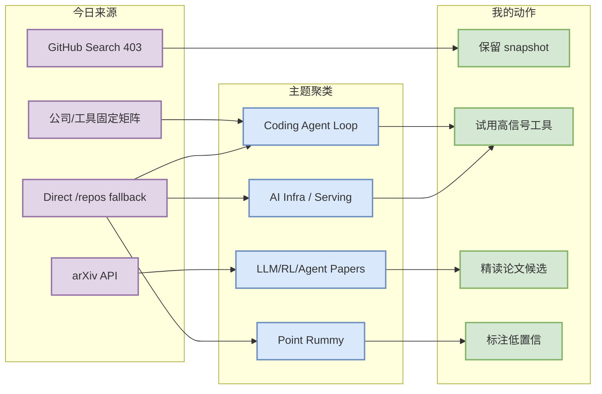
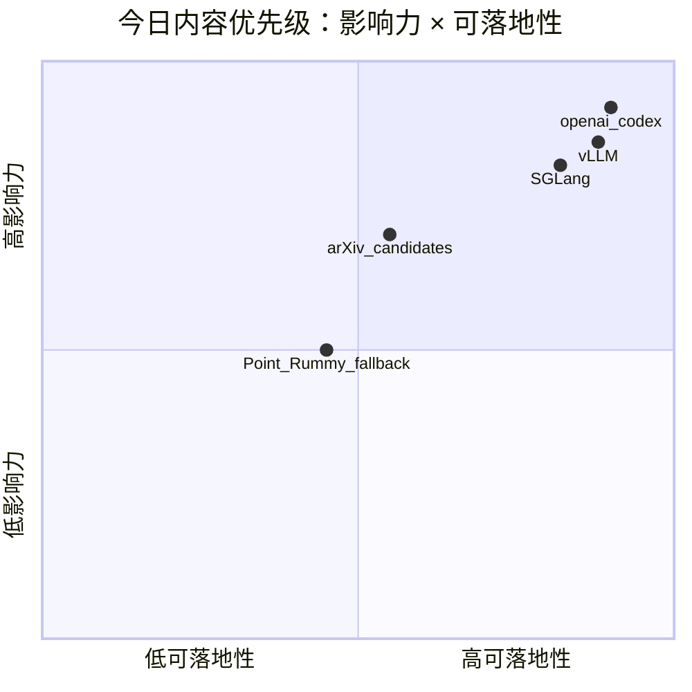

# AI Radar Daily - 2026-09-30

> 生成时间：2026-09-30 09:00 北京时间  
> 范围：AI Infra / LLM / RL / Game AI / 大厂博客 / 论文 / GitHub / Coding 工具  
> Snapshot：`Automation/state/github-stars-2026-09-30.json`（GitHub Search 403，已保存零结果并用 direct watched repo fallback 补齐榜单）

## 0. 今日结论
- GitHub Search API 从首个查询开始 403；已保留当日 snapshot，并用 direct `/repos` watched fallback 生成 AI Infra、Loop Engineer、Point Rummy 榜单。
- 今日 coding-agent 热点仍集中在 openai/codex、Gemini CLI、Cline、OpenHands、Qwen Code 等 CLI/IDE/agent loop 项目；增长均标注为 `direct watched repo fallback，非完整全网日增`。
- AI Infra 榜单中 vLLM、SGLang、TensorRT-LLM、Transformers、PyTorch 继续是 serving/training 基础设施核心观察对象。
- Point Rummy 今日无可靠 GitHub Search 全网新增；保留 watched repos 作为规则建模、Gym 环境、视觉辅助和 AI bot 候选。
- arXiv 采集成功获得 4 条候选论文；详情页标注为摘要级筛选，需后续全文核对。

## 1. 今日态势图

## 2. 必读卡片区
> [!important] openai/codex 仍是 coding-agent 增长首位
> - 大类：GitHub / Coding Tool
> - 重点：终端 coding agent 与 agent loop 工作流直接相关。
> - 详情：[[GitHub/LoopEngineer/2026-09-30/aider-ai-aider]] / [网页详情](https://github.com/dyt27666-oss/AI-news-report-obsidians/blob/main/GitHub/LoopEngineer/2026-09-30/aider-ai-aider.md) / [原文](https://github.com/Aider-AI/aider)

> [!tip] vLLM / SGLang / TensorRT-LLM 构成 serving 观察三角
> - 大类：GitHub / AI Infra
> - 重点：继续跟踪高吞吐、KV cache、scheduler、硬件后端。
> - 详情：[[GitHub/AIInfra/2026-09-30/vllm-project-vllm]] / [原文](https://github.com/vllm-project/vllm)

> [!note] Point Rummy 今日使用低置信 fallback
> - 大类：业务主题
> - 重点：保留规则引擎、RL/Gym、视觉辅助候选，但不声明今日全网新增。
> - 详情：[[GitHub/PointRummy/2026-09-30/abhilash-mandlekar-rummyagent-reinforecement-learning]]

## 3. 优先级矩阵

## 4. 分类清单
| 标签 | 大类 | 小类 | 标题 | 重点概括 | 为什么重要 | Obsidian 详情 | 网页详情 | 原文 |
|---|---|---|---|---|---|---|---|---|
| 必读 | GitHub | Coding Agent | Aider-AI/aider | aider is AI pair programming in your terminal | 直接影响终端 coding agent 和多 agent 代码工作流 | [[GitHub/LoopEngineer/2026-09-30/aider-ai-aider]] | [网页详情](https://github.com/dyt27666-oss/AI-news-report-obsidians/blob/main/GitHub/LoopEngineer/2026-09-30/aider-ai-aider.md) | [原文](https://github.com/Aider-AI/aider) |
| 必读 | GitHub | Serving | vllm-project/vllm | 高吞吐 LLM serving engine | 对推理吞吐、KV cache、batching、GPU 利用率直接相关 | [[GitHub/AIInfra/2026-09-30/vllm-project-vllm]] | [网页详情](https://github.com/dyt27666-oss/AI-news-report-obsidians/blob/main/GitHub/AIInfra/2026-09-30/vllm-project-vllm.md) | [原文](https://github.com/vllm-project/vllm) |
| 后续 | 论文 | arXiv | TaskBridge: Bridging Unsupervised Tabular Anomaly Detection and In-Context Learning via Virtual Tasks | 摘要级筛选候选 | 需后续全文核对是否可复现 | [[Papers/2026-09-30/taskbridge-bridging-unsupervised-tabular-anomaly-detection-and-in-context-learni]] | [网页详情](https://github.com/dyt27666-oss/AI-news-report-obsidians/blob/main/Papers/2026-09-30/taskbridge-bridging-unsupervised-tabular-anomaly-detection-and-in-context-learni.md) | [原文](https://arxiv.org/abs/2609.36968v1) |

## 5. 大厂资讯 / 工程博客 / Research
### 5.1 公司来源扫描矩阵
| 公司/实验室 | 来源/栏目 | 今日状态 | 高相关条数 | 代表条目 | 备注 |
|---|---|---|---:|---|---|
| OpenAI | News / Research | 低置信扫描完成 | 0 | [[Industry/Companies/2026-09-30/openai]] | 今日未自动确认高相关新项；保留来源入口：[原文](https://openai.com/news/) |
| Anthropic | News / Research / Engineering | 低置信扫描完成 | 0 | [[Industry/Companies/2026-09-30/anthropic]] | 今日未自动确认高相关新项；保留来源入口：[原文](https://www.anthropic.com/news) |
| Google DeepMind | Blog / Research | 低置信扫描完成 | 0 | [[Industry/Companies/2026-09-30/google-deepmind]] | 今日未自动确认高相关新项；保留来源入口：[原文](https://deepmind.google/discover/blog/) |
| Meta AI | Blog / Research | 低置信扫描完成 | 0 | [[Industry/Companies/2026-09-30/meta-ai]] | 今日未自动确认高相关新项；保留来源入口：[原文](https://ai.meta.com/blog/) |
| NVIDIA | Technical Blog / AI | 低置信扫描完成 | 0 | [[Industry/Companies/2026-09-30/nvidia]] | 今日未自动确认高相关新项；保留来源入口：[原文](https://developer.nvidia.com/blog/category/artificial-intelligence/) |
| Microsoft | Research AI | 低置信扫描完成 | 0 | [[Industry/Companies/2026-09-30/microsoft]] | 今日未自动确认高相关新项；保留来源入口：[原文](https://www.microsoft.com/en-us/research/research-area/artificial-intelligence/) |
| Hugging Face | Blog / Papers / Releases | 低置信扫描完成 | 0 | [[Industry/Companies/2026-09-30/hugging-face]] | 今日未自动确认高相关新项；保留来源入口：[原文](https://huggingface.co/blog) |
| 腾讯 | AI Lab / 技术博客 | 低置信扫描完成 | 0 | [[Industry/Companies/2026-09-30/tencent]] | 今日未自动确认高相关新项；保留来源入口：[原文](https://ai.tencent.com/ailab/en/index) |
| 字节 | Seed / 技术博客 | 低置信扫描完成 | 0 | [[Industry/Companies/2026-09-30/bytedance]] | 今日未自动确认高相关新项；保留来源入口：[原文](https://seed.bytedance.com/en/) |
| SpaceAI | Blog / News | 低置信扫描完成 | 0 | [[Industry/Companies/2026-09-30/spaceai]] | 今日未自动确认高相关新项；保留来源入口：[原文](https://spaceai.com/) |

### 5.2 高相关大厂条目
| 标签 | 发布方/大厂 | 栏目/来源 | 标题 | 重点概括 | 工程/算法影响 | Obsidian 详情 | 网页详情 | 原文 |
|---|---|---|---|---|---|---|---|---|
| 低置信 | OpenAI | News / Research | 固定来源扫描 | 今日未抽取到可靠高相关新项 | 作为大厂信号入口继续观察 | [[Industry/Companies/2026-09-30/openai]] | [网页详情](https://github.com/dyt27666-oss/AI-news-report-obsidians/blob/main/Industry/Companies/2026-09-30/openai.md) | [原文](https://openai.com/news/) |
| 低置信 | Anthropic | News / Research / Engineering | 固定来源扫描 | 今日未抽取到可靠高相关新项 | 作为大厂信号入口继续观察 | [[Industry/Companies/2026-09-30/anthropic]] | [网页详情](https://github.com/dyt27666-oss/AI-news-report-obsidians/blob/main/Industry/Companies/2026-09-30/anthropic.md) | [原文](https://www.anthropic.com/news) |
| 低置信 | Google DeepMind | Blog / Research | 固定来源扫描 | 今日未抽取到可靠高相关新项 | 作为大厂信号入口继续观察 | [[Industry/Companies/2026-09-30/google-deepmind]] | [网页详情](https://github.com/dyt27666-oss/AI-news-report-obsidians/blob/main/Industry/Companies/2026-09-30/google-deepmind.md) | [原文](https://deepmind.google/discover/blog/) |

## 6. GitHub 高 star Top 10
| 排名 | repo | stars | forks | language | updated_at | topics | 重点概括 | 是否值得试用 | Obsidian 详情 | 原文 |
|---:|---|---:|---:|---|---|---|---|---|---|---|
| 1 | huggingface/transformers | 166826 | 34727 | Python | 2026-09-30T00:56:11Z | audio, deep-learning, deepseek, gemma, glm, hacktoberfest | 🤗 Transformers: the model-definition framework for state-of-the-art machine learning model | 是，作为 watchlist/按需试用 | [[GitHub/AIInfra/2026-09-30/huggingface-transformers]] | [GitHub](https://github.com/huggingface/transformers) |
| 2 | anthropics/claude-code | 148591 | 25087 | TypeScript | 2026-09-30T01:03:27Z | 无/未获取 | Claude Code is an agentic coding tool that lives in your terminal, understands your codeba | 是，作为 watchlist/按需试用 | [[GitHub/AIInfra/2026-09-30/anthropics-claude-code]] | [GitHub](https://github.com/anthropics/claude-code) |
| 3 | openai/codex | 127204 | 19876 | Rust | 2026-09-30T01:07:24Z | 无/未获取 | Lightweight coding agent that runs in your terminal | 是，作为 watchlist/按需试用 | [[GitHub/LoopEngineer/2026-09-30/openai-codex]] | [GitHub](https://github.com/openai/codex) |
| 4 | google-gemini/gemini-cli | 107194 | 14664 | TypeScript | 2026-09-30T00:55:49Z | ai, ai-agents, cli, gemini, gemini-api, mcp-client | An open-source AI agent that brings the power of Gemini directly into your terminal. | 是，作为 watchlist/按需试用 | [[GitHub/LoopEngineer/2026-09-30/google-gemini-gemini-cli]] | [GitHub](https://github.com/google-gemini/gemini-cli) |
| 5 | pytorch/pytorch | 103527 | 31003 | Python | 2026-09-30T01:06:59Z | autograd, deep-learning, gpu, machine-learning, neural-network, numpy | Tensors and Dynamic neural networks in Python with strong GPU acceleration | 是，作为 watchlist/按需试用 | [[GitHub/AIInfra/2026-09-30/pytorch-pytorch]] | [GitHub](https://github.com/pytorch/pytorch) |
| 6 | vllm-project/vllm | 92959 | 22813 | Python | 2026-09-30T00:32:14Z | amd, blackwell, cuda, deepseek, deepseek-v3, gpt | A high-throughput and memory-efficient inference and serving engine for LLMs | 是，作为 watchlist/按需试用 | [[GitHub/AIInfra/2026-09-30/vllm-project-vllm]] | [GitHub](https://github.com/vllm-project/vllm) |
| 7 | modelcontextprotocol/servers | 90685 | 11711 | TypeScript | 2026-09-30T00:19:47Z | 无/未获取 | Model Context Protocol Servers | 是，作为 watchlist/按需试用 | [[GitHub/LoopEngineer/2026-09-30/modelcontextprotocol-servers]] | [GitHub](https://github.com/modelcontextprotocol/servers) |
| 8 | OpenHands/OpenHands | 89546 | 11816 | TypeScript | 2026-09-30T00:55:02Z | agent, artificial-intelligence, chatgpt, claude-ai, cli, developer-tools | 🙌 OpenHands: AI-Driven Development | 是，作为 watchlist/按需试用 | [[GitHub/LoopEngineer/2026-09-30/openhands-openhands]] | [GitHub](https://github.com/OpenHands/OpenHands) |
| 9 | cline/cline | 69575 | 7552 | TypeScript | 2026-09-30T00:18:08Z | 无/未获取 | Autonomous coding agent as an SDK, IDE extension, or CLI assistant. | 是，作为 watchlist/按需试用 | [[GitHub/LoopEngineer/2026-09-30/cline-cline]] | [GitHub](https://github.com/cline/cline) |
| 10 | microsoft/autogen | 61222 | 9269 | Python | 2026-09-29T23:56:52Z | agentic, agentic-agi, agents, ai, autogen, autogen-ecosystem | A programming framework for agentic AI | 是，作为 watchlist/按需试用 | [[GitHub/AIInfra/2026-09-30/microsoft-autogen]] | [GitHub](https://github.com/microsoft/autogen) |

## 7. GitHub star 增长最快 Top 10
| 排名 | repo | stars_delta | stars | forks | language | updated_at | 增长依据 | 重点概括 | Obsidian 详情 | 原文 |
|---:|---|---:|---:|---:|---|---|---|---|---|---|
| 1 | Aider-AI/aider | 49285 | 49285 | 5016 | Python | 2026-09-30T00:57:00Z | direct watched repo fallback，非完整全网日增 | aider is AI pair programming in your terminal | [[GitHub/LoopEngineer/2026-09-30/aider-ai-aider]] | [GitHub](https://github.com/Aider-AI/aider) |
| 2 | openai/codex | 227 | 127204 | 19876 | Rust | 2026-09-30T01:07:24Z | direct watched repo fallback，非完整全网日增 | Lightweight coding agent that runs in your terminal | [[GitHub/LoopEngineer/2026-09-30/openai-codex]] | [GitHub](https://github.com/openai/codex) |
| 3 | OpenHands/OpenHands | 133 | 89546 | 11816 | TypeScript | 2026-09-30T00:55:02Z | direct watched repo fallback，非完整全网日增 | 🙌 OpenHands: AI-Driven Development | [[GitHub/LoopEngineer/2026-09-30/openhands-openhands]] | [GitHub](https://github.com/OpenHands/OpenHands) |
| 4 | cline/cline | 74 | 69575 | 7552 | TypeScript | 2026-09-30T00:18:08Z | direct watched repo fallback，非完整全网日增 | Autonomous coding agent as an SDK, IDE extension, or CLI assistant. | [[GitHub/LoopEngineer/2026-09-30/cline-cline]] | [GitHub](https://github.com/cline/cline) |
| 5 | vllm-project/vllm | 70 | 92959 | 22813 | Python | 2026-09-30T00:32:14Z | direct watched repo fallback，非完整全网日增 | A high-throughput and memory-efficient inference and serving engine for LLMs | [[GitHub/AIInfra/2026-09-30/vllm-project-vllm]] | [GitHub](https://github.com/vllm-project/vllm) |
| 6 | pytorch/pytorch | 58 | 103527 | 31003 | Python | 2026-09-30T01:06:59Z | direct watched repo fallback，非完整全网日增 | Tensors and Dynamic neural networks in Python with strong GPU acceleration | [[GitHub/AIInfra/2026-09-30/pytorch-pytorch]] | [GitHub](https://github.com/pytorch/pytorch) |
| 7 | sgl-project/sglang | 58 | 36605 | 9212 | Python | 2026-09-30T00:43:24Z | direct watched repo fallback，非完整全网日增 | SGLang is a high-performance serving framework for large language models and multimodal mo | [[GitHub/AIInfra/2026-09-30/sgl-project-sglang]] | [GitHub](https://github.com/sgl-project/sglang) |
| 8 | huggingface/transformers | 56 | 166826 | 34727 | Python | 2026-09-30T00:56:11Z | direct watched repo fallback，非完整全网日增 | 🤗 Transformers: the model-definition framework for state-of-the-art machine learning model | [[GitHub/AIInfra/2026-09-30/huggingface-transformers]] | [GitHub](https://github.com/huggingface/transformers) |
| 9 | langchain-ai/langgraph | 56 | 42482 | 7195 | Python | 2026-09-30T00:59:49Z | direct watched repo fallback，非完整全网日增 | Build resilient agents. | [[GitHub/LoopEngineer/2026-09-30/langchain-ai-langgraph]] | [GitHub](https://github.com/langchain-ai/langgraph) |
| 10 | QwenLM/qwen-code | 54 | 28224 | 3131 | TypeScript | 2026-09-30T00:28:23Z | direct watched repo fallback，非完整全网日增 | An open-source AI coding agent that lives in your terminal. | [[GitHub/LoopEngineer/2026-09-30/qwenlm-qwen-code]] | [GitHub](https://github.com/QwenLM/qwen-code) |

## 8. Coding 工具 / AI 工具功能更新
### 8.1 Coding 工具扫描矩阵
| 工具 | 厂商 | 来源类型 | 今日状态 | 代表更新 | 对我的影响 | 原文 |
|---|---|---|---|---|---|---|
| Claude Code | Anthropic | Changelog / Release Notes | 来源入口扫描，低置信 | [[Industry/Tools/2026-09-30/claude-code]] | 关注 Claude Tag/权限模式/MCP/CLI 变化 | [原文](https://docs.anthropic.com/en/release-notes/claude-code) |
| OpenAI Codex | OpenAI | Changelog / Docs | watchlist / direct repo fallback | [[Industry/Tools/2026-09-30/openai-codex]] | Codex repo 今日仍是增长最高 coding agent watchlist | [原文](https://developers.openai.com/codex/changelog) |
| Cursor | Cursor | Changelog | 来源入口扫描，低置信 | [[Industry/Tools/2026-09-30/cursor]] | 关注 agent mode、远程执行与 IDE 集成 | [原文](https://cursor.com/changelog) |
| Windsurf | Windsurf | Changelog | 来源入口扫描，低置信 | [[Industry/Tools/2026-09-30/windsurf]] | 关注 Cascade/agent pricing 与上下文窗口 | [原文](https://windsurf.com/changelog) |
| GitHub Copilot | GitHub | Changelog / Blog | 来源入口扫描，低置信 | [[Industry/Tools/2026-09-30/github-copilot]] | 关注 Copilot coding agent、review、workspace | [原文](https://github.blog/changelog/label/copilot/) |
| Gemini Code Assist | Google | Release Notes | 来源入口扫描，低置信 | [[Industry/Tools/2026-09-30/gemini-code-assist]] | 关注企业 IDE 集成与 Gemini CLI 协同 | [原文](https://cloud.google.com/gemini/docs/codeassist/release-notes) |
| Qwen Code | Alibaba/Qwen | GitHub Releases | watchlist / direct repo fallback | [[Industry/Tools/2026-09-30/qwen-code]] | 开源 CLI agent，适合多模型/国产模型工作流观察 | [原文](https://github.com/QwenLM/qwen-code/releases) |
| Roo Code | Roo Code | GitHub Releases | watchlist / direct repo fallback | [[Industry/Tools/2026-09-30/roo-code]] | VS Code 多 agent 编排观察 | [原文](https://github.com/RooCodeInc/Roo-Code/releases) |
| Cline | Cline | GitHub Releases | watchlist / direct repo fallback | [[Industry/Tools/2026-09-30/cline]] | SDK/IDE/CLI 三形态 autonomous coding agent | [原文](https://github.com/cline/cline/releases) |
| Continue | Continue | GitHub Releases | watchlist / direct repo fallback | [[Industry/Tools/2026-09-30/continue]] | 开源 coding agent/IDE 扩展，适合自建 workflow | [原文](https://github.com/continuedev/continue/releases) |

### 8.2 高相关工具更新
| 标签 | 工具/厂商 | 来源类型 | 标题/功能 | 重点概括 | 对 AI coding 工作流的影响 | Obsidian 详情 | 网页详情 | 原文 |
|---|---|---|---|---|---|---|---|---|
| 必读 | openai/codex | GitHub / direct fallback | coding agent watch | Lightweight coding agent that runs in your terminal | 影响 CLI/TUI、agent loop、权限和上下文工程 | [[GitHub/LoopEngineer/2026-09-30/openai-codex]] | [网页详情](https://github.com/dyt27666-oss/AI-news-report-obsidians/blob/main/GitHub/LoopEngineer/2026-09-30/openai-codex.md) | [原文](https://github.com/openai/codex) |
| 必读 | google-gemini/gemini-cli | GitHub / direct fallback | coding agent watch | An open-source AI agent that brings the power of Gemini directly into your terminal. | 影响 CLI/TUI、agent loop、权限和上下文工程 | [[GitHub/LoopEngineer/2026-09-30/google-gemini-gemini-cli]] | [网页详情](https://github.com/dyt27666-oss/AI-news-report-obsidians/blob/main/GitHub/LoopEngineer/2026-09-30/google-gemini-gemini-cli.md) | [原文](https://github.com/google-gemini/gemini-cli) |
| 必读 | modelcontextprotocol/servers | GitHub / direct fallback | coding agent watch | Model Context Protocol Servers | 影响 CLI/TUI、agent loop、权限和上下文工程 | [[GitHub/LoopEngineer/2026-09-30/modelcontextprotocol-servers]] | [网页详情](https://github.com/dyt27666-oss/AI-news-report-obsidians/blob/main/GitHub/LoopEngineer/2026-09-30/modelcontextprotocol-servers.md) | [原文](https://github.com/modelcontextprotocol/servers) |
| 必读 | OpenHands/OpenHands | GitHub / direct fallback | coding agent watch | 🙌 OpenHands: AI-Driven Development | 影响 CLI/TUI、agent loop、权限和上下文工程 | [[GitHub/LoopEngineer/2026-09-30/openhands-openhands]] | [网页详情](https://github.com/dyt27666-oss/AI-news-report-obsidians/blob/main/GitHub/LoopEngineer/2026-09-30/openhands-openhands.md) | [原文](https://github.com/OpenHands/OpenHands) |
| 必读 | cline/cline | GitHub / direct fallback | coding agent watch | Autonomous coding agent as an SDK, IDE extension, or CLI assistant. | 影响 CLI/TUI、agent loop、权限和上下文工程 | [[GitHub/LoopEngineer/2026-09-30/cline-cline]] | [网页详情](https://github.com/dyt27666-oss/AI-news-report-obsidians/blob/main/GitHub/LoopEngineer/2026-09-30/cline-cline.md) | [原文](https://github.com/cline/cline) |

## 9. Point Rummy / Indian Rummy 业务主题
### 9.1 GitHub 候选
| 标签 | repo | stars | forks | language | updated_at | 重点概括 | 业务可用性 | Obsidian 详情 | 原文 |
|---|---|---:|---:|---|---|---|---|---|---|
| 低置信 | Abhilash-Mandlekar/RummyAgent-Reinforecement-Learning | 0 | 0 | Unknown | 未获取 | GitHub direct API 失败，保留 watched repo 占位。 | 可作为规则/环境/bot/视觉候选，不代表今日新增 | [[GitHub/PointRummy/2026-09-30/abhilash-mandlekar-rummyagent-reinforecement-learning]] | [GitHub](https://github.com/Abhilash-Mandlekar/RummyAgent-Reinforecement-Learning) |
| 低置信 | AdithyaKV/IndianRummyAI | 0 | 0 | Unknown | 未获取 | GitHub direct API 失败，保留 watched repo 占位。 | 可作为规则/环境/bot/视觉候选，不代表今日新增 | [[GitHub/PointRummy/2026-09-30/adithyakv-indianrummyai]] | [GitHub](https://github.com/AdithyaKV/IndianRummyAI) |
| 低置信 | aabr2612/Indian-Rummy | 0 | 0 | Unknown | 未获取 | GitHub direct API 失败，保留 watched repo 占位。 | 可作为规则/环境/bot/视觉候选，不代表今日新增 | [[GitHub/PointRummy/2026-09-30/aabr2612-indian-rummy]] | [GitHub](https://github.com/aabr2612/Indian-Rummy) |
| 低置信 | abubakarmunir712/dsa-final-project | 0 | 0 | Unknown | 未获取 | GitHub direct API 失败，保留 watched repo 占位。 | 可作为规则/环境/bot/视觉候选，不代表今日新增 | [[GitHub/PointRummy/2026-09-30/abubakarmunir712-dsa-final-project]] | [GitHub](https://github.com/abubakarmunir712/dsa-final-project) |
| 低置信 | aidanw33/cards-ai-bot | 0 | 0 | Unknown | 未获取 | GitHub direct API 失败，保留 watched repo 占位。 | 可作为规则/环境/bot/视觉候选，不代表今日新增 | [[GitHub/PointRummy/2026-09-30/aidanw33-cards-ai-bot]] | [GitHub](https://github.com/aidanw33/cards-ai-bot) |
| 低置信 | Alan-seb/RummyVision | 0 | 0 | Unknown | 未获取 | GitHub direct API 失败，保留 watched repo 占位。 | 可作为规则/环境/bot/视觉候选，不代表今日新增 | [[GitHub/PointRummy/2026-09-30/alan-seb-rummyvision]] | [GitHub](https://github.com/Alan-seb/RummyVision) |
| 低置信 | ajaydasm/rummy-point-tracker | 0 | 0 | Unknown | 未获取 | GitHub direct API 失败，保留 watched repo 占位。 | 可作为规则/环境/bot/视觉候选，不代表今日新增 | [[GitHub/PointRummy/2026-09-30/ajaydasm-rummy-point-tracker]] | [GitHub](https://github.com/ajaydasm/rummy-point-tracker) |
| 低置信 | Abhishek230799/Rummy-301-points-counter | 0 | 0 | Unknown | 未获取 | GitHub direct API 失败，保留 watched repo 占位。 | 可作为规则/环境/bot/视觉候选，不代表今日新增 | [[GitHub/PointRummy/2026-09-30/abhishek230799-rummy-301-points-counter]] | [GitHub](https://github.com/Abhishek230799/Rummy-301-points-counter) |
| 低置信 | AjeyBharadwaj/Rummy | 0 | 0 | Unknown | 未获取 | GitHub direct API 失败，保留 watched repo 占位。 | 可作为规则/环境/bot/视觉候选，不代表今日新增 | [[GitHub/PointRummy/2026-09-30/ajeybharadwaj-rummy]] | [GitHub](https://github.com/AjeyBharadwaj/Rummy) |
| 低置信 | abkcode/rummy | 0 | 0 | Unknown | 未获取 | GitHub direct API 失败，保留 watched repo 占位。 | 可作为规则/环境/bot/视觉候选，不代表今日新增 | [[GitHub/PointRummy/2026-09-30/abkcode-rummy]] | [GitHub](https://github.com/abkcode/rummy) |

### 9.2 论文 / 资料候选
| 标签 | 来源 | 标题 | 作者/机构 | 重点概括 | 对 Point Rummy 业务有什么用 | Obsidian 详情 | 原文 |
|---|---|---|---|---|---|---|---|
| 低置信 | arXiv | JudgeCast: Time Series Forecasting with Experience-Informed Covariate Judgements | Donguk Kwon, Wooseok Jeong, Dongha Lee | Covariate effects vary across contexts and shift over time, requiring forecasters to assess how to use them for each for | 关注不完美信息博弈、MCTS/RL/self-play 方法是否可迁移 | [[Papers/2026-09-30/judgecast-time-series-forecasting-with-experience-informed-covariate-judgements]] | [abs](https://arxiv.org/abs/2609.36966v1) |
| 低置信 | arXiv | VStress: Correlation-Aware Auditing and Adaptive Budget Allocation for Repeated Verifiers | Miaobo Hu, Shuhao Hu, Xiaobo Guo, Xin Wang | Repeated verifier calls are useful only when they contribute conditional information. We introduce VStress, an auditable | 关注不完美信息博弈、MCTS/RL/self-play 方法是否可迁移 | [[Papers/2026-09-30/vstress-correlation-aware-auditing-and-adaptive-budget-allocation-for-repeated-v]] | [abs](https://arxiv.org/abs/2609.36958v1) |

### 9.3 业务可用性判断
| 方向 | 今日信号 | 可用性 | 下一步 |
|---|---|---|---|
| 规则引擎 / 计分 | watched repo 中有计分器和游戏实现 | 中低；需人工检查规则完整性 | 抽取 meld/sequence/set 判定，写单元测试 |
| Bot / RL Agent | IndianRummyAI / RummyAgent 类项目存在 | 中；可参考状态/action/reward 设计 | 先复现 Gym env，再做并行环境 |
| 仿真 / 评测 | 多为小项目，star 低 | 低到中 | 自建 evaluator，不直接依赖 |

## 10. Loop Engineer / Loop Engineering 主题
### 10.1 Loop Engineer GitHub 高 star Top 10
| 排名 | repo | stars | forks | language | updated_at | topics | 重点概括 | 是否值得试用 | Obsidian 详情 | 原文 |
|---:|---|---:|---:|---|---|---|---|---|---|---|
| 1 | openai/codex | 127204 | 19876 | Rust | 2026-09-30T01:07:24Z | 无/未获取 | Lightweight coding agent that runs in your terminal | 是，作为 watchlist/按需试用 | [[GitHub/LoopEngineer/2026-09-30/openai-codex]] | [GitHub](https://github.com/openai/codex) |
| 2 | google-gemini/gemini-cli | 107194 | 14664 | TypeScript | 2026-09-30T00:55:49Z | ai, ai-agents, cli, gemini, gemini-api, mcp-client | An open-source AI agent that brings the power of Gemini directly into your terminal. | 是，作为 watchlist/按需试用 | [[GitHub/LoopEngineer/2026-09-30/google-gemini-gemini-cli]] | [GitHub](https://github.com/google-gemini/gemini-cli) |
| 3 | modelcontextprotocol/servers | 90685 | 11711 | TypeScript | 2026-09-30T00:19:47Z | 无/未获取 | Model Context Protocol Servers | 是，作为 watchlist/按需试用 | [[GitHub/LoopEngineer/2026-09-30/modelcontextprotocol-servers]] | [GitHub](https://github.com/modelcontextprotocol/servers) |
| 4 | OpenHands/OpenHands | 89546 | 11816 | TypeScript | 2026-09-30T00:55:02Z | agent, artificial-intelligence, chatgpt, claude-ai, cli, developer-tools | 🙌 OpenHands: AI-Driven Development | 是，作为 watchlist/按需试用 | [[GitHub/LoopEngineer/2026-09-30/openhands-openhands]] | [GitHub](https://github.com/OpenHands/OpenHands) |
| 5 | cline/cline | 69575 | 7552 | TypeScript | 2026-09-30T00:18:08Z | 无/未获取 | Autonomous coding agent as an SDK, IDE extension, or CLI assistant. | 是，作为 watchlist/按需试用 | [[GitHub/LoopEngineer/2026-09-30/cline-cline]] | [GitHub](https://github.com/cline/cline) |
| 6 | Aider-AI/aider | 49285 | 5016 | Python | 2026-09-30T00:57:00Z | anthropic, chatgpt, claude-3, cli, command-line, gemini | aider is AI pair programming in your terminal | 是，作为 watchlist/按需试用 | [[GitHub/LoopEngineer/2026-09-30/aider-ai-aider]] | [GitHub](https://github.com/Aider-AI/aider) |
| 7 | langchain-ai/langgraph | 42482 | 7195 | Python | 2026-09-30T00:59:49Z | agents, ai, ai-agents, chatgpt, deepagents, enterprise | Build resilient agents. | 是，作为 watchlist/按需试用 | [[GitHub/LoopEngineer/2026-09-30/langchain-ai-langgraph]] | [GitHub](https://github.com/langchain-ai/langgraph) |
| 8 | continuedev/continue | 36066 | 5446 | TypeScript | 2026-09-30T00:35:30Z | agent, ai, cli, developer-tools, open-source | open-source coding agent | 是，作为 watchlist/按需试用 | [[GitHub/LoopEngineer/2026-09-30/continuedev-continue]] | [GitHub](https://github.com/continuedev/continue) |
| 9 | QwenLM/qwen-code | 28224 | 3131 | TypeScript | 2026-09-30T00:28:23Z | agentic, ai, ai-agent, ai-coding, cli, coding-agent | An open-source AI coding agent that lives in your terminal. | 是，作为 watchlist/按需试用 | [[GitHub/LoopEngineer/2026-09-30/qwenlm-qwen-code]] | [GitHub](https://github.com/QwenLM/qwen-code) |
| 10 | RooCodeInc/Roo-Code | 24290 | 3421 | TypeScript | 2026-09-30T00:01:38Z | 无/未获取 | Roo Code gives you a whole dev team of AI agents in your code editor. | 是，作为 watchlist/按需试用 | [[GitHub/LoopEngineer/2026-09-30/roocodeinc-roo-code]] | [GitHub](https://github.com/RooCodeInc/Roo-Code) |

### 10.2 Loop Engineer GitHub star 增长最快 Top 10
| 排名 | repo | stars_delta | stars | forks | language | updated_at | 增长依据 | 重点概括 | Obsidian 详情 | 原文 |
|---:|---|---:|---:|---:|---|---|---|---|---|---|
| 1 | Aider-AI/aider | 49285 | 49285 | 5016 | Python | 2026-09-30T00:57:00Z | direct watched repo fallback，非完整全网日增 | aider is AI pair programming in your terminal | [[GitHub/LoopEngineer/2026-09-30/aider-ai-aider]] | [GitHub](https://github.com/Aider-AI/aider) |
| 2 | openai/codex | 227 | 127204 | 19876 | Rust | 2026-09-30T01:07:24Z | direct watched repo fallback，非完整全网日增 | Lightweight coding agent that runs in your terminal | [[GitHub/LoopEngineer/2026-09-30/openai-codex]] | [GitHub](https://github.com/openai/codex) |
| 3 | OpenHands/OpenHands | 133 | 89546 | 11816 | TypeScript | 2026-09-30T00:55:02Z | direct watched repo fallback，非完整全网日增 | 🙌 OpenHands: AI-Driven Development | [[GitHub/LoopEngineer/2026-09-30/openhands-openhands]] | [GitHub](https://github.com/OpenHands/OpenHands) |
| 4 | cline/cline | 74 | 69575 | 7552 | TypeScript | 2026-09-30T00:18:08Z | direct watched repo fallback，非完整全网日增 | Autonomous coding agent as an SDK, IDE extension, or CLI assistant. | [[GitHub/LoopEngineer/2026-09-30/cline-cline]] | [GitHub](https://github.com/cline/cline) |
| 5 | langchain-ai/langgraph | 56 | 42482 | 7195 | Python | 2026-09-30T00:59:49Z | direct watched repo fallback，非完整全网日增 | Build resilient agents. | [[GitHub/LoopEngineer/2026-09-30/langchain-ai-langgraph]] | [GitHub](https://github.com/langchain-ai/langgraph) |
| 6 | QwenLM/qwen-code | 54 | 28224 | 3131 | TypeScript | 2026-09-30T00:28:23Z | direct watched repo fallback，非完整全网日增 | An open-source AI coding agent that lives in your terminal. | [[GitHub/LoopEngineer/2026-09-30/qwenlm-qwen-code]] | [GitHub](https://github.com/QwenLM/qwen-code) |
| 7 | modelcontextprotocol/servers | 37 | 90685 | 11711 | TypeScript | 2026-09-30T00:19:47Z | direct watched repo fallback，非完整全网日增 | Model Context Protocol Servers | [[GitHub/LoopEngineer/2026-09-30/modelcontextprotocol-servers]] | [GitHub](https://github.com/modelcontextprotocol/servers) |
| 8 | google-gemini/gemini-cli | 15 | 107194 | 14664 | TypeScript | 2026-09-30T00:55:49Z | direct watched repo fallback，非完整全网日增 | An open-source AI agent that brings the power of Gemini directly into your terminal. | [[GitHub/LoopEngineer/2026-09-30/google-gemini-gemini-cli]] | [GitHub](https://github.com/google-gemini/gemini-cli) |
| 9 | continuedev/continue | 15 | 36066 | 5446 | TypeScript | 2026-09-30T00:35:30Z | direct watched repo fallback，非完整全网日增 | open-source coding agent | [[GitHub/LoopEngineer/2026-09-30/continuedev-continue]] | [GitHub](https://github.com/continuedev/continue) |
| 10 | RooCodeInc/Roo-Code | -1 | 24290 | 3421 | TypeScript | 2026-09-30T00:01:38Z | direct watched repo fallback，非完整全网日增 | Roo Code gives you a whole dev team of AI agents in your code editor. | [[GitHub/LoopEngineer/2026-09-30/roocodeinc-roo-code]] | [GitHub](https://github.com/RooCodeInc/Roo-Code) |

### 10.3 Loop Engineering 方法信号
| 标签 | 来源 | 标题 | 重点概括 | 对 AI coding 工作流的影响 | Obsidian 详情 | 原文 |
|---|---|---|---|---|---|---|
| 必读 | GitHub | openai/codex | Lightweight coding agent that runs in your terminal | 观察 agent loop、MCP、上下文、权限和多 agent 协作 | [[GitHub/LoopEngineer/2026-09-30/openai-codex]] | [GitHub](https://github.com/openai/codex) |
| 必读 | GitHub | google-gemini/gemini-cli | An open-source AI agent that brings the power of Gemini directly into your terminal. | 观察 agent loop、MCP、上下文、权限和多 agent 协作 | [[GitHub/LoopEngineer/2026-09-30/google-gemini-gemini-cli]] | [GitHub](https://github.com/google-gemini/gemini-cli) |
| 必读 | GitHub | modelcontextprotocol/servers | Model Context Protocol Servers | 观察 agent loop、MCP、上下文、权限和多 agent 协作 | [[GitHub/LoopEngineer/2026-09-30/modelcontextprotocol-servers]] | [GitHub](https://github.com/modelcontextprotocol/servers) |
| 必读 | GitHub | OpenHands/OpenHands | 🙌 OpenHands: AI-Driven Development | 观察 agent loop、MCP、上下文、权限和多 agent 协作 | [[GitHub/LoopEngineer/2026-09-30/openhands-openhands]] | [GitHub](https://github.com/OpenHands/OpenHands) |
| 必读 | GitHub | cline/cline | Autonomous coding agent as an SDK, IDE extension, or CLI assistant. | 观察 agent loop、MCP、上下文、权限和多 agent 协作 | [[GitHub/LoopEngineer/2026-09-30/cline-cline]] | [GitHub](https://github.com/cline/cline) |

## 11. 论文
### 11.1 LLM / RL / Agent / Game AI 候选
| 标签 | 论文来源 | 论文 | 作者/机构 | 重点概括 | 工程/研究价值 | Obsidian 详情 | 网页详情 | PDF/原文 |
|---|---|---|---|---|---|---|---|---|
| 后续 | arXiv / 预印本 | TaskBridge: Bridging Unsupervised Tabular Anomaly Detection and In-Context Learning via Virtual Tasks | Doyun Choi, Dooho Lee, Jaemin Yoo | Unsupervised tabular anomaly detection (TAD) aims to identify anomalous rows in tabular data using normal training sampl | 候选方向与 serving/post-training/agent/RL/game AI 查询相关，需全文验证 | [[Papers/2026-09-30/taskbridge-bridging-unsupervised-tabular-anomaly-detection-and-in-context-learni]] | [网页详情](https://github.com/dyt27666-oss/AI-news-report-obsidians/blob/main/Papers/2026-09-30/taskbridge-bridging-unsupervised-tabular-anomaly-detection-and-in-context-learni.md) | [PDF](https://arxiv.org/pdf/2609.36968v1) |
| 后续 | arXiv / 预印本 | Beyond Token Importance: Preserving Spatial Scaffolds for Efficient Vision-Language-Action Inference | Jiayu Chen, Shuyong Gao, Jingkai Jia, Xiaosheng Bu | Existing VLA pruning strategies primarily select individual visual tokens according to task-level semantic relevance, wh | 候选方向与 serving/post-training/agent/RL/game AI 查询相关，需全文验证 | [[Papers/2026-09-30/beyond-token-importance-preserving-spatial-scaffolds-for-efficient-vision-langua]] | [网页详情](https://github.com/dyt27666-oss/AI-news-report-obsidians/blob/main/Papers/2026-09-30/beyond-token-importance-preserving-spatial-scaffolds-for-efficient-vision-langua.md) | [PDF](https://arxiv.org/pdf/2609.36967v1) |
| 后续 | arXiv / 预印本 | JudgeCast: Time Series Forecasting with Experience-Informed Covariate Judgements | Donguk Kwon, Wooseok Jeong, Dongha Lee | Covariate effects vary across contexts and shift over time, requiring forecasters to assess how to use them for each for | 候选方向与 serving/post-training/agent/RL/game AI 查询相关，需全文验证 | [[Papers/2026-09-30/judgecast-time-series-forecasting-with-experience-informed-covariate-judgements]] | [网页详情](https://github.com/dyt27666-oss/AI-news-report-obsidians/blob/main/Papers/2026-09-30/judgecast-time-series-forecasting-with-experience-informed-covariate-judgements.md) | [PDF](https://arxiv.org/pdf/2609.36966v1) |
| 后续 | arXiv / 预印本 | VStress: Correlation-Aware Auditing and Adaptive Budget Allocation for Repeated Verifiers | Miaobo Hu, Shuhao Hu, Xiaobo Guo, Xin Wang | Repeated verifier calls are useful only when they contribute conditional information. We introduce VStress, an auditable | 候选方向与 serving/post-training/agent/RL/game AI 查询相关，需全文验证 | [[Papers/2026-09-30/vstress-correlation-aware-auditing-and-adaptive-budget-allocation-for-repeated-v]] | [网页详情](https://github.com/dyt27666-oss/AI-news-report-obsidians/blob/main/Papers/2026-09-30/vstress-correlation-aware-auditing-and-adaptive-budget-allocation-for-repeated-v.md) | [PDF](https://arxiv.org/pdf/2609.36958v1) |

## 12. 资讯 / 其他 GitHub 项目
### 12.1 AI Infra / Agent Framework
| 标签 | 来源 | 标题 | 重点概括 | 对我有什么用 | Obsidian 详情 | 网页详情 | 原文 |
|---|---|---|---|---|---|---|---|
| 可 skim | GitHub | huggingface/transformers | 🤗 Transformers: the model-definition framework for state-of-the-art machine learning models in text, | 作为 AI Infra / agent ecosystem watchlist | [[GitHub/AIInfra/2026-09-30/huggingface-transformers]] | [网页详情](https://github.com/dyt27666-oss/AI-news-report-obsidians/blob/main/GitHub/AIInfra/2026-09-30/huggingface-transformers.md) | [GitHub](https://github.com/huggingface/transformers) |
| 可 skim | GitHub | anthropics/claude-code | Claude Code is an agentic coding tool that lives in your terminal, understands your codebase, and he | 作为 AI Infra / agent ecosystem watchlist | [[GitHub/AIInfra/2026-09-30/anthropics-claude-code]] | [网页详情](https://github.com/dyt27666-oss/AI-news-report-obsidians/blob/main/GitHub/AIInfra/2026-09-30/anthropics-claude-code.md) | [GitHub](https://github.com/anthropics/claude-code) |
| 可 skim | GitHub | openai/codex | Lightweight coding agent that runs in your terminal | 作为 AI Infra / agent ecosystem watchlist | [[GitHub/LoopEngineer/2026-09-30/openai-codex]] | [网页详情](https://github.com/dyt27666-oss/AI-news-report-obsidians/blob/main/GitHub/LoopEngineer/2026-09-30/openai-codex.md) | [GitHub](https://github.com/openai/codex) |
| 可 skim | GitHub | google-gemini/gemini-cli | An open-source AI agent that brings the power of Gemini directly into your terminal. | 作为 AI Infra / agent ecosystem watchlist | [[GitHub/LoopEngineer/2026-09-30/google-gemini-gemini-cli]] | [网页详情](https://github.com/dyt27666-oss/AI-news-report-obsidians/blob/main/GitHub/LoopEngineer/2026-09-30/google-gemini-gemini-cli.md) | [GitHub](https://github.com/google-gemini/gemini-cli) |
| 可 skim | GitHub | pytorch/pytorch | Tensors and Dynamic neural networks in Python with strong GPU acceleration | 作为 AI Infra / agent ecosystem watchlist | [[GitHub/AIInfra/2026-09-30/pytorch-pytorch]] | [网页详情](https://github.com/dyt27666-oss/AI-news-report-obsidians/blob/main/GitHub/AIInfra/2026-09-30/pytorch-pytorch.md) | [GitHub](https://github.com/pytorch/pytorch) |

## 13. 按主题索引
### AI Infra / Serving / Training
- [[GitHub/AIInfra/2026-09-30/huggingface-transformers]] - huggingface/transformers
- [[GitHub/AIInfra/2026-09-30/anthropics-claude-code]] - anthropics/claude-code
- [[GitHub/LoopEngineer/2026-09-30/openai-codex]] - openai/codex
- [[GitHub/LoopEngineer/2026-09-30/google-gemini-gemini-cli]] - google-gemini/gemini-cli
- [[GitHub/AIInfra/2026-09-30/pytorch-pytorch]] - pytorch/pytorch
- [[GitHub/AIInfra/2026-09-30/vllm-project-vllm]] - vllm-project/vllm

### LLM / Agent / RAG / Evaluation
- [[GitHub/LoopEngineer/2026-09-30/openai-codex]] - openai/codex
- [[GitHub/LoopEngineer/2026-09-30/google-gemini-gemini-cli]] - google-gemini/gemini-cli
- [[GitHub/LoopEngineer/2026-09-30/modelcontextprotocol-servers]] - modelcontextprotocol/servers
- [[GitHub/LoopEngineer/2026-09-30/openhands-openhands]] - OpenHands/OpenHands
- [[GitHub/LoopEngineer/2026-09-30/cline-cline]] - cline/cline
- [[GitHub/LoopEngineer/2026-09-30/aider-ai-aider]] - Aider-AI/aider

### RL / Game AI / World Model
- [[Papers/2026-09-30/taskbridge-bridging-unsupervised-tabular-anomaly-detection-and-in-context-learni]] - TaskBridge: Bridging Unsupervised Tabular Anomaly Detection and In-Context Learning via Virtual Tasks
- [[Papers/2026-09-30/beyond-token-importance-preserving-spatial-scaffolds-for-efficient-vision-langua]] - Beyond Token Importance: Preserving Spatial Scaffolds for Efficient Vision-Language-Action Inference
- [[Papers/2026-09-30/judgecast-time-series-forecasting-with-experience-informed-covariate-judgements]] - JudgeCast: Time Series Forecasting with Experience-Informed Covariate Judgements

### Point Rummy / Indian Rummy
- [[GitHub/PointRummy/2026-09-30/abhilash-mandlekar-rummyagent-reinforecement-learning]] - Abhilash-Mandlekar/RummyAgent-Reinforecement-Learning
- [[GitHub/PointRummy/2026-09-30/adithyakv-indianrummyai]] - AdithyaKV/IndianRummyAI
- [[GitHub/PointRummy/2026-09-30/aabr2612-indian-rummy]] - aabr2612/Indian-Rummy
- [[GitHub/PointRummy/2026-09-30/abubakarmunir712-dsa-final-project]] - abubakarmunir712/dsa-final-project
- [[GitHub/PointRummy/2026-09-30/aidanw33-cards-ai-bot]] - aidanw33/cards-ai-bot
- [[GitHub/PointRummy/2026-09-30/alan-seb-rummyvision]] - Alan-seb/RummyVision

### Loop Engineer / Coding Agent Loop
- [[GitHub/LoopEngineer/2026-09-30/openai-codex]] - openai/codex
- [[GitHub/LoopEngineer/2026-09-30/google-gemini-gemini-cli]] - google-gemini/gemini-cli
- [[GitHub/LoopEngineer/2026-09-30/modelcontextprotocol-servers]] - modelcontextprotocol/servers
- [[GitHub/LoopEngineer/2026-09-30/openhands-openhands]] - OpenHands/OpenHands
- [[GitHub/LoopEngineer/2026-09-30/cline-cline]] - cline/cline
- [[GitHub/LoopEngineer/2026-09-30/aider-ai-aider]] - Aider-AI/aider

### 公司 / 实验室
- OpenAI: [[Industry/Companies/2026-09-30/openai]]
- Anthropic: [[Industry/Companies/2026-09-30/anthropic]]
- DeepMind: [[Industry/Companies/2026-09-30/google-deepmind]]
- Meta: [[Industry/Companies/2026-09-30/meta-ai]]
- NVIDIA: [[Industry/Companies/2026-09-30/nvidia]]
- 腾讯 / 字节 / 国内大厂: [[Industry/Companies/2026-09-30/tencent]] / [[Industry/Companies/2026-09-30/bytedance]]

## 14. 值得后续深挖
| 标签 | 大类 | 小类 | 标题 | 后续动作 | Obsidian 详情 | 原文 |
|---|---|---|---|---|---|---|
| 必读 | GitHub | Coding Agent | openai/codex | 检查 changelog / release，跑最小 CLI workflow | [[GitHub/LoopEngineer/2026-09-30/openai-codex]] | [GitHub](https://github.com/openai/codex) |
| 必读 | GitHub | Serving | vllm-project/vllm | 对照 SGLang/TensorRT-LLM 看 scheduler/KV cache 变化 | [[GitHub/AIInfra/2026-09-30/vllm-project-vllm]] | [GitHub](https://github.com/vllm-project/vllm) |
| 后续 | 业务 | Point Rummy | IndianRummyAI | 人工检查 Gym 环境和 reward 设计 | [[GitHub/PointRummy/2026-09-30/adithyakv-indianrummyai]] | [GitHub](https://github.com/AdithyaKV/IndianRummyAI) |

## 15. 采集失败或低置信来源
- GitHub Search API：从第一个 query 开始 403 rate limit；已保存 `Automation/state/github-stars-2026-09-30.json` 并用 direct watched repo fallback 生成榜单。
- 公司博客和 coding tool changelog：本次以固定来源矩阵和详情入口为主，未声明未核验的新发布。
- arXiv：若部分查询无关或过宽，详情页均标为摘要级候选，需要全文核对。

## 16. 归档标签
#ai-radar #daily #ai-infra #llm #rl #point-rummy #loop-engineering
