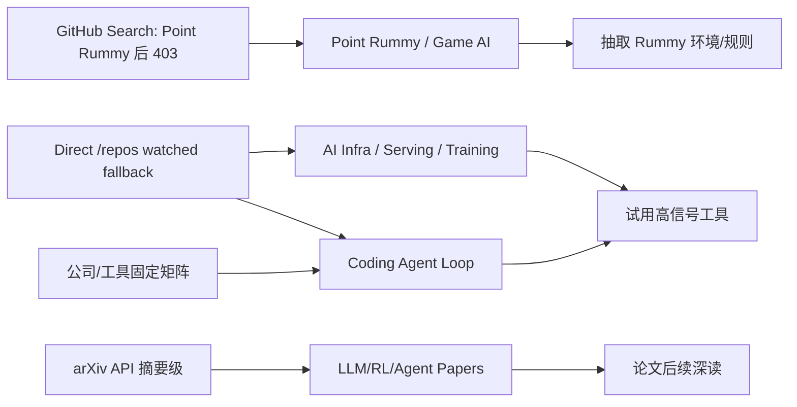
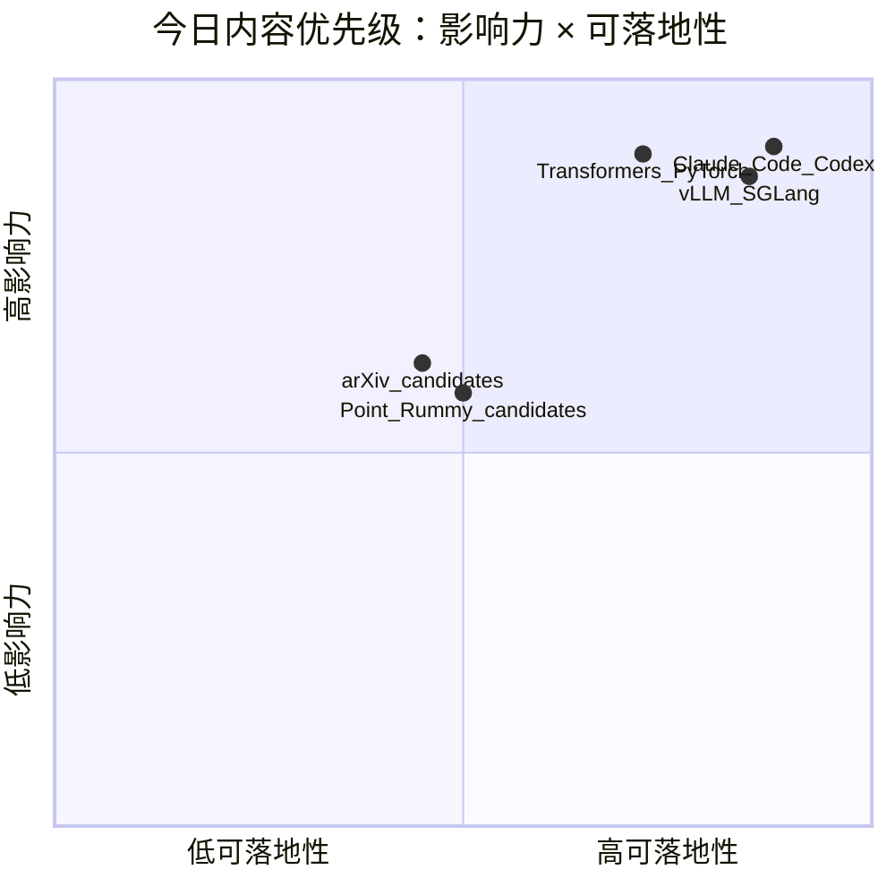

# AI Radar Daily - 2026-10-02

> 生成时间：2026-10-02 09:00 北京时间  
> 范围：AI Infra / LLM / RL / Game AI / 大厂博客 / 论文 / GitHub / Coding 工具  
> Snapshot：`Automation/state/github-stars-2026-10-02.json`（GitHub Search 早期捕获 Point Rummy 后大量 403；已保存并用 direct watched repo fallback 补齐 AI Infra / Loop Engineer 固定榜单）

## 0. 今日结论
- GitHub Search 今日在 Point Rummy 主题查询后开始大量 403；已保存 `Automation/state/github-stars-2026-10-02.json`，并用 direct `/repos` watched fallback 补齐 AI Infra 与 Loop Engineer Top 10。
- 今日最值得看：`anthropics/claude-code`、`openai/codex`、`huggingface/transformers`、`vllm-project/vllm`、`sgl-project/sglang`；所有 broad/Loop 增长都标注为 direct watched repo fallback，非完整全网日增。
- Point Rummy 今天有低 star 候选池；优先抽取规则引擎、Gym/env、ISMCTS/MCTS、仿真评测抽象。
- Coding 工具扫描矩阵已覆盖 Claude Code、OpenAI Codex、Cursor、Windsurf、GitHub Copilot、Gemini Code Assist、Qwen Code、Roo Code、Cline、Continue。

## 1. 今日态势图

## 2. 必读卡片区
> [!important] Claude Code / Codex / Gemini CLI 仍是 Loop Engineer 主线
> - 重点：CLI/TUI、agent loop、MCP、权限边界和上下文窗口仍是 AI coding workflow 的核心变量。
> - 详情：[[GitHub/LoopEngineer/2026-10-02/anthropics-claude-code]] / [原文](https://github.com/anthropics/claude-code)

> [!tip] vLLM / SGLang / TensorRT-LLM / DeepSpeed 继续构成 serving-training 观察集
> - 重点：watched repo fallback 保持基础设施榜单连续性。
> - 详情：[[GitHub/AIInfra/2026-10-02/vllm-project-vllm]]

> [!note] Point Rummy 今日是低置信工程候选池
> - 重点：优先抽取规则、计分、env、ISMCTS/MCTS、RL simulator；不要把低 star repo 当生产依赖。
> - 详情：[[Business/PointRummy/2026-10-02/low-confidence-watchlist]]

## 3. 优先级矩阵

## 4. 分类清单
| 标签 | 大类 | 小类 | 标题 | 重点概括 | 为什么重要 | Obsidian 详情 | 网页详情 | 原文 |
|---|---|---|---|---|---|---|---|---|
| 必读 | GitHub | AIInfra/Loop | huggingface/transformers | 🤗 Transformers: the model-definition framework for state-of-the-art machine learning models in text,… | 固定 watched repo fallback 下仍是高信号项目，适合检查 release/README。 | [[GitHub/AIInfra/2026-10-02/huggingface-transformers]] | [网页详情](https://github.com/dyt27666-oss/AI-news-report-obsidians/blob/main/GitHub/AIInfra/2026-10-02/huggingface-transformers.md) | [原文](https://github.com/huggingface/transformers) |
| 必读 | GitHub | AIInfra/Loop | anthropics/claude-code | Claude Code is an agentic coding tool that lives in your terminal, understands your codebase, and he… | 固定 watched repo fallback 下仍是高信号项目，适合检查 release/README。 | [[GitHub/AIInfra/2026-10-02/anthropics-claude-code]] | [网页详情](https://github.com/dyt27666-oss/AI-news-report-obsidians/blob/main/GitHub/AIInfra/2026-10-02/anthropics-claude-code.md) | [原文](https://github.com/anthropics/claude-code) |
| 必读 | GitHub | AIInfra/Loop | openai/codex | Lightweight coding agent that runs in your terminal | 固定 watched repo fallback 下仍是高信号项目，适合检查 release/README。 | [[GitHub/AIInfra/2026-10-02/openai-codex]] | [网页详情](https://github.com/dyt27666-oss/AI-news-report-obsidians/blob/main/GitHub/AIInfra/2026-10-02/openai-codex.md) | [原文](https://github.com/openai/codex) |
| 必读 | GitHub | AIInfra/Loop | anthropics/claude-code | Claude Code is an agentic coding tool that lives in your terminal, understands your codebase, and he… | 固定 watched repo fallback 下仍是高信号项目，适合检查 release/README。 | [[GitHub/AIInfra/2026-10-02/anthropics-claude-code]] | [网页详情](https://github.com/dyt27666-oss/AI-news-report-obsidians/blob/main/GitHub/AIInfra/2026-10-02/anthropics-claude-code.md) | [原文](https://github.com/anthropics/claude-code) |
| 必读 | GitHub | AIInfra/Loop | openai/codex | Lightweight coding agent that runs in your terminal | 固定 watched repo fallback 下仍是高信号项目，适合检查 release/README。 | [[GitHub/AIInfra/2026-10-02/openai-codex]] | [网页详情](https://github.com/dyt27666-oss/AI-news-report-obsidians/blob/main/GitHub/AIInfra/2026-10-02/openai-codex.md) | [原文](https://github.com/openai/codex) |

## 5. 大厂资讯 / 工程博客 / Research
### 5.1 公司来源扫描矩阵
| 公司/实验室 | 来源/栏目 | 今日状态 | 高相关条数 | 代表条目 | 备注 |
|---|---|---|---:|---|---|
| OpenAI | News / Research | 低置信扫描完成 | 0 | [[Industry/Companies/2026-10-02/openai]] | 今日未自动确认高相关新项；保留来源入口：[原文](https://openai.com/news/) |
| Anthropic | News / Research / Engineering | 低置信扫描完成 | 0 | [[Industry/Companies/2026-10-02/anthropic]] | 今日未自动确认高相关新项；保留来源入口：[原文](https://www.anthropic.com/news) |
| Google DeepMind | Blog / Research | 低置信扫描完成 | 0 | [[Industry/Companies/2026-10-02/google-deepmind]] | 今日未自动确认高相关新项；保留来源入口：[原文](https://deepmind.google/discover/blog/) |
| Meta AI | Blog / Research | 低置信扫描完成 | 0 | [[Industry/Companies/2026-10-02/meta-ai]] | 今日未自动确认高相关新项；保留来源入口：[原文](https://ai.meta.com/blog/) |
| NVIDIA | Technical Blog / AI | 低置信扫描完成 | 0 | [[Industry/Companies/2026-10-02/nvidia]] | 今日未自动确认高相关新项；保留来源入口：[原文](https://developer.nvidia.com/blog/category/artificial-intelligence/) |
| Microsoft | Research AI | 低置信扫描完成 | 0 | [[Industry/Companies/2026-10-02/microsoft]] | 今日未自动确认高相关新项；保留来源入口：[原文](https://www.microsoft.com/en-us/research/research-area/artificial-intelligence/) |
| Hugging Face | Blog / Papers / Releases | 低置信扫描完成 | 0 | [[Industry/Companies/2026-10-02/hugging-face]] | 今日未自动确认高相关新项；保留来源入口：[原文](https://huggingface.co/blog) |
| 腾讯 | AI Lab / 技术博客 | 低置信扫描完成 | 0 | [[Industry/Companies/2026-10-02/tencent]] | 今日未自动确认高相关新项；保留来源入口：[原文](https://ai.tencent.com/ailab/en/index) |
| 字节 | Seed / 技术博客 | 低置信扫描完成 | 0 | [[Industry/Companies/2026-10-02/bytedance]] | 今日未自动确认高相关新项；保留来源入口：[原文](https://seed.bytedance.com/en/) |
| SpaceAI | Blog / News | 低置信扫描完成 | 0 | [[Industry/Companies/2026-10-02/spaceai]] | 今日未自动确认高相关新项；保留来源入口：[原文](https://spaceai.com/) |

### 5.2 高相关大厂条目
| 标签 | 发布方/大厂 | 栏目/来源 | 标题 | 重点概括 | 工程/算法影响 | Obsidian 详情 | 网页详情 | 原文 |
|---|---|---|---|---|---|---|---|---|
| 低置信 | OpenAI | News / Research | 固定来源扫描 | 今日未自动确认高相关新项 | 作为模型/agent 产品信号入口继续观察 | [[Industry/Companies/2026-10-02/openai]] | [网页详情](https://github.com/dyt27666-oss/AI-news-report-obsidians/blob/main/Industry/Companies/2026-10-02/openai.md) | [原文](https://openai.com/news/) |
| 低置信 | Anthropic | News / Research / Engineering | 固定来源扫描 | 今日未自动确认高相关新项 | 作为 Claude/coding-agent/safety 信号入口继续观察 | [[Industry/Companies/2026-10-02/anthropic]] | [网页详情](https://github.com/dyt27666-oss/AI-news-report-obsidians/blob/main/Industry/Companies/2026-10-02/anthropic.md) | [原文](https://www.anthropic.com/news) |
| 低置信 | NVIDIA | Technical Blog / AI | 固定来源扫描 | 今日未自动确认高相关新项 | 作为推理、GPU、kernel 和系统优化入口继续观察 | [[Industry/Companies/2026-10-02/nvidia]] | [网页详情](https://github.com/dyt27666-oss/AI-news-report-obsidians/blob/main/Industry/Companies/2026-10-02/nvidia.md) | [原文](https://developer.nvidia.com/blog/category/artificial-intelligence/) |

## 6. GitHub 高 star Top 10
| 排名 | repo | stars | forks | language | updated_at | topics | 重点概括 | 是否值得试用 | Obsidian 详情 | 原文 |
|---:|---|---:|---:|---|---|---|---|---|---|---|
| 1 | huggingface/transformers | 166898 | 34740 | Python | 2026-10-02T01:04:09Z | audio, deep-learning, deepseek, gemma, glm, hacktoberfest | 🤗 Transformers: the model-definition framework for state-of-the-art machine learning models in text,… | 是，按需试用 | [[GitHub/AIInfra/2026-10-02/huggingface-transformers]] | [GitHub](https://github.com/huggingface/transformers) |
| 2 | anthropics/claude-code | 148869 | 25134 | TypeScript | 2026-10-02T01:05:27Z | 无/未获取 | Claude Code is an agentic coding tool that lives in your terminal, understands your codebase, and he… | 是，按需试用 | [[GitHub/AIInfra/2026-10-02/anthropics-claude-code]] | [GitHub](https://github.com/anthropics/claude-code) |
| 3 | openai/codex | 127546 | 19951 | Rust | 2026-10-02T01:09:16Z | 无/未获取 | Lightweight coding agent that runs in your terminal | 是，按需试用 | [[GitHub/AIInfra/2026-10-02/openai-codex]] | [GitHub](https://github.com/openai/codex) |
| 4 | google-gemini/gemini-cli | 107219 | 14677 | TypeScript | 2026-10-02T00:50:23Z | ai, ai-agents, cli, gemini, gemini-api, mcp-client | An open-source AI agent that brings the power of Gemini directly into your terminal. | 是，按需试用 | [[GitHub/AIInfra/2026-10-02/google-gemini-gemini-cli]] | [GitHub](https://github.com/google-gemini/gemini-cli) |
| 5 | pytorch/pytorch | 103605 | 31033 | Python | 2026-10-02T01:10:32Z | autograd, deep-learning, gpu, machine-learning, neural-network, numpy | Tensors and Dynamic neural networks in Python with strong GPU acceleration | 是，按需试用 | [[GitHub/AIInfra/2026-10-02/pytorch-pytorch]] | [GitHub](https://github.com/pytorch/pytorch) |
| 6 | vllm-project/vllm | 93041 | 22918 | Python | 2026-10-02T00:51:31Z | amd, blackwell, cuda, deepseek, deepseek-v3, gpt | A high-throughput and memory-efficient inference and serving engine for LLMs | 是，按需试用 | [[GitHub/AIInfra/2026-10-02/vllm-project-vllm]] | [GitHub](https://github.com/vllm-project/vllm) |
| 7 | modelcontextprotocol/servers | 90939 | 11745 | TypeScript | 2026-10-02T00:27:03Z | 无/未获取 | Model Context Protocol Servers | 是，按需试用 | [[GitHub/AIInfra/2026-10-02/modelcontextprotocol-servers]] | [GitHub](https://github.com/modelcontextprotocol/servers) |
| 8 | OpenHands/OpenHands | 89748 | 11850 | TypeScript | 2026-10-02T00:59:57Z | agent, artificial-intelligence, chatgpt, claude-ai, cli, developer-tools | 🙌 OpenHands: AI-Driven Development | 是，按需试用 | [[GitHub/AIInfra/2026-10-02/openhands-openhands]] | [GitHub](https://github.com/OpenHands/OpenHands) |
| 9 | cline/cline | 69681 | 7583 | TypeScript | 2026-10-02T01:07:14Z | 无/未获取 | Autonomous coding agent as an SDK, IDE extension, or CLI assistant. | 是，按需试用 | [[GitHub/AIInfra/2026-10-02/cline-cline]] | [GitHub](https://github.com/cline/cline) |
| 10 | microsoft/autogen | 61253 | 9280 | Python | 2026-10-02T00:37:57Z | agentic, agentic-agi, agents, ai, autogen, autogen-ecosystem | A programming framework for agentic AI | 是，按需试用 | [[GitHub/AIInfra/2026-10-02/microsoft-autogen]] | [GitHub](https://github.com/microsoft/autogen) |

## 7. GitHub star 增长最快 Top 10
| 排名 | repo | stars_delta | stars | forks | language | updated_at | 增长依据 | 重点概括 | Obsidian 详情 | 原文 |
|---:|---|---:|---:|---:|---|---|---|---|---|---|
| 1 | anthropics/claude-code | 137 | 148869 | 25134 | TypeScript | 2026-10-02T01:05:27Z | direct watched repo fallback，非完整全网日增 | Claude Code is an agentic coding tool that lives in your terminal, understands your codebase, and he… | [[GitHub/AIInfra/2026-10-02/anthropics-claude-code]] | [GitHub](https://github.com/anthropics/claude-code) |
| 2 | modelcontextprotocol/servers | 123 | 90939 | 11745 | TypeScript | 2026-10-02T00:27:03Z | direct watched repo fallback，非完整全网日增 | Model Context Protocol Servers | [[GitHub/AIInfra/2026-10-02/modelcontextprotocol-servers]] | [GitHub](https://github.com/modelcontextprotocol/servers) |
| 3 | openai/codex | 117 | 127546 | 19951 | Rust | 2026-10-02T01:09:16Z | direct watched repo fallback，非完整全网日增 | Lightweight coding agent that runs in your terminal | [[GitHub/AIInfra/2026-10-02/openai-codex]] | [GitHub](https://github.com/openai/codex) |
| 4 | OpenHands/OpenHands | 92 | 89748 | 11850 | TypeScript | 2026-10-02T00:59:57Z | direct watched repo fallback，非完整全网日增 | 🙌 OpenHands: AI-Driven Development | [[GitHub/AIInfra/2026-10-02/openhands-openhands]] | [GitHub](https://github.com/OpenHands/OpenHands) |
| 5 | cline/cline | 54 | 69681 | 7583 | TypeScript | 2026-10-02T01:07:14Z | direct watched repo fallback，非完整全网日增 | Autonomous coding agent as an SDK, IDE extension, or CLI assistant. | [[GitHub/AIInfra/2026-10-02/cline-cline]] | [GitHub](https://github.com/cline/cline) |
| 6 | langchain-ai/langgraph | 54 | 42584 | 7221 | Python | 2026-10-02T00:55:39Z | direct watched repo fallback，非完整全网日增 | Build resilient agents. | [[GitHub/AIInfra/2026-10-02/langchain-ai-langgraph]] | [GitHub](https://github.com/langchain-ai/langgraph) |
| 7 | pytorch/pytorch | 36 | 103605 | 31033 | Python | 2026-10-02T01:10:32Z | direct watched repo fallback，非完整全网日增 | Tensors and Dynamic neural networks in Python with strong GPU acceleration | [[GitHub/AIInfra/2026-10-02/pytorch-pytorch]] | [GitHub](https://github.com/pytorch/pytorch) |
| 8 | vllm-project/vllm | 33 | 93041 | 22918 | Python | 2026-10-02T00:51:31Z | direct watched repo fallback，非完整全网日增 | A high-throughput and memory-efficient inference and serving engine for LLMs | [[GitHub/AIInfra/2026-10-02/vllm-project-vllm]] | [GitHub](https://github.com/vllm-project/vllm) |
| 9 | huggingface/transformers | 26 | 166898 | 34740 | Python | 2026-10-02T01:04:09Z | direct watched repo fallback，非完整全网日增 | 🤗 Transformers: the model-definition framework for state-of-the-art machine learning models in text,… | [[GitHub/AIInfra/2026-10-02/huggingface-transformers]] | [GitHub](https://github.com/huggingface/transformers) |
| 10 | sgl-project/sglang | 24 | 36702 | 9260 | Python | 2026-10-02T00:17:42Z | direct watched repo fallback，非完整全网日增 | SGLang is a high-performance serving framework for large language models and multimodal models. | [[GitHub/AIInfra/2026-10-02/sgl-project-sglang]] | [GitHub](https://github.com/sgl-project/sglang) |

## 8. Coding 工具 / AI 工具功能更新
### 8.1 Coding 工具扫描矩阵
| 工具 | 厂商 | 来源类型 | 今日状态 | 代表更新 | 对我的影响 | 原文 |
|---|---|---|---|---|---|---|
| Claude Code | Anthropic | Changelog / Release Notes | watchlist / direct repo fallback | [[Industry/Tools/2026-10-02/claude-code]] | 关注 agent mode、MCP、IDE/CLI、权限、上下文窗口和 rate limit | [原文](https://docs.anthropic.com/en/release-notes/claude-code) |
| OpenAI Codex | OpenAI | Changelog / Docs | watchlist / direct repo fallback | [[Industry/Tools/2026-10-02/openai-codex]] | 关注 agent mode、MCP、IDE/CLI、权限、上下文窗口和 rate limit | [原文](https://developers.openai.com/codex/changelog) |
| Cursor | Cursor | Changelog | 来源入口扫描，低置信 | [[Industry/Tools/2026-10-02/cursor]] | 关注 agent mode、MCP、IDE/CLI、权限、上下文窗口和 rate limit | [原文](https://cursor.com/changelog) |
| Windsurf | Windsurf | Changelog | 来源入口扫描，低置信 | [[Industry/Tools/2026-10-02/windsurf]] | 关注 agent mode、MCP、IDE/CLI、权限、上下文窗口和 rate limit | [原文](https://windsurf.com/changelog) |
| GitHub Copilot | GitHub | Changelog / Blog | 来源入口扫描，低置信 | [[Industry/Tools/2026-10-02/github-copilot]] | 关注 agent mode、MCP、IDE/CLI、权限、上下文窗口和 rate limit | [原文](https://github.blog/changelog/label/copilot/) |
| Gemini Code Assist | Google | Release Notes | watchlist / direct repo fallback | [[Industry/Tools/2026-10-02/gemini-code-assist]] | 关注 agent mode、MCP、IDE/CLI、权限、上下文窗口和 rate limit | [原文](https://cloud.google.com/gemini/docs/codeassist/release-notes) |
| Qwen Code | Alibaba/Qwen | GitHub Releases | watchlist / direct repo fallback | [[Industry/Tools/2026-10-02/qwen-code]] | 关注 agent mode、MCP、IDE/CLI、权限、上下文窗口和 rate limit | [原文](https://github.com/QwenLM/qwen-code/releases) |
| Roo Code | Roo Code | GitHub Releases | 来源入口扫描，低置信 | [[Industry/Tools/2026-10-02/roo-code]] | 关注 agent mode、MCP、IDE/CLI、权限、上下文窗口和 rate limit | [原文](https://github.com/RooCodeInc/Roo-Code/releases) |
| Cline | Cline | GitHub Releases | watchlist / direct repo fallback | [[Industry/Tools/2026-10-02/cline]] | 关注 agent mode、MCP、IDE/CLI、权限、上下文窗口和 rate limit | [原文](https://github.com/cline/cline/releases) |
| Continue | Continue | GitHub Releases | watchlist / direct repo fallback | [[Industry/Tools/2026-10-02/continue]] | 关注 agent mode、MCP、IDE/CLI、权限、上下文窗口和 rate limit | [原文](https://github.com/continuedev/continue/releases) |

### 8.2 高相关工具更新
| 标签 | 工具/厂商 | 来源类型 | 标题/功能 | 重点概括 | 对 AI coding 工作流的影响 | Obsidian 详情 | 网页详情 | 原文 |
|---|---|---|---|---|---|---|---|---|
| 必读 | Claude Code / Anthropic | GitHub / Release watch | coding-agent watch | 终端 agent、权限、上下文、MCP 仍是高信号方向 | 影响 tmux 多 agent、无人值守任务、代码审查和回滚策略 | [[Industry/Tools/2026-10-02/claude-code]] | [网页详情](https://github.com/dyt27666-oss/AI-news-report-obsidians/blob/main/Industry/Tools/2026-10-02/claude-code.md) | [原文](https://docs.anthropic.com/en/release-notes/claude-code) |
| 必读 | OpenAI Codex | GitHub / Docs watch | terminal coding agent | 轻量终端 coding agent 与 IDE/CLI 能力仍需跟踪 | 影响 Codex lane、PR 实现和自动化审查 | [[Industry/Tools/2026-10-02/openai-codex]] | [网页详情](https://github.com/dyt27666-oss/AI-news-report-obsidians/blob/main/Industry/Tools/2026-10-02/openai-codex.md) | [原文](https://developers.openai.com/codex/changelog) |
| 可 skim | Cline / Roo / Continue / Qwen Code | GitHub Releases | extension + CLI agents | VS Code/CLI agent 生态仍在快速迭代 | 影响本地 agent 编排、权限模式和上下文工程 | [[Industry/Tools/2026-10-02/cline]] | [网页详情](https://github.com/dyt27666-oss/AI-news-report-obsidians/blob/main/Industry/Tools/2026-10-02/cline.md) | [原文](https://github.com/cline/cline/releases) |

## 9. Point Rummy / Indian Rummy 业务主题
### 9.1 GitHub 候选
| 标签 | repo | stars | forks | language | updated_at | 重点概括 | 业务可用性 | Obsidian 详情 | 原文 |
|---|---|---:|---:|---|---|---|---|---|---|
| 低置信 | nakkekakke/rummy-ai | 12 | 5 | Java | 2026-08-27T21:23:08Z | Text based classic Rummy game with an AI that uses ISMCTS. Data Structures and Algorithms course pro… | 可作为规则/环境/bot/视觉候选，不代表今日全网新增 | [[GitHub/PointRummy/2026-10-02/nakkekakke-rummy-ai]] | [GitHub](https://github.com/nakkekakke/rummy-ai) |
| 低置信 | jmhummel/Gin-Rummy-Java | 8 | 0 | Java | 2023-08-16T16:12:58Z | Java-based Gin Rummy console game, with an AI opponent | 可作为规则/环境/bot/视觉候选，不代表今日全网新增 | [[GitHub/PointRummy/2026-10-02/jmhummel-gin-rummy-java]] | [GitHub](https://github.com/jmhummel/Gin-Rummy-Java) |
| 低置信 | dv-rastogi/Rummy | 5 | 0 | Python | 2023-09-26T11:21:39Z | Variation of classical Indian Rummy made in Pygame | 可作为规则/环境/bot/视觉候选，不代表今日全网新增 | [[GitHub/PointRummy/2026-10-02/dv-rastogi-rummy]] | [GitHub](https://github.com/dv-rastogi/Rummy) |
| 低置信 | mudont/indian-rummy | 5 | 0 | TypeScript | 2025-08-08T21:05:04Z | Typescript library for Indian Rummy card game | 可作为规则/环境/bot/视觉候选，不代表今日全网新增 | [[GitHub/PointRummy/2026-10-02/mudont-indian-rummy]] | [GitHub](https://github.com/mudont/indian-rummy) |
| 低置信 | mcartmell/gin-rummy-bot | 4 | 2 | Perl | 2024-10-30T20:06:17Z | A web-based Gin Rummy game and AI | 可作为规则/环境/bot/视觉候选，不代表今日全网新增 | [[GitHub/PointRummy/2026-10-02/mcartmell-gin-rummy-bot]] | [GitHub](https://github.com/mcartmell/gin-rummy-bot) |
| 低置信 | SCFlanagan/Rummy | 4 | 6 | JavaScript | 2025-07-25T21:17:08Z | This project is a recreation of the classic card game Rummy. It features an AI player to play agains… | 可作为规则/环境/bot/视觉候选，不代表今日全网新增 | [[GitHub/PointRummy/2026-10-02/scflanagan-rummy]] | [GitHub](https://github.com/SCFlanagan/Rummy) |
| 低置信 | vahsek300501/Indian-Rummy- | 4 | 3 | Python | 2023-09-26T11:21:46Z | Indian Rummy made in Python using PyGame | 可作为规则/环境/bot/视觉候选，不代表今日全网新增 | [[GitHub/PointRummy/2026-10-02/vahsek300501-indian-rummy]] | [GitHub](https://github.com/vahsek300501/Indian-Rummy-) |
| 低置信 | Abhilash-Mandlekar/RummyAgent-Reinforecement-Learning | 2 | 0 | Jupyter Notebook | 2023-04-01T05:48:51Z | Rummy Game Agent trained using Reinforcement Learning algorithm. | 可作为规则/环境/bot/视觉候选，不代表今日全网新增 | [[GitHub/PointRummy/2026-10-02/abhilash-mandlekar-rummyagent-reinforecement-learning]] | [GitHub](https://github.com/Abhilash-Mandlekar/RummyAgent-Reinforecement-Learning) |
| 低置信 | abubakarmunir712/dsa-final-project | 2 | 1 | Python | 2026-06-27T06:34:26Z | A Python-based multiplayer Indian Rummy game with support for AI opponents and LAN play. Implements … | 可作为规则/环境/bot/视觉候选，不代表今日全网新增 | [[GitHub/PointRummy/2026-10-02/abubakarmunir712-dsa-final-project]] | [GitHub](https://github.com/abubakarmunir712/dsa-final-project) |
| 低置信 | Ductapemaster/RummyAI | 2 | 0 | Python | 2017-07-11T12:12:49Z | Designing an AI to play Gin Rummy | 可作为规则/环境/bot/视觉候选，不代表今日全网新增 | [[GitHub/PointRummy/2026-10-02/ductapemaster-rummyai]] | [GitHub](https://github.com/Ductapemaster/RummyAI) |

### 9.2 论文 / 资料候选
| 标签 | 来源 | 标题 | 作者/机构 | 重点概括 | 对 Point Rummy 业务有什么用 | Obsidian 详情 | 原文 |
|---|---|---|---|---|---|---|---|
| 低置信 | arXiv / GitHub Search | 今日未确认 Point Rummy 强相关新论文 | 未获取 | 搜索 API/论文查询偏弱相关 | 继续查 imperfect-information card game、Gin Rummy、ISMCTS/MCTS、RL game agent | [[Business/PointRummy/2026-10-02/low-confidence-watchlist]] | [arXiv](https://arxiv.org/search/?query=gin+rummy+reinforcement+learning&searchtype=all) |

### 9.3 业务可用性判断
| 方向 | 今日信号 | 可用性 | 下一步 |
|---|---|---|---|
| 规则引擎 / 计分 | Rummy/Indian Rummy repo 中有规则、计分、Web/Android 实现 | 中低；需人工检查规则完整性 | 抽取 meld/sequence/set 判定，写单元测试 |
| Bot / RL Agent | `nakkekakke/rummy-ai`、`SaiMahitVaddadi/GinRummySimulator`、`RummyGym` 类项目可参考 | 中；适合参考状态/action/reward 设计 | 先复现 Gym/env，再做并行环境 |
| 仿真 / 评测 | 多为低 star 项目，质量不稳定 | 低到中 | 自建 evaluator，不直接依赖 |

## 10. Loop Engineer / Loop Engineering 主题
### 10.1 Loop Engineer GitHub 高 star Top 10
| 排名 | repo | stars | forks | language | updated_at | topics | 重点概括 | 是否值得试用 | Obsidian 详情 | 原文 |
|---:|---|---:|---:|---|---|---|---|---|---|---|
| 1 | anthropics/claude-code | 148869 | 25134 | TypeScript | 2026-10-02T01:05:27Z | 无/未获取 | Claude Code is an agentic coding tool that lives in your terminal, understands your codebase, and he… | 是，按需试用 | [[GitHub/LoopEngineer/2026-10-02/anthropics-claude-code]] | [GitHub](https://github.com/anthropics/claude-code) |
| 2 | openai/codex | 127546 | 19951 | Rust | 2026-10-02T01:09:16Z | 无/未获取 | Lightweight coding agent that runs in your terminal | 是，按需试用 | [[GitHub/LoopEngineer/2026-10-02/openai-codex]] | [GitHub](https://github.com/openai/codex) |
| 3 | google-gemini/gemini-cli | 107219 | 14677 | TypeScript | 2026-10-02T00:50:23Z | ai, ai-agents, cli, gemini, gemini-api, mcp-client | An open-source AI agent that brings the power of Gemini directly into your terminal. | 是，按需试用 | [[GitHub/LoopEngineer/2026-10-02/google-gemini-gemini-cli]] | [GitHub](https://github.com/google-gemini/gemini-cli) |
| 4 | modelcontextprotocol/servers | 90939 | 11745 | TypeScript | 2026-10-02T00:27:03Z | 无/未获取 | Model Context Protocol Servers | 是，按需试用 | [[GitHub/LoopEngineer/2026-10-02/modelcontextprotocol-servers]] | [GitHub](https://github.com/modelcontextprotocol/servers) |
| 5 | OpenHands/OpenHands | 89748 | 11850 | TypeScript | 2026-10-02T00:59:57Z | agent, artificial-intelligence, chatgpt, claude-ai, cli, developer-tools | 🙌 OpenHands: AI-Driven Development | 是，按需试用 | [[GitHub/LoopEngineer/2026-10-02/openhands-openhands]] | [GitHub](https://github.com/OpenHands/OpenHands) |
| 6 | cline/cline | 69681 | 7583 | TypeScript | 2026-10-02T01:07:14Z | 无/未获取 | Autonomous coding agent as an SDK, IDE extension, or CLI assistant. | 是，按需试用 | [[GitHub/LoopEngineer/2026-10-02/cline-cline]] | [GitHub](https://github.com/cline/cline) |
| 7 | Aider-AI/aider | 49321 | 5019 | Python | 2026-10-01T23:45:19Z | anthropic, chatgpt, claude-3, cli, command-line, gemini | aider is AI pair programming in your terminal | 是，按需试用 | [[GitHub/LoopEngineer/2026-10-02/aider-ai-aider]] | [GitHub](https://github.com/Aider-AI/aider) |
| 8 | langchain-ai/langgraph | 42584 | 7221 | Python | 2026-10-02T00:55:39Z | agents, ai, ai-agents, chatgpt, deepagents, enterprise | Build resilient agents. | 是，按需试用 | [[GitHub/LoopEngineer/2026-10-02/langchain-ai-langgraph]] | [GitHub](https://github.com/langchain-ai/langgraph) |
| 9 | continuedev/continue | 36081 | 5445 | TypeScript | 2026-10-01T20:33:09Z | agent, ai, cli, developer-tools, open-source | open-source coding agent | 是，按需试用 | [[GitHub/LoopEngineer/2026-10-02/continuedev-continue]] | [GitHub](https://github.com/continuedev/continue) |
| 10 | QwenLM/qwen-code | 28270 | 3141 | TypeScript | 2026-10-02T00:44:20Z | agentic, ai, ai-agent, ai-coding, cli, coding-agent | An open-source AI coding agent that lives in your terminal. | 是，按需试用 | [[GitHub/LoopEngineer/2026-10-02/qwenlm-qwen-code]] | [GitHub](https://github.com/QwenLM/qwen-code) |

### 10.2 Loop Engineer GitHub star 增长最快 Top 10
| 排名 | repo | stars_delta | stars | forks | language | updated_at | 增长依据 | 重点概括 | Obsidian 详情 | 原文 |
|---:|---|---:|---:|---:|---|---|---|---|---|---|
| 1 | anthropics/claude-code | 137 | 148869 | 25134 | TypeScript | 2026-10-02T01:05:27Z | direct watched repo fallback，非完整全网日增 | Claude Code is an agentic coding tool that lives in your terminal, understands your codebase, and he… | [[GitHub/LoopEngineer/2026-10-02/anthropics-claude-code]] | [GitHub](https://github.com/anthropics/claude-code) |
| 2 | modelcontextprotocol/servers | 123 | 90939 | 11745 | TypeScript | 2026-10-02T00:27:03Z | direct watched repo fallback，非完整全网日增 | Model Context Protocol Servers | [[GitHub/LoopEngineer/2026-10-02/modelcontextprotocol-servers]] | [GitHub](https://github.com/modelcontextprotocol/servers) |
| 3 | openai/codex | 117 | 127546 | 19951 | Rust | 2026-10-02T01:09:16Z | direct watched repo fallback，非完整全网日增 | Lightweight coding agent that runs in your terminal | [[GitHub/LoopEngineer/2026-10-02/openai-codex]] | [GitHub](https://github.com/openai/codex) |
| 4 | OpenHands/OpenHands | 92 | 89748 | 11850 | TypeScript | 2026-10-02T00:59:57Z | direct watched repo fallback，非完整全网日增 | 🙌 OpenHands: AI-Driven Development | [[GitHub/LoopEngineer/2026-10-02/openhands-openhands]] | [GitHub](https://github.com/OpenHands/OpenHands) |
| 5 | cline/cline | 54 | 69681 | 7583 | TypeScript | 2026-10-02T01:07:14Z | direct watched repo fallback，非完整全网日增 | Autonomous coding agent as an SDK, IDE extension, or CLI assistant. | [[GitHub/LoopEngineer/2026-10-02/cline-cline]] | [GitHub](https://github.com/cline/cline) |
| 6 | langchain-ai/langgraph | 54 | 42584 | 7221 | Python | 2026-10-02T00:55:39Z | direct watched repo fallback，非完整全网日增 | Build resilient agents. | [[GitHub/LoopEngineer/2026-10-02/langchain-ai-langgraph]] | [GitHub](https://github.com/langchain-ai/langgraph) |
| 7 | QwenLM/qwen-code | 23 | 28270 | 3141 | TypeScript | 2026-10-02T00:44:20Z | direct watched repo fallback，非完整全网日增 | An open-source AI coding agent that lives in your terminal. | [[GitHub/LoopEngineer/2026-10-02/qwenlm-qwen-code]] | [GitHub](https://github.com/QwenLM/qwen-code) |
| 8 | google-gemini/gemini-cli | 21 | 107219 | 14677 | TypeScript | 2026-10-02T00:50:23Z | direct watched repo fallback，非完整全网日增 | An open-source AI agent that brings the power of Gemini directly into your terminal. | [[GitHub/LoopEngineer/2026-10-02/google-gemini-gemini-cli]] | [GitHub](https://github.com/google-gemini/gemini-cli) |
| 9 | Aider-AI/aider | 20 | 49321 | 5019 | Python | 2026-10-01T23:45:19Z | direct watched repo fallback，非完整全网日增 | aider is AI pair programming in your terminal | [[GitHub/LoopEngineer/2026-10-02/aider-ai-aider]] | [GitHub](https://github.com/Aider-AI/aider) |
| 10 | continuedev/continue | 8 | 36081 | 5445 | TypeScript | 2026-10-01T20:33:09Z | direct watched repo fallback，非完整全网日增 | open-source coding agent | [[GitHub/LoopEngineer/2026-10-02/continuedev-continue]] | [GitHub](https://github.com/continuedev/continue) |

### 10.3 Loop Engineering 方法信号
| 标签 | 来源 | 标题 | 重点概括 | 对 AI coding 工作流的影响 | Obsidian 详情 | 原文 |
|---|---|---|---|---|---|---|
| 必读 | GitHub | anthropics/claude-code | 终端 agent、代码库理解、权限边界 | 观察 agent loop、MCP、上下文、回滚和多 agent 协作 | [[GitHub/LoopEngineer/2026-10-02/anthropics-claude-code]] | [GitHub](https://github.com/anthropics/claude-code) |
| 必读 | GitHub | openai/codex | terminal coding agent | 观察 Codex CLI/IDE 能力和无人值守任务稳定性 | [[GitHub/LoopEngineer/2026-10-02/openai-codex]] | [GitHub](https://github.com/openai/codex) |
| 必读 | GitHub | modelcontextprotocol/servers | MCP servers ecosystem | 影响工具协议、上下文接入和 agent tool use 标准化 | [[GitHub/LoopEngineer/2026-10-02/modelcontextprotocol-servers]] | [GitHub](https://github.com/modelcontextprotocol/servers) |

## 11. 论文
### 11.1 LLM / RL / Agent / Game AI 候选
| 标签 | 论文来源 | 论文 | 作者/机构 | 重点概括 | 工程/研究价值 | Obsidian 详情 | 网页详情 | PDF/原文 |
|---|---|---|---|---|---|---|---|---|
| 后续 | arXiv / 预印本 | arXiv 获取失败或无强相关候选 | 未获取 | The read operation timed out | 需读 PDF 确认真实关系 | [[Papers/2026-10-02/arxiv]] | [网页详情](https://github.com/dyt27666-oss/AI-news-report-obsidians/blob/main/Papers/2026-10-02/arxiv.md) | [PDF/原文](https://arxiv.org/) |

## 12. 资讯 / 其他 GitHub 项目
### 12.1 AI Infra / Agent Framework
| 标签 | 来源 | 标题 | 重点概括 | 对我有什么用 | Obsidian 详情 | 网页详情 | 原文 |
|---|---|---|---|---|---|---|---|
| 可 skim | GitHub | huggingface/transformers | 🤗 Transformers: the model-definition framework for state-of-the-art machine learning models in text,… | 作为 AI Infra / agent ecosystem watchlist | [[GitHub/AIInfra/2026-10-02/huggingface-transformers]] | [网页详情](https://github.com/dyt27666-oss/AI-news-report-obsidians/blob/main/GitHub/AIInfra/2026-10-02/huggingface-transformers.md) | [GitHub](https://github.com/huggingface/transformers) |
| 可 skim | GitHub | anthropics/claude-code | Claude Code is an agentic coding tool that lives in your terminal, understands your codebase, and he… | 作为 AI Infra / agent ecosystem watchlist | [[GitHub/AIInfra/2026-10-02/anthropics-claude-code]] | [网页详情](https://github.com/dyt27666-oss/AI-news-report-obsidians/blob/main/GitHub/AIInfra/2026-10-02/anthropics-claude-code.md) | [GitHub](https://github.com/anthropics/claude-code) |
| 可 skim | GitHub | openai/codex | Lightweight coding agent that runs in your terminal | 作为 AI Infra / agent ecosystem watchlist | [[GitHub/AIInfra/2026-10-02/openai-codex]] | [网页详情](https://github.com/dyt27666-oss/AI-news-report-obsidians/blob/main/GitHub/AIInfra/2026-10-02/openai-codex.md) | [GitHub](https://github.com/openai/codex) |
| 可 skim | GitHub | google-gemini/gemini-cli | An open-source AI agent that brings the power of Gemini directly into your terminal. | 作为 AI Infra / agent ecosystem watchlist | [[GitHub/AIInfra/2026-10-02/google-gemini-gemini-cli]] | [网页详情](https://github.com/dyt27666-oss/AI-news-report-obsidians/blob/main/GitHub/AIInfra/2026-10-02/google-gemini-gemini-cli.md) | [GitHub](https://github.com/google-gemini/gemini-cli) |
| 可 skim | GitHub | pytorch/pytorch | Tensors and Dynamic neural networks in Python with strong GPU acceleration | 作为 AI Infra / agent ecosystem watchlist | [[GitHub/AIInfra/2026-10-02/pytorch-pytorch]] | [网页详情](https://github.com/dyt27666-oss/AI-news-report-obsidians/blob/main/GitHub/AIInfra/2026-10-02/pytorch-pytorch.md) | [GitHub](https://github.com/pytorch/pytorch) |
| 可 skim | GitHub | vllm-project/vllm | A high-throughput and memory-efficient inference and serving engine for LLMs | 作为 AI Infra / agent ecosystem watchlist | [[GitHub/AIInfra/2026-10-02/vllm-project-vllm]] | [网页详情](https://github.com/dyt27666-oss/AI-news-report-obsidians/blob/main/GitHub/AIInfra/2026-10-02/vllm-project-vllm.md) | [GitHub](https://github.com/vllm-project/vllm) |

## 13. 按主题索引
### AI Infra / Serving / Training
- [[GitHub/AIInfra/2026-10-02/huggingface-transformers]] - huggingface/transformers
- [[GitHub/AIInfra/2026-10-02/anthropics-claude-code]] - anthropics/claude-code
- [[GitHub/AIInfra/2026-10-02/openai-codex]] - openai/codex
- [[GitHub/AIInfra/2026-10-02/google-gemini-gemini-cli]] - google-gemini/gemini-cli
- [[GitHub/AIInfra/2026-10-02/pytorch-pytorch]] - pytorch/pytorch
- [[GitHub/AIInfra/2026-10-02/vllm-project-vllm]] - vllm-project/vllm
- [[GitHub/AIInfra/2026-10-02/modelcontextprotocol-servers]] - modelcontextprotocol/servers
- [[GitHub/AIInfra/2026-10-02/openhands-openhands]] - OpenHands/OpenHands

### LLM / Agent / RAG / Evaluation
- [[GitHub/LoopEngineer/2026-10-02/anthropics-claude-code]] - anthropics/claude-code
- [[GitHub/LoopEngineer/2026-10-02/openai-codex]] - openai/codex
- [[GitHub/LoopEngineer/2026-10-02/google-gemini-gemini-cli]] - google-gemini/gemini-cli
- [[GitHub/LoopEngineer/2026-10-02/modelcontextprotocol-servers]] - modelcontextprotocol/servers
- [[GitHub/LoopEngineer/2026-10-02/openhands-openhands]] - OpenHands/OpenHands
- [[GitHub/LoopEngineer/2026-10-02/cline-cline]] - cline/cline
- [[GitHub/LoopEngineer/2026-10-02/aider-ai-aider]] - Aider-AI/aider
- [[GitHub/LoopEngineer/2026-10-02/langchain-ai-langgraph]] - langchain-ai/langgraph
- [[GitHub/LoopEngineer/2026-10-02/continuedev-continue]] - continuedev/continue
- [[GitHub/LoopEngineer/2026-10-02/qwenlm-qwen-code]] - QwenLM/qwen-code

### RL / Game AI / World Model
- [[Business/PointRummy/2026-10-02/low-confidence-watchlist]] - Rummy/Game AI 低置信候选池

### Point Rummy / Indian Rummy
- [[GitHub/PointRummy/2026-10-02/nakkekakke-rummy-ai]] - nakkekakke/rummy-ai
- [[GitHub/PointRummy/2026-10-02/jmhummel-gin-rummy-java]] - jmhummel/Gin-Rummy-Java
- [[GitHub/PointRummy/2026-10-02/dv-rastogi-rummy]] - dv-rastogi/Rummy
- [[GitHub/PointRummy/2026-10-02/mudont-indian-rummy]] - mudont/indian-rummy
- [[GitHub/PointRummy/2026-10-02/mcartmell-gin-rummy-bot]] - mcartmell/gin-rummy-bot

### Loop Engineer / Coding Agent Loop
- [[GitHub/LoopEngineer/2026-10-02/anthropics-claude-code]] - anthropics/claude-code
- [[GitHub/LoopEngineer/2026-10-02/openai-codex]] - openai/codex
- [[GitHub/LoopEngineer/2026-10-02/google-gemini-gemini-cli]] - google-gemini/gemini-cli
- [[GitHub/LoopEngineer/2026-10-02/modelcontextprotocol-servers]] - modelcontextprotocol/servers
- [[GitHub/LoopEngineer/2026-10-02/openhands-openhands]] - OpenHands/OpenHands
- [[GitHub/LoopEngineer/2026-10-02/cline-cline]] - cline/cline
- [[GitHub/LoopEngineer/2026-10-02/aider-ai-aider]] - Aider-AI/aider
- [[GitHub/LoopEngineer/2026-10-02/langchain-ai-langgraph]] - langchain-ai/langgraph
- [[GitHub/LoopEngineer/2026-10-02/continuedev-continue]] - continuedev/continue
- [[GitHub/LoopEngineer/2026-10-02/qwenlm-qwen-code]] - QwenLM/qwen-code

### 公司 / 实验室
- OpenAI: [[Industry/Companies/2026-10-02/openai]]
- Anthropic: [[Industry/Companies/2026-10-02/anthropic]]
- Google DeepMind: [[Industry/Companies/2026-10-02/google-deepmind]]
- Meta AI: [[Industry/Companies/2026-10-02/meta-ai]]
- NVIDIA: [[Industry/Companies/2026-10-02/nvidia]]
- Microsoft: [[Industry/Companies/2026-10-02/microsoft]]
- Hugging Face: [[Industry/Companies/2026-10-02/hugging-face]]
- 腾讯: [[Industry/Companies/2026-10-02/tencent]]
- 字节: [[Industry/Companies/2026-10-02/bytedance]]
- SpaceAI: [[Industry/Companies/2026-10-02/spaceai]]

## 14. 值得后续深挖
| 标签 | 大类 | 小类 | 标题 | 后续动作 | Obsidian 详情 | 原文 |
|---|---|---|---|---|---|---|
| 必读 | GitHub | Loop Engineer | Claude Code / Codex | 跑一个小 repo 的 CLI agent task，记录权限/上下文/回滚点 | [[GitHub/LoopEngineer/2026-10-02/anthropics-claude-code]] | [原文](https://github.com/anthropics/claude-code) |
| 后续 | 论文 | arXiv | 摘要级候选论文 | 阅读 PDF method/eval，确认是否值得复现 | [[Papers/2026-10-02/arxiv]] | [原文](https://arxiv.org/) |
| 可 skim | 业务 | Point Rummy | Rummy watched repos | 抽取规则引擎候选，不声明今日新增 | [[Business/PointRummy/2026-10-02/low-confidence-watchlist]] | [原文](https://github.com/search?q=indian+rummy+ai&type=repositories) |

## 15. 采集失败或低置信来源
- GitHub Search/API 错误摘要：HTTP Error 403: rate limit exceeded; HTTP Error 403: rate limit exceeded; HTTP Error 403: rate limit exceeded; HTTP Error 403: rate limit exceeded; HTTP Error 403: rate limit exceeded
- 公司博客/工具 changelog：固定矩阵已覆盖，但多数仅保留入口，未自动确认“今日高相关新项”。
- Snapshot 文件：`Automation/state/github-stars-2026-10-02.json`（不要用 Obsidian wikilink，避免 JSON 被当作 Markdown note 验证）。

## 16. 归档标签
#ai-radar #daily #ai-infra #llm #rl #point-rummy #loop-engineering
