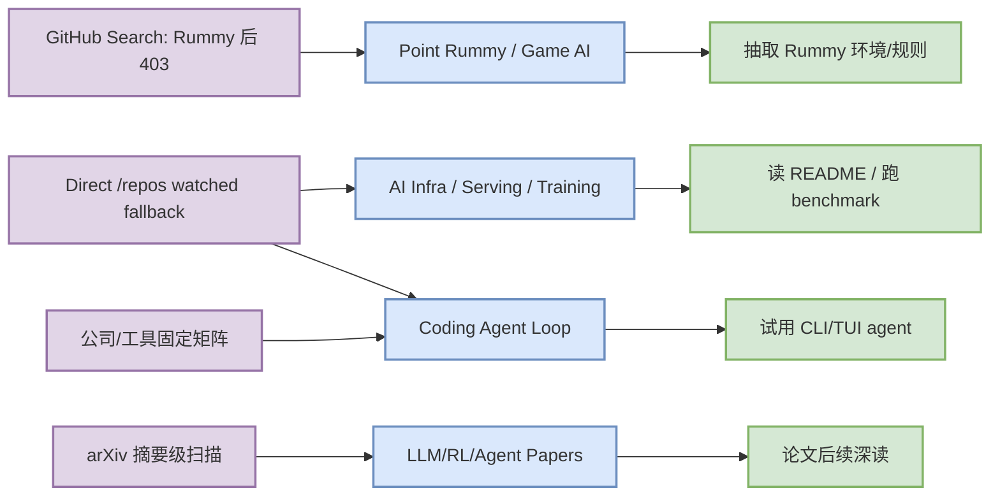
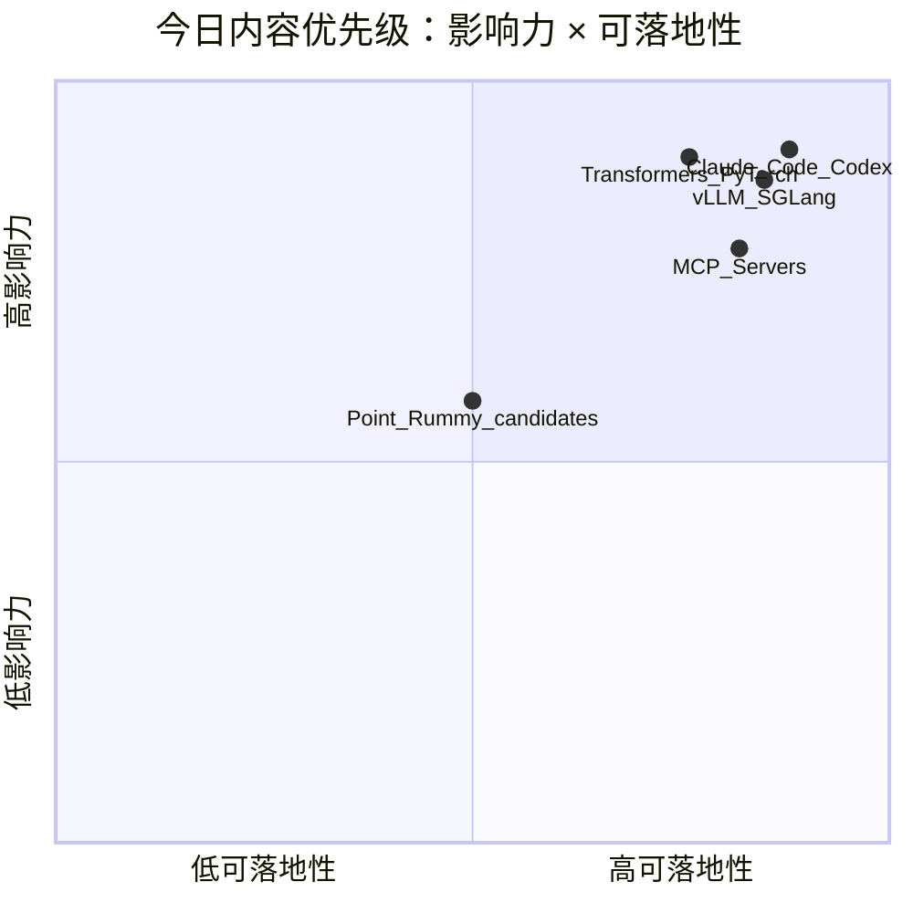

# AI Radar Daily - 2026-10-03

> 生成时间：2026-10-03 09:00 北京时间  
> 范围：AI Infra / LLM / RL / Game AI / 大厂博客 / 论文 / GitHub / Coding 工具  
> Snapshot：`Automation/state/github-stars-2026-10-03.json`（GitHub Search 捕获 Point Rummy/theme rows 后大量 403；已保存并用 direct watched repo fallback 补齐 AI Infra / Loop Engineer 固定榜单）

## 0. 今日结论
- GitHub Search 今日在 Rummy/theme 查询后开始 403；已保存 `Automation/state/github-stars-2026-10-03.json`，broad AI Infra 与 Loop Engineer 榜单使用 direct `/repos` watched fallback，并显式标注“非完整全网日增”。
- 今日必读主线：Claude Code / Codex / Gemini CLI / MCP servers 继续代表 Loop Engineer；Transformers / PyTorch / vLLM / SGLang 继续代表 LLM serving/training 观察集。
- Point Rummy 今天仍是低 star 候选池：优先抽取规则引擎、计分、AI opponent 和仿真环境，不直接当生产依赖。
- Coding 工具扫描矩阵已覆盖 Claude Code、OpenAI Codex、Cursor、Windsurf、GitHub Copilot、Gemini Code Assist、Qwen Code、Roo Code、Cline、Continue。

## 1. 今日态势图

## 2. 必读卡片区

> [!important] huggingface/transformers
> - 大类：GitHub
> - 小类：AI Infra
> - 重点：🤗 Transformers: the model-definition framework for state-of-the-art machine learning models in text, vision, audio, and multimodal models, …
> - 为什么重要：这是今日 fallback 榜单的核心工程项目，适合判断 serving、training、agent loop 或 coding workflow 的生态方向。
> - 详情：[[GitHub/AIInfra/2026-10-03/huggingface-transformers]] / [网页详情](https://github.com/dyt27666-oss/AI-news-report-obsidians/blob/main/GitHub/AIInfra/2026-10-03/huggingface-transformers.md) / [原文](https://github.com/huggingface/transformers)

> [!important] anthropics/claude-code
> - 大类：GitHub
> - 小类：Loop Engineer
> - 重点：Claude Code is an agentic coding tool that lives in your terminal, understands your codebase, and helps you code faster by executing routin…
> - 为什么重要：这是今日 fallback 榜单的核心工程项目，适合判断 serving、training、agent loop 或 coding workflow 的生态方向。
> - 详情：[[GitHub/LoopEngineer/2026-10-03/anthropics-claude-code]] / [网页详情](https://github.com/dyt27666-oss/AI-news-report-obsidians/blob/main/GitHub/LoopEngineer/2026-10-03/anthropics-claude-code.md) / [原文](https://github.com/anthropics/claude-code)

> [!important] openai/codex
> - 大类：GitHub
> - 小类：Loop Engineer
> - 重点：Lightweight coding agent that runs in your terminal
> - 为什么重要：这是今日 fallback 榜单的核心工程项目，适合判断 serving、training、agent loop 或 coding workflow 的生态方向。
> - 详情：[[GitHub/LoopEngineer/2026-10-03/openai-codex]] / [网页详情](https://github.com/dyt27666-oss/AI-news-report-obsidians/blob/main/GitHub/LoopEngineer/2026-10-03/openai-codex.md) / [原文](https://github.com/openai/codex)

> [!important] anthropics/claude-code
> - 大类：GitHub
> - 小类：Loop Engineer
> - 重点：Claude Code is an agentic coding tool that lives in your terminal, understands your codebase, and helps you code faster by executing routin…
> - 为什么重要：这是今日 fallback 榜单的核心工程项目，适合判断 serving、training、agent loop 或 coding workflow 的生态方向。
> - 详情：[[GitHub/LoopEngineer/2026-10-03/anthropics-claude-code]] / [网页详情](https://github.com/dyt27666-oss/AI-news-report-obsidians/blob/main/GitHub/LoopEngineer/2026-10-03/anthropics-claude-code.md) / [原文](https://github.com/anthropics/claude-code)

## 3. 优先级矩阵

## 4. 分类清单
| 标签 | 大类 | 小类 | 标题 | 重点概括 | 为什么重要 | Obsidian 详情 | 网页详情 | 原文 |
|---|---|---|---|---|---|---|---|---|
| 必读 | GitHub | AI Infra/Agent | huggingface/transformers | 🤗 Transformers: the model-definition framework for state-of-the-art machine lea… | fixed watched fallback 下仍是高信号项目，适合进入试用/benchmark 队列。 | [[GitHub/AIInfra/2026-10-03/huggingface-transformers]] | [网页详情](https://github.com/dyt27666-oss/AI-news-report-obsidians/blob/main/GitHub/AIInfra/2026-10-03/huggingface-transformers.md) | [原文](https://github.com/huggingface/transformers) |
| 必读 | GitHub | AI Infra/Agent | anthropics/claude-code | Claude Code is an agentic coding tool that lives in your terminal, understands … | fixed watched fallback 下仍是高信号项目，适合进入试用/benchmark 队列。 | [[GitHub/LoopEngineer/2026-10-03/anthropics-claude-code]] | [网页详情](https://github.com/dyt27666-oss/AI-news-report-obsidians/blob/main/GitHub/LoopEngineer/2026-10-03/anthropics-claude-code.md) | [原文](https://github.com/anthropics/claude-code) |
| 必读 | GitHub | AI Infra/Agent | openai/codex | Lightweight coding agent that runs in your terminal | fixed watched fallback 下仍是高信号项目，适合进入试用/benchmark 队列。 | [[GitHub/LoopEngineer/2026-10-03/openai-codex]] | [网页详情](https://github.com/dyt27666-oss/AI-news-report-obsidians/blob/main/GitHub/LoopEngineer/2026-10-03/openai-codex.md) | [原文](https://github.com/openai/codex) |
| 必读 | GitHub | AI Infra/Agent | google-gemini/gemini-cli | An open-source AI agent that brings the power of Gemini directly into your term… | fixed watched fallback 下仍是高信号项目，适合进入试用/benchmark 队列。 | [[GitHub/LoopEngineer/2026-10-03/google-gemini-gemini-cli]] | [网页详情](https://github.com/dyt27666-oss/AI-news-report-obsidians/blob/main/GitHub/LoopEngineer/2026-10-03/google-gemini-gemini-cli.md) | [原文](https://github.com/google-gemini/gemini-cli) |
| 必读 | GitHub | AI Infra/Agent | pytorch/pytorch | Tensors and Dynamic neural networks in Python with strong GPU acceleration | fixed watched fallback 下仍是高信号项目，适合进入试用/benchmark 队列。 | [[GitHub/AIInfra/2026-10-03/pytorch-pytorch]] | [网页详情](https://github.com/dyt27666-oss/AI-news-report-obsidians/blob/main/GitHub/AIInfra/2026-10-03/pytorch-pytorch.md) | [原文](https://github.com/pytorch/pytorch) |
| 可 skim | 论文 | arXiv | KaliBench: A Fine-Grained Benchmark for Cybersecurity Tool Use on Kal… | LLMs are increasingly applied to cybersecurity workflows, where they are expected to tran… | 作为 LLM/Agent/RL/Infra 候选，需要读 PDF 二次过滤。 | [[Papers/arXiv/2026-10-03/2610.02206v1-kalibench-a-fine-grained-benchmark-for-cybersecurity-tool-use-on-kali-linux-w]] | [网页详情](https://github.com/dyt27666-oss/AI-news-report-obsidians/blob/main/Papers/arXiv/2026-10-03/2610.02206v1-kalibench-a-fine-grained-benchmark-for-cybersecurity-tool-use-on-kali-linux-w.md) | [原文](https://arxiv.org/abs/2610.02206v1) |
| 可 skim | 论文 | arXiv | Reconstruct, Practice, Go Real: Guided Self-Improvement for Embodied … | Building reliable robot capabilities across diverse tasks requires substantial human effo… | 作为 LLM/Agent/RL/Infra 候选，需要读 PDF 二次过滤。 | [[Papers/arXiv/2026-10-03/2610.02204v1-reconstruct-practice-go-real-guided-self-improvement-for-embodied-agents]] | [网页详情](https://github.com/dyt27666-oss/AI-news-report-obsidians/blob/main/Papers/arXiv/2026-10-03/2610.02204v1-reconstruct-practice-go-real-guided-self-improvement-for-embodied-agents.md) | [原文](https://arxiv.org/abs/2610.02204v1) |
| 可 skim | 论文 | arXiv | Embedding Prediction Helps Image Generation | In diffusion transformers, a class label or a text prompt is embedded once, and the same … | 作为 LLM/Agent/RL/Infra 候选，需要读 PDF 二次过滤。 | [[Papers/arXiv/2026-10-03/2610.02203v1-embedding-prediction-helps-image-generation]] | [网页详情](https://github.com/dyt27666-oss/AI-news-report-obsidians/blob/main/Papers/arXiv/2026-10-03/2610.02203v1-embedding-prediction-helps-image-generation.md) | [原文](https://arxiv.org/abs/2610.02203v1) |

## 5. 大厂资讯 / 工程博客 / Research
### 5.1 公司来源扫描矩阵
| 公司/实验室 | 来源/栏目 | 今日状态 | 高相关条数 | 代表条目 | 备注 |
|---|---|---|---:|---|---|
| OpenAI | News / Research | 无高相关新项 / 低置信扫描完成 | 0 | [[Industry/Companies/2026-10-03/openai]] / [网页详情](https://github.com/dyt27666-oss/AI-news-report-obsidians/blob/main/Industry/Companies/2026-10-03/openai.md) | 来源入口：[原文](https://openai.com/news/)；未自动确认今日强相关新项。 |
| Anthropic | News / Research / Engineering | 无高相关新项 / 低置信扫描完成 | 0 | [[Industry/Companies/2026-10-03/anthropic]] / [网页详情](https://github.com/dyt27666-oss/AI-news-report-obsidians/blob/main/Industry/Companies/2026-10-03/anthropic.md) | 来源入口：[原文](https://www.anthropic.com/news)；未自动确认今日强相关新项。 |
| Google DeepMind | Blog / Research | 无高相关新项 / 低置信扫描完成 | 0 | [[Industry/Companies/2026-10-03/google-deepmind]] / [网页详情](https://github.com/dyt27666-oss/AI-news-report-obsidians/blob/main/Industry/Companies/2026-10-03/google-deepmind.md) | 来源入口：[原文](https://deepmind.google/discover/blog/)；未自动确认今日强相关新项。 |
| Meta AI | Blog / Research | 无高相关新项 / 低置信扫描完成 | 0 | [[Industry/Companies/2026-10-03/meta-ai]] / [网页详情](https://github.com/dyt27666-oss/AI-news-report-obsidians/blob/main/Industry/Companies/2026-10-03/meta-ai.md) | 来源入口：[原文](https://ai.meta.com/blog/)；未自动确认今日强相关新项。 |
| NVIDIA | Technical Blog / AI | 无高相关新项 / 低置信扫描完成 | 0 | [[Industry/Companies/2026-10-03/nvidia]] / [网页详情](https://github.com/dyt27666-oss/AI-news-report-obsidians/blob/main/Industry/Companies/2026-10-03/nvidia.md) | 来源入口：[原文](https://developer.nvidia.com/blog/category/artificial-intelligence/)；未自动确认今日强相关新项。 |
| Microsoft | Research AI | 无高相关新项 / 低置信扫描完成 | 0 | [[Industry/Companies/2026-10-03/microsoft]] / [网页详情](https://github.com/dyt27666-oss/AI-news-report-obsidians/blob/main/Industry/Companies/2026-10-03/microsoft.md) | 来源入口：[原文](https://www.microsoft.com/en-us/research/research-area/artificial-intelligence/)；未自动确认今日强相关新项。 |
| Hugging Face | Blog / Papers / Releases | 无高相关新项 / 低置信扫描完成 | 0 | [[Industry/Companies/2026-10-03/hugging-face]] / [网页详情](https://github.com/dyt27666-oss/AI-news-report-obsidians/blob/main/Industry/Companies/2026-10-03/hugging-face.md) | 来源入口：[原文](https://huggingface.co/blog)；未自动确认今日强相关新项。 |
| 腾讯 | AI Lab / 技术博客 | 无高相关新项 / 低置信扫描完成 | 0 | [[Industry/Companies/2026-10-03/tencent]] / [网页详情](https://github.com/dyt27666-oss/AI-news-report-obsidians/blob/main/Industry/Companies/2026-10-03/tencent.md) | 来源入口：[原文](https://ai.tencent.com/ailab/en/index)；未自动确认今日强相关新项。 |
| 字节 | Seed / 技术博客 | 无高相关新项 / 低置信扫描完成 | 0 | [[Industry/Companies/2026-10-03/bytedance]] / [网页详情](https://github.com/dyt27666-oss/AI-news-report-obsidians/blob/main/Industry/Companies/2026-10-03/bytedance.md) | 来源入口：[原文](https://seed.bytedance.com/en/)；未自动确认今日强相关新项。 |
| SpaceAI | Blog / News | 无高相关新项 / 低置信扫描完成 | 0 | [[Industry/Companies/2026-10-03/spaceai]] / [网页详情](https://github.com/dyt27666-oss/AI-news-report-obsidians/blob/main/Industry/Companies/2026-10-03/spaceai.md) | 来源入口：[原文](https://spaceai.com/)；未自动确认今日强相关新项。 |

### 5.2 高相关大厂条目
| 标签 | 发布方/大厂 | 栏目/来源 | 标题 | 重点概括 | 工程/算法影响 | Obsidian 详情 | 网页详情 | 原文 |
|---|---|---|---|---|---|---|---|---|
| 低置信 | OpenAI | News / Research | 固定来源扫描 | 今日未自动确认高相关新项 | 作为模型、infra、agent、eval、coding workflow 信号入口继续观察 | [[Industry/Companies/2026-10-03/openai]] | [网页详情](https://github.com/dyt27666-oss/AI-news-report-obsidians/blob/main/Industry/Companies/2026-10-03/openai.md) | [原文](https://openai.com/news/) |
| 低置信 | Anthropic | News / Research / Engineering | 固定来源扫描 | 今日未自动确认高相关新项 | 作为模型、infra、agent、eval、coding workflow 信号入口继续观察 | [[Industry/Companies/2026-10-03/anthropic]] | [网页详情](https://github.com/dyt27666-oss/AI-news-report-obsidians/blob/main/Industry/Companies/2026-10-03/anthropic.md) | [原文](https://www.anthropic.com/news) |
| 低置信 | Google DeepMind | Blog / Research | 固定来源扫描 | 今日未自动确认高相关新项 | 作为模型、infra、agent、eval、coding workflow 信号入口继续观察 | [[Industry/Companies/2026-10-03/google-deepmind]] | [网页详情](https://github.com/dyt27666-oss/AI-news-report-obsidians/blob/main/Industry/Companies/2026-10-03/google-deepmind.md) | [原文](https://deepmind.google/discover/blog/) |
| 低置信 | Meta AI | Blog / Research | 固定来源扫描 | 今日未自动确认高相关新项 | 作为模型、infra、agent、eval、coding workflow 信号入口继续观察 | [[Industry/Companies/2026-10-03/meta-ai]] | [网页详情](https://github.com/dyt27666-oss/AI-news-report-obsidians/blob/main/Industry/Companies/2026-10-03/meta-ai.md) | [原文](https://ai.meta.com/blog/) |
| 低置信 | NVIDIA | Technical Blog / AI | 固定来源扫描 | 今日未自动确认高相关新项 | 作为模型、infra、agent、eval、coding workflow 信号入口继续观察 | [[Industry/Companies/2026-10-03/nvidia]] | [网页详情](https://github.com/dyt27666-oss/AI-news-report-obsidians/blob/main/Industry/Companies/2026-10-03/nvidia.md) | [原文](https://developer.nvidia.com/blog/category/artificial-intelligence/) |

## 6. GitHub 高 star Top 10
| 排名 | repo | stars | forks | language | updated_at | topics | 重点概括 | 是否值得试用 | Obsidian 详情 | 原文 |
|---:|---|---:|---:|---|---|---|---|---|---|---|
| 1 | huggingface/transformers | 166905 | 34740 | Python | 2026-10-02T22:01:25Z | audio, deep-learning, deepseek, gemma, glm, hacktoberfest | 🤗 Transformers: the model-definition framework for state-of-the-art machine learning mode… | 是，按需试用 | [[GitHub/AIInfra/2026-10-03/huggingface-transformers]] | [GitHub](https://github.com/huggingface/transformers) |
| 2 | anthropics/claude-code | 148977 | 25259 | TypeScript | 2026-10-03T01:02:02Z | 无/未获取 | Claude Code is an agentic coding tool that lives in your terminal, understands your codeb… | 是，按需试用 | [[GitHub/LoopEngineer/2026-10-03/anthropics-claude-code]] | [GitHub](https://github.com/anthropics/claude-code) |
| 3 | openai/codex | 127640 | 19973 | Rust | 2026-10-03T00:50:21Z | 无/未获取 | Lightweight coding agent that runs in your terminal | 是，按需试用 | [[GitHub/LoopEngineer/2026-10-03/openai-codex]] | [GitHub](https://github.com/openai/codex) |
| 4 | google-gemini/gemini-cli | 107214 | 14684 | TypeScript | 2026-10-03T00:50:35Z | ai, ai-agents, cli, gemini, gemini-api, mcp-client | An open-source AI agent that brings the power of Gemini directly into your terminal. | 是，按需试用 | [[GitHub/LoopEngineer/2026-10-03/google-gemini-gemini-cli]] | [GitHub](https://github.com/google-gemini/gemini-cli) |
| 5 | pytorch/pytorch | 103626 | 31157 | Python | 2026-10-03T00:41:59Z | autograd, deep-learning, gpu, machine-learning, neural-network, numpy | Tensors and Dynamic neural networks in Python with strong GPU acceleration | 是，按需试用 | [[GitHub/AIInfra/2026-10-03/pytorch-pytorch]] | [GitHub](https://github.com/pytorch/pytorch) |
| 6 | vllm-project/vllm | 93082 | 22936 | Python | 2026-10-03T01:00:58Z | amd, blackwell, cuda, deepseek, deepseek-v3, gpt | A high-throughput and memory-efficient inference and serving engine for LLMs | 是，按需试用 | [[GitHub/AIInfra/2026-10-03/vllm-project-vllm]] | [GitHub](https://github.com/vllm-project/vllm) |
| 7 | modelcontextprotocol/servers | 90960 | 11748 | TypeScript | 2026-10-03T00:02:55Z | 无/未获取 | Model Context Protocol Servers | 是，按需试用 | [[GitHub/LoopEngineer/2026-10-03/modelcontextprotocol-servers]] | [GitHub](https://github.com/modelcontextprotocol/servers) |
| 8 | OpenHands/OpenHands | 89826 | 11865 | TypeScript | 2026-10-03T00:48:55Z | agent, artificial-intelligence, chatgpt, claude-ai, cli, developer-tools | 🙌 OpenHands: AI-Driven Development | 是，按需试用 | [[GitHub/LoopEngineer/2026-10-03/openhands-openhands]] | [GitHub](https://github.com/OpenHands/OpenHands) |
| 9 | cline/cline | 69737 | 7589 | TypeScript | 2026-10-03T00:46:28Z | 无/未获取 | Autonomous coding agent as an SDK, IDE extension, or CLI assistant. | 是，按需试用 | [[GitHub/LoopEngineer/2026-10-03/cline-cline]] | [GitHub](https://github.com/cline/cline) |
| 10 | microsoft/autogen | 61248 | 9276 | Python | 2026-10-02T20:51:17Z | agentic, agentic-agi, agents, ai, autogen, autogen-ecosystem | A programming framework for agentic AI | 是，按需试用 | [[GitHub/LoopEngineer/2026-10-03/microsoft-autogen]] | [GitHub](https://github.com/microsoft/autogen) |

## 7. GitHub star 增长最快 Top 10
> 增长依据：direct watched repo fallback，非完整全网日增；不是完整 all-GitHub 日增榜。

| 排名 | repo | stars_delta | stars | forks | language | updated_at | 增长依据 | 重点概括 | Obsidian 详情 | 原文 |
|---:|---|---:|---:|---:|---|---|---|---|---|---|
| 1 | anthropics/claude-code | 108 | 148977 | 25259 | TypeScript | 2026-10-03T01:02:02Z | direct watched repo fallback，非完整全网日增 | Claude Code is an agentic coding tool that lives in your terminal, understands your codeb… | [[GitHub/LoopEngineer/2026-10-03/anthropics-claude-code]] | [GitHub](https://github.com/anthropics/claude-code) |
| 2 | crewAIInc/crewAI | 96 | 59291 | 8622 | Python | 2026-10-03T00:04:28Z | direct watched repo fallback，非完整全网日增 | Framework for orchestrating role-playing, autonomous AI agents. By fostering collaborativ… | [[GitHub/LoopEngineer/2026-10-03/crewaiinc-crewai]] | [GitHub](https://github.com/crewAIInc/crewAI) |
| 3 | openai/codex | 94 | 127640 | 19973 | Rust | 2026-10-03T00:50:21Z | direct watched repo fallback，非完整全网日增 | Lightweight coding agent that runs in your terminal | [[GitHub/LoopEngineer/2026-10-03/openai-codex]] | [GitHub](https://github.com/openai/codex) |
| 4 | OpenHands/OpenHands | 78 | 89826 | 11865 | TypeScript | 2026-10-03T00:48:55Z | direct watched repo fallback，非完整全网日增 | 🙌 OpenHands: AI-Driven Development | [[GitHub/LoopEngineer/2026-10-03/openhands-openhands]] | [GitHub](https://github.com/OpenHands/OpenHands) |
| 5 | cline/cline | 56 | 69737 | 7589 | TypeScript | 2026-10-03T00:46:28Z | direct watched repo fallback，非完整全网日增 | Autonomous coding agent as an SDK, IDE extension, or CLI assistant. | [[GitHub/LoopEngineer/2026-10-03/cline-cline]] | [GitHub](https://github.com/cline/cline) |
| 6 | langchain-ai/langgraph | 49 | 42633 | 7226 | Python | 2026-10-03T00:14:25Z | direct watched repo fallback，非完整全网日增 | Build resilient agents. | [[GitHub/LoopEngineer/2026-10-03/langchain-ai-langgraph]] | [GitHub](https://github.com/langchain-ai/langgraph) |
| 7 | vllm-project/vllm | 41 | 93082 | 22936 | Python | 2026-10-03T01:00:58Z | direct watched repo fallback，非完整全网日增 | A high-throughput and memory-efficient inference and serving engine for LLMs | [[GitHub/AIInfra/2026-10-03/vllm-project-vllm]] | [GitHub](https://github.com/vllm-project/vllm) |
| 8 | sgl-project/sglang | 27 | 36729 | 9283 | Python | 2026-10-03T01:03:22Z | direct watched repo fallback，非完整全网日增 | SGLang is a high-performance serving framework for large language models and multimodal m… | [[GitHub/AIInfra/2026-10-03/sgl-project-sglang]] | [GitHub](https://github.com/sgl-project/sglang) |
| 9 | pytorch/pytorch | 21 | 103626 | 31157 | Python | 2026-10-03T00:41:59Z | direct watched repo fallback，非完整全网日增 | Tensors and Dynamic neural networks in Python with strong GPU acceleration | [[GitHub/AIInfra/2026-10-03/pytorch-pytorch]] | [GitHub](https://github.com/pytorch/pytorch) |
| 10 | modelcontextprotocol/servers | 21 | 90960 | 11748 | TypeScript | 2026-10-03T00:02:55Z | direct watched repo fallback，非完整全网日增 | Model Context Protocol Servers | [[GitHub/LoopEngineer/2026-10-03/modelcontextprotocol-servers]] | [GitHub](https://github.com/modelcontextprotocol/servers) |

## 8. Coding 工具 / AI 工具功能更新
### 8.1 Coding 工具扫描矩阵
| 工具 | 厂商 | 来源类型 | 今日状态 | 代表更新 | 对我的影响 | 原文 |
|---|---|---|---|---|---|---|
| Claude Code | Anthropic | Changelog / Release Notes | 已获取 latest release | [[Industry/Tools/2026-10-03/claude-code]]；v2.1.288 / v2.1.288 / 2026-10-02T20:19:57Z | 关注 agent mode、MCP、IDE/CLI/TUI、权限、上下文窗口、远程执行和 rate limit。 | [原文](https://docs.anthropic.com/en/release-notes/claude-code) |
| OpenAI Codex | OpenAI | Changelog / Docs + GitHub Release | 已获取 latest release | [[Industry/Tools/2026-10-03/openai-codex]]；rust-v0.160.0 / 0.160.0 / 2026-10-01T20:19:13Z | 关注 agent mode、MCP、IDE/CLI/TUI、权限、上下文窗口、远程执行和 rate limit。 | [原文](https://developers.openai.com/codex/changelog) |
| Cursor | Cursor | Changelog | 来源入口扫描，低置信 | [[Industry/Tools/2026-10-03/cursor]]；docs/changelog / 网页入口扫描 / 低置信/需人工确认 | 关注 agent mode、MCP、IDE/CLI/TUI、权限、上下文窗口、远程执行和 rate limit。 | [原文](https://cursor.com/changelog) |
| Windsurf | Windsurf | Changelog | 来源入口扫描，低置信 | [[Industry/Tools/2026-10-03/windsurf]]；docs/changelog / 网页入口扫描 / 低置信/需人工确认 | 关注 agent mode、MCP、IDE/CLI/TUI、权限、上下文窗口、远程执行和 rate limit。 | [原文](https://windsurf.com/changelog) |
| GitHub Copilot | GitHub | Changelog / Blog | 来源入口扫描，低置信 | [[Industry/Tools/2026-10-03/github-copilot]]；docs/changelog / 网页入口扫描 / 低置信/需人工确认 | 关注 agent mode、MCP、IDE/CLI/TUI、权限、上下文窗口、远程执行和 rate limit。 | [原文](https://github.blog/changelog/label/copilot/) |
| Gemini Code Assist | Google | Release Notes / Gemini CLI repo | 已获取 latest release | [[Industry/Tools/2026-10-03/gemini-code-assist]]；v0.62.0 / Release v0.62.0 / 2026-09-29T21:17:07Z | 关注 agent mode、MCP、IDE/CLI/TUI、权限、上下文窗口、远程执行和 rate limit。 | [原文](https://cloud.google.com/gemini/docs/codeassist/release-notes) |
| Qwen Code | Alibaba/Qwen | GitHub Releases | 已获取 latest release | [[Industry/Tools/2026-10-03/qwen-code]]；sdk-typescript-v0.1.17 / SDK TypeScript Release v0.1.17 / 2026-09-29T… | 关注 agent mode、MCP、IDE/CLI/TUI、权限、上下文窗口、远程执行和 rate limit。 | [原文](https://github.com/QwenLM/qwen-code/releases) |
| Roo Code | Roo Code | GitHub Releases | 已获取 latest release | [[Industry/Tools/2026-10-03/roo-code]]；v3.54.0 / Release v3.54.0 / 2026-05-15T17:52:24Z | 关注 agent mode、MCP、IDE/CLI/TUI、权限、上下文窗口、远程执行和 rate limit。 | [原文](https://github.com/RooCodeInc/Roo-Code/releases) |
| Cline | Cline | GitHub Releases | 已获取 latest release | [[Industry/Tools/2026-10-03/cline]]；desktop-v0.0.43 / Desktop v0.0.43 / 2026-10-02T20:39:04Z | 关注 agent mode、MCP、IDE/CLI/TUI、权限、上下文窗口、远程执行和 rate limit。 | [原文](https://github.com/cline/cline/releases) |
| Continue | Continue | GitHub Releases | 已获取 latest release | [[Industry/Tools/2026-10-03/continue]]；v2.0.0-vscode / v2.0.0-vscode / 2026-06-19T00:24:01Z | 关注 agent mode、MCP、IDE/CLI/TUI、权限、上下文窗口、远程执行和 rate limit。 | [原文](https://github.com/continuedev/continue/releases) |

### 8.2 高相关工具更新
| 标签 | 工具/厂商 | 来源类型 | 标题/功能 | 重点概括 | 对 AI coding 工作流的影响 | Obsidian 详情 | 网页详情 | 原文 |
|---|---|---|---|---|---|---|---|---|
| 必读 | Claude Code / Anthropic | Changelog / Release Notes | v2.1.288 / v2.1.288 / 2026-10-02T20:19:57Z | 已获取 latest release | 关注 agent mode、MCP、IDE/CLI/TUI、权限、上下文窗口、远程执行和 rate limit。 | [[Industry/Tools/2026-10-03/claude-code]] | [网页详情](https://github.com/dyt27666-oss/AI-news-report-obsidians/blob/main/Industry/Tools/2026-10-03/claude-code.md) | [原文](https://docs.anthropic.com/en/release-notes/claude-code) |
| 必读 | OpenAI Codex / OpenAI | Changelog / Docs + GitHub Release | rust-v0.160.0 / 0.160.0 / 2026-10-01T20:19:13Z | 已获取 latest release | 关注 agent mode、MCP、IDE/CLI/TUI、权限、上下文窗口、远程执行和 rate limit。 | [[Industry/Tools/2026-10-03/openai-codex]] | [网页详情](https://github.com/dyt27666-oss/AI-news-report-obsidians/blob/main/Industry/Tools/2026-10-03/openai-codex.md) | [原文](https://developers.openai.com/codex/changelog) |
| 可 skim | Cursor / Cursor | Changelog | docs/changelog / 网页入口扫描 / 低置信/需人工确认 | 来源入口扫描，低置信 | 关注 agent mode、MCP、IDE/CLI/TUI、权限、上下文窗口、远程执行和 rate limit。 | [[Industry/Tools/2026-10-03/cursor]] | [网页详情](https://github.com/dyt27666-oss/AI-news-report-obsidians/blob/main/Industry/Tools/2026-10-03/cursor.md) | [原文](https://cursor.com/changelog) |
| 可 skim | Windsurf / Windsurf | Changelog | docs/changelog / 网页入口扫描 / 低置信/需人工确认 | 来源入口扫描，低置信 | 关注 agent mode、MCP、IDE/CLI/TUI、权限、上下文窗口、远程执行和 rate limit。 | [[Industry/Tools/2026-10-03/windsurf]] | [网页详情](https://github.com/dyt27666-oss/AI-news-report-obsidians/blob/main/Industry/Tools/2026-10-03/windsurf.md) | [原文](https://windsurf.com/changelog) |
| 可 skim | GitHub Copilot / GitHub | Changelog / Blog | docs/changelog / 网页入口扫描 / 低置信/需人工确认 | 来源入口扫描，低置信 | 关注 agent mode、MCP、IDE/CLI/TUI、权限、上下文窗口、远程执行和 rate limit。 | [[Industry/Tools/2026-10-03/github-copilot]] | [网页详情](https://github.com/dyt27666-oss/AI-news-report-obsidians/blob/main/Industry/Tools/2026-10-03/github-copilot.md) | [原文](https://github.blog/changelog/label/copilot/) |
| 必读 | Gemini Code Assist / Google | Release Notes / Gemini CLI repo | v0.62.0 / Release v0.62.0 / 2026-09-29T21:17:07Z | 已获取 latest release | 关注 agent mode、MCP、IDE/CLI/TUI、权限、上下文窗口、远程执行和 rate limit。 | [[Industry/Tools/2026-10-03/gemini-code-assist]] | [网页详情](https://github.com/dyt27666-oss/AI-news-report-obsidians/blob/main/Industry/Tools/2026-10-03/gemini-code-assist.md) | [原文](https://cloud.google.com/gemini/docs/codeassist/release-notes) |
| 可 skim | Qwen Code / Alibaba/Qwen | GitHub Releases | sdk-typescript-v0.1.17 / SDK TypeScript Release v0.1.17 / 2026-09-29T15:12:40Z | 已获取 latest release | 关注 agent mode、MCP、IDE/CLI/TUI、权限、上下文窗口、远程执行和 rate limit。 | [[Industry/Tools/2026-10-03/qwen-code]] | [网页详情](https://github.com/dyt27666-oss/AI-news-report-obsidians/blob/main/Industry/Tools/2026-10-03/qwen-code.md) | [原文](https://github.com/QwenLM/qwen-code/releases) |
| 可 skim | Roo Code / Roo Code | GitHub Releases | v3.54.0 / Release v3.54.0 / 2026-05-15T17:52:24Z | 已获取 latest release | 关注 agent mode、MCP、IDE/CLI/TUI、权限、上下文窗口、远程执行和 rate limit。 | [[Industry/Tools/2026-10-03/roo-code]] | [网页详情](https://github.com/dyt27666-oss/AI-news-report-obsidians/blob/main/Industry/Tools/2026-10-03/roo-code.md) | [原文](https://github.com/RooCodeInc/Roo-Code/releases) |
| 必读 | Cline / Cline | GitHub Releases | desktop-v0.0.43 / Desktop v0.0.43 / 2026-10-02T20:39:04Z | 已获取 latest release | 关注 agent mode、MCP、IDE/CLI/TUI、权限、上下文窗口、远程执行和 rate limit。 | [[Industry/Tools/2026-10-03/cline]] | [网页详情](https://github.com/dyt27666-oss/AI-news-report-obsidians/blob/main/Industry/Tools/2026-10-03/cline.md) | [原文](https://github.com/cline/cline/releases) |
| 可 skim | Continue / Continue | GitHub Releases | v2.0.0-vscode / v2.0.0-vscode / 2026-06-19T00:24:01Z | 已获取 latest release | 关注 agent mode、MCP、IDE/CLI/TUI、权限、上下文窗口、远程执行和 rate limit。 | [[Industry/Tools/2026-10-03/continue]] | [网页详情](https://github.com/dyt27666-oss/AI-news-report-obsidians/blob/main/Industry/Tools/2026-10-03/continue.md) | [原文](https://github.com/continuedev/continue/releases) |

## 9. Point Rummy / Indian Rummy 业务主题
### 9.1 GitHub 候选
| 标签 | repo | stars | forks | language | updated_at | 重点概括 | 业务可用性 | Obsidian 详情 | 原文 |
|---|---|---:|---:|---|---|---|---|---|---|
| 低置信 | nakkekakke/rummy-ai | 12 | 5 | Java | 2026-08-27T21:23:08Z | Text based classic Rummy game with an AI that uses ISMCTS. Data Structures and Algorithms… | 适合规则/环境/bot baseline，不代表今日全网新增或成熟生产依赖。 | [[GitHub/PointRummy/2026-10-03/nakkekakke-rummy-ai]] | [GitHub](https://github.com/nakkekakke/rummy-ai) |
| 低置信 | jmhummel/Gin-Rummy-Java | 8 | 0 | Java | 2023-08-16T16:12:58Z | Java-based Gin Rummy console game, with an AI opponent | 适合规则/环境/bot baseline，不代表今日全网新增或成熟生产依赖。 | [[GitHub/PointRummy/2026-10-03/jmhummel-gin-rummy-java]] | [GitHub](https://github.com/jmhummel/Gin-Rummy-Java) |
| 低置信 | mudont/indian-rummy | 5 | 0 | TypeScript | 2025-08-08T21:05:04Z | Typescript library for Indian Rummy card game | 适合规则/环境/bot baseline，不代表今日全网新增或成熟生产依赖。 | [[GitHub/PointRummy/2026-10-03/mudont-indian-rummy]] | [GitHub](https://github.com/mudont/indian-rummy) |
| 低置信 | dv-rastogi/Rummy | 5 | 0 | Python | 2023-09-26T11:21:39Z | Variation of classical Indian Rummy made in Pygame | 适合规则/环境/bot baseline，不代表今日全网新增或成熟生产依赖。 | [[GitHub/PointRummy/2026-10-03/dv-rastogi-rummy]] | [GitHub](https://github.com/dv-rastogi/Rummy) |
| 低置信 | vahsek300501/Indian-Rummy- | 4 | 3 | Python | 2023-09-26T11:21:46Z | Indian Rummy made in Python using PyGame | 适合规则/环境/bot baseline，不代表今日全网新增或成熟生产依赖。 | [[GitHub/PointRummy/2026-10-03/vahsek300501-indian-rummy]] | [GitHub](https://github.com/vahsek300501/Indian-Rummy-) |
| 低置信 | SCFlanagan/Rummy | 4 | 6 | JavaScript | 2025-07-25T21:17:08Z | This project is a recreation of the classic card game Rummy. It features an AI player to … | 适合规则/环境/bot baseline，不代表今日全网新增或成熟生产依赖。 | [[GitHub/PointRummy/2026-10-03/scflanagan-rummy]] | [GitHub](https://github.com/SCFlanagan/Rummy) |
| 低置信 | mcartmell/gin-rummy-bot | 4 | 2 | Perl | 2024-10-30T20:06:17Z | A web-based Gin Rummy game and AI | 适合规则/环境/bot baseline，不代表今日全网新增或成熟生产依赖。 | [[GitHub/PointRummy/2026-10-03/mcartmell-gin-rummy-bot]] | [GitHub](https://github.com/mcartmell/gin-rummy-bot) |
| 低置信 | Mohitkumar-559/RummyServer | 2 | 1 | JavaScript | 2024-03-17T03:48:34Z | Rummy game server for game that contain deal rummy and point rummy | 适合规则/环境/bot baseline，不代表今日全网新增或成熟生产依赖。 | [[GitHub/PointRummy/2026-10-03/mohitkumar-559-rummyserver]] | [GitHub](https://github.com/Mohitkumar-559/RummyServer) |
| 低置信 | abubakarmunir712/dsa-final-project | 2 | 1 | Python | 2026-06-27T06:34:26Z | A Python-based multiplayer Indian Rummy game with support for AI opponents and LAN play. … | 适合规则/环境/bot baseline，不代表今日全网新增或成熟生产依赖。 | [[GitHub/PointRummy/2026-10-03/abubakarmunir712-dsa-final-project]] | [GitHub](https://github.com/abubakarmunir712/dsa-final-project) |
| 低置信 | Ductapemaster/RummyAI | 2 | 0 | Python | 2017-07-11T12:12:49Z | Designing an AI to play Gin Rummy | 适合规则/环境/bot baseline，不代表今日全网新增或成熟生产依赖。 | [[GitHub/PointRummy/2026-10-03/ductapemaster-rummyai]] | [GitHub](https://github.com/Ductapemaster/RummyAI) |

### 9.2 论文 / 资料候选
| 标签 | 来源 | 标题 | 作者/机构 | 重点概括 | 对 Point Rummy 业务有什么用 | Obsidian 详情 | 原文 |
|---|---|---|---|---|---|---|---|
| 低置信 | arXiv / GitHub Search | 今日未确认 Point Rummy 强相关新论文 | 未获取 | 搜索结果偏低 star 工程仓库，论文需继续查 Gin Rummy / imperfect-information game / ISMCTS | 继续查规则建模、MCTS、self-play、环境并行和 evaluator | [[Business/PointRummy/2026-10-03/low-confidence-watchlist]] | [arXiv](https://arxiv.org/search/?query=gin+rummy+reinforcement+learning&searchtype=all) |

### 9.3 业务可用性判断
| 方向 | 今日信号 | 可用性 | 下一步 |
|---|---|---|---|
| 规则引擎 / 计分 | Rummy/Indian Rummy repo 中有规则、计分、Web/Pygame 实现 | 中低；需人工检查规则完整性 | 抽取 meld/sequence/set 判定，写单元测试 |
| Bot / RL Agent | 少量 AI opponent / ISMCTS / RL 项目 | 中；适合参考状态/action/reward 设计 | 先复现 Gym/env，再做并行环境 |
| 仿真 / 评测 | 多为低 star 项目，质量不稳定 | 低到中 | 自建 evaluator，不直接依赖 |

## 10. Loop Engineer / Loop Engineering 主题
### 10.1 Loop Engineer GitHub 高 star Top 10
| 排名 | repo | stars | forks | language | updated_at | topics | 重点概括 | 是否值得试用 | Obsidian 详情 | 原文 |
|---:|---|---:|---:|---|---|---|---|---|---|---|
| 1 | anthropics/claude-code | 148977 | 25259 | TypeScript | 2026-10-03T01:02:02Z | 无/未获取 | Claude Code is an agentic coding tool that lives in your terminal, understands your codeb… | 是，按需试用 | [[GitHub/LoopEngineer/2026-10-03/anthropics-claude-code]] | [GitHub](https://github.com/anthropics/claude-code) |
| 2 | openai/codex | 127640 | 19973 | Rust | 2026-10-03T00:50:21Z | 无/未获取 | Lightweight coding agent that runs in your terminal | 是，按需试用 | [[GitHub/LoopEngineer/2026-10-03/openai-codex]] | [GitHub](https://github.com/openai/codex) |
| 3 | google-gemini/gemini-cli | 107214 | 14684 | TypeScript | 2026-10-03T00:50:35Z | ai, ai-agents, cli, gemini, gemini-api, mcp-client | An open-source AI agent that brings the power of Gemini directly into your terminal. | 是，按需试用 | [[GitHub/LoopEngineer/2026-10-03/google-gemini-gemini-cli]] | [GitHub](https://github.com/google-gemini/gemini-cli) |
| 4 | modelcontextprotocol/servers | 90960 | 11748 | TypeScript | 2026-10-03T00:02:55Z | 无/未获取 | Model Context Protocol Servers | 是，按需试用 | [[GitHub/LoopEngineer/2026-10-03/modelcontextprotocol-servers]] | [GitHub](https://github.com/modelcontextprotocol/servers) |
| 5 | OpenHands/OpenHands | 89826 | 11865 | TypeScript | 2026-10-03T00:48:55Z | agent, artificial-intelligence, chatgpt, claude-ai, cli, developer-tools | 🙌 OpenHands: AI-Driven Development | 是，按需试用 | [[GitHub/LoopEngineer/2026-10-03/openhands-openhands]] | [GitHub](https://github.com/OpenHands/OpenHands) |
| 6 | cline/cline | 69737 | 7589 | TypeScript | 2026-10-03T00:46:28Z | 无/未获取 | Autonomous coding agent as an SDK, IDE extension, or CLI assistant. | 是，按需试用 | [[GitHub/LoopEngineer/2026-10-03/cline-cline]] | [GitHub](https://github.com/cline/cline) |
| 7 | microsoft/autogen | 61248 | 9276 | Python | 2026-10-02T20:51:17Z | agentic, agentic-agi, agents, ai, autogen, autogen-ecosystem | A programming framework for agentic AI | 是，按需试用 | [[GitHub/LoopEngineer/2026-10-03/microsoft-autogen]] | [GitHub](https://github.com/microsoft/autogen) |
| 8 | crewAIInc/crewAI | 59291 | 8622 | Python | 2026-10-03T00:04:28Z | agents, ai, ai-agents, aiagentframework, llms | Framework for orchestrating role-playing, autonomous AI agents. By fostering collaborativ… | 是，按需试用 | [[GitHub/LoopEngineer/2026-10-03/crewaiinc-crewai]] | [GitHub](https://github.com/crewAIInc/crewAI) |
| 9 | Aider-AI/aider | 49340 | 5021 | Python | 2026-10-02T23:56:44Z | anthropic, chatgpt, claude-3, cli, command-line, gemini | aider is AI pair programming in your terminal | 是，按需试用 | [[GitHub/LoopEngineer/2026-10-03/aider-ai-aider]] | [GitHub](https://github.com/Aider-AI/aider) |
| 10 | langchain-ai/langgraph | 42633 | 7226 | Python | 2026-10-03T00:14:25Z | agents, ai, ai-agents, chatgpt, deepagents, enterprise | Build resilient agents. | 是，按需试用 | [[GitHub/LoopEngineer/2026-10-03/langchain-ai-langgraph]] | [GitHub](https://github.com/langchain-ai/langgraph) |

### 10.2 Loop Engineer GitHub star 增长最快 Top 10
| 排名 | repo | stars_delta | stars | forks | language | updated_at | 增长依据 | 重点概括 | Obsidian 详情 | 原文 |
|---:|---|---:|---:|---:|---|---|---|---|---|---|
| 1 | anthropics/claude-code | 108 | 148977 | 25259 | TypeScript | 2026-10-03T01:02:02Z | direct watched repo fallback，非完整全网日增 | Claude Code is an agentic coding tool that lives in your terminal, understands your codeb… | [[GitHub/LoopEngineer/2026-10-03/anthropics-claude-code]] | [GitHub](https://github.com/anthropics/claude-code) |
| 2 | crewAIInc/crewAI | 96 | 59291 | 8622 | Python | 2026-10-03T00:04:28Z | direct watched repo fallback，非完整全网日增 | Framework for orchestrating role-playing, autonomous AI agents. By fostering collaborativ… | [[GitHub/LoopEngineer/2026-10-03/crewaiinc-crewai]] | [GitHub](https://github.com/crewAIInc/crewAI) |
| 3 | openai/codex | 94 | 127640 | 19973 | Rust | 2026-10-03T00:50:21Z | direct watched repo fallback，非完整全网日增 | Lightweight coding agent that runs in your terminal | [[GitHub/LoopEngineer/2026-10-03/openai-codex]] | [GitHub](https://github.com/openai/codex) |
| 4 | OpenHands/OpenHands | 78 | 89826 | 11865 | TypeScript | 2026-10-03T00:48:55Z | direct watched repo fallback，非完整全网日增 | 🙌 OpenHands: AI-Driven Development | [[GitHub/LoopEngineer/2026-10-03/openhands-openhands]] | [GitHub](https://github.com/OpenHands/OpenHands) |
| 5 | cline/cline | 56 | 69737 | 7589 | TypeScript | 2026-10-03T00:46:28Z | direct watched repo fallback，非完整全网日增 | Autonomous coding agent as an SDK, IDE extension, or CLI assistant. | [[GitHub/LoopEngineer/2026-10-03/cline-cline]] | [GitHub](https://github.com/cline/cline) |
| 6 | langchain-ai/langgraph | 49 | 42633 | 7226 | Python | 2026-10-03T00:14:25Z | direct watched repo fallback，非完整全网日增 | Build resilient agents. | [[GitHub/LoopEngineer/2026-10-03/langchain-ai-langgraph]] | [GitHub](https://github.com/langchain-ai/langgraph) |
| 7 | modelcontextprotocol/servers | 21 | 90960 | 11748 | TypeScript | 2026-10-03T00:02:55Z | direct watched repo fallback，非完整全网日增 | Model Context Protocol Servers | [[GitHub/LoopEngineer/2026-10-03/modelcontextprotocol-servers]] | [GitHub](https://github.com/modelcontextprotocol/servers) |
| 8 | Aider-AI/aider | 19 | 49340 | 5021 | Python | 2026-10-02T23:56:44Z | direct watched repo fallback，非完整全网日增 | aider is AI pair programming in your terminal | [[GitHub/LoopEngineer/2026-10-03/aider-ai-aider]] | [GitHub](https://github.com/Aider-AI/aider) |
| 9 | QwenLM/qwen-code | 9 | 28279 | 3144 | TypeScript | 2026-10-03T00:21:29Z | direct watched repo fallback，非完整全网日增 | An open-source AI coding agent that lives in your terminal. | [[GitHub/LoopEngineer/2026-10-03/qwenlm-qwen-code]] | [GitHub](https://github.com/QwenLM/qwen-code) |
| 10 | continuedev/continue | 7 | 36088 | 5441 | TypeScript | 2026-10-02T20:59:36Z | direct watched repo fallback，非完整全网日增 | open-source coding agent | [[GitHub/LoopEngineer/2026-10-03/continuedev-continue]] | [GitHub](https://github.com/continuedev/continue) |

### 10.3 Loop Engineering 方法信号
| 标签 | 来源 | 标题 | 重点概括 | 对 AI coding 工作流的影响 | Obsidian 详情 | 原文 |
|---|---|---|---|---|---|---|
| 必读 | GitHub | anthropics/claude-code | Claude Code is an agentic coding tool that lives in your terminal, understands your codebase, and h… | 观察 agent loop、任务分解、上下文工程、eval loop 和权限边界。 | [[GitHub/LoopEngineer/2026-10-03/anthropics-claude-code]] | [GitHub](https://github.com/anthropics/claude-code) |
| 必读 | GitHub | openai/codex | Lightweight coding agent that runs in your terminal | 观察 agent loop、任务分解、上下文工程、eval loop 和权限边界。 | [[GitHub/LoopEngineer/2026-10-03/openai-codex]] | [GitHub](https://github.com/openai/codex) |
| 必读 | GitHub | google-gemini/gemini-cli | An open-source AI agent that brings the power of Gemini directly into your terminal. | 观察 agent loop、任务分解、上下文工程、eval loop 和权限边界。 | [[GitHub/LoopEngineer/2026-10-03/google-gemini-gemini-cli]] | [GitHub](https://github.com/google-gemini/gemini-cli) |
| 必读 | GitHub | modelcontextprotocol/servers | Model Context Protocol Servers | 观察 agent loop、任务分解、上下文工程、eval loop 和权限边界。 | [[GitHub/LoopEngineer/2026-10-03/modelcontextprotocol-servers]] | [GitHub](https://github.com/modelcontextprotocol/servers) |
| 必读 | GitHub | OpenHands/OpenHands | 🙌 OpenHands: AI-Driven Development | 观察 agent loop、任务分解、上下文工程、eval loop 和权限边界。 | [[GitHub/LoopEngineer/2026-10-03/openhands-openhands]] | [GitHub](https://github.com/OpenHands/OpenHands) |

## 11. 论文
### 11.1 Agent / Serving / RL / World Model 候选
| 标签 | 论文来源 | 论文 | 作者/机构 | 重点概括 | 工程/研究价值 | Obsidian 详情 | 网页详情 | PDF/原文 |
|---|---|---|---|---|---|---|---|---|
| 可 skim | arXiv / 预印本 | KaliBench: A Fine-Grained Benchmark for Cybersecurity Tool Use on Kali Linux wi… | Pengfei Li, Naufal Suryanto, Sicheng Zhang, Muzammal Naseer | LLMs are increasingly applied to cybersecurity workflows, where they are expected to translate anal… | 需读 PDF 验证是否有系统、训练、评测或 RL 价值。 | [[Papers/arXiv/2026-10-03/2610.02206v1-kalibench-a-fine-grained-benchmark-for-cybersecurity-tool-use-on-kali-linux-w]] | [网页详情](https://github.com/dyt27666-oss/AI-news-report-obsidians/blob/main/Papers/arXiv/2026-10-03/2610.02206v1-kalibench-a-fine-grained-benchmark-for-cybersecurity-tool-use-on-kali-linux-w.md) | [PDF](https://arxiv.org/pdf/2610.02206v1) / [abs](https://arxiv.org/abs/2610.02206v1) |
| 可 skim | arXiv / 预印本 | Reconstruct, Practice, Go Real: Guided Self-Improvement for Embodied Agents | Yen-Jen Wang, Haozhe Jiang, Shuying Deng, Haoru Xue, Weirui Ye | Building reliable robot capabilities across diverse tasks requires substantial human effort to deve… | 需读 PDF 验证是否有系统、训练、评测或 RL 价值。 | [[Papers/arXiv/2026-10-03/2610.02204v1-reconstruct-practice-go-real-guided-self-improvement-for-embodied-agents]] | [网页详情](https://github.com/dyt27666-oss/AI-news-report-obsidians/blob/main/Papers/arXiv/2026-10-03/2610.02204v1-reconstruct-practice-go-real-guided-self-improvement-for-embodied-agents.md) | [PDF](https://arxiv.org/pdf/2610.02204v1) / [abs](https://arxiv.org/abs/2610.02204v1) |
| 可 skim | arXiv / 预印本 | Embedding Prediction Helps Image Generation | Sihan Xu, Ji Xie, Zilin Wang, Hui Shen, Stella X. Yu | In diffusion transformers, a class label or a text prompt is embedded once, and the same condition … | 需读 PDF 验证是否有系统、训练、评测或 RL 价值。 | [[Papers/arXiv/2026-10-03/2610.02203v1-embedding-prediction-helps-image-generation]] | [网页详情](https://github.com/dyt27666-oss/AI-news-report-obsidians/blob/main/Papers/arXiv/2026-10-03/2610.02203v1-embedding-prediction-helps-image-generation.md) | [PDF](https://arxiv.org/pdf/2610.02203v1) / [abs](https://arxiv.org/abs/2610.02203v1) |
| 可 skim | arXiv / 预印本 | TACO: Ternary Absolute-max Column-wise One-sparse Optimizer for LLM Fine-Tuning | Jichao Jiang, Cristian McGee, El Houcine Bergou, Hanqin Cai, Aritra Dutta | Full-parameter fine-tuning of large language models (LLMs) incurs substantial optimizer state memor… | 需读 PDF 验证是否有系统、训练、评测或 RL 价值。 | [[Papers/arXiv/2026-10-03/2610.02199v1-taco-ternary-absolute-max-column-wise-one-sparse-optimizer-for-llm-fine-tunin]] | [网页详情](https://github.com/dyt27666-oss/AI-news-report-obsidians/blob/main/Papers/arXiv/2026-10-03/2610.02199v1-taco-ternary-absolute-max-column-wise-one-sparse-optimizer-for-llm-fine-tunin.md) | [PDF](https://arxiv.org/pdf/2610.02199v1) / [abs](https://arxiv.org/abs/2610.02199v1) |
| 可 skim | arXiv / 预印本 | One Basis to Animate Them All: Gaussian Blendshape Distillation for Real-Time A… | Ramazan Fazylov, Stamatis Lefkimmiatis, Ivan Laptev | 3D Gaussian avatars support fast rendering, however, their real-time animation is often challenged … | 需读 PDF 验证是否有系统、训练、评测或 RL 价值。 | [[Papers/arXiv/2026-10-03/2610.02207v1-one-basis-to-animate-them-all-gaussian-blendshape-distillation-for-real-time-]] | [网页详情](https://github.com/dyt27666-oss/AI-news-report-obsidians/blob/main/Papers/arXiv/2026-10-03/2610.02207v1-one-basis-to-animate-them-all-gaussian-blendshape-distillation-for-real-time-.md) | [PDF](https://arxiv.org/pdf/2610.02207v1) / [abs](https://arxiv.org/abs/2610.02207v1) |

## 12. 资讯 / 其他 GitHub 项目
### 12.1 AI Infra direct watched repo fallback
| 标签 | 来源 | 标题 | 重点概括 | 对我有什么用 | Obsidian 详情 | 网页详情 | 原文 |
|---|---|---|---|---|---|---|---|
| 后续 | GitHub | langchain-ai/langgraph | Build resilient agents. | 扩展 watched repo 池，辅助判断生态活跃度。 | [[GitHub/LoopEngineer/2026-10-03/langchain-ai-langgraph]] | [网页详情](https://github.com/dyt27666-oss/AI-news-report-obsidians/blob/main/GitHub/LoopEngineer/2026-10-03/langchain-ai-langgraph.md) | [GitHub](https://github.com/langchain-ai/langgraph) |
| 后续 | GitHub | sgl-project/sglang | SGLang is a high-performance serving framework for large language models and multimodal models. | 扩展 watched repo 池，辅助判断生态活跃度。 | [[GitHub/AIInfra/2026-10-03/sgl-project-sglang]] | [网页详情](https://github.com/dyt27666-oss/AI-news-report-obsidians/blob/main/GitHub/AIInfra/2026-10-03/sgl-project-sglang.md) | [GitHub](https://github.com/sgl-project/sglang) |
| 后续 | GitHub | NVIDIA/TensorRT-LLM | TensorRT LLM provides users with an easy-to-use Python API to define Large Language Models (LLMs) a… | 扩展 watched repo 池，辅助判断生态活跃度。 | [[GitHub/AIInfra/2026-10-03/nvidia-tensorrt-llm]] | [网页详情](https://github.com/dyt27666-oss/AI-news-report-obsidians/blob/main/GitHub/AIInfra/2026-10-03/nvidia-tensorrt-llm.md) | [GitHub](https://github.com/NVIDIA/TensorRT-LLM) |
| 后续 | GitHub | deepspeedai/DeepSpeed | DeepSpeed is a deep learning optimization library that makes distributed training and inference eas… | 扩展 watched repo 池，辅助判断生态活跃度。 | [[GitHub/AIInfra/2026-10-03/deepspeedai-deepspeed]] | [网页详情](https://github.com/dyt27666-oss/AI-news-report-obsidians/blob/main/GitHub/AIInfra/2026-10-03/deepspeedai-deepspeed.md) | [GitHub](https://github.com/deepspeedai/DeepSpeed) |
| 后续 | GitHub | NVIDIA/Megatron-LM | Ongoing research training transformer models at scale | 扩展 watched repo 池，辅助判断生态活跃度。 | [[GitHub/AIInfra/2026-10-03/nvidia-megatron-lm]] | [网页详情](https://github.com/dyt27666-oss/AI-news-report-obsidians/blob/main/GitHub/AIInfra/2026-10-03/nvidia-megatron-lm.md) | [GitHub](https://github.com/NVIDIA/Megatron-LM) |

## 13. 按主题索引
### AI Infra / Serving / Training
- [[GitHub/AIInfra/2026-10-03/huggingface-transformers]] - huggingface/transformers
- [[GitHub/LoopEngineer/2026-10-03/anthropics-claude-code]] - anthropics/claude-code
- [[GitHub/LoopEngineer/2026-10-03/openai-codex]] - openai/codex
- [[GitHub/LoopEngineer/2026-10-03/google-gemini-gemini-cli]] - google-gemini/gemini-cli
- [[GitHub/AIInfra/2026-10-03/pytorch-pytorch]] - pytorch/pytorch
- [[GitHub/AIInfra/2026-10-03/vllm-project-vllm]] - vllm-project/vllm
- [[GitHub/LoopEngineer/2026-10-03/modelcontextprotocol-servers]] - modelcontextprotocol/servers
- [[GitHub/LoopEngineer/2026-10-03/openhands-openhands]] - OpenHands/OpenHands

### LLM / Agent / RAG / Evaluation
- [[GitHub/LoopEngineer/2026-10-03/anthropics-claude-code]] - Loop/coding agent 观察
- [[GitHub/LoopEngineer/2026-10-03/openai-codex]] - Loop/coding agent 观察
- [[GitHub/LoopEngineer/2026-10-03/google-gemini-gemini-cli]] - Loop/coding agent 观察
- [[GitHub/LoopEngineer/2026-10-03/modelcontextprotocol-servers]] - Loop/coding agent 观察
- [[GitHub/LoopEngineer/2026-10-03/openhands-openhands]] - Loop/coding agent 观察
- [[GitHub/LoopEngineer/2026-10-03/cline-cline]] - Loop/coding agent 观察
- [[GitHub/LoopEngineer/2026-10-03/microsoft-autogen]] - Loop/coding agent 观察
- [[GitHub/LoopEngineer/2026-10-03/crewaiinc-crewai]] - Loop/coding agent 观察

### RL / Game AI / World Model
- [[Business/PointRummy/2026-10-03/low-confidence-watchlist]] - Rummy/Game AI 低置信候选池
- [[Papers/arXiv/2026-10-03/2610.02206v1-kalibench-a-fine-grained-benchmark-for-cybersecurity-tool-use-on-kali-linux-w]] - arXiv 候选论文
- [[Papers/arXiv/2026-10-03/2610.02204v1-reconstruct-practice-go-real-guided-self-improvement-for-embodied-agents]] - arXiv 候选论文

### Point Rummy / Indian Rummy
- [[GitHub/PointRummy/2026-10-03/nakkekakke-rummy-ai]] - Rummy 规则/bot baseline
- [[GitHub/PointRummy/2026-10-03/jmhummel-gin-rummy-java]] - Rummy 规则/bot baseline
- [[GitHub/PointRummy/2026-10-03/mudont-indian-rummy]] - Rummy 规则/bot baseline
- [[GitHub/PointRummy/2026-10-03/dv-rastogi-rummy]] - Rummy 规则/bot baseline
- [[GitHub/PointRummy/2026-10-03/vahsek300501-indian-rummy]] - Rummy 规则/bot baseline

### Loop Engineer / Coding Agent Loop
- [[GitHub/LoopEngineer/2026-10-03/anthropics-claude-code]] - coding agent loop 工具/框架
- [[GitHub/LoopEngineer/2026-10-03/openai-codex]] - coding agent loop 工具/框架
- [[GitHub/LoopEngineer/2026-10-03/google-gemini-gemini-cli]] - coding agent loop 工具/框架
- [[GitHub/LoopEngineer/2026-10-03/modelcontextprotocol-servers]] - coding agent loop 工具/框架
- [[GitHub/LoopEngineer/2026-10-03/openhands-openhands]] - coding agent loop 工具/框架
- [[GitHub/LoopEngineer/2026-10-03/cline-cline]] - coding agent loop 工具/框架
- [[GitHub/LoopEngineer/2026-10-03/microsoft-autogen]] - coding agent loop 工具/框架
- [[GitHub/LoopEngineer/2026-10-03/crewaiinc-crewai]] - coding agent loop 工具/框架
- [[GitHub/LoopEngineer/2026-10-03/aider-ai-aider]] - coding agent loop 工具/框架
- [[GitHub/LoopEngineer/2026-10-03/langchain-ai-langgraph]] - coding agent loop 工具/框架

### 公司 / 实验室
- OpenAI: [[Industry/Companies/2026-10-03/openai]]
- Anthropic: [[Industry/Companies/2026-10-03/anthropic]]
- Google DeepMind: [[Industry/Companies/2026-10-03/google-deepmind]]
- Meta AI: [[Industry/Companies/2026-10-03/meta-ai]]
- NVIDIA: [[Industry/Companies/2026-10-03/nvidia]]
- Microsoft: [[Industry/Companies/2026-10-03/microsoft]]
- Hugging Face: [[Industry/Companies/2026-10-03/hugging-face]]
- 腾讯: [[Industry/Companies/2026-10-03/tencent]]
- 字节: [[Industry/Companies/2026-10-03/bytedance]]
- SpaceAI: [[Industry/Companies/2026-10-03/spaceai]]

## 14. 值得后续深挖
| 标签 | 大类 | 小类 | 标题 | 后续动作 | Obsidian 详情 | 原文 |
|---|---|---|---|---|---|---|
| 必读 | GitHub | AI Infra/Loop | huggingface/transformers | 拉 README + examples，跑最小 benchmark。 | [[GitHub/AIInfra/2026-10-03/huggingface-transformers]] | [GitHub](https://github.com/huggingface/transformers) |
| 必读 | GitHub | AI Infra/Loop | anthropics/claude-code | 拉 README + examples，跑最小 benchmark。 | [[GitHub/LoopEngineer/2026-10-03/anthropics-claude-code]] | [GitHub](https://github.com/anthropics/claude-code) |
| 必读 | GitHub | AI Infra/Loop | openai/codex | 拉 README + examples，跑最小 benchmark。 | [[GitHub/LoopEngineer/2026-10-03/openai-codex]] | [GitHub](https://github.com/openai/codex) |
| 后续 | Coding 工具 | Agent workflow | Claude Code | 打开 release/changelog 核对 agent mode/MCP/权限变化。 | [[Industry/Tools/2026-10-03/claude-code]] | [原文](https://docs.anthropic.com/en/release-notes/claude-code) |
| 后续 | Coding 工具 | Agent workflow | OpenAI Codex | 打开 release/changelog 核对 agent mode/MCP/权限变化。 | [[Industry/Tools/2026-10-03/openai-codex]] | [原文](https://developers.openai.com/codex/changelog) |
| 后续 | Coding 工具 | Agent workflow | Cline | 打开 release/changelog 核对 agent mode/MCP/权限变化。 | [[Industry/Tools/2026-10-03/cline]] | [原文](https://github.com/cline/cline/releases) |

## 15. 采集失败或低置信来源
- GitHub Search/API 错误摘要：HTTP Error 403: rate limit exceeded。
- 公司博客/工具 changelog：固定矩阵已覆盖，但多数仅保留入口，未自动确认“今日高相关新项”。
- Snapshot 文件：`Automation/state/github-stars-2026-10-03.json`（不使用 Obsidian wikilink，避免 JSON 被当成 Markdown note 验证）。

## 16. 归档标签
#ai-radar #daily #ai-infra #llm #rl #point-rummy #loop-engineering
