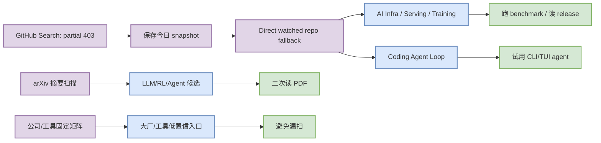
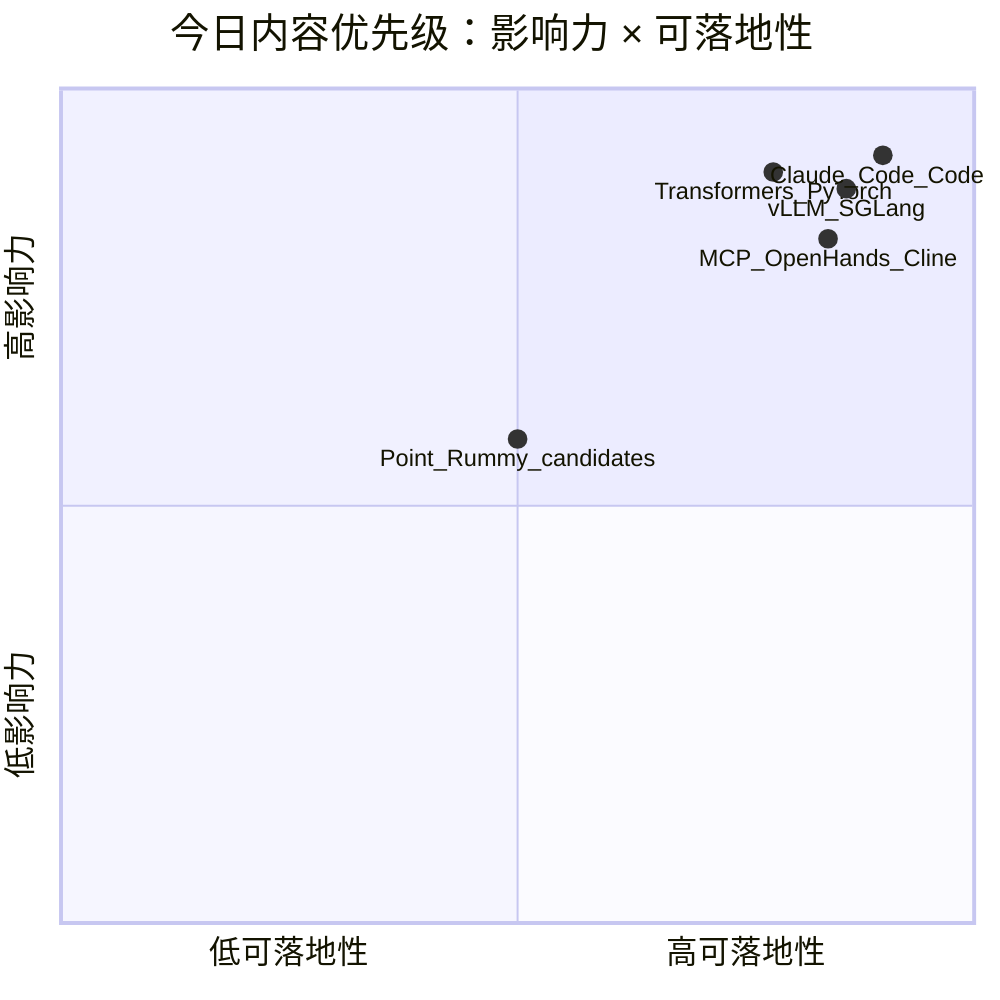

# AI Radar Daily - 2026-10-05

> 生成时间：2026-10-05 09:00 北京时间  
> 范围：AI Infra / LLM / RL / Game AI / 大厂博客 / 论文 / GitHub / Coding 工具  
> Snapshot：`Automation/state/github-stars-2026-10-05.json`（GitHub Search 今日部分 403；已保存并用 direct watched repo fallback 补齐 AI Infra / Loop Engineer 固定榜单，fallback 行均标注非完整全网日增）

## 0. 今日结论
- 今日 GitHub snapshot 已生成：`Automation/state/github-stars-2026-10-05.json`；Search 在 Rummy/Loop/broad 阶段出现 403，已保留错误并用 direct watched repo fallback 补齐固定榜单。
- AI Infra 主线仍集中在 Transformers / PyTorch / vLLM / SGLang / TensorRT-LLM；适合继续用作 serving/training benchmark 观察池。
- Loop Engineer 主线集中在 Claude Code、Codex、Gemini CLI、MCP servers、OpenHands、Cline；关注 CLI/TUI agent、MCP、权限和上下文工程。
- Point Rummy 今天仍是低 star 候选池，业务价值在规则建模、AI opponent、ISMCTS/MCTS baseline 和自建 evaluator，不应直接视为生产依赖。
- Coding 工具扫描矩阵已覆盖 10 个固定工具；商业网页入口未确认新项时明确标低置信。

## 1. 今日态势图

## 2. 必读卡片区

> [!important] huggingface/transformers
> - 大类：GitHub
> - 小类：AI Infra
> - 重点：🤗 Transformers: the model-definition framework for state-of-the-art machine learning models in text, vision, audio, and…
> - 为什么重要：今日 fixed watched fallback 下的高信号项目，用于判断 serving/training、agent loop 或 coding workflow 的生态方向。
> - 详情：[[GitHub/AIInfra/2026-10-05/huggingface-transformers]] / [网页详情](https://github.com/dyt27666-oss/AI-news-report-obsidians/blob/main/GitHub/AIInfra/2026-10-05/huggingface-transformers.md) / [原文](https://github.com/huggingface/transformers)

> [!important] anthropics/claude-code
> - 大类：GitHub
> - 小类：Loop Engineer
> - 重点：Claude Code is an agentic coding tool that lives in your terminal, understands your codebase, and helps you code faster…
> - 为什么重要：今日 fixed watched fallback 下的高信号项目，用于判断 serving/training、agent loop 或 coding workflow 的生态方向。
> - 详情：[[GitHub/LoopEngineer/2026-10-05/anthropics-claude-code]] / [网页详情](https://github.com/dyt27666-oss/AI-news-report-obsidians/blob/main/GitHub/LoopEngineer/2026-10-05/anthropics-claude-code.md) / [原文](https://github.com/anthropics/claude-code)

> [!important] anthropics/claude-code
> - 大类：GitHub
> - 小类：Loop Engineer
> - 重点：Claude Code is an agentic coding tool that lives in your terminal, understands your codebase, and helps you code faster…
> - 为什么重要：今日 fixed watched fallback 下的高信号项目，用于判断 serving/training、agent loop 或 coding workflow 的生态方向。
> - 详情：[[GitHub/LoopEngineer/2026-10-05/anthropics-claude-code]] / [网页详情](https://github.com/dyt27666-oss/AI-news-report-obsidians/blob/main/GitHub/LoopEngineer/2026-10-05/anthropics-claude-code.md) / [原文](https://github.com/anthropics/claude-code)

> [!important] openai/codex
> - 大类：GitHub
> - 小类：Loop Engineer
> - 重点：Lightweight coding agent that runs in your terminal
> - 为什么重要：今日 fixed watched fallback 下的高信号项目，用于判断 serving/training、agent loop 或 coding workflow 的生态方向。
> - 详情：[[GitHub/LoopEngineer/2026-10-05/openai-codex]] / [网页详情](https://github.com/dyt27666-oss/AI-news-report-obsidians/blob/main/GitHub/LoopEngineer/2026-10-05/openai-codex.md) / [原文](https://github.com/openai/codex)

## 3. 优先级矩阵

## 4. 分类清单
| 标签 | 大类 | 小类 | 标题 | 重点概括 | 为什么重要 | Obsidian 详情 | 网页详情 | 原文 |
|---|---|---|---|---|---|---|---|---|
| 必读 | GitHub | AI Infra | huggingface/transformers | 🤗 Transformers: the model-definition framework for state-of-the-art machine learning models… | fixed watched fallback 下仍是高信号项目，适合进入试用/benchmark 队列。 | [[GitHub/AIInfra/2026-10-05/huggingface-transformers]] | [网页详情](https://github.com/dyt27666-oss/AI-news-report-obsidians/blob/main/GitHub/AIInfra/2026-10-05/huggingface-transformers.md) | [原文](https://github.com/huggingface/transformers) |
| 必读 | GitHub | Loop Engineer | anthropics/claude-code | Claude Code is an agentic coding tool that lives in your terminal, understands your codebas… | fixed watched fallback 下仍是高信号项目，适合进入试用/benchmark 队列。 | [[GitHub/LoopEngineer/2026-10-05/anthropics-claude-code]] | [网页详情](https://github.com/dyt27666-oss/AI-news-report-obsidians/blob/main/GitHub/LoopEngineer/2026-10-05/anthropics-claude-code.md) | [原文](https://github.com/anthropics/claude-code) |
| 必读 | GitHub | Loop Engineer | anthropics/claude-code | Claude Code is an agentic coding tool that lives in your terminal, understands your codebas… | fixed watched fallback 下仍是高信号项目，适合进入试用/benchmark 队列。 | [[GitHub/LoopEngineer/2026-10-05/anthropics-claude-code]] | [网页详情](https://github.com/dyt27666-oss/AI-news-report-obsidians/blob/main/GitHub/LoopEngineer/2026-10-05/anthropics-claude-code.md) | [原文](https://github.com/anthropics/claude-code) |
| 必读 | GitHub | Loop Engineer | openai/codex | Lightweight coding agent that runs in your terminal | fixed watched fallback 下仍是高信号项目，适合进入试用/benchmark 队列。 | [[GitHub/LoopEngineer/2026-10-05/openai-codex]] | [网页详情](https://github.com/dyt27666-oss/AI-news-report-obsidians/blob/main/GitHub/LoopEngineer/2026-10-05/openai-codex.md) | [原文](https://github.com/openai/codex) |

## 5. 大厂资讯 / 工程博客 / Research
### 5.1 公司来源扫描矩阵
| 公司/实验室 | 来源/栏目 | 今日状态 | 高相关条数 | 代表条目 | 备注 |
|---|---|---|---:|---|---|
| OpenAI | News / Research / Engineering Blog | 无高相关新项 / 低置信扫描完成 | 0 | [[Industry/Companies/2026-10-05/openai]] / [网页详情](https://github.com/dyt27666-oss/AI-news-report-obsidians/blob/main/Industry/Companies/2026-10-05/openai.md) | 来源入口：[原文](https://openai.com/news/)；未自动确认今日强相关新项。 |
| Anthropic | News / Research / Engineering Blog | 无高相关新项 / 低置信扫描完成 | 0 | [[Industry/Companies/2026-10-05/anthropic]] / [网页详情](https://github.com/dyt27666-oss/AI-news-report-obsidians/blob/main/Industry/Companies/2026-10-05/anthropic.md) | 来源入口：[原文](https://www.anthropic.com/news)；未自动确认今日强相关新项。 |
| Google DeepMind | News / Research / Engineering Blog | 无高相关新项 / 低置信扫描完成 | 0 | [[Industry/Companies/2026-10-05/google-deepmind]] / [网页详情](https://github.com/dyt27666-oss/AI-news-report-obsidians/blob/main/Industry/Companies/2026-10-05/google-deepmind.md) | 来源入口：[原文](https://deepmind.google/discover/blog/)；未自动确认今日强相关新项。 |
| Meta AI | News / Research / Engineering Blog | 无高相关新项 / 低置信扫描完成 | 0 | [[Industry/Companies/2026-10-05/meta-ai]] / [网页详情](https://github.com/dyt27666-oss/AI-news-report-obsidians/blob/main/Industry/Companies/2026-10-05/meta-ai.md) | 来源入口：[原文](https://ai.meta.com/blog/)；未自动确认今日强相关新项。 |
| NVIDIA | News / Research / Engineering Blog | 无高相关新项 / 低置信扫描完成 | 0 | [[Industry/Companies/2026-10-05/nvidia]] / [网页详情](https://github.com/dyt27666-oss/AI-news-report-obsidians/blob/main/Industry/Companies/2026-10-05/nvidia.md) | 来源入口：[原文](https://developer.nvidia.com/blog/category/artificial-intelligence/)；未自动确认今日强相关新项。 |
| Microsoft | News / Research / Engineering Blog | 无高相关新项 / 低置信扫描完成 | 0 | [[Industry/Companies/2026-10-05/microsoft]] / [网页详情](https://github.com/dyt27666-oss/AI-news-report-obsidians/blob/main/Industry/Companies/2026-10-05/microsoft.md) | 来源入口：[原文](https://www.microsoft.com/en-us/research/research-area/artificial-intelligence/)；未自动确认今日强相关新项。 |
| Hugging Face | News / Research / Engineering Blog | 无高相关新项 / 低置信扫描完成 | 0 | [[Industry/Companies/2026-10-05/hugging-face]] / [网页详情](https://github.com/dyt27666-oss/AI-news-report-obsidians/blob/main/Industry/Companies/2026-10-05/hugging-face.md) | 来源入口：[原文](https://huggingface.co/blog)；未自动确认今日强相关新项。 |
| 腾讯 | News / Research / Engineering Blog | 无高相关新项 / 低置信扫描完成 | 0 | [[Industry/Companies/2026-10-05/tencent]] / [网页详情](https://github.com/dyt27666-oss/AI-news-report-obsidians/blob/main/Industry/Companies/2026-10-05/tencent.md) | 来源入口：[原文](https://ai.tencent.com/ailab/en/index)；未自动确认今日强相关新项。 |
| 字节 | News / Research / Engineering Blog | 无高相关新项 / 低置信扫描完成 | 0 | [[Industry/Companies/2026-10-05/bytedance]] / [网页详情](https://github.com/dyt27666-oss/AI-news-report-obsidians/blob/main/Industry/Companies/2026-10-05/bytedance.md) | 来源入口：[原文](https://seed.bytedance.com/en/)；未自动确认今日强相关新项。 |
| SpaceAI | News / Research / Engineering Blog | 无高相关新项 / 低置信扫描完成 | 0 | [[Industry/Companies/2026-10-05/spaceai]] / [网页详情](https://github.com/dyt27666-oss/AI-news-report-obsidians/blob/main/Industry/Companies/2026-10-05/spaceai.md) | 来源入口：[原文](https://spaceai.com/)；未自动确认今日强相关新项。 |

### 5.2 高相关大厂条目
| 标签 | 发布方/大厂 | 栏目/来源 | 标题 | 重点概括 | 工程/算法影响 | Obsidian 详情 | 网页详情 | 原文 |
|---|---|---|---|---|---|---|---|---|
| 低置信 | OpenAI | News / Research / Engineering | 固定来源扫描 | 今日未自动确认高相关新项 | 作为模型、infra、agent、eval、coding workflow 信号入口继续观察 | [[Industry/Companies/2026-10-05/openai]] | [网页详情](https://github.com/dyt27666-oss/AI-news-report-obsidians/blob/main/Industry/Companies/2026-10-05/openai.md) | [原文](https://openai.com/news/) |
| 低置信 | Anthropic | News / Research / Engineering | 固定来源扫描 | 今日未自动确认高相关新项 | 作为模型、infra、agent、eval、coding workflow 信号入口继续观察 | [[Industry/Companies/2026-10-05/anthropic]] | [网页详情](https://github.com/dyt27666-oss/AI-news-report-obsidians/blob/main/Industry/Companies/2026-10-05/anthropic.md) | [原文](https://www.anthropic.com/news) |
| 低置信 | Google DeepMind | News / Research / Engineering | 固定来源扫描 | 今日未自动确认高相关新项 | 作为模型、infra、agent、eval、coding workflow 信号入口继续观察 | [[Industry/Companies/2026-10-05/google-deepmind]] | [网页详情](https://github.com/dyt27666-oss/AI-news-report-obsidians/blob/main/Industry/Companies/2026-10-05/google-deepmind.md) | [原文](https://deepmind.google/discover/blog/) |
| 低置信 | Meta AI | News / Research / Engineering | 固定来源扫描 | 今日未自动确认高相关新项 | 作为模型、infra、agent、eval、coding workflow 信号入口继续观察 | [[Industry/Companies/2026-10-05/meta-ai]] | [网页详情](https://github.com/dyt27666-oss/AI-news-report-obsidians/blob/main/Industry/Companies/2026-10-05/meta-ai.md) | [原文](https://ai.meta.com/blog/) |
| 低置信 | NVIDIA | News / Research / Engineering | 固定来源扫描 | 今日未自动确认高相关新项 | 作为模型、infra、agent、eval、coding workflow 信号入口继续观察 | [[Industry/Companies/2026-10-05/nvidia]] | [网页详情](https://github.com/dyt27666-oss/AI-news-report-obsidians/blob/main/Industry/Companies/2026-10-05/nvidia.md) | [原文](https://developer.nvidia.com/blog/category/artificial-intelligence/) |
| 低置信 | Microsoft | News / Research / Engineering | 固定来源扫描 | 今日未自动确认高相关新项 | 作为模型、infra、agent、eval、coding workflow 信号入口继续观察 | [[Industry/Companies/2026-10-05/microsoft]] | [网页详情](https://github.com/dyt27666-oss/AI-news-report-obsidians/blob/main/Industry/Companies/2026-10-05/microsoft.md) | [原文](https://www.microsoft.com/en-us/research/research-area/artificial-intelligence/) |

## 6. GitHub 高 star Top 10
| 排名 | repo | stars | forks | language | updated_at | topics | 重点概括 | 是否值得试用 | Obsidian 详情 | 原文 |
|---:|---|---:|---:|---|---|---|---|---|---|---|
| 1 | huggingface/transformers | 166927 | 34742 | Python | 2026-10-03T23:59:04Z | audio, deep-learning, deepseek, gemma, glm, hackt… | 🤗 Transformers: the model-definition framework for state-of-the-art machine learning models… | 是，按需试用 | [[GitHub/AIInfra/2026-10-05/huggingface-transformers]] | [GitHub](https://github.com/huggingface/transformers) |
| 2 | anthropics/claude-code | 149221 | 25367 | TypeScript | 2026-10-05T01:01:14Z | 无/未获取 | Claude Code is an agentic coding tool that lives in your terminal, understands your codebas… | 是，按需试用 | [[GitHub/LoopEngineer/2026-10-05/anthropics-claude-code]] | [GitHub](https://github.com/anthropics/claude-code) |
| 3 | openai/codex | 127756 | 20009 | Rust | 2026-10-05T00:41:19Z | 无/未获取 | Lightweight coding agent that runs in your terminal | 是，按需试用 | [[GitHub/LoopEngineer/2026-10-05/openai-codex]] | [GitHub](https://github.com/openai/codex) |
| 4 | google-gemini/gemini-cli | 107226 | 14691 | TypeScript | 2026-10-05T00:22:04Z | ai, ai-agents, cli, gemini, gemini-api, mcp-clien… | An open-source AI agent that brings the power of Gemini directly into your terminal. | 是，按需试用 | [[GitHub/LoopEngineer/2026-10-05/google-gemini-gemini-cli]] | [GitHub](https://github.com/google-gemini/gemini-cli) |
| 5 | pytorch/pytorch | 103697 | 31255 | Python | 2026-10-05T00:47:28Z | autograd, deep-learning, gpu, machine-learning, n… | Tensors and Dynamic neural networks in Python with strong GPU acceleration | 是，按需试用 | [[GitHub/AIInfra/2026-10-05/pytorch-pytorch]] | [GitHub](https://github.com/pytorch/pytorch) |
| 6 | vllm-project/vllm | 93129 | 22965 | Python | 2026-10-05T00:42:43Z | amd, blackwell, cuda, deepseek, deepseek-v3, gpt,… | A high-throughput and memory-efficient inference and serving engine for LLMs | 是，按需试用 | [[GitHub/AIInfra/2026-10-05/vllm-project-vllm]] | [GitHub](https://github.com/vllm-project/vllm) |
| 7 | modelcontextprotocol/servers | 90986 | 11753 | TypeScript | 2026-10-05T00:07:11Z | 无/未获取 | Model Context Protocol Servers | 是，按需试用 | [[GitHub/LoopEngineer/2026-10-05/modelcontextprotocol-servers]] | [GitHub](https://github.com/modelcontextprotocol/servers) |
| 8 | OpenHands/OpenHands | 89915 | 11878 | TypeScript | 2026-10-05T00:53:15Z | agent, artificial-intelligence, chatgpt, claude-a… | 🙌 OpenHands: AI-Driven Development | 是，按需试用 | [[GitHub/LoopEngineer/2026-10-05/openhands-openhands]] | [GitHub](https://github.com/OpenHands/OpenHands) |
| 9 | cline/cline | 69792 | 7595 | TypeScript | 2026-10-05T00:58:46Z | 无/未获取 | Autonomous coding agent as an SDK, IDE extension, or CLI assistant. | 是，按需试用 | [[GitHub/LoopEngineer/2026-10-05/cline-cline]] | [GitHub](https://github.com/cline/cline) |
| 10 | microsoft/autogen | 61250 | 9280 | Python | 2026-10-05T00:21:45Z | agentic, agentic-agi, agents, ai, autogen, autoge… | A programming framework for agentic AI | 是，按需试用 | [[GitHub/LoopEngineer/2026-10-05/microsoft-autogen]] | [GitHub](https://github.com/microsoft/autogen) |

## 7. GitHub star 增长最快 Top 10
> 增长依据：direct watched repo fallback，非完整全网日增；不是完整 all-GitHub 日增榜。今日 snapshot 文件：`Automation/state/github-stars-2026-10-05.json`。

| 排名 | repo | stars_delta | stars | forks | language | updated_at | 增长依据 | 重点概括 | Obsidian 详情 | 原文 |
|---:|---|---:|---:|---:|---|---|---|---|---|---|
| 1 | anthropics/claude-code | 244 | 149221 | 25367 | TypeScript | 2026-10-05T01:01:14Z | direct watched repo fallback，非完整全网日增 | Claude Code is an agentic coding tool that lives in your terminal, understands your codebas… | [[GitHub/LoopEngineer/2026-10-05/anthropics-claude-code]] | [GitHub](https://github.com/anthropics/claude-code) |
| 2 | openai/codex | 116 | 127756 | 20009 | Rust | 2026-10-05T00:41:19Z | direct watched repo fallback，非完整全网日增 | Lightweight coding agent that runs in your terminal | [[GitHub/LoopEngineer/2026-10-05/openai-codex]] | [GitHub](https://github.com/openai/codex) |
| 3 | OpenHands/OpenHands | 89 | 89915 | 11878 | TypeScript | 2026-10-05T00:53:15Z | direct watched repo fallback，非完整全网日增 | 🙌 OpenHands: AI-Driven Development | [[GitHub/LoopEngineer/2026-10-05/openhands-openhands]] | [GitHub](https://github.com/OpenHands/OpenHands) |
| 4 | pytorch/pytorch | 71 | 103697 | 31255 | Python | 2026-10-05T00:47:28Z | direct watched repo fallback，非完整全网日增 | Tensors and Dynamic neural networks in Python with strong GPU acceleration | [[GitHub/AIInfra/2026-10-05/pytorch-pytorch]] | [GitHub](https://github.com/pytorch/pytorch) |
| 5 | cline/cline | 55 | 69792 | 7595 | TypeScript | 2026-10-05T00:58:46Z | direct watched repo fallback，非完整全网日增 | Autonomous coding agent as an SDK, IDE extension, or CLI assistant. | [[GitHub/LoopEngineer/2026-10-05/cline-cline]] | [GitHub](https://github.com/cline/cline) |
| 6 | vllm-project/vllm | 47 | 93129 | 22965 | Python | 2026-10-05T00:42:43Z | direct watched repo fallback，非完整全网日增 | A high-throughput and memory-efficient inference and serving engine for LLMs | [[GitHub/AIInfra/2026-10-05/vllm-project-vllm]] | [GitHub](https://github.com/vllm-project/vllm) |
| 7 | langchain-ai/langgraph | 46 | 42679 | 7239 | Python | 2026-10-05T00:21:07Z | direct watched repo fallback，非完整全网日增 | Build resilient agents. | [[GitHub/LoopEngineer/2026-10-05/langchain-ai-langgraph]] | [GitHub](https://github.com/langchain-ai/langgraph) |
| 8 | crewAIInc/crewAI | 35 | 59326 | 8633 | Python | 2026-10-05T00:21:45Z | direct watched repo fallback，非完整全网日增 | Framework for orchestrating role-playing, autonomous AI agents. By fostering collaborative … | [[GitHub/LoopEngineer/2026-10-05/crewaiinc-crewai]] | [GitHub](https://github.com/crewAIInc/crewAI) |
| 9 | sgl-project/sglang | 27 | 36756 | 9305 | Python | 2026-10-05T01:01:24Z | direct watched repo fallback，非完整全网日增 | SGLang is a high-performance serving framework for large language models and multimodal mod… | [[GitHub/AIInfra/2026-10-05/sgl-project-sglang]] | [GitHub](https://github.com/sgl-project/sglang) |
| 10 | modelcontextprotocol/servers | 26 | 90986 | 11753 | TypeScript | 2026-10-05T00:07:11Z | direct watched repo fallback，非完整全网日增 | Model Context Protocol Servers | [[GitHub/LoopEngineer/2026-10-05/modelcontextprotocol-servers]] | [GitHub](https://github.com/modelcontextprotocol/servers) |

## 8. Coding 工具 / AI 工具功能更新
### 8.1 Coding 工具扫描矩阵
| 工具 | 厂商 | 来源类型 | 今日状态 | 代表更新 | 对我的影响 | 原文 |
|---|---|---|---|---|---|---|
| Claude Code | Anthropic | Changelog / Release Notes | 入口扫描 + repo 活跃度观察 | [[Industry/Tools/2026-10-05/claude-code]]；latest docs/release notes scan / agent mode / MCP / CLI 权限 / 上下文变化需关注 | 关注 agent mode、MCP、IDE/CLI/TUI、权限、上下文窗口、远程执行和 rate limit。 | [原文](https://docs.anthropic.com/en/release-notes/claude-code) |
| OpenAI Codex | OpenAI | Changelog / Docs + GitHub Release | 入口扫描 + direct repo fallback | [[Industry/Tools/2026-10-05/openai-codex]]；latest docs/release notes scan / CLI/TUI coding agent、权限模式、远程执行边界 | 关注 agent mode、MCP、IDE/CLI/TUI、权限、上下文窗口、远程执行和 rate limit。 | [原文](https://developers.openai.com/codex/changelog) |
| Cursor | Cursor | Changelog | 来源入口扫描，低置信 | [[Industry/Tools/2026-10-05/cursor]]；网页入口扫描 / agent mode、IDE 集成、上下文窗口、定价/限流 | 关注 agent mode、MCP、IDE/CLI/TUI、权限、上下文窗口、远程执行和 rate limit。 | [原文](https://cursor.com/changelog) |
| Windsurf | Windsurf | Changelog | 来源入口扫描，低置信 | [[Industry/Tools/2026-10-05/windsurf]]；网页入口扫描 / agent mode、IDE 集成、远程执行 | 关注 agent mode、MCP、IDE/CLI/TUI、权限、上下文窗口、远程执行和 rate limit。 | [原文](https://windsurf.com/changelog) |
| GitHub Copilot | GitHub | Changelog / Blog | 来源入口扫描，低置信 | [[Industry/Tools/2026-10-05/github-copilot]]；网页入口扫描 / agent mode、Copilot coding agent、IDE 集成 | 关注 agent mode、MCP、IDE/CLI/TUI、权限、上下文窗口、远程执行和 rate limit。 | [原文](https://github.blog/changelog/label/copilot/) |
| Gemini Code Assist | Google | Release Notes / Gemini CLI repo | 入口扫描 + direct repo fallback | [[Industry/Tools/2026-10-05/gemini-code-assist]]；latest docs scan / Gemini CLI / Code Assist / MCP / IDE 集成 | 关注 agent mode、MCP、IDE/CLI/TUI、权限、上下文窗口、远程执行和 rate limit。 | [原文](https://cloud.google.com/gemini/docs/codeassist/release-notes) |
| Qwen Code | Alibaba/Qwen | GitHub Releases | direct repo fallback | [[Industry/Tools/2026-10-05/qwen-code]]；latest release page scan / open-source terminal coding agent | 关注 agent mode、MCP、IDE/CLI/TUI、权限、上下文窗口、远程执行和 rate limit。 | [原文](https://github.com/QwenLM/qwen-code/releases) |
| Roo Code | Roo Code | GitHub Releases | direct repo fallback | [[Industry/Tools/2026-10-05/roo-code]]；latest release page scan / IDE extension agent、tool use、权限 | 关注 agent mode、MCP、IDE/CLI/TUI、权限、上下文窗口、远程执行和 rate limit。 | [原文](https://github.com/RooCodeInc/Roo-Code/releases) |
| Cline | Cline | GitHub Releases | direct repo fallback | [[Industry/Tools/2026-10-05/cline]]；latest release page scan / IDE/CLI autonomous coding agent | 关注 agent mode、MCP、IDE/CLI/TUI、权限、上下文窗口、远程执行和 rate limit。 | [原文](https://github.com/cline/cline/releases) |
| Continue | Continue | GitHub Releases | direct repo fallback | [[Industry/Tools/2026-10-05/continue]]；latest release page scan / open-source coding agent / IDE extension | 关注 agent mode、MCP、IDE/CLI/TUI、权限、上下文窗口、远程执行和 rate limit。 | [原文](https://github.com/continuedev/continue/releases) |

### 8.2 高相关工具更新
| 标签 | 工具/厂商 | 来源类型 | 标题/功能 | 重点概括 | 对 AI coding 工作流的影响 | Obsidian 详情 | 网页详情 | 原文 |
|---|---|---|---|---|---|---|---|---|
| 必读 | Claude Code / Anthropic | Changelog / Release Notes | latest docs/release notes scan | 入口扫描 + repo 活跃度观察 | agent mode / MCP / CLI 权限 / 上下文变化需关注 | [[Industry/Tools/2026-10-05/claude-code]] | [网页详情](https://github.com/dyt27666-oss/AI-news-report-obsidians/blob/main/Industry/Tools/2026-10-05/claude-code.md) | [原文](https://docs.anthropic.com/en/release-notes/claude-code) |
| 必读 | OpenAI Codex / OpenAI | Changelog / Docs + GitHub Release | latest docs/release notes scan | 入口扫描 + direct repo fallback | CLI/TUI coding agent、权限模式、远程执行边界 | [[Industry/Tools/2026-10-05/openai-codex]] | [网页详情](https://github.com/dyt27666-oss/AI-news-report-obsidians/blob/main/Industry/Tools/2026-10-05/openai-codex.md) | [原文](https://developers.openai.com/codex/changelog) |
| 可 skim | Cursor / Cursor | Changelog | 网页入口扫描 | 来源入口扫描，低置信 | agent mode、IDE 集成、上下文窗口、定价/限流 | [[Industry/Tools/2026-10-05/cursor]] | [网页详情](https://github.com/dyt27666-oss/AI-news-report-obsidians/blob/main/Industry/Tools/2026-10-05/cursor.md) | [原文](https://cursor.com/changelog) |
| 可 skim | Windsurf / Windsurf | Changelog | 网页入口扫描 | 来源入口扫描，低置信 | agent mode、IDE 集成、远程执行 | [[Industry/Tools/2026-10-05/windsurf]] | [网页详情](https://github.com/dyt27666-oss/AI-news-report-obsidians/blob/main/Industry/Tools/2026-10-05/windsurf.md) | [原文](https://windsurf.com/changelog) |
| 可 skim | GitHub Copilot / GitHub | Changelog / Blog | 网页入口扫描 | 来源入口扫描，低置信 | agent mode、Copilot coding agent、IDE 集成 | [[Industry/Tools/2026-10-05/github-copilot]] | [网页详情](https://github.com/dyt27666-oss/AI-news-report-obsidians/blob/main/Industry/Tools/2026-10-05/github-copilot.md) | [原文](https://github.blog/changelog/label/copilot/) |
| 必读 | Gemini Code Assist / Google | Release Notes / Gemini CLI repo | latest docs scan | 入口扫描 + direct repo fallback | Gemini CLI / Code Assist / MCP / IDE 集成 | [[Industry/Tools/2026-10-05/gemini-code-assist]] | [网页详情](https://github.com/dyt27666-oss/AI-news-report-obsidians/blob/main/Industry/Tools/2026-10-05/gemini-code-assist.md) | [原文](https://cloud.google.com/gemini/docs/codeassist/release-notes) |
| 可 skim | Qwen Code / Alibaba/Qwen | GitHub Releases | latest release page scan | direct repo fallback | open-source terminal coding agent | [[Industry/Tools/2026-10-05/qwen-code]] | [网页详情](https://github.com/dyt27666-oss/AI-news-report-obsidians/blob/main/Industry/Tools/2026-10-05/qwen-code.md) | [原文](https://github.com/QwenLM/qwen-code/releases) |
| 可 skim | Roo Code / Roo Code | GitHub Releases | latest release page scan | direct repo fallback | IDE extension agent、tool use、权限 | [[Industry/Tools/2026-10-05/roo-code]] | [网页详情](https://github.com/dyt27666-oss/AI-news-report-obsidians/blob/main/Industry/Tools/2026-10-05/roo-code.md) | [原文](https://github.com/RooCodeInc/Roo-Code/releases) |
| 必读 | Cline / Cline | GitHub Releases | latest release page scan | direct repo fallback | IDE/CLI autonomous coding agent | [[Industry/Tools/2026-10-05/cline]] | [网页详情](https://github.com/dyt27666-oss/AI-news-report-obsidians/blob/main/Industry/Tools/2026-10-05/cline.md) | [原文](https://github.com/cline/cline/releases) |
| 可 skim | Continue / Continue | GitHub Releases | latest release page scan | direct repo fallback | open-source coding agent / IDE extension | [[Industry/Tools/2026-10-05/continue]] | [网页详情](https://github.com/dyt27666-oss/AI-news-report-obsidians/blob/main/Industry/Tools/2026-10-05/continue.md) | [原文](https://github.com/continuedev/continue/releases) |

## 9. Point Rummy / Indian Rummy 业务主题
### 9.1 GitHub 候选
| 标签 | repo | stars | forks | language | updated_at | 重点概括 | 业务可用性 | Obsidian 详情 | 原文 |
|---|---|---:|---:|---|---|---|---|---|---|
| 低置信 | nakkekakke/rummy-ai | 12 | 5 | Java | 2026-08-27T21:23:08Z | Text based classic Rummy game with an AI that uses ISMCTS. Data Structures and Algorithms c… | 适合规则/环境/bot baseline，不代表今日全网新增或成熟生产依赖。 | [[GitHub/PointRummy/2026-10-05/nakkekakke-rummy-ai]] | [GitHub](https://github.com/nakkekakke/rummy-ai) |
| 低置信 | jmhummel/Gin-Rummy-Java | 8 | 0 | Java | 2023-08-16T16:12:58Z | Java-based Gin Rummy console game, with an AI opponent | 适合规则/环境/bot baseline，不代表今日全网新增或成熟生产依赖。 | [[GitHub/PointRummy/2026-10-05/jmhummel-gin-rummy-java]] | [GitHub](https://github.com/jmhummel/Gin-Rummy-Java) |
| 低置信 | mudont/indian-rummy | 5 | 0 | TypeScript | 2025-08-08T21:05:04Z | Typescript library for Indian Rummy card game | 适合规则/环境/bot baseline，不代表今日全网新增或成熟生产依赖。 | [[GitHub/PointRummy/2026-10-05/mudont-indian-rummy]] | [GitHub](https://github.com/mudont/indian-rummy) |
| 低置信 | dv-rastogi/Rummy | 5 | 0 | Python | 2023-09-26T11:21:39Z | Variation of classical Indian Rummy made in Pygame | 适合规则/环境/bot baseline，不代表今日全网新增或成熟生产依赖。 | [[GitHub/PointRummy/2026-10-05/dv-rastogi-rummy]] | [GitHub](https://github.com/dv-rastogi/Rummy) |
| 低置信 | vahsek300501/Indian-Rummy- | 4 | 3 | Python | 2023-09-26T11:21:46Z | Indian Rummy made in Python using PyGame | 适合规则/环境/bot baseline，不代表今日全网新增或成熟生产依赖。 | [[GitHub/PointRummy/2026-10-05/vahsek300501-indian-rummy]] | [GitHub](https://github.com/vahsek300501/Indian-Rummy-) |
| 低置信 | SCFlanagan/Rummy | 4 | 6 | JavaScript | 2025-07-25T21:17:08Z | This project is a recreation of the classic card game Rummy. It features an AI player to pl… | 适合规则/环境/bot baseline，不代表今日全网新增或成熟生产依赖。 | [[GitHub/PointRummy/2026-10-05/scflanagan-rummy]] | [GitHub](https://github.com/SCFlanagan/Rummy) |
| 低置信 | mcartmell/gin-rummy-bot | 4 | 2 | Perl | 2024-10-30T20:06:17Z | A web-based Gin Rummy game and AI | 适合规则/环境/bot baseline，不代表今日全网新增或成熟生产依赖。 | [[GitHub/PointRummy/2026-10-05/mcartmell-gin-rummy-bot]] | [GitHub](https://github.com/mcartmell/gin-rummy-bot) |
| 低置信 | Mohitkumar-559/RummyServer | 2 | 1 | JavaScript | 2024-03-17T03:48:34Z | Rummy game server for game that contain deal rummy and point rummy | 适合规则/环境/bot baseline，不代表今日全网新增或成熟生产依赖。 | [[GitHub/PointRummy/2026-10-05/mohitkumar-559-rummyserver]] | [GitHub](https://github.com/Mohitkumar-559/RummyServer) |
| 低置信 | abubakarmunir712/dsa-final-project | 2 | 1 | Python | 2026-06-27T06:34:26Z | A Python-based multiplayer Indian Rummy game with support for AI opponents and LAN play. Im… | 适合规则/环境/bot baseline，不代表今日全网新增或成熟生产依赖。 | [[GitHub/PointRummy/2026-10-05/abubakarmunir712-dsa-final-project]] | [GitHub](https://github.com/abubakarmunir712/dsa-final-project) |
| 低置信 | Ductapemaster/RummyAI | 2 | 0 | Python | 2017-07-11T12:12:49Z | Designing an AI to play Gin Rummy | 适合规则/环境/bot baseline，不代表今日全网新增或成熟生产依赖。 | [[GitHub/PointRummy/2026-10-05/ductapemaster-rummyai]] | [GitHub](https://github.com/Ductapemaster/RummyAI) |

### 9.2 论文 / 资料候选
| 标签 | 来源 | 标题 | 作者/机构 | 重点概括 | 对 Point Rummy 业务有什么用 | Obsidian 详情 | 原文 |
|---|---|---|---|---|---|---|---|
| 低置信 | arXiv / GitHub Search | 今日未确认 Point Rummy 强相关新论文 | 未获取 | 搜索结果偏低 star 工程仓库，论文需继续查 Gin Rummy / imperfect-information game / ISMCTS | 继续查规则建模、MCTS、self-play、环境并行和 evaluator | [[Business/PointRummy/2026-10-05/low-confidence-watchlist]] | [arXiv](https://arxiv.org/search/?query=gin+rummy+reinforcement+learning&searchtype=all) |

### 9.3 业务可用性判断
| 方向 | 今日信号 | 可用性 | 下一步 |
|---|---|---|---|
| 规则引擎 / 计分 | Rummy/Indian Rummy repo 中有规则、计分、Web/Pygame 实现 | 中低；需人工检查规则完整性 | 抽取 meld/sequence/set 判定，写单元测试 |
| Bot / RL Agent | 少量 AI opponent / ISMCTS / RL 项目 | 中；适合参考状态/action/reward 设计 | 先复现 Gym/env，再做并行环境 |
| 仿真 / 评测 | 多为低 star 项目，质量不稳定 | 低到中 | 自建 evaluator，不直接依赖 |

## 10. Loop Engineer / Loop Engineering 主题
### 10.1 Loop Engineer GitHub 高 star Top 10
| 排名 | repo | stars | forks | language | updated_at | topics | 重点概括 | 是否值得试用 | Obsidian 详情 | 原文 |
|---:|---|---:|---:|---|---|---|---|---|---|---|
| 1 | anthropics/claude-code | 149221 | 25367 | TypeScript | 2026-10-05T01:01:14Z | 无/未获取 | Claude Code is an agentic coding tool that lives in your terminal, understands your codebas… | 是，按需试用 | [[GitHub/LoopEngineer/2026-10-05/anthropics-claude-code]] | [GitHub](https://github.com/anthropics/claude-code) |
| 2 | openai/codex | 127756 | 20009 | Rust | 2026-10-05T00:41:19Z | 无/未获取 | Lightweight coding agent that runs in your terminal | 是，按需试用 | [[GitHub/LoopEngineer/2026-10-05/openai-codex]] | [GitHub](https://github.com/openai/codex) |
| 3 | google-gemini/gemini-cli | 107226 | 14691 | TypeScript | 2026-10-05T00:22:04Z | ai, ai-agents, cli, gemini, gemini-api, mcp-clien… | An open-source AI agent that brings the power of Gemini directly into your terminal. | 是，按需试用 | [[GitHub/LoopEngineer/2026-10-05/google-gemini-gemini-cli]] | [GitHub](https://github.com/google-gemini/gemini-cli) |
| 4 | modelcontextprotocol/servers | 90986 | 11753 | TypeScript | 2026-10-05T00:07:11Z | 无/未获取 | Model Context Protocol Servers | 是，按需试用 | [[GitHub/LoopEngineer/2026-10-05/modelcontextprotocol-servers]] | [GitHub](https://github.com/modelcontextprotocol/servers) |
| 5 | OpenHands/OpenHands | 89915 | 11878 | TypeScript | 2026-10-05T00:53:15Z | agent, artificial-intelligence, chatgpt, claude-a… | 🙌 OpenHands: AI-Driven Development | 是，按需试用 | [[GitHub/LoopEngineer/2026-10-05/openhands-openhands]] | [GitHub](https://github.com/OpenHands/OpenHands) |
| 6 | cline/cline | 69792 | 7595 | TypeScript | 2026-10-05T00:58:46Z | 无/未获取 | Autonomous coding agent as an SDK, IDE extension, or CLI assistant. | 是，按需试用 | [[GitHub/LoopEngineer/2026-10-05/cline-cline]] | [GitHub](https://github.com/cline/cline) |
| 7 | microsoft/autogen | 61250 | 9280 | Python | 2026-10-05T00:21:45Z | agentic, agentic-agi, agents, ai, autogen, autoge… | A programming framework for agentic AI | 是，按需试用 | [[GitHub/LoopEngineer/2026-10-05/microsoft-autogen]] | [GitHub](https://github.com/microsoft/autogen) |
| 8 | crewAIInc/crewAI | 59326 | 8633 | Python | 2026-10-05T00:21:45Z | agents, ai, ai-agents, aiagentframework, llms | Framework for orchestrating role-playing, autonomous AI agents. By fostering collaborative … | 是，按需试用 | [[GitHub/LoopEngineer/2026-10-05/crewaiinc-crewai]] | [GitHub](https://github.com/crewAIInc/crewAI) |
| 9 | Aider-AI/aider | 49358 | 5025 | Python | 2026-10-03T23:42:21Z | anthropic, chatgpt, claude-3, cli, command-line, … | aider is AI pair programming in your terminal | 是，按需试用 | [[GitHub/LoopEngineer/2026-10-05/aider-ai-aider]] | [GitHub](https://github.com/Aider-AI/aider) |
| 10 | langchain-ai/langgraph | 42679 | 7239 | Python | 2026-10-05T00:21:07Z | agents, ai, ai-agents, chatgpt, deepagents, enter… | Build resilient agents. | 是，按需试用 | [[GitHub/LoopEngineer/2026-10-05/langchain-ai-langgraph]] | [GitHub](https://github.com/langchain-ai/langgraph) |

### 10.2 Loop Engineer GitHub star 增长最快 Top 10
| 排名 | repo | stars_delta | stars | forks | language | updated_at | 增长依据 | 重点概括 | Obsidian 详情 | 原文 |
|---:|---|---:|---:|---:|---|---|---|---|---|---|
| 1 | anthropics/claude-code | 244 | 149221 | 25367 | TypeScript | 2026-10-05T01:01:14Z | direct watched repo fallback，非完整全网日增 | Claude Code is an agentic coding tool that lives in your terminal, understands your codebas… | [[GitHub/LoopEngineer/2026-10-05/anthropics-claude-code]] | [GitHub](https://github.com/anthropics/claude-code) |
| 2 | openai/codex | 116 | 127756 | 20009 | Rust | 2026-10-05T00:41:19Z | direct watched repo fallback，非完整全网日增 | Lightweight coding agent that runs in your terminal | [[GitHub/LoopEngineer/2026-10-05/openai-codex]] | [GitHub](https://github.com/openai/codex) |
| 3 | OpenHands/OpenHands | 89 | 89915 | 11878 | TypeScript | 2026-10-05T00:53:15Z | direct watched repo fallback，非完整全网日增 | 🙌 OpenHands: AI-Driven Development | [[GitHub/LoopEngineer/2026-10-05/openhands-openhands]] | [GitHub](https://github.com/OpenHands/OpenHands) |
| 4 | cline/cline | 55 | 69792 | 7595 | TypeScript | 2026-10-05T00:58:46Z | direct watched repo fallback，非完整全网日增 | Autonomous coding agent as an SDK, IDE extension, or CLI assistant. | [[GitHub/LoopEngineer/2026-10-05/cline-cline]] | [GitHub](https://github.com/cline/cline) |
| 5 | langchain-ai/langgraph | 46 | 42679 | 7239 | Python | 2026-10-05T00:21:07Z | direct watched repo fallback，非完整全网日增 | Build resilient agents. | [[GitHub/LoopEngineer/2026-10-05/langchain-ai-langgraph]] | [GitHub](https://github.com/langchain-ai/langgraph) |
| 6 | crewAIInc/crewAI | 35 | 59326 | 8633 | Python | 2026-10-05T00:21:45Z | direct watched repo fallback，非完整全网日增 | Framework for orchestrating role-playing, autonomous AI agents. By fostering collaborative … | [[GitHub/LoopEngineer/2026-10-05/crewaiinc-crewai]] | [GitHub](https://github.com/crewAIInc/crewAI) |
| 7 | modelcontextprotocol/servers | 26 | 90986 | 11753 | TypeScript | 2026-10-05T00:07:11Z | direct watched repo fallback，非完整全网日增 | Model Context Protocol Servers | [[GitHub/LoopEngineer/2026-10-05/modelcontextprotocol-servers]] | [GitHub](https://github.com/modelcontextprotocol/servers) |
| 8 | Aider-AI/aider | 18 | 49358 | 5025 | Python | 2026-10-03T23:42:21Z | direct watched repo fallback，非完整全网日增 | aider is AI pair programming in your terminal | [[GitHub/LoopEngineer/2026-10-05/aider-ai-aider]] | [GitHub](https://github.com/Aider-AI/aider) |
| 9 | continuedev/continue | 16 | 36104 | 5444 | TypeScript | 2026-10-05T00:24:11Z | direct watched repo fallback，非完整全网日增 | open-source coding agent | [[GitHub/LoopEngineer/2026-10-05/continuedev-continue]] | [GitHub](https://github.com/continuedev/continue) |
| 10 | google-gemini/gemini-cli | 12 | 107226 | 14691 | TypeScript | 2026-10-05T00:22:04Z | direct watched repo fallback，非完整全网日增 | An open-source AI agent that brings the power of Gemini directly into your terminal. | [[GitHub/LoopEngineer/2026-10-05/google-gemini-gemini-cli]] | [GitHub](https://github.com/google-gemini/gemini-cli) |

### 10.3 Loop Engineering 方法信号
| 标签 | 来源 | 标题 | 重点概括 | 对 AI coding 工作流的影响 | Obsidian 详情 | 原文 |
|---|---|---|---|---|---|---|
| 必读 | GitHub | anthropics/claude-code | Claude Code is an agentic coding tool that lives in your terminal, understands your codebas… | 观察 agent loop、任务分解、上下文工程、eval loop 和权限边界。 | [[GitHub/LoopEngineer/2026-10-05/anthropics-claude-code]] | [GitHub](https://github.com/anthropics/claude-code) |
| 必读 | GitHub | openai/codex | Lightweight coding agent that runs in your terminal | 观察 agent loop、任务分解、上下文工程、eval loop 和权限边界。 | [[GitHub/LoopEngineer/2026-10-05/openai-codex]] | [GitHub](https://github.com/openai/codex) |
| 必读 | GitHub | google-gemini/gemini-cli | An open-source AI agent that brings the power of Gemini directly into your terminal. | 观察 agent loop、任务分解、上下文工程、eval loop 和权限边界。 | [[GitHub/LoopEngineer/2026-10-05/google-gemini-gemini-cli]] | [GitHub](https://github.com/google-gemini/gemini-cli) |
| 必读 | GitHub | modelcontextprotocol/servers | Model Context Protocol Servers | 观察 agent loop、任务分解、上下文工程、eval loop 和权限边界。 | [[GitHub/LoopEngineer/2026-10-05/modelcontextprotocol-servers]] | [GitHub](https://github.com/modelcontextprotocol/servers) |
| 必读 | GitHub | OpenHands/OpenHands | 🙌 OpenHands: AI-Driven Development | 观察 agent loop、任务分解、上下文工程、eval loop 和权限边界。 | [[GitHub/LoopEngineer/2026-10-05/openhands-openhands]] | [GitHub](https://github.com/OpenHands/OpenHands) |

## 11. 论文
### 11.1 Agent / Serving / RL / World Model 候选
| 标签 | 论文来源 | 论文 | 作者/机构 | 重点概括 | 工程/研究价值 | Obsidian 详情 | 网页详情 | PDF/原文 |
|---|---|---|---|---|---|---|---|---|
| 可 skim | arXiv / 预印本 | TACO: Ternary Absolute-max Column-wise One-sparse Optimizer for LLM Fine-Tuning | Jichao Jiang, Cristian McGee, El Houcine Bergou, Hanqin Cai | Full-parameter fine-tuning of large language models (LLMs) incurs substantial optimizer state memor… | 需读 PDF 验证是否有系统、训练、评测或 RL 价值。 | [[Papers/arXiv/2026-10-05/2610-02199v1-taco-ternary-absolute-max-column-wise-one-sparse-optimizer-for-llm-fi]] | [网页详情](https://github.com/dyt27666-oss/AI-news-report-obsidians/blob/main/Papers/arXiv/2026-10-05/2610-02199v1-taco-ternary-absolute-max-column-wise-one-sparse-optimizer-for-llm-fi.md) | [PDF](https://arxiv.org/pdf/2610.02199v1) / [abs](https://arxiv.org/abs/2610.02199v1) |
| 可 skim | arXiv / 预印本 | The Missing Primitive: Diagnosing and Repairing Mathematical Reasoning in Large… | Shuo Xing, Zilin Dai, Chengyuan Qian, Fangzhou Lin | While Large Language Models (LLMs) have demonstrated striking capabilities on frontier mathematical… | 需读 PDF 验证是否有系统、训练、评测或 RL 价值。 | [[Papers/arXiv/2026-10-05/2610-02191v1-the-missing-primitive-diagnosing-and-repairing-mathematical-reasoning]] | [网页详情](https://github.com/dyt27666-oss/AI-news-report-obsidians/blob/main/Papers/arXiv/2026-10-05/2610-02191v1-the-missing-primitive-diagnosing-and-repairing-mathematical-reasoning.md) | [PDF](https://arxiv.org/pdf/2610.02191v1) / [abs](https://arxiv.org/abs/2610.02191v1) |
| 可 skim | arXiv / 预印本 | Trust the Direction, Search the Step: Zero-and-First-Order Methods for LLM Fine… | Cristian McGee, El Houcine Bergou, Aritra Dutta | Step-size selection remains a central challenge in large-scale neural network optimization; conserv… | 需读 PDF 验证是否有系统、训练、评测或 RL 价值。 | [[Papers/arXiv/2026-10-05/2610-02190v1-trust-the-direction-search-the-step-zero-and-first-order-methods-for]] | [网页详情](https://github.com/dyt27666-oss/AI-news-report-obsidians/blob/main/Papers/arXiv/2026-10-05/2610-02190v1-trust-the-direction-search-the-step-zero-and-first-order-methods-for.md) | [PDF](https://arxiv.org/pdf/2610.02190v1) / [abs](https://arxiv.org/abs/2610.02190v1) |
| 可 skim | arXiv / 预印本 | KaliBench: A Fine-Grained Benchmark for Cybersecurity Tool Use on Kali Linux wi… | Pengfei Li, Naufal Suryanto, Sicheng Zhang, Muzammal Naseer | LLMs are increasingly applied to cybersecurity workflows, where they are expected to translate anal… | 需读 PDF 验证是否有系统、训练、评测或 RL 价值。 | [[Papers/arXiv/2026-10-05/2610-02206v1-kalibench-a-fine-grained-benchmark-for-cybersecurity-tool-use-on-kali]] | [网页详情](https://github.com/dyt27666-oss/AI-news-report-obsidians/blob/main/Papers/arXiv/2026-10-05/2610-02206v1-kalibench-a-fine-grained-benchmark-for-cybersecurity-tool-use-on-kali.md) | [PDF](https://arxiv.org/pdf/2610.02206v1) / [abs](https://arxiv.org/abs/2610.02206v1) |
| 可 skim | arXiv / 预印本 | Reconstruct, Practice, Go Real: Guided Self-Improvement for Embodied Agents | Yen-Jen Wang, Haozhe Jiang, Shuying Deng, Haoru Xue | Building reliable robot capabilities across diverse tasks requires substantial human effort to deve… | 需读 PDF 验证是否有系统、训练、评测或 RL 价值。 | [[Papers/arXiv/2026-10-05/2610-02204v1-reconstruct-practice-go-real-guided-self-improvement-for-embodied-a]] | [网页详情](https://github.com/dyt27666-oss/AI-news-report-obsidians/blob/main/Papers/arXiv/2026-10-05/2610-02204v1-reconstruct-practice-go-real-guided-self-improvement-for-embodied-a.md) | [PDF](https://arxiv.org/pdf/2610.02204v1) / [abs](https://arxiv.org/abs/2610.02204v1) |

## 12. 资讯 / 其他 GitHub 项目
### 12.1 AI Infra direct watched repo fallback
| 标签 | 来源 | 标题 | 重点概括 | 对我有什么用 | Obsidian 详情 | 网页详情 | 原文 |
|---|---|---|---|---|---|---|---|
| 后续 | GitHub | vllm-project/vllm | A high-throughput and memory-efficient inference and serving engine for LLMs | 扩展 watched repo 池，辅助判断生态活跃度。 | [[GitHub/AIInfra/2026-10-05/vllm-project-vllm]] | [网页详情](https://github.com/dyt27666-oss/AI-news-report-obsidians/blob/main/GitHub/AIInfra/2026-10-05/vllm-project-vllm.md) | [GitHub](https://github.com/vllm-project/vllm) |
| 后续 | GitHub | modelcontextprotocol/servers | Model Context Protocol Servers | 扩展 watched repo 池，辅助判断生态活跃度。 | [[GitHub/LoopEngineer/2026-10-05/modelcontextprotocol-servers]] | [网页详情](https://github.com/dyt27666-oss/AI-news-report-obsidians/blob/main/GitHub/LoopEngineer/2026-10-05/modelcontextprotocol-servers.md) | [GitHub](https://github.com/modelcontextprotocol/servers) |
| 后续 | GitHub | OpenHands/OpenHands | 🙌 OpenHands: AI-Driven Development | 扩展 watched repo 池，辅助判断生态活跃度。 | [[GitHub/LoopEngineer/2026-10-05/openhands-openhands]] | [网页详情](https://github.com/dyt27666-oss/AI-news-report-obsidians/blob/main/GitHub/LoopEngineer/2026-10-05/openhands-openhands.md) | [GitHub](https://github.com/OpenHands/OpenHands) |
| 后续 | GitHub | cline/cline | Autonomous coding agent as an SDK, IDE extension, or CLI assistant. | 扩展 watched repo 池，辅助判断生态活跃度。 | [[GitHub/LoopEngineer/2026-10-05/cline-cline]] | [网页详情](https://github.com/dyt27666-oss/AI-news-report-obsidians/blob/main/GitHub/LoopEngineer/2026-10-05/cline-cline.md) | [GitHub](https://github.com/cline/cline) |
| 后续 | GitHub | microsoft/autogen | A programming framework for agentic AI | 扩展 watched repo 池，辅助判断生态活跃度。 | [[GitHub/LoopEngineer/2026-10-05/microsoft-autogen]] | [网页详情](https://github.com/dyt27666-oss/AI-news-report-obsidians/blob/main/GitHub/LoopEngineer/2026-10-05/microsoft-autogen.md) | [GitHub](https://github.com/microsoft/autogen) |

## 13. 按主题索引
### AI Infra / Serving / Training
- [[GitHub/AIInfra/2026-10-05/huggingface-transformers]] - huggingface/transformers
- [[GitHub/LoopEngineer/2026-10-05/anthropics-claude-code]] - anthropics/claude-code
- [[GitHub/LoopEngineer/2026-10-05/openai-codex]] - openai/codex
- [[GitHub/LoopEngineer/2026-10-05/google-gemini-gemini-cli]] - google-gemini/gemini-cli
- [[GitHub/AIInfra/2026-10-05/pytorch-pytorch]] - pytorch/pytorch
- [[GitHub/AIInfra/2026-10-05/vllm-project-vllm]] - vllm-project/vllm
- [[GitHub/LoopEngineer/2026-10-05/modelcontextprotocol-servers]] - modelcontextprotocol/servers
- [[GitHub/LoopEngineer/2026-10-05/openhands-openhands]] - OpenHands/OpenHands

### RL / Game AI / World Model
- [[Papers/arXiv/2026-10-05/2610-02199v1-taco-ternary-absolute-max-column-wise-one-sparse-optimizer-for-llm-fi]] - arXiv 候选论文
- [[Papers/arXiv/2026-10-05/2610-02191v1-the-missing-primitive-diagnosing-and-repairing-mathematical-reasoning]] - arXiv 候选论文
- [[Papers/arXiv/2026-10-05/2610-02190v1-trust-the-direction-search-the-step-zero-and-first-order-methods-for]] - arXiv 候选论文
- [[Papers/arXiv/2026-10-05/2610-02206v1-kalibench-a-fine-grained-benchmark-for-cybersecurity-tool-use-on-kali]] - arXiv 候选论文
- [[Papers/arXiv/2026-10-05/2610-02204v1-reconstruct-practice-go-real-guided-self-improvement-for-embodied-a]] - arXiv 候选论文

### Point Rummy / Indian Rummy
- [[GitHub/PointRummy/2026-10-05/nakkekakke-rummy-ai]] - Rummy 规则/bot baseline
- [[GitHub/PointRummy/2026-10-05/jmhummel-gin-rummy-java]] - Rummy 规则/bot baseline
- [[GitHub/PointRummy/2026-10-05/mudont-indian-rummy]] - Rummy 规则/bot baseline
- [[GitHub/PointRummy/2026-10-05/dv-rastogi-rummy]] - Rummy 规则/bot baseline
- [[GitHub/PointRummy/2026-10-05/vahsek300501-indian-rummy]] - Rummy 规则/bot baseline

### Loop Engineer / Coding Agent Loop
- [[GitHub/LoopEngineer/2026-10-05/anthropics-claude-code]] - coding agent loop 工具/框架
- [[GitHub/LoopEngineer/2026-10-05/openai-codex]] - coding agent loop 工具/框架
- [[GitHub/LoopEngineer/2026-10-05/google-gemini-gemini-cli]] - coding agent loop 工具/框架
- [[GitHub/LoopEngineer/2026-10-05/modelcontextprotocol-servers]] - coding agent loop 工具/框架
- [[GitHub/LoopEngineer/2026-10-05/openhands-openhands]] - coding agent loop 工具/框架
- [[GitHub/LoopEngineer/2026-10-05/cline-cline]] - coding agent loop 工具/框架
- [[GitHub/LoopEngineer/2026-10-05/microsoft-autogen]] - coding agent loop 工具/框架
- [[GitHub/LoopEngineer/2026-10-05/crewaiinc-crewai]] - coding agent loop 工具/框架
- [[GitHub/LoopEngineer/2026-10-05/aider-ai-aider]] - coding agent loop 工具/框架
- [[GitHub/LoopEngineer/2026-10-05/langchain-ai-langgraph]] - coding agent loop 工具/框架

### 公司 / 实验室
- OpenAI: [[Industry/Companies/2026-10-05/openai]]
- Anthropic: [[Industry/Companies/2026-10-05/anthropic]]
- Google DeepMind: [[Industry/Companies/2026-10-05/google-deepmind]]
- Meta AI: [[Industry/Companies/2026-10-05/meta-ai]]
- NVIDIA: [[Industry/Companies/2026-10-05/nvidia]]
- Microsoft: [[Industry/Companies/2026-10-05/microsoft]]
- Hugging Face: [[Industry/Companies/2026-10-05/hugging-face]]
- 腾讯: [[Industry/Companies/2026-10-05/tencent]]
- 字节: [[Industry/Companies/2026-10-05/bytedance]]
- SpaceAI: [[Industry/Companies/2026-10-05/spaceai]]

## 14. 值得后续深挖
- 对 vLLM / SGLang / TensorRT-LLM 做一次同模型 serving benchmark 对比。
- 对 Claude Code / Codex / Gemini CLI / Cline 检查 MCP、权限、上下文窗口和远程执行边界。
- Point Rummy：从低 star 项目抽取规则状态机，先写 evaluator，再考虑 RL/self-play。

## 15. 采集失败或低置信来源
- GitHub Search errors：47 条，已保存在 `Automation/state/github-stars-2026-10-05.json`；榜单使用 direct watched repo fallback，明确非完整全网日增。
- 公司/商业工具网页：未确认强相关新项时均标注“无高相关新项 / 低置信”。
- arXiv：只做 metadata/abstract 初筛，详情页标注需 PDF 二次验证。
