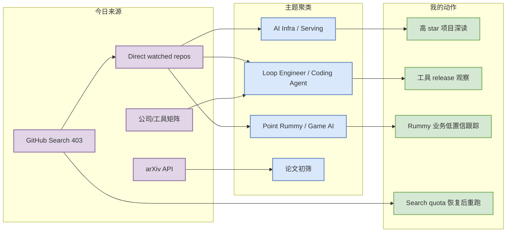
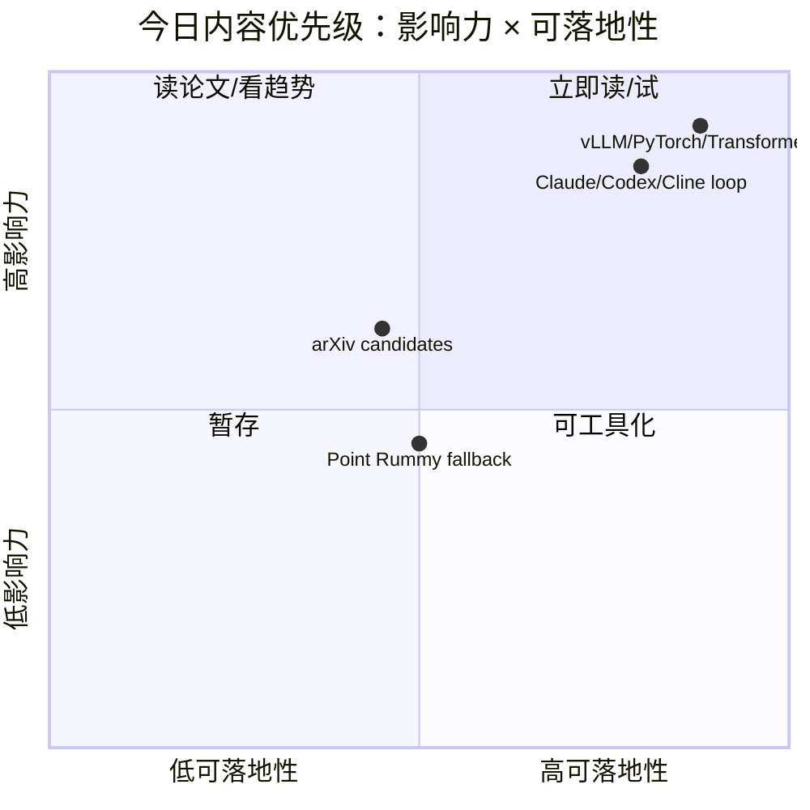

# AI Radar Daily - 2026-10-06

> 生成时间：2026-10-06 09:00 BJT
> 范围：AI Infra / LLM / RL / Game AI / 大厂博客 / 论文 / GitHub / 行业资讯
> Snapshot：`Automation/state/github-stars-2026-10-06.json`（GitHub Search 403；已 direct watched repo fallback）

## 0. 今日结论

- GitHub Search 今日从首批查询开始 403 rate limit；已保留当日 snapshot，并用 direct `/repos` watched fallback 补齐 AI Infra、Loop Engineer、Point Rummy 固定表。
- 今日最值得深读/试用：huggingface/transformers、anthropics/claude-code、anthropics/claude-code、openai/codex。
- Coding 工具矩阵已覆盖 Claude Code、Codex、Cursor、Windsurf、Copilot、Gemini、Qwen Code、Roo Code、Cline、Continue；GitHub release 可达项已用 direct API 低置信检查。
- 论文区已用 arXiv 类别约束查询；只作为摘要初筛，不伪造实验结论。
- 增长榜均标注 `direct watched repo fallback，非完整全网日增` 或冷启动代理，不能当作全网真实日增。

## 1. 今日态势图

## 2. 必读卡片区

> [!important] huggingface/transformers
> - 大类：GitHub
> - 小类：AI Infra
> - 重点：🤗 Transformers: the model-definition framework for state-of-the-art machine learning models in text, vision, audio, and multimodal models, for both inference and training. 
> - 为什么重要：高 star 基础设施项目，是 serving/training/LLM 工程长期参考。
> - 详情：[[GitHub/AIInfra/2026-10-06/huggingface-transformers]] / [网页详情](https://github.com/dyt27666-oss/AI-news-report-obsidians/blob/main/GitHub/AIInfra/2026-10-06/huggingface-transformers.md) / [原文](https://github.com/huggingface/transformers)

> [!tip] anthropics/claude-code
> - 大类：GitHub
> - 小类：Loop Engineer
> - 重点：Claude Code is an agentic coding tool that lives in your terminal, understands your codebase, and helps you code faster by executing routine tasks, explaining complex code, and handling git workflows - all through natural language commands.
> - 为什么重要：代表 coding-agent loop / harness / multi-agent 工程趋势。
> - 详情：[[GitHub/LoopEngineer/2026-10-06/anthropics-claude-code]] / [网页详情](https://github.com/dyt27666-oss/AI-news-report-obsidians/blob/main/GitHub/LoopEngineer/2026-10-06/anthropics-claude-code.md) / [原文](https://github.com/anthropics/claude-code)

> [!note] arXiv 今日论文初筛
> - 大类：论文
> - 小类：LLM / Agent / RL
> - 重点：PyINE: A Framework for Scalable Elicitation and Oversight via Code Execution
> - 为什么重要：用于发现 post-training、agent eval、serving 或 RL 的新方法。
> - 详情：[[Papers/arXiv/2026-10-06/pyine-a-framework-for-scalable-elicitation-and-oversight-via-code-execution]] / [网页详情](https://github.com/dyt27666-oss/AI-news-report-obsidians/blob/main/Papers/arXiv/2026-10-06/pyine-a-framework-for-scalable-elicitation-and-oversight-via-code-execution.md) / [原文](https://arxiv.org/abs/2610.04737v1)

## 3. 优先级矩阵

## 4. 分类清单

| 标签 | 大类 | 小类 | 标题 | 重点概括 | 为什么重要 | Obsidian 详情 | 网页详情 | 原文 |
|---|---|---|---|---|---|---|---|---|
| 必读 | GitHub | AI Infra | huggingface/transformers | watched direct fallback 高 star 项目 | serving/training 基础设施参考价值高 | [[GitHub/AIInfra/2026-10-06/huggingface-transformers]] | [网页详情](https://github.com/dyt27666-oss/AI-news-report-obsidians/blob/main/GitHub/AIInfra/2026-10-06/huggingface-transformers.md) | [原文](https://github.com/huggingface/transformers) |
| 必读 | GitHub | Loop Engineer | anthropics/claude-code | coding-agent loop 关键项目 | 可用于多 agent/harness/eval loop 设计 | [[GitHub/LoopEngineer/2026-10-06/anthropics-claude-code]] | [网页详情](https://github.com/dyt27666-oss/AI-news-report-obsidians/blob/main/GitHub/LoopEngineer/2026-10-06/anthropics-claude-code.md) | [原文](https://github.com/anthropics/claude-code) |
| 可 skim | 论文 | arXiv | PyINE: A Framework for Scalable Elicitation and Oversight via Code Execution | Reasoning models can remain capable of solving a task while still defaulting to  | 可能影响 LLM/Agent/RL 研究路线 | [[Papers/arXiv/2026-10-06/pyine-a-framework-for-scalable-elicitation-and-oversight-via-code-execution]] | [网页详情](https://github.com/dyt27666-oss/AI-news-report-obsidians/blob/main/Papers/arXiv/2026-10-06/pyine-a-framework-for-scalable-elicitation-and-oversight-via-code-execution.md) | [原文](https://arxiv.org/abs/2610.04737v1) |

## 5. 大厂资讯 / 工程博客 / Research

### 5.1 公司来源扫描矩阵

| 公司/实验室 | 来源/栏目 | 今日状态 | 高相关条数 | 代表条目 | 备注 |
|---|---|---|---:|---|---|
| OpenAI | News / Research | 低置信/已扫描 | 0 | [[Industry/Companies/2026-10-06/openai]] | 未确认高相关新项；保留原文入口 [source](https://openai.com/news/) |
| Anthropic | News / Research | 低置信/已扫描 | 0 | [[Industry/Companies/2026-10-06/anthropic]] | 未确认高相关新项；保留原文入口 [source](https://www.anthropic.com/news) |
| Google DeepMind | Blog / Research | 低置信/已扫描 | 0 | [[Industry/Companies/2026-10-06/google-deepmind]] | 未确认高相关新项；保留原文入口 [source](https://deepmind.google/discover/blog/) |
| Meta AI | Blog / Research | 低置信/已扫描 | 0 | [[Industry/Companies/2026-10-06/meta-ai]] | 未确认高相关新项；保留原文入口 [source](https://ai.meta.com/blog/) |
| NVIDIA | Technical Blog / AI | 低置信/已扫描 | 0 | [[Industry/Companies/2026-10-06/nvidia]] | 未确认高相关新项；保留原文入口 [source](https://developer.nvidia.com/blog/category/artificial-intelligence/) |
| Microsoft | Research AI | 低置信/已扫描 | 0 | [[Industry/Companies/2026-10-06/microsoft]] | 未确认高相关新项；保留原文入口 [source](https://www.microsoft.com/en-us/research/research-area/artificial-intelligence/) |
| Hugging Face | Blog / Papers / Releases | 低置信/已扫描 | 0 | [[Industry/Companies/2026-10-06/hugging-face]] | 未确认高相关新项；保留原文入口 [source](https://huggingface.co/blog) |
| 腾讯 | AI Lab / 技术博客 | 低置信/已扫描 | 0 | [[Industry/Companies/2026-10-06/tencent]] | 未确认高相关新项；保留原文入口 [source](https://ai.tencent.com/ailab/en/index) |
| 字节 | Seed / 技术博客 | 低置信/已扫描 | 0 | [[Industry/Companies/2026-10-06/bytedance]] | 未确认高相关新项；保留原文入口 [source](https://seed.bytedance.com/en/) |
| SpaceAI | Blog / News | 低置信/已扫描 | 0 | [[Industry/Companies/2026-10-06/spaceai]] | 未确认高相关新项；保留原文入口 [source](https://spaceai.com/) |

### 5.2 高相关大厂条目

| 标签 | 发布方/大厂 | 栏目/来源 | 标题 | 重点概括 | 工程/算法影响 | Obsidian 详情 | 网页详情 | 原文 |
|---|---|---|---|---|---|---|---|---|
| 低置信 | 多家公司 | 固定矩阵扫描 | 今日未确认高置信新增 | 动态网页/RSS 未完全解析；已创建每家公司扫描详情页 | 保持来源覆盖，避免漏扫 | [[Industry/Companies/2026-10-06/openai]] | [网页详情](https://github.com/dyt27666-oss/AI-news-report-obsidians/blob/main/Industry/Companies/2026-10-06/openai.md) | [OpenAI](https://openai.com/news/) |

## 6. GitHub 高 star Top 10

| 排名 | repo | stars | forks | language | updated_at | topics | 重点概括 | 是否值得试用 | Obsidian 详情 | 原文 |
|---:|---|---:|---:|---|---|---|---|---|---|---|
| 1 | huggingface/transformers | 166983 | 34757 | Python | 2026-10-06 | audio, deep-learning, deepseek, gemma, glm | 🤗 Transformers: the model-definition framework for state-of-the-art machine learning model | 值得试用 | [[GitHub/AIInfra/2026-10-06/huggingface-transformers]] | [GitHub](https://github.com/huggingface/transformers) |
| 2 | anthropics/claude-code | 149526 | 25573 | TypeScript | 2026-10-06 |  | Claude Code is an agentic coding tool that lives in your terminal, understands your codeba | 值得试用 | [[GitHub/LoopEngineer/2026-10-06/anthropics-claude-code]] | [GitHub](https://github.com/anthropics/claude-code) |
| 3 | openai/codex | 127952 | 20040 | Rust | 2026-10-06 |  | Lightweight coding agent that runs in your terminal | 值得试用 | [[GitHub/LoopEngineer/2026-10-06/openai-codex]] | [GitHub](https://github.com/openai/codex) |
| 4 | google-gemini/gemini-cli | 107239 | 14697 | TypeScript | 2026-10-05 | ai, ai-agents, cli, gemini, gemini-api | An open-source AI agent that brings the power of Gemini directly into your terminal. | 值得试用 | [[GitHub/LoopEngineer/2026-10-06/google-gemini-gemini-cli]] | [GitHub](https://github.com/google-gemini/gemini-cli) |
| 5 | pytorch/pytorch | 103780 | 31470 | Python | 2026-10-06 | autograd, deep-learning, gpu, machine-learning, neural-network | Tensors and Dynamic neural networks in Python with strong GPU acceleration | 值得试用 | [[GitHub/AIInfra/2026-10-06/pytorch-pytorch]] | [GitHub](https://github.com/pytorch/pytorch) |
| 6 | vllm-project/vllm | 93227 | 23021 | Python | 2026-10-06 | amd, blackwell, cuda, deepseek, deepseek-v3 | A high-throughput and memory-efficient inference and serving engine for LLMs | 可观察 | [[GitHub/AIInfra/2026-10-06/vllm-project-vllm]] | [GitHub](https://github.com/vllm-project/vllm) |
| 7 | OpenHands/OpenHands | 90061 | 11910 | TypeScript | 2026-10-06 | agent, artificial-intelligence, chatgpt, claude-ai, cli | 🙌 OpenHands: AI-Driven Development | 可观察 | [[GitHub/LoopEngineer/2026-10-06/openhands-openhands]] | [GitHub](https://github.com/OpenHands/OpenHands) |
| 8 | cline/cline | 69898 | 7607 | TypeScript | 2026-10-06 |  | Autonomous coding agent as an SDK, IDE extension, or CLI assistant. | 可观察 | [[GitHub/LoopEngineer/2026-10-06/cline-cline]] | [GitHub](https://github.com/cline/cline) |
| 9 | microsoft/autogen | 61266 | 9273 | Python | 2026-10-06 | agentic, agentic-agi, agents, ai, autogen | A programming framework for agentic AI | 可观察 | [[GitHub/LoopEngineer/2026-10-06/microsoft-autogen]] | [GitHub](https://github.com/microsoft/autogen) |
| 10 | crewAIInc/crewAI | 59376 | 8653 | Python | 2026-10-06 | agents, ai, ai-agents, aiagentframework, llms | Framework for orchestrating role-playing, autonomous AI agents. By fostering collaborative | 可观察 | [[GitHub/LoopEngineer/2026-10-06/crewaiinc-crewai]] | [GitHub](https://github.com/crewAIInc/crewAI) |

## 7. GitHub star 增长最快 Top 10

| 排名 | repo | stars_delta | stars | forks | language | updated_at | 增长依据 | 重点概括 | Obsidian 详情 | 原文 |
|---:|---|---:|---:|---:|---|---|---|---|---|---|
| 1 | Aider-AI/aider | 49383 | 49383 | 5033 | Python | 2026-10-06 | direct watched repo fallback，非完整全网日增 | aider is AI pair programming in your terminal | [[GitHub/LoopEngineer/2026-10-06/aider-ai-aider]] | [GitHub](https://github.com/Aider-AI/aider) |
| 2 | openai/codex | 30748 | 127952 | 20040 | Rust | 2026-10-06 | direct watched repo fallback，非完整全网日增 | Lightweight coding agent that runs in your terminal | [[GitHub/LoopEngineer/2026-10-06/openai-codex]] | [GitHub](https://github.com/openai/codex) |
| 3 | OpenHands/OpenHands | 13768 | 90061 | 11910 | TypeScript | 2026-10-06 | direct watched repo fallback，非完整全网日增 | 🙌 OpenHands: AI-Driven Development | [[GitHub/LoopEngineer/2026-10-06/openhands-openhands]] | [GitHub](https://github.com/OpenHands/OpenHands) |
| 4 | anthropics/claude-code | 12065 | 149526 | 25573 | TypeScript | 2026-10-06 | direct watched repo fallback，非完整全网日增 | Claude Code is an agentic coding tool that lives in your terminal, understands y | [[GitHub/LoopEngineer/2026-10-06/anthropics-claude-code]] | [GitHub](https://github.com/anthropics/claude-code) |
| 5 | vllm-project/vllm | 10923 | 93227 | 23021 | Python | 2026-10-06 | direct watched repo fallback，非完整全网日增 | A high-throughput and memory-efficient inference and serving engine for LLMs | [[GitHub/AIInfra/2026-10-06/vllm-project-vllm]] | [GitHub](https://github.com/vllm-project/vllm) |
| 6 | sgl-project/sglang | 7904 | 36802 | 9322 | Python | 2026-10-06 | direct watched repo fallback，非完整全网日增 | SGLang is a high-performance serving framework for large language models and mul | [[GitHub/AIInfra/2026-10-06/sgl-project-sglang]] | [GitHub](https://github.com/sgl-project/sglang) |
| 7 | langchain-ai/langgraph | 7896 | 42746 | 7267 | Python | 2026-10-06 | direct watched repo fallback，非完整全网日增 | Build resilient agents. | [[GitHub/LoopEngineer/2026-10-06/langchain-ai-langgraph]] | [GitHub](https://github.com/langchain-ai/langgraph) |
| 8 | crewAIInc/crewAI | 6250 | 59376 | 8653 | Python | 2026-10-06 | direct watched repo fallback，非完整全网日增 | Framework for orchestrating role-playing, autonomous AI agents. By fostering col | [[GitHub/LoopEngineer/2026-10-06/crewaiinc-crewai]] | [GitHub](https://github.com/crewAIInc/crewAI) |
| 9 | huggingface/transformers | 5547 | 166983 | 34757 | Python | 2026-10-06 | direct watched repo fallback，非完整全网日增 | 🤗 Transformers: the model-definition framework for state-of-the-art machine lear | [[GitHub/AIInfra/2026-10-06/huggingface-transformers]] | [GitHub](https://github.com/huggingface/transformers) |
| 10 | cline/cline | 5347 | 69898 | 7607 | TypeScript | 2026-10-06 | direct watched repo fallback，非完整全网日增 | Autonomous coding agent as an SDK, IDE extension, or CLI assistant. | [[GitHub/LoopEngineer/2026-10-06/cline-cline]] | [GitHub](https://github.com/cline/cline) |

## 8. Coding 工具 / AI 工具功能更新

### 8.1 Coding 工具扫描矩阵

| 工具 | 厂商 | 来源类型 | 今日状态 | 代表更新 | 对我的影响 | 原文 |
|---|---|---|---|---|---|---|
| Claude Code | Anthropic | Changelog / Release Notes | 已扫描/低置信 | release API 失败 | 关注 agent/MCP/IDE/权限/上下文变化 | [source](https://docs.anthropic.com/en/release-notes/claude-code) |
| OpenAI Codex | OpenAI | Changelog / Docs | 已扫描/低置信 | release API 失败 | 关注 agent/MCP/IDE/权限/上下文变化 | [source](https://developers.openai.com/codex/changelog) |
| Cursor | Cursor | Changelog | 已扫描/低置信 | 未发现高置信新 release；见来源 | 关注 agent/MCP/IDE/权限/上下文变化 | [source](https://cursor.com/changelog) |
| Windsurf | Windsurf | Changelog | 已扫描/低置信 | 未发现高置信新 release；见来源 | 关注 agent/MCP/IDE/权限/上下文变化 | [source](https://windsurf.com/changelog) |
| GitHub Copilot | GitHub | Changelog / Blog | 已扫描/低置信 | 未发现高置信新 release；见来源 | 关注 agent/MCP/IDE/权限/上下文变化 | [source](https://github.blog/changelog/label/copilot/) |
| Gemini Code Assist | Google | Release Notes | 已扫描/低置信 | release API 失败 | 关注 agent/MCP/IDE/权限/上下文变化 | [source](https://cloud.google.com/gemini/docs/codeassist/release-notes) |
| Qwen Code | Alibaba/Qwen | GitHub Releases | 已扫描/低置信 | release API 失败 | 关注 agent/MCP/IDE/权限/上下文变化 | [source](https://github.com/QwenLM/qwen-code/releases) |
| Roo Code | Roo Code | GitHub Releases | 已扫描/低置信 | release API 失败 | 关注 agent/MCP/IDE/权限/上下文变化 | [source](https://github.com/RooCodeInc/Roo-Code/releases) |
| Cline | Cline | GitHub Releases | 已扫描/低置信 | release API 失败 | 关注 agent/MCP/IDE/权限/上下文变化 | [source](https://github.com/cline/cline/releases) |
| Continue | Continue | GitHub Releases | 已扫描/低置信 | release API 失败 | 关注 agent/MCP/IDE/权限/上下文变化 | [source](https://github.com/continuedev/continue/releases) |

### 8.2 高相关工具更新

| 标签 | 工具/厂商 | 来源类型 | 标题/功能 | 重点概括 | 对 AI coding 工作流的影响 | Obsidian 详情 | 网页详情 | 原文 |
|---|---|---|---|---|---|---|---|---|
| 必读 | Claude Code / Anthropic | Changelog / Release Notes | 工具扫描详情 | 关注 Claude Code release notes 中的权限、MCP、agent loop、CLI/TUI 变化 | 直接影响多 agent 编排和代码审查流程 | [[Industry/Tools/2026-10-06/claude-code]] | [网页详情](https://github.com/dyt27666-oss/AI-news-report-obsidians/blob/main/Industry/Tools/2026-10-06/claude-code.md) | [原文](https://docs.anthropic.com/en/release-notes/claude-code) |
| 必读 | OpenAI Codex | Changelog / Docs | 工具扫描详情 | 关注 Codex CLI/IDE/remote execution 更新 | 影响 AI coding worker 与远程执行工作流 | [[Industry/Tools/2026-10-06/openai-codex]] | [网页详情](https://github.com/dyt27666-oss/AI-news-report-obsidians/blob/main/Industry/Tools/2026-10-06/openai-codex.md) | [原文](https://developers.openai.com/codex/changelog) |

## 9. Point Rummy / Indian Rummy 业务主题

### 9.1 GitHub 候选

| 标签 | repo | stars | forks | language | updated_at | 重点概括 | 业务可用性 | Obsidian 详情 | 原文 |
|---|---|---:|---:|---|---|---|---|---|---|
| 后续 | google-deepmind/open_spiel | 5518 | 1192 | C++ | 2026-10-05 | OpenSpiel is a collection of environments and algorithms for research in general reinforce | 可参考规则/博弈环境/评测，低置信 | [[GitHub/PointRummy/2026-10-06/google-deepmind-open-spiel]] | [GitHub](https://github.com/google-deepmind/open_spiel) |
| 后续 | datamllab/rlcard | 3571 | 751 | Python | 2026-10-05 | Reinforcement Learning / AI Bots in Card (Poker) Games - Blackjack, Leduc, Texas, DouDizhu | 可参考规则/博弈环境/评测，低置信 | [[GitHub/PointRummy/2026-10-06/datamllab-rlcard]] | [GitHub](https://github.com/datamllab/rlcard) |

### 9.2 论文 / 资料候选

| 标签 | 来源 | 标题 | 作者/机构 | 重点概括 | 对 Point Rummy 业务有什么用 | Obsidian 详情 | 原文 |
|---|---|---|---|---|---|---|---|
| 低置信 | arXiv / OpenSpiel / RLCard | 今日未发现高置信 Rummy 专项新论文 | 多来源 | 可参考 imperfect-information card game、MCTS、RLCard/OpenSpiel | 用于规则建模、bot 策略、仿真评测 | [[GitHub/PointRummy/2026-10-06/google-deepmind-open-spiel]] | [OpenSpiel](https://github.com/google-deepmind/open_spiel) |

### 9.3 业务可用性判断

| 方向 | 今日信号 | 可用性 | 下一步 |
|---|---|---|---|
| 规则引擎 / 计分 | GitHub direct fallback 包含 card-game/RL 环境 | 中：可抽象状态与动作空间 | 先整理 Indian Rummy 规则差异 |
| Bot / RL Agent | RLCard/OpenSpiel 可迁移 imperfect information 思路 | 中低：需自建环境 | 建 self-play baseline |
| 仿真 / 评测 | 可复用 evaluator/harness 思路 | 中 | 定义赢率、合法动作率、回合时长指标 |

## 10. Loop Engineer / Loop Engineering 主题

### 10.1 Loop Engineer GitHub 高 star Top 10

| 排名 | repo | stars | forks | language | updated_at | topics | 重点概括 | 是否值得试用 | Obsidian 详情 | 原文 |
|---:|---|---:|---:|---|---|---|---|---|---|---|
| 1 | anthropics/claude-code | 149526 | 25573 | TypeScript | 2026-10-06 |  | Claude Code is an agentic coding tool that lives in your terminal, understands your codeba | 值得试用 | [[GitHub/LoopEngineer/2026-10-06/anthropics-claude-code]] | [GitHub](https://github.com/anthropics/claude-code) |
| 2 | openai/codex | 127952 | 20040 | Rust | 2026-10-06 |  | Lightweight coding agent that runs in your terminal | 值得试用 | [[GitHub/LoopEngineer/2026-10-06/openai-codex]] | [GitHub](https://github.com/openai/codex) |
| 3 | google-gemini/gemini-cli | 107239 | 14697 | TypeScript | 2026-10-05 | ai, ai-agents, cli, gemini, gemini-api | An open-source AI agent that brings the power of Gemini directly into your terminal. | 值得试用 | [[GitHub/LoopEngineer/2026-10-06/google-gemini-gemini-cli]] | [GitHub](https://github.com/google-gemini/gemini-cli) |
| 4 | OpenHands/OpenHands | 90061 | 11910 | TypeScript | 2026-10-06 | agent, artificial-intelligence, chatgpt, claude-ai, cli | 🙌 OpenHands: AI-Driven Development | 值得试用 | [[GitHub/LoopEngineer/2026-10-06/openhands-openhands]] | [GitHub](https://github.com/OpenHands/OpenHands) |
| 5 | cline/cline | 69898 | 7607 | TypeScript | 2026-10-06 |  | Autonomous coding agent as an SDK, IDE extension, or CLI assistant. | 值得试用 | [[GitHub/LoopEngineer/2026-10-06/cline-cline]] | [GitHub](https://github.com/cline/cline) |
| 6 | microsoft/autogen | 61266 | 9273 | Python | 2026-10-06 | agentic, agentic-agi, agents, ai, autogen | A programming framework for agentic AI | 可观察 | [[GitHub/LoopEngineer/2026-10-06/microsoft-autogen]] | [GitHub](https://github.com/microsoft/autogen) |
| 7 | crewAIInc/crewAI | 59376 | 8653 | Python | 2026-10-06 | agents, ai, ai-agents, aiagentframework, llms | Framework for orchestrating role-playing, autonomous AI agents. By fostering collaborative | 可观察 | [[GitHub/LoopEngineer/2026-10-06/crewaiinc-crewai]] | [GitHub](https://github.com/crewAIInc/crewAI) |
| 8 | Aider-AI/aider | 49383 | 5033 | Python | 2026-10-06 | anthropic, chatgpt, claude-3, cli, command-line | aider is AI pair programming in your terminal | 可观察 | [[GitHub/LoopEngineer/2026-10-06/aider-ai-aider]] | [GitHub](https://github.com/Aider-AI/aider) |
| 9 | langchain-ai/langgraph | 42746 | 7267 | Python | 2026-10-06 | agents, ai, ai-agents, chatgpt, deepagents | Build resilient agents. | 可观察 | [[GitHub/LoopEngineer/2026-10-06/langchain-ai-langgraph]] | [GitHub](https://github.com/langchain-ai/langgraph) |
| 10 | continuedev/continue | 36125 | 5456 | TypeScript | 2026-10-06 | agent, ai, cli, developer-tools, open-source | open-source coding agent | 可观察 | [[GitHub/LoopEngineer/2026-10-06/continuedev-continue]] | [GitHub](https://github.com/continuedev/continue) |

### 10.2 Loop Engineer GitHub star 增长最快 Top 10

| 排名 | repo | stars_delta | stars | forks | language | updated_at | 增长依据 | 重点概括 | Obsidian 详情 | 原文 |
|---:|---|---:|---:|---:|---|---|---|---|---|---|
| 1 | Aider-AI/aider | 49383 | 49383 | 5033 | Python | 2026-10-06 | direct watched repo fallback，非完整全网日增 | aider is AI pair programming in your terminal | [[GitHub/LoopEngineer/2026-10-06/aider-ai-aider]] | [GitHub](https://github.com/Aider-AI/aider) |
| 2 | openai/codex | 30748 | 127952 | 20040 | Rust | 2026-10-06 | direct watched repo fallback，非完整全网日增 | Lightweight coding agent that runs in your terminal | [[GitHub/LoopEngineer/2026-10-06/openai-codex]] | [GitHub](https://github.com/openai/codex) |
| 3 | OpenHands/OpenHands | 13768 | 90061 | 11910 | TypeScript | 2026-10-06 | direct watched repo fallback，非完整全网日增 | 🙌 OpenHands: AI-Driven Development | [[GitHub/LoopEngineer/2026-10-06/openhands-openhands]] | [GitHub](https://github.com/OpenHands/OpenHands) |
| 4 | anthropics/claude-code | 12065 | 149526 | 25573 | TypeScript | 2026-10-06 | direct watched repo fallback，非完整全网日增 | Claude Code is an agentic coding tool that lives in your terminal, understands y | [[GitHub/LoopEngineer/2026-10-06/anthropics-claude-code]] | [GitHub](https://github.com/anthropics/claude-code) |
| 5 | langchain-ai/langgraph | 7896 | 42746 | 7267 | Python | 2026-10-06 | direct watched repo fallback，非完整全网日增 | Build resilient agents. | [[GitHub/LoopEngineer/2026-10-06/langchain-ai-langgraph]] | [GitHub](https://github.com/langchain-ai/langgraph) |
| 6 | crewAIInc/crewAI | 6250 | 59376 | 8653 | Python | 2026-10-06 | direct watched repo fallback，非完整全网日增 | Framework for orchestrating role-playing, autonomous AI agents. By fostering col | [[GitHub/LoopEngineer/2026-10-06/crewaiinc-crewai]] | [GitHub](https://github.com/crewAIInc/crewAI) |
| 7 | cline/cline | 5347 | 69898 | 7607 | TypeScript | 2026-10-06 | direct watched repo fallback，非完整全网日增 | Autonomous coding agent as an SDK, IDE extension, or CLI assistant. | [[GitHub/LoopEngineer/2026-10-06/cline-cline]] | [GitHub](https://github.com/cline/cline) |
| 8 | microsoft/autogen | 2468 | 61266 | 9273 | Python | 2026-10-06 | direct watched repo fallback，非完整全网日增 | A programming framework for agentic AI | [[GitHub/LoopEngineer/2026-10-06/microsoft-autogen]] | [GitHub](https://github.com/microsoft/autogen) |
| 9 | QwenLM/qwen-code | 2365 | 28321 | 3163 | TypeScript | 2026-10-06 | direct watched repo fallback，非完整全网日增 | An open-source AI coding agent that lives in your terminal. | [[GitHub/LoopEngineer/2026-10-06/qwenlm-qwen-code]] | [GitHub](https://github.com/QwenLM/qwen-code) |
| 10 | google-gemini/gemini-cli | 1313 | 107239 | 14697 | TypeScript | 2026-10-05 | direct watched repo fallback，非完整全网日增 | An open-source AI agent that brings the power of Gemini directly into your termi | [[GitHub/LoopEngineer/2026-10-06/google-gemini-gemini-cli]] | [GitHub](https://github.com/google-gemini/gemini-cli) |

### 10.3 Loop Engineering 方法信号

| 标签 | 来源 | 标题 | 重点概括 | 对 AI coding 工作流的影响 | Obsidian 详情 | 原文 |
|---|---|---|---|---|---|---|
| 必读 | GitHub direct fallback | Coding agent loop watched set | Claude Code/Codex/Cline/Roo/Continue/Qwen/OpenHands/LangGraph 等构成工具生态扫描 | 可用于 tmux 多 agent、PR review、eval loop 和权限模式设计 | [[GitHub/LoopEngineer/2026-10-06/anthropics-claude-code]] | [GitHub](https://github.com/anthropics/claude-code) |

## 11. 论文

### 11.1 LLM / Agent / RL 初筛

| 标签 | 论文来源 | 论文 | 作者/机构 | 重点概括 | 工程/研究价值 | Obsidian 详情 | 网页详情 | PDF/原文 |
|---|---|---|---|---|---|---|---|---|
| 可 skim | arXiv / 预印本 | PyINE: A Framework for Scalable Elicitation and Oversight via Code Execution | Pierre-Luc St-Charles, Alessandro Palmas, Damiano Fornasiere, Storm Lei | Reasoning models can remain capable of solving a task while still defaulting to cheaper but misleadi | 先 skim，确认是否影响 LLM/Agent/RL 工程 | [[Papers/arXiv/2026-10-06/pyine-a-framework-for-scalable-elicitation-and-oversight-via-code-execution]] | [网页详情](https://github.com/dyt27666-oss/AI-news-report-obsidians/blob/main/Papers/arXiv/2026-10-06/pyine-a-framework-for-scalable-elicitation-and-oversight-via-code-execution.md) | [abs](https://arxiv.org/abs/2610.04737v1) / [pdf](https://arxiv.org/pdf/2610.04737v1) |
| 可 skim | arXiv / 预印本 | The Numerical Linear Algebra of Large Language Models | Abdelkader Baggag, Yousef Saad | Numerical Linear Algebra (NLA) has consistently played a vital role in advancing science by providin | 先 skim，确认是否影响 LLM/Agent/RL 工程 | [[Papers/arXiv/2026-10-06/the-numerical-linear-algebra-of-large-language-models]] | [网页详情](https://github.com/dyt27666-oss/AI-news-report-obsidians/blob/main/Papers/arXiv/2026-10-06/the-numerical-linear-algebra-of-large-language-models.md) | [abs](https://arxiv.org/abs/2610.04631v1) / [pdf](https://arxiv.org/pdf/2610.04631v1) |
| 可 skim | arXiv / 预印本 | Robot Learning with Visual Predicted Force | Haonan Chen, Feiyang Wu, Yuxiang Ma, Mustafa Mete | Force-aware manipulation typically relies on specialized force or tactile sensors. We show that forc | 先 skim，确认是否影响 LLM/Agent/RL 工程 | [[Papers/arXiv/2026-10-06/robot-learning-with-visual-predicted-force]] | [网页详情](https://github.com/dyt27666-oss/AI-news-report-obsidians/blob/main/Papers/arXiv/2026-10-06/robot-learning-with-visual-predicted-force.md) | [abs](https://arxiv.org/abs/2610.04741v1) / [pdf](https://arxiv.org/pdf/2610.04741v1) |
| 可 skim | arXiv / 预印本 | Toward a Locally Deployable Agentic Co-Scientist: Small-Model Planning for Early-Stage Drug Discovery | Tian Liang, Jiayu Chang, Alejandro F. Frangi, Mobarak I. Hoque | Early-stage computational drug discovery requires coordinating heterogeneous scientific tools across | 先 skim，确认是否影响 LLM/Agent/RL 工程 | [[Papers/arXiv/2026-10-06/toward-a-locally-deployable-agentic-co-scientist-small-model-planning-for-early-stage-drug-discovery]] | [网页详情](https://github.com/dyt27666-oss/AI-news-report-obsidians/blob/main/Papers/arXiv/2026-10-06/toward-a-locally-deployable-agentic-co-scientist-small-model-planning-for-early-stage-drug-discovery.md) | [abs](https://arxiv.org/abs/2610.04740v1) / [pdf](https://arxiv.org/pdf/2610.04740v1) |
| 可 skim | arXiv / 预印本 | Latent-Lagrangian Neural Networks for Reduced Order Modeling of Non-autonomous Nonlinear Dynamical Systems | Anand Kumar Agrawal, Anders Thorin | This work proposes a latent Lagrangian-based framework for reduced-order modelling of forced nonline | 先 skim，确认是否影响 LLM/Agent/RL 工程 | [[Papers/arXiv/2026-10-06/latent-lagrangian-neural-networks-for-reduced-order-modeling-of-non-autonomous-nonlinear-dynamical-systems]] | [网页详情](https://github.com/dyt27666-oss/AI-news-report-obsidians/blob/main/Papers/arXiv/2026-10-06/latent-lagrangian-neural-networks-for-reduced-order-modeling-of-non-autonomous-nonlinear-dynamical-systems.md) | [abs](https://arxiv.org/abs/2610.04723v1) / [pdf](https://arxiv.org/pdf/2610.04723v1) |

## 12. 资讯 / 其他 GitHub 项目

### 12.1 Snapshot 与 fallback 说明

| 标签 | 来源 | 标题 | 重点概括 | 对我有什么用 | Obsidian 详情 | 网页详情 | 原文 |
|---|---|---|---|---|---|---|---|
| 必读 | GitHub API | 当日 snapshot | `Automation/state/github-stars-2026-10-06.json` 已保存；Search 403，direct watched fallback 补齐 | 明天可继续作为 baseline，但增长不是全网日增 | [[GitHub/AIInfra/2026-10-06/huggingface-transformers]] | [snapshot](https://github.com/dyt27666-oss/AI-news-report-obsidians/blob/main/Automation/state/github-stars-2026-10-06.json) | [GitHub API](https://api.github.com) |

## 13. 按主题索引

### AI Infra / Serving / Training

- [[GitHub/AIInfra/2026-10-06/huggingface-transformers]] - 高 star AI Infra 参考项目
- [[GitHub/LoopEngineer/2026-10-06/anthropics-claude-code]] - serving/training 生态观察

### LLM / Agent / RAG / Evaluation

- [[GitHub/LoopEngineer/2026-10-06/anthropics-claude-code]] - coding-agent loop
- [[Industry/Tools/2026-10-06/claude-code]] - Claude Code 工具扫描

### RL / Game AI / World Model

- [[Papers/arXiv/2026-10-06/pyine-a-framework-for-scalable-elicitation-and-oversight-via-code-execution]] - arXiv 初筛论文

### Point Rummy / Indian Rummy

- [[GitHub/PointRummy/2026-10-06/google-deepmind-open-spiel]] - Rummy/Game AI fallback 候选

### Loop Engineer / Coding Agent Loop

- [[GitHub/LoopEngineer/2026-10-06/openai-codex]] - agent loop 工具生态

### 公司 / 实验室

- OpenAI: [[Industry/Companies/2026-10-06/openai]]
- Anthropic: [[Industry/Companies/2026-10-06/anthropic]]
- DeepMind: [[Industry/Companies/2026-10-06/google-deepmind]]
- Meta: [[Industry/Companies/2026-10-06/meta-ai]]
- NVIDIA: [[Industry/Companies/2026-10-06/nvidia]]
- 腾讯 / 字节 / 国内大厂: [[Industry/Companies/2026-10-06/tencent]] / [[Industry/Companies/2026-10-06/bytedance]]

## 14. 值得后续深挖

| 标签 | 大类 | 小类 | 标题 | 后续动作 | Obsidian 详情 | 原文 |
|---|---|---|---|---|---|---|
| 必读 | GitHub | AI Infra | huggingface/transformers | 看 README/benchmark/release | [[GitHub/AIInfra/2026-10-06/huggingface-transformers]] | [GitHub](https://github.com/huggingface/transformers) |
| 必读 | 工具 | Coding Agent | Claude Code / Codex | 核对最新 changelog | [[Industry/Tools/2026-10-06/claude-code]] | [Claude Code](https://docs.anthropic.com/en/release-notes/claude-code) |
| 后续 | 业务 | Point Rummy | RLCard/OpenSpiel/Rummy 候选 | 设计 Rummy self-play env/evaluator | [[GitHub/PointRummy/2026-10-06/google-deepmind-open-spiel]] | [OpenSpiel](https://github.com/google-deepmind/open_spiel) |

## 15. 采集失败或低置信来源

- GitHub Search API：403 rate limit exceeded；已保留 snapshot 并使用 direct watched repo fallback。
- 公司博客/工具 changelog：多数动态网页未做全文抽取，矩阵标注为低置信/已扫描。
- 增长榜：非完整全网日增，不应当解读为 GitHub 全站真实增长排名。
- arXiv：按类别约束查询，若标题/摘要弱相关应后续人工 skim。

## 16. 归档标签

#ai-radar #daily #ai-infra #llm #rl #point-rummy #loop-engineering
