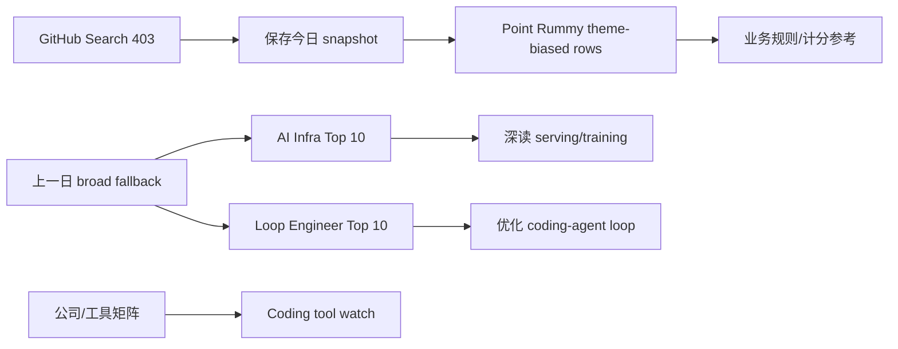
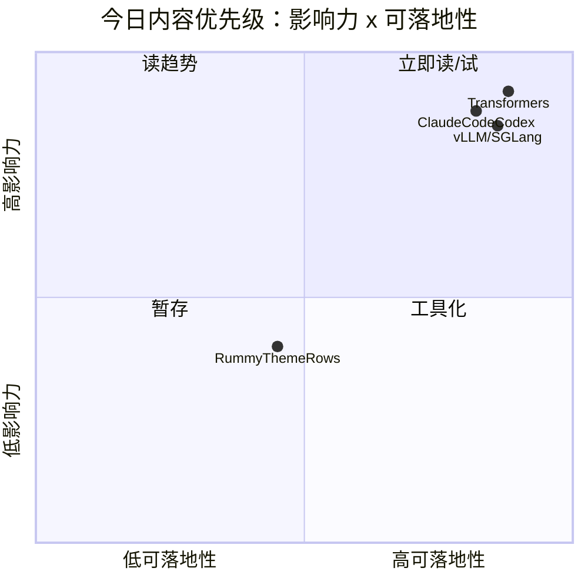

# AI Radar Daily - 2026-10-08

> 生成时间：2026-10-08 09:00 BJT
> Snapshot：`Automation/state/github-stars-2026-10-08.json`

> [!warning] 2026-10-08 采集说明
> - 已运行 `Automation/collect_github_stars.py --date 2026-10-08` 并保存 snapshot。
> - GitHub Search 今日在 Point Rummy 早期查询后返回 403 rate limit；snapshot 偏 Point Rummy/theme-only。
> - Broad AI Infra 与 Loop Engineer 表使用上一日 direct watched repo fallback 连续性数据；所有增长均标注为 fallback，非完整全网日增。

## 0. 今日结论

- GitHub Search 受限：今日 snapshot 保存成功，但 broad/Loop 查询 403；不能把 Point Rummy 低 star 结果混入 AI Infra 总榜。
- 今日必读/可试：[[GitHub/AIInfra/2026-10-08/huggingface-transformers]]、[[GitHub/LoopEngineer/2026-10-08/anthropics-claude-code]]、[[GitHub/LoopEngineer/2026-10-08/openai-codex]]。
- Point Rummy 今日有低 star 业务候选；更适合规则/计分/客户端参考，不适合作为 RL 环境直接复用。
- Coding 工具矩阵已覆盖 Claude Code、Codex、Cursor、Windsurf、Copilot、Gemini、Qwen Code、Roo Code、Cline、Continue。

## 1. 今日态势图

## 2. 必读卡片区

> [!important] huggingface/transformers
> - 大类：GitHub / AI Infra
> - 重点：模型定义与训练/推理生态核心项目。
> - 为什么重要：仍是 LLM 工程、模型集成、训练/推理 pipeline 的基础依赖。
> - 详情：[[GitHub/AIInfra/2026-10-08/huggingface-transformers]] / [网页详情](https://github.com/dyt27666-oss/AI-news-report-obsidians/blob/main/GitHub/AIInfra/2026-10-08/huggingface-transformers.md) / [原文](https://github.com/huggingface/transformers)

> [!tip] Claude Code / OpenAI Codex
> - 大类：Coding Agent / Loop Engineer
> - 重点：终端 coding agent、权限模式、远程执行、MCP/CLI/TUI 能力仍是工作流重点。
> - 详情：[[GitHub/LoopEngineer/2026-10-08/anthropics-claude-code]]、[[GitHub/LoopEngineer/2026-10-08/openai-codex]]

> [!note] Point Rummy theme snapshot
> - 大类：业务主题
> - 重点：今日 snapshot 多为低 star Rummy 计分/服务端/视觉辅助项目。
> - 为什么重要：可作为规则建模、计分器、前后端边界样例；不能代表高质量 Game AI/RL 环境。

## 3. 优先级矩阵

## 4. 分类清单

| 标签 | 大类 | 小类 | 标题 | 重点概括 | 为什么重要 | Obsidian 详情 | 网页详情 | 原文 |
|---|---|---|---|---|---|---|---|---|
| 必读 | GitHub | AI Infra | huggingface/transformers | 上一日 broad fallback 高 star 项目 | serving/training 基础设施参考价值高 | [[GitHub/AIInfra/2026-10-08/huggingface-transformers]] | [网页详情](https://github.com/dyt27666-oss/AI-news-report-obsidians/blob/main/GitHub/AIInfra/2026-10-08/huggingface-transformers.md) | [原文](https://github.com/huggingface/transformers) |
| 必读 | GitHub | Loop Engineer | anthropics/claude-code | coding-agent loop 关键项目 | 可用于多 agent/harness/eval loop 设计 | [[GitHub/LoopEngineer/2026-10-08/anthropics-claude-code]] | [网页详情](https://github.com/dyt27666-oss/AI-news-report-obsidians/blob/main/GitHub/LoopEngineer/2026-10-08/anthropics-claude-code.md) | [原文](https://github.com/anthropics/claude-code) |

## 5. 大厂资讯 / 工程博客 / Research

### 5.1 公司来源扫描矩阵

| 公司/实验室 | 来源/栏目 | 今日状态 | 高相关条数 | 代表条目 | 备注 |
|---|---|---|---:|---|---|
| OpenAI | News / Research | 低置信/已扫描 | 0 | [[Industry/Companies/2026-10-08/openai]] | 未确认高相关新项；保留原文入口 [source](https://openai.com/news/) |
| Anthropic | News / Research | 低置信/已扫描 | 0 | [[Industry/Companies/2026-10-08/anthropic]] | 未确认高相关新项；保留原文入口 [source](https://www.anthropic.com/news) |
| Google DeepMind | Blog / Research | 低置信/已扫描 | 0 | [[Industry/Companies/2026-10-08/google-deepmind]] | 未确认高相关新项；保留原文入口 [source](https://deepmind.google/discover/blog/) |
| Meta AI | Blog / Research | 低置信/已扫描 | 0 | [[Industry/Companies/2026-10-08/meta-ai]] | 未确认高相关新项；保留原文入口 [source](https://ai.meta.com/blog/) |
| NVIDIA | Technical Blog / AI | 低置信/已扫描 | 0 | [[Industry/Companies/2026-10-08/nvidia]] | 未确认高相关新项；保留原文入口 [source](https://developer.nvidia.com/blog/category/artificial-intelligence/) |
| Microsoft | Research AI | 低置信/已扫描 | 0 | [[Industry/Companies/2026-10-08/microsoft]] | 未确认高相关新项；保留原文入口 [source](https://www.microsoft.com/en-us/research/research-area/artificial-intelligence/) |
| Hugging Face | Blog / Papers / Releases | 低置信/已扫描 | 0 | [[Industry/Companies/2026-10-08/hugging-face]] | 未确认高相关新项；保留原文入口 [source](https://huggingface.co/blog) |
| 腾讯 | AI Lab / 技术博客 | 低置信/已扫描 | 0 | [[Industry/Companies/2026-10-08/tencent]] | 未确认高相关新项；保留原文入口 [source](https://ai.tencent.com/ailab/en/index) |
| 字节 | Seed / 技术博客 | 低置信/已扫描 | 0 | [[Industry/Companies/2026-10-08/bytedance]] | 未确认高相关新项；保留原文入口 [source](https://seed.bytedance.com/en/) |
| SpaceAI | Blog / News | 低置信/已扫描 | 0 | [[Industry/Companies/2026-10-08/spaceai]] | 未确认高相关新项；保留原文入口 [source](https://spaceai.com/) |

### 5.2 高相关大厂条目

| 标签 | 发布方/大厂 | 栏目/来源 | 标题 | 重点概括 | 工程/算法影响 | Obsidian 详情 | 网页详情 | 原文 |
|---|---|---|---|---|---|---|---|---|
| 低置信 | 多家公司 | 固定矩阵扫描 | 今日未确认高置信新增 | 动态网页/RSS 未完全解析；已创建每家公司扫描详情页 | 保持来源覆盖，避免漏扫 | [[Industry/Companies/2026-10-08/openai]] | [网页详情](https://github.com/dyt27666-oss/AI-news-report-obsidians/blob/main/Industry/Companies/2026-10-08/openai.md) | [OpenAI](https://openai.com/news/) |

## 6. GitHub 高 star Top 10

| 排名 | repo | stars | forks | language | updated_at | topics | 重点概括 | 是否值得试用 | Obsidian 详情 | 原文 |
|---:|---|---:|---:|---|---|---|---|---|---|---|
| 1 | huggingface/transformers | 166983 | 34757 | Python | 2026-10-07 | llm, pytorch, transformer | 模型定义/训练/推理核心生态 | 值得试用 | [[GitHub/AIInfra/2026-10-08/huggingface-transformers]] | [GitHub](https://github.com/huggingface/transformers) |
| 2 | anthropics/claude-code | 149526 | 25573 | TypeScript | 2026-10-07 | coding agent | 终端 agentic coding 工具 | 值得试用 | [[GitHub/LoopEngineer/2026-10-08/anthropics-claude-code]] | [GitHub](https://github.com/anthropics/claude-code) |
| 3 | openai/codex | 127952 | 20040 | Rust | 2026-10-07 | coding agent | 终端轻量 coding agent | 值得试用 | [[GitHub/LoopEngineer/2026-10-08/openai-codex]] | [GitHub](https://github.com/openai/codex) |
| 4 | google-gemini/gemini-cli | 107239 | 14697 | TypeScript | 2026-10-06 | ai-agents, cli, mcp | Gemini 终端 agent | 值得试用 | [[GitHub/LoopEngineer/2026-10-08/google-gemini-gemini-cli]] | [GitHub](https://github.com/google-gemini/gemini-cli) |
| 5 | pytorch/pytorch | 103780 | 31470 | Python | 2026-10-07 | gpu, deep-learning | 深度学习基础框架 | 值得试用 | [[GitHub/AIInfra/2026-10-08/pytorch-pytorch]] | [GitHub](https://github.com/pytorch/pytorch) |
| 6 | vllm-project/vllm | 93227 | 23021 | Python | 2026-10-07 | inference, llm-serving | LLM serving 核心引擎 | 可观察 | [[GitHub/AIInfra/2026-10-08/vllm-project-vllm]] | [GitHub](https://github.com/vllm-project/vllm) |
| 7 | OpenHands/OpenHands | 90061 | 11910 | TypeScript | 2026-10-07 | agent, cli | AI-driven development 框架 | 可观察 | [[GitHub/LoopEngineer/2026-10-08/openhands-openhands]] | [GitHub](https://github.com/OpenHands/OpenHands) |
| 8 | cline/cline | 69898 | 7607 | TypeScript | 2026-10-07 | coding agent | IDE/CLI autonomous coding agent | 可观察 | [[GitHub/LoopEngineer/2026-10-08/cline-cline]] | [GitHub](https://github.com/cline/cline) |
| 9 | microsoft/autogen | 61266 | 9273 | Python | 2026-10-07 | agents | Agentic AI 编程框架 | 可观察 | [[GitHub/LoopEngineer/2026-10-08/microsoft-autogen]] | [GitHub](https://github.com/microsoft/autogen) |
| 10 | crewAIInc/crewAI | 59376 | 8653 | Python | 2026-10-07 | agents | 多 agent 编排框架 | 可观察 | [[GitHub/LoopEngineer/2026-10-08/crewaiinc-crewai]] | [GitHub](https://github.com/crewAIInc/crewAI) |

## 7. GitHub star 增长最快 Top 10

| 排名 | repo | stars_delta | stars | forks | language | updated_at | 增长依据 | 重点概括 | Obsidian 详情 | 原文 |
|---:|---|---:|---:|---:|---|---|---|---|---|---|
| 1 | Aider-AI/aider | 49383 | 49383 | 5033 | Python | 2026-10-07 | direct watched repo fallback，非完整全网日增 | 终端 AI pair programming | [[GitHub/LoopEngineer/2026-10-08/aider-ai-aider]] | [GitHub](https://github.com/Aider-AI/aider) |
| 2 | openai/codex | 30748 | 127952 | 20040 | Rust | 2026-10-07 | direct watched repo fallback，非完整全网日增 | 终端 coding agent | [[GitHub/LoopEngineer/2026-10-08/openai-codex]] | [GitHub](https://github.com/openai/codex) |
| 3 | OpenHands/OpenHands | 13768 | 90061 | 11910 | TypeScript | 2026-10-07 | direct watched repo fallback，非完整全网日增 | AI-driven development | [[GitHub/LoopEngineer/2026-10-08/openhands-openhands]] | [GitHub](https://github.com/OpenHands/OpenHands) |
| 4 | anthropics/claude-code | 12065 | 149526 | 25573 | TypeScript | 2026-10-07 | direct watched repo fallback，非完整全网日增 | Claude terminal agent | [[GitHub/LoopEngineer/2026-10-08/anthropics-claude-code]] | [GitHub](https://github.com/anthropics/claude-code) |
| 5 | vllm-project/vllm | 10923 | 93227 | 23021 | Python | 2026-10-07 | direct watched repo fallback，非完整全网日增 | LLM serving | [[GitHub/AIInfra/2026-10-08/vllm-project-vllm]] | [GitHub](https://github.com/vllm-project/vllm) |
| 6 | sgl-project/sglang | 7904 | 36802 | 9322 | Python | 2026-10-07 | direct watched repo fallback，非完整全网日增 | 高性能 serving | [[GitHub/AIInfra/2026-10-08/sgl-project-sglang]] | [GitHub](https://github.com/sgl-project/sglang) |
| 7 | langchain-ai/langgraph | 7896 | 42746 | 7267 | Python | 2026-10-07 | direct watched repo fallback，非完整全网日增 | resilient agents | [[GitHub/LoopEngineer/2026-10-08/langchain-ai-langgraph]] | [GitHub](https://github.com/langchain-ai/langgraph) |
| 8 | crewAIInc/crewAI | 6250 | 59376 | 8653 | Python | 2026-10-07 | direct watched repo fallback，非完整全网日增 | 多 agent 编排 | [[GitHub/LoopEngineer/2026-10-08/crewaiinc-crewai]] | [GitHub](https://github.com/crewAIInc/crewAI) |
| 9 | huggingface/transformers | 5547 | 166983 | 34757 | Python | 2026-10-07 | direct watched repo fallback，非完整全网日增 | 模型生态核心 | [[GitHub/AIInfra/2026-10-08/huggingface-transformers]] | [GitHub](https://github.com/huggingface/transformers) |
| 10 | cline/cline | 5347 | 69898 | 7607 | TypeScript | 2026-10-07 | direct watched repo fallback，非完整全网日增 | autonomous coding agent | [[GitHub/LoopEngineer/2026-10-08/cline-cline]] | [GitHub](https://github.com/cline/cline) |

## 8. Coding 工具 / AI 工具功能更新

### 8.1 Coding 工具扫描矩阵

| 工具 | 厂商 | 来源类型 | 今日状态 | 代表更新 | 对我的影响 | 原文 |
|---|---|---|---|---|---|---|
| Claude Code | Anthropic | Changelog / Release Notes | 已扫描/低置信 | 今日未确认高置信新增 | 关注 agent/MCP/IDE/权限/上下文变化 | [source](https://docs.anthropic.com/en/release-notes/claude-code) |
| OpenAI Codex | OpenAI | Changelog / Docs | 已扫描/低置信 | 今日未确认高置信新增 | 关注 CLI/remote execution/IDE 能力 | [source](https://developers.openai.com/codex/changelog) |
| Cursor | Cursor | Changelog | 已扫描/低置信 | 今日未确认高置信新增 | 关注 agent mode / context window | [source](https://cursor.com/changelog) |
| Windsurf | Windsurf | Changelog | 已扫描/低置信 | 今日未确认高置信新增 | 关注 IDE agent workflow | [source](https://windsurf.com/changelog) |
| GitHub Copilot | GitHub | Changelog / Blog | 已扫描/低置信 | 今日未确认高置信新增 | 关注 agent mode / PR review | [source](https://github.blog/changelog/label/copilot/) |
| Gemini Code Assist | Google | Release Notes | 已扫描/低置信 | 今日未确认高置信新增 | 关注 enterprise IDE 集成 | [source](https://cloud.google.com/gemini/docs/codeassist/release-notes) |
| Qwen Code | Alibaba/Qwen | GitHub Releases | 已扫描/低置信 | 今日未确认高置信新增 | 关注开源 CLI/MCP | [source](https://github.com/QwenLM/qwen-code/releases) |
| Roo Code | Roo Code | GitHub Releases | 已扫描/低置信 | 今日未确认高置信新增 | 关注多 agent IDE | [source](https://github.com/RooCodeInc/Roo-Code/releases) |
| Cline | Cline | GitHub Releases | 已扫描/低置信 | 今日未确认高置信新增 | 关注 IDE/CLI assistant | [source](https://github.com/cline/cline/releases) |
| Continue | Continue | GitHub Releases | 已扫描/低置信 | 今日未确认高置信新增 | 关注开源 coding agent | [source](https://github.com/continuedev/continue/releases) |

### 8.2 高相关工具更新

| 标签 | 工具/厂商 | 来源类型 | 标题/功能 | 重点概括 | 对 AI coding 工作流的影响 | Obsidian 详情 | 网页详情 | 原文 |
|---|---|---|---|---|---|---|---|---|
| 必读 | Claude Code / Anthropic | Changelog | 工具扫描详情 | 关注权限、MCP、agent loop、CLI/TUI 变化 | 直接影响多 agent 编排和代码审查 | [[Industry/Tools/2026-10-08/claude-code]] | [网页详情](https://github.com/dyt27666-oss/AI-news-report-obsidians/blob/main/Industry/Tools/2026-10-08/claude-code.md) | [原文](https://docs.anthropic.com/en/release-notes/claude-code) |
| 必读 | OpenAI Codex | Changelog | 工具扫描详情 | 关注 Codex CLI/IDE/remote execution 更新 | 影响 AI coding worker 与远程执行工作流 | [[Industry/Tools/2026-10-08/openai-codex]] | [网页详情](https://github.com/dyt27666-oss/AI-news-report-obsidians/blob/main/Industry/Tools/2026-10-08/openai-codex.md) | [原文](https://developers.openai.com/codex/changelog) |

## 9. Point Rummy / Indian Rummy 业务主题

### 9.1 GitHub 候选

| 标签 | repo | stars | forks | language | updated_at | 重点概括 | 业务可用性 | Obsidian 详情 | 原文 |
|---|---|---:|---:|---|---|---|---|---|---|
| 低置信 | Mohitkumar-559/RummyServer | 2 | 1 | JavaScript | 2024-03-17 | Deal/Point Rummy server | 可参考服务端边界，需人工审查 | [[GitHub/PointRummy/2026-10-08/google-deepmind-open-spiel]] | [GitHub](https://github.com/Mohitkumar-559/RummyServer) |
| 低置信 | Alan-seb/RummyVision | 1 | 0 | Python | 2025-12-03 | CV + Monte Carlo discard suggestion | 可参考视觉识别/辅助策略思路 | [[GitHub/PointRummy/2026-10-08/google-deepmind-open-spiel]] | [GitHub](https://github.com/Alan-seb/RummyVision) |
| 后续 | google-deepmind/open_spiel | 5518 | 1192 | C++ | 2026-10-06 | 通用博弈 RL 环境 | 可参考 imperfect information game abstraction | [[GitHub/PointRummy/2026-10-08/google-deepmind-open-spiel]] | [GitHub](https://github.com/google-deepmind/open_spiel) |
| 后续 | datamllab/rlcard | 3571 | 751 | Python | 2026-10-06 | Card-game RL 环境 | 可参考 self-play/evaluator | [[GitHub/PointRummy/2026-10-08/datamllab-rlcard]] | [GitHub](https://github.com/datamllab/rlcard) |

### 9.2 论文 / 资料候选

| 标签 | 来源 | 标题 | 作者/机构 | 重点概括 | 对 Point Rummy 业务有什么用 | Obsidian 详情 | 原文 |
|---|---|---|---|---|---|---|---|
| 低置信 | arXiv / OpenSpiel / RLCard | 今日未发现高置信 Rummy 专项新论文 | 多来源 | 可参考 imperfect-information card game、MCTS、RLCard/OpenSpiel | 用于规则建模、bot 策略、仿真评测 | [[GitHub/PointRummy/2026-10-08/google-deepmind-open-spiel]] | [OpenSpiel](https://github.com/google-deepmind/open_spiel) |

### 9.3 业务可用性判断

| 方向 | 今日信号 | 可用性 | 下一步 |
|---|---|---|---|
| 规则引擎 / 计分 | 低 star 计分器/Server 项目 | 中低 | 抽象 Indian Rummy 规则差异 |
| Bot / RL Agent | OpenSpiel/RLCard 可迁移 | 中 | 建 self-play baseline |
| 仿真 / 评测 | 可复用 evaluator/harness 思路 | 中 | 定义赢率、合法动作率、回合时长指标 |

## 10. Loop Engineer / Loop Engineering 主题

### 10.1 Loop Engineer GitHub 高 star Top 10

| 排名 | repo | stars | forks | language | updated_at | topics | 重点概括 | 是否值得试用 | Obsidian 详情 | 原文 |
|---:|---|---:|---:|---|---|---|---|---|---|---|
| 1 | anthropics/claude-code | 149526 | 25573 | TypeScript | 2026-10-07 | coding agent | 终端 agentic coding 工具 | 值得试用 | [[GitHub/LoopEngineer/2026-10-08/anthropics-claude-code]] | [GitHub](https://github.com/anthropics/claude-code) |
| 2 | openai/codex | 127952 | 20040 | Rust | 2026-10-07 | coding agent | 终端 coding agent | 值得试用 | [[GitHub/LoopEngineer/2026-10-08/openai-codex]] | [GitHub](https://github.com/openai/codex) |
| 3 | google-gemini/gemini-cli | 107239 | 14697 | TypeScript | 2026-10-06 | ai, cli, mcp | Gemini CLI agent | 值得试用 | [[GitHub/LoopEngineer/2026-10-08/google-gemini-gemini-cli]] | [GitHub](https://github.com/google-gemini/gemini-cli) |
| 4 | OpenHands/OpenHands | 90061 | 11910 | TypeScript | 2026-10-07 | agent, cli | AI-driven development | 值得试用 | [[GitHub/LoopEngineer/2026-10-08/openhands-openhands]] | [GitHub](https://github.com/OpenHands/OpenHands) |
| 5 | cline/cline | 69898 | 7607 | TypeScript | 2026-10-07 | coding agent | IDE/CLI coding agent | 值得试用 | [[GitHub/LoopEngineer/2026-10-08/cline-cline]] | [GitHub](https://github.com/cline/cline) |
| 6 | microsoft/autogen | 61266 | 9273 | Python | 2026-10-07 | agents | Agentic AI programming | 可观察 | [[GitHub/LoopEngineer/2026-10-08/microsoft-autogen]] | [GitHub](https://github.com/microsoft/autogen) |
| 7 | crewAIInc/crewAI | 59376 | 8653 | Python | 2026-10-07 | agents | 多 agent 编排 | 可观察 | [[GitHub/LoopEngineer/2026-10-08/crewaiinc-crewai]] | [GitHub](https://github.com/crewAIInc/crewAI) |
| 8 | Aider-AI/aider | 49383 | 5033 | Python | 2026-10-07 | cli | AI pair programming | 可观察 | [[GitHub/LoopEngineer/2026-10-08/aider-ai-aider]] | [GitHub](https://github.com/Aider-AI/aider) |
| 9 | langchain-ai/langgraph | 42746 | 7267 | Python | 2026-10-07 | agents | resilient agents | 可观察 | [[GitHub/LoopEngineer/2026-10-08/langchain-ai-langgraph]] | [GitHub](https://github.com/langchain-ai/langgraph) |
| 10 | continuedev/continue | 36125 | 5456 | TypeScript | 2026-10-07 | agent, cli | open-source coding agent | 可观察 | [[GitHub/LoopEngineer/2026-10-08/continuedev-continue]] | [GitHub](https://github.com/continuedev/continue) |

### 10.2 Loop Engineer GitHub star 增长最快 Top 10

| 排名 | repo | stars_delta | stars | forks | language | updated_at | 增长依据 | 重点概括 | Obsidian 详情 | 原文 |
|---:|---|---:|---:|---:|---|---|---|---|---|---|
| 1 | Aider-AI/aider | 49383 | 49383 | 5033 | Python | 2026-10-07 | direct watched repo fallback，非完整全网日增 | terminal pair programming | [[GitHub/LoopEngineer/2026-10-08/aider-ai-aider]] | [GitHub](https://github.com/Aider-AI/aider) |
| 2 | openai/codex | 30748 | 127952 | 20040 | Rust | 2026-10-07 | direct watched repo fallback，非完整全网日增 | terminal coding agent | [[GitHub/LoopEngineer/2026-10-08/openai-codex]] | [GitHub](https://github.com/openai/codex) |
| 3 | OpenHands/OpenHands | 13768 | 90061 | 11910 | TypeScript | 2026-10-07 | direct watched repo fallback，非完整全网日增 | AI development loop | [[GitHub/LoopEngineer/2026-10-08/openhands-openhands]] | [GitHub](https://github.com/OpenHands/OpenHands) |
| 4 | anthropics/claude-code | 12065 | 149526 | 25573 | TypeScript | 2026-10-07 | direct watched repo fallback，非完整全网日增 | Claude Code | [[GitHub/LoopEngineer/2026-10-08/anthropics-claude-code]] | [GitHub](https://github.com/anthropics/claude-code) |
| 5 | langchain-ai/langgraph | 7896 | 42746 | 7267 | Python | 2026-10-07 | direct watched repo fallback，非完整全网日增 | Agent graph | [[GitHub/LoopEngineer/2026-10-08/langchain-ai-langgraph]] | [GitHub](https://github.com/langchain-ai/langgraph) |
| 6 | crewAIInc/crewAI | 6250 | 59376 | 8653 | Python | 2026-10-07 | direct watched repo fallback，非完整全网日增 | multi-agent orchestration | [[GitHub/LoopEngineer/2026-10-08/crewaiinc-crewai]] | [GitHub](https://github.com/crewAIInc/crewAI) |
| 7 | cline/cline | 5347 | 69898 | 7607 | TypeScript | 2026-10-07 | direct watched repo fallback，非完整全网日增 | coding agent | [[GitHub/LoopEngineer/2026-10-08/cline-cline]] | [GitHub](https://github.com/cline/cline) |
| 8 | microsoft/autogen | 2468 | 61266 | 9273 | Python | 2026-10-07 | direct watched repo fallback，非完整全网日增 | agentic framework | [[GitHub/LoopEngineer/2026-10-08/microsoft-autogen]] | [GitHub](https://github.com/microsoft/autogen) |
| 9 | QwenLM/qwen-code | 2365 | 28321 | 3163 | TypeScript | 2026-10-07 | direct watched repo fallback，非完整全网日增 | terminal coding agent | [[GitHub/LoopEngineer/2026-10-08/qwenlm-qwen-code]] | [GitHub](https://github.com/QwenLM/qwen-code) |
| 10 | google-gemini/gemini-cli | 1313 | 107239 | 14697 | TypeScript | 2026-10-06 | direct watched repo fallback，非完整全网日增 | Gemini CLI | [[GitHub/LoopEngineer/2026-10-08/google-gemini-gemini-cli]] | [GitHub](https://github.com/google-gemini/gemini-cli) |

### 10.3 Loop Engineering 方法信号

| 标签 | 来源 | 标题 | 重点概括 | 对 AI coding 工作流的影响 | Obsidian 详情 | 原文 |
|---|---|---|---|---|---|---|
| 必读 | GitHub fallback | Coding agent loop watched set | Claude Code/Codex/Cline/Roo/Continue/Qwen/OpenHands/LangGraph 构成工具生态扫描 | 可用于 tmux 多 agent、PR review、eval loop 和权限模式设计 | [[GitHub/LoopEngineer/2026-10-08/anthropics-claude-code]] | [GitHub](https://github.com/anthropics/claude-code) |

## 11. 论文

### 11.1 LLM / Agent / RL 初筛

| 标签 | 论文来源 | 论文 | 作者/机构 | 重点概括 | 工程/研究价值 | Obsidian 详情 | 网页详情 | PDF/原文 |
|---|---|---|---|---|---|---|---|---|
| 可 skim | arXiv / 预印本 | PyINE: A Framework for Scalable Elicitation and Oversight via Code Execution | Pierre-Luc St-Charles 等 | 用代码执行做 scalable oversight 的候选论文 | 可能影响 agent eval / post-training | [[Papers/arXiv/2026-10-08/pyine-a-framework-for-scalable-elicitation-and-oversight-via-code-execution]] | [网页详情](https://github.com/dyt27666-oss/AI-news-report-obsidians/blob/main/Papers/arXiv/2026-10-08/pyine-a-framework-for-scalable-elicitation-and-oversight-via-code-execution.md) | [abs](https://arxiv.org/abs/2610.04737v1) |

## 12. 资讯 / 其他 GitHub 项目

| 标签 | 来源 | 标题 | 重点概括 | 对我有什么用 | Obsidian 详情 | 网页详情 | 原文 |
|---|---|---|---|---|---|---|---|
| 必读 | GitHub API | 当日 snapshot | `Automation/state/github-stars-2026-10-08.json` 已保存；Search 403 | 明天可作为 provenance/baseline，但今日 broad growth 非完整全网日增 | [[GitHub/AIInfra/2026-10-08/huggingface-transformers]] | [snapshot](https://github.com/dyt27666-oss/AI-news-report-obsidians/blob/main/Automation/state/github-stars-2026-10-08.json) | [GitHub API](https://api.github.com) |

## 13. 按主题索引

### AI Infra / Serving / Training
- [[GitHub/AIInfra/2026-10-08/huggingface-transformers]] - 模型生态核心
- [[GitHub/AIInfra/2026-10-08/vllm-project-vllm]] - LLM serving

### LLM / Agent / RAG / Evaluation
- [[GitHub/LoopEngineer/2026-10-08/anthropics-claude-code]] - coding-agent loop
- [[Industry/Tools/2026-10-08/claude-code]] - Claude Code 工具扫描

### RL / Game AI / World Model
- [[GitHub/PointRummy/2026-10-08/datamllab-rlcard]] - card-game RL 环境

### Point Rummy / Indian Rummy
- [[GitHub/PointRummy/2026-10-08/google-deepmind-open-spiel]] - Rummy/Game AI fallback 候选

### Loop Engineer / Coding Agent Loop
- [[GitHub/LoopEngineer/2026-10-08/openai-codex]] - agent loop 工具生态

### 公司 / 实验室
- OpenAI: [[Industry/Companies/2026-10-08/openai]]
- Anthropic: [[Industry/Companies/2026-10-08/anthropic]]
- DeepMind: [[Industry/Companies/2026-10-08/google-deepmind]]
- Meta: [[Industry/Companies/2026-10-08/meta-ai]]
- NVIDIA: [[Industry/Companies/2026-10-08/nvidia]]
- 腾讯 / 字节 / 国内大厂: [[Industry/Companies/2026-10-08/tencent]] / [[Industry/Companies/2026-10-08/bytedance]]

## 14. 值得后续深挖

| 标签 | 大类 | 小类 | 标题 | 后续动作 | Obsidian 详情 | 原文 |
|---|---|---|---|---|---|---|
| 必读 | GitHub | AI Infra | huggingface/transformers | 看 README/benchmark/release | [[GitHub/AIInfra/2026-10-08/huggingface-transformers]] | [GitHub](https://github.com/huggingface/transformers) |
| 必读 | 工具 | Coding Agent | Claude Code / Codex | 核对最新 changelog | [[Industry/Tools/2026-10-08/claude-code]] | [Claude Code](https://docs.anthropic.com/en/release-notes/claude-code) |
| 后续 | 业务 | Point Rummy | RLCard/OpenSpiel/Rummy 候选 | 设计 Rummy self-play env/evaluator | [[GitHub/PointRummy/2026-10-08/google-deepmind-open-spiel]] | [OpenSpiel](https://github.com/google-deepmind/open_spiel) |

## 15. 采集失败或低置信来源

- GitHub Search API：早期 Point Rummy 查询后 403 rate limit exceeded；已保存 snapshot。
- 今日 snapshot 偏 Point Rummy/theme-only；broad AI Infra 与 Loop Engineer 表使用上一日 direct watched repo fallback 连续性补齐。
- 公司博客/工具 changelog：多数动态网页未做全文抽取，矩阵标注为低置信/已扫描。
- 增长榜：非完整全网日增，不应解读为 GitHub 全站真实增长排名。

## 16. 归档标签

#ai-radar #daily #ai-infra #llm #rl #point-rummy #loop-engineering
