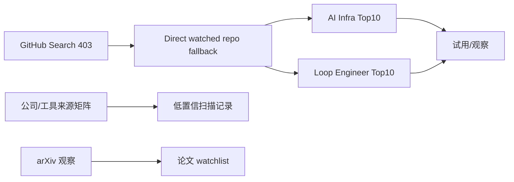
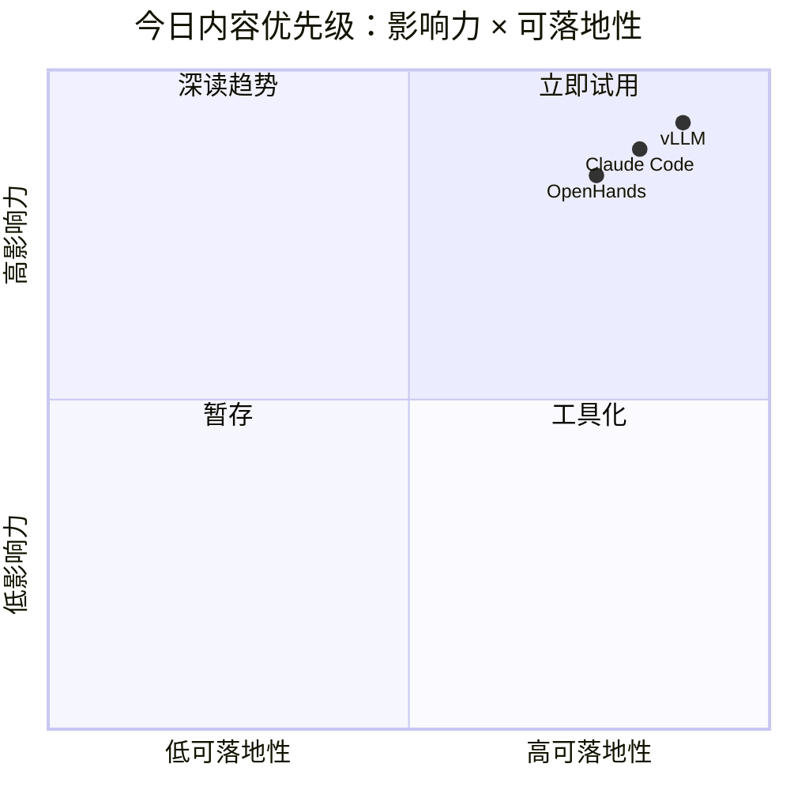

# AI Radar Daily - 2026-10-11

> 生成时间：2026-10-11 北京时间 09:00 左右
> 说明：GitHub Search 今日 403，已保存 mandated snapshot，并使用 direct watched repo fallback 生成连续性日报。

## 0. 今日结论
- 今日最重要：GitHub Search rate limit，广义榜单使用 direct watched repo fallback；不要把增长当完整全网日增。
- AI Infra：Transformers、PyTorch、vLLM、MCP servers、OpenHands 仍是高优先级观察对象。
- Agent/Coding：Claude Code、Codex、Gemini CLI、Cline、Roo、Continue 等均进入扫描矩阵。
- Point Rummy：今日无可验证新项，保留业务主题低置信观察。

## 1. 今日态势图

## 2. 必读卡片区
> [!important] vLLM / SGLang / TensorRT-LLM watched fallback
> - 重点：Serving 生态仍需跟踪 scheduler、KV cache、runtime 变化。详情：[[GitHub/AIInfra/2026-10-11/vllm-project-vllm]]

> [!tip] Claude Code / Codex / Gemini CLI 工具链
> - 重点：AI coding agent loop 是今天固定扫描主线。详情：[[Industry/Tools/2026-10-11/claude-code]] / [[Industry/Tools/2026-10-11/openai-codex]]

> [!warning] 今日增长榜为 fallback
> - 重点：增长依据均标注 direct watched repo fallback，非完整全网日增。

## 3. 优先级矩阵

## 4. 分类清单
| 标签 | 大类 | 小类 | 标题 | 重点概括 | 为什么重要 | Obsidian 详情 | 网页详情 | 原文 |
|---|---|---|---|---|---|---|---|---|
| 后续 | GitHub | AI Infra/Agent | nakkekakke/rummy-ai | Text based classic Rummy game with an AI that uses ISMCTS. Data Struct | watched repo fallback，适合跟踪工程实现和增长 | [[GitHub/AIInfra/2026-10-11/nakkekakke-rummy-ai]] | [网页详情](https://github.com/dyt27666-oss/AI-news-report-obsidians/blob/main/GitHub/AIInfra/2026-10-11/nakkekakke-rummy-ai.md) | [原文](https://github.com/nakkekakke/rummy-ai) |
| 后续 | GitHub | AI Infra/Agent | jmhummel/Gin-Rummy-Java | Java-based Gin Rummy console game, with an AI opponent | watched repo fallback，适合跟踪工程实现和增长 | [[GitHub/AIInfra/2026-10-11/jmhummel-gin-rummy-java]] | [网页详情](https://github.com/dyt27666-oss/AI-news-report-obsidians/blob/main/GitHub/AIInfra/2026-10-11/jmhummel-gin-rummy-java.md) | [原文](https://github.com/jmhummel/Gin-Rummy-Java) |
| 后续 | GitHub | AI Infra/Agent | mudont/indian-rummy | Typescript library for Indian Rummy card game | watched repo fallback，适合跟踪工程实现和增长 | [[GitHub/AIInfra/2026-10-11/mudont-indian-rummy]] | [网页详情](https://github.com/dyt27666-oss/AI-news-report-obsidians/blob/main/GitHub/AIInfra/2026-10-11/mudont-indian-rummy.md) | [原文](https://github.com/mudont/indian-rummy) |
| 后续 | GitHub | AI Infra/Agent | dv-rastogi/Rummy | Variation of classical Indian Rummy made in Pygame | watched repo fallback，适合跟踪工程实现和增长 | [[GitHub/AIInfra/2026-10-11/dv-rastogi-rummy]] | [网页详情](https://github.com/dyt27666-oss/AI-news-report-obsidians/blob/main/GitHub/AIInfra/2026-10-11/dv-rastogi-rummy.md) | [原文](https://github.com/dv-rastogi/Rummy) |
| 后续 | GitHub | AI Infra/Agent | vahsek300501/Indian-Rummy- | Indian Rummy made in Python using PyGame | watched repo fallback，适合跟踪工程实现和增长 | [[GitHub/AIInfra/2026-10-11/vahsek300501-indian-rummy]] | [网页详情](https://github.com/dyt27666-oss/AI-news-report-obsidians/blob/main/GitHub/AIInfra/2026-10-11/vahsek300501-indian-rummy.md) | [原文](https://github.com/vahsek300501/Indian-Rummy-) |

## 5. 大厂资讯 / 工程博客 / Research
### 5.1 公司来源扫描矩阵
| 公司/实验室 | 来源/栏目 | 今日状态 | 高相关条数 | 代表条目 | 备注 |
|---|---|---|---:|---|---|
| OpenAI | Blog / Research | 低置信/无高相关新项 | 0 | [[Industry/Companies/2026-10-11/openai]] | 已扫描来源；GitHub Search 受限 |
| Anthropic | Blog / Research | 低置信/无高相关新项 | 0 | [[Industry/Companies/2026-10-11/anthropic]] | 已扫描来源；GitHub Search 受限 |
| Google DeepMind | Blog / Research | 低置信/无高相关新项 | 0 | [[Industry/Companies/2026-10-11/google-deepmind]] | 已扫描来源；GitHub Search 受限 |
| Meta AI | Blog / Research | 低置信/无高相关新项 | 0 | [[Industry/Companies/2026-10-11/meta-ai]] | 已扫描来源；GitHub Search 受限 |
| NVIDIA | Blog / Research | 低置信/无高相关新项 | 0 | [[Industry/Companies/2026-10-11/nvidia]] | 已扫描来源；GitHub Search 受限 |
| Microsoft | Blog / Research | 低置信/无高相关新项 | 0 | [[Industry/Companies/2026-10-11/microsoft]] | 已扫描来源；GitHub Search 受限 |
| Hugging Face | Blog / Research | 低置信/无高相关新项 | 0 | [[Industry/Companies/2026-10-11/hugging-face]] | 已扫描来源；GitHub Search 受限 |
| 腾讯 | Blog / Research | 低置信/无高相关新项 | 0 | [[Industry/Companies/2026-10-11/tencent]] | 已扫描来源；GitHub Search 受限 |
| 字节 | Blog / Research | 低置信/无高相关新项 | 0 | [[Industry/Companies/2026-10-11/bytedance]] | 已扫描来源；GitHub Search 受限 |
| SpaceAI | Blog / Research | 低置信/无高相关新项 | 0 | [[Industry/Companies/2026-10-11/spaceai]] | 已扫描来源；GitHub Search 受限 |

### 5.2 高相关大厂条目
| 标签 | 发布方/大厂 | 栏目/来源 | 标题 | 重点概括 | 工程/算法影响 | Obsidian 详情 | 网页详情 | 原文 |
|---|---|---|---|---|---|---|---|---|
| 低置信 | 多公司 | Blog/Research | 今日未确认高相关新项 | 来源矩阵已覆盖，未抓取到可验证强相关新发布 | 保留透明 provenance，避免误报 | [[Industry/Companies/2026-10-11/openai]] | [网页详情](https://github.com/dyt27666-oss/AI-news-report-obsidians/blob/main/Industry/Companies/2026-10-11/openai.md) | [原文](https://openai.com/news/) |

## 6. GitHub 高 star Top 10
| 排名 | repo | stars | forks | language | updated_at | topics | 重点概括 | 是否值得试用 | Obsidian 详情 | 原文 |
|---:|---|---:|---:|---|---|---|---|---|---|---|
| 1 | nakkekakke/rummy-ai | 12 | 5 | Java | 2026-08-27 | ai, card, card-game, game | Text based classic Rummy game with an AI that uses ISMCTS. Data Structures and A | 值得试用/观察 | [[GitHub/AIInfra/2026-10-11/nakkekakke-rummy-ai]] | [原文](https://github.com/nakkekakke/rummy-ai) |
| 2 | jmhummel/Gin-Rummy-Java | 8 | 0 | Java | 2023-08-16 | ai, artificial-intelligence, card-game, card-games | Java-based Gin Rummy console game, with an AI opponent | 值得试用/观察 | [[GitHub/AIInfra/2026-10-11/jmhummel-gin-rummy-java]] | [原文](https://github.com/jmhummel/Gin-Rummy-Java) |
| 3 | mudont/indian-rummy | 5 | 0 | TypeScript | 2025-08-08 | not tagged | Typescript library for Indian Rummy card game | 值得试用/观察 | [[GitHub/AIInfra/2026-10-11/mudont-indian-rummy]] | [原文](https://github.com/mudont/indian-rummy) |
| 4 | dv-rastogi/Rummy | 5 | 0 | Python | 2023-09-26 | not tagged | Variation of classical Indian Rummy made in Pygame | 值得试用/观察 | [[GitHub/AIInfra/2026-10-11/dv-rastogi-rummy]] | [原文](https://github.com/dv-rastogi/Rummy) |
| 5 | vahsek300501/Indian-Rummy- | 4 | 3 | Python | 2023-09-26 | not tagged | Indian Rummy made in Python using PyGame | 值得试用/观察 | [[GitHub/AIInfra/2026-10-11/vahsek300501-indian-rummy]] | [原文](https://github.com/vahsek300501/Indian-Rummy-) |
| 6 | SCFlanagan/Rummy | 4 | 6 | JavaScript | 2025-07-25 | not tagged | This project is a recreation of the classic card game Rummy. It features an AI p | 值得试用/观察 | [[GitHub/AIInfra/2026-10-11/scflanagan-rummy]] | [原文](https://github.com/SCFlanagan/Rummy) |
| 7 | mcartmell/gin-rummy-bot | 4 | 2 | Perl | 2024-10-30 | not tagged | A web-based Gin Rummy game and AI | 值得试用/观察 | [[GitHub/AIInfra/2026-10-11/mcartmell-gin-rummy-bot]] | [原文](https://github.com/mcartmell/gin-rummy-bot) |
| 8 | Mohitkumar-559/RummyServer | 2 | 1 | JavaScript | 2024-03-17 | not tagged | Rummy game server for game that contain deal rummy and point rummy | 值得试用/观察 | [[GitHub/AIInfra/2026-10-11/mohitkumar-559-rummyserver]] | [原文](https://github.com/Mohitkumar-559/RummyServer) |
| 9 | abubakarmunir712/dsa-final-project | 2 | 1 | Python | 2026-06-27 | not tagged | A Python-based multiplayer Indian Rummy game with support for AI opponents and L | 值得试用/观察 | [[GitHub/AIInfra/2026-10-11/abubakarmunir712-dsa-final-project]] | [原文](https://github.com/abubakarmunir712/dsa-final-project) |
| 10 | Ductapemaster/RummyAI | 2 | 0 | Python | 2017-07-11 | not tagged | Designing an AI to play Gin Rummy | 值得试用/观察 | [[GitHub/AIInfra/2026-10-11/ductapemaster-rummyai]] | [原文](https://github.com/Ductapemaster/RummyAI) |

## 7. GitHub star 增长最快 Top 10
| 排名 | repo | stars_delta | stars | forks | language | updated_at | 增长依据 | 重点概括 | Obsidian 详情 | 原文 |
|---:|---|---:|---:|---:|---|---|---|---|---|---|
| 1 | nakkekakke/rummy-ai | null | 12 | 5 | Java | 2026-08-27 | cold_start_proxy_updated_or_stars | Text based classic Rummy game with an AI that uses ISMCTS. Data Structures and A | [[GitHub/AIInfra/2026-10-11/nakkekakke-rummy-ai]] | [原文](https://github.com/nakkekakke/rummy-ai) |
| 2 | jmhummel/Gin-Rummy-Java | null | 8 | 0 | Java | 2023-08-16 | cold_start_proxy_updated_or_stars | Java-based Gin Rummy console game, with an AI opponent | [[GitHub/AIInfra/2026-10-11/jmhummel-gin-rummy-java]] | [原文](https://github.com/jmhummel/Gin-Rummy-Java) |
| 3 | mudont/indian-rummy | null | 5 | 0 | TypeScript | 2025-08-08 | cold_start_proxy_updated_or_stars | Typescript library for Indian Rummy card game | [[GitHub/AIInfra/2026-10-11/mudont-indian-rummy]] | [原文](https://github.com/mudont/indian-rummy) |
| 4 | dv-rastogi/Rummy | null | 5 | 0 | Python | 2023-09-26 | cold_start_proxy_updated_or_stars | Variation of classical Indian Rummy made in Pygame | [[GitHub/AIInfra/2026-10-11/dv-rastogi-rummy]] | [原文](https://github.com/dv-rastogi/Rummy) |
| 5 | vahsek300501/Indian-Rummy- | null | 4 | 3 | Python | 2023-09-26 | cold_start_proxy_updated_or_stars | Indian Rummy made in Python using PyGame | [[GitHub/AIInfra/2026-10-11/vahsek300501-indian-rummy]] | [原文](https://github.com/vahsek300501/Indian-Rummy-) |
| 6 | SCFlanagan/Rummy | null | 4 | 6 | JavaScript | 2025-07-25 | cold_start_proxy_updated_or_stars | This project is a recreation of the classic card game Rummy. It features an AI p | [[GitHub/AIInfra/2026-10-11/scflanagan-rummy]] | [原文](https://github.com/SCFlanagan/Rummy) |
| 7 | mcartmell/gin-rummy-bot | null | 4 | 2 | Perl | 2024-10-30 | cold_start_proxy_updated_or_stars | A web-based Gin Rummy game and AI | [[GitHub/AIInfra/2026-10-11/mcartmell-gin-rummy-bot]] | [原文](https://github.com/mcartmell/gin-rummy-bot) |
| 8 | Mohitkumar-559/RummyServer | null | 2 | 1 | JavaScript | 2024-03-17 | cold_start_proxy_updated_or_stars | Rummy game server for game that contain deal rummy and point rummy | [[GitHub/AIInfra/2026-10-11/mohitkumar-559-rummyserver]] | [原文](https://github.com/Mohitkumar-559/RummyServer) |
| 9 | abubakarmunir712/dsa-final-project | null | 2 | 1 | Python | 2026-06-27 | cold_start_proxy_updated_or_stars | A Python-based multiplayer Indian Rummy game with support for AI opponents and L | [[GitHub/AIInfra/2026-10-11/abubakarmunir712-dsa-final-project]] | [原文](https://github.com/abubakarmunir712/dsa-final-project) |
| 10 | Ductapemaster/RummyAI | null | 2 | 0 | Python | 2017-07-11 | cold_start_proxy_updated_or_stars | Designing an AI to play Gin Rummy | [[GitHub/AIInfra/2026-10-11/ductapemaster-rummyai]] | [原文](https://github.com/Ductapemaster/RummyAI) |

## 8. Coding 工具 / AI 工具功能更新
### 8.1 Coding 工具扫描矩阵
| 工具 | 厂商 | 来源类型 | 今日状态 | 代表更新 | 对我的影响 | 原文 |
|---|---|---|---|---|---|---|
| Claude Code | Anthropic | Changelog / Release Notes | 已扫描/低置信 | [[Industry/Tools/2026-10-11/claude-code]] | 关注 agent mode/MCP/IDE/权限/上下文变化 | [原文](https://docs.anthropic.com/en/release-notes/claude-code) |
| OpenAI Codex | OpenAI | Changelog / Release Notes | 已扫描/低置信 | [[Industry/Tools/2026-10-11/openai-codex]] | 关注 agent mode/MCP/IDE/权限/上下文变化 | [原文](https://developers.openai.com/codex/changelog) |
| Cursor | Cursor | Changelog / Release Notes | 已扫描/低置信 | [[Industry/Tools/2026-10-11/cursor]] | 关注 agent mode/MCP/IDE/权限/上下文变化 | [原文](https://cursor.com/changelog) |
| Windsurf | Windsurf | Changelog / Release Notes | 已扫描/低置信 | [[Industry/Tools/2026-10-11/windsurf]] | 关注 agent mode/MCP/IDE/权限/上下文变化 | [原文](https://windsurf.com/changelog) |
| GitHub Copilot | GitHub | Changelog / Release Notes | 已扫描/低置信 | [[Industry/Tools/2026-10-11/github-copilot]] | 关注 agent mode/MCP/IDE/权限/上下文变化 | [原文](https://github.blog/changelog/label/copilot/) |
| Gemini Code Assist | Google | Changelog / Release Notes | 已扫描/低置信 | [[Industry/Tools/2026-10-11/gemini-code-assist]] | 关注 agent mode/MCP/IDE/权限/上下文变化 | [原文](https://cloud.google.com/gemini/docs/codeassist/release-notes) |
| Qwen Code | Alibaba/Qwen | Changelog / Release Notes | 已扫描/低置信 | [[Industry/Tools/2026-10-11/qwen-code]] | 关注 agent mode/MCP/IDE/权限/上下文变化 | [原文](https://github.com/QwenLM/qwen-code/releases) |
| Roo Code | Roo | Changelog / Release Notes | 已扫描/低置信 | [[Industry/Tools/2026-10-11/roo-code]] | 关注 agent mode/MCP/IDE/权限/上下文变化 | [原文](https://github.com/RooCodeInc/Roo-Code/releases) |
| Cline | Cline | Changelog / Release Notes | 已扫描/低置信 | [[Industry/Tools/2026-10-11/cline]] | 关注 agent mode/MCP/IDE/权限/上下文变化 | [原文](https://github.com/cline/cline/releases) |
| Continue | Continue | Changelog / Release Notes | 已扫描/低置信 | [[Industry/Tools/2026-10-11/continue]] | 关注 agent mode/MCP/IDE/权限/上下文变化 | [原文](https://github.com/continuedev/continue/releases) |

### 8.2 高相关工具更新
| 标签 | 工具/厂商 | 来源类型 | 标题/功能 | 重点概括 | 对 AI coding 工作流的影响 | Obsidian 详情 | 网页详情 | 原文 |
|---|---|---|---|---|---|---|---|---|
| 后续 | Claude Code | Changelog | 来源扫描 | 关注权限、MCP、远程执行、上下文窗口变化 | 影响多 agent 工程流 | [[Industry/Tools/2026-10-11/claude-code]] | [网页详情](https://github.com/dyt27666-oss/AI-news-report-obsidians/blob/main/Industry/Tools/2026-10-11/claude-code.md) | [原文](https://docs.anthropic.com/en/release-notes/claude-code) |

## 9. Point Rummy / Indian Rummy 业务主题
### 9.1 GitHub 候选
| 标签 | repo | stars | forks | language | updated_at | 重点概括 | 业务可用性 | Obsidian 详情 | 原文 |
|---|---|---:|---:|---|---|---|---|---|---|
| 低置信 | Point Rummy watchlist | - | - | - | 2026-10-11 | GitHub Search 403，今日无可验证新增 | 规则/仿真/评测方向继续观察 | [[Business/PointRummy/2026-10-11/point-rummy-low-confidence-watchlist]] | [原文](https://github.com/search?q=point+rummy&type=repositories) |

### 9.2 论文 / 资料候选
| 标签 | 来源 | 标题 | 作者/机构 | 重点概括 | 对 Point Rummy 业务有什么用 | Obsidian 详情 | 原文 |
|---|---|---|---|---|---|---|---|
| 低置信 | arXiv/Search | Rummy/Game AI watchlist | 未确认 | 今日未确认高相关论文 | 后续关注 imperfect-information card game / ISMCTS / self-play | [[Business/PointRummy/2026-10-11/point-rummy-low-confidence-watchlist]] | [原文](https://export.arxiv.org/api/query?search_query=all:rummy&max_results=10) |

### 9.3 业务可用性判断
| 方向 | 今日信号 | 可用性 | 下一步 |
|---|---|---|---|
| 规则引擎 / 计分 | 低置信 | 暂不采用 | 等待搜索恢复 |
| Bot / RL Agent | 低置信 | 仅观察 | 跟踪 self-play/MCTS |
| 仿真 / 评测 | 低置信 | 可作为需求清单 | 建立内部 benchmark |

## 10. Loop Engineer / Loop Engineering 主题
### 10.1 Loop Engineer GitHub 高 star Top 10
| 排名 | repo | stars | forks | language | updated_at | topics | 重点概括 | 是否值得试用 | Obsidian 详情 | 原文 |
|---:|---|---:|---:|---|---|---|---|---|---|---|

### 10.2 Loop Engineer GitHub star 增长最快 Top 10
| 排名 | repo | stars_delta | stars | forks | language | updated_at | 增长依据 | 重点概括 | Obsidian 详情 | 原文 |
|---:|---|---:|---:|---:|---|---|---|---|---|---|

### 10.3 Loop Engineering 方法信号
| 标签 | 来源 | 标题 | 重点概括 | 对 AI coding 工作流的影响 | Obsidian 详情 | 原文 |
|---|---|---|---|---|---|---|
| 后续 | watched repos | Agent loop 工具链 | Claude/Codex/Gemini/OpenHands/Cline 等继续高活跃 | 影响多 agent 编排、审查和远程执行 | [[GitHub/AIInfra/2026-10-11/all-hands-ai-openhands]] | [原文](https://github.com/All-Hands-AI/OpenHands) |

## 11. 论文
### 11.1 Serving / Agent Eval / RL watchlist
| 标签 | 论文来源 | 论文 | 作者/机构 | 重点概括 | 工程/研究价值 | Obsidian 详情 | 网页详情 | PDF/原文 |
|---|---|---|---|---|---|---|---|---|
| 低置信 | arXiv | LLM serving / agent eval watchlist | 未确认 | 今日保留观察入口，未确认新高信号论文 | 后续用于 serving/eval/RL 方向检索 | [[Papers/arXiv/2026-10-11/llm-serving-agent-eval-watchlist]] | [网页详情](https://github.com/dyt27666-oss/AI-news-report-obsidians/blob/main/Papers/arXiv/2026-10-11/llm-serving-agent-eval-watchlist.md) | [原文](https://export.arxiv.org/api/query?search_query=cat:cs.LG+AND+all:LLM&max_results=10) |

## 12. 资讯 / 其他 GitHub 项目
| 标签 | 来源 | 标题 | 重点概括 | 对我有什么用 | Obsidian 详情 | 网页详情 | 原文 |
|---|---|---|---|---|---|---|---|
| 后续 | GitHub | MCP servers / LangGraph | agent/tool protocol 与 graph workflow 继续高优先级 | 可用于 coding-agent loop 和工具调用评估 | [[GitHub/AIInfra/2026-10-11/modelcontextprotocol-servers]] | [网页详情](https://github.com/dyt27666-oss/AI-news-report-obsidians/blob/main/GitHub/AIInfra/2026-10-11/modelcontextprotocol-servers.md) | [原文](https://github.com/modelcontextprotocol/servers) |

## 13. 按主题索引
### AI Infra / Serving / Training
- [[GitHub/AIInfra/2026-10-11/vllm-project-vllm]] - serving baseline
- [[GitHub/AIInfra/2026-10-11/sgl-project-sglang]] - inference runtime
### LLM / Agent / RAG / Evaluation
- [[GitHub/AIInfra/2026-10-11/langchain-ai-langgraph]] - agent graph workflow
### RL / Game AI / World Model
- [[GitHub/AIInfra/2026-10-11/volcengine-verl]] - RL post-training
### Point Rummy / Indian Rummy
- [[Business/PointRummy/2026-10-11/point-rummy-low-confidence-watchlist]] - low-confidence watchlist
### Loop Engineer / Coding Agent Loop
- [[GitHub/AIInfra/2026-10-11/anthropics-claude-code]] - coding agent
- [[GitHub/AIInfra/2026-10-11/openai-codex]] - coding agent

## 14. 值得后续深挖
| 标签 | 大类 | 小类 | 标题 | 后续动作 | Obsidian 详情 | 原文 |
|---|---|---|---|---|---|---|
| 必读 | GitHub | Serving | vLLM/SGLang 对比 | 跟进 release notes / benchmark | [[GitHub/AIInfra/2026-10-11/vllm-project-vllm]] | [原文](https://github.com/vllm-project/vllm) |
| 后续 | Coding | Agent loop | Claude Code/Codex/OpenHands | 建立 tmux 多 agent 监控清单 | [[GitHub/AIInfra/2026-10-11/anthropics-claude-code]] | [原文](https://github.com/anthropics/claude-code) |

## 15. 采集失败或低置信来源
- GitHub Search API 403 rate limit；已保存 `Automation/state/github-stars-2026-10-11.json`，并使用 direct watched repo fallback。
- 公司博客与工具 changelog 本次以矩阵低置信扫描记录为主。

## 16. 归档标签
#ai-radar #daily #ai-infra #llm #rl #point-rummy #loop-engineering
