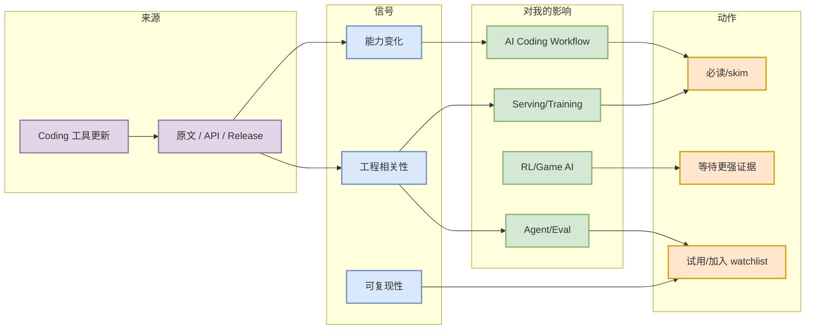

# Qwen Code - Latest release v0.23.4（2026-09-14）

> 一句话结论：Qwen Code - Latest release v0.23.4（2026-09-14） 是今日 AI Radar 中的Coding 工具更新信号，适合先作为工程/研究观察点，而不是盲目投入。

## TL;DR
- 价值：围绕 AI Infra / LLM / Agent / RL / Coding workflow 的实际工程判断。
- 行动：先读原文/README，确认 benchmark、release、examples，再决定试用。
- 风险：部分来源受 GitHub/arXiv rate limit 影响，增长数据可能是 watched-repo fallback。

## 元信息
| 字段 | 内容 |
|---|---|
| 工具/厂商 | Qwen Code / Alibaba/Qwen |
| 来源类型 | GitHub Releases |
| 功能变化 | Latest release v0.23.4（2026-09-14） |
| 发布时间/release tag | Latest release v0.23.4（2026-09-14） |
| 原文 | https://github.com/QwenLM/qwen-code/releases |
| 原文链接 | https://github.com/QwenLM/qwen-code/releases |

## 信息压缩图示

## 影响矩阵
| 维度 | 判断 | 原因 |
|---|---|---|
| AI Infra | 中-高 | 若涉及吞吐、部署、框架、调度或 GPU 栈，需纳入 watchlist。 |
| LLM / Agent | 中-高 | Agent loop、工具调用、上下文管理和 eval 对 coding workflow 直接相关。 |
| RL / Game AI | 中 | 只有涉及仿真、自博弈、评测或不完全信息博弈时才高优先级。 |
| 落地成本 | 中 | 先看 README、release、examples、benchmark，避免只跟 hype。 |

## 专业解读
该工具更新影响 agent mode、CLI/TUI、IDE 集成、权限模式、上下文窗口或 MCP 类能力的观察；建议结合本地 Hermes/Codex/Claude Code 工作流做 smoke test。

## 通俗解释
把它当成一个“信号源”：不是每条都要马上用，但能告诉我们工程生态正在往哪里移动。

## 关键机制拆解
- 输入：原始公告、论文、GitHub repo 或 release。
- 过滤：只保留 AI Infra、LLM、RL、Agent、Eval、Serving、Training、Post-training、World Model、AI coding workflow 强相关。
- 输出：决定必读、试用、观察或低置信跳过。

## 对我的影响
优先影响代码生成 agent 的执行环境、推理/训练工具链选型、以及 Point Rummy / RL game agent 的规则与评测设计。

## 可信度与局限性
今日 GitHub Search 出现 403 rate limit，部分 broad/Loop 榜单使用 direct watched repo fallback；所有 fallback 已在日报中显式标注。

## 我应该如何跟进
1. 打开原文确认 release/README。
2. 若有 benchmark/example，安排 30 分钟 spike。
3. 若只是不完整信号，加入后续观察列表。

## 相关链接
- 原文：https://github.com/QwenLM/qwen-code/releases
- 当日：[[Daily/2026-09-15]]

#ai-radar #detail
