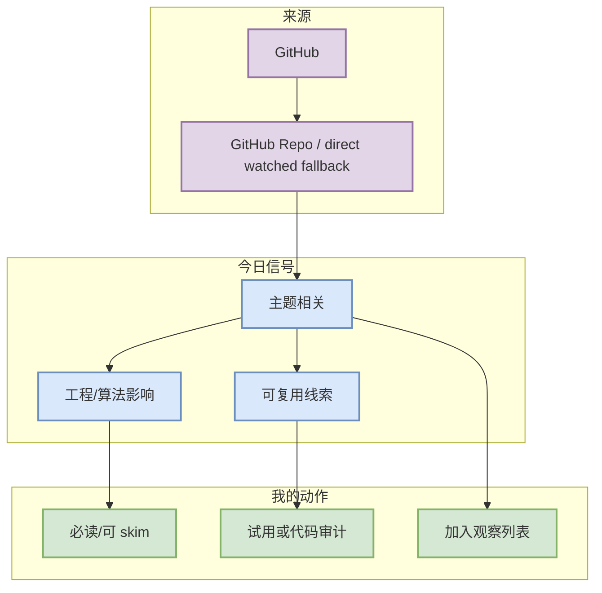

# cline/cline

> 日期：2026-09-16
> 类型：GitHub Repo / direct watched fallback
> 原文：https://github.com/cline/cline

## 一句话结论
Autonomous coding agent as an SDK, IDE extension, or CLI assistant.

## TL;DR
- 来源：GitHub
- 价值：用于观察 cline/cline 在 AI Infra、coding agent loop 或 LLM 工程中的生态位置；今日 delta=180，依据：direct watched repo fallback，非完整全网日增。
- 建议：今天先放入 watchlist；若涉及 serving/coding loop/Rummy 规则，应安排小规模试读或代码审计。

## 元信息表
| 字段 | 内容 |
|---|---|
| 来源 | GitHub |
| 来源类型 | GitHub Repo / direct watched fallback |
| 日期 | 2026-09-16 |
| 原文链接 | https://github.com/cline/cline |
| 可信度 | 中；GitHub/API 可核验，若为 fallback 已在日报标注 |

## 信息压缩图示

## 影响矩阵
| 维度 | 判断 | 原因 |
|---|---|---|
| AI Infra | 中-高 | 若涉及 serving、训练框架、agent runtime 或 coding loop，则影响工程效率和系统设计。 |
| LLM / Agent | 中 | 可转化为工具链、评测或上下文/权限模式观察点。 |
| RL / Game AI | 视主题而定 | Rummy/仿真/自博弈项目可作为环境与 evaluator 参考。 |
| 落地风险 | 中 | fallback/低 star 项需要代码审计，不能直接生产复用。 |

## 专业解读
用于观察 cline/cline 在 AI Infra、coding agent loop 或 LLM 工程中的生态位置；今日 delta=180，依据：direct watched repo fallback，非完整全网日增。

## 通俗解释
这条信息的价值不是“新闻热闹”，而是能否帮助你更快判断 serving、训练、agent loop 或游戏 AI 环境该怎么设计、复现或避坑。

## 关键机制拆解
1. 先确认来源和发布时间/更新时间。
2. 再看是否和 KV cache、scheduler、RLHF/GRPO、agent loop、Rummy 规则/仿真强相关。
3. 最后决定：必读、试用、只观察或低置信跳过。

## 对我的影响
用于观察 cline/cline 在 AI Infra、coding agent loop 或 LLM 工程中的生态位置；今日 delta=180，依据：direct watched repo fallback，非完整全网日增。

## 可信度与局限性
- GitHub Search 今日受 403 rate limit 影响，部分榜单使用 direct watched repo fallback。
- 若是低 star Rummy 项，只能作为思路/测试用例来源，不能直接复用。

## 我应该如何跟进
- 若为 serving/infra repo：看 examples、benchmark、scheduler/cache 代码。
- 若为 coding 工具：读 release body，关注 agent mode、MCP、权限、IDE/CLI。
- 若为 Rummy：抽规则测试和环境接口。

## 相关链接
- [原文](https://github.com/cline/cline)
- [[Daily/2026-09-16]]

#ai-radar #detail
