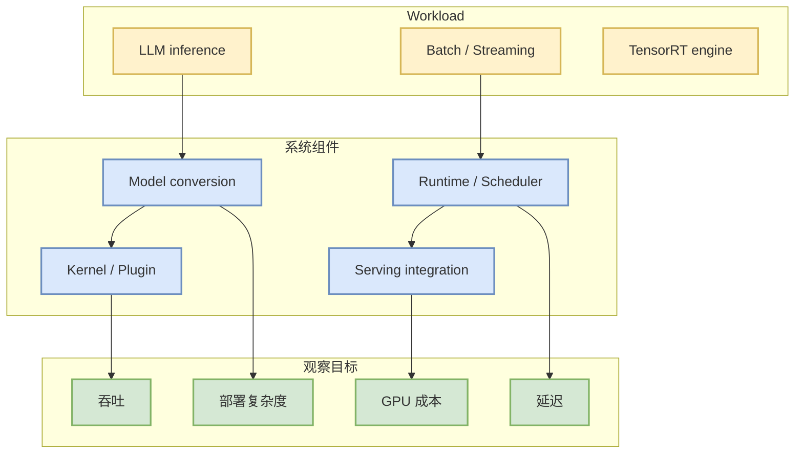

# NVIDIA/TensorRT-LLM

> 日期：2026-09-16
> 类型：GitHub Repo / direct watched fallback
> 原文：https://github.com/NVIDIA/TensorRT-LLM

## 一句话结论
TensorRT-LLM 是 NVIDIA 推理栈的重要观察对象；今日未进入 Top 10，但作为 watched repo 已纳入 snapshot 与后续深挖清单。

## TL;DR
- 来源：GitHub
- 来源类型：direct watched repo fallback
- 价值：用于跟踪 NVIDIA 在 LLM inference、kernel、engine build、serving/runtime 方向的工程路线。
- 建议：后续和 vLLM / SGLang / llama.cpp 做部署复杂度、吞吐、延迟、硬件绑定对比。

## 元信息表
| 字段 | 内容 |
|---|---|
| repo | NVIDIA/TensorRT-LLM |
| 来源 | GitHub |
| 来源类型 | direct watched repo fallback |
| 原文链接 | https://github.com/NVIDIA/TensorRT-LLM |
| 可信度 | 中；GitHub Search 今日受限，采用 watched repo 补齐 |

## 信息压缩图示

## 影响矩阵
| 维度 | 判断 | 原因 |
|---|---|---|
| AI Infra | 高 | 直接关联 NVIDIA GPU 推理优化、engine build 与部署路径。 |
| LLM Serving | 高 | 可作为 vLLM/SGLang 之外的硬件厂商路线参考。 |
| 落地风险 | 中 | 硬件和版本耦合更强，需要结合实际 GPU / CUDA / driver 环境测试。 |

## 专业解读
TensorRT-LLM 的价值在于把模型结构、kernel 优化、engine 构建和 serving runtime 绑定到 NVIDIA GPU 生态中。对 AI Infra 工程师而言，它不是“通用框架热度”问题，而是需要判断何时为更高吞吐/更低延迟接受更强硬件绑定和部署复杂度。

## 通俗解释
它像是 NVIDIA 给大模型推理做的一套高性能发动机；能跑得很快，但调校和环境要求更高。

## 关键机制拆解
1. 模型转换 / engine build。
2. CUDA/TensorRT kernel 与插件。
3. Runtime / scheduler / serving integration。
4. 和 vLLM/SGLang/llama.cpp 的适用场景差异。

## 对我的影响
后续做 serving 方案选型时，应把 TensorRT-LLM 放进 benchmark 矩阵：吞吐、延迟、显存、部署复杂度、模型支持范围、维护成本。

## 可信度与局限性
今日 GitHub Search 403，详情基于 direct watched repo 和长期工程知识；需后续读取 release / benchmark 做精确更新。

## 我应该如何跟进
- 查看 examples 与 supported model list。
- 对比 vLLM/SGLang 在同硬件上的吞吐与延迟。
- 关注 TensorRT-LLM release notes 中的 Blackwell、speculative decoding、MoE、KV cache 相关更新。

## 相关链接
- [原文](https://github.com/NVIDIA/TensorRT-LLM)
- [[Daily/2026-09-16]]

#ai-radar #detail #ai-infra #serving
