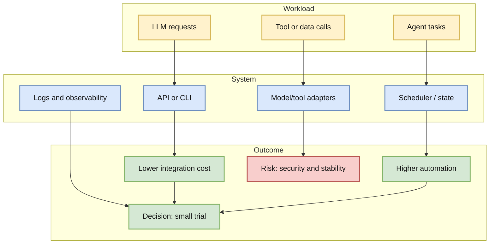
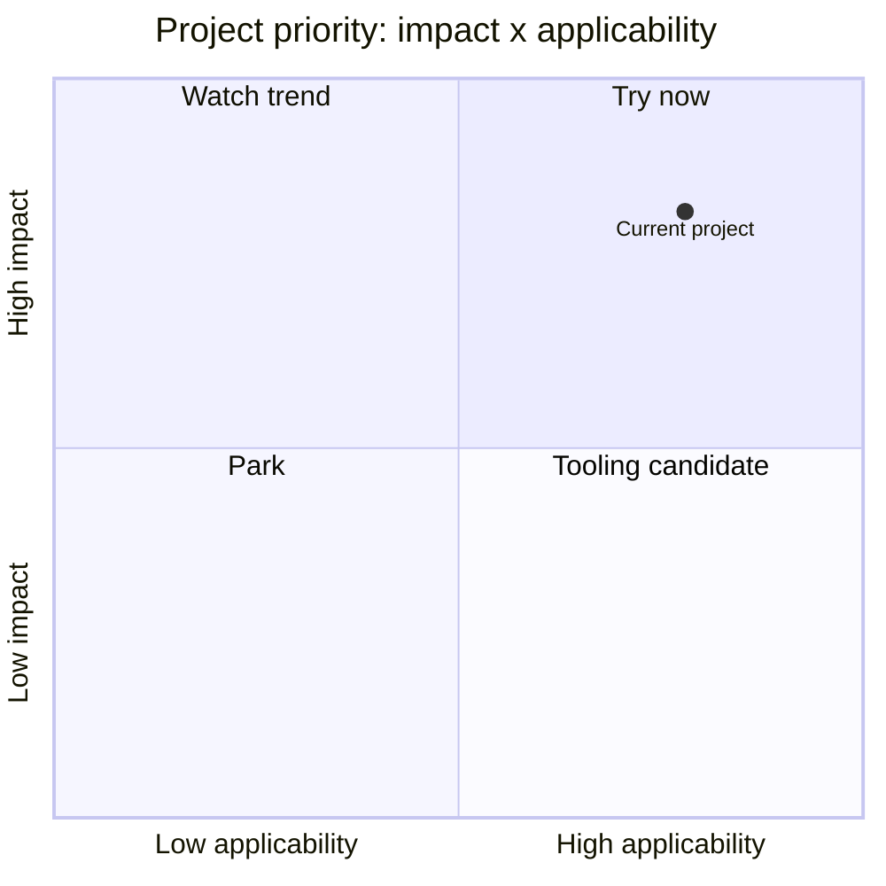

# affaan-m/ECC

> Type: GitHub project
> Category: GitHub / AI Infra / Agent / LLM Engineering
> Priority: must-read if it is in the growth top list
> Date: 2026-06-15
> Source: https://github.com/affaan-m/ECC
> Web: https://github.com/dyt27666-oss/AI-news-report-obsidians/blob/main/GitHub/2026-06-15/affaan-m--ECC.md
> Daily: [[Daily/2026-06-15]]

## One-line takeaway

affaan-m/ECC is a high-signal AI engineering project today; evaluate it as a reusable component for agent runtime, serving, data ingestion, or training workflows.

## TL;DR

- What it is: The agent harness performance optimization system. Skills, instincts, memory, security, and research-first development for Claude Code, Codex, Opencode, Cursor and beyond.
- Why it matters: stars=215515, forks=33124, delta=604.
- Relevance: it maps to LLM/agent infrastructure rather than generic AI news.
- Action: read README, examples, license, and run one smoke test before adoption.

## Metadata

| Field | Value |
|---|---|
| repo | affaan-m/ECC |
| stars / forks | 215515 / 33124 |
| language | JavaScript |
| updated_at | 2026-06-15T01:00:05Z |
| pushed_at | 2026-06-11T20:24:32Z |
| topics | ai-agents, anthropic, claude, claude-code, developer-tools, llm, mcp, productivity |
| source | [GitHub](https://github.com/affaan-m/ECC) |
| benchmark/docs/examples/release | Not fully verified in this run; check README/release before production use |

## Diagram

## Professional read

The useful question is not whether the repo is popular, but whether its abstractions can be reused in a production AI stack: control plane, runtime state, tool permissions, observability, cost, and failure recovery. Treat star growth as a discovery signal, not as proof of quality.

## Plain explanation

This is a candidate building block. Try it on a tiny internal task before trusting it in a real workflow.

## Mechanism breakdown

| Mechanism | Problem | Why it works | Pitfall |
|---|---|---|---|
| API / CLI | Integration cost | Makes workflows programmable | Interface churn |
| Task state | Long-running agent tasks | Makes progress visible | Recovery complexity |
| Ecosystem | Debug speed | More examples and issues | Hype can distort quality |

## Impact on me

| Dimension | Impact | Action |
|---|---|---|
| AI Infra | Control-plane and observability ideas | Inspect deploy/log model |
| LLM engineering | Toolchain integration candidate | Smoke test with one task |
| RL/Game AI | Possible multi-step environment automation | Check replay/state design |
| Agent/Eval | Candidate benchmark target | Record success rate and failure modes |

## Limits

- Evidence: GitHub metadata snapshot only.
- Missing: README, release, benchmark and license deep check.
- Risk: stars may be marketing-driven.

## Follow-up

1. Read README and release notes.
2. Run a small task.
3. Add failure categories to eval logs.

## Links

- Source: https://github.com/affaan-m/ECC
- Web: https://github.com/dyt27666-oss/AI-news-report-obsidians/blob/main/GitHub/2026-06-15/affaan-m--ECC.md
- Daily: [[Daily/2026-06-15]]

#ai-radar #github #ai-infra #llm #agent
