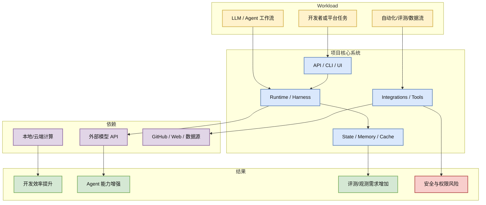

# JuliusBrussee/caveman

> 类型：GitHub 项目
> 大类：GitHub
> 小类：AI Infra / Agent / LLM Tooling
> 推荐等级：必读
> 创建日期：2026-06-16
> 原文链接：https://github.com/JuliusBrussee/caveman
> 网页详情：https://github.com/dyt27666-oss/AI-news-report-obsidians/blob/main/GitHub/2026-06-16/JuliusBrussee--caveman.md
> 返回日报：[[Daily/2026-06-16]]

## 一句话结论

JuliusBrussee/caveman 今日 stars=73036，delta=523，是 真实增长榜重点项目；简介：🪨 why use many token when few token do trick — Claude Code skill that cuts 65% of tokens by talking like caveman

## TL;DR

- **它是什么**：GitHub 上的 JavaScript 项目，主题包括 ai, anthropic, caveman, claude, claude-code, llm, meme, prompt-engineering, skill, tokens。
- **为什么重要**：与 AI 工程生态、agent tooling、LLM 平台或训练/推理工具链相关。
- **和我相关的点**：可作为 agent infra、工具链、评测或生产平台设计的参考。
- **建议动作**：高增长项目先读 README / examples / release；高 star 基建项目可加入长期观察。

## 元信息

| 字段 | 内容 |
|---|---|
| repo | JuliusBrussee/caveman |
| stars / forks | 73036 / 4123 |
| language | JavaScript |
| updated_at | 2026-06-16T01:00:17Z |
| pushed_at | 2026-06-12T13:51:06Z |
| topics | ai, anthropic, caveman, claude, claude-code, llm, meme, prompt-engineering, skill, tokens |
| stars_delta | 523 |
| benchmark / docs / examples / release | 未逐项验证，需打开仓库确认 |
| 是否值得试用 | 是，优先试读/试用 |
| 原文 | [GitHub](https://github.com/JuliusBrussee/caveman) |

## 信息压缩图示

### 辅助结构：试用判断矩阵

| 维度 | 当前判断 | 跟进动作 |
|---|---|---|
| 社区热度 | stars=73036，delta=523 | 看 issue/PR 活跃度 |
| 工程价值 | 与 AI/agent/LLM 工具链相关 | 跑 README quickstart |
| 风险 | 权限、依赖、数据外发需确认 | 在 sandbox 中试用 |
| 是否纳入平台 | 暂不直接纳入生产 | 先做 PoC |

## 专业解读

🪨 why use many token when few token do trick — Claude Code skill that cuts 65% of tokens by talking like caveman。从 AI Infra 视角，GitHub star 增长不是质量保证，但它是生态注意力和开发者需求的早期信号。对用户而言，最值得看的不是“又一个 agent 项目”，而是它是否解决了 runtime、memory、tool use、eval、web data、部署控制面中的某个真实痛点。

## 通俗解释

这个项目可以先当成一个“生态温度计”：很多开发者在关注它，说明它可能踩中了当前 AI 工程的某个痛点。但是否真能用，还需要看文档、例子、测试和维护质量。

## 关键机制拆解

| 机制 | 解决的问题 | 为什么有效 | 可能的坑 |
|---|---|---|---|
| 开源工具链 | 降低试验成本 | 可直接阅读和修改 | 质量参差不齐 |
| 社区增长 | 暴露需求趋势 | star delta 能提示新热点 | 可能被营销或泄露类内容放大 |
| PoC 试用 | 验证是否适配 | 小成本发现依赖和风险 | 不代表生产稳定性 |

## 对我的影响

| 维度 | 影响 | 建议动作 |
|---|---|---|
| AI Infra | 可借鉴系统边界和控制面 | 读架构与部署文档 |
| LLM 工程 | 可能改善开发/推理/agent 链路 | 跑 quickstart |
| RL / Game AI | 若含环境/agent harness 可参考 | 检查是否支持可复现环境 |
| Agent / Eval | 高相关 | 看是否有 trace/eval/examples |

## 可信度与局限性

- 证据强度：中等，来自 GitHub API snapshot。
- 局限性：未逐项验证 benchmark、release、example。
- 潜在风险：star 增长可能来自新闻事件而非工程质量。
- 还需要确认：license、维护节奏、安全边界。

## 我应该如何跟进

1. 打开 README，确认 quickstart 和 license。
2. 查看 examples/tests/release 是否齐全。
3. 如果与当前工作强相关，在隔离环境做 30 分钟 PoC。

## 相关链接

- 原文：https://github.com/JuliusBrussee/caveman
- 网页详情：https://github.com/dyt27666-oss/AI-news-report-obsidians/blob/main/GitHub/2026-06-16/JuliusBrussee--caveman.md
- 相关卡片：[[Daily/2026-06-16]]

## 标签

#ai-radar #github #agent #ai-infra #llm
