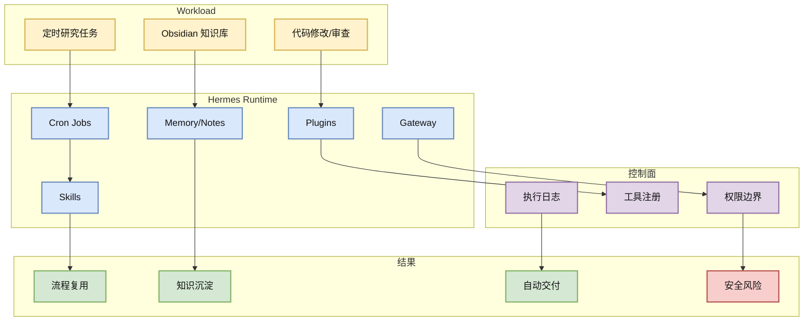
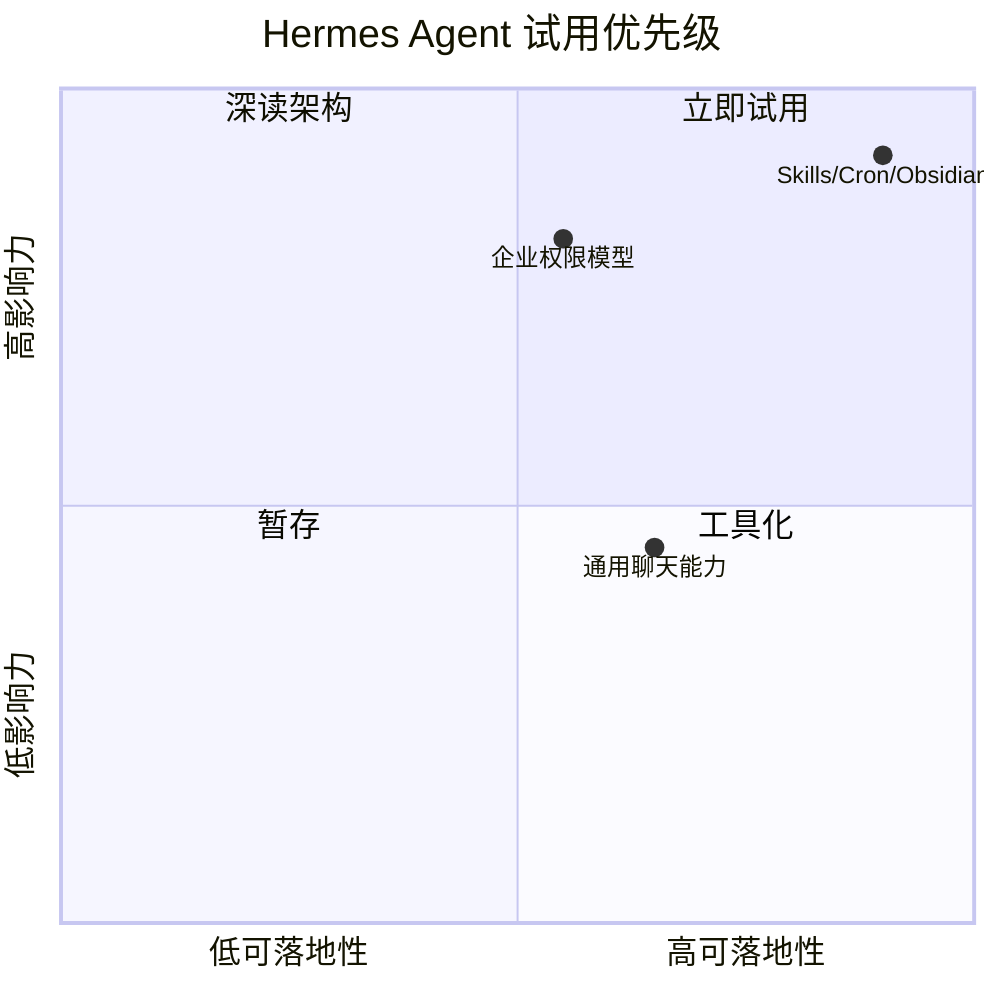

# NousResearch/hermes-agent

> 类型：GitHub 项目
> 大类：GitHub
> 小类：Agent Infra / Personal AI OS
> 推荐等级：必读
> 创建日期：2026-06-17
> 原文链接：https://github.com/NousResearch/hermes-agent
> 网页详情：https://github.com/dyt27666-oss/AI-news-report-obsidians/blob/main/GitHub/2026-06-17/NousResearch--hermes-agent.md
> 返回日报：[[Daily/2026-06-17]]

## 一句话结论

Hermes Agent 继续以真实 snapshot 日增 +903 增长，说明 skills、plugins、gateway、cron、Obsidian-first knowledge loop 这类 agent runtime 能力仍是高热方向。

## TL;DR

- **它是什么**：可扩展 agent runtime，强调技能、工具、网关、自动化任务和长期上下文。
- **为什么重要**：它把 agent 从一次性 CLI 变成可积累流程资产的系统。
- **和我相关的点**：当前 AI Radar 本身就是 Hermes cron + Obsidian + GitHub push 的组合，项目方向与用户工作流完全重合。
- **建议动作**：必读；持续跟踪权限、安全、skills 复用、MCP/gateway 设计。

## 元信息

| 字段 | 内容 |
|---|---|
| repo | NousResearch/hermes-agent |
| stars / forks | 195361 / 34307 |
| language | Python |
| updated_at | 2026-06-17T01:00:19Z |
| topics | ai, ai-agent, ai-agents, anthropic, chatgpt, claude |
| benchmark/docs/examples/release | docs/skills/plugins 明显；benchmark 需确认 |
| 是否值得试用 | 是 |
| 原文 | [GitHub](https://github.com/NousResearch/hermes-agent) |

## 信息压缩图示

## 专业解读

Hermes 的价值在于把“提示词经验”提升为可版本化的技能，把“临时工具调用”提升为插件和网关，把“我每天要做的事”提升为 cron job。对于 AI Infra 工程师，这类系统提供了一个 agent control plane 的雏形：工具注册、权限、上下文、执行日志、结果交付和知识库存储。

增长 +903 也说明市场仍在寻找 Claude Code/Codex/OpenCode 之外的个人/团队 agent runtime。需要注意的是，增长不等于稳定性；真正可生产化还要看权限隔离、错误恢复和 eval。

## 通俗解释

它像一个会不断学会你工作流程的自动化同事：今天做日报，明天做代码审查，后天把这些流程沉淀成技能。

## 关键机制拆解

| 机制 | 解决的问题 | ���什么有效 | 可能的坑 |
|---|---|---|---|
| Skills | 经验难复用 | 把流程写成可调用程序记忆 | 技能过期会误导 |
| Cron | 人工触发成本高 | 自动执行周期任务 | 失败后需可观测 |
| Gateway/Plugins | 工具接入混乱 | 统一工具接口 | 权限风险 |

## 对我的影响

| 维度 | 影响 | 建议动作 |
|---|---|---|
| AI Infra | agent control plane 样例 | 深读架构 |
| LLM 工程 | 支持 coding/research loop | 跟踪技能复用 |
| RL / Game AI | 可沉淀环境操作技能 | 暂时观察 |
| Agent / Eval | 高度相关 | 设计 eval/trace |

## 可信度与局限性

- 证据强度：高热度 + 本地正在使用；但 star 增长不代表工程成熟。
- 局限性：需要持续验证稳定性、安全和插件生态。
- 潜在风险：自动化误操作、权限过宽、技能陈旧。
- 还需要确认：生产部署模式、权限模型、回滚机制。

## 我应该如何跟进

1. 继续用 AI Radar cron 作为 dogfood。
2. 把失败的采集/验证流程沉淀为更强的技能。
3. 关注 agent-vault / MCP gateway / trace eval 的整合机会。

## 相关链接

- 原文：https://github.com/NousResearch/hermes-agent
- 网页详情：https://github.com/dyt27666-oss/AI-news-report-obsidians/blob/main/GitHub/2026-06-17/NousResearch--hermes-agent.md
- 相关卡片：[[Daily/2026-06-17]]

## 标签

#ai-radar #github #agent #hermes #ai-infra
