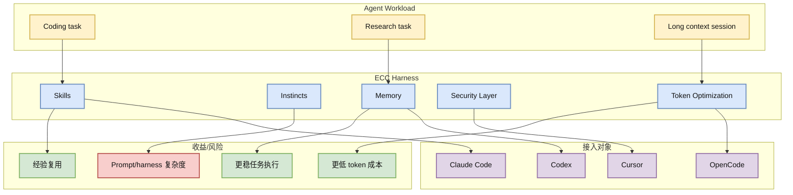

# affaan-m/ECC

> 类型：GitHub 项目
> 大类：GitHub
> 小类：Agent Harness / Performance Optimization
> 推荐等级：必读
> 创建日期：2026-06-17
> 原文链接：https://github.com/affaan-m/ECC
> 网页详情：https://github.com/dyt27666-oss/AI-news-report-obsidians/blob/main/GitHub/2026-06-17/affaan-m--ECC.md
> 返回日报：[[Daily/2026-06-17]]

## 一句话结论

ECC 继续占据高 star 榜首并日增 +570，说明 agent harness 的性能、记忆、安全和技能化已经成为独立基础设施赛道。

## TL;DR

- **它是什么**：面向 Claude Code、Codex、OpenCode、Cursor 等 coding agent 的 harness/技能/性能优化系统。
- **为什么重要**：agent 进入长任务后，瓶颈从“模型会不会做”变成“harness 如何省 token、保上下文、控权限、复用经验”。
- **和我相关的点**：用户的 coding/research agent 工作流需要同样的性能优化、记忆和安全边界。
- **建议动作**：必读；拆解其 skills、memory、安全和 token 优化策略。

## 元信息

| 字段 | 内容 |
|---|---|
| repo | affaan-m/ECC |
| stars / forks | 216736 / 33286 |
| language | JavaScript |
| updated_at | 2026-06-17T01:00:16Z |
| topics | ai-agents, anthropic, claude, claude-code, developer-tools, llm |
| benchmark/docs/examples/release | 需确认 benchmark；项目描述强调 harness/skills/memory/security |
| 是否值得试用 | 是 |
| 原文 | [GitHub](https://github.com/affaan-m/ECC) |

## 信息压缩图示

| 模块 | 价值 | 对 AI Radar 的借鉴 |
|---|---|---|
| Skills | 复用流程 | 把采集/验证失败经验沉淀 |
| Memory | 保持跨任务上下文 | 连接 Obsidian 详情页 |
| Security | 降低 agent 写操作风险 | 对 git/push/文件写入加审计 |
| Token 优化 | 降成本 | 长日报生成需要压缩上下文 |

## 专业解读

ECC 代表的不是单个 agent 应用，而是 agent harness 赛道：当多个模型和 CLI 都能完成基本代码任务，差异会转移到外层 harness，包括任务分解、上下文压缩、技能调用、记忆检索、工具权限和错误恢复。

对 AI Infra 来说，这很接近“agent runtime scheduler”：如何把长任务拆成可控步骤，如何减少上下文重复，如何在失败后恢复，如何保证工具调用安全。这些能力也可以迁移到 research agent、RL agent 和评测平台。

## 通俗解释

模型像发动机，ECC 像赛车的底盘和驾驶辅助系统：同一个发动机，底盘调得好，跑长赛更稳更省油。

## 关键机制拆解

| 机制 | 解决的问题 | 为什么有效 | 可能的坑 |
|---|---|---|---|
| Skills/Instincts | 每次任务都从零开始 | 固化经验减少提示成本 | 容易过拟合旧流程 |
| Memory | 长任务上下文丢失 | 保留跨会话状态 | 需要清理和权限控制 |
| Security | agent 工具调用风险 | 加边界和策略 | 可能降低自动化效率 |

## 对我的影响

| 维度 | 影响 | 建议动作 |
|---|---|---|
| AI Infra | agent runtime 设计参考 | 深读 harness 结构 |
| LLM 工程 | 降低 coding agent 成本 | 比较 token 优化策略 |
| RL / Game AI | 长 horizon agent 也需要 harness | 迁移到环境交互 |
| Agent / Eval | 直接相关 | 建立 harness benchmark |

## 可信度与局限性

- 证据强度：GitHub 热度高且持续增长。
- 局限性：需确认实际代码质量、benchmark 和安全实现。
- 潜在风险：高 star 可能混有 hype，需本地试用验证。
- 还需要确认：与 Hermes、OpenHands、Claude Code 原生能力的边界。

## 我应该如何跟进

1. 阅读 README，抽取 skills/memory/security 设计。
2. 选一个长任务对比 Hermes vs ECC 的 token/成功率。
3. 把有价值机制迁移到 Obsidian AI Radar 自动化。

## 相关链接

- 原文：https://github.com/affaan-m/ECC
- 网页详情：https://github.com/dyt27666-oss/AI-news-report-obsidians/blob/main/GitHub/2026-06-17/affaan-m--ECC.md
- 相关卡片：[[Daily/2026-06-17]]

## 标签

#ai-radar #github #agent #harness #ai-infra
