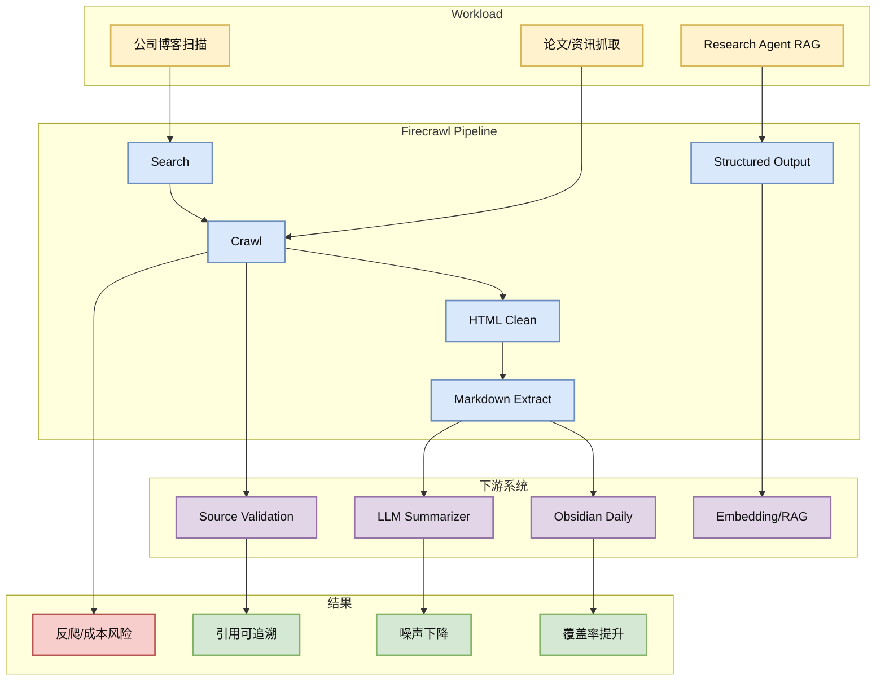

# firecrawl/firecrawl

> 类型：GitHub 项目
> 大类：GitHub
> 小类：Web Data / Agent Retrieval Infra
> 推荐等级：可 skim
> 创建日期：2026-06-17
> 原文链接：https://github.com/firecrawl/firecrawl
> 网页详情：https://github.com/dyt27666-oss/AI-news-report-obsidians/blob/main/GitHub/2026-06-17/firecrawl--firecrawl.md
> 返回日报：[[Daily/2026-06-17]]

## 一句话结论

Firecrawl 日增 +436，说明 web data extraction 仍是 research agent、RAG 和自动日报类系统的核心基础设施瓶颈。

## TL;DR

- **它是什么**：面向 AI agent 的网页搜索、抓取、结构化和 markdown 转换 API/工具。
- **为什么重要**：agent 的上限取决于输入质量；抓取失败、正文噪声、反爬和结构化错误会直接污染推理和总结。
- **和我相关的点**：AI Radar 每天都依赖网页抓取，公司博客扫描失败项可以考虑引入更稳的抓取层。
- **建议动作**：可 skim；试用其对 OpenAI/NVIDIA/Microsoft 等难抓页面的提取质量。

## 元信息

| 字段 | 内容 |
|---|---|
| repo | firecrawl/firecrawl |
| stars / forks | 133646 / 7827 |
| language | TypeScript |
| updated_at | 2026-06-17T00:59:38Z |
| topics | ai, ai-agents, ai-crawler, ai-scraping, ai-search, crawler |
| benchmark/docs/examples/release | docs/examples 需确认；描述强调 API 和规模化抓取 |
| 是否值得试用 | 是，用于 research agent 数据入口 |
| 原文 | [GitHub](https://github.com/firecrawl/firecrawl) |

## 信息压缩图示

| 场景 | 当前痛点 | Firecrawl 可能价值 |
|---|---|---|
| 大厂博客扫描 | 403/404/JS 页面 | 更稳提取正文和链接 |
| Research agent | 搜索结果噪声高 | 输出 markdown/结构化 JSON |
| Obsidian 日报 | 原文引用要可追溯 | 保留 URL 和正文片段 |

## 专业解读

Firecrawl 的价值在于把 web ingestion 从临时脚本提升成可复用管线。对 agent 系统，网页不是“随便 curl 一下”的输入，而是需要搜索、抓取、去噪、正文抽取、结构化、引用保留和失败重试的基础层。

本次 AI Radar 运行中 OpenAI 403、NVIDIA 404、arXiv/Semantic Scholar 429 等问题都说明数据入口是系统可靠性的短板。Firecrawl 或类似工具可作为后��替换方案，但需要评估成本、速率限制和隐私。

## 通俗解释

它像给 agent 配了一个更靠谱的网页采集员：不是把整页垃圾 HTML 扔给模型，而是把正文、链接和结构整理好再交给模型。

## 关键机制拆解

| 机制 | 解决的问题 | 为什么有效 | 可能的坑 |
|---|---|---|---|
| Crawl/Search | 来源发现不稳定 | 自动扩展页面覆盖 | 反爬和费用 |
| Markdown 抽取 | HTML 噪声大 | 更适合 LLM 阅读 | 可能丢图表/脚注 |
| Structured Output | 下游解析脆弱 | 降低 prompt 负担 | schema 需维护 |

## 对我的影响

| 维度 | 影响 | 建议动作 |
|---|---|---|
| AI Infra | 数据入口可靠性提升 | 试用难抓来源 |
| LLM 工程 | 降低输入噪声 | 做抓取质量 eval |
| RL / Game AI | 低直接相关 | 可用于环境文档采集 |
| Agent / Eval | 高相关 | 作为 research agent ingestion baseline |

## 可信度与局限性

- 证据强度：GitHub 热度和日增强，但需本地 eval。
- 局限性：抓取工具可能受网站策略限制。
- 潜在风险：成本、隐私、版权、反爬。
- 还需要确认：自部署能力、队列/重试、失败可观测性。

## 我应该如何跟进

1. 用 OpenAI/NVIDIA/Microsoft 页面做提取 A/B 测试。
2. 定义正文完整率、链接保留率、噪声率指标。
3. 若效果好，接入 AI Radar 采集失败 fallback。

## 相关链接

- 原文：https://github.com/firecrawl/firecrawl
- 网页详情：https://github.com/dyt27666-oss/AI-news-report-obsidians/blob/main/GitHub/2026-06-17/firecrawl--firecrawl.md
- 相关卡片：[[Daily/2026-06-17]]

## 标签

#ai-radar #github #web-data #agent #rag
