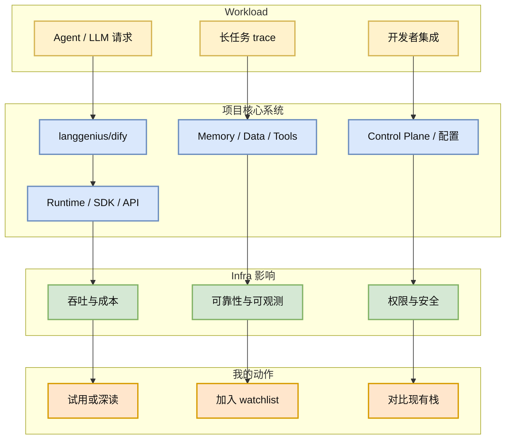
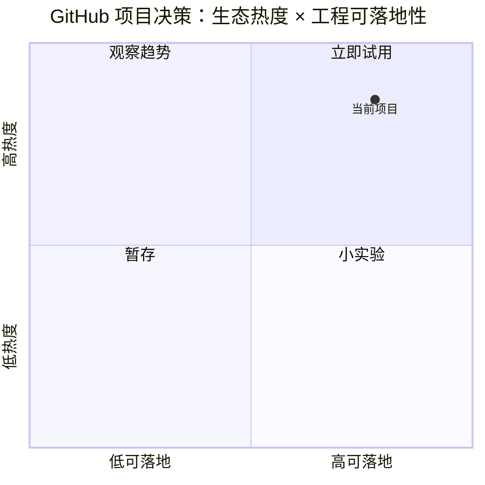

# langgenius/dify

> 类型：GitHub 项目
> 大类：GitHub
> 小类：Agent / LLM Infra
> 推荐等级：必读
> 创建日期：2026-06-18
> 原文链接：https://github.com/langgenius/dify
> 网页详情：https://github.com/dyt27666-oss/AI-news-report-obsidians/blob/main/GitHub/2026-06-18/langgenius--dify.md
> 返回日报：[[Daily/2026-06-18]]

## 一句话结论

生产化 agentic workflow 平台保持高热，代表 LLMOps 应用编排方向。

## TL;DR

- **它是什么**：Production-ready platform for agentic workflow development.
- **为什么重要**：stars=145631，forks=22906，今日 stars_delta=126，说明模型外层工具链仍在快速增长。
- **和我相关的点**：它暴露的是 agent runtime、memory、web data、MCP、workflow 或 control plane 这些 AI Infra 问题。
- **建议动作**：观察 workflow/eval/logging/control plane 设计。

## 元信息

| 字段 | 内容 |
|---|---|
| repo | `langgenius/dify` |
| stars / forks | 145631 / 22906 |
| language | TypeScript |
| updated_at | 2026-06-18T00:33:16Z |
| topics | agent, agentic-ai, agentic-framework, agentic-workflow, ai, automation |
| 增长依据 | historical_snapshot |
| 原文 | [GitHub](https://github.com/langgenius/dify) |
| benchmark / docs / examples / release | 需进入 repo 进一步确认；本页基于 GitHub metadata 做雷达筛选。 |

## 信息压缩图示

## 专业解读

这个项目值得从 AI Infra 视角看：模型能力外面的胶水层正在产品化。真实长任务系统的难点通常不是一次调用，而是上下文持久化、工具调用边界、失败恢复、成本控制、权限审计和数据入口稳定性。生产化 agentic workflow 平台保持高热，代表 LLMOps 应用编排方向。

## 通俗解释

模型像发动机，这类项目更像车架、仪表盘和安全锁。没有外层系统，模型能力很难稳定跑在真实工作流里。

## 关键机制拆解

| 机制 | 解决的问题 | 为什么有效 | 可能的坑 |
|---|---|---|---|
| Runtime / SDK | 把模型调用接入真实应用 | 降低集成成本 | 抽象过重可能限制灵活性 |
| Memory / Data / Tools | 支持长任务上下文 | 提高多步任务连续性 | 隐私、污染和版本漂移 |
| Control Plane | 管理配置、权限、日志 | 便于企业化和排障 | 需要完善审计与回滚 |

## 对我的影响

| 维度 | 影响 | 建议动作 |
|---|---|---|
| AI Infra | 可借鉴 runtime/control plane 抽象 | 看 README 与架构文档 |
| LLM 工程 | 观察模型调用如何封装为产品能力 | 对比 LiteLLM/OpenWebUI/Dify |
| RL / Game AI | 低直接相关，但长任务调度可迁移 | 暂存 |
| Agent / Eval | 强相关：trace、记忆、工具、评估入口 | 观察 workflow/eval/logging/control plane 设计。 |

## 可信度与局限性

- 证据强度：GitHub metadata + historical snapshot；未逐行审计源码。
- 局限性：star 增长不等于生产可用性。
- 潜在风险：项目描述可能被营销化，需通过 examples/release/issue 质量验证。

## 我应该如何跟进

1. 先看 README 的 architecture、examples、deployment。
2. 检查最近 release、issue、benchmark 或 demo。
3. 若与当前工作流相关，做一个 30 分钟最小接入实验。

## 相关链接

- 原文：https://github.com/langgenius/dify
- 网页详情：https://github.com/dyt27666-oss/AI-news-report-obsidians/blob/main/GitHub/2026-06-18/langgenius--dify.md
- 相关卡片：[[Daily/2026-06-18]]

## 标签

#ai-radar #github #agent #llm-infra
