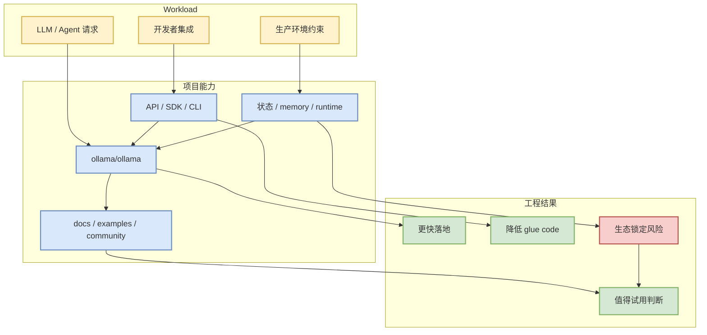

# ollama/ollama

## 一句话结论
ollama/ollama 在今日 高 star 榜单排名第 5，核心信号是：Get up and running with Kimi-K2.6, GLM-5.1, MiniMax, DeepSeek, gpt-oss, Qwen, Gemma and other models.

## TL;DR
- Stars / forks：174484 / 16675；今日 delta：79。
- 语言：Go；更新时间：2026-06-19T00:41:48Z。
- 主题：deepseek, gemma, gemma3, glm, go, golang, gpt-oss, llama, llama3, llm, llms, minimax, mistral, ollama, qwen。
- 对 AI Infra/LLM 工程的意义：可作为 agent runtime、serving、训练或评测生态的参考坐标。

## 元信息
| 字段 | 值 |
|---|---|
| Repo | [ollama/ollama](https://github.com/ollama/ollama) |
| Stars | 174484 |
| Forks | 16675 |
| Language | Go |
| Updated | 2026-06-19T00:41:48Z |
| Pushed | 2026-06-18T23:24:53Z |
| Topics | deepseek, gemma, gemma3, glm, go, golang, gpt-oss, llama, llama3, llm, llms, minimax, mistral, ollama, qwen |
| 描述 | Get up and running with Kimi-K2.6, GLM-5.1, MiniMax, DeepSeek, gpt-oss, Qwen, Gemma and other models. |

## 信息压缩图示

## 专业解读
这个项目的价值不只来自 star 数，而是它在 agent、LLM serving/training 或 AI 工程链路中的位置。若它提供稳定 API、示例、benchmark 或活跃 issue/release，就可以缩短从 prototype 到 production 的路径；若主要是 prompt/列表型项目，则更适合作为观察信号而非直接依赖。

## 通俗解释
它像一个生态温度计：star 越高、增长越快，说明开发者正在把注意力投入到这类工具或工作流上。

## 关键机制拆解
| 模块 | 观察点 | 对我的用途 |
|---|---|---|
| 接口层 | SDK/API/CLI 是否清晰 | 判断接入成本 |
| 运行层 | 是否涉及调度、状态、缓存、工具调用 | 判断 infra 价值 |
| 评测层 | 是否有 benchmark/examples | 判断可信度 |
| 社区层 | stars/forks/update | 判断维护风险 |

## 对我的影响
可作为 AI Radar 后续试用池；若与 Hermes、Firecrawl、Dify、vLLM、verl 等链路相关，应优先评估能否改善自动研究、agent workflow、推理服务或 post-training 实验效率。

## 可信度与局限性
GitHub stars 有 hype 偏差；本页依据 GitHub API snapshot 自动生成，未进行源码级审计。

## 我应该如何跟进
1. 打开 README 和 examples，确认是否能在 30 分钟内跑通。
2. 查 release/issue 活跃度，避免引入维护风险。
3. 若与当前 AI Radar 或 RL/serving 工作流相关，加入 spike 清单。

## 相关链接
- 原文：[ollama/ollama](https://github.com/ollama/ollama)
- 返回日报：[[Daily/2026-06-19]]

#ai-radar #github #ai-infra #llm
