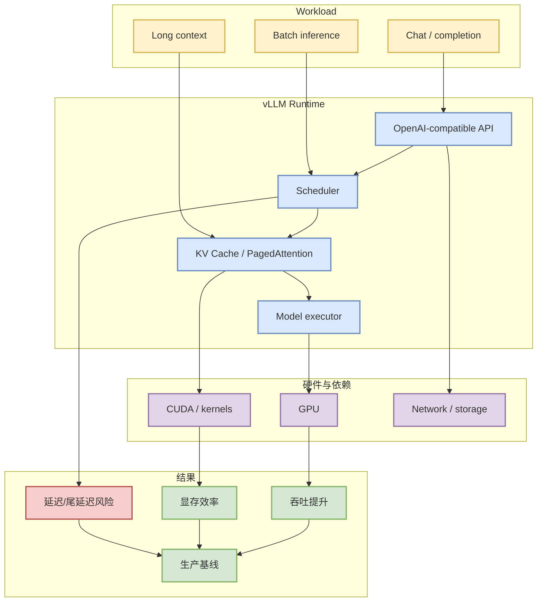

# vllm-project/vllm

## 一句话结论
vLLM 仍是 LLM serving 的高吞吐/内存效率基线项目，适合作为推理服务架构和调度优化的长期参考。

## TL;DR
- Stars / forks：83280 / 18205。
- 语言：Python；更新时间：2026-06-19T01:02:18Z。
- Topics：amd, blackwell, cuda, deepseek, deepseek-v3, gpt, gpt-oss, inference。
- 价值：PagedAttention、batching、KV cache、multi-model serving 等方向都应以 vLLM 作为对照。

## 元信息
| 字段 | 值 |
|---|---|
| Repo | [vllm-project/vllm](https://github.com/vllm-project/vllm) |
| Stars | 83280 |
| Forks | 18205 |
| Language | Python |
| Updated | 2026-06-19T01:02:18Z |
| Topics | amd, blackwell, cuda, deepseek, deepseek-v3, gpt, gpt-oss, inference |
| 描述 | A high-throughput and memory-efficient inference and serving engine for LLMs |

## 信息压缩图示

## 专业解读
vLLM 的核心价值是把推理服务中的调度、KV cache 管理、API 兼容和硬件执行路径统一到一个高活跃开源项目里。对于 AI Infra 工程师，它既是可直接部署的 serving engine，也是评估其他 serving 框架的 baseline。

## 通俗解释
它像 LLM 推理服务的发动机：同样的模型，能否更省显存、更高吞吐、更稳定地对外提供 API，很大程度取决于这层。

## 关键机制拆解
| 模块 | 观察点 | 对我的用途 |
|---|---|---|
| Scheduler | batching / prefill-decode 分离 | 优化吞吐和延迟 |
| KV cache | PagedAttention / cache 管理 | 降低显存浪费 |
| API | OpenAI-compatible serving | 降低接入成本 |
| Kernels | CUDA / attention 后端 | 判断硬件收益 |

## 对我的影响
任何 LLM serving 或 agent backend 的性能评估，都应该用 vLLM 作为基线之一。

## 可信度与局限性
项目高度活跃但变化快；生产采用前需要按模型、GPU、batch profile 做本地 benchmark。

## 我应该如何跟进
1. 固定一个内部 benchmark profile。
2. 对比 SGLang、TensorRT-LLM、TGI。
3. 关注长上下文和 speculative decoding 的实际收益。

## 相关链接
- 原文：[vllm-project/vllm](https://github.com/vllm-project/vllm)
- 返回日报：[[Daily/2026-06-19]]

#ai-radar #github #serving #llm #ai-infra
