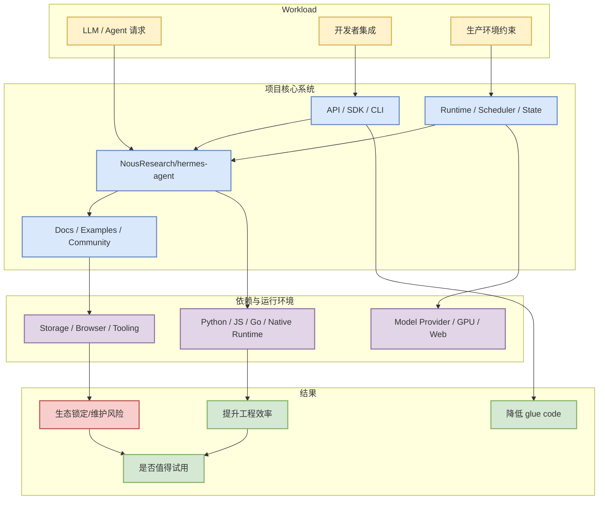

# NousResearch/hermes-agent

## 一句话结论
NousResearch/hermes-agent 是今日 AI Radar GitHub 榜单项目，核心信号是：The agent that grows with you

## TL;DR
- Stars / forks：197655 / 34990；stars_delta：645。
- 语言：Python；更新时间：2026-06-20T00:54:25Z。
- 主题：ai, ai-agent, ai-agents, anthropic, chatgpt, claude, claude-code, clawdbot, codex, hermes, hermes-agent, llm, moltbot, nous-research, openai, openclaw。
- 对 AI Infra/LLM 工程的意义：可作为 agent runtime、serving、训练或评测生态的参考坐标。

## 元信息
| 字段 | 值 |
|---|---|
| Repo | [NousResearch/hermes-agent](https://github.com/NousResearch/hermes-agent) |
| Stars | 197655 |
| Forks | 34990 |
| Language | Python |
| Updated | 2026-06-20T00:54:25Z |
| Pushed | 2026-06-20T00:36:18Z |
| Topics | ai, ai-agent, ai-agents, anthropic, chatgpt, claude, claude-code, clawdbot, codex, hermes, hermes-agent, llm, moltbot, nous-research, openai, openclaw |
| 描述 | The agent that grows with you |
| 网页详情 | [GitHub](https://github.com/dyt27666-oss/AI-news-report-obsidians/blob/main/GitHub/2026-06-20/NousResearch--hermes-agent.md) |
| 返回日报 | [[Daily/2026-06-20]] |

## 信息压缩图示

### 辅助结构：试用判断矩阵
| 维度 | 观察点 | 当前判断 |
|---|---|---|
| 生态热度 | stars / forks / delta | 197655 stars，delta 645 |
| 工程可接入 | docs/examples/release | 需查看 README 与 release |
| AI Infra 价值 | runtime / scheduler / eval / serving | 依据 topics 和描述初筛相关 |
| 风险 | hype、维护、接口稳定性 | star 不等于生产可用，需要 spike |

## 专业解读
这个项目的价值不只来自 star 数，而是它在 agent、LLM serving/training 或 AI 工程链路中的位置。若它提供稳定 API、示例、benchmark 或活跃 issue/release，就可以缩短从 prototype 到 production 的路径；若主要是 prompt/列表型项目，则更适合作为观察信号而非直接依赖。

## 通俗解释
它像一个生态温度计：star 越高、增长越快，说明开发者正在把注意力投入到这类工具或工作流上。

## 关键机制拆解
| 模块 | 观察点 | 对我的用途 |
|---|---|---|
| 接口层 | SDK/API/CLI 是否清晰 | 判断接入成本 |
| 运行层 | 是否涉及调度、状态、缓存、工具调用 | 判断 infra 价值 |
| 评测层 | 是否有 benchmark/examples | 判断可信度 |
| 社区层 | stars/forks/update | 判断维护风险 |

## 对我的影响
可作为 AI Radar 后续试用池；若与 Hermes、Firecrawl、Dify、vLLM、verl 等链路相关，应优先评估能否改善自动研究、agent workflow、推理服务或 post-training 实验效率。

## 可信度与局限性
GitHub stars 有 hype 偏差；本页依据 GitHub API snapshot 自动生成，未进行源码级审计。

## 我应该如何跟进
1. 打开 README 和 examples，确认是否能在 30 分钟内跑通。
2. 查 release/issue 活跃度，避免引入维护风险。
3. 若与当前 AI Radar 或 RL/serving 工作流相关，加入 spike 清单。

## 相关链接
- 原文：[NousResearch/hermes-agent](https://github.com/NousResearch/hermes-agent)
- 网页详情：https://github.com/dyt27666-oss/AI-news-report-obsidians/blob/main/GitHub/2026-06-20/NousResearch--hermes-agent.md
- 返回日报：[[Daily/2026-06-20]]

#ai-radar #github #ai-infra #llm
