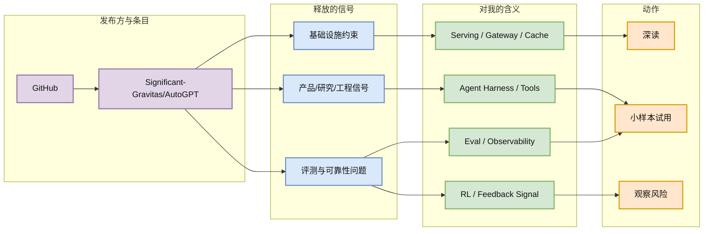
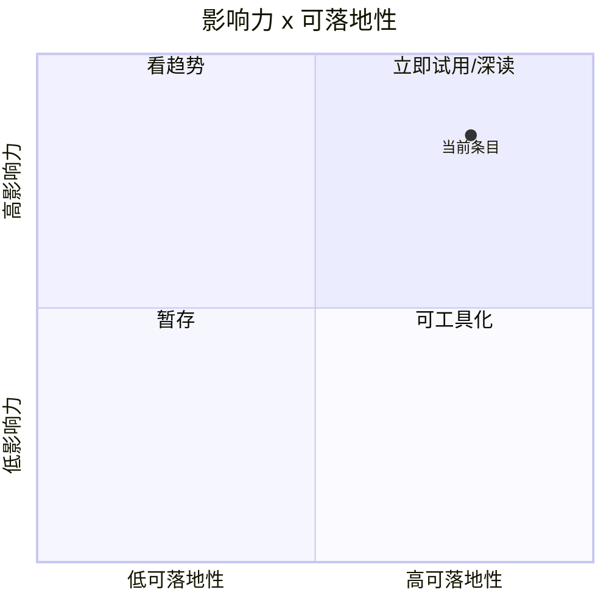

# Significant-Gravitas/AutoGPT

> 类型：GitHub 项目
> 大类：AI Radar
> 小类：AI Infra / LLM / Agent / Eval
> 推荐等级：必读 / 可 skim
> 创建日期：2026-06-21
> 原文链接：https://github.com/Significant-Gravitas/AutoGPT
> 网页详情：https://github.com/dyt27666-oss/AI-news-report-obsidians/blob/main/GitHub/2026-06-21/significant-gravitas-autogpt.md
> 返回日报：[[Daily/2026-06-21]]

## 一句话结论

Significant-Gravitas/AutoGPT 是今日 GitHub snapshot 中的相关项目：stars=185048，forks=46127，delta=8。

## TL;DR

- **它是什么**：GitHub 的高相关信号，来源类型是 开源项目。
- **为什么重要**：项目 topics 包含 agentic-ai, agents, ai, artificial-intelligence, autonomous-agents, claude, gpt, llama-api，与 LLM/agent/infra/eval/RL 生态相关。
- **和我相关的点**：它可以映射到 AI Infra、LLM serving、Agent eval、post-training 或 RL 环境中的实际工程决策。
- **建议动作**：先读原文和 README / benchmark，再做最小可行验证。

## 元信息

| 字段 | 内容 |
|---|---|
| 发布方/来源 | GitHub |
| 大厂/实验室 | GitHub |
| 栏目/来源类型 | 开源项目 |
| 作者/机构 | GitHub |
| 发布时间 | 2026-06 |
| 原文 | [原文](https://github.com/Significant-Gravitas/AutoGPT) |
| 代码 | https://github.com/Significant-Gravitas/AutoGPT |
| PDF | 未发现 |
| 标签 | #github #llm #agent |

## 信息压缩图示

### 主图：信号到工程动作

### 辅助图：影响力 x 可落地性

## 专业解读

项目 topics 包含 agentic-ai, agents, ai, artificial-intelligence, autonomous-agents, claude, gpt, llama-api，与 LLM/agent/infra/eval/RL 生态相关。 对 AI Infra 工程师来说，关键不只是“热度”，而是它是否改变生产系统里的约束：请求路由、缓存命中率、工具调用可靠性、评测闭环、训练数据生成、成本结构或硬件路径。

落地时建议按三层检查：第一层看接口和运行时是否能接入现有模型网关；第二层看指标能否自动化记录；第三层看失败模式是否会污染线上链路或训练数据。三层都能低成本验证时，再进入 spike。

## 通俗解释

把这个条目当成一个雷达点：它提示某个方向正在工程化，但还不等于生产可用。先用小实验验证，不要因为 star 或大厂背书直接迁移。

## 关键机制拆解

| 机制 | 解决的问题 | 为什么有效 | 可能的坑 |
|---|---|---|---|
| 来源信号抽取 | 避免只看热搜 | 绑定发布方、栏目和原文 | 官网页面可能营销化 |
| 工程映射 | 转成可执行动作 | 对齐 AI Infra / LLM / Agent / RL 维度 | 需要二次验证 benchmark |
| 小样本验证 | 降低试错成本 | 先看接入难度和失败模式 | 不代表生产规模表现 |

## 对我的影响

| 维度 | 影响 | 建议动作 |
|---|---|---|
| AI Infra | 关注运行时、网关、缓存、观测或部署约束 | 做最小集成检查 |
| LLM 工程 | 关注训练/推理/上下文/后训练信号 | 记录可复用 prompt 和 eval |
| RL / Game AI | 关注是否能形成环境、反馈或 rollout 数据 | 暂列观察，除非有代码 |
| Agent / Eval | 关注工具调用、长任务、评测闭环 | 优先读失败案例 |

## 可信度与局限性

- 证据强度：中等；已保留原文链接，但未复现 benchmark。
- 局限性：博客或 README 可能偏产品叙事。
- 潜在风险：快速增长项目可能存在 hype、安全边界或维护质量问题。
- 还需要确认：release、examples、benchmark、issue 质量。

## 我应该如何跟进

1. 打开原文，确认技术细节、代码、benchmark。
2. 若和当前 serving / agent / eval 链路相关，做 30 分钟本地 spike。
3. 将可复用 checklist 沉淀到内部评测流程。

## 相关链接

- 原文：https://github.com/Significant-Gravitas/AutoGPT
- 网页详情：https://github.com/dyt27666-oss/AI-news-report-obsidians/blob/main/GitHub/2026-06-21/significant-gravitas-autogpt.md

## 标签

#ai-radar #github #llm #agent
