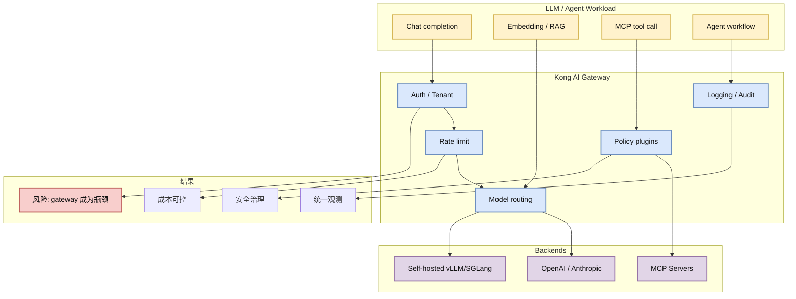

# Kong：API and AI Gateway

> 类型：GitHub 项目  
> 大类：GitHub  
> 小类：AI Gateway / LLMOps / MCP Gateway  
> 推荐等级：可 skim  
> 创建日期：2026-06-22  
> 原文链接：https://github.com/Kong/kong  
> 网页详情：https://github.com/dyt27666-oss/AI-news-report-obsidians/blob/main/GitHub/2026-06-22/Kong-AI-Gateway.md  
> 返回日报：[[Daily/2026-06-22]]

## 一句话结论

Kong 的 topics 已经明确包含 `ai-gateway`、`llm-gateway`、`mcp-gateway`，说明传统 API Gateway 正在吸收 LLM/MCP 流量治理需求。

## TL;DR

- **它是什么**：成熟 API Gateway 项目，今日 snapshot 中 stars 43636、forks 5155。
- **为什么重要**：LLM 调用和 MCP 工具调用进入生产后，需要统一鉴权、限流、审计、路由和成本治理。
- **和我相关的点**：Serving 控制面不能只管理模型实例，还要管理调用入口、tenant、policy 和 observability。
- **建议动作**：验证 Kong 的 AI Gateway/MCP Gateway 插件能力，与自研 model gateway 对比。

## 元信息

| 字段 | 内容 |
|---|---|
| repo | Kong/kong |
| stars / forks | 43636 / 5155 |
| language | Lua |
| updated_at | 2026-06-21T23:54:14Z |
| stars_delta | +5 |
| topics | ai-gateway, llm-gateway, mcp-gateway, kubernetes, openai-proxy |
| 原文 | [GitHub](https://github.com/Kong/kong) |

## 信息压缩图示

### 辅助结构：Gateway 能力核对表

| 能力 | 为什么重要 | 验证方式 |
|---|---|---|
| 多 provider 路由 | 降低单模型依赖 | OpenAI/Anthropic/self-hosted 三路切换 |
| Token/cost 统计 | LLM 成本治理核心 | 检查 request/response token 记录 |
| MCP gateway | agent 工具调用入口 | 注册一个 mock MCP server |
| 安全审计 | 追踪滥用和数据流 | 查看日志字段是否足够 |

## 专业解读

LLM Gateway 的本质是把模型调用从 SDK 代码里的散点调用，提升为可治理的网络入口。Kong 这类成熟 gateway 如果能补齐 token 级计量、provider abstraction、prompt/response policy、MCP routing，就可能成为企业 LLMOps 的低门槛控制面。

对 serving engineer 来说，风险是 gateway 可能引入额外延迟、吞吐瓶颈和复杂配置。真正适合生产的 gateway 需要和模型服务指标打通：TTFT、TPOT、token count、cache hit、error taxonomy、tenant cost 都应可观测。

## 关键机制拆解

| 机制 | 解决的问题 | 为什么有效 | 可能的坑 |
|---|---|---|---|
| API Gateway | 入口散乱 | 统一鉴权、路由、限流 | 增加延迟 |
| LLM Gateway | provider 差异 | 抽象模型 API 与成本 | 抽象层泄漏 |
| MCP Gateway | agent 工具调用无治理 | 统一工具入口与审计 | 工具权限复杂 |

## 对我的影响

| 维度 | 影响 | 建议动作 |
|---|---|---|
| AI Infra | gateway 可成为 model serving control plane 前置层 | 做一次 PoC |
| LLM 工程 | provider 切换和成本统计更容易 | 对比 LiteLLM/自研方案 |
| RL / Game AI | 批量 rollout 可能不适合走重 gateway | 区分训练流量和线上流量 |
| Agent / Eval | tool call 需要审计和权限控制 | 验证 MCP gateway 能力 |

## 相关链接

- 原文：https://github.com/Kong/kong
- 网页详情：https://github.com/dyt27666-oss/AI-news-report-obsidians/blob/main/GitHub/2026-06-22/Kong-AI-Gateway.md
- 相关卡片：[[Daily/2026-06-22]]

## 标签

#ai-radar #github #gateway #llmops #mcp #ai-infra
