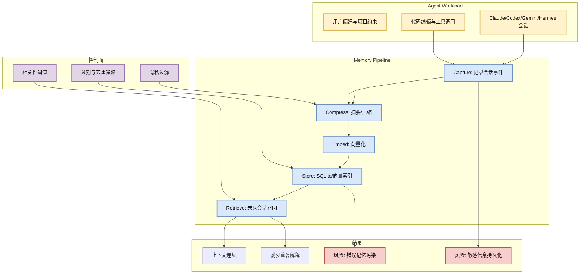

# claude-mem：Agent 长期记忆层

> 类型：GitHub 项目  
> 大类：GitHub  
> 小类：Agent Memory / RAG / Developer Agent  
> 推荐等级：必读  
> 创建日期：2026-06-22  
> 原文链接：https://github.com/thedotmack/claude-mem  
> 网页详情：https://github.com/dyt27666-oss/AI-news-report-obsidians/blob/main/GitHub/2026-06-22/claude-mem-agent-memory.md  
> 返回日报：[[Daily/2026-06-22]]

## 一句话结论

`claude-mem` 的增长说明 agent infra 正从“单次会话执行”转向“长期状态、经验压缩和可召回上下文”。

## TL;DR

- **它是什么**：面向 Claude Code、Codex、Gemini、Hermes 等 coding agent 的持久记忆层。
- **为什么重要**：跨会话记忆会影响 agent 的任务连续性、约束保持、用户偏好继承和调试效率。
- **和我相关的点**：如果你在做长期运行的 coding/RL/ops agent，记忆层其实是 state store + retrieval + compression + safety policy 的组合。
- **建议动作**：用小型代码仓库做 sandbox 试用，重点观察召回精度、隐私边界、压缩漂移和失败恢复。

## 元信息

| 字段 | 内容 |
|---|---|
| repo | thedotmack/claude-mem |
| stars / forks | 83571 / 7230 |
| language | JavaScript |
| updated_at | 2026-06-22T00:57:21Z |
| stars_delta | +170，historical_snapshot |
| topics | ai-memory, ai-agents, embeddings, long-term-memory, sqlite, rag, claude-code |
| 原文 | [GitHub](https://github.com/thedotmack/claude-mem) |

## 信息压缩图示

### 辅助结构：是否试用矩阵

| 维度 | 要验证的问题 | 建议测试 |
|---|---|---|
| 召回质量 | 是否能召回真正相关的项目约束 | 同一仓库跨 3 次任务观察 injected context |
| 安全性 | 是否保存 secrets、token、客户数据 | 人工放置假 secret，检查是否进入 memory store |
| 压缩漂移 | 摘要是否误改用户意图 | 对比原始会话、摘要、下一次注入内容 |
| 性能 | 是否拖慢 agent 启动和执行 | 记录注入前后延迟和 token 增量 |

## 专业解读

Agent memory 的关键不是“记住更多”，而是把长期状态做成可控的检索系统。一个可用的 memory layer 至少要解决 capture、summarization、embedding、storage、retrieval、injection 六个环节，并且需要 privacy filter 和 retention policy。`claude-mem` 的增长说明开发者已经感受到 coding agent 在多会话项目中的上下文断裂问题。

对 AI Infra 来说，这类项目应被视为 agent runtime 的 state subsystem，而不是插件。它会影响 prompt assembly、token budget、RAG latency、debug replay 和 eval reproducibility。真正落地时需要对每条记忆保留来源、时间、置信度、可删除性和注入理由。

## 通俗解释

这像是给 coding agent 加一本“项目笔记本”。它会把以前聊过的约束、做过的修改、踩过的坑保存起来，下一次再工作时自动翻出来。但如果笔记记错了、记太多了或保存了敏感信息，agent 也可能被错误记忆带偏。

## 关键机制拆解

| 机制 | 解决的问题 | 为什么有效 | 可能的坑 |
|---|---|---|---|
| 会话捕获 | agent 每次结束后上下文丢失 | 把事件流持久化，供后续压缩和检索 | 捕获 secret 或噪声 |
| 摘要压缩 | 原始会话太长不能全注入 | 降低 token 成本，保留要点 | 摘要可能丢细节或幻觉 |
| 向量召回 | 未来任务只需要相关记忆 | 用语义相似度筛选上下文 | 相似但错误的记忆会污染 prompt |

## 对我的影响

| 维度 | 影响 | 建议动作 |
|---|---|---|
| AI Infra | 需要将 memory 纳入 agent runtime 的状态管理 | 设计 memory schema 与 observability |
| LLM 工程 | prompt assembly 变得动态且不可忽视 | 建立注入内容审计日志 |
| RL / Game AI | 经验记忆可映射到 rollout buffer / episodic memory | 研究可验证的 memory reward 或 retrieval policy |
| Agent / Eval | 长期记忆会改变 benchmark 可复现性 | eval 时固定 memory snapshot |

## 可信度与局限性

- 证据强度：GitHub snapshot 真实增长强，但未完整审计代码质量。
- 局限性：star 增长不等于生产成熟度。
- 潜在风险：隐私泄露、错误记忆、不可解释注入。
- 还需要确认：默认存储位置、加密/删除能力、与不同 agent 的集成方式。

## 我应该如何跟进

1. 在无敏感信息仓库中试用，观察 memory 文件内容。
2. 设计一组“错误记忆注入”测试，看 agent 是否会被带偏。
3. 对比 claude-mem、mem0、OpenMemory 在 coding agent 场景下的召回质量。

## 相关链接

- 原文：https://github.com/thedotmack/claude-mem
- 网页详情：https://github.com/dyt27666-oss/AI-news-report-obsidians/blob/main/GitHub/2026-06-22/claude-mem-agent-memory.md
- 相关卡片：[[Daily/2026-06-22]]

## 标签

#ai-radar #github #agent #memory #rag #ai-infra
