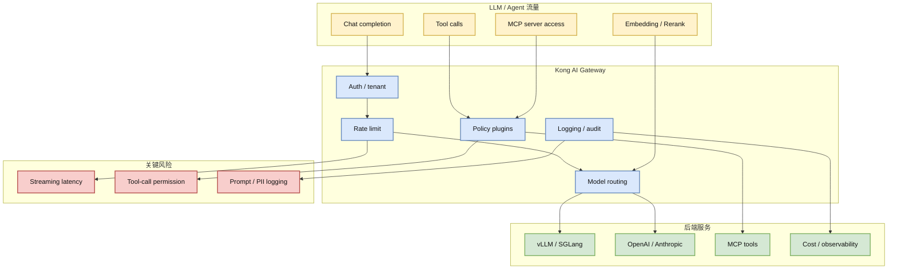

# Kong/kong：API Gateway 正式叠加 AI / MCP Gateway 语义

> 类型：GitHub 项目
> 大类：GitHub
> 小类：AI Gateway / LLMOps / MCP Gateway
> 推荐等级：可 skim
> 创建日期：2026-06-23
> 原文链接：https://github.com/Kong/kong
> 网页详情：https://github.com/dyt27666-oss/AI-news-report-obsidians/blob/main/GitHub/2026-06-23/Kong-AI-Gateway.md
> 返回日报：[[Daily/2026-06-23]]

## 一句话结论

Kong 的 topics 已明确包含 `ai-gateway`、`llm-gateway`、`mcp-gateway`，说明传统 API 网关正在被重新包装为模型调用、工具调用和 MCP 流量的治理入口。

## TL;DR

- **它是什么**：老牌 API Gateway / API management 项目，当前 GitHub 元数据已经把 AI Gateway、LLM Gateway、MCP Gateway 纳入定位。
- **为什么重要**：LLM serving 生产化不只靠 vLLM/SGLang，还需要鉴权、限流、审计、路由、成本控制、tool-call 安全边界。
- **和我相关的点**：适合作为模型 API 入口治理层候选，尤其是多模型、多租户、多工具调用场景。
- **建议动作**：可试验 Kong AI Gateway 与自建 model router / LiteLLM / MCP server 的组合。

## 元信息

| 字段 | 内容 |
|---|---|
| repo | Kong/kong |
| stars / forks | 43650 / 5156 |
| star 增长 | +14，来源：historical_snapshot |
| 语言 | Lua |
| 更新时间 | 2026-06-22T23:46:29Z |
| topics | ai, ai-gateway, api-gateway, api-management, apis, artificial-intelligence |
| 原文 | [GitHub](https://github.com/Kong/kong) |
| benchmark / docs / examples / release | 成熟网关项目，AI/MCP 能力需按 docs/release 继续复核 |
| 是否值得试用 | 值得做 PoC；不建议未压测直接放到高 QPS serving 前 |

## 信息压缩图示

### 辅助图：AI Gateway 评估矩阵

| 能力 | 生产问题 | PoC 指标 |
|---|---|---|
| 多模型路由 | 不同模型成本/延迟/质量不同 | p95 latency、fallback 命中率 |
| 租户限流 | 多团队共用模型入口 | per-tenant QPS、429 策略 |
| MCP 权限 | 工具调用可能越权 | tool allowlist、审计日志完整性 |
| 成本观测 | LLM 调用不可控 | token cost attribution |

## 专业解读

AI Gateway 的价值在于把“模型 API 调用”变成可治理网络流量。传统 serving 栈关注 batch、KV cache、scheduler、kernel；Gateway 层关注谁能调用、调用哪个模型、失败如何降级、日志如何审计、成本如何归因。随着 MCP 工具调用增加，Gateway 还要承担 tool permission 与 audit boundary。

对 AI Infra 来说，Kong 的优势是生态成熟和 plugin 体系；劣势是 LLM streaming、token 级成本统计、prompt/response 安全过滤不一定天然适配，需要额外插件或旁路观测。

## 通俗解释

如果 vLLM/SGLang 是“模型发动机”，AI Gateway 就是“收费站 + 调度室 + 监控摄像头”。它不负责让模型算得更快，但负责谁能用、怎么限速、出问题怎么查。

## 关键机制拆解

| 机制 | 解决的问题 | 为什么有效 | 可能的坑 |
|---|---|---|---|
| API gateway | 统一入口 | 所有模型流量走同一控制点 | 额外延迟 |
| Plugin policy | 快速扩展治理能力 | 鉴权/限流/审计可组合 | 插件链复杂 |
| Model routing | 降低成本或提升可用性 | 按租户/任务选择模型 | 路由策略难评估 |
| MCP gateway | 工具访问治理 | 让工具调用可审计 | 权限粒度不足可能越权 |

## 对我的影响

| 维度 | 影响 | 建议动作 |
|---|---|---|
| AI Infra | 可作为模型入口治理层 | 做 LiteLLM/Kong/vLLM 组合 PoC |
| LLM 工程 | 改善成本、fallback、审计 | 设计 per-request metadata schema |
| RL / Game AI | 可治理 rollout 中的模型服务调用 | 对环境并发调用做限流隔离 |
| Agent / Eval | 工具调用和 MCP 需要网关化 | 评估 tool-call audit 与 replay |

## 可信度与局限性

- 证据强度：GitHub snapshot 显示 repo 活跃且 topics 明确包含 AI Gateway/MCP Gateway。
- 局限性：本轮未抓取 Kong AI Gateway 文档细节；需要后续复核具体插件能力。
- 潜在风险：Gateway 插入 serving 热路径后增加 streaming latency 和运维复杂度。
- 还需要确认：AI 插件列表、MCP 支持边界、token cost logging、benchmark。

## 我应该如何跟进

1. 拉取 Kong AI Gateway/MCP gateway 文档，列出和 LiteLLM 的重叠能力。
2. 搭建最小 PoC：Kong -> LiteLLM -> vLLM，并测 p95/p99。
3. 验证 MCP tool allowlist、日志脱敏和 replay 能力。

## 相关链接

- 原文：https://github.com/Kong/kong
- 网页详情：https://github.com/dyt27666-oss/AI-news-report-obsidians/blob/main/GitHub/2026-06-23/Kong-AI-Gateway.md
- 相关卡片：[[GitHub/2026-06-23/claude-mem-agent-memory]]

## 标签

#ai-radar #github #ai-gateway #llmops #mcp #serving
