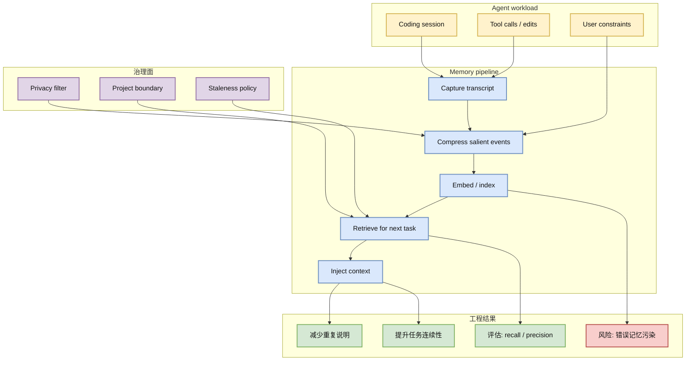

# thedotmack/claude-mem：Agent 长期记忆继续领涨

> 类型：GitHub 项目
> 大类：GitHub
> 小类：Agent Memory / RAG / Developer Agent
> 推荐等级：必读
> 创建日期：2026-06-23
> 原文链接：https://github.com/thedotmack/claude-mem
> 网页详情：https://github.com/dyt27666-oss/AI-news-report-obsidians/blob/main/GitHub/2026-06-23/claude-mem-agent-memory.md
> 返回日报：[[Daily/2026-06-23]]

## 一句话结论

`claude-mem` 今日相对昨日 snapshot 增长 +194 stars，说明“跨会话记忆 + coding agent 上下文治理”仍是 Agent Infra 最强增长信号之一。

## TL;DR

- **它是什么**：为 Claude Code / Codex / Cursor / Opencode 等开发代理保存会话、压缩经验、做向量检索并在后续任务注入上下文的长期记忆层。
- **为什么重要**：长期 agent 的问题不是“聊得久”，而是如何在多天、多仓库、多工具调用中保持约束、复用经验并解释失败原因。
- **和我相关的点**：对 AI Infra 工程师来说，它可作为 agent runtime 的 state store / retrieval layer / privacy boundary 参考。
- **建议动作**：可在沙箱项目中试用，重点测 session capture、embedding 召回、敏感信息过滤和跨任务污染。

## 元信息

| 字段 | 内容 |
|---|---|
| repo | thedotmack/claude-mem |
| stars / forks | 83765 / 7235 |
| star 增长 | +194，来源：historical_snapshot |
| 语言 | JavaScript |
| 更新时间 | 2026-06-23T00:56:12Z |
| topics | ai, ai-agents, ai-memory, anthropic, artificial-intelligence, chromadb |
| 原文 | [GitHub](https://github.com/thedotmack/claude-mem) |
| benchmark / docs / examples / release | GitHub README 可用；benchmark 与生产压测需进一步确认 |
| 是否值得试用 | 值得试用，但必须先限定数据权限和记忆生命周期 |

## 信息压缩图示

### 辅助图：记忆层落地矩阵

| 维度 | 需要验证 | 为什么关键 |
|---|---|---|
| 召回质量 | 旧约束是否被正确带入新任务 | 低召回会让记忆层变成心理安慰 |
| 污染控制 | 错误结论是否会反复注入 | 长期 agent 最怕“错误经验固化” |
| 隐私边界 | token、路径、私有代码是否可过滤 | 记忆层本质是敏感数据仓库 |
| 可观测性 | 能否解释某次注入来自哪里 | 方便 debug agent 决策和评估 |

## 专业解读

Agent 记忆层正在从“聊天历史增强”转向 runtime 基础设施：它要负责事件采集、摘要压缩、向量检索、上下文注入和权限控制。`claude-mem` 的增长说明开发者对跨会话 coding agent 的需求很强，但真正可生产化的难点在检索质量、项目边界、版本漂移和安全过滤。

对 LLM 工程而言，记忆系统会改变 prompt assembly：上下文不再只是当前任务和 repo 文件，而是历史任务中沉淀的约束、失败模式、用户偏好和环境事实。这里需要引入 eval：例如“关键约束召回率”“无关记忆注入率”“敏感片段泄露率”。

## 通俗解释

它像是给 coding agent 装了一个“工程日志大脑”：今天修过的坑、用户强调过的约束、某个仓库的习惯，明天不用重新讲。但如果日志记错了，agent 也可能一直犯同一个错，所以记忆要能删除、审计和验证。

## 关键机制拆解

| 机制 | 解决的问题 | 为什么有效 | 可能的坑 |
|---|---|---|---|
| 会话采集 | agent 任务上下文会丢失 | 把交互和工具调用转成可检索事件 | 采集过多会引入隐私风险 |
| 摘要压缩 | 原始 transcript 太长 | 将长历史压缩成可注入知识 | 摘要可能丢掉关键约束 |
| 向量检索 | 需要按任务找旧经验 | 相似任务可召回相关经验 | 语义相似不等于工程相关 |
| 上下文注入 | agent 需要在新任务利用记忆 | prompt assembly 前补充历史信号 | 注入错误会污染决策 |

## 对我的影响

| 维度 | 影响 | 建议动作 |
|---|---|---|
| AI Infra | 记忆层可抽象为 agent state service | 设计 state API、TTL、project namespace |
| LLM 工程 | 影响 prompt assembly 和 tool routing | 加入 memory retrieval eval |
| RL / Game AI | 类似 replay buffer / episode summary | 可借鉴 episode 压缩与行为归因 |
| Agent / Eval | 需要评估记忆召回与污染 | 建立 recall/precision/泄露测试集 |

## 可信度与局限性

- 证据强度：GitHub snapshot 显示真实 star 增长 +194。
- 局限性：star 增长不等于生产质量；README 信息不能替代压测和安全审计。
- 潜在风险：跨项目记忆污染、敏感信息持久化、旧约束覆盖新指令。
- 还需要确认：存储后端、删除策略、embedding 模型、benchmark、release 质量。

## 我应该如何跟进

1. 在一次真实 coding agent 任务中试用，记录召回命中和误注入。
2. 设计最小 memory eval：10 个历史约束、10 个干扰约束、5 个敏感片段。
3. 对比 Hermes/Codex/Claude Code 的原生上下文机制，判断是否值得接入统一 memory service。

## 相关链接

- 原文：https://github.com/thedotmack/claude-mem
- 网页详情：https://github.com/dyt27666-oss/AI-news-report-obsidians/blob/main/GitHub/2026-06-23/claude-mem-agent-memory.md
- 相关卡片：[[GitHub/2026-06-23/OpenHands-agent-development]]

## 标签

#ai-radar #github #agent #memory #rag #llm-infra
