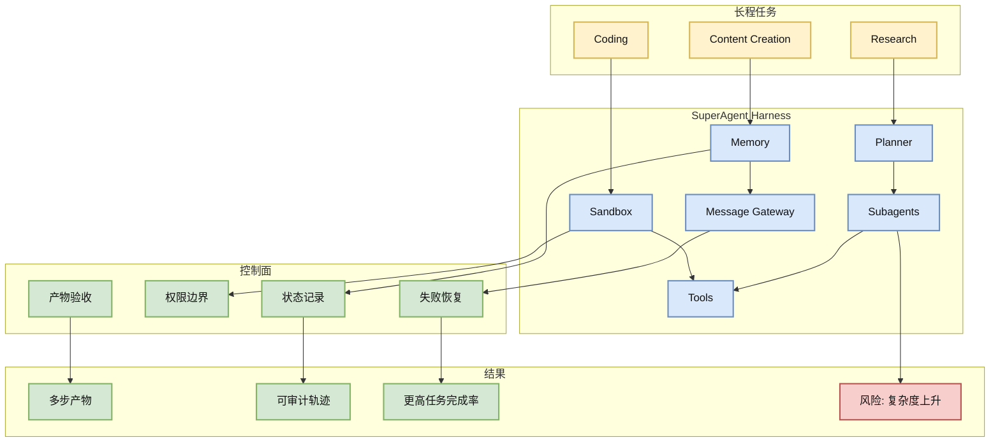
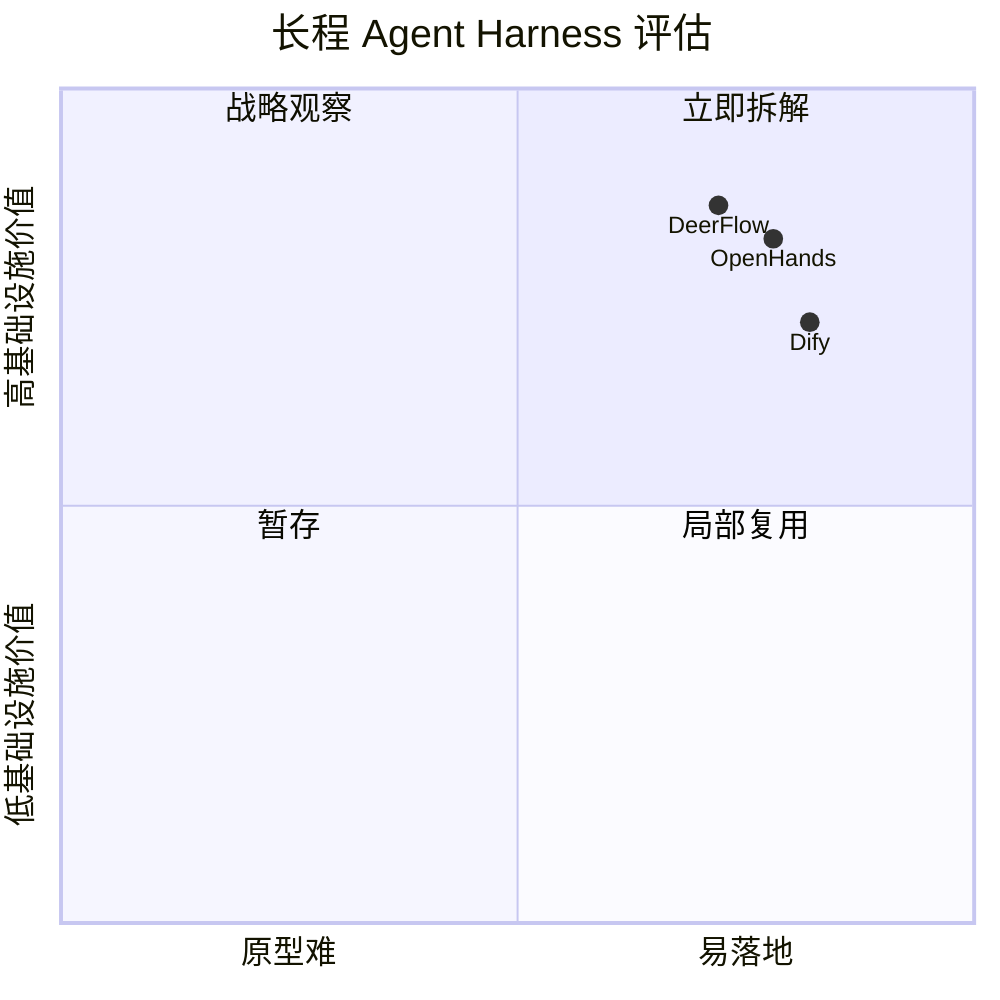

# DeerFlow：长程 SuperAgent Harness 的工程信号

> 类型：GitHub
> 大类：GitHub
> 小类：Long-horizon Agent / Sandbox / Memory / Multi-agent
> 推荐等级：必读
> 创建日期：2026-06-24
> 原文链接：https://github.com/bytedance/deer-flow
> 网页详情：https://github.com/dyt27666-oss/AI-news-report-obsidians/blob/main/GitHub/2026-06-24/deer-flow-long-horizon-superagent.md
> 返回日报：[[Daily/2026-06-24]]

## 一句话结论

`bytedance/deer-flow` 今日 +666 stars，代表长程 agent 正在从“聊天编排”进入带 sandbox、memory、tools、subagents、message gateway 的执行 harness。

## TL;DR

- **它是什么**：字节开源的 long-horizon SuperAgent harness，用于研究、编码、创作等分钟到小时级任务。
- **为什么重要**：长程任务需要隔离环境、记忆、工具、子代理和消息网关，否则 agent 很容易失控、丢上下文或不可审计。
- **和我相关的点**：适合对照 Hermes/OpenHands/LangGraph，提炼长任务 agent 的 runtime checklist。
- **建议动作**：重点看 sandbox 设计、任务状态机、subagent 分工和失败恢复。

## 元信息

| 字段 | 内容 |
|---|---|
| 发布方/来源 | GitHub / ByteDance |
| repo | bytedance/deer-flow |
| stars / forks | 73918 / 9973 |
| stars_delta | +666（historical_snapshot） |
| language | Python |
| updated_at | 2026-06-24T00:57:05Z |
| topics | agent, agentic, agentic-framework, agentic-workflow, ai-agents, deep-research, multi-agent |
| 原文 | [GitHub](https://github.com/bytedance/deer-flow) |

## 信息压缩图示

## 专业解读

长程 agent 与普通 workflow builder 的差异在于“时间”和“状态”。分钟到小时级任务需要持续规划、工具调用、产物落盘、错误恢复和上下文压缩。DeerFlow 的描述明确提到 sandboxes、memories、tools、skill、subagents、message gateway，这些正是 agent runtime 的关键组件。

对 AI Infra 的启发是：长任务 agent 必须像分布式系统一样设计。Planner 类似调度器；sandbox 是隔离执行环境；memory 是状态存储；tools 是外部副作用接口；message gateway 是通信总线；验收器则负责防止“看起来完成”。如果要用于生产，需要任务级审计、权限最小化、资源预算和 rollback。

## 通俗解释

普通 agent ���一个人边想边做；DeerFlow 这类 harness 更像给它配了工作间、笔记本、工具箱、帮手和进度看板。

## 关键机制拆解

| 机制 | 解决的问题 | 为什么有效 | 可能的坑 |
|---|---|---|---|
| Sandbox | 工具调用有副作用 | 隔离执行和资源 | 环境维护成本高 |
| Subagents | 单 agent 长任务易失焦 | 分工并行、局部专家化 | 协调和一致性变复杂 |
| Memory / Gateway | 上下文丢失和通信混乱 | 状态持久化、消息可追踪 | 记忆污染与消息风暴 |

## 对我的影响

| 维度 | 影响 | 建议动作 |
|---|---|---|
| AI Infra | 长程 agent 是 runtime/control-plane 问题 | 画内部 agent harness 架构图 |
| LLM 工程 | prompt 不足以保证多小时任务 | 增加状态机和验收器 |
| RL / Game AI | 多 agent 任务可借鉴 rollout 分工 | 关注轨迹记录和 reward 分配 |
| Agent / Eval | 需要长任务 benchmark | 用 SWE/研究/数据任务评估 |

## 我应该如何跟进

1. 对比 DeerFlow、Hermes、OpenHands 的 runtime 组件。
2. 提炼长程 agent checklist：sandbox、memory、permission、audit、validation。
3. 小规模跑研究/代码任务，看任务轨迹是否可复盘。

## 标签

#ai-radar #github #bytedance #agent #long-horizon-agent #superagent
