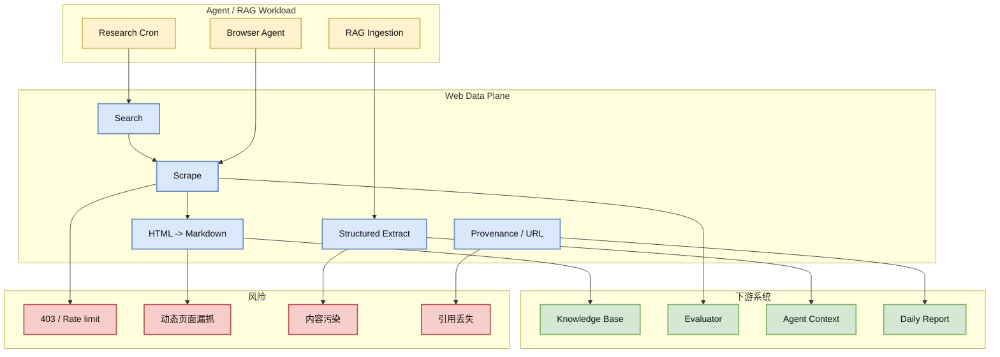
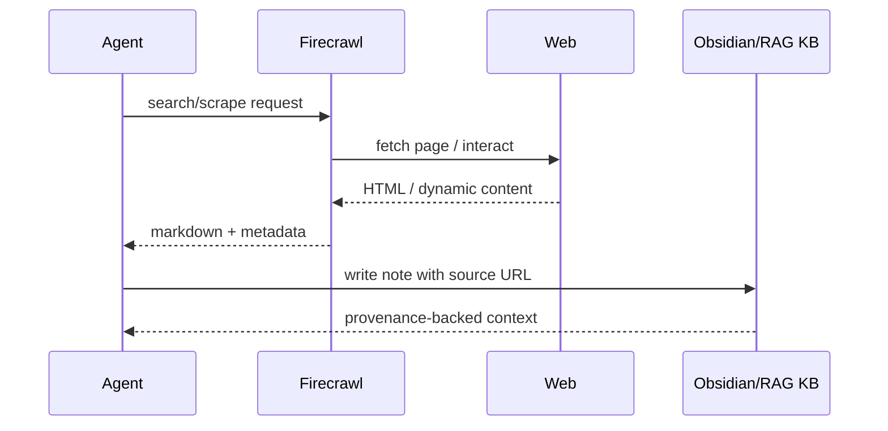

# Firecrawl：Agent Web Data Plane 的增长信号

> 类型：GitHub
> 大类：GitHub
> 小类：Web Data / Agent Tools / RAG
> 推荐等级：必读
> 创建日期：2026-06-24
> 原文链接：https://github.com/firecrawl/firecrawl
> 网页详情：https://github.com/dyt27666-oss/AI-news-report-obsidians/blob/main/GitHub/2026-06-24/firecrawl-agent-web-data-plane.md
> 返回日报：[[Daily/2026-06-24]]

## 一句话结论

`firecrawl/firecrawl` 今日 +892 stars，说明 agent/RAG 系统的瓶颈继续从“会不会调用模型”转向“能否稳定、结构化、可审计地获取 Web 数据”。

## TL;DR

- **它是什么**：面向 AI agent 的网页搜索、抓取、交互和结构化提取 API。
- **为什么重要**：Agent 的上下文质量取决于外部数据平面；爬取失败、HTML 噪音和 provenance 缺失会直接污染答案和评估。
- **和我相关的点**：对自动研究、知识库更新、RAG ingestion、agent 工具调用都有直接价值。
- **建议动作**：把它作为 Web ingestion / scraping baseline，重点评估速率限制、反爬、结构化质量和引用链。

## 元信息

| 字段 | 内容 |
|---|---|
| repo | firecrawl/firecrawl |
| stars / forks | 138184 / 7986 |
| stars_delta | +892（historical_snapshot） |
| language | TypeScript |
| updated_at | 2026-06-24T00:56:36Z |
| topics | ai-agents, ai-crawler, ai-scraping, ai-search, data-extraction, html-to-markdown |
| 原文 | [GitHub](https://github.com/firecrawl/firecrawl) |

## 信息压缩图示

## 专业解读

Web 数据平面是 agent infra 的基础层。没有稳定抓取、去噪、结构化、引用保留和失败记录，agent 的 memory/RAG 只是在缓存不可靠文本。Firecrawl 的增长说明开发者在把“网页可读化”从一次性脚本升级为服务化 API。

对自动研究系统来说，最关键是失败透明：403、429、动态渲染失败、RSS 不稳定都必须被写入日报，而不是被模型脑补。Firecrawl 类工具适合成为 ingestion baseline，但要配合引用完整性检查、去重、站点级速率限制和来源可信度评分。

## 通俗解释

它像给 AI 配了一个更可靠的“网页采集员”：不是把网页截图扔给模型，而是尽量整理成干净、有来源、可放进知识库的材料。

## 关键机制拆解

| 机制 | 解决的问题 | 为什么有效 | 可能的坑 |
|---|---|---|---|
| HTML 转 Markdown | 网页噪音太多 | 降低 RAG chunk 污染 | 动态内容可能漏掉 |
| Search + scrape API | Agent 自己写爬虫成本高 | 把采集服务化 | 仍受反爬和限流影响 |
| Structured extraction | 非结构文本难评估 | 让字段可验证 | schema 错配会丢信息 |

## 对我的影响

| 维度 | 影响 | 建议动作 |
|---|---|---|
| AI Infra | Web ingestion 是 agent data plane | 建 URL provenance 和抓取失败表 |
| LLM 工程 | 上下文质量决定回答质量 | 对比 raw HTML、markdown、structured extract |
| RL / Game AI | 可采集环境/论文/benchmark 页面 | 用于自动构建 watchlist |
| Agent / Eval | 可测 tool-use 检索成功率 | 加入 browse/scrape eval |

## 我应该如何跟进

1. 做 20 个常见 AI blog/paper 页面抓取测试。
2. 记录 markdown 保真度、引用保留、动态页面成功率。
3. 和 browser-use、Playwright 自建抓取做成本/质量对比。

## 标签

#ai-radar #github #agent-tools #web-data #rag #scraping
