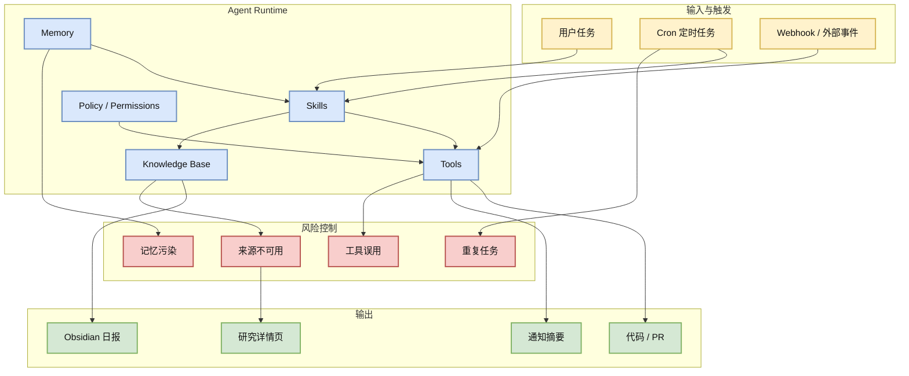
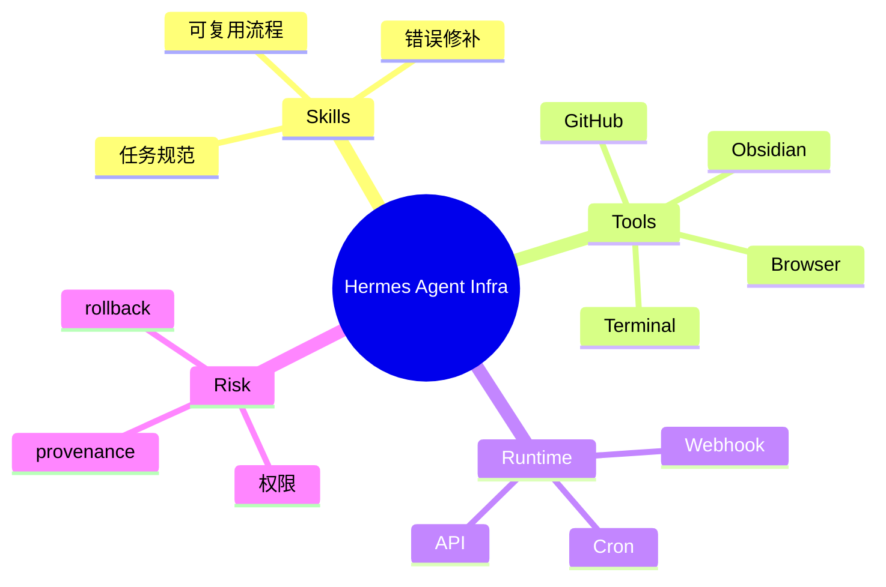

# Hermes Agent：可生长 Agent Runtime 的高增长信号

> 类型：GitHub
> 大类：GitHub
> 小类：Agent Runtime / Skills / Cron / Memory
> 推荐等级：必读
> 创建日期：2026-06-24
> 原文链接：https://github.com/NousResearch/hermes-agent
> 网页详情：https://github.com/dyt27666-oss/AI-news-report-obsidians/blob/main/GitHub/2026-06-24/hermes-agent-self-growing-agent-runtime.md
> 返回日报：[[Daily/2026-06-24]]

## 一句话结论

`NousResearch/hermes-agent` 今日 +982 stars，说明“带工具、技能、定时任务、记忆和可扩展运行时”的本地/服务器 agent 形态正在变成开发者默认期待。

## TL;DR

- **它是什么**：以 skills、tools、cron、memory 为核心的 agent runtime。
- **为什么重要**：Agent Infra 正从单次 chat API 转向长期运行、可扩展、可审计的执行系统。
- **和我相关的点**：它把知识库、工具调用、定时研究、GitHub/Obsidian 工作流串起来，是 agent ops 的可观察样本。
- **建议动作**：重点看 skill 生命周期、工具权限边界、cron 失败恢复和知识库写入规范。

## 元信息

| 字段 | 内容 |
|---|---|
| 发布方/来源 | GitHub |
| repo | NousResearch/hermes-agent |
| stars / forks | 200941 / 35839 |
| stars_delta | +982（historical_snapshot） |
| language | Python |
| updated_at | 2026-06-24T01:00:22Z |
| 原文 | [GitHub](https://github.com/NousResearch/hermes-agent) |

## 信息压缩图示

## 专业解读

Hermes 的增长和今日 AI Radar 本身形成闭环：一个可长期运行的 agent 不只是模型 wrapper，而是带有任务记忆、技能库、工具接口、调度器和输出契约的运行时。对 AI Infra 工程师最有价值的不是“它能聊天”，而是它如何管理工具权限、任务上下文、失败降级、知识库增量写入和可验证输出。

和 LangChain/Dify 这类编排平台相比，Hermes 更接近个人/团队 agent OS：它关注每天自动执行任务、把经验沉淀成 skill、将结果写入 Obsidian/GitHub。生产风险也更明显：一旦 cron 写错、工具权限过宽或记忆污染，长期任务会持续放大错误。因此需要强制验收、透明 provenance、snapshot 和 git history。

## 通俗解释

普通聊天机器人像一次性问答；Hermes 更像一个会记笔记、会定时上班、会调用工具、还会把工作方法写进手册的助理。

## 关键机制拆解

| 机制 | 解决的问题 | 为什么有效 | 可能的坑 |
|---|---|---|---|
| Skills | 重复任务靠 prompt 临场发挥 | 把流程固化为可复用手册 | skill 过期会变成负债 |
| Cron | 研究/巡检需要每天执行 | 让 agent 成为持续系统 | 失败重试和幂等很关键 |
| Tool 权限 | Agent 需要真实操作环境 | 可完成 GitHub/Obsidian 等端到端任务 | 权限过大需审计 |

## 对我的影响

| 维度 | 影响 | 建议动作 |
|---|---|---|
| AI Infra | 参考 agent runtime control plane | 建 tool policy、task validation、snapshot |
| LLM 工程 | skill 是 prompt engineering 的工程化形态 | 给核心工作流写技能和测试 |
| RL / Game AI | 可用于实验巡检、训练日志归档 | 接入训练 job summary cron |
| Agent / Eval | 可定义长期任务成功率 | 评估多日一致性和错误恢复 |

## 可信度与局限性

- 证据强度：GitHub 高 star 与高增长均强，但具体工程质量需看 issue、release、测试覆盖。
- 局限性：个人 agent OS 与企业 agent platform 的安全边界不同。
- 潜在风险：长期运行任务会放大小错误。

## 我应该如何跟进

1. 复盘 Hermes cron 任务的验收模式，沉淀到内部 agent ops checklist。
2. 关注 skill 更新、权限策略、失败降级和输出验证。
3. 对比 Dify/LangChain/OpenHands，看哪些能力适合平台化。

## 相关链接

- 原文：https://github.com/NousResearch/hermes-agent
- 网页详情：https://github.com/dyt27666-oss/AI-news-report-obsidians/blob/main/GitHub/2026-06-24/hermes-agent-self-growing-agent-runtime.md

## 标签

#ai-radar #github #agent-runtime #skills #cron #memory
