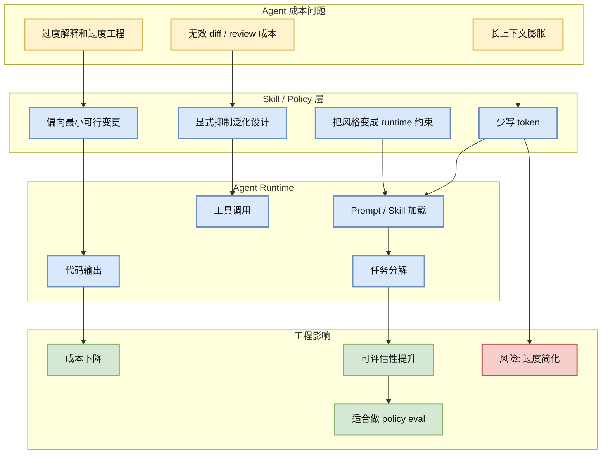
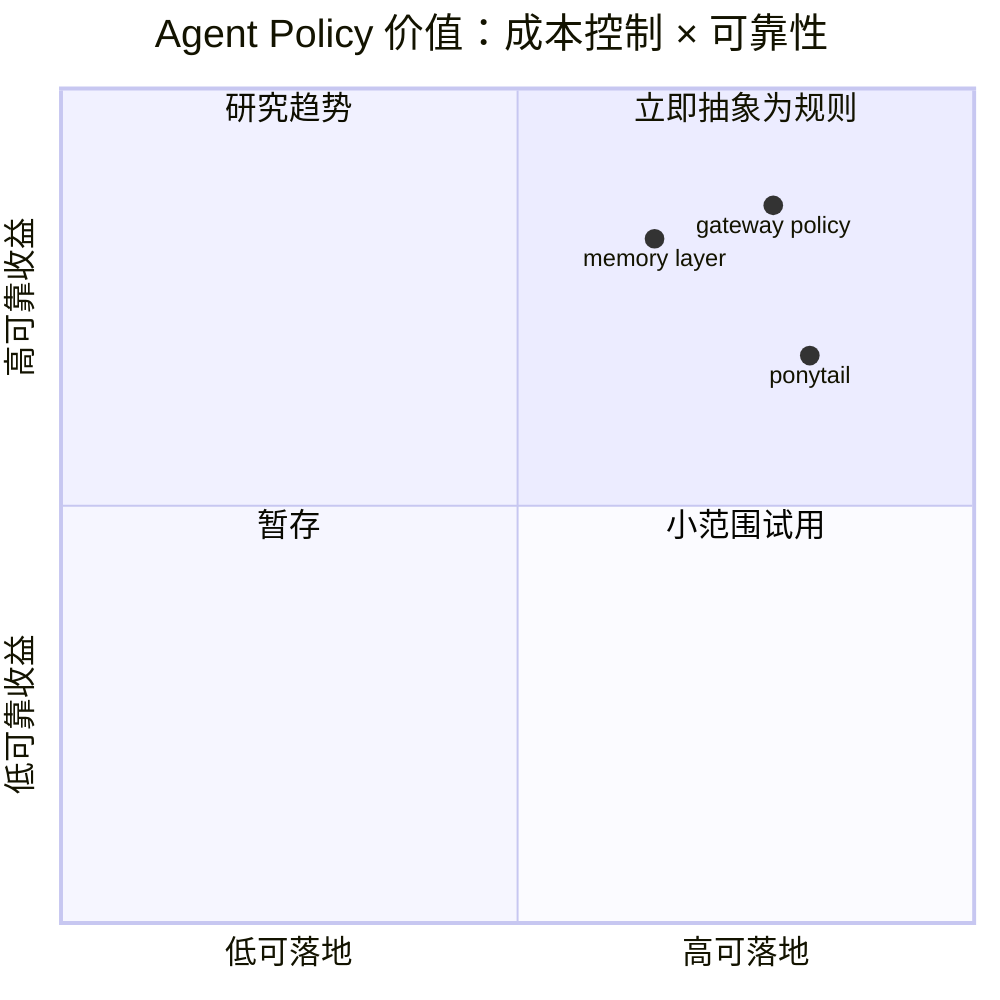

# ponytail：Agent Skill 的 Token Economy 信号

> 类型：GitHub
> 大类：GitHub
> 小类：Agent Skills / Token Economy / Developer Agent
> 推荐等级：必读
> 创建日期：2026-06-24
> 原文链接：https://github.com/DietrichGebert/ponytail
> 网页详情：https://github.com/dyt27666-oss/AI-news-report-obsidians/blob/main/GitHub/2026-06-24/ponytail-agent-skill-token-economy.md
> 返回日报：[[Daily/2026-06-24]]

## 一句话结论

`ponytail` 今日在 snapshot 中真实增长 +2693 stars，核心不是“搞笑 prompt”，而是开发者开始把 coding agent 的成本、token 预算和输出约束当成可工程化控制面。

## TL;DR

- **它是什么**：Claude Code / coding agent skill，目标是让 agent 用更少 token、更少冗余动作完成任务。
- **为什么重要**：长任务 agent 的单位任务成本正在从模型价格扩展到上下文污染、工具调用、review 时间和无效 diff。
- **和我相关的点**：AI Infra 侧可以把它看成“agent runtime policy”的轻量样本：约束输出、减少过度工程、压缩上下文。
- **建议动作**：不要直接照搬风格；抽取其中的预算控制、YAGNI、最小变更策略，放进内部 coding-agent policy/eval。

## 元信息

| 字段 | 内容 |
|---|---|
| 发布方/来源 | GitHub |
| repo | DietrichGebert/ponytail |
| stars / forks | 52503 / 2619 |
| stars_delta | +2693（historical_snapshot） |
| language | JavaScript |
| updated_at | 2026-06-24T01:00:11Z |
| topics | agent-skills, ai-agents, claude, claude-code, developer-tools, llm |
| 原文 | [GitHub](https://github.com/DietrichGebert/ponytail) |

## 信息压缩图示

## 专业解读

`ponytail` 的流行说明 coding agent 的竞争不只在模型能力，也在“执行纪律”。当 agent 具备工具调用和代码修改能力后，最常见损耗不是单次推理失败，而是上下文越滚越大、解释过长、任务边界漂移、把简单修复扩展成重构。这个项目以夸张风格表达了一个真实基础设施问题：agent runtime 需要 policy layer 来控制 token、动作、修改范围和输出格式。

对 AI Infra 来说，值得抽象的是：skill 是否能稳定降低 token/input-output ratio；是否减少无效工具调用；是否降低 reviewer 返工；是否引入漏改、过度简化或可读性下降。真正可生产化的版本应配套 benchmark：同一批 coding tasks，在默认 agent 与 policy-constrained agent 之间比较成功率、diff size、tokens、tool calls、review comments。

## 通俗解释

它像给 AI 程序员贴了一张便签：“别啰嗦、别炫技、能少改就少改”。笑点背后是钱和可靠性：AI 写得越多，越可能贵、慢、难审、容易改坏。

## 关键机制拆解

| 机制 | 解决的问题 | 为什么有效 | 可能的坑 |
|---|---|---|---|
| Token 预算约束 | 长任务上下文膨胀 | 限制解释和重复信息 | 可能丢失必要推理 |
| 最小变更倾向 | 过度工程 | 缩小 diff 和回归面 | 复杂 bug 可能修不彻底 |
| Skill 化注入 | 每次手写 prompt 不稳定 | 让策略可复用、可版本化 | 需要按任务类型分层 |

## 对我的影响

| 维度 | 影响 | 建议动作 |
|---|---|---|
| AI Infra | agent runtime policy 值得单独建层 | 设计 token/tool/diff 三类预算指标 |
| LLM 工程 | prompt/skill 可转化为 eval variable | 做 A/B task benchmark |
| RL / Game AI | 类似 reward shaping：少走弯路但不能抑制探索 | 只在工程型任务启用强约束 |
| Agent / Eval | 可做 agent 行为评估样本 | 加入 coding-agent eval 集 |

## 可信度与局限性

- 证据强度：GitHub stars_delta 强，但技术质量仍需源码和任务实测确认。
- 局限性：项目表述偏 meme，不能等同于严肃 agent infra 框架。
- 潜在风险：过分追求短输出会牺牲推理透明度和复杂问题完整性。
- 还需要确认：是否有稳定 release、测试、真实 benchmark。

## 我应该如何跟进

1. 抽取“少 token / 小 diff / 少工具调用”的可测指标。
2. 用 20 个 coding-agent 任务跑默认策略与 budget 策略对照。
3. 把有用规则沉淀进内部 agent skill，而不是复制 meme 表达。

## 相关链接

- 原文：https://github.com/DietrichGebert/ponytail
- 网页详情：https://github.com/dyt27666-oss/AI-news-report-obsidians/blob/main/GitHub/2026-06-24/ponytail-agent-skill-token-economy.md
- 相关卡片：[[GitHub/2026-06-24/hermes-agent-self-growing-agent-runtime]]、[[GitHub/2026-06-24/claude-mem-agent-memory]]

## 标签

#ai-radar #github #agent #agent-skills #token-economy #coding-agent
