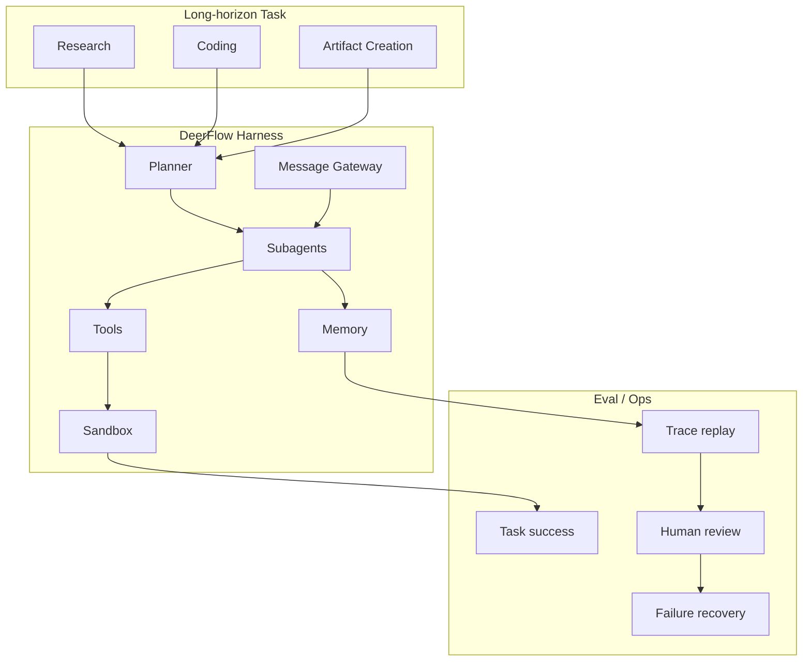
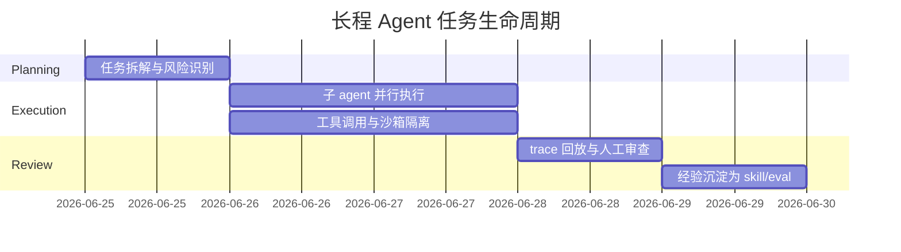

# DeerFlow：长程 SuperAgent Harness 的工程信号

> 类型：GitHub 项目  
> 大类：GitHub  
> 小类：Long-horizon Agent / Sandbox / Multi-agent  
> 推荐等级：必读  
> 创建日期：2026-06-25  
> 原文链接：https://github.com/bytedance/deer-flow  
> 网页详情：https://github.com/dyt27666-oss/AI-news-report-obsidians/blob/main/GitHub/2026-06-25/deer-flow-long-horizon-superagent.md  
> 返回日报：[[Daily/2026-06-25]]

## 一句话结论
DeerFlow 今日 +527 stars，说明长程 agent 正在以 harness / sandbox / memory / subagent / gateway 的系统形态出现。

## TL;DR
- **它是什么**：开源 long-horizon SuperAgent harness，面向 research、coding、content creation。
- **为什么重要**：长任务失败模式类似分布式系统：状态漂移、权限过宽、工具失败、子任务合并错误。
- **和我相关的点**：适合作为 AI Radar、代码改造、多 agent review 的架构参考。
- **建议动作**：深挖 sandbox、message gateway、memory schema 和 subagent orchestration。

## 信息压缩图示

## 专业解读
DeerFlow 和 Hermes 的共同信号是：agent runtime 开始显式处理长任务生命周期，而不是只包装 LLM API。对 AI Infra 来说，重点要看 sandbox 隔离、subagent 通信协议、memory 读写策略、trace 回放和失败恢复。

## 通俗解释
它不是让一个模型一直聊，而是给复杂任务配一个项目组：有计划者、多个执行者、工具、沙箱、记忆和复盘。

## 关键机制拆解
| 机制 | 解决的问题 | 为什么有效 | 可能的坑 |
|---|---|---|---|
| Planner | 长任务目标不清 | 先拆成可执行子任务 | 计划错会放大错误 |
| Subagents | 单 agent 上下文爆炸 | 并行处理不同子任务 | 合并结果需审查 |
| Sandbox | 工具执行有风险 | 隔离副作用 | 权限配置复杂 |

## 对我的影响
| 维度 | 影响 | 建议动作 |
|---|---|---|
| AI Infra | 可借鉴 worker/harness/control-plane 分层 | 与 Hermes 做架构对照 |
| LLM 工程 | 长程代码任务需要状态机 | 关注 message gateway 和 review loop |
| RL / Game AI | 长程轨迹可转 eval/training data | 看 trajectory schema 是否适合 RL |
| Agent / Eval | 适合构建真实任务 benchmark | 记录成功率/重试/人工修正 |

## 标签
#ai-radar #github #deerflow #long-horizon-agent #bytedance
