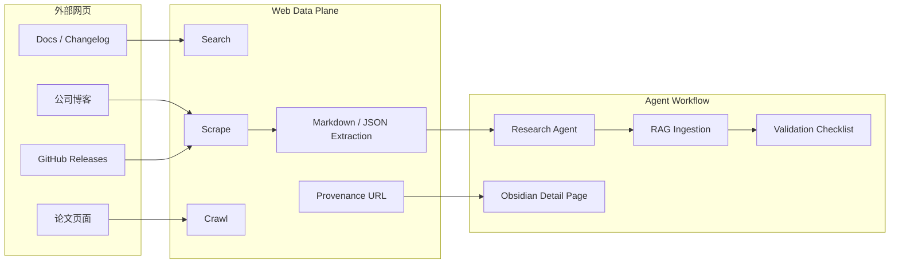
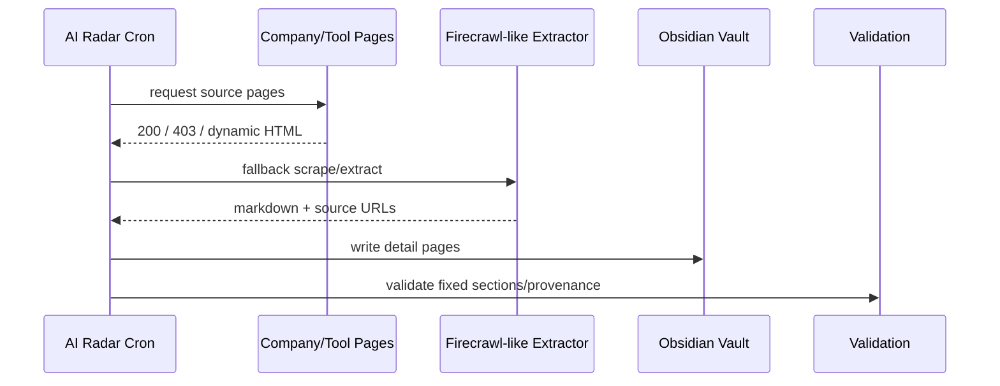

# Firecrawl：Agent Web Data Plane 继续高增长

> 类型：GitHub 项目  
> 大类：GitHub  
> 小类：Web Data / Agent Tools / RAG  
> 推荐等级：必读  
> 创建日期：2026-06-25  
> 原文链接：https://github.com/firecrawl/firecrawl  
> 网页详情：https://github.com/dyt27666-oss/AI-news-report-obsidians/blob/main/GitHub/2026-06-25/firecrawl-agent-web-data-plane.md  
> 返回日报：[[Daily/2026-06-25]]

## 一句话结论
Firecrawl 今日 +532 stars，持续证明 agent/RAG 的瓶颈不只是推理，而是可追溯、结构化、稳定的外部网页数据平面。

## TL;DR
- **它是什么**：面向 AI apps 的 search、scrape、crawl、HTML-to-markdown、structured extraction API。
- **为什么重要**：自动研究和知识库更新需要稳定抓取与 provenance，否则会把网页噪音写进长期记忆。
- **和我相关的点**：AI Radar 对大厂博客、release notes、论文页面抓取失败时，可用此类工具做 fallback。
- **建议动作**：建立 crawl fidelity benchmark：可访问率、正文抽取质量、链接保真度、反爬失败率。

## 信息压缩图示

## 专业解读
外部数据平面正在成为 agent infra 的基础组件。对自动研究系统而言，抓取不是“辅助功能”，而是数据入口的可靠性问题：来源状态、正文抽取、链接保真度、时间戳和失败原因都要进入 provenance。

## 通俗解释
它像给 agent 配了一个网页采集管道：不只是打开网页，而是把网页变成结构化、可引用、可进入知识库的材料。

## 关键机制拆解
| 机制 | 解决的问题 | 为什么有效 | 可能的坑 |
|---|---|---|---|
| Crawl / scrape | 网页结构混乱 | 把页面转成可处理文本 | 反爬和动态页面会失败 |
| Markdown extraction | RAG 需要清洁文本 | 降低 HTML 噪音 | 表格/代码块可能丢结构 |
| Provenance | 研究内容要可追踪 | 每条保留 URL | 源页面变更会造成漂移 |

## 对我的影响
| 维度 | 影响 | 建议动作 |
|---|---|---|
| AI Infra | 数据入口可靠性是生产化前提 | 建 crawl benchmark |
| LLM 工程 | RAG 质量受抽取质量限制 | 比较 Firecrawl/Browser-use/自研抽取 |
| RL / Game AI | 网页弱相关 | 仅用于资料采集 |
| Agent / Eval | 可作为 browser/research agent 工具 | 测工具调用成本和失败恢复 |

## 标签
#ai-radar #github #firecrawl #rag #agent-tools
