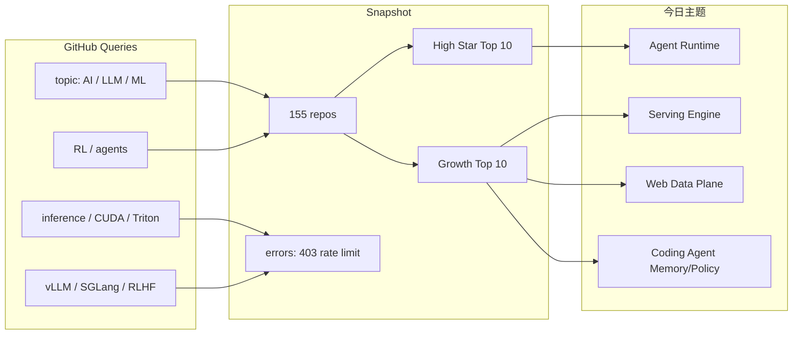
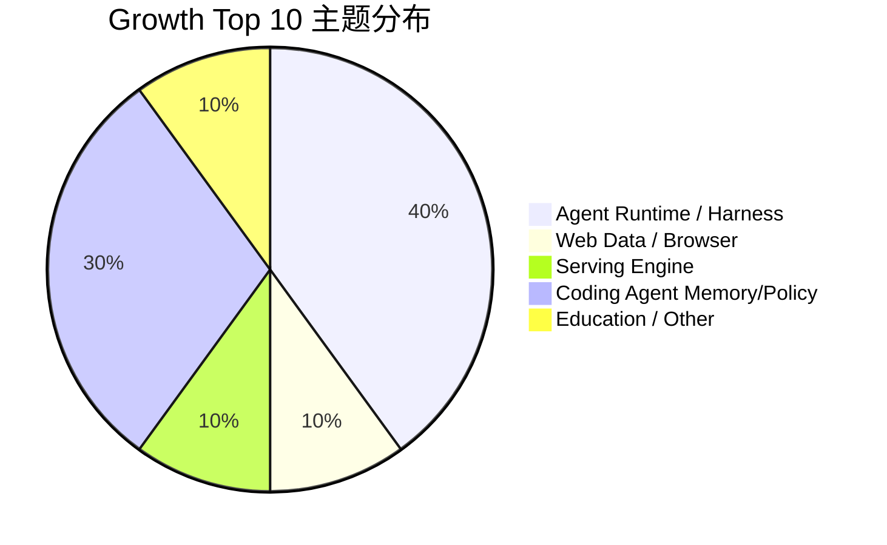

# GitHub Snapshot Top 10 汇总 - 2026-06-25

> 类型：GitHub 榜单详情  
> 大类：GitHub  
> 小类：AI Infra / LLM / Agent / Tools  
> 推荐等级：可 skim  
> 创建日期：2026-06-25  
> 原文链接：https://github.com/  
> 网页详情：https://github.com/dyt27666-oss/AI-news-report-obsidians/blob/main/GitHub/2026-06-25/github-snapshot-top10.md  
> 返回日报：[[Daily/2026-06-25]]

## 一句话结论
今日 GitHub snapshot 成功采集 155 个 repo；高 star 仍由 agent harness、本地 LLM、Transformers、workflow 平台占据，增长榜则集中在 Agent OS、web data plane、vLLM serving 和 coding-agent memory/policy。

## TL;DR
- **采集脚本**：`Automation/collect_github_stars.py`。
- **snapshot**：`Automation/state/github-stars-2026-06-25.json`。
- **baseline**：已读取历史 snapshot，非冷启动。
- **风险**：后半段 GitHub API 查询 403 rate limit，可能漏掉部分高增长项目。

## 结构图

## 高 star Top 10
| 排名 | repo | stars | forks | language | 说明 |
|---:|---|---:|---:|---|---|
| 1 | [affaan-m/ECC](https://github.com/affaan-m/ECC) | 221195 | 33875 | JavaScript | Agent harness performance optimization system。 |
| 2 | [NousResearch/hermes-agent](https://github.com/NousResearch/hermes-agent) | 202053 | 36113 | Python | The agent that grows with you。 |
| 3 | [tensorflow/tensorflow](https://github.com/tensorflow/tensorflow) | 196016 | 75190 | C++ | Open Source Machine Learning Framework。 |
| 4 | [Significant-Gravitas/AutoGPT](https://github.com/Significant-Gravitas/AutoGPT) | 185152 | 46124 | Python | Autonomous agent project。 |
| 5 | [ollama/ollama](https://github.com/ollama/ollama) | 174867 | 16718 | Go | Local LLM runtime。 |
| 6 | [f/prompts.chat](https://github.com/f/prompts.chat) | 164266 | 21270 | HTML | Prompt collection。 |
| 7 | [huggingface/transformers](https://github.com/huggingface/transformers) | 161877 | 33589 | Python | Model-definition framework。 |
| 8 | [langflow-ai/langflow](https://github.com/langflow-ai/langflow) | 150042 | 9332 | Python | AI agents and workflows。 |
| 9 | [langgenius/dify](https://github.com/langgenius/dify) | 146469 | 23043 | TypeScript | Agentic workflow platform。 |
| 10 | [open-webui/open-webui](https://github.com/open-webui/open-webui) | 142902 | 20588 | Python | AI interface for local/API models。 |

## 增长 Top 10
| 排名 | repo | delta | stars | language | 说明 |
|---:|---|---:|---:|---|---|
| 1 | [NousResearch/hermes-agent](https://github.com/NousResearch/hermes-agent) | 1112 | 202053 | Python | Agent runtime。 |
| 2 | [affaan-m/ECC](https://github.com/affaan-m/ECC) | 653 | 221195 | JavaScript | Agent harness。 |
| 3 | [firecrawl/firecrawl](https://github.com/firecrawl/firecrawl) | 532 | 138716 | TypeScript | Web data plane。 |
| 4 | [bytedance/deer-flow](https://github.com/bytedance/deer-flow) | 527 | 74445 | Python | Long-horizon SuperAgent harness。 |
| 5 | [vllm-project/vllm](https://github.com/vllm-project/vllm) | 416 | 84074 | Python | LLM serving engine。 |
| 6 | [JuliusBrussee/caveman](https://github.com/JuliusBrussee/caveman) | 349 | 76587 | JavaScript | Claude Code token-reduction skill。 |
| 7 | [asgeirtj/system_prompts_leaks](https://github.com/asgeirtj/system_prompts_leaks) | 321 | 45731 | JavaScript | System prompt watchlist。 |
| 8 | [rohitg00/ai-engineering-from-scratch](https://github.com/rohitg00/ai-engineering-from-scratch) | 206 | 36191 | Python | AI engineering course。 |
| 9 | [thedotmack/claude-mem](https://github.com/thedotmack/claude-mem) | 202 | 84136 | JavaScript | Agent memory。 |
| 10 | [TauricResearch/TradingAgents](https://github.com/TauricResearch/TradingAgents) | 182 | 88365 | Python | Multi-agent financial workflow。 |

## 专业解读
高 star 榜代表生态底座，增长榜代表短期注意力。今天两者交集显示：agent runtime 和 serving engine 是最值得同时跟踪的两条线。单看应用层会漏掉 vLLM 这种底层吞吐信号，单看底层则会漏掉 Hermes/DeerFlow 这类 long-horizon runtime 形态。

## 标签
#ai-radar #github #snapshot #stars
