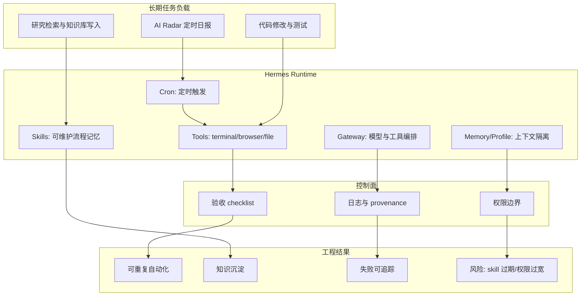
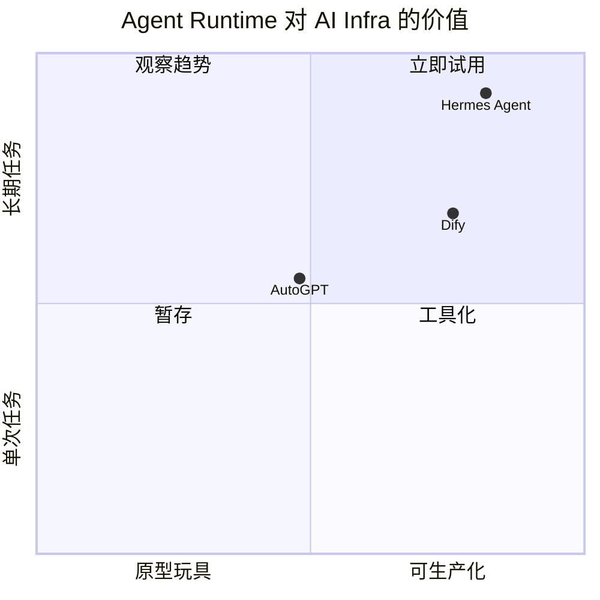

# Hermes Agent：可生长 Agent OS Runtime

> 类型：GitHub 项目  
> 大类：GitHub  
> 小类：Agent Runtime / Skills / Cron / Memory  
> 推荐等级：必读  
> 创建日期：2026-06-25  
> 原文链接：https://github.com/NousResearch/hermes-agent  
> 网页详情：https://github.com/dyt27666-oss/AI-news-report-obsidians/blob/main/GitHub/2026-06-25/hermes-agent-agent-os-runtime.md  
> 返回日报：[[Daily/2026-06-25]]

## 一句话结论
Hermes Agent 的高增长说明 coding agent 竞争正在从单次补全转向长期运行、可积累技能、可定时执行、可写知识库的 Agent OS。

## TL;DR
- **它是什么**：一个带 tools、skills、cron、memory、profiles 的本地 agent runtime。
- **为什么重要**：它把自动研究、代码执行、知识沉淀和定时任务放在同一个可审计运行环境里。
- **和我相关的点**：AI Radar 本身就是这类 runtime 的生产用例；重点观察 skill 维护、工具权限和验收机制。
- **建议动作**：把 Hermes / DeerFlow / Dify / OpenHands 放到同一张 agent runtime 对照表里，评估长期任务失败恢复。

## 元信息
| 字段 | 内容 |
|---|---|
| repo | NousResearch/hermes-agent |
| stars / forks | 202053 / 36113 |
| stars_delta | +1112，相对上一历史 snapshot |
| language | Python |
| updated_at | 2026-06-25T00:51:50Z |
| 原文 | [GitHub](https://github.com/NousResearch/hermes-agent) |

## 信息压缩图示

## 专业解读
Hermes 的信号不在“又一个聊天 agent”，而在 runtime 化：工具调用、skill 复用、cron 触发、知识库写入、profile 隔离、验收清单形成闭环。这接近一个面向工程任务的控制平面。对 AI Infra 工程师来说，关键不是模型多强，而是长任务是否能被拆解、记录、回滚、审计和复用。

## 通俗解释
它像给 AI 配了一个工作台：能按时开工，知道可以用哪些工具，做完把经验写成笔记，下次遇到相似任务少走弯路。

## 关键机制拆解
| 机制 | 解决的问题 | 为什么有效 | 可能的坑 |
|---|---|---|---|
| Skills | 重复任务靠临场发挥 | 把成功流程沉淀为可读步骤 | skill 过期会污染执行 |
| Cron | 自动研究/巡检需定时 | 把 agent 变成事件驱动 worker | 失败后若无验收会静默产出垃圾 |
| Tool provenance | 外部事实需要证据 | 文件、命令、链接可追踪 | 权限过宽会扩大误操作风险 |

## 对我的影响
| 维度 | 影响 | 建议动作 |
|---|---|---|
| AI Infra | 可作为 agent control plane 参考 | 评估日志、权限、失败恢复 |
| LLM 工程 | 将 prompt/skill/eval 合并进工作流 | 抽象 coding-agent 质量指标 |
| RL / Game AI | 长任务轨迹可形成训练/评估数据 | 关注 tool-use reward 与 trajectory schema |
| Agent / Eval | 适合做真实工作流 benchmark | 记录每次 cron 的成功率和人工修正 |

## 可信度与局限性
- 证据强度：GitHub snapshot 显示 +1112 stars，且仓库高活跃。
- 局限性：star 增长不等于生产成熟，需要继续看 issue、release、失败日志和权限模型。
- 潜在风险：agent runtime 越强，越需要严格的 scope、审计和回滚。

## 我应该如何跟进
1. 用 Hermes / DeerFlow / Dify 对照 long-horizon task lifecycle。
2. 设计 coding-agent eval：任务成功率、diff 大小、工具调用次数、人工返工率。
3. 将 AI Radar 的失败源、采集异常和补抓队列固化为 skill。

## 相关链接
- 原文：https://github.com/NousResearch/hermes-agent
- 网页详情：https://github.com/dyt27666-oss/AI-news-report-obsidians/blob/main/GitHub/2026-06-25/hermes-agent-agent-os-runtime.md

## 标签
#ai-radar #github #agent-runtime #hermes #ai-infra
