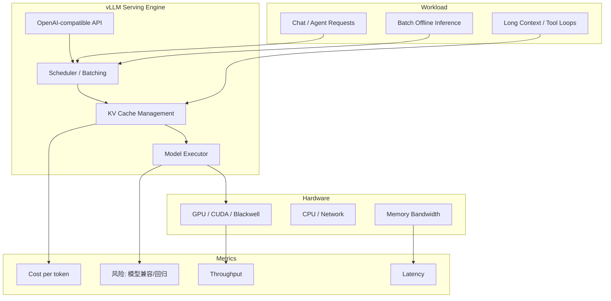
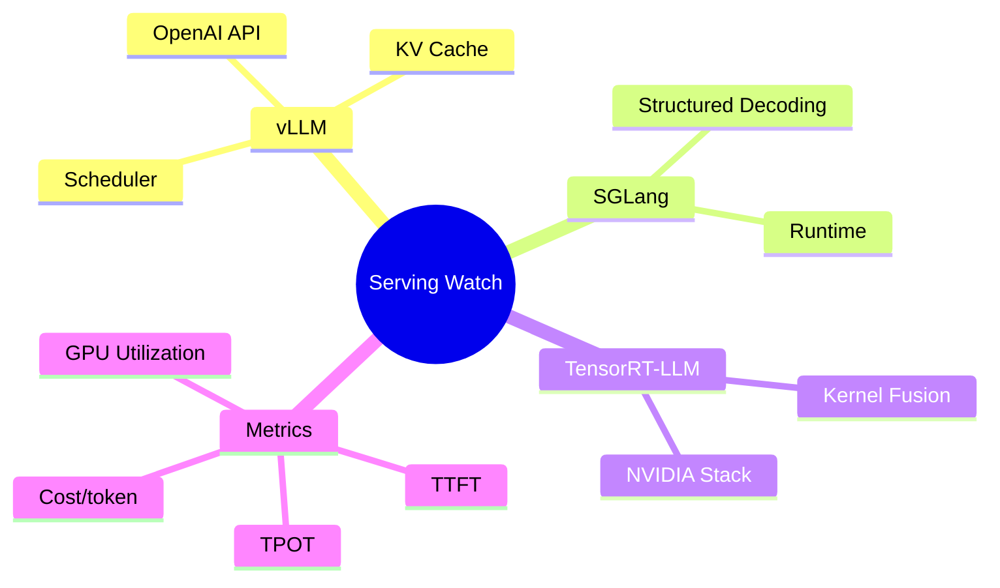

# vLLM：Serving Engine 在增长榜重新进入前列

> 类型：GitHub 项目  
> 大类：GitHub  
> 小类：LLM Serving / Inference / KV Cache  
> 推荐等级：必读  
> 创建日期：2026-06-25  
> 原文链接：https://github.com/vllm-project/vllm  
> 网页详情：https://github.com/dyt27666-oss/AI-news-report-obsidians/blob/main/GitHub/2026-06-25/vllm-serving-engine-growth.md  
> 返回日报：[[Daily/2026-06-25]]

## 一句话结论
vLLM 今日 +416 stars，说明在 agent 热点之外，真实 LLM serving 引擎仍是 AI Infra 的硬需求核心。

## TL;DR
- **它是什么**：高吞吐、内存高效的 LLM inference/serving engine。
- **为什么重要**：agent、RAG、coding workflow 的成本和延迟最终都落到 serving scheduler、KV cache、batching 和硬件利用率上。
- **和我相关的点**：适合继续跟踪 Blackwell、CUDA、DeepSeek/GPT-OSS/Kimi/Qwen 等模型支持与推理优化。
- **建议动作**：把 vLLM 与 SGLang、TensorRT-LLM 放入固定 serving watchlist。

## 元信息
| 字段 | 内容 |
|---|---|
| repo | vllm-project/vllm |
| stars / forks | 84074 / 18445 |
| stars_delta | +416 |
| language | Python |
| updated_at | 2026-06-25T00:51:41Z |
| 原文 | [GitHub](https://github.com/vllm-project/vllm) |

## 信息压缩图示

## 专业解读
今天的增长榜同时出现 agent runtime 和 vLLM，说明市场并没有只关注应用层。Agent 系统越复杂，越依赖稳定的低延迟推理层；长上下文、多工具调用、并发 research worker 都会放大 KV cache 与 scheduler 的瓶颈。

## 通俗解释
如果 agent 是工人，vLLM 更像工厂流水线。工人越多、任务越长，流水线效率就越关键。

## 关键机制拆解
| 机制 | 解决的问题 | 为什么有效 | 可能的坑 |
|---|---|---|---|
| Continuous batching | 请求到达不均匀 | 提高 GPU 利用率 | 复杂 workload 下 tail latency 需测 |
| KV cache 管理 | 长上下文内存贵 | 复用 attention 状态 | 碎片和换入换出影响稳定性 |
| API 兼容 | 业务接入成本 | 复用 OpenAI ecosystem | 新模型特性可能滞后 |

## 对我的影响
| 维度 | 影响 | 建议动作 |
|---|---|---|
| AI Infra | serving baseline 仍是必追 | 每周跟踪 release/benchmark |
| LLM 工程 | 影响 agent 成本和响应 | 测长上下文与 tool-call workload |
| RL / Game AI | rollout 推理吞吐决定训练成本 | 关注 batched environment inference |
| Agent / Eval | agent eval 需要稳定 serving 后端 | 记录 TTFT/TPOT/失败率 |

## 标签
#ai-radar #github #vllm #serving #inference
