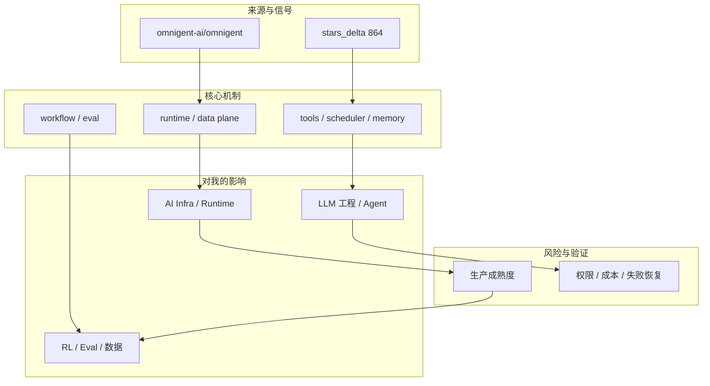
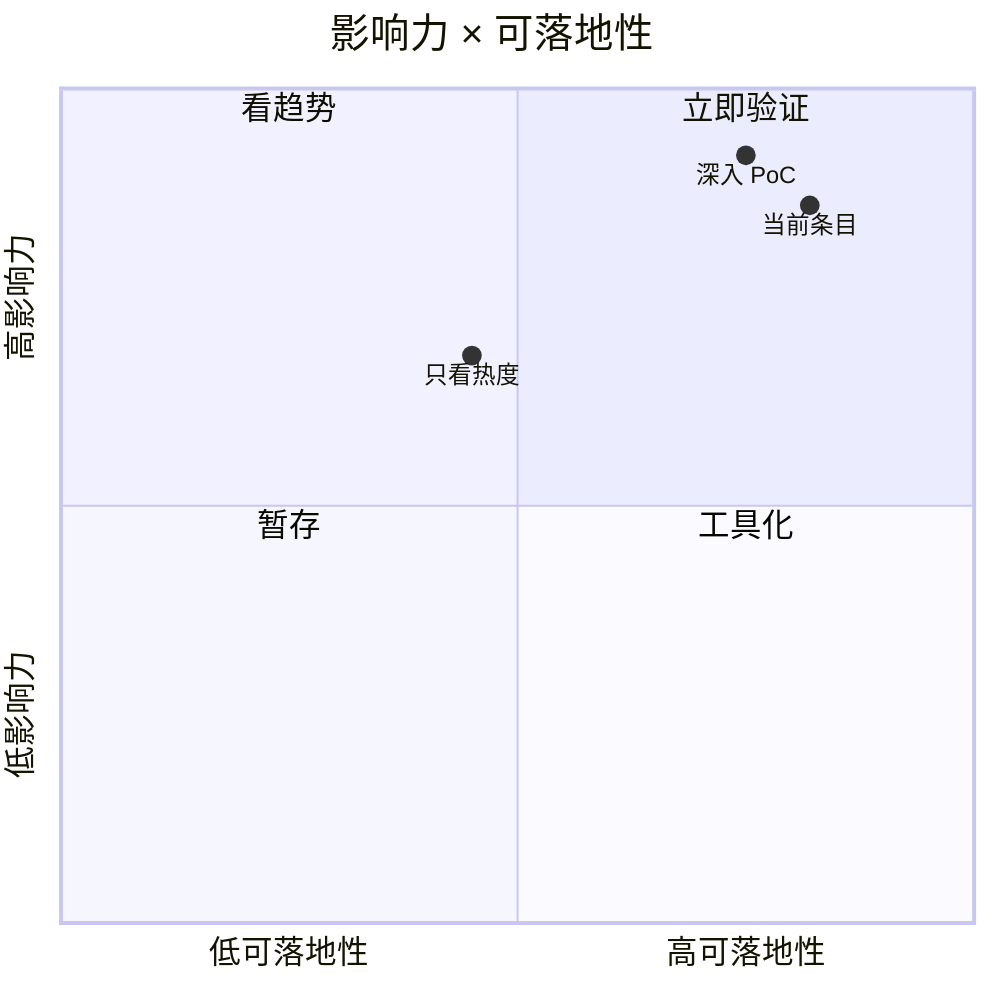

# Omnigent：Meta Agent Harness 新增长

> 类型：GitHub 项目  
> 大类：GitHub  
> 小类：Agent Framework / Meta-harness  
> 推荐等级：可 skim  
> 创建日期：2026-06-30  
> 原文链接：https://github.com/omnigent-ai/omnigent  
> 网页详情：https://github.com/dyt27666-oss/AI-news-report-obsidians/blob/main/GitHub/2026-06-30/omnigent-meta-agent-harness.md  
> 返回日报：[[Daily/2026-06-30]]

## 一句话结论
omnigent-ai/omnigent 的增长说明 Agent Framework / Meta-harness 仍是 AI agent 与 AI Infra 生态的高热度方向，但需要用工程 PoC 区分热度和真实生产价值。

## TL;DR
- **它是什么**：开源 AI agent framework 与 meta-harness，用于编排 Claude/Codex/Gemini。
- **为什么重要**：它连接当前 AI Radar 关注的 agent runtime、数据平面、serving 或知识库工作流。
- **和我相关的点**：可用于评估长期任务、工具调用、推理成本、知识沉淀或 web automation。
- **建议动作**：先读 README/release，再挑一个小任务做 PoC。

## 元信息
| 字段 | 内容 |
|---|---|
| type | GitHub 项目 |
| major | GitHub |
| minor | Agent Framework / Meta-harness |
| rank | 可 skim |
| repo | omnigent-ai/omnigent |
| stars / forks | 5588 / 710 |
| stars_delta | 864，相对最近历史 snapshot |
| language | Python |
| updated_at | 2026-06-30T10:25:32Z |

## 信息压缩图示

## 专业解读
从工程视角看，omnigent-ai/omnigent 的意义不只是 star 增长，而是它代表了一类可被产品化或平台化的 agent/infra 能力。需要重点检查接口稳定性、可观测性、权限边界、失败恢复、成本模型，以及是否能和现有 Obsidian/GitHub/CLI 工作流连接。

## 通俗解释
可以把它理解成 AI 工作流的一块新积木：有的负责让模型跑得更快，有的负责让 agent 找网页，有的负责让 agent 记住和执行长期任务。真正有价值的是能不能稳定接到自己的日常工程流程里。

## 关键机制拆解
| 机制 | 解决的问题 | 为什么有效 | 可能的坑 |
|---|---|---|---|
| 运行入口 | 降低试用门槛 | README/examples 可快速复现 | demo 容易掩盖边界条件 |
| 控制面 | 让长任务可管理 | tools、memory、scheduler 或 API 形成闭环 | 权限与状态失控风险 |
| 数据/上下文 | 提升 agent 输入质量 | 抓取、记忆、知识库或 serving 能力 | 噪声、成本和合规问题 |

## 对我的影响
| 维度 | 影响 | 建议动作 |
|---|---|---|
| AI Infra | 影响 runtime、serving 或数据平面选型 | 记录 API、吞吐、失败恢复 |
| LLM 工程 | 影响 agent workflow 与工具编排 | 做小型端到端任务验证 |
| RL / Eval | 可形成真实工具轨迹和失败样本 | 关注 trajectory schema 与 reward 信号 |

## 可信度与局限性
- 证据强度：来自可访问原始页面、GitHub snapshot 或公开 changelog。
- 局限性：star/release/news 只能说明关注度或发布信号，不等于生产成熟。
- 验证要求：需要继续看 README、examples、issue、release diff、benchmark 和失败恢复机制。

## 我应该如何跟进
1. 把该条目放入 AI Infra / Agent runtime 对照表。
2. 如果与当前工作流直接相关，做 30-60 分钟 PoC。
3. 记录工具边界、成本、失败模式和可观测性。

## 相关链接
- 原文：https://github.com/omnigent-ai/omnigent
- 网页详情：https://github.com/dyt27666-oss/AI-news-report-obsidians/blob/main/GitHub/2026-06-30/omnigent-meta-agent-harness.md

## 标签
#ai-radar #daily #ai-infra #llm #agent
