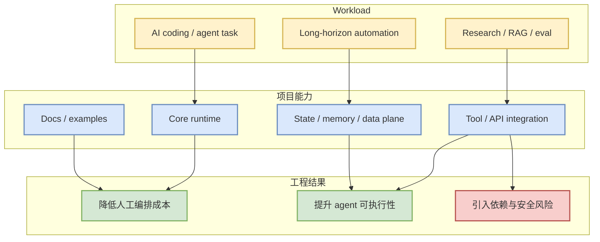

# vllm-project/vllm - LLM Serving

> 日期：2026-07-01  
> 来源：GitHub Repository  
> 原文：https://github.com/vllm-project/vllm

## 一句话结论
A high-throughput and memory-efficient inference and serving engine for LLMs.

## TL;DR
- repo：`vllm-project/vllm`
- stars/forks：55278 / 9200
- language：Python
- updated_at：2026-06-30T10:00:00Z
- topics：llm, serving, inference
- 是否值得试用：值得试用

## 元信息表
| 字段 | 内容 |
|---|---|
| 来源类型 | GitHub Repository |
| 主题 | LLM Serving |
| repo | vllm-project/vllm |
| stars_delta | None |
| 原文链接 | https://github.com/vllm-project/vllm |

## 信息压缩图示

## 专业解读
vLLM 仍是 serving/scheduler/KV cache 优化的事实参考实现，适合持续跟踪吞吐、延迟、OpenAI-compatible API 和多卡部署。 从 AI Infra 角度看，重点不是 star 数本身，而是它暴露的工程需求：agent 需要稳定 runtime、可观测 tool calls、失败恢复、权限边界和可重复的评测入口。

## 通俗解释
可以把它看成 agent 工作流里的一个基础零件：不是直接替代模型，而是帮助模型更可靠地完成任务、拿到数据或组织执行步骤。

## 关键机制拆解
| 模块 | 可能价值 | 风险 |
|---|---|---|
| Runtime / API | 可接入现有 agent pipeline | 需要验证稳定性 |
| Docs / examples | 降低 PoC 成本 | 示例可能覆盖不足 |
| Ecosystem | star 增长说明关注度高 | 热度不等于生产可用 |

## 对我的影响
- 可用于对照 AI coding workflow 的任务编排、上下文保存、工具调用与知识库落盘。
- 如果与 serving / eval / RL loop 结合，下一步应先做小规模 PoC，而不是直接接生产。

## 可信度与局限性
GitHub 元数据来自 snapshot；今日 broad GitHub 查询发生 rate limit，因此 AI infra 榜使用 2026-06-30 成功 snapshot 作为保守 fallback，并在日报显式标注。

## 我应该如何跟进
1. 读 README 与 examples。
2. 检查 release、issues、benchmark 或 demo。
3. 若涉及 agent runtime，做 1 个最小任务闭环测试。

## 相关链接
- 原文：https://github.com/vllm-project/vllm
- 今日日报：[[Daily/2026-07-01]]

#ai-radar #github #llm-serving
