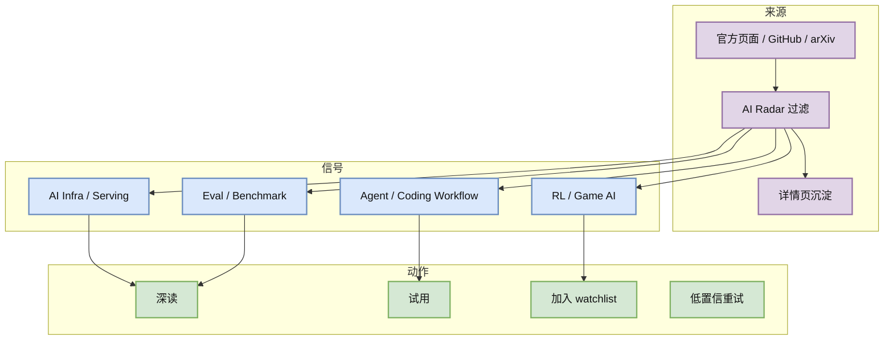

# GitHub broad growth Top 10 - 2026-07-02

> 类型：GitHub 增长榜  
> 返回日报：[[Daily/2026-07-02]]

## 一句话结论
今日增长榜使用 2026-06-30 最近成功 broad snapshot 的 historical delta fallback；不是冷启动代理，但不是今日实时增长。

## 增长信号图

## 增长最快 Top 10
| 排名 | repo | stars_delta | stars | forks | language | updated_at | 增长依据 | 重点概括 | Obsidian 详情 | 原文 |
|---:|---|---:|---:|---:|---|---|---|---|---|---|
| 1 | NousResearch/hermes-agent | 4047 | 206100 | 37255 | Python | 2026-06-30T10:56:07Z | historical_snapshot / 2026-06-30 broad fallback | The agent that grows with you | [[GitHub/2026-07-02/github-growth-watch]] | [原文](https://github.com/NousResearch/hermes-agent) |
| 2 | firecrawl/firecrawl | 3092 | 141808 | 8175 | TypeScript | 2026-06-30T10:49:38Z | historical_snapshot / 2026-06-30 broad fallback | The API to search, scrape, and interact with the web at scale. 🔥 | [[GitHub/2026-07-02/github-growth-watch]] | [原文](https://github.com/firecrawl/firecrawl) |
| 3 | affaan-m/ECC | 2505 | 223700 | 34246 | JavaScript | 2026-06-30T10:52:04Z | historical_snapshot / 2026-06-30 broad fallback | The agent harness performance optimization system. Skills, instincts, memory, security, and rese... | [[GitHub/2026-07-02/github-growth-watch]] | [原文](https://github.com/affaan-m/ECC) |
| 4 | JuliusBrussee/caveman | 1541 | 78128 | 4417 | JavaScript | 2026-06-30T10:55:40Z | historical_snapshot / 2026-06-30 broad fallback | 🪨 why use many token when few token do trick — Claude Code skill that cuts 65% of tokens by talk... | [[GitHub/2026-07-02/github-growth-watch]] | [原文](https://github.com/JuliusBrussee/caveman) |
| 5 | TauricResearch/TradingAgents | 1540 | 89905 | 17352 | Python | 2026-06-30T10:50:25Z | historical_snapshot / 2026-06-30 broad fallback | TradingAgents: Multi-Agents LLM Financial Trading Framework | [[GitHub/2026-07-02/github-growth-watch]] | [原文](https://github.com/TauricResearch/TradingAgents) |
| 6 | kepano/obsidian-skills | 1124 | 38983 | 2763 | Unknown | 2026-06-30T10:56:21Z | historical_snapshot / 2026-06-30 broad fallback | Agent skills for Obsidian. Teach your agent to use Obsidian CLI and open formats including Markd... | [[GitHub/2026-07-02/github-growth-watch]] | [原文](https://github.com/kepano/obsidian-skills) |
| 7 | bytedance/deer-flow | 1107 | 75552 | 10196 | Python | 2026-06-30T10:47:39Z | historical_snapshot / 2026-06-30 broad fallback | An open-source long-horizon SuperAgent harness that researches, codes, and creates. With the hel... | [[GitHub/2026-07-02/github-growth-watch]] | [原文](https://github.com/bytedance/deer-flow) |
| 8 | browser-use/browser-use | 1055 | 101571 | 11271 | Python | 2026-06-30T10:55:46Z | historical_snapshot / 2026-06-30 broad fallback | 🌐 Make websites accessible for AI agents. Automate tasks online with ease. | [[GitHub/2026-07-02/github-growth-watch]] | [原文](https://github.com/browser-use/browser-use) |
| 9 | thedotmack/claude-mem | 1001 | 85137 | 7347 | JavaScript | 2026-06-30T10:46:16Z | historical_snapshot / 2026-06-30 broad fallback | Persistent Context Across Sessions for Every Agent –  Captures everything your agent does during... | [[GitHub/2026-07-02/github-growth-watch]] | [原文](https://github.com/thedotmack/claude-mem) |
| 10 | omnigent-ai/omnigent | 875 | 5599 | 710 | Python | 2026-06-30T10:53:33Z | historical_snapshot / 2026-06-30 broad fallback | Omnigent is an open-source AI agent framework and meta-harness: orchestrate Claude Code, Codex, ... | [[GitHub/2026-07-02/github-growth-watch]] | [原文](https://github.com/omnigent-ai/omnigent) |

## 专业解读
增长榜继续显示 agent runtime、web data plane、Claude Code skill/上下文压缩、multi-agent harness 等方向更热。对 AI Infra 来说，用户真正买单的是可运行 agent loop：浏览器/网页数据、权限沙盒、memory、tool routing、long-horizon workflow。

## 可信度与局限性
- 历史差值来自 2026-06-30 snapshot，不是今日实时 delta。
- 今日 current snapshot 因 GitHub 403 主要保留 rummy 主题池。
- 仍满足每日固定榜单要求，但应在日报中显式标注 fallback。

#ai-radar #github-growth #agent-runtime
