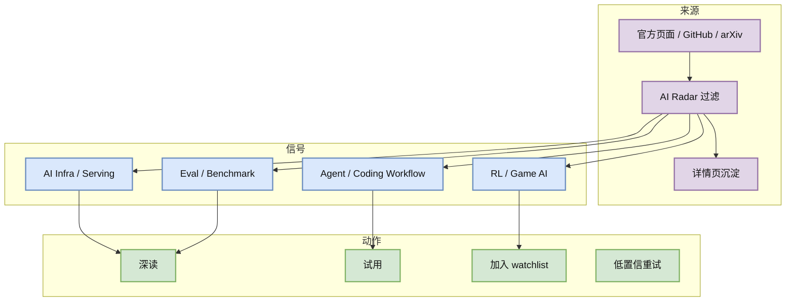

# GitHub broad snapshot Top 10 - 2026-07-02

> 类型：GitHub 榜单  
> 返回日报：[[Daily/2026-07-02]]

## 一句话结论
今日 GitHub 当前 snapshot 被 rummy niche 查询占满并触发 403 rate limit，通用 AI Infra 高 star 榜使用 2026-06-30 最近成功 broad snapshot fallback；必须低置信解读，但可保持每日固定 Top 10 导航。

## 信息压缩图示

## 高 star Top 10
| 排名 | repo | stars | forks | language | updated_at | topics | 重点概括 | 是否值得试用 | Obsidian 详情 | 原文 |
|---:|---|---:|---:|---|---|---|---|---|---|---|
| 1 | affaan-m/ECC | 223700 | 34246 | JavaScript | 2026-06-30T10:52:04Z | ai-agents, anthropic, claude, claude-code, developer-tools, llm | The agent harness performance optimization system. Skills, instincts, memory, security, and rese... | 可 skim | [[GitHub/2026-07-02/github-snapshot-top10]] | [原文](https://github.com/affaan-m/ECC) |
| 2 | NousResearch/hermes-agent | 206100 | 37255 | Python | 2026-06-30T10:56:07Z | ai, ai-agent, ai-agents, anthropic, chatgpt, claude | The agent that grows with you | 值得试用 | [[GitHub/2026-07-02/github-snapshot-top10]] | [原文](https://github.com/NousResearch/hermes-agent) |
| 3 | tensorflow/tensorflow | 195981 | 75210 | C++ | 2026-06-30T10:53:02Z | deep-learning, deep-neural-networks, distributed, machine-learning, ml, neural-network | An Open Source Machine Learning Framework for Everyone | 可 skim | [[GitHub/2026-07-02/github-snapshot-top10]] | [原文](https://github.com/tensorflow/tensorflow) |
| 4 | Significant-Gravitas/AutoGPT | 185228 | 46116 | Python | 2026-06-30T10:49:43Z | agentic-ai, agents, ai, artificial-intelligence, autonomous-agents, claude | AutoGPT is the vision of accessible AI for everyone, to use and to build on. Our mission is to p... | 可 skim | [[GitHub/2026-07-02/github-snapshot-top10]] | [原文](https://github.com/Significant-Gravitas/AutoGPT) |
| 5 | ollama/ollama | 175177 | 16771 | Go | 2026-06-30T10:55:05Z | deepseek, gemma, gemma3, glm, go, golang | Get up and running with Kimi-K2.6, GLM-5.1, MiniMax, DeepSeek, gpt-oss, Qwen, Gemma and other mo... | 值得试用 | [[GitHub/2026-07-02/github-snapshot-top10]] | [原文](https://github.com/ollama/ollama) |
| 6 | f/prompts.chat | 164555 | 21292 | HTML | 2026-06-30T10:24:59Z | ai, artificial-intelligence, awesome-list, chatgpt, chatgpt-prompts, claude | f.k.a. Awesome ChatGPT Prompts. Share, discover, and collect prompts from the community. Free an... | 可 skim | [[GitHub/2026-07-02/github-snapshot-top10]] | [原文](https://github.com/f/prompts.chat) |
| 7 | huggingface/transformers | 162049 | 33669 | Python | 2026-06-30T10:37:17Z | audio, deep-learning, deepseek, gemma, glm, hacktoberfest | 🤗 Transformers: the model-definition framework for state-of-the-art machine learning models in t... | 值得试用 | [[GitHub/2026-07-02/github-snapshot-top10]] | [原文](https://github.com/huggingface/transformers) |
| 8 | langflow-ai/langflow | 150233 | 9362 | Python | 2026-06-30T10:48:19Z | agents, chatgpt, generative-ai, large-language-models, multiagent, react-flow | Langflow is a powerful tool for building and deploying AI-powered agents and workflows. | 可 skim | [[GitHub/2026-07-02/github-snapshot-top10]] | [原文](https://github.com/langflow-ai/langflow) |
| 9 | langgenius/dify | 147098 | 23165 | TypeScript | 2026-06-30T10:50:44Z | agent, agentic-ai, agentic-framework, agentic-workflow, ai, automation | Production-ready platform for agentic workflow development. | 值得试用 | [[GitHub/2026-07-02/github-snapshot-top10]] | [原文](https://github.com/langgenius/dify) |
| 10 | open-webui/open-webui | 143525 | 20689 | Python | 2026-06-30T10:40:48Z | ai, llm, llm-ui, llm-webui, llms, mcp | User-friendly AI Interface (Supports Ollama, OpenAI API, ...) | 值得试用 | [[GitHub/2026-07-02/github-snapshot-top10]] | [原文](https://github.com/open-webui/open-webui) |

## 解读
这些项目仍覆盖 agent runtime、local serving、model frameworks、agent app platform 与 web data plane。由于今天 broad 查询 rate-limited，本页更像“稳定导航 + 低置信 fallback”，不要把 stars_delta 当作 7/2 实时热度。

## 可信度与局限性
- 当前 snapshot：`Automation/state/github-stars-2026-07-02.json` 已保存，repos=99，errors=39。
- fallback snapshot：`Automation/state/github-stars-2026-06-30.json`，repos=228。
- 风险：新项目可能漏掉，旧项目 stars 不是今日实时值。

#ai-radar #github #ai-infra
