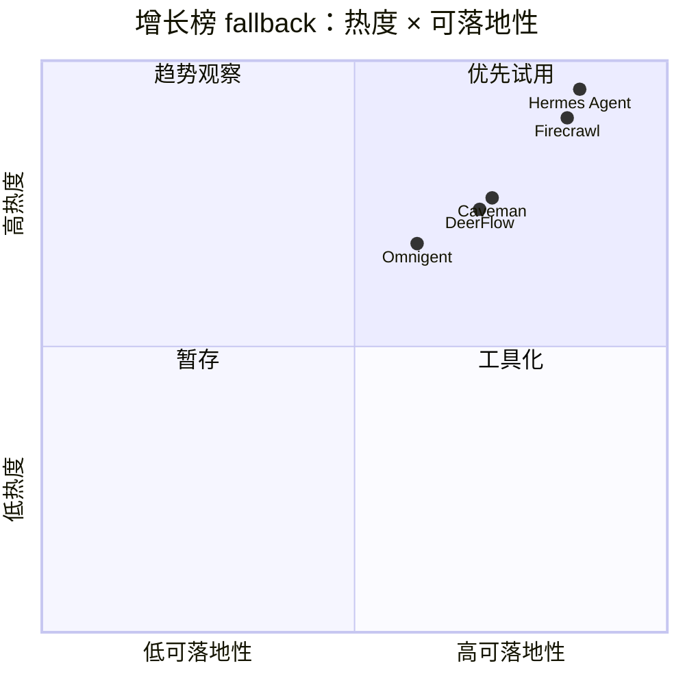

# GitHub star 增长 watch fallback - 2026-07-03

> 类型：GitHub 增长榜  
> 返回日报：[[Daily/2026-07-03]]  
> 来源：2026-06-30 broad snapshot historical delta fallback；今日 broad GitHub API rate-limited。

## 一句话结论

增长榜 fallback 显示 agent runtime、web data plane、context/memory 和 long-horizon harness 是近期高热方向，但今日不能当作真实 7/3 日增解读。

## Growth Top 10

| 排名 | repo | stars_delta | stars | 重点 | 原文 |
|---:|---|---:|---:|---|---|
| 1 | NousResearch/hermes-agent | 4047 | 206100 | 可生长 agent runtime。 | https://github.com/NousResearch/hermes-agent |
| 2 | firecrawl/firecrawl | 3092 | 141808 | Agent/RAG web data plane。 | https://github.com/firecrawl/firecrawl |
| 3 | affaan-m/ECC | 2505 | 223700 | Agent harness optimization。 | https://github.com/affaan-m/ECC |
| 4 | JuliusBrussee/caveman | 1541 | 78128 | Claude Code token/context compression。 | https://github.com/JuliusBrussee/caveman |
| 5 | TauricResearch/TradingAgents | 1540 | 89905 | Multi-agent framework。 | https://github.com/TauricResearch/TradingAgents |
| 6 | kepano/obsidian-skills | 1124 | 38983 | Agent skills for Obsidian。 | https://github.com/kepano/obsidian-skills |
| 7 | bytedance/deer-flow | 1107 | 75552 | Long-horizon SuperAgent harness。 | https://github.com/bytedance/deer-flow |
| 8 | browser-use/browser-use | 1055 | 101571 | Browser automation for agents。 | https://github.com/browser-use/browser-use |
| 9 | thedotmack/claude-mem | 1001 | 85137 | Persistent context for agents。 | https://github.com/thedotmack/claude-mem |
| 10 | omnigent-ai/omnigent | 875 | 5599 | Meta-harness for Claude Code / Codex。 | https://github.com/omnigent-ai/omnigent |

## 影响矩阵

## 标签

#ai-radar #github #growth #fallback
