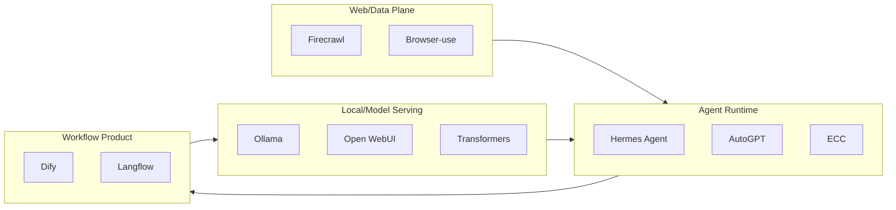

# GitHub 高 star Top 10 fallback - 2026-07-03

> 类型：GitHub 榜单  
> 返回日报：[[Daily/2026-07-03]]  
> 来源：2026-06-30 broad snapshot fallback；今日 broad GitHub API rate-limited。

## 一句话结论

今日通用 GitHub 搜索受限，因此继续使用最近成功 broad snapshot；Agent runtime、web data plane、本地 serving 和 agent workflow platform 仍是主线。

## Top 10

| 排名 | repo | stars | 重点 | 原文 |
|---:|---|---:|---|---|
| 1 | affaan-m/ECC | 223700 | Agent harness / skills / memory / security。 | https://github.com/affaan-m/ECC |
| 2 | NousResearch/hermes-agent | 206100 | 可生长 agent runtime。 | https://github.com/NousResearch/hermes-agent |
| 3 | tensorflow/tensorflow | 195981 | ML framework / distributed training。 | https://github.com/tensorflow/tensorflow |
| 4 | Significant-Gravitas/AutoGPT | 185228 | Autonomous agent ecosystem。 | https://github.com/Significant-Gravitas/AutoGPT |
| 5 | ollama/ollama | 175177 | Local LLM serving。 | https://github.com/ollama/ollama |
| 6 | f/prompts.chat | 164555 | Prompt pattern repository。 | https://github.com/f/prompts.chat |
| 7 | huggingface/transformers | 162049 | Model engineering foundation。 | https://github.com/huggingface/transformers |
| 8 | langflow-ai/langflow | 150233 | Agent workflow platform。 | https://github.com/langflow-ai/langflow |
| 9 | langgenius/dify | 147098 | Production agentic workflow app platform。 | https://github.com/langgenius/dify |
| 10 | open-webui/open-webui | 143525 | Local/open model UI with MCP direction。 | https://github.com/open-webui/open-webui |

## 架构关系图

## 标签

#ai-radar #github #fallback #agent-runtime
