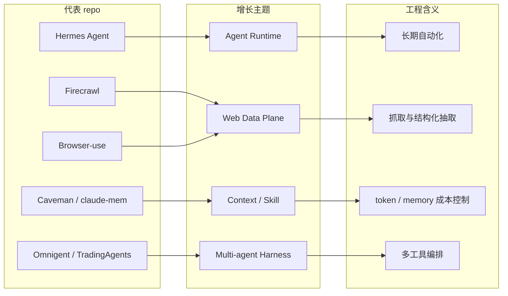

# GitHub star 增长最快 Top 10 - 2026-07-04

> 类型：GitHub growth watch  
> 返回日报：[[Daily/2026-07-04]]  
> 来源：`Automation/state/github-stars-2026-07-04.json` + `Automation/state/github-stars-2026-06-30.json` fallback

## 一句话结论

今日 broad GitHub 查询被 403 rate limit 截断；增长榜沿用 2026-06-30 最近成功 broad snapshot 的 historical delta，不是冷启动代理，但需低置信使用。

## GitHub star 增长最快 Top 10

| 排名 | repo | stars_delta | stars | forks | language | updated_at | 增长依据 | 重点概括 | 原文 |
|---:|---|---:|---:|---:|---|---|---|---|---|
| 1 | NousResearch/hermes-agent | 4047 | 206100 | 37255 | Python | 2026-06-30T10:56:07Z | historical_snapshot / 2026-06-30 broad fallback | 可生长 agent runtime，长期自动化、skills、cron、memory 方向高信号。 | https://github.com/NousResearch/hermes-agent |
| 2 | firecrawl/firecrawl | 3092 | 141808 | 8175 | TypeScript | 2026-06-30T10:49:38Z | historical_snapshot / 2026-06-30 broad fallback | Agent/RAG web data plane，搜索、抓取、结构化抽取。 | https://github.com/firecrawl/firecrawl |
| 3 | affaan-m/ECC | 2505 | 223700 | 34246 | JavaScript | 2026-06-30T10:52:04Z | historical_snapshot / 2026-06-30 broad fallback | Agent harness performance optimization，skills/memory/security。 | https://github.com/affaan-m/ECC |
| 4 | JuliusBrussee/caveman | 1541 | 78128 | 4417 | JavaScript | 2026-06-30T10:55:40Z | historical_snapshot / 2026-06-30 broad fallback | Claude Code token 压缩 skill，指向 context/cost engineering。 | https://github.com/JuliusBrussee/caveman |
| 5 | TauricResearch/TradingAgents | 1540 | 89905 | 17352 | Python | 2026-06-30T10:50:25Z | historical_snapshot / 2026-06-30 broad fallback | Multi-agent framework，可作为多 agent 决策/评估结构参考。 | https://github.com/TauricResearch/TradingAgents |
| 6 | kepano/obsidian-skills | 1124 | 38983 | 2763 | Unknown | 2026-06-30T10:56:21Z | historical_snapshot / 2026-06-30 broad fallback | Agent skills for Obsidian，和知识库/skills 工作流强相关。 | https://github.com/kepano/obsidian-skills |
| 7 | bytedance/deer-flow | 1107 | 75552 | 10196 | Python | 2026-06-30T10:47:39Z | historical_snapshot / 2026-06-30 broad fallback | Long-horizon SuperAgent harness，research/code/create workflow。 | https://github.com/bytedance/deer-flow |
| 8 | browser-use/browser-use | 1055 | 101571 | 11271 | Python | 2026-06-30T10:55:46Z | historical_snapshot / 2026-06-30 broad fallback | Browser automation for agents，web action loop 关键组件。 | https://github.com/browser-use/browser-use |
| 9 | thedotmack/claude-mem | 1001 | 85137 | 7347 | JavaScript | 2026-06-30T10:46:16Z | historical_snapshot / 2026-06-30 broad fallback | Agent persistent context，适合对比 Hermes memory / skill。 | https://github.com/thedotmack/claude-mem |
| 10 | omnigent-ai/omnigent | 875 | 5599 | 710 | Python | 2026-06-30T10:53:33Z | historical_snapshot / 2026-06-30 broad fallback | Meta-harness orchestrating Claude Code / Codex 等工具。 | https://github.com/omnigent-ai/omnigent |

## 增长信号图

## 可信度与局限性

- 增长值来自历史 snapshot 差值，但不是今日 broad search 的实时结果。
- 今日 `Automation/state/github-stars-2026-07-04.json` 已保存；由于 broad 查询 403，它主要反映 rummy niche 结果。
- 明日应继续先跑 niche，再用更少 broad query 或认证 token 降低 rate limit 风险。

## 标签

#ai-radar #github #growth #agent-runtime #fallback
