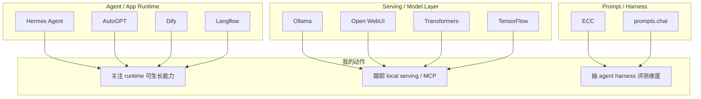

# GitHub 高 star Top 10 - 2026-07-04

> 类型：GitHub snapshot watch  
> 返回日报：[[Daily/2026-07-04]]  
> 来源：`Automation/state/github-stars-2026-07-04.json` + `Automation/state/github-stars-2026-06-30.json` fallback

## 一句话结论

今日 GitHub broad search 在 rummy niche 查询后触发 403 rate limit；通用高 star Top 10 使用 2026-06-30 最近成功 broad snapshot fallback，今日 snapshot 保留 Point Rummy 主题池。

## GitHub 高 star Top 10

| 排名 | repo | stars | forks | language | updated_at | topics | 重点概括 | 是否值得试用 | 原文 |
|---:|---|---:|---:|---|---|---|---|---|---|
| 1 | affaan-m/ECC | 223700 | 34246 | JavaScript | 2026-06-30T10:52:04Z | ai-agents, anthropic, claude, claude-code, developer-tools, llm | Agent harness performance optimization system，skills / memory / security / research loop 信号强。 | 可 skim | https://github.com/affaan-m/ECC |
| 2 | NousResearch/hermes-agent | 206100 | 37255 | Python | 2026-06-30T10:56:07Z | ai, ai-agent, ai-agents, anthropic, chatgpt, claude | 可生长 agent runtime，tools / skills / cron / memory 与本日报系统高度相关。 | 值得试用 | https://github.com/NousResearch/hermes-agent |
| 3 | tensorflow/tensorflow | 195981 | 75210 | C++ | 2026-06-30T10:53:02Z | deep-learning, distributed, machine-learning, ml | 老牌 ML framework，训练栈和分布式生态仍需跟踪但今日非新信号。 | 可 skim | https://github.com/tensorflow/tensorflow |
| 4 | Significant-Gravitas/AutoGPT | 185228 | 46116 | Python | 2026-06-30T10:49:43Z | agentic-ai, agents, ai, autonomous-agents | 早期 autonomous agent 生态代表，适合观察产品化和 agent UX。 | 可 skim | https://github.com/Significant-Gravitas/AutoGPT |
| 5 | ollama/ollama | 175177 | 16771 | Go | 2026-06-30T10:55:05Z | deepseek, gemma, glm, golang | 本地模型 serving 入口，适合开发环境、测试和 edge LLM workflow。 | 值得试用 | https://github.com/ollama/ollama |
| 6 | f/prompts.chat | 164555 | 21292 | HTML | 2026-06-30T10:24:59Z | ai, awesome-list, chatgpt, claude | Prompt 资源库，工程价值低于 runtime/serving，但可做 prompt pattern 参考。 | 可 skim | https://github.com/f/prompts.chat |
| 7 | huggingface/transformers | 162049 | 33669 | Python | 2026-06-30T10:37:17Z | audio, deep-learning, transformers | 模型定义与推理/训练生态基础库，仍是模型工程必跟。 | 值得试用 | https://github.com/huggingface/transformers |
| 8 | langflow-ai/langflow | 150233 | 9362 | Python | 2026-06-30T10:48:19Z | agents, generative-ai, large-language-models, multiagent | Agent/workflow 可视化平台，适合观察低代码 agent productization。 | 可 skim | https://github.com/langflow-ai/langflow |
| 9 | langgenius/dify | 147098 | 23165 | TypeScript | 2026-06-30T10:50:44Z | agent, agentic-ai, agentic-workflow, ai | 生产级 agentic workflow 平台，RAG/agent app 落地相关。 | 值得试用 | https://github.com/langgenius/dify |
| 10 | open-webui/open-webui | 143525 | 20689 | Python | 2026-06-30T10:40:48Z | ai, llm, llm-ui, mcp | Local/open model UI，MCP 与本地 serving 结合值得观察。 | 值得试用 | https://github.com/open-webui/open-webui |

## 架构图：榜单映射到工程栈

## 可信度与局限性

- 通用 broad 查询今日 rate-limited，本页使用 2026-06-30 成功 broad snapshot fallback。
- 今日真实 snapshot 已保存，包含 48 个 repo，但主要是 Point Rummy 主题池，不适合直接当通用 AI GitHub 高 star 榜。
- 本页不标注冷启动代理，因为存在历史 broad snapshot；但需要低置信解读。

## 标签

#ai-radar #github #ai-infra #agent-runtime #fallback
