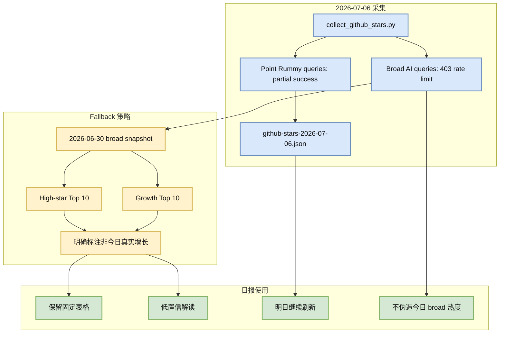

# GitHub Top 10：今日 broad search rate limit，通用榜单使用 2026-06-30 fallback

> 类型：GitHub 详情  
> 大类：GitHub / AI Infra / Agent Runtime  
> 推荐等级：可 skim  
> 创建日期：2026-07-06  
> 原始来源：https://github.com/search?q=topic%3Aartificial-intelligence&type=repositories  
> 网页详情：https://github.com/dyt27666-oss/AI-news-report-obsidians/blob/main/GitHub/2026-07-06/github-snapshot-top10-fallback.md  
> 返回日报：[[Daily/2026-07-06]]

## 一句话结论

今日 GitHub snapshot 成功保存了 Point Rummy 主题 repo，但 broad AI 查询在中途被 403 rate limit 截断，因此通用“高 star / 增长”榜单沿用 2026-06-30 最近成功 broad snapshot，不能解读为今日真实热度。

## TL;DR

- **今日状态**：`Automation/state/github-stars-2026-07-06.json` 已生成，包含 87 个 repo，主要来自 Point Rummy 主题查询。
- **问题**：通用 AI / LLM / agent broad queries 遭遇 rate limit，无法生成可信今日 broad Top 10。
- **fallback**：高 star 和增长榜使用 2026-06-30 broad snapshot。
- **使用方式**：保留固定导航和 watchlist，但所有增长解释都必须标注 fallback。

## 元信息

| 字段 | 内容 |
|---|---|
| 来源 | GitHub Search API / local snapshot |
| 来源类型 | Repository metadata / fallback snapshot |
| 今日 snapshot | `Automation/state/github-stars-2026-07-06.json` |
| 今日 repo 数 | 87 |
| 错误 | 40 个 403 rate limit / 访问失败记录 |
| fallback snapshot | `Automation/state/github-stars-2026-06-30.json` |
| 原文 | https://github.com/search?q=topic%3Aartificial-intelligence&type=repositories |

## 信息压缩图示

## 2026-06-30 fallback 高 star Top 10

| 排名 | repo | stars | forks | 语言 | 说明 |
|---:|---|---:|---:|---|---|
| 1 | affaan-m/ECC | 223700 | 34246 | JavaScript | agent harness / Claude Code skill 生态信号 |
| 2 | NousResearch/hermes-agent | 206100 | 37255 | Python | agent runtime / skills / memory |
| 3 | tensorflow/tensorflow | 195981 | 75210 | C++ | ML 框架基座 |
| 4 | Significant-Gravitas/AutoGPT | 185228 | 46116 | Python | agent framework 历史高热 |
| 5 | ollama/ollama | 175177 | 16771 | Go | local model serving / runtime |
| 6 | f/prompts.chat | 164555 | 21292 | HTML | prompt 资产库 |
| 7 | huggingface/transformers | 162049 | 33669 | Python | model definition / training / inference 基座 |
| 8 | langflow-ai/langflow | 150233 | 9362 | Python | agent workflow builder |
| 9 | langgenius/dify | 147098 | 23165 | TypeScript | production agent workflow platform |
| 10 | open-webui/open-webui | 143525 | 20689 | Python | model UI / local serving 入口 |

## 专业解读

今日 snapshot 的价值主要是“保存状态”而不是“发现 broad 新热点”。GitHub API 在主题查询后开始 rate limit，使通用 AI Infra / LLM / agent 查询不完整。为了满足日报固定结构，同时避免伪造热度，最安全做法是：今日文件照常保存；通用 Top 10 使用最近成功 broad snapshot；Point Rummy 使用今日主题结果；所有 fallback 都显式标注。

从 2026-06-30 broad snapshot 看，agent runtime、local serving、workflow platform、web data plane 仍是 GitHub AI 工程生态的核心：Hermes Agent、Ollama、Dify、Open WebUI、Firecrawl、Browser Use 等分别对应 agent control plane、本地模型运行、工作流编排和 web 数据入口。

## 对我的影响

| 维度 | 影响 | 建议动作 |
|---|---|---|
| AI Infra | GitHub broad 榜单今天不可作为真实热度 | 使用 fallback，只做 watchlist |
| Agent workflow | 高 star 生态仍围绕 runtime / workflow / memory | 继续跟踪 Hermes、Dify、Open WebUI |
| 数据质量 | snapshot 存在主题偏置 | 明日优先 broad query 或使用 token |
| 报告可信度 | 必须透明标注 rate limit | 不写“今日爆发”类判断 |

## 可信度与局限性

- 今日 snapshot 文件真实存在，但 broad query 不完整。
- 2026-06-30 fallback 可用于导航，不可用于今日增长判断。
- stars_delta 使用历史 snapshot 时也不是 2026-07-06 的真实日增。

## 我应该如何跟进

1. 明日重新运行 broad queries，并优先通用 AI / LLM / serving 查询。
2. 若连续 403，考虑配置 GitHub token 或降低 query 数量。
3. 将 broad fallback 与主题 snapshot 在日报中分开解读。

## 相关链接

- 今日 snapshot：`Automation/state/github-stars-2026-07-06.json`
- fallback snapshot：`Automation/state/github-stars-2026-06-30.json`
- GitHub search：https://github.com/search?q=topic%3Aartificial-intelligence&type=repositories
- 返回：[[Daily/2026-07-06]]

## 标签

#ai-radar #github #fallback #ai-infra
